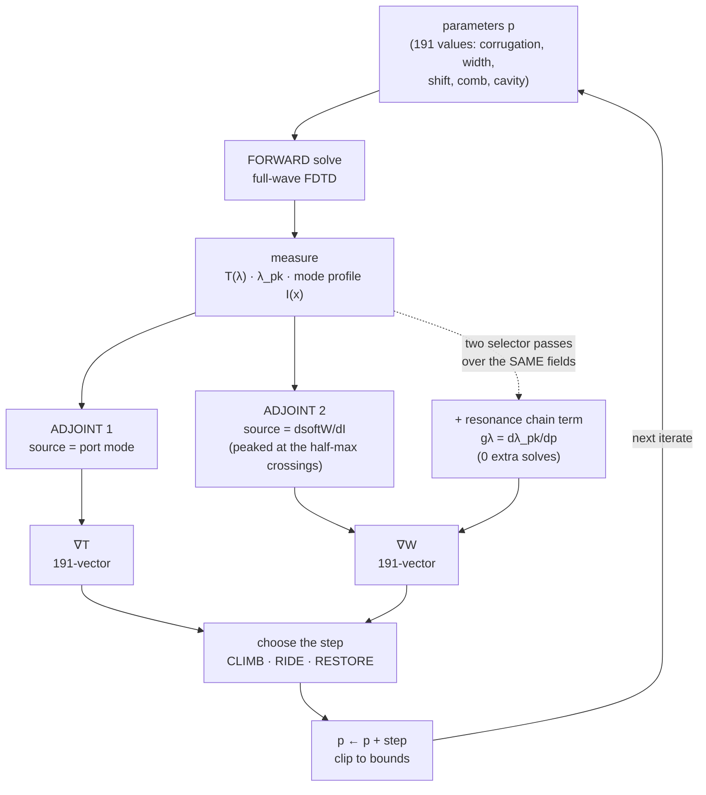

# PROJECT HANDOFF — π-shift Bragg grating FDTD program

**Repo:** `C:\Users\evyat\Lumerical\phase_shift_grating_FTDT_codes`
**Written:** 2026-09-29 · git branch `add-claude-rules-skills` @ `9b8de59`
**Updated:** 2026-10-06 · @ `eb5ef1f`. **Part 6 (new) covers 2026-09-29 → 2026-10-06**:
- the TE inverse-design lane and the v3 optimizer step;
- the GPT-6-Astra reviews;
- the far-field multipole / radiation-cancellation study;
- the research-proposal figure;
- the AI benchmark;
- the week's incidents.

Where Part 6 and Parts 0–5 disagree, Part 6 is newer and wins.

**This file is SELF-CONTAINED (2026-10-06).** You do not need to open any other file to know the
project: the rules (`CLAUDE.md`), every skill (the written procedures), the inverse-design theory, its
full history and its live log are all copied in verbatim (Parts 8–10), and the resonance method is in
Part 7. File paths are still given so that, if you DO have repo access, you can check the live copy:
**the code and the live files win over this snapshot** wherever they differ.

**Reading order:** Part 0 (rules digest) → Part 7 (resonance) → Part 10 (inverse design: history, theory,
live state) → Part 6 (last week) → Part 8 (skills = how every recurring task is done) → Part 9 (the rules
verbatim) → Parts 1–5 as reference.

**Audience:** a new AI assistant (any vendor) or a new human collaborator, with read/write
access to this repo and to the two Technion SLURM clusters, and with **no prior context**.

This file is the complete transfer of what ~40 working sessions accumulated: the device, the
physics results, the code, the cluster operations, and the working rules. It is organised so
you can read Part 0 (20 minutes) and start being useful, then consult Parts 1–4 as reference.

> **Provenance discipline used throughout.** Every quantitative claim in this document is
> labelled implicitly by where it came from: numbers with a job ID or a `.mat`/`.jsonl` path
> are MEASURED; numbers marked "predicted"/"model" are EXPECTED. When you restate any of them
> to the user, keep the label. Never present a remembered number as a freshly measured one.

---

## Contents

**Part 0 — Orientation and working rules** (read this first)
- §0 Orientation: the device, the goal, how work gets done, the cost model
- §1 Correctness rules you must not break (resonance, Q, the two FWHMs, sanity checks, mesh)
- §2 Verification policy: smoke-test, but don't over-test
- §3 Cost discipline and server safety
- §4 Working with this user
- §5 Code and style conventions
- §6 Where the live state lives (the authoritative files)

**Part 1 — The physics: canon, verdicts, devices, models, traps**
- §1 Device and geometry canon
- §2 Closed studies — the verdict table
- §3 The device scoreboard — best known devices
- §4 Physics models and predictive tools (the q3db engine, CMT, Q3dB method, comb model, target locking, radiation rules, width levers, the high-Q adequacy trap)
- §5 Inverse design (lumopt2) — method and state
- §6 Infrastructure facts
- §7 Traps and gotchas — the complete catalogue (305 numbered entries; 286–305 added 2026-10-06)
- §8 Open threads and next steps

**Part 2 — Cluster operations manual** (hosts, deploy flags, dispatch, status, fetch, job scripts, IGUM differences, failure signatures, adding a study)

**Part 3 — Code and data inventory** (engine modules and the full knob surface, the runners tree, python_tools, MATLAB, result layout, verification gates, repo docs)

**Part 4 — The written recipes** (`.claude/skills/`)

**Part 5 — Current state and a first-hour checklist** (state as of 2026-09-29; the current state is in Part 6 §6.1 and §6.2.5)

**Part 7 — How the resonance is found** (the algorithm with code, the engine's version, scan-window rules, sanity checks)

**Part 8 — The skills, verbatim** (all 13 project procedures + the user-level ask-gpt skill)

**Part 9 — `CLAUDE.md`, verbatim** (the canonical always-on rules)

**Part 10 — The inverse-design programme in full** (complete chronological history; THEORY.md; the 2026-09-01 TM handoff; the stored design vectors; the live TE-lane log)

**Part 6 — What happened 2026-09-29 → 2026-10-06** (timeline, TE inverse-design lane, v3 step engine, GPT reviews, far-field multipoles, proposal figure, AI benchmark, incidents, rule changes, git state)

**Companion file — `docs/HANDOFF_APPENDIX_memory_dump.md`** (876 KB, 13,079 lines): the verbatim,
lossless dump of all memory files this handoff was distilled from (regenerated 2026-10-06). Use it to trace any number
back to its source file and incident narrative.

---

## 0. Orientation

### 0.1 What the device is

A **pi-shift Bragg grating** (always call it that in discussion and writeups — not "phase
shift grating", not "cavity", not "DBR"): a silicon-nitride ridge waveguide whose sidewalls
are corrugated at the Bragg pitch, with a **half-period phase slip at the centre**. The slip
opens a single localised defect resonance inside the photonic stopband. Light launched from
one port tunnels through that defect state and out the other port.

```
   ...[narrow][wide][narrow][wide]  ||π||  [wide][narrow][wide][narrow]...
        N periods, left arm          slip        N periods, right arm
                                      ↑
                     defect mode lives here, ~10-20 µm FWHM along x
```

Key structure facts:
- Material: Si3N4 core, SiO2 cladding. Constant indices are used by default:
  **`n_core = 1.97`, `n_clad = 1.444`** (stable across the whole program).
- Propagation is along **x**; **y** is the lateral (corrugation) direction; **z** is the
  growth direction (core height). Core height default **350 nm**.
- Symmetric device: `n_periods_each_side` per arm ("N=80" always means 80 *per side*).
- The corrugation is described by an **average width** and a **corrugation depth**
  (= wide − narrow), not by two separate widths.

### 0.2 What the program is trying to achieve

The device is meant as an **acousto-optic / acoustic detector element**. That fixes the
figure of merit in an unusual way:

1. **The spatial mode width is a HARD SPEC, not something to minimise.** The acoustic
   interaction needs the optical mode to overlap a specific acoustic footprint, so the
   spec is two-sided: **narrowing the mode does not help**. Typical targets: 20 µm, 14 µm.
2. Subject to that fixed width, **maximise on-resonance transmission T** (equivalently
   minimise radiation loss), and **maximise loaded Q**.
3. A recurring deliverable is the **"Q3dB device"**: the device whose peak transmission sits
   at a chosen dB point (usually **−3 dB, T ≈ 0.50**) at a chosen mode width, with the
   highest Q obtainable there. Q and T trade against each other through device length, so
   "the −3 dB point" is the agreed operating point that makes Q comparable across designs.

Two polarizations are studied, with separate anchored geometries: **TE** (the original) and
**TM** (added later; radiates more, has roughly half TE's light-cone margin).

### 0.3 The three ways work gets done here

| Mode | What it is | Where |
|---|---|---|
| **Parametric sweeps** | one declarative `SweepSpec` per study → a SLURM array, one FDTD sim per combination | `runners/sweeps/` |
| **Predict-then-confirm** | a calibrated semi-analytic engine predicts T/λ/Q/widths for a proposed device; ONE FDTD run confirms against pre-registered bands; the engine is refit | `python_tools/predict_q3db.py` |
| **Adjoint inverse design** | lumopt2 + a 191-parameter design vector, projected-gradient with a hard width constraint | `runners/lumopt2_design/` |

The predict-then-confirm engine is the single biggest productivity gain in the program: it
replaced multi-run tuning ladders with one confirmation run, and it has held on hold-out
backtests (48/50) and on three live predictions. **Use it before dispatching any length or
corrugation tuning ladder.** Coupled-mode theory is *authorized* for that engine; it is
*banned* inside the lumopt2 optimizer (see Part 1 §5).

### 0.4 Cost model — why the rules below are strict

One FDTD solve of the real device is **~1 GPU-hour**. An inverse-design iteration is ~2.5
GPU-h. A long campaign is 10–100 GPU-h. License seats are shared with the whole faculty and
a single GPU solve consumes ~7 of ~42 effective seats, so **at most ~6 concurrent solves
exist in the world** for this project. Every Athena GPU partition preempts by REQUEUE.

The consequence, which is the single most important cultural fact about this project:
**a simulation run is never a trivial action.** The accumulated rules exist because real
incidents cost real GPU-days — a dead TM device ran for 8 GPU-h, a bad gradient burned 30,
a mesh artifact 20, a source-phase bug wasted weeks. Under-testing has repeatedly cost
hours; over-testing has never once cost anything.

---

## 1. Correctness rules you must not break

These are physics/measurement invariants. Violating one silently produces confident garbage.

### 1.1 Resonance and Q

- **Never pick the resonance by `max(T)` or `argmax(T)`.** The global T maximum sits in the
  passband (~1570 nm), not at the defect peak. Use the stored `resonance_wavelength_nm`
  field, or the peak finder in `matlab_plotting/plot_transmission.m` (a sharpness × dip-depth
  scorer inside the stopband).
- **"FWHM" means the SPECTRAL FWHM** (`spectral_fwhm_nm`, from T(λ)) unless the user says
  "spatial". The stored value is **often negative** → always use `|spectral_fwhm_nm|`.
- **Q = `resonance_wavelength_nm` / |`spectral_fwhm_nm`|.**
- **`fwhm_m` is the SPATIAL mode width** (energy vs x) — the acoustic spec quantity. It is a
  completely different number from the spectral FWHM. Confusing the two is a recurring error;
  there is a memory file dedicated to it.
- Mode width is measured **exactly one way**: `sim_helpers.extract_and_process_field_profile`,
  the same convention as `post_processing`'s `fwhm_m`. A raw-line variant, fitted width
  slopes, and a CMT width model were all tried, all wrong, and all deleted by user order —
  **do not reintroduce them**.
- **Every `sigma` / `FWHM` logged by the inverse-design engine before 2026-08-18 is VOID**
  (the extraction never integrated over y). T, λ, Q, R and loss from that era are unaffected.

### 1.2 The mandatory post-run sanity check

Before trusting or building on ANY FDTD result:

1. `resonance_wavelength_nm` exists, is finite, and lies **inside** the scan window.
2. Peak T is above a sane floor. A dead device reads **T ≈ 0.0008**. Healthy TM peaks can be
   as low as ~0.83 in some families, so use a low floor, not a TE-tuned one.
3. If either fails: **stop and say so** ("no resonance found / off-window / dead device").
   Do not build downstream conclusions. A "converged" optimization on a dead device returns
   confident nonsense — this has happened.

### 1.3 Single-wavelength extractions

Monitors and extractions at one wavelength must key off the **index of
`resonance_wavelength_nm`** in the recorded band. Never use "1 frequency point + source
limits" — that records at the band-centre *frequency* (≈1546.4 nm here), not at the
resonance. Far-field was plotted at the wrong λ twice this way.

### 1.4 Comparing absolute numbers

- **Absolute T and loss are numerics-sensitive. Compare only within identical numerics.**
  For strongly-radiating variants, the transverse box size alone moves absolute T by ~3
  points (3.8 → 4.8 µm: 0.828 → 0.799), and the mesher choice moves it again.
- Every sweep carries **its own in-study no-change control at the exact same numerics**, and
  all reported deltas are versus that control. A *stored* identical-numerics control
  satisfies this — do not re-measure it (see §3.2).
- **A candidate effect near the numerical noise floor is not a result.** Measure the floor
  inside the sweep (repeat a few points offset by half a mesh cell), then confirm survivors
  at `simulation_mode="accurate"`. Template incident: a +0.0020 T effect sat exactly at the
  dx = 50 nm jitter floor of 0.0018; at dx ≈ 35 nm the jitter collapsed to 0.0001 and the
  effect survived. That two-step is the standard.
- **Two meshers coexist in this project** (PVA vs conformal). The same device reads λ +5.3 nm
  and FWHM −8% between them. Never compare across meshers. The spec is conformal; PVA is
  used as a first-order gradient tool only.

### 1.5 Mesh policy

- `simulation_mode = "optimization"` (dx = 50 nm) is the **default** and the right choice for
  all sweeps and optimizations.
- `"accurate"` (dx ≈ 35 nm) is reserved for **final / fab-comparison validation**. It is
  case-dependent, never automatic.

### 1.6 Geometry defaults are DEFAULTS, not constants

Indices are stable. The anchored TM geometry is **per core height** and has changed several
times: for height 350 nm it is pitch **516.83 nm**, corrugation **400 nm** (co-resonant with
TE and width-matched). **Pitch and corrugation are coupled — change one and re-trim the
other.** At the start of any new TM task, *confirm height + pitch + corrugation with the
user* rather than assuming. Baselines: TE N = 80/side; TM period-matched to TE@80 is
N = 132/side.

When a material index or pitch changes mid-study, **re-scan the baseline** at the new
resonance. Reusing the old scan window is how peaks get missed. Before dispatching a new
scan, state the target λ and the window width in one line and sanity-check them (past
incidents: a 75 nm window where ~20 nm was meant; aiming at 1449 nm when 1550 was meant).
Pitch-retune acceptance default: present the residual detuning Δλ and accept when it is
≲ 1 nm.

---

## 2. Verification policy — smoke-test, but don't over-test

**Smoke-test before dispatch when the change touches:** (1) device geometry, (2) a new
builder or parametric scaffold, (3) inverse-design / gradient equations, (4) source or
boundary-condition setup. Especially anything new.

Concretely:

- **Lumapi:** local build-only `save_fsp` (<1 min) and eyeball the geometry. All local
  verification is **silent** — lumapi always `hide=True`, MATLAB always `-batch`. Nothing
  opens a window on the user's screen during an automatic step.
- **The config-override trap:** `SimulationConfig` dataclasses accept UNKNOWN attributes
  silently. `cfg.grating.corrugation_depth_m = ...` creates a dead attribute (corrugation
  lives on `cfg.geometry.*`) and the device builds at the default. After any direct-attribute
  override, verify the built values via `SPEC.expand()` / `describe()` / a build printout.
- **Any edit to `bragg_device.py` geometry or monitor code:** run
  `PYTHONIOENCODING=utf-8 python debug_fsp_compare/scene_snapshot.py --out <tmp>` and diff
  against the committed references in `debug_fsp_compare/snapshots/` (6 configs spanning the
  builder's code paths; byte-identical = behaviour preserved). Regenerate the references only
  when a geometry change is intended, and say so.
- **New gradient method:** finite-difference `check_gradient` on a tiny problem first; the
  hard gate is a small `vec_error`.
- **A math gate is not a plumbing gate.** Drive new FOM/jacobian/adjoint code through the
  REAL wrapper locally (build the actual fct, call `autograd.jacobian` on it) before
  dispatch. A gate that *cannot fail* proves nothing — assert that the known-bad form still
  raises. Incident: a job died at 2:03 on `IndexError` while its math gate passed at 0.0034%,
  because the fct's `x` is the FLAT vector `[T(λ_0)…T(λ_n), softW]`, not a list of FOM
  entries.
- **Verify a new feature's ENGAGEMENT CONDITIONS on paper before the test run.** List every
  trigger (count thresholds like "refit at n ≥ 5", eligibility windows, state flags) and
  check the validation run actually reaches them. Two burns in one day came from this: a
  crash inside a refit that engages at n ≥ 5 survived every gate because all gates ran n ≤ 4;
  and a smoke test whose eligibility gate could never open at its own operating point. A
  smoke must assert its feature's own log marker fired.
- **Designed recovery paths get an end-to-end smoke through the real wrapper stack.** lumopt2
  double-wraps exceptions (one site without `from e`, one with), so a guard tested at its
  raise site never matched in production — walk both `__cause__` and `__context__`.
- **Validate the parameter vector against its own bounds before every dispatch.** lumopt2
  rejects an out-of-bounds seed outright and the job dies in ~60 s after queueing behind
  everything. Reusable checker: `runners/lumopt2_design/gates/predispatch_check.py`.
- **MATLAB:** `checkcode` lint + a headless `exportgraphics` render.

**Two scaling rules that save whole evenings:**

- **Debug on the smallest scene that can answer the question — never on the device.** A
  question about numerics, an API, a solver limit, a crash signature, or a launch/config
  error does **not** depend on our grating: it needs an empty box, a dummy source, a short
  sim time, and it answers in seconds. Only device-physics questions (T, λ, Q, mode width,
  gradients of those) need the real device, and even then prefer the smallest N that keeps
  the physics. Incident: a CUDA kernel-launch bound was chased with full-device rungs at
  45–70 min each across four jobs (~6 GPU-h) for a question with nothing to do with the
  grating. Bisect a threshold in ONE array of cheap tasks, never one expensive point per
  dispatch.
- **Hardware-touching engine changes get a minutes-scale end-to-end pass before any
  hours-scale dispatch.** Local gates catch math and call-path bugs but not
  live-session-state bugs. Order jobs so new code executes earliest (fail fast beats fail
  late); prefer many short discriminating runs over one long confirmatory one; when designing
  any validation, first ask "what is the cheapest run that can kill this?".

**Skip** re-verifying known-good baselines and re-linting untouched code. Don't invent extra
test passes for mechanical edits.

---

## 3. Cost discipline and server safety

### 3.1 Think first, run second

Before ANY dispatch: state **what the run will decide** and **why existing results can't
answer it**, and prefer the smallest discriminating experiment. After ANY anomaly (unexpected
λ/T/fwhm, a <30 s crash, an off-family value): **no new runs** until the cause is understood
from free diagnostics — stored `.mat` comparisons, scene diffs, job/solver logs, local
build-only rebuilds.

**A dispatch request ends with a job ID.** Every "run X" turn ends by stating the submitted
job/array ID and the task count — or a prominent "NOT dispatched because Y". Real incidents:
a requested run silently never submitted (hours lost); a "2-sim" comparison quietly dispatched
as 5 sims.

**Never send a destructive command to a real server in a test, probe or example, not even one
you expect to be blocked.** On 2026-10-04 a guard test sent `rm -rf ~/containers`,
`find ~ -name '*.h5' -delete` and `scancel` to Athena from a Python script, expecting a guard to
refuse them. The guard was bypassed (on Windows, `subprocess` resolves executables from the
parent's PATH, not from `env=`), so the commands really ran: the Lumerical containers were
deleted and a running job was killed. Test safety logic offline only (dry-run flags, `*.invalid`
hosts). A delete or `scancel` inside a script needs the same explicit user approval as a typed
one. Recovery for accidental deletes on Athena: NFS snapshots in `~/.snapshot/{hourly,daily}.*`.
Copy back with `cp -an`, never overwriting.

### 3.2 Never re-measure a stored result

This is the rule the user has enforced most often ("if we have a result somewhere don't do
it again — very important").

- Before any dispatch, enumerate which requested points already exist (`results_from_athena/`,
  `results_from_igum/`, the memory files, the eval logs) and **cut them**. The dispatch note
  says "point X reused from `<job/file>`".
- Default = **no control row**; cite the stored baseline file instead.
- **A stored result's identity = engine version + numerics (mesh/dx, mesher, window/points,
  box, boundary conditions) + spec parameters. The cluster/machine is NOT part of the
  identity** — cross-cluster reproducibility is proven exactly (corr-325 N165 control
  T 0.4906 / Q 13930 identical on both clusters). A cluster switch alone never justifies a
  re-run. Only a *named* numerics change or an engine bump does.
- **"I can't verify it's identical" is NEVER a reason to re-run.** Verification is cheap local
  work — the stored `.jsonl`, the runner docstring, the job log, and the handoff docs carry
  the version and numerics. Go read them. Re-run only when a real difference is found, or
  provenance is genuinely unrecoverable AND the number is decision-critical.
- **Optimizer lanes obey the same rule.** A campaign continuing a prior lane must *inherit*
  its state (copy `<label>_evals.jsonl` + `<label>_optstate.json` into the new label's
  out_dir server-side before dispatch) so it warm-starts instead of re-deriving iterates at
  ~2.5 GPU-h each. Never dispatch a separate seed/benchmark re-measure.
- Corollary duty: every result you store or cite carries its engine version and numerics, so
  this check stays a 2-minute read.

### 3.3 Preemption and long jobs

**Every Athena GPU partition is `PreemptMode=REQUEUE`** — there is no non-preemptible lane.
Array sim tasks are idempotent (a requeue is a harmless re-run). But **any job expected to
run longer than ~2 h MUST persist progress incrementally and resume from it on a cold
restart**, with a loss budget of ≤ 1 evaluation. An unprotected long job is a **defect at
dispatch time**, and losing hours to preemption is a critical incident to root-cause, not
shrug off. The balance: *with* resume, preemptible lanes are perfectly fine — resume beats
lane choice, and you should not retreat into queue-waiting for a "safe" partition.

### 3.4 License seats

**A seat check is mandatory before any dispatch of more than one task, and reachability ≠
availability.** Ports being open only proves the server answers; the seat count is what kills
runs (the pool has oscillated 39–46 of 50 within hours). Probe the count *from IGUM* (Athena's
`lmstat` gives a documented false negative). Bands: ≥35/50 in use = HIGH, hold fan-outs;
≥45/50 = CRITICAL, no new dispatches. Budget ~1 seat per array task, ~2 per inverse-design
iteration — but note the measured reality that a GPU solve takes ~7 seats, giving ~6
concurrent solves total across both clusters.

**License starvation has two different signatures, one per cluster** (see Part 2 §7):
IGUM dies loudly and instantly; Athena **silently no-ops** with `Simulation time: ~1 s` and
crashes downstream with "Can not find result 'expansion for port monitor'". That same
downstream error also means a shared-`.h5` clobber — check the log's "Simulation time" first
to tell them apart.

### 3.5 Concurrency, disk, and data

- Deploy does `rsync --delete` into a **shared** remote `project/` and writes into a shared
  `results/`. Two chats deploying at once overwrite each other's source and outputs (this has
  happened). Sweep lists are now **per-study** (`data/sweep_list_<study>.txt`), which makes
  parallel deploys safe **iff** both studies are on per-study lists and the new deploy touches
  only its own study's files (verify in rsync's itemized output). Any edit to shared engine
  code ⇒ serialize.
- QOS `24h_1g` caps **100 submitted / 4 running** tasks. Count queued tasks with
  `squeue -r` — plain `squeue` collapses a pending array to one line and undercounts.
- Home has a **~300 GB quota**. Exceeding it makes jobs silently hang at container init
  ("Setting --writable-tmpfs"). Delete `.h5` scratch; don't keep `.h5` by default.
- **Reduce field data server-side before downloading.** The link runs ~0.5–1 MB/s; a full
  field-profile `.mat` is ~650 MB while a figure needs one plane at one λ (~1 MB). The login
  node's `python3` has numpy/scipy — slice there and download the slice.
- **Never let one cluster hold unique results.** A campaign's incremental log is unique data
  the moment it is written. Pull the small state files (`*.jsonl`, `*.csv`, ~KB) on every
  milestone check, not at study end. (The "reduce server-side" rule concerns big field
  volumes, never these.)
- **Login-node connection budget: ≤ ~3–6 ssh/hour per cluster for automated polling, ONE
  connection per poll** (fold queue + log + license probes into the same ssh). IGUM began
  refusing the key ~80 min after a monitor polled it 24×/h; ~45 min of zero contact restored
  it. On any auth refusal with port 22 open: stop all automated contact for ≥45 min, then ONE
  probe — never a retry loop. Cluster *jobs* are unaffected by login-node auth, so an outage
  costs visibility, not science; never panic-redispatch because a login node is refusing.
- **ssh command form is always host-first:** `ssh evyatarrubin@athena.technion.ac.il "..."`.
  Never an env-var-prefixed form (`SSHHOST=... ssh "$SSHHOST" ...`) — those evade the
  permission-rule pattern matching, including the `scancel` guard. Strip the Technion banner
  with `grep -vE "post-quantum|openssh|may need to be upgraded"`.
- **Stopping runs is confirm-first.** Never blanket `scancel`. Resolve the specific job ID
  from `squeue`, state it back, confirm, cancel, then re-check `squeue`.

---

## 4. Working with this user

The user is a **physicist** (Technion, Hebrew/English bilingual) who will reread and edit this
code months from now. Optimise every artefact for that reader.

**Communication**
- **Short answers.** Lead with the verdict or state in 1–3 sentences. Status updates are 1–2
  lines. Bullets only for things the user must act on. Details live in the handoff/skill
  files — link them rather than restating.
- Campaign status lines always carry the physics deltas (per-iterate ΔW in µm and ΔT, step and
  cumulative versus seed) and quote **t_pk (peak transmission), λ_pk and W per eval** — the
  optimizer's `fom` alone is never enough.
- **If the user writes in Hebrew, answer in Hebrew** (right-to-left; avoid em-dashes in
  Hebrew text).
- **Label every quantitative claim** MEASURED (read from a named file this session — cite it),
  DERIVED (computed from measured values — show from what), or EXPECTED (theory/estimate).
  Never state a number from a file that was not opened.
- **Report what happened, not what was hoped.** Failed test, undispatched job, skipped step,
  partial download, empty result — state it first and prominently. "Done" is only for things
  actually done and checked. Near-noise, single-point and unconverged results are
  "candidate"/"preliminary", never "confirmed", "proven", "best" or "significant".
- **Push back on wrong premises.** If an assumption contradicts the data, say so directly
  instead of building on it. "I didn't check" beats a plausible guess. When memory and the
  code disagree, **the code wins** and the memory gets corrected in the same session.
- **Don't call the best device "champion."** Name devices by geometry ("rect-1050", "the
  1050+see-saw stack", "corr-325 N172 + r110 comb pair").

**Decision boundaries** (these two rules look contradictory; they are not)
- **An exploratory question is NOT authorization to build or dispatch.** "Can X work?",
  "what should I do?", "מה דעתך", and even a bare "continue" mean *discuss and propose*.
  Do not implement new geometry/features or submit jobs until the user picks. A real incident:
  a "what to do?" question became an unwanted two-phase-shift geometry that had to be ripped
  out. Likewise, a **pace complaint is not authorization for a strategy pivot** — deliver the
  re-think as a recommendation and dispatch only after explicit approval.
- **But inside an approved plan, do not present menus — decide, execute, report.** In the
  inverse-design programme especially, the user reads an options list as "the model has lost
  the plan". Pick the path using the measured evidence, state the decision in one line with
  its reason, then do it. A genuine fork gets a *recommendation* plus what would change it.
  Fixing broken things inside the approved plan (resubmits, gates, cleaners) is autonomous;
  changing *which question the GPUs are answering* is not.

**Scope hygiene**
- **Dropped parameters stay dropped.** A parameter or constraint the user removed earlier must
  not reappear in a later plan revision (a tooth shift was re-added to a TM plan after an
  explicit "don't do shifts anymore").
- **The pillar PAIR is permanently dropped.** In this project "pillars" means the *periodic
  row* of tens of posts; the 2-pillar pair is dead everywhere — do not dispatch, propose,
  analyse or headline it. Its stored results are historical data only.
- **A yes/no physics question gets the minimal sim count**: one configuration at the known-best
  parameters plus its identical-numerics control — not a parameter bracket "while we're at it".
  Brackets and refinements are a *second* dispatch after the yes/no lands.
- **No pre-baked contingency sections in plans.** Commit to one approach; if it fails, raise
  it then.
- **No speculative scaffolding.** No snapshot/auto-save/helper-CLI layers on workflows that
  already work through plain file edits — the file *is* the persistence.
- **Uncertain structural counts must be optimizable.** When the user says a discrete quantity
  is unsettled ("the number of posts could be lower or higher"), that uncertainty gets an
  exploration mechanism (a free parameter, a continuous relaxation, or a scheduled count
  ladder) — it does not get frozen at the last measured optimum.
- **Deleting anything and touching git state require explicit permission**, including remote
  files. Do not route around a refusal with `os.remove`, `shutil.rmtree`, `> file`
  truncation, `find -delete`, or an env-prefixed ssh.
- **Don't commit artifacts.** Figures and result data are regenerated outputs, not source.
  Exception: **convergence-study `.mat` results are keep-forever data** (a lost TE convergence
  set forced a full rerun).

**Lesson capture is a standing duty.** Every incident, measured limit, surprise or correction
gets written into the rules/handoff/memory **in the same session, unprompted**. The test:
would the next session repeat the mistake? Adversarial forethought is a design-time duty too —
before dispatching new code, silently run the how-can-this-fail pass over engagement
conditions, environment differences (numpy / container-vs-native / API versions on the *target*
machine) and state boundaries (restart, REQUEUE, resume, label inheritance). A fix that is
blocked on data or capacity is **owed, not closed** — carry it with its blocker and its
clearing trigger, and land it the moment the trigger fires.

---

## 5. Code and style conventions

**Code lifecycle** (an audit once found ~90 spent one-off scripts piled up in live
directories, making the repo unusable without a big cleanup):
- **Reuse before creating.** A sweep is a `SweepSpec` in ONE small file — never a copied
  runner with edits. A plot goes through an existing `matlab_plotting/` engine when one fits.
  Copy-with-tweak is what created 14 near-duplicate runner families; parameterize instead.
- **One study = one runner file + at most one plot script**, named after the study dir. Every
  one-off script's header states: study dir, job ID(s), date, one line of purpose. No
  `_v2` / `_fixed` copies — edit the original; git keeps history.
- **Scratch/debug code never lands in the repo.** If the user would not run it again, it does
  not get a file.
- **When a study closes, archive in the same session**: one-off runners → `runners/archive/`,
  one-off plots → `matlab_plotting/studies/`, **unedited** (they are the lab notebook — never
  rewrite archived science). Verify afterwards: the deploy-menu listing is unchanged for live
  studies, and `python -m compileall` is clean.
- **Very long new code is a smell, not an achievement.** A new runner over ~150 lines or a new
  module over ~400 needs a stated reason. Never grow the god-objects
  (`bragg_device.__init__`, `deploy_athena.sh`) casually.

**Coding style — "write like a lazy senior dev"**: climb the ladder and stop at the first rung
that holds — (1) does this code need to exist? (2) does the codebase already do it? (3) does
numpy/scipy/stdlib/a MATLAB built-in do it? (4) does an installed package? (5) can it be a few
plain lines? Be lazy about the *solution*, never about *reading* the existing code. Compact but
not cryptic: prefer a plain loop and a plain dict over a clever one-liner. Plain functions plus
module-level CONSTANTS at the top of the file (the knobs a user tweaks) beat classes, decorators
and config objects. No try/except that hides errors — in study code a loud stack trace is
correct. Structure for the human: one screen ≈ one idea, the file reads top-to-bottom in
execution order (config → build → run → save), names say physics (`corrugation_nm`, not
`param2`), comments only where the *why* isn't in the code (units, sign conventions, incident
numbers).

**Plot conventions** (the user has strong, deliberate preferences):
- Title carries the physical dimensions + resonance λ + peak T. Compact legends. Never label
  a plot "zoomed". `'Interpreter','none'` for filename-ish text.
- **View naming is deliberately NON-standard: the XZ monitor is the "Top view" and the XY
  monitor is the "Side view"** — the reverse of the usual convention. Follow it.
- x (propagation) is always horizontal; ux is horizontal in far-field plots.
- Titles short, real π glyph, no mesh/`n_core` clutter. No overlapping tick/exponent labels in
  stacked subplots. Envelope comparisons = envelopes only, overlaid in ONE figure, with FWHM in
  the legend.
- Final deliverables are **editable MATLAB `.fig` + PNG** — not plotly, not matplotlib.

**Links and paths:** always give the **full absolute path** when linking a file, and **end
every results/figure answer with the full absolute local paths** to the files produced,
unprompted. (The user has had to ask "give me the full link" 21 times.)

---

## 6. Where the live state lives

Read these before touching the corresponding work. They are the authoritative, editable state;
this handoff is a snapshot.

| File | What it holds |
|---|---|
| `CLAUDE.md` | The always-on invariant rules, in their canonical form (Part 0 above is the distillation of it) |
| `README.md` | Architecture, config groups, the apodization/shift/experiment-card interfaces, output `.mat` field list |
| `runners/README.md` | The two study patterns and the **deploy-menu discovery contract** (what makes a file appear in the cluster menus) |
| `runners/lumopt2_design/HANDOFF.md` | Live state of the inverse-design programme (3372 lines) |
| `runners/lumopt2_design/HANDOFF_2026-09-01.md` | The **current** start-here handoff for that programme (241 lines) |
| `runners/lumopt2_design/HANDOFF_SELF_CONTAINED.md` | Method + the full 191-parameter design vector + code + raw data — hand this to a session with no repo access |
| `runners/lumopt2_design/THEORY.md` | The METHOD (not the state): cost function, parameter layout, the two width measures, projected-gradient algorithm, how the adjoint gradients are obtained, the resonance chain-rule term |
| `runners/lumopt2_design/DESIGNS.md` | The stored design vectors |
| `runners/scatterers/COMB_HANDOFF.md` | The comb / anti-needle scatterer programme |
| `docs/calibration_dossier_2026-09-26.md` | The q3db predictive engine's calibration dossier (975 lines) |
| `docs/comb_physics_rethink_2026-09-11.md` | The comb physics rethink that produced the newest Q3dB device |
| `docs/research_overview_briefing_2026-09-13.md` | Advisor-level overview of the whole program |
| `FILE_NAMING.md` | The result-filename convention |
| `docs/HANDOFF_APPENDIX_memory_dump.md` | The lossless dump of the memory store this handoff distils (regenerated 2026-10-06). It is the provenance layer behind every number in Part 1 |
| memory `project_te_inverse_design_lane.md` | **The live log of the TE inverse-design lane**: checkpoints with every job ID and measured row, from 2026-10-04 on. Part 6 §6.2 digests it |
| `runners/lumopt2_design/campaign_te_s1.py`, `campaign_te_s2.py`, `validate_te.py`, `v3_step.py` | The TE seeds with their MEASURED constants in comments, the TE gate ladder, and the v3 step math |
| `docs/ASK_GPT_BRIEF.md` | GPT-6-Astra's standing brief, plus the dated log of every GPT review and what was adopted (Part 6 §6.4) |
| `docs/farfield_sph_20um_handoff_2026-10-05.md`, `docs/radiation_cancellation_model_v7.tex` | The far-field multipole study and the current radiation-cancellation model (Part 6 §6.5) |

**Read `THEORY.md` before reasoning about the optimizer or its gradients; read the newest
`HANDOFF_*.md` before running anything in that programme.**

---

# Part 1 — The physics: canon, verdicts, devices, models, traps

Everything in this part is distilled from the project's persistent memory store (~120 files,
~1 MB, listed in Part 4). Numbers carry their job IDs and source files so any of them can be
traced back. Sections are numbered §1–§8 within this part.


## 1. Device and geometry canon

### 1.1 What the device is called, and what it is

- **Always call it a "pi-shift Bragg grating"** — a Bragg grating with a π/2 cavity-length defect
  → π round-trip phase shift → transmission notch (defect peak) inside the stopband. Repo name
  `phase_shift_grating_FTDT_codes` and class `PiShiftBraggFDTD` are file-level identifiers only;
  do not rename code symbols, do not say "phase-shift grating" in discussion.
  (project_device_terminology)
- Application: **acousto-optic / acoustic detector**. The ~20 µm spatial mode is the acousto-optic
  interaction region. FoM = max on-resonance transmission at FIXED spatial mode width, usually
  quoted at the −3 dB operating point. (project_acoustic_detector_width_spec)

### 1.2 STABLE CONSTANTS (do not vary without being told)

| quantity | value | notes |
|---|---|---|
| `n_core` (SiN) | **1.97** | project-wide default since 2026-06-28 (user: "save for all projects") |
| `n_clad` (SiO2) | **1.444** | stable; `1.44` was a legacy typo cleaned out of live code |
| `shift_bounds_nm` | **(0, 200)** | leaves 50 nm min narrow tooth (250 − 200). **Do NOT tighten.** Validity constraint is `shift_d < half_pitch − fab_min ≈ 220 nm` |
| core height (added structures) | **350 nm** | single litho layer; taller variants are diagnostics only, never device candidates |
| `simulation_mode` default | `"optimization"` (dx = 50 nm) | `"accurate"` ≈ dx 35 nm reserved for final/fab validation |

Index history that still appears in files (all three regimes coexist — confirm before any run):
**1.977** = older project-wide default (side-by-side runners keep it EXPLICITLY);
**1.9963 / 1.444** = the legacy IT11-calibrated TM pin in `runners/tm/_tm_vs_te_common.build_base_cfg`,
`tm_mode_loss.py`, `calibrate_neff.py`, `PITCH_ALIGNMENT.md`; **1.97 / 1.444** = current default.
Deliberately NOT migrated: `compare_8_devices.py`, `compare_tm_optimized_shift`,
`validate_te_scaling.py` (its whole point is the 1.977↔1.9963 scaling ratio).
(project_tm_material_indices, project_tm_pitch_redo_1p97)

### 1.3 DEFAULTS that get changed — TE

| quantity | value | status |
|---|---|---|
| pitch | **500 nm** (half_pitch 250 nm) | TE baseline default |
| corrugation depth ("DW") | **300 nm** for the regular grating | per-tooth parameter |
| average tooth width / `cavity_width` | **800 nm** (y-extent of the waveguide) | default |
| N periods each side | **80/side** ("N periods" ALWAYS means `n_periods_each_side`; "80 periods" = 80 per side) | TE baseline |
| apodized empirical-good start | `[dw_inner_1, dw_inner_2, shift_1, shift_2, cavity_width] = [250, 280, 50, 30, 800]` nm | |

TE baseline observables (era-dependent — never mix):
- n 1.977 / pitch 500 / corr 300 / N80: λ = 1570.7 nm, T = 0.86, `fwhm_m` = 15.2 µm.
- n 1.9963-era matched comparison: TE@80 peak T = 0.8304, spectral FWHM 0.917 nm, Q ≈ 1712, λ = 1571.00 nm.
- n 1.97 / pitch 500: **λ_TE = 1558.74 nm, T 0.87**; TE@corr300 mode width **15.54 µm** (the κ-match target);
  a second reading of the same family gives 15.544 µm / T 0.870 / spectral 1.17 nm.
- TE −3 dB / 20 µm operating device: **N = 166/side, corr 250 nm, T 0.4919 (−3.08 dB), Q_L 12,903,
  fwhm 20.46 µm, λ 1559.79 nm**.
(project_grating_geometry_facts, project_apodization_sweep_tm_te, project_tm_corrugation_match_modewidth,
project_tm_period_match_te, project_te_q3db_20um)

### 1.4 DEFAULTS that get changed — TM, PER CORE HEIGHT

**TM anchored geometry is per-height and is a DEFAULT, not a constant. At the start of any new TM
task, confirm height + pitch + corrugation rather than assuming.**

**h = 350 nm (the standard device):**

| quantity | value |
|---|---|
| pitch | **516.83 nm** (anchored, co-resonant with TE at corr 400) |
| corrugation | **400 nm** (κ-matched to TE's mode width) → tooth widths 600 / 1000 nm |
| avg width / cavity | **800 nm** (W800) |
| N period-matched to TE@80 | **132/side** |
| standard short/surrogate N for corr-400 | **80/side** (2κL = 3.64) |
| corr-325 family | pitch 516.83, production **N = 165–170/side**, surrogate **N = 100** (2κL = 3.65) |
| κ (MEASURED) | corr-325 **0.0353 µm⁻¹**, corr-400 **0.0440 µm⁻¹** (ratio 1.246 vs corr ratio 1.231) |
| mode-width asymptote F∞ | corr-325 **19.87 µm**, corr-400 **16.13 µm** (ln2/κ = 15.75 under-estimates by ~2 %) |

TM pitch lineage (each supersedes the last):
**518.3 nm** at n 1.9963 → **516.14 nm** at n 1.97 with corr 300 (λ_TM = 1558.740 nm, exactly on the
TE target; from a dense 6-point FDTD regression, slope 2.483 nm-λ/nm-pitch, RMS 5.7 pm; confirm run
job 113301) → **516.83 nm** at corr 400 (job 113814: λ 1558.46 vs TE 1558.34, Δ 0.12 nm, fwhm 15.57 µm).

**★PITCH ↔ CORRUGATION ARE COUPLED — change one, re-trim the other.** Raising corr 300→400 detuned
TM down ~1.7 nm (measured slope ≈ **−0.013 nm-λ per nm-corr** at fixed pitch); recovered with
**+0.69 nm of pitch** (λ-sensitivity **2.48 nm/nm**). The two calibrations are NOT orthogonal.
Pitch-retune acceptance default: present the residual Δλ, accept at ≲1 nm (user accepted 0.75 nm).
(project_tm_corrugation_match_modewidth, project_tm_pitch_redo_1p97, project_tm_nladder_surrogate)

TM baseline observables (h350):
- pitch 500 / n 1.97: λ_TM = 1516.34, T 0.96 (Δ 42.4 nm from TE).
- pitch 518.3 / N80: λ 1570.5, T 0.9584, `fwhm_m` 19.03 µm. Pitch-500/N80: λ 1523.6, T 0.97, fwhm 17.9 µm.
- period-matched **N = 132/side** (crossing interpolated 131.6): peak T 0.8285 (ΔT −0.0019 vs TE@80),
  spectral FWHM 0.320 nm, **Q ≈ 4910**, λ 1570.75 nm → **~2.9× TE's Q at the same peak T**. TM@80 Q ≈ 803.
- corr-400 N80 W800 control (converged box y6.8 / z8.8, opt mesh): **T 0.8862, λ 1558.611–1558.617,
  Q_L ≈ 1311–1320, mode 15.53 µm**, resonant loss ≈ 0.110–0.114.
- corr-400 N80 at the default 3.8 µm box (unconverged): T 0.799 / loss 0.19 — a z-PML artifact; the
  converged truth is T 0.886 / loss 0.110.
- corr-325 N=165 production control: **T 0.4906, Q 13,930, mode ~19.97–20 µm, λ 1559.00**.
- corr-325 N-ladder (bare, q3db numerics): N 60/70/80/100/120 → T 0.9674/0.9624/0.9524/0.9104/0.8441,
  Q 395/579/845/1760/3554, mode 16.80/17.74/18.39/19.24/19.66 µm, λ 1559.006–1559.011.
- corr-400 N-ladder: N 60 → T 0.9379 / Q 535 / 14.57 µm; N 70 → 0.9186 / 844 / 15.15 µm; N 80 (stored)
  → ~0.886 / ~1320 / 15.5 µm; λ 1558.616 at both measured rungs.
- λ is **N-independent** (5 pm over N 60→120) — λ is a **pitch-only** knob. Q ∝ exp(2κL).
- Surrogate rule: **match 2κL, not N. Target 2κL ≳ 3.5, hard floor 3.2** (N ≈ 3.5/(2κΛ)).

**h = 200 nm, w = 1800 nm (a different device class):** corrugation 400 nm, pitch **504 nm**,
N = 1300/side, `width_port = 1800` (matches grating avg, no port step). FINAL: λ_res **1492.124 nm**,
**Q = 7.0×10⁵** (τ_E 549–567 ps, radiation-limited), **resonance is DARK, peak T = 0.0031** measured
(DERIVED true T ~0.02), R at peak 0.89, stopband 1490.3–1494.0 nm (~3.7 nm), κ ≈ 10.7/mm, spatial
mode FWHM **547.6 µm**. dz is hardcoded `core_height/7` → a ~50 nm FDTD-vs-FDE λ offset at h200.
**h200 wide-mode variants:** 1550 nm target → pitch **531.5 nm**, corr **227.7 nm** → 80.18 µm mode
(Q ~1659, T 0.71, ~16 % radiation); 1590 nm target → pitch **545.959 nm**, corr **262.7 nm** →
**79.75 µm** mode, λ 1590.02, Q 1554, T 0.562, R 0.032, loss 0.406. Longer λ needs DEEPER corr for the
same width (κ weaker at longer λ) and radiates 41 %.
(project_tm_h200_w1800_study, project_tm_wide_mode_corr)

### 1.5 Cavity detuning and cavity-width options

- `cavity_neg_detuning_nm` — Athena's standing default override is **5.76 nm**. For IT11
  as-fabricated sims it is **0.0** (simulate the geometry verbatim; do NOT inherit 5.76).
- `cavity_width_option` (3-way enum, `bragg_device.py:481-493`), IT11 logic:
  apod off (any ts) → `"narrow"`; apod on and ts == 0 → `"avg"`; apod on and ts > 0 → `"avg_ext"`
  (widens only the d=1 innermost narrow segment after the cavity).
- `shift_target` = `"narrow"` (legacy default) | `"wide"`. A tooth shift `s` bundles THREE changes:
  duty cycle, local period (2HP − s), and **cavity length (+2Σs, common-mode)**. A *negative* shift is
  NOT "shortening the wide part" — it moves the period the other way (2HP + s) AND shrinks the cavity.
(project_it11_device_naming, project_shift_target_sign_test)

### 1.6 The width spec — why it is two-sided

- **The user works at a FIXED width** (2026-08-12): *"narrowing the mode doesn't really help me; it's
  more about keeping it constant and obtaining a high Q / lower radiation."*
- Penalty form: `F = softmax_p(T) − β·max(0, |σ/σ_ctrl,N − 1| − 0.02)²`, **β ≈ 15–20** (a 5 % width
  violation ≈ the whole expected T gain ~0.015). This SUPERSEDES an earlier one-sided form.
- **Narrowing does not help** — it is not the acousto-optic figure; the spec is constancy.
- **Widening is FORBIDDEN** even though it is the biggest Q lever physics offers:
  EXPECTED **Q_i ∝ L_mode²** (k-space: narrower mode → broader k-spread → more weight in the light
  cone; real-space: grating radiates ∝ κ² per length and L_mode ∝ 1/κ). So the h200/w1800 Q ≈ 7×10⁵
  wide-mode regime and every "just delocalize the mode" proposal are OFF the table regardless of Q.
  **Do NOT re-propose widening.**
- Consequence: the ONLY remaining axis is **less radiation at fixed width** → that is why the
  decoration family (comb / trench / per-tooth shaping) is the whole inverse-design scope.
- Width must be compared as a **RATIO σ/σ_ctrl at the SAME surrogate N**, never as an absolute 20 µm:
  the natural bare mode at N=100 (corr-325) is 19.24 µm, so an absolute-20 target would force ~4 %
  artificial κ-weakening. Second-moment truncation beyond the device end (DERIVED, 2κ = 0.0706 µm⁻¹):
  N=80 44 %, N=90 36 %, N=100 29 %, N=110 24 %, N=165 6 %.
- Truncation of the width itself (fraction of asymptote), corr-325: **84/89/92/96/98 %** at
  N = 60/70/80/100/120. corr-400: 94 % (N60) / 98 % (N70) / 96.1 % (N80, NOT 100 %).
- Mode width is **box-INDEPENDENT** (19.24–19.25 µm across 7 boxes; 17.61 µm at every Itai box).
- N frozen + width pinned ⇒ κ pinned ⇒ Q_c ~frozen ⇒ peak T is a monotone reader of Q_i. The acoustic
  spec and the well-posedness of the cost function are the same constraint.
(project_acoustic_detector_width_spec, project_tm_nladder_surrogate)

### 1.7 Naming / file conventions

- **IT11 fabricated-device subname tokens** (`device_names.csv`, parsed by
  `runners/experiment_comparison/it11_card_builder.py:parse_subname`):
  `corrN` → `geometry.corrugation_depth_m = N·1e-9`; `NpN` → `grating.n_periods_each_side`;
  `NtN` → `apodization.{enabled=True, n_apod_periods_each_side=N}` (absent ⇒ disabled);
  `dwmN` → `apodization.center_mod_depth_nm`; `tsN` → `grating.innermost_tooth_shift_m` (absent ⇒ 0);
  `tanh_aX` + `dpm-1e5` → Itay's chirped designs, **skip** (user instruction).
  Each IT11 device → TWO sims, pitch 500 and pitch 516 (the two Bragg resonances ~1535 and ~1577 nm).
- Result-file tags come from `sim_helpers.generate_file_tag`: `_TM`, `_C{corr}`, `_A{n}` apod,
  `_M{dwm}`, `_S{shift}` (+`w` for wide-target), `_dsh…` for list shifts, `_fc` (lengthen_cavity=False,
  scalar path only), `_scR{r}_X{x}_Y{y}_pair` / `_hole` (scatterers), `_scRECT_…_H{nm}` (trenches),
  `_Zminm3975`, `_Ybox…_Zbox…`, `_AS{..}` (auto-shutoff), `_ff`, `_smp`, `_avg2W{nm}`,
  two-device `_2pishift_p{pitch}_Ygap{..}nm_Xstag{..}nm_corr1{..}nm_corr2{..}nm[_closed]`.
  **NOT in the tag: mesh mode, window centre** — same-geometry rows at two meshes COLLIDE on filenames.
- Plot view naming is deliberately NON-standard and was REVERSED 2026-07-21:
  **XY plane (z-normal, y vertical) = "Top view"; XZ plane (y-normal, z vertical) = "Side view."**
  x (propagation) always horizontal; ux always horizontal in far-field plots.
  (CLAUDE.md §8 still states the OLD convention — flag it, do not edit without permission.)
- Devices are named by GEOMETRY, never "champion" (e.g. "rect-1050", "W1050 + see-saw").
(project_it11_device_naming, project_visualization_conventions, project_tm_loss_new_physics_round)

---

## 2. Closed studies — the verdict table

### 2.1 Trench / air-trench

| study | what was tested | verdict | key numbers | jobs / dir | source |
|---|---|---|---|---|---|
| Air trench (phase-3 of the BIC/Kerker batch) | lateral AIR (n=1.0) trenches parallel to the guide, TIR the near-axial leak (79° > 43.8° crit) → shrink the in-plane light cone | **POSITIVE — the one real novel win of that program** | stack + air-trench (L=84 µm, W=800 nm, d=1.8 µm): loss **0.0423**, T 0.9573, fwhm **15.30 µm** (narrower), Q 1489, R≈0, single resonance, vs stack 0.0545 / 0.9449 / 15.45 → **−22 % loss at fixed/narrower width ⇒ ESCAPES the loss-vs-width Pareto**. Jitter twin d=1.825 → 0.0424. Clean d-optimum (1.2 worse → 1.8 best → 2.4 fading). SiN strip at the same spot CATASTROPHIC (loss 0.40, mode 27 µm) ⇒ low-index/TIR mechanism load-bearing. Short 20 µm trench HURTS (0.092, end-scatter) ⇒ must span the full arm | job **118893**, `results_from_athena/tm_air_trench/` (+ `layout_stack_plus_airtrench_d1p8.fsp`) | project_bic_kerker_batch1_dispatch |
| Air-trench theory ceiling (zero-GPU) | anisotropic / low-index SWG cladding vs the trench | **CLOSED — same mechanism, refined form** | n_eff 1.30–1.35 SWG cuts ~39 % of the edge-piled lateral leak → Δloss ≈ −0.012, matching the trench. Air-TIR reflects only the grazing 46 % (|kx|/kc > 0.69) | docs/theory_gate_supercavity_aniso_2026-07-07.md | project_bic_kerker_batch1_dispatch |
| USER STANCE on the air trench | — | unimpressed: "just putting air in the cladding" = the known low-index/suspension lever | — | — | project_bic_kerker_batch1_dispatch |
| Trench shape / flare — d(x) axis | shaped (flared) trench wall vs straight d=1.8 µm, on apod-10 | **CLOSED NEGATIVE, twice, two clusters** | ctrl 0.9772 / loss 0.0226 · straight d1800 0.9811 / 0.0187 · **FLARE 0.9293 / 0.0689** · jitter 0.9279 (pair spread 0.0014 < floor). Prediction was +0.001..0.002; measured **−0.052 vs straight** (~25× floor). Round 2 SMOOTH flare (64 nm facets) 0.9330 — recovers only +0.0037 (~7 %) ⇒ penalty is the LPG **envelope**, not a staircase artifact. Mechanism: any wall modulation with period 3.1–24 µm phase-matches the core (n_eff 1.508) → accidental long-period grating; C_cav ≈ 230. Safe periods only <0.53 µm (SWG) or ≫24 µm. **Do NOT re-propose shaped/curved trench walls** | Athena **126913**; IGUM **47357** (+ **47364**); `results_from_athena/trench_flare_apod/`, `results_from_igum/{trench_flare_apod,trench_apod20}/` | reference_air_trench_formulation_doc |
| apod-20 + full-z trench | do the two stack? | **NULL** | apod20 ctrl 0.9827 (matches accurate 0.9829) vs +full-z trench 0.9831 → dT **+0.0004 < 0.0018 floor**. Trench gain vs apod depth: uniform +0.0159 / apod10 +0.0039 / apod20 ~0 = the leak-budget catch-22 measured end-to-end. **BEST SIMPLE DEVICE = apod-20 alone (T 0.983, loss ~0.017)** | IGUM **47364**, `results_from_igum/trench_apod20/` | reference_air_trench_formulation_doc |
| TM −3 dB / 20 µm trench vs no-trench | max Q_L at peak T = −3 dB for a 20 µm TM mode | **CLOSED POSITIVE (+35 %)** | corr locked **325 nm** (fit corr(20 µm)=324.7, resid 0.17 µm). no-trench **N=165, T 0.491 (−3.09 dB), Q_L 13,930, fwhm 19.97 µm, λ 1559.00**; full-z trench (W800/d1800/H12000, L 178 µm) **N=170, T 0.5021 (−2.99 dB), Q_L 18,777, fwhm 19.57 µm, λ 1558.27**; N=169 bracket T 0.513 / Q 18,279. Q_i 46.5k vs 64.2k at N=165, Q_c ~unchanged (~11 %). Q_i ∝ corr^−2.9 (266–400) | IGUM **47910/48458/48711/48973**, 29 sims, `results_from_igum/trench_q3db_20um/results/` | project_trench_q3db_20um_closed |
| Flush-top trench | trench top flush with SiN top (z −3.975 → +0.175 µm), oxide below the floor — single-litho-compatible | **POSITIVE, ~62 % of the full-z advantage** | N80/corr400 single run: T 0.8996 (−0.460 dB), λ 1558.066, Q 1392, fwhm 15.47 µm (keeps 77 % of the full-z dB gain, +0.065 of +0.085). Final fixed-mesh family: **flush N168 T 0.5017 (−2.996 dB) λ 1558.482 Q 16,942 fwhm 19.68 µm (+21.6 %)**; bracket N169 T 0.4912 (−3.087 dB) Q 17,392. At IDENTICAL numerics: ctrl N165 Q 13,930 | flush N168 Q 16,942 | full-z N170 Q 18,777 | Athena **128918**, **128925**, **129103**, **129105_1**, **129730_2**; ctrl IGUM **50733**; `results_from_athena/{trench_flush_top,trench_flush_q3db}/`, PPTX `trench_normalized_cross_sections.pptx/.png` | project_trench_flush_top_study |
| ★z-symmetry numerics discovery (inside the flush study) | `use_z_symmetry=False` (+ symmetric z mesh) inertness | **NOT inert at corr 325** | corr325/N165 z-sym OFF vs stored ON: **λ +2.10 nm, T −0.21 dB, Q +7 %** — while at corr400/N80 the same change was null (5 pm). Any z-sym-OFF study MUST carry its own matched control. Artifact-family rows archived in `results_zmesh179_artifact/` | — | project_trench_flush_top_study |
| Trench height scan, N=150 W800 | 12 heights 350 nm → full-z, to fill the knee | **CLOSED — smooth saturating rise** | h (nm) → T / Q: 0 (ctrl) 0.1842/14.2k · 350 0.1999/15.4k · 450 0.2013 · 575 0.2033 · 735 0.2055 · 940 0.2080 · 1200 0.2114 · 1550 0.2147 · 2000 0.2185/17.0k · 2550 0.2226 · 3250 0.2280 · 4000 0.2287 · 5400 0.2315 · 6900 0.2322 · full-z 0.2315/17.7k. Half the gain by h≈2 µm, ~95 % by 4 µm, flat above 5.4 µm; λ_res pins at 1557.844 above h≈3.2 µm. **Cross-cluster equivalence ESTABLISHED** (IGUM ctrl = Athena ctrl to 0.0001) | IGUM **41767** + **42317** + **42325** (15/15), `results_from_igum/trench_n150_hscan/` + `trench_hscan_T_Q.{png,fig}` | project_trench_n150_hscan_igum |
| Trench + TE | is the trench a TE lever? | **NULL for TE** | `trench_te_apod` ctrl 0.8756 vs 0.8747 | — | project_te_q3db_20um |

### 2.2 In-core holes

| study | what was tested | verdict | key numbers | jobs / dir | source |
|---|---|---|---|---|---|
| Single-hole position scan (`tm_hole_scan`) | one SiO2 cylinder r=100 nm on axis, x = k·Λ/8, k=0..96, + r=0 ctrl | **CLOSED — parasitic-to-neutral, never beneficial** | worst T 0.828→0.724 at x≈0.65 µm; at favorable intra-period positions nearly free. Always BLUE-shifts λ_res (up to −0.45 nm near the cavity) ⇒ possible post-fab λ-trim knob. Baseline (default 3.8 µm domain) λ 1558.576, T 0.8278, Q 1284, loss 0.164 | 98/98, job **116152** (+ **116272** rescue of tasks 13–97), `results_from_athena/tm_scatterer_scan/FINDINGS.md` | project_tm_scatterer_scan |
| SiO2 in-core hole LATTICE | r=100 nm SiO2 at y=0, one per narrow-tooth centre, all 160 periods, anchored TM (pitch 516.83, corr 400, h350) | **CLOSED — every variant strongly harmful** | own ctrl T 0.825 / loss 0.166 / λ 1558.56 / fwhm 15.5 µm. matched corr400: λ 1547.8, **T 0.032** (jitter twin 0.040) — defect peak nearly annihilated; corr300 trim: 1549.0, T 0.160, loss 0.49 (3× ctrl); period-detuned 545 nm: T 0.340, loss 0.52 (worst); lattice shifted +pitch/4: T 0.409, loss 0.47. All blue-shift λ ~−10 nm. Jitter floor 0.0002 (passband) / ~0.008 (collapsed peak) ⇒ effects 50–1000× the floor. **TRAP: the stored resonance fields 1571.5 / T 0.911 / fwhm_m 63 µm are a finder mis-pick of the passband** | job **123303** (6/6), `results_from_athena/tm_hole_lattice/` | project_hole_lattice_closed |
| In-core SiO2 hole COMB (Λ524 / 270° / 31 holes) | r 30–110 hole combs on the short TM corr-400 N=80 device, then the equal-width discriminator | **CLOSED NEGATIVE 2026-09-15 — gain was only the corr→width lever** | vs plain ctrl T 0.8851 / 15.53 µm / Q_i 22.4k: r30 0.9008/16.4 µm · r40 0.9113/17.2 · r50 0.9244/18.5 · r80 0.9280/23.0 · r110 0.8869/28.2 (dT/dwidth ≈ **+0.018/µm** = the plain corrugation ladder's own slope). Equal-width test r50+corr477 (width 15.39 µm): T 0.7922, Q_L 2102, **Q_i 19.1k (−15 %)**, Q_c +67 %. Equal-width #2: r60+corr465 Q_i −9 %, r80+corr503 −23 %; −3 dB Q estimates at 15.5 µm: plain Q_L 6627 vs 6117 / 5031 (pair r50 5715). Best case at the hole's own optimum Λ527: r50@456 → Q_i −1.5 %, −3 dB Q **0.0 %** = NEUTRAL, never a gain. **Do not propose in-core holes again for the fixed-width spec** | Athena **148812/149355/149982/150391/150429/150458/150488** (+ **151476**), `runners/scatterers/COMB_HANDOFF.md` (in-core row) | project_incore_hole_comb_closed |
| useful by-product | — | the q3db TM width knob (1/w linear in corr) **transferred to the decorated device to 1 %** — a width retune of a decorated device is a one-run job | — | — | project_incore_hole_comb_closed |

### 2.3 Cladding reflectors

| study | what was tested | verdict | key numbers | jobs / dir | source |
|---|---|---|---|---|---|
| Cladding-reflector study | 1D SiN Bragg mirror (DBR, quarter-wave SiN strips in y, period 524 nm ≈ device pitch / grazing 608 nm, N=5/8/10, d=1.5/1.8, full 83.74 µm length) + 2D square SiN-rod PhC (r 105–140 nm, central ±25 µm, a = 460/500/580 nm) + distance scan d=1.2/1.5/1.8/2.1 + jitter + short-±12 µm control | **CLOSED NEGATIVE — every SiN lateral reflector loses** | theory ceiling from the measured leak spectrum: air-TIR reflects the grazing 46 % (−0.012); tuned 1D DBR 60–65 % (complementary, near-normal); a COMPLETE 2D gap 100 % (loss 0.0545 → ~0.023). Reflected flux is an UPPER bound — recoupling is kx-weighted toward grazing, which the trench already catches. Base = the stack (loss 0.0545), TM, accurate mesh, box y=16 µm, window 1556.5/40/3001 | jobs **119163** and **119194** CANCELLED (128 G, doomed by OOM) → **119208**, 15 tasks, all at 256 G; runner `runners/sweeps/tm_cladding_reflector.py` | project_cladding_reflector_dispatch (verdict line from MEMORY.md index) |
| OOM root cause found here | — | **infra fix, keep** | the SOLVE is fine (52 min); post-processing (`get_s_and_t_matrix` port mode-expansion over the 16 µm box) spikes HOST RAM to **132.8 G**. Two bugs fixed: `SBATCH_MEM` was wired only into the `--option2` branch (now also `--option3`, `deploy_athena.sh` ~line 1166); QOS `24h_1g`/`4d_1g` cap per-job memory at **275 G** so 300 G is rejected — use **256 G** | — | project_cladding_reflector_dispatch |
| Silicon as reflector material (user Q) | — | **parked platform change, not run** | Si is bad as a solid trench (n=3.48, no TIR oxide→Si, severe parasitic guide — worse than the SiN-strip control at loss 0.40) but would be EXCELLENT as DBR/PhC material (contrast 2.41 → complete 2D gap, approaching the −0.032 ceiling) | — | project_cladding_reflector_dispatch |
| SiN strip reflectors near/along the arms | 24 rows of strips on the stack base | **CLOSED — all 23/24 variants HURT** | d=1.2 µm full-arm strips destructive (loss 0.100/0.120 vs stack 0.0545) with λ_res dragged +6–8 nm = coupling/drain regime; all full-arm strips +4 to +137e-3, damage decreases with d, NO recycling oscillation; near-cavity worst **0.242** | job **118360** (box Ybox7p6 — tags differ) | project_tm_loss_new_physics_round |

### 2.4 BIC, Kerker and counterdiabatic

| study | what was tested | verdict | key numbers | jobs / dir | source |
|---|---|---|---|---|---|
| Phase-0 theory gates (zero GPU) | 4 routes on paper | mixed | 4.1a symmetry-protected BIC **FAIL/dropped** (in-cone radiation measured 100 % y-even; the only protecting mirror also kills the y-even port → T=0). 4.1b FW-BIC **PASS conditional** (lossy-partner regime g2 = 2–15 nm ≫ g1 = 0.031 nm → 5.3× radiative suppression, partner 16 nm out, admixture 0.5 %; needs pattern overlap ρ ≥ 0.82). 4.1c vertical anti-phase 2Λ = the only planar handle on the 38 % vertical share. 4.2 **backward-Kerker IMPOSSIBLE** at m=1.364 (best B:F 0.95:1); forward-Huygens strong (TM ~65:1 @ r=250 nm, TE ~10⁵:1 @ r=260 nm) but placement-map ceiling 1 pair ≤ +0.008 T, 2 pairs ≤ +0.016. 4.3 counterdiabatic MARGINAL (predicts −2.9 % ≈ the uniform pair's −2.8 %) | `docs/phase0_gate_verdicts_2026-07-06.md`, `python_tools/phase0_*.py` | project_bic_scatterer_program |
| Batch 1 (35 tasks) | Huygens/Kerker scatterers (TM+TE), vertical 2Λ alternation, counterdiabatic falsifier | **Huygens DEAD; 2Λ NULL; CD initially "winner"** | Huygens/Kerker: ALL rows raised loss, bigger/directional radii WORSE (passive Mie phase ≠ optimal cancel phase); the old +0.0026 anchor does not reproduce near the cavity. Vertical 2Λ: best −0.0003 (inside the opt jitter floor), real ±sign asymmetry = coherent channel, too small to use. CD: loss 0.0545→0.0504 (−7.5 %) at +0.4 % fwhm, monotonic + sign-dependent (scale +2 worsens to 0.0627) | job **118618**, `results_from_athena/tm_bic_kerker_batch1/` + FINDINGS.md + counterdiabatic_quicklook.png | project_bic_kerker_batch1_dispatch |
| FW-BIC (side-coupled twin cavity) | 20-row LOCATE grid, device 2 passive detuned partner (new knob `avg_corrugation_width_2_m`) | **FAILED** | every side-coupled cell RAISED device-1 loss (**0.23–0.47** vs the 0.112 weak-coupling ref, peak T down to 0.4); more detuning reduces the damage but NEVER dips below the isolated 0.077. The partner is a lossy sink (ρ too low) | job **118734** (verdict from 10/20 cells), `results_from_athena/tm_fw_bic_scan/` | project_bic_kerker_batch1_dispatch |
| Batch-1c CD profile scan (13 rows, accurate) | CD amplitude {0..−6} + DISTRIBUTION controls (uniform-14, lumped-2 at matched total shift) | **DECISIVE — CD is NOT special; it is a loss-vs-width Pareto** | at MATCHED total shift (fwhm µm, loss): lumped-2 (15.47, 0.053) → CD-shape (15.51, 0.050) → **uniform-14 (15.99, 0.040)**. More distributed = lower loss BUT wider mode. CD's promise (loss cut WITHOUT width cost) FALSIFIED. Within ±1 % width the best is CD scale −3: loss ~0.0489 (−9 % vs stack 0.0541) at fwhm +0.7 %. Relax to +5 % width (16.21 µm) → loss 0.0374 (−31 %). Also: at matched fwhm ~16 µm UNIFORM (0.0397) beats the CD quadrature profile (0.0467) | job **118809**, `results_from_athena/tm_cd_profile_scan/` + `cd_pareto_control.png`, FINDINGS.md (+CORRECTION) | project_bic_kerker_batch1_dispatch, project_innermost_tooth_recycling_theory |
| ★CORRECTION on the record | — | the earlier "counterdiabatic winner / −31 % / supersedes stack" was **OVER-STATED** — s3 uniform points were mislabeled in the first quick-look; −31.5 % is the uniform control at **+4.9 % width**, NOT fixed width | — | — | project_innermost_tooth_recycling_theory |
| Phase-2 scatterer closeout (9 rows, accurate) | real-α SiN post at the correct site (500,950), air-void α<0 at (120,2000), CD×2Λ combo | **closes the scatterer route** | SiN posts DEAD (add loss, worse with radius). Air-void α<0: loss 0.0535 vs ctrl 0.0541 (**−0.0006**) while a SiN post at the SAME site = 0.0562 → **sign flip vindicates the Green's-function theory but magnitude ~10× below model** (parasitic-limited). CD×2Λ null | job **118865**, `results_from_athena/tm_novel_phase2/` | project_bic_kerker_batch1_dispatch |
| Single-cavity supercavity / Friedrich–Wintgen (TIER 1) | zero-GPU CMT theory gate | **MIRAGE — closed on paper, no GPU spent** | overlap is NOT the blocker (even 2-node partner ρ = 0.88, clears the 0.82 gate; floor (1−ρ²)·loss0 = 0.012). It dies structurally: a single π-defect has NO 2nd co-located gap mode (higher states expelled to bands; forcing one splits the resonance or widens the mode), and a TRANSMISSION port cannot harvest a BIC | `docs/theory_gate_supercavity_aniso_2026-07-07.md`, `python_tools/phase0_supercavity_fw.py` | project_bic_kerker_batch1_dispatch |
| Novelty verdict (docs/novelty_analysis_2026-07-07.md) | — | **standing conclusion** | for a SINGLE resonance at FIXED width, loss = the mode envelope's light-cone Fourier tail. Tooth-width + tooth-shift span the FULL coupled-mode envelope equation ⇒ envelope optimization = the inverse-design space ⇒ CD and everything planar/fixed-width is inverse-design-reachable. **Mirror-symmetric is PROVABLY optimal** (antisym perturbation → odd δA ⊥ even A0 → strictly adds radiation). Only cladding engineering (−0.012..−0.015 ceiling) and the envelope Pareto survive; true novelty requires relaxing a constraint (width / back-reflector / platform / active) | — | project_bic_kerker_batch1_dispatch |
| Dropped in this program | — | — | sym-BIC (4.1a), backward-Kerker (impossible), Huygens, vertical 2Λ. Two-defect / supermode routes DE-PRIORITIZED by the **single-resonance constraint** (two separated π-shifts split into an observed doublet) | — | project_bic_scatterer_program |

### 2.5 Apodization

| study | what was tested | verdict | key numbers | jobs / dir | source |
|---|---|---|---|---|---|
| Apodization sweep TE vs TM, linear | `n_apod_periods_each_side` = {2,5,10,20} × {TE,TM}, `apod_method="linear"`, `center_mod_depth_nm=4.0`, N=80, 150 nm window | done | 0-teeth baselines: TE λ 1570.7, T 0.86, fwhm_m 15.2 µm; TM λ 1523.6, T 0.97, fwhm 17.9 µm (0-teeth points REUSED from `results_from_athena/run_tm_vs_te/results/`) | Athena array **96506** (8 tasks), `results_from_athena/tm_te_apod/`, plot `matlab_plotting/plot_apodization_vs.m` | project_apodization_sweep_tm_te |
| tanh sibling | identical, `apod_method="tanh"`, `tanh_steepness=2.0` | done | — | Athena **97137**, `results_from_athena/tm_te_apod_tanh/` | project_apodization_sweep_tm_te |
| TM at pitch 518.3, linear vs tanh | TM re-run at the matched wavelength, n_apod {2,5,10,20} × {linear,tanh} | **COMPLETE — linear → higher T, tanh → tighter mode** | teeth 0 = 0.9584 / 19.03 µm; linear 2 = 0.9718/20.56, 5 = 0.9795/21.97, 10 = 0.9836/24.16, 20 = 0.9849/28.64; tanh 2 = 0.9667/20.01, 5 = 0.9717/20.44, 10 = 0.9773/21.24, 20 = 0.9818/22.81. Pitch-518.3 peak T (~0.958) < pitch-500 (~0.974) because peak T is radiation-limited and shifts with pitch/λ. 4 nm mod-depth floor chosen over 10 nm | Athena **97304** (+ **97355** A20 recovery after the shared-`sweep_list.txt` race), `matlab_plotting/plot_apod_tm518_lin_vs_tanh_headless.m` | project_apodization_sweep_tm_te |
| Apodization vs the defect-local family (Pareto) | apod ladder against the stack family at equal width | **apodization LOSES below ~+3 % width; crossover ~+10 %; modularity SIGN-INVERTS** | apod n5 loss 0.0416 at +14.8 % fwhm, n10 0.0229 at +25.9 %, n20 0.0169 at +48.7 %. Defect-local family dominates to ~+3 % (triple 20×3: 0.0403 at +2.9 % beats apod n5). **The pair goes −27.4e-3 standalone → +26.2e-3 under apod10** (width-null inverts too) ⇒ apodization and defect-local corrections are the SAME resource (interface impedance matching). apod10 + full stack 0.0349 at +16.6 % still beats pure apod at equal width ⇒ a combined design must **CO-OPTIMIZE, not compose** | job **118293** (12/12), `results_from_athena/tm_pareto_stack_vs_apod/` + `pareto_stack_vs_apod.png` | project_tm_loss_new_physics_round |
| Combs vs apodization | — | **never stack** | (MEMORY.md index, comb program) | — | project_comb_physics_rethink (index) |

### 2.6 The cavity-loss program

| study | what was tested | verdict | key numbers | jobs / dir | source |
|---|---|---|---|---|---|
| Cavity loss program round 1 (`anti_moment_cavity`, 13 tasks, ALL accurate mesh dx≈35, converged box, window 1558.5/40/3001, λ_res 1556.1) | cavity width ladder + inner "see-saw" (teeth ±1 = 1000+δ, ±2 = 1000−δ, zero net area, even parity) | **POSITIVE and CLOSED** | control loss 0.1174. Width ladder: 1000→0.0839, 1025→0.0829, **1050→0.0823**, 1052→0.0821 (= in-study jitter floor 2e-4), 1075→0.0823, 1100→0.0830 ⇒ FLAT plateau 1040–1075, width knob exhausted. See-saw: δ=+10→0.0814, **+20→0.0810**, +30→0.0810 (saturates); −10→0.0834, −20→0.0851, −30→0.0871 ⇒ antisymmetric + saturating + linear-through-zero = genuine interference cancellation. **BEST: rect-1050 + see-saw δ=+20 (teeth ±1=1020 / ±2=980) → loss 0.0810 (−31 % vs control), T 0.878→0.9179, fwhm +0.8 %, λ_res unmoved.** Plain rect-1050 fallback: −29.9 % ACC-confirmed (job 117784: 0.1174→0.0823, T 0.917, fwhm +0.62 %) | job **117814**, figures `results_from_athena/anti_moment_cavity/anti_moment_cavity_summary.png/.fig`, script `matlab_plotting/plot_anti_moment_cavity.m`; jobs ledger 116979 117000 117042 117054 117063 117434 117486 117500 117508 117530 117553 117784 | project_loss_exploration_chain |
| Cavity SHAPES on top of rect-1050 | barrel/hourglass/hann/gauss/tri3/5/7/dbl2/sldn/slup/tilt | **NULL to harmful — the cavity optimum is purely SCALAR (added dielectric area)** | barrel/tri7 HURT (area past optimum); optimum reverses by 1400 (+7 %). Tilt on 1050 REAL but tiny: −0.00074/−0.00075 for depth 150/300 (identical ⇒ saturated), ~7× the 1e-4 accurate floor = −0.9 % relative → fab the plain rectangle. Equal-area Hann ties rect-1050, more-area Hann worse | combo job **117553**; `cavity_hann_sweep` job **118529** | project_loss_exploration_chain, project_bic_scatterer_program |
| Distributed π-shift (round 1 form) | spread the π slip over teeth | **FALSIFIED in that form** | ALL variants +21..+39 % loss and fwhm also widens — each shifted gap is its own radiating kink; lumped shift optimal | job **117530** | project_loss_exploration_chain |
| K-space diagnostic (Round 7) | where the radiating weight lives | **the program-defining measurement** | only ~**30 %** of radiating weight is cavity-local and the best device already harvests ≈ that; the remaining ~**70 % is distributed along the arms**. Δk·σ = 1.70; ~15/23/29 % of radiating weight within ±1/2/3 pitches. GOTCHA: the Lumerical monitor x-grid is NON-UNIFORM — resample before any FFT (first pass was wrong by ×1.48 in k) | `results_from_athena/radiation_kspace_diag/`, `matlab_plotting/plot_radiation_kspace_diag.m` | project_loss_exploration_chain, reference_loss_reduction_options |
| Round-2 polarimetry (7 rows) | in-plane vs vertical split, lobe angle, TM→TE conversion | **gating diagnostic, closes the lateral-leakage route** | audit closes 99–100 %; **in-plane 62 % / vertical 38 %** (mesh-robust); **f_TE ≈ 0 — zero polarization conversion, the TM→TE lateral-leakage route is measured DEAD**; both planes NEAR-AXIAL (|ux| ≈ 0.98); cavity width controls the broadside pedestal (mean |ux| 0.52 → 0.77 rect-1050 → 0.44 W1400); rect-1050 cut 2·side 0.068→0.034; 27/43/77 % of side radiation within ±3 pitches/±6/±12 µm | job **117907**, `results_from_athena/tm_radiation_polarimetry/FINDINGS.md` | project_tm_loss_new_physics_round |
| Centre completion (49 rows accurate) | cavity L × W, W1600/W2100 two-edge discriminators, tooth-shift retest, ptw × detuning additivity | **new best; two-edge model FALSIFIED** | **W1050 + inner gap-shift pair [+20,+20] (lengthen_cavity ON): loss 0.0549, T 0.9444, fwhm_m +1.0 % (at bound), Q 1403, λ 1556.58** — ΔT +0.059 vs the W800 baseline, +0.028 vs rect-1050. W1600 +30 %, W2100 +53 %, monotonic ⇒ the cavity-width optimum is a local **moment null** (Johnson-type), NOT two-edge interference. Cavity LENGTHENING (det −40) cuts loss −16e-3 but fwhm +4.2 % ⇒ PARKED (delocalization in disguise). See-saw plane best (40,−20) −1.84e-3; tooth-3 ≈ nothing; narrow see-saw HURTS | job **117927** (49/49), `results_from_athena/tm_center_completion/FINDINGS.md` + `center_completion_summary.png` | project_tm_loss_new_physics_round |
| Shift frontier (20 rows) | singles/pairs/triples/length at many doses | **the frontier law** | the tradeoff is LINEAR, ≈ **−1e-3 loss per +0.1 % fwhm**, SAME slope for singles/pairs/triples/length ⇒ one dose parameter. **Best in-bound = "the stack": W1050 + pair[+20,+20] + see-saw(1040,980) → loss 0.0545, T 0.9449, fwhm +0.9 %** (bare pair 0.0549 ≈ same; see-saw adds only −0.4e-3 ON the pair ⇒ additivity breaks within-type). Off-bound: triple 20×3 → 0.0403, T 0.9591 at +2.9 % | job **118214** (20/20), `results_from_athena/tm_shift_frontier/FINDINGS.md` + `shift_frontier_summary.png`; best .fsp `…/tm_shift_frontier/layouts/layout_N80_TM_W1050_dsh2S40s20_ptw2W1040to980_Ybox6p8_Zbox8p8.fsp` | project_tm_loss_new_physics_round |
| Derived-boundary-profile test (7 rows accurate) | a per-tooth profile derived from a calibrated boundary-perturbation kernel (cavity −18.8; teeth [−12.3, +17.8, +9.8]; gaps [+18.7, −13.0, −12.3] nm), ×0.5/×1/×2 and sign-flipped | **ROUND CLOSED NEGATIVE — the stack is a genuine LOCAL OPTIMUM** | the derived profile WORSENS the stack at every amplitude AND in the sign-flipped direction (**+4.4…+7.3e-3**, jitter-solid, fwhm in bound) ⇒ **the −1e-3-per-+0.1 %-fwhm frontier is fundamental for local perturbations at fixed mode width.** Residual 0.0545 = envelope/arm physics (~55 % near-axial in-plane + ~45 % vertical). Without a fwhm guard the "optimal" profile fakes −11 % via a smooth taper (delocalization manifold); with the x²-moment guard it collapses to −1.8 % | job **118473**, `results_from_athena/tm_derived_profile/FINDINGS.md`; kernels `python_tools/derive_boundary_profile{,_stack}.py` (sign/structure tool, NOT an optimizer); field export job **118462** | project_tm_loss_new_physics_round |
| Exotic innermost-tooth SHAPE | notch / step / wedge_cav on the innermost tooth pair vs rect control | **CLOSED — rides the width Pareto, no special recycling** | rect control loss 0.1106. notch **−0.0048** (0.1058, T +0.005) but at **+2.8 % wider mode and UNCHANGED Q (1306 ≈ 1304)**; step +0.0044 (worse); wedge_cav −0.033 T MUCH worse (a single tilt does not retroreflect the grazing leak). Theory: at fixed area all in-plane shapes change radiated power by **<0.2 %** vs rect (tooth 258 nm but radiation couples only to features ≥1 µm = 2π/kc; and the β-shift samples ã at kx−β ≈ −Δk ≈ 0, i.e. the tooth's DC/AREA). Ceiling for innermost-teeth-only: ΔT **+0.001..+0.006** (~15 % of the in-cone leak within ±1 tooth, ~29 % within ±3). CAUTION: an intermediate "edge-split −19 %" result was a PHYSICS ERROR (ã evaluated at unshifted kx) | job **119539**, runner `runners/sweeps/tm_exotic_recycle.py`, `docs/theory_innermost_recycling_2026-07-08.{md,pdf}`, `docs/tm_exotic_recycle_119539_2026-07-08.png` | project_innermost_tooth_recycling_theory |
| SSH gap dimerization | 1D TMM, sign-validated on the distributed-shift failure | **KILLED ON PAPER, no GPU spent** | every row increases light-cone weight | `docs/tm_loss_program_phase0_2026-07-05.md` | project_tm_loss_new_physics_round |
| shift_target narrow vs wide (corr-400 TM, N=80) | should the shift shorten the NARROW or the WIDE segment? | **wide-target helps but is STRICTLY DOMINATED — axis not reopened** | s=0 ctrl λ 1558.617 / T 0.8864 / Q 1311.4 / 15.532 µm. narrow +51.68 → 0.9038 (+0.0174) / 15.707 (+1.12 %); narrow +103.37 → 0.9179 (+0.0315) / 16.260 (+4.69 %); wide +51.68 → 0.9006 (+0.0142) / 15.783 (+1.62 %); wide +103.37 → 0.9067 (+0.0203) / 16.404 (+5.61 %); neg −51.68 → 0.8665 (−0.0199); neg −103.37 → 0.8457 (−0.0407). dT per % width: narrow 0.0155/0.0067 vs wide 0.0088/0.0036 (**~1.8×**). The +103 pair differs by 0.0112 ≈ 6× the 0.0018 jitter floor (solid); the +51 pair only 1.8× (not independently decisive). **Neither sign NARROWS the mode** (envelope ~exp(−∫q dx), q = √(κ²−δ²) ≤ κ ⇒ detuning can only widen) | jobs **134977** / **134984**, `results_from_athena/tm_shift_c400/results/` (tags `_S52w`/`_S103w` wide, `dsh1Sm52`/`dsh1Sm103` negative), anchor in `asym_dw_study/results/` | project_shift_target_sign_test |
| ★prediction trap recorded there | — | — | the cavity absorbs 2Σs whichever segment is shortened ⇒ **cavity lengthening is COMMON-MODE and is the dominant T lever**; the duty-cycle/⟨n_eff⟩ term is only the DIFFERENTIAL. λ rises +0.569 nm (narrow) vs +0.259 nm (wide) at s=103.37 | — | project_shift_target_sign_test |
| OUT-OF-SCOPE parking list (do NOT recommend at fixed width) | — | — | W1000/C500 + cav1250 −60 % at +6 % fwhm; tapered island (8 teeth) −36 % at +4.8 %; TE whole-device sinusoid −29 % at +7.5 %; TM sinusoid −10 % at +0.8 %; TE barrel300 −9 % | — | project_loss_exploration_chain |
| USER SCOPE for this program (violated twice, keep honoring) | — | — | fixed GIVEN device pitch 516.83 / corr 400 / W800 / h350 / TM / n 1.97-1.444; modify ONLY the cavity segment + at most 1–2 adjacent teeth; **fwhm change ≤ ~1 %** (+5 % "is quite a lot"); NO corrugation changes, NO core-width changes, NO tapers | — | project_loss_exploration_chain |

### 2.7 Scatterers and PSO

| study | what was tested | verdict | key numbers | jobs / dir | source |
|---|---|---|---|---|---|
| Lateral pillar-pair recycling scan (187 tasks) | SiN cylinder pairs at (x, ±1.0 µm), r=150 x=0..12.15 µm step 135 nm (91 rows) + r=100/r=200 step 270 nm (46+46) + 3 jitter (+25 nm) + control | **REAL but SMALL — route closed at a ~+0.003 ceiling** | control (task 0): λ 1558.566, T 0.799, Q 1267, loss 1−R−T = **0.189** (corr-400 TM loss ~19 %, far above paper_8's 4 % corr-300 figure). Accurate-mesh confirm (dx=35, job **116190**): **ΔT = +0.0021, Δloss = −0.0023, ΔQ = +1.6 at r=100 nm, x=0.81 µm**, with the jitter spread collapsing **0.0018 → 0.0001** (>20× significance) — this two-step is the template for near-floor effects. Worst case r200@1.62 µm ΔT −0.012..−0.065 also real. ~1 % of radiated power recycled per pair; the optimum is a ≥25 nm-wide plateau; **r=200 NEVER improves** (self-scattering wins). Accurate-mesh absolutes shift (λ 1558.57→1555.90, T 0.80→0.77) — compare within-mesh only | **115787** (ctrl), **115895** (tasks 1–100), chunk 2 (101–186); demo field maps **116169**; `results_from_athena/tm_scatterer_scan/FINDINGS.md` | project_tm_scatterer_scan |
| Scatterer radius ladder | r = {80, 100, 125} at x=810, accurate mesh, converged box | finite optimum ≈ 100 nm | dT = +0.0020 / +0.0026 / +0.0018 → r=80 explored, slightly worse than 100 | job **116896** | project_loss_exploration_chain |
| Narrow-touch fused-pillar device | r=80 nm n=1.97 cylinder pairs FUSED to the body at two sites: (x=0, y=±480) fused to the cavity (half-width 400) and (x=270, y=±380) fused to the narrow-section sidewall | **SAVED CANDIDATE — best TM corr-400 result to date at optimization mesh** | **T = 0.9310 (+0.0448 vs control 0.8862), resonant loss 0.0672 (−39 % vs 0.1100), Q 1352 (vs 1319), λ_res 1558.90 (+0.29 nm), spatial FWHM 16.02 µm (+3.2 % vs 15.53), spectral FWHM 1.153 nm (−2.4 %)**. Beats: floating pair [0,270]@700 +0.0227; descent best pair@480 +0.0377; plain rect-1050 +0.0354. **CAVEAT: single point at optimization mesh (dy ~46–50 nm, curves staircased) — needs accurate-mesh (ideally dy=25) confirm before quoting as final.** Mechanism likely local width-profile engineering near the cavity, not circle-specific; the rectangle-equivalent discriminator was proposed, never run | job **121843**; `results_from_athena/scat_e_validate/results/result_N80_TM_W800_Ybox6p8_Zbox8p8_scR80_arr2_X0to270_Y480to380_pair_ff.mat`; layout `…/scat_e_validate/layout_narrow_touch_X0to270_Y480to380_LOCAL.fsp`; runner `runners/scatterers/scat_e_validate.py` (ROUND 8) | project_narrow_touch_design |
| ★TRAP | — | — | `tm_scatterer_scan.build_base()` returns `scatterer.enabled=True` with the DEFAULT radius 150 nm. Any runner reusing it for a NON-scatterer study MUST set `BASE.scatterer.enabled = False` (tm_width_lightline forgot → job **116970** ran a spurious r=150 pillar pair in every row; cancelled, clean redispatch **116974**). Verify via the stored `scatterer_r_m`/`scatterer_n_sites` in the .mat. Also: a single non-mirrored off-axis scatterer + y-symmetry ON would silently simulate a pair — `bragg_device` now RAISES. MATLAB `r_nm == 150` fails on the 150e-9·1e9 round-trip — `round()` first | — | project_tm_scatterer_scan |
| TM 3-parameter PSO (DW1/DW2/cavity, no shift) | gradient-free transmission maximization, N=80, pitch 518.3 | **completed with a modest ~1–2 % lift; headline Δ was an unfair comparison** | first attempt job **97162** COMPLETED but **INVALID** — the parametric `.fsp` builder produces a DEAD TM device (modal |S21|² ≈ 0.000829 flat for EVERY particle, including a geometrically-baseline one that the normal builder reads at T = 0.945). FIX = `rebuild_per_particle=True` (skip the parametric .fsp, score each particle through the full `run_single_sim` path); VALIDATED job **97225** (gen0-particle1 = 0.9454 vs baseline 0.9451). The whole parametric/FOM-.lsf/static-skeleton layer is adjoint-only scaffolding. Index correction 1.977 → 1.9963 (**97299 → 97316**): baseline peak_T 0.9582 @ 1571.4 nm. **FINAL (97316, converged gen 3, 3 h 23 m): DW1 = 95.2, DW2 = 102.0, cavity = 854.3, shifts 0; coarse peak_T 0.9747 (+0.016 coarse-vs-coarse); accurate-mesh verified true_peak_T 0.9561 @ 1568.3 nm.** The driver's headline Δ = −0.002 is an UNFAIR coarse-baseline-vs-accurate-optimum comparison (accurate reads ~0.018 below coarse) — a true gain needs the baseline re-run at accurate mesh, still OPEN | `runners/gradient_free_design/optimize_transmission_tm.py` | project_tm_transmission_pso |
| 5-param PSO follow-up (adds the two shift slots) | does shift help TM on top of the 3-param optimum? | dispatched; smart seed = the 3-param optimum | job **97635**, pop 15 × 10 gens (~165 evals), label `transmission_gf_tm_shift`. Later reconciliation: that run used shifts of **118/138 nm** and reached T = 0.9618 — "shift adds little for TM" was a statement about marginal value on top of free DW1/DW2+cavity at the OLD geometry, not about fixed-corr-400 | — | project_tm_transmission_pso, project_tm_loss_new_physics_round |
| Literature route ranking (TM loss) | ranked, citation-backed options | reference only | true corr-400 radiated budget ≈ 10 % of T post-z-convergence = the hard ceiling on ANY recovery scheme. CMT bound γ_eff = γ_rad(1 − f·cos φ); the measured +0.002 pillar pair ⇒ f·cos φ ≈ 2 %. Gains scale **LINEARLY** in N phase-correct scatterers (not N²). Radial placement tolerance ±50–90 nm; λ-bandwidth a non-issue (±14–35 nm). Ranked: (1) short interface taper at the π-shift (Q_rad grows EXPONENTIALLY with taper periods, mode length only LINEARLY), (2) width increase to pull n_eff off the cladding light line, (3) k-space diagnostic first, (4) two in-line π-shifts subradiant supermode (d = m·0.544 µm, sweet spot ≈43 periods — but the composite mode spans ~22 µm, violating the width spec), (5) coherent chirped Bragg TRENCH arcs, (6) tooth shape at fixed κ. DEAD ENDS: far-field redirection, mode-gap weak modulation, bottom multilayer mirrors. **Multipole cancellation** (Johnson/Fan APL 78,3388; Nakamura/Asano/Noda OE 24,9541) is the real k-space version: a cancellation-capable perturbation must be EVEN about the defect AND contain sign alternation of Δε·E, i.e. paired features displaced ~half-period (≈258 nm) | — | reference_loss_reduction_options |

### 2.8 Convergence and numerics

| study | what was tested | verdict | key numbers | source |
|---|---|---|---|---|
| Transverse domain size | y/z span multiplier 1.8λ vs 2.7λ | **1.8λ kept for both polarizations** | TM is weakly confined (|E|² peaks just outside the core, tail ~20 dB/µm) → at 1.8λ it reaches the PML at only **−27 dB** (TE −39 dB); the −40 dB guideline needs M ≈ 2.66. But observables barely move: TM 1.8→2.7 changed loss_res 0.0409→0.0384 (~6 %), λ_res +0.05 nm, **Q ~767 unchanged**. Cost ≈ 2× runtime; 4.0 OOMs the default host RAM. **M ≤ 1.0λ corrupts the ports (T>1, negative loss); 1.5λ is the practical floor.** RAM is driven by grid AND port monitors (cross-section × n_wl_points): the same 5λ far-field run was **162 GB at 6001 pts / 150 nm** but **58 GB at 2001 pts / 10 nm** | project_transverse_domain_size_decision |
| EXCEPTION 1 — wide / near-cutoff modes | 80 µm mode on a 200 nm TM guide | **1.8 is NOT safe there** | n_eff 1.4585, only +0.0145 above clad → tail decays ~1.2 µm, mode hits the PML at **−10 dB even at 1.8** → unphysical peak **T 1.1–1.25 with NEGATIVE loss**. SPAN_MULT ≈ 4 recovers physical T ~0.78 (−22 dB); 5 gives −28 dB. The spatial FWHM is self-normalized and stays VALID despite T>1 | project_transverse_domain_size_decision, project_tm_wide_mode_corr |
| EXCEPTION 2 — TM corr-400 + far field | the 5.0λ far-field default | **not sufficient — use the converged box** | `y_span_override = 6.8 µm` + `span_multiplier_override = 5.42` (z ≈ 8.8 µm). Small box gave T 0.799 / loss 0.19 (z-PML artifact); converged truth **T 0.886 / loss 0.110** (jobs **116854/116870**; reproduced by scat_a_baseline 0.8862). Far-field monitor x-span default 30 µm CLIPS the corr-400 grazing lobe (peak at ux = 0.99) — the scatterers program uses 60 µm | project_transverse_domain_size_decision |
| corr-325 transverse-box convergence (7 tasks) | y-ladder 4.8/5.8/6.8 at z=8.8; z-ladder 5.8/6.8/10.8 at y=6.8; corner 5.8/6.8 | **CLOSED — campaign box = y 6.8 / z 6.8 µm (46.2 µm², −34 % cells vs the inherited 70.4)** | (y,z) → T / Q / Q_i / mode µm: (6.8,10.8) 0.9102/1762/38348/19.24 · (6.8,8.8) 0.9104/1760/38398/19.24 · (5.8,8.8) 0.9116/1761/38963/19.24 · (4.8,8.8) 0.9194/1767/42957/19.24 · (6.8,6.8) 0.9102/1760/38306/19.25 · (5.8,6.8) 0.9114/1760/38816/19.25 · (6.8,5.8) 0.9091/1758/37793/19.25. Stored ref (8.0,8.8) = 0.910/1760/19.24. **z CONVERGES at 6.8** (the z requirement is RADIATION-driven, not an evanescent-tail property); z=5.8 is the first bad rung. **y needs 6.8**: y=4.8 is a textbook grazing-PML artifact (T rises +0.0090 while the radiated fraction FALLS 0.0871→0.0785 — the near-axial lobe reflects off the y-PML and re-couples, faking +12 % Q_i). y=5.8 REJECTED despite passing the T floor (Q_i biased +1.1 %). **RULE: judge box convergence on Q_i, not T** — Q_i is ~**11.4×** more sensitive to a T error than T is ((1/2√T)/(1−√T) at T 0.91); Q_loaded is useless (1758–1767 across every box). Axes proven SEPARABLE. Open flanks accepted: decorations never tested (bare-device box is a LOWER bound for a decorated device); y>8.0 never tested at corr-325; opt mesh only; more PML LAYERS untested as a cheaper margin | Athena **131348**, `results_from_athena/tm_span_conv_c325/` | project_tm_nladder_surrogate |
| TM mesh convergence | `CONV_POL=TM`, Phase X cells [4..9] at dyz=50, Phase YZ dyz [50,25,10], metric Q (2 % threshold), calibrated pitch 518.3 / n 1.9963 / window 1567±20 nm | **dz is the load-bearing axis for TM; dz=25 is the conservative shared choice** | Phase X (dyz=50): cells 4/5/6 → Q 766.7/820.9/832.4, λ 1573.9/1571.4/1569.7. TM Q drifts ~1 %/halving (50→25 +1.06 %, 25→10 +1.02 %) → TM rule picks dz=25; TE Q is <1 % converged at dz=50. λ-convergence ~same for both (cells 5–7). TM accuracy limited by **dz** (E_z discontinuity at horizontal core interfaces), TE by **dx** (sidewall corrugation). **TE convergence data is NOT a checkpoint** — it lives in `C:\Users\evyat\OneDrive\Documents\תואר שני\Photonics Research\simulation_stats\mesh_convergence_results.xlsx` (sheet "Mesh Convergence"), older divisor-based dz, 1.977/1.44, Λ=500: cells 4/5/6/7/8/10 → Q 1322/1404/1453/1490/1521/1564, λ 1563.5→1555.9 nm | job **94750** (node n318, RTX PRO 6000 Blackwell), `/work/results/mesh_convergence_tm/` | project_tm_convergence_study |
| Auto-shutoff threshold | `autoshutoff_qspan`: 3 TM plain/trench devices Q 2.5k–26.7k × {1e-4..1e-7} + TE N80 + apod-20 × {1e-5..1e-7} | **SETTLED — production 1e-7 for EVERYTHING** | **truncation error is a function of Q ONLY** — five devices, two polarizations, three families collapse on one curve. At shutoff 1e-6: dQ/Q = −1.7 % (Q 1.28k) → −2.1 % (1.4k) → −3.3 % (2.5k) → −9.9 % (13.9k) → **−15.7 % (26.7k)**; scales ~Q^0.7; T errors −0.014..−0.030. 1e-6 passes the 2 %Q / 0.015T gate only for Q ≲ 1.5k. **1e-8 is UNREACHABLE** — the measured physical energy floor is a ~5e-8 total-field plateau, so the criterion never fires (3 tasks cancelled at the 2000 ps cap). Fine print: 1e-7 itself may sit ~3 % below infinite-time Q (DERIVED) | IGUM **49537** + **49718** (16 grid points + 2 anchors); KEEP-FOREVER data `results_from_igum/autoshutoff_qspan/results/` | project_autoshutoff_verdict |
| Si handle-wafer / fab-stack check | Si / 3.8 µm BOX / SiN / oxide vs our all-oxide z-symmetric model; plain W800 ± Si and full-height trench ± Si | **CLOSED DOUBLE NULL — the Si handle wafer is invisible at our floor; feature DROPPED** | ctrl (noZsym) T 0.8862 / λ 1558.616 · Si BOX3800 0.8860 (dT −0.0001) · Si BOX3665 0.8855 (−0.0007) · trench full-z 0.9037 / 1557.846 (+0.0175) · trench+Si 0.9039 (+0.0002 vs trench). λ pinned to 1 pm. Row 5 (trench to 3.8 µm with OXIDE below): T 0.9035 ⇒ **three-way tie** full-z 0.9037 / on-Si 0.9039 / oxide-floor 0.9035 (spread 0.0004 = ¼ floor) ⇒ trench depth beyond ~3.8 µm is irrelevant in ANY stack. Bonus: z-sym-OFF + IGUM + box8 reproduced the Athena z-sym-ON box6.8 benchmark EXACTLY (dT −0.0000, dλ +0.005 nm). z-PML ladder (existing data): oxide-below-PML 1.43/1.93/2.73/3.23/4.23/5.23 µm → T 0.7926/0.8671/0.8833/0.8851/0.8860/0.8860, plateau from 4.2 µm. **FINAL OP RULE: keep the symmetric all-oxide model at the standard box for everything, incl. full-z trenches.** Feature reverted (commits 22e5e68 + fbad9ad); restore recipe and the three load-bearing pieces (port-window clip to Si_top+0.2 µm, z-symmetry OFF, trench z-clip at the Si face) are in the memory file | IGUM **43459** + **43519** (5/5) + Athena **126104_5**; `results_from_igum/si_substrate_check/results/` | project_si_substrate_check |
| ★caveat on the z-symmetry null | — | corr/N-SPECIFIC, not general | see §2.1 flush-trench row: at corr 325 / N165 the same z-sym-OFF change moved λ +2.10 nm, T −0.21 dB, Q +7 % | project_trench_flush_top_study |

### 2.9 Side-by-side coupled cavities

| study | what was tested | verdict | key numbers | jobs / dir | source |
|---|---|---|---|---|---|
| Geometry / machinery | `n_devices=2`: device 1 driven at y=+s/2, x=0; device 2 passive plain grating at y=−s/2, x=Δx; s = `device_gap_m` + ½W_wide1 + ½W_wide2 (gap = wide-tooth edge-to-edge). y-symmetry FORCED OFF, z kept. 4 ports: Port_1 (S11=R), Port_2 (S21=T), Port_3/4 = raw |S31|²/|S41|² into device 2 (no phase correction); `loss_4port = 1−R−T−C3−C4` | — | single-device path verified bit-identical | `runners/side_by_side/` | project_side_by_side_coupling |
| TE/TM headline grid (48 tasks) | gap {1000,1500,2000} nm × stagger {0,500,1000,2000,3000,4000,6000,8000} nm × {TE,TM}, both devices corr 500, pitch 500, N=80, n_core 1.977 | **CLOSED — TE and TM couple by DIFFERENT mechanisms** | **TE = evanescent** (directional-coupler): coupling 0.59 → 0.19 → 0.019 at gap 1.0/1.5/2.0 µm (≈30× drop, exponential), DECREASES with stagger, ~gone by 2 µm ⇒ TE side-by-side radiative coupling is negligible (matches the theory sideways null). **TM = genuine radiative tail**: weak gap decay 0.37 → 0.30 → 0.24 (≈1.5×), and at 1 µm gap coupling RISES with stagger 0.37 → 0.42 (device 2 slides into device 1's in-plane forward lobe) — vindicates Paper 8's directional argument, effect modest, no sharp λ₀/2n_c periodicity at coarse Δx. Q: TE ~440–690, TM ~2440–2900 (no dramatic subradiant boost — that needs the IN-LINE pair). Practical: use gap ≥1.5–2 µm to kill TE evanescent coupling | job **110724** (48/48) after failures **110253/110259**; `results_from_athena/side_by_side_coupling/FINDINGS.md` + maps_TE/TM.png | project_side_by_side_coupling |
| TM-400 gap × stagger (42 tasks) | current TM device (pitch 516.83, corr 400, h350) gaps {1000..2000} × Δx {0..6000}, window 1558.5 / 30 nm / 3001 | done | device-1 peak T rises with gap + stagger, MAX **0.611 at gap 2.0 µm / Δx 6 µm** (still < the isolated single-device 0.827 ⇒ TM does NOT fully decouple by 2 µm, unlike TE). Supermode splitting clean and gap-driven: **7.6 nm (gap 1.0) → 1.4 nm (gap 2.0)** at Δx=0, decaying ×0.71 per +200 nm. **TM splits MORE than TE at the same gap** (TE 4.5 nm @1.0 µm, single-peak by 1.8 µm) = TM is the longer-range, radiatively-coupling polarization. Q ~1100–1500, outliers to ~3000 | job **114387** (42/42), `results_from_athena/side_by_side_tm_400nm/`, scripts `plot_tm_400nm_map.py` / `plot_tm_400nm_splitting.py` | project_side_by_side_coupling |
| Wide-gap extension (35 tasks) | gaps {2200,2400,2600,2800,3000} × same 7 staggers, TM | **TM DECOUPLES at gap ≥ 2.4 µm** | splitting Δλ(Δx=0): 7.6 → 1.4 (2.0) → 0.8 (2.2) → **0 from 2.4 µm** (single peak, 0/7 two-peak at ≥2.4) vs TE single-peak by ~1.8 µm ⇒ TM coupling reaches ~0.6 µm further. Peak T recovers to **0.74 at gap 2.8–3.0 µm / Δx 6 µm** (~90 % of the isolated 0.827). KEY SUBTLETY: splitting closes (2.4 µm) BEFORE T saturates — residual coupling/loss keeps T under 0.827 even with no splitting; T would need ~3.5–4 µm | job **114498** (35/35); the 35 .mat were COPIED into `side_by_side_tm_400nm/results` (77 files, gaps 1.0–3.0 µm) | project_side_by_side_coupling |
| detune (Friedrich–Wintgen) sibling | `corrugation_depth_2_nm` {400..600} at fixed (gap, Δx) × {TE,TM} = 14 tasks; and a CLOSED device-2 recycler grid (48 tasks) | **NOT launched / deferred** | detune runner pre-set to gap 1000 / Δx 8000 (the TM coupling max) | — | project_side_by_side_coupling |
| ★incident that produced a standing rule | — | — | first-run failures **110253/110259**: every config built the SAME `layout_N80_avg.fsp` / `_output.h5`, so concurrent array tasks on one node clobbered each other mid-run → empty result → `getresult("…Port_1","expansion for port monitor")` LumApiError. FIX = unique per-config filename via `generate_file_tag`. Second: deploying the detune job right after the grid overwrote the shared `data/sweep_list.txt` (48 → 14 lines) → "SWEEP_INDEX out of range" on the grid's later tasks | — | project_side_by_side_coupling |

### 2.10 Grating-coupler sibling project (separate repo)

| item | content | source |
|---|---|---|
| where | **`C:\Users\evyat\Lumerical\grating_coupler_FDTD_codes`** (started 2026-05-18) — TM-polarized grating coupler on oxide-clad LPCVD Si3N4 (350 nm core, 3.8 µm SiO2 BOX, 4 µm Si substrate, oxide top cladding as FDTD background). It is NOT the pi-shift Bragg device; it reuses this repo's `simulation_config.py` dataclass pattern, `athena/deploy_athena.sh`, and the `runners/<X>/` `BASE`+`SPEC` contract | project_tm_grating_coupler_sibling |
| locked decisions | optimizer stack = Lumerical built-in PSO (`addsweep` type=Optimization) for the coarse global seed → lumopt L-BFGS-B adjoint refinement; background = `SiO2 (Glass) - Palik`, Si substrate the only explicit object below the BOX, no air anywhere; material `Si3N4 (Silicon Nitride) - Luke`; GDS regenerated radial/focused in nazca from the optimized (Λᵢ, wᵢ) arrays (FDTD optimization is straight-tooth). **TM is the priority deliverable, TE inverse design is stretch** | project_tm_grating_coupler_sibling |
| dual deliverable (do not drop either) | **1) uniform grating** — one (pitch, fill_factor, fiber_angle) from native PSO, ~3 parameters, trivially sweepable for fab-tolerance / pitch-sensitivity / angle-acceptance tables → `results/tm_grating_coupler_uniform.gds`; **2) inverse-design grating** — 40 per-tooth (a_i, b_i) from lumopt adjoint, higher peak but opaque for design metrics → `results/tm_grating_coupler_inverse.gds`. Plus a comparison summary (peak coupling, 1 dB BW, pitch tolerance, angle tolerance). User 2026-05-20: "once you have a uniform grading, then it's easy to think of the main design metrics" | project_gc_dual_deliverable |
| 2D adjoint | **OPTIONAL, not required** — the Ansys 3D KB recipe seeds `ParameterizedGeometry` directly from a uniform analytical/PSO start; the 2D stage costs 3–5 h of Athena CPU (Lumerical GPU is 3D-only) and competes with real 3D iterations. For ≤8 h windows: forward verification → PSO uniform (cheap 2D CPU) → 3D adjoint seeded from PSO | project_gc_skip_2d_adjoint |
| ★BUG FIXED — source phi | `gc_device._add_fiber_source` had `fdtd.set("angle phi", -90)` since commit 7ef3342. With injection axis=y / direction=Backward, φ=−90° tilts toward −z, **perpendicular to the waveguide**. For a 1D grating with teeth in z and propagation in x the tilt must be in the xy plane ⇒ **φ = 0** (with θ = −fiber_angle_deg). This explains why "successful" forward sims (job **82066**) peaked at −40 dB and why TM at 37° aborted the FDTD engine entirely (job **82283**). Fixed 2026-05-20; this cost weeks | project_gc_source_phi_bug |

### 2.11 The Itai Lev-Ran collaboration

| item | content | source |
|---|---|---|
| IT15 `custom_params_HighBulk_HighTrans_ADW` ("HH") | corrugation **500 nm**, **98 periods**, pitch **514 nm**, avg wg **1.0 µm**, **N_t = 60** apodized, `dw_middle = 0`, `apod_method="custom"`, target FWHM 15.1 µm, target λ **1600 nm**, `delta_pitch_middle = [0,−10,−20,−30]` (we only ever ran dpm=0), advanced index + dw correction ON. Full device length 101 µm; apodized extent 31 µm/side | reference_itai_it15_designs |
| IT15 `A8T500_advanced_index_corrected_params_ADW` (tanh sibling) | corrugation 500 nm, 100 periods, pitch 528 nm, avg wg 0.8 µm, N_t = 20, `dw_middle = 4 nm`, tanh a = 0.4, target FWHM 22 µm. DERIVED: 18 of the 20 apodized teeth are below 90 % of full corrugation; depths 4 / 122 / 262 / 383 / 483 nm at teeth 1/5/10/15/20 | reference_itai_it15_designs |
| ★"NEVER RECEIVED" — SUPERSEDED | the earlier memory said `Nt60_highbulk_HighCorr_dw.npy`, `Part_Itai.py`, `helpers.py` were absent. **All source files ARE on disk** at `C:\Users\evyat\OneDrive\Documents\תואר שני\Photonics Research\Results for lab\share_with_Evyatar\` | project_itai_hh_apodization (supersedes reference_itai_it15_designs) |
| The profile is **NOT a taper** | 61 Δw values inward: 0 at the cavity → **overshoot 1200 nm (2.4× the 500 nm bulk) at d≈24–26** → dip 603 → second lobe 1188 at d≈50–54 → bulk from d=61. Drawn: bulk 746.9/1257.1 nm, extremes 577/1915 nm, cavity pitch/2 at 950.3 nm, avg 1.0 µm, pitch 514, 98 periods/side, **no tooth shift**. Only AMPLITUDE moves the mode width; **N sets peak T** | project_itai_hh_apodization, reference_itai_npy_analysis_recipe |
| ★THE DEFECT THAT VOIDED ROUND 1 | round 1 returned **T+R up to 1.045** at resonance. Cause: the transverse domain was too small and **z was the culprit, not y** — growing y 3.99→4.44 µm made it WORSE (T 1.0255→1.0426); growing z 3.16→5.03 µm restored T+R = 0.9576. Aggravated by a real code defect: `simulation_config.py:530` sizes y_span from the SCALAR `width_wide_m` (avg+corr/2 = 1184 nm) and never consults the per-tooth arrays whose real max is 1632 nm — 448 nm of intended standoff eaten silently; same blind spot at `bragg_device.py:821`. Both fixed locally, snapshot gate byte-identical on all 6 configs. The inverse-design programme was NEVER exposed (it sets `y_span_override_m`, box 6.8 × 6.81). **Jobs 63237 / 63424 (round 1) are VOID** | project_itai_hh_apodization |
| TE results (box 6.8×6.81 unless noted, all T+R<1) | scale 0.72 @ 6.0×5.0: mode 17.614, Q_L 10618, T 0.9536, T+R 0.9576, Q_i 452475 · 0.72 @ 7.5×6.9: 17.615 / 10662 / 0.9566 / 0.9582 / 486033 · 0.72 @ 9.0×8.8: 17.612 / 10667 / 0.9541 / 0.9585 / 458925 · scale 0.52: 20.720 / 2236 / 0.98821 / 0.98836 / 378044 · scale 0.58: 19.688 / 3452 / 0.98393 / 0.98432 / 427874. Five measurements cluster at Q_i 378k–486k (±12 %). Interpolated to exactly 20.0 µm: scale ≈ 0.562, Q_i ≈ 413000 → Q(−3 dB) ≈ 121000 vs our 12903 ≈ **9.4×**. Final TE ladder (scale 0.58): N = 98/140/155/175/195 → Q_L 3452/11449/17117/29247/49166, T 0.984/0.963/0.941/0.909/0.860, Q_i 427874/621270/570920/631194/674598, mode 19.69–19.86 µm; Q_c growth 2.85 %/period, T=0.5 crossing extrapolates to N=254; best-conditioned row (N=195, 7.4 % error) ⇒ **Q_i 674598 → Q(−3 dB) 197657 = 15.5× our 12741** (treat as a FLOOR, trend still upward) | project_itai_hh_apodization |
| TM results (crossing ladder, well conditioned, Q_i N-INDEPENDENT on HIS geometry) | N 98 → mode 20.099, Q_L 2614, T 0.95058, T+R 0.95125, Q_i 104458 · N 110 → 20.184, 3914, Q_c 4057, 0.93074, 0.93204, 111029 · N 124 → 20.250, 5991, 6312, 0.90075, 0.90339, 117649 · N 140 → 20.297, 9580, 10404, 0.84792, 0.85423, 121007. Q_c grows 3.19 %/period; T=0.5 crossing at N=189 → Q(−3 dB) = 34153 vs our 13930 = 2.45×. **Measured directly at N=189: T 0.5275, Q_L 34006; at exactly T=0.5 → Q 36400 = 2.6× our 13930** (direct-crossing and Q_i routes agree to 0.4 %). As-drawn TM (scale 1.0, pitch 514, box 9.0×8.8): λ 1564.664, Q_L 8038, T 0.7205, T+R 0.7427, Q_i 53174, mode 17.222 | project_itai_hh_apodization |
| His FAB device (user-supplied) | Q_L 77000, peak 5 dB below top → T = 0.316, Q_i = 175936 at ~15 µm mode. The operating point CANCELS in the ratio (Q_L = Q_i(1−√T)), so his −5 dB vs our −3 dB is irrelevant: **4.05× our device at any T**, and 7.9–10.7× once our device is corrected to his 15.27 µm. **OUR SIM OF HIS DEVICE READS 2.9× LOW vs his fab** (Q_i 60965 vs 175936) — suspected dx=50 nm staircasing of sidewalls swinging 577→1929 nm. UNTESTED | project_itai_hh_apodization |
| Jobs (IGUM) | **63237 / 63424 round 1 = VOID** (undersized box, T+R>1) · **63438** box ladder (TE rungs 4.4/6.0/7.5/9.0 DONE/converged; TM rungs + our TE baseline died on a license cascade) · **63441** as-drawn · **63451** TM crossing ladder N=110/124/140 · **63454** round 2 · **63491** task 3 = TM N=189 direct crossing · **63722** = his re-optimized Nt60_FWHM_20 at scale 1.0. Runners `runners/sweeps/{itai_hh_apod,itai_hh_asdrawn,itai_hh_tm_cross}.py`; reduced extractor on IGUM at `/tmp/hh_extract.py` (never pull the ~700 MB volumes) | project_itai_hh_apodization |
| ★THE RULER (standing recipe) | Every delivery = a raw Δw `.npy` (61 values, nm) + a `config_params` snippet. (1) **Array ordering**: stored bulk-first (index 0 = outermost transition ≈ bulk Δw; index 60 = cavity = 0.0); our runners are cavity-first ⇒ `profile[::-1]`; check `npy[-1]==0` and `npy[0]≈corr_depth`. (2) **His drawing chain** (`apod_method='custom'`): fill, then `advanced_dw_correction` (3-D LUT `dw_correction_LUT.mat`, maps 500 → **510.2 nm** at λ1600/w0 1.0), then `advanced_index_correction` (`neff_LUT_2D.mat`, fsolve the per-period MID width so the period-averaged n_eff equals bulk), then `helpers.round_gds` on a 0.1 nm grid. (3) **THE GATE, never skip**: run the chain on his OLD .npy and compare to `runners/sweeps/itai_hh_apod.py`'s `APOD_NARROW_NM`/`APOD_WIDE_NM` — **Δw must match to ≤0.1 nm**; a constant **−2.0 nm common-mode offset on the MID width is EXPECTED** (≈0.3 nm of λ, absorbed by the pitch retune), a Δw mismatch is not. (4) delivered at scale 1.0 ⇒ use HIS drawn widths; if WE scale, his index correction breaks and the mid width must be re-solved with OUR FDE curve. (5) **Pitch retune**: envelope-weighted ⟨n⟩ (`pitch_for`) — per-period (narrow+wide)/2 n_eff averaged over a 20 µm Gaussian on the cavity, `pitch = λ/(K·2⟨n⟩)`; MEASURED accuracy **−0.16 nm (TE), −0.42 nm (TM)**; N-independent. Worked: old ×0.562 → ~500 nm; new Nt60_FWHM_20 → **491.06 nm**. (6) **HIS MODEL IS ACCURATE AT SCALE 1.0**: IGUM **63722** predicted 19.9889 µm, FDTD measured **19.633 µm = −1.8 %**. The old ~13 % gap priced OUR scaling, not his model. Our scale ladder: 0.78 → 16.88 µm (his model said ~20), 0.72 → 17.61, 0.58 → 19.688, 0.52 → 20.720; slope **−1.98 µm per 0.1 of scale** in the 20 µm region. (7) Non-negotiable numerics: set the box explicitly (**y 6.8 µm / span_mult 4.14 → z 6.81 µm**), always gate on T+R<1, measure Q_i near T 0.5–0.8, sweep path fixes `n_wl_points = 3001` | reference_itai_npy_analysis_recipe |
| method facts worth keeping | `fwhm_m` is **box-INDEPENDENT** (17.61 µm at every box, to 0.01); λ_res likewise robust. `Q_i = Q_L/(1−√T)` — at T=0.95 a 1 % T error is a **20 %** Q_i error, at T=0.5 only 2.4 %. **Q_i is N-independent** (our own ladder 43205/43257/42994/41716 across N 166–215 while Q_L varies 2.3×) ⇒ **Q(−3 dB) = 0.293·Q_i is a MEASURED relation**. The **TE crossing method is impractical** (N≈177, Q_L 132k, 11.8 pm linewidth, 1760 ps ring-down ⇒ ~40 h/point); TM crossing is fine (N≈124, 207 ps, ~3.4 h). **The 1D TMM misled the scale ladder** (predicted 0.78→~20 µm, reality 0.72→17.61) — measure one row and use the local slope | project_itai_hh_apodization |
| ★incident | the array throttle was raised to 4 at **37/50 seats** (rule says hold at ≥35) → 4 tasks died with the bare `in run:` IGUM license-starvation signature; cost more than the fan-out saved | project_itai_hh_apodization |

### 2.12 Far field

| study | what was tested | verdict | key numbers | jobs / dir | source |
|---|---|---|---|---|---|
| Far-field spherical-harmonic (multipole) study at 20 µm / N=98 | three devices at the SAME mode width and length: (A) plain TE corr 250 / pitch 500 / W800, (B) Itai's re-optimized Nt60 overshoot apodization untouched (`runners/sweeps/itai_hh_nt60w20.teeth(98)`, pitch 491.06), (C) plain TM corr 325 / pitch 516.83 / W800; complex far field at resonance → power fraction per vector spherical harmonic (E/M, l, m) | **ROUND A COMPLETE 2026-09-29 — see Part 5 §5.1 for the measured outcome** (the text below is the pre-dispatch registration) | Round A = 6 rows: TE far-field BOX LADDER on A at y/z 6.8/6.81, 8.0/8.8, 10.0/10.8, 12.0/12.8 (first-ever TE far-field box convergence) + B at 6.8/6.81 (identical numerics to 63722 ⇒ that row is its control) + C at 8.0/8.8. Windows on stored resonances: **A 1559.986** (MEASURED at box 6.8, `result_N166_avg_C250_Ybox6p8_Zbox6p8.mat` — +0.20 nm vs the default-box 1559.79), **B 1559.8597**, **C 1559.006**. FF monitors x-span 80 µm, 401² grid, complex, 81 freq points, SBATCH_MEM=200G, `--max-concurrent=3`. Mode widths EXPECTED at N=98: A ~20.0, B 19.63, C ~19.2 µm. Verdict rule: last two rungs agree (multipole spectrum, T, T+R, E²-weighted mean \|ux\|) within rung jitter ⇒ box chosen | Athena **164883** smoke FAIL (`apply_monitor_overrides` in `sim_helpers` reset the FF monitors to 1 point — FIXED; 2D field planes were 197 MB at N=10 ⇒ `record_2d_fields` OFF), **164891** smoke PASS, **164893** = round A, 6 tasks, %3, 200 G, dispatched ~20:40. Results → `results/farfield_sph_20um/results/` on Athena | project_farfield_sph_20um |
| ★engine change that came with it | `FarFieldConfig.farfield_freq_points` (default 1 = legacy band-centre; >1 = record the band and project at the recorded point nearest `resonance_wavelength_nm`) | default-inert, snapshot gate 6/6 identical | **every stored `*_ff.mat` was projected at the BAND CENTRE** — one stored TE example was 41 % of a linewidth off resonance | — | project_farfield_sph_20um |
| tool | `python_tools/farfield_multipole.py <mat> [--lmax 200] [--csv]` — full sphere from top (+z) + side (+y) monitors, nearest-normal patchwork, parities READ from the data, Jackson X_lm / n×X_lm projection | VALIDATED | Legendre + derivative vs scipy; five synthetic dipoles → 100 % in l=1 with correct E/M type; Parseval 1.000; parities correct. On a real stored TE far field (scat_z_teffmap N80 corr300): transversality 2e-6, Parseval 0.998, s_y=−1 s_z=+1, **l ≤ 5 carries 88 %** (power-weighted ⟨l⟩ 5.5) — the pattern is LOW order, not kR~100 as feared | — | project_farfield_sph_20um |

### 2.13 TM length ladders and wide-mode studies

| study | what was tested | verdict | key numbers | source |
|---|---|---|---|---|
| TM period-match to TE@80 | integer bisection on TM N until peak T equals TE@80's | **CLOSED** | TE@80 T 0.8304 / FWHM 0.917 nm / Q ≈ 1712 / λ 1571.00; matched **TM N = 132/side** (crossing 131.6): T 0.8285, FWHM 0.320 nm, **Q ≈ 4910**, λ 1570.75 ⇒ **~2.9× TE's Q at equal peak T**. TM@80 Q ≈ 803. Physics: lossless real indices ⇒ peak T<1 is RADIATION loss; TM couples weakly so it needs 132 vs 80 periods for the same grating strength, and that longer weak grating gives a much narrower resonance. GOTCHA: `spectral_fwhm_nm` is stored **NEGATIVE** — use Q = λ/\|spectral_fwhm_nm\| | project_tm_period_match_te |
| TM corrugation ↔ mode-width match | bisect TM corrugation to match TE's spatial mode width (= same κ) at N=80 | **CLOSED — match = 400.0 nm** | TM FWHM(corr): 300 → 19.26 µm, 350 → 17.24, **400 → 15.549**, 450 → 13.86; target TE@300 = 15.544 µm ⇒ 400 nm lands Δ = **+0.004 µm (+0.03 %)**, interpolated crossing 400.1 nm. **Cost of matching width: TM peak T 0.93 → 0.83, Q 729 → 1267** (vs TE Q 1459). TM couples ~1/3 weaker and needs ~1.33× the depth. Physics: envelope \|E\| ∝ exp(−κ\|x\|) ⇒ energy FWHM = **ln2/κ**, depends ONLY on κ, not on device length (given κL ≫ 1) ⇒ same κ ⇔ same mode width; N·Λ sets κL → linewidth / Q / peak T, NOT the spatial width. Job **113571**; outputs `results_from_athena/tm_match_corr/`; NOT retrofitted into existing TM studies designed at corr 300 | project_tm_corrugation_match_modewidth |
| TM surrogate-N ladder | how short a device inverse design may use | **CLOSED — corr-325 surrogate N=100; equivalence rule = match 2κL, not N** | see §1.4 for the ladders. Binding constraints are NOT κL>1 (even N=60 has κL 1.09 and a clean resonance) but (1) **mode truncation** (84/89/92/96/98 % at N 60/70/80/100/120; intrinsic Q rises 24k→44k across the ladder as truncated tails radiate) and (2) **loss visibility** (1−T is only 3.3–4.8 % at N≤80, so a 10 %-relative loss gain moves T by 0.003–0.005 ≈ the 0.0018 jitter floor; at N=100 it is 0.009 = 5× floor, at N=120 0.0156 = 8.7×). N=120 is the **escalation rung**. **corr-400 verdict: N=80 was right all along** — it sits JUST above the floor (lever 6.3×); N=70 usable (98 %, 4.5×), N=60 marginal (94 %, 3.4 %). User chose N=100 over N=90 for signal quality ("keep at 100, I don't like the truncation"). Winners are always §2-confirmed at production N (165–169) + accurate mesh. Zero-GPU truncation model F(N) = F∞ − B·exp(−2κNΛ) VALIDATED: fit on N 60/70/80 predicted held-out N=100/120 to −0.08 / −0.13 µm (0.4–0.7 %, slight under-estimate — add ~+0.1 µm) | project_tm_nladder_surrogate |
| TM wide-mode corrugation search (h350 and h200) | secant search in the LINEAR coordinate 1/fwhm for a target spatial FWHM (default 80 µm) at N=300/side | **h200 anchored at two wavelengths** | h350 pitch 516.83 eval 1: corr 60 → **91.0 µm** at λ 1561.2, T 0.95, then paused. h200: 1550 nm target, pitch 531.5, SPAN_MULT=4, SBATCH_MEM=256G → **corr 227.7 nm → 80.18 µm** (Q ~1659, T 0.71, ~16 % radiation), job **114496**. Retarget to 1590 nm: phase A secant on pitch (job **114795**) → **pitch 545.959 nm** (λ_res 1589.93, Δ −0.07); phase B (job **114830**) → **corr 262.7 nm → 79.75 µm** (Δ −0.31 %), λ_res 1590.02, **Q 1554, T 0.562, R 0.032, loss 0.406** (T+R+loss = 1.000, all physical, max T 0.756 ≤ 1). Study dir `tm_wide_mode_H200_P546`. A wide mode ALSO needs a long device (80 µm FWHM is ±40 µm before its exp tails; half-device must be ≳2× the target FWHM; N=300/side ≈ 3.9 FWHM ≈ 93 % contained). Earlier runs 114361/114371 (crash: empty-env `float("")`), 114385/114399 (SM1.8, hit the corr cap at 83.5 µm + T>1) | project_tm_wide_mode_corr |
| ★operational traps from the wide-mode work | — | keep | `STUDY_DIR_NAME` must be HEIGHT- and PITCH-aware (`tm_wide_mode_H{h}_P{round(pitch)}`) because the eval cache stamps files `result_corrmatch_tm_C<pm>.mat` by **corrugation only**. Pitch must come via `TM_WIDE_PITCH_NM` (NOT `TM_PITCH_NM`, which deploy forwards as 500). **Never pass comma-containing values through `sbatch --export`** — `TM_WIDE_SEEDS_NM="227.7,250"` was truncated to `(227.7,)` and crashed the secant with `IndexError` AFTER a completed 23-minute GPU eval (now the 2nd point is synthesized from `corr2 = corr1·fwhm1/target`). Use `.get(key) or default`, never `.get(key, default)` — deploy exports empty strings and `float("")` crashes | project_tm_wide_mode_corr |
| h200 / w1800 / p504 / N=1300 study | exactly N=1300/side at accurate mesh, with convergence checks | **CLOSED — Q 7.0×10⁵, radiation-limited, resonance DARK; the wide-mode regime is off-spec anyway** | see §1.4 for the numbers. v1 array **127302** INVALID (N150 showed T 1.54–1.89, no stopband in 1520–1570: the port picks the true TM fundamental but the FDTD-mesh n_eff is 1.476 vs FDE 1.535 — a thin-core dz red-shift from the hardcoded `core_height/7` — plus ~2.5 % mode power on the PML at 1.8λ). v2 **127309** COMPLETE: λ 1492.122 identical at N=150/300 and span 3.8/5.0, stopband(T<0.75) 1488.4–1495.9, Q(N300) 1903/1883, span-5.0 physical T_res 0.9868, radiative loss 1.32 % ⇒ Q_rad ≈ 2.8e5 (DERIVED). Main run **127443** (a100-public, QOS **4d_1g**, 95 h limit, 200 G, SIM_TIME_PS=500, window 1489.1–1495.1) ran **71.5 h, exit 0**. Probe **127321** measured **610 wall-s per simulated ps** at the N1300 grid. Segfault in `getresult("field_profile")` (builder hardcoded 501 freq points ≈ 28 GB at 1.31 mm) → FIXED with the inert-by-default `cfg.monitors.field_profile_freq_points`. **Finder mis-pick AGAIN** (stored res 1490.162 = band edge, T = 1.024 > 1) — use the defect peak at 1492.124. At 20 ps the spectrum peaks at the upper BAND-EDGE lobe 1494.9 nm — do NOT read argmax as the defect at short T_sim. Datum: **max Q ever in ALL 1624 stored FDTD results = 17,745**. Open follow-up (never run): critical-coupling point N ≈ 500–700 → T ≈ 0.25–0.5 at Q ~3–4e5 | project_tm_h200_w1800_study |
| TM-vs-TE example / TM support | polarization plumbing | reference | `cfg.source.polarization` ("TE"/"TM") swaps port mode selection AND symmetry parity together — **TE: y-min Anti-Symmetric + z-min Symmetric; TM: y-min Symmetric + z-min Anti-Symmetric**. Three runners in `runners/tm/`: `run_te`, `run_tm`, `run_tm_vs_te`, all writing to ONE shared folder `results/tm_te/` via `STUDY_DIR_NAME = "tm_te"`. Far-field TE/TM pair: TE `tm_te/results/result_N80_avg_ff_te_fields_smp.mat` (1570.80 nm, pitch 500, Athena job **96422**, 25 min, 55 GB peak RAM); TM `run_tm/results/result_N80_TM_avg_ff_tm_P518p3_fields_smp.mat` (1570.60 nm, pitch 518.3). Literature expectation (verified vs Chen et al. OE 23, 25295): TM couples weakly to SIDEWALL corrugation (field at top/bottom interfaces) → much narrower TM stopband; "no stopband" is the literature-expected failure mode and the runner raises explicitly | project_tm_vs_te_example |

## 3. The device scoreboard — best known devices

All numbers below are MEASURED (read from the named stored `.mat` / study dir) unless labeled DERIVED or EXPECTED. Absolute T is numerics-sensitive: compare only within one mesher, one box, one window (CLAUDE.md §2).

## 3.1 The −3 dB / ~20 µm TM family (the production operating point)

Shared anchored geometry unless stated: **h350, pitch 516.83 nm, corrugation 325 nm, W800 avg cavity, n_core 1.97 / n_clad 1.444, box y8.0/z8.8 µm, window 20 nm @ 4001 pts, dx = 50 nm optimization mesh, conformal variant 0, auto-shutoff 1e-7, engine 2026 R1.3 build 4572.** "N" = `n_periods_each_side`.

| device | N | T (dB) | λ_res (nm) | Q_L | Q_i | mode width µm | jobs | stored data |
|---|---|---|---|---|---|---|---|---|
| **full-z air trench** W800/d1800/H12000, L 178 µm | 170 | 0.5021 (−2.99) | 1558.27 | **18777** (+35%) | 64.2k DERIVED @N165 | 19.57 | IGUM 47910/48458/48711/48973 | `results_from_igum/trench_q3db_20um/results/` |
| **comb PAIR** r110/d1.8/Λ531: 31 posts @ +12 µm (δx 88.5 nm) + 31 @ −12 µm (δx 177 nm), mirrored ±y, h350 | 172 | 0.5003 (−3.01) | — | **18093** | — | 19.76 | Athena 146639 → **146681** | `results_from_athena/comb_q3db_lock/` |
| single **61-post comb** r110/d1.8/Λ531/270° (ends ±16 µm) | 171 | 0.5060 (−2.96) | — | 17557 | — | 19.79 | Athena 146639 → 146681 | `results_from_athena/comb_q3db_lock/` |
| **flush-top trench** (air, w800/d1800, z −3.975→+0.175 µm, z-sym OFF + forced symmetric z mesh) | 168 | 0.5017 (−2.996) | 1558.482 | 16942 (+21.6%) | — | 19.68 | Athena 129105_1 (bracket N169 T 0.4912 / Q 17392, Athena 129730_2) | `results_from_athena/trench_flush_q3db/` |
| **comb lock (earlier)** Λ531/δx401 (270°)/r80/d1.9/57 posts/h350 | 169 | 0.4961 (−3.04) | 1559.011 | 16203 (+16.3%) | 55k (cited) | 19.91 | Athena 130458 + **130548** | `results_from_athena/comb_q3db/` (FINDINGS.md + benchmark figure) |
| **bare control** (no decoration) | 165 | 0.4906–0.491 (−3.09) | 1559.00 / 1559.001 | 13930 | 46.5k DERIVED | 19.97 | IGUM (trench study) ≡ Athena 130458_0 **exact cross-cluster repro** | `results_from_igum/trench_q3db_20um/results/` |
| **TE Q3dB** corr 250, pitch **500**, W800, h350, no trench | 166 | 0.4919 (−3.08) | 1559.79 | 12903 | 43205/43257/42994/41716 over N=166–215 (flat) | 20.46 | Athena 128580/128581/128593/128730/128733 | `results_from_athena/te_q3db_20um/results/result_N166_avg_C250.mat` |

**Current benchmark at −3 dB / 20 µm:** the **full-z air trench, Q_L 18777** — still the highest measured loaded Q at the operating point. The **2026-09-12 comb pair (Q 18093)** is statistically alongside it and is the best **single-litho, width-neutral** device (comb changes mode width by −0.35%; λ pull +10 pm). Pair vs single 61-post comb at −3 dB = +3.1% Q = one band width ⇒ **marginal, candidate only**; the 61-post single comb is the simpler device for the same result. TE and TM *bare* ceilings are near-identical (12903 vs 13930); the trench is a measured **TE null** (ctrl 0.8756 vs trench 0.8747).

Measured benchmark ordering as of 2026-08-11 (all identical numerics): `full-z trench 18777 (+35%) > flush 16942 (+21.6%) > comb 16203 (+16.3%) > ctrl 13930 > TE corr250 12903`, now joined by comb-pair 18093 and single-61 17557 at N=172/171.

### 3.2 The 14 µm device (off-spec width, delivered by prediction in 2 runs)

| row | corr nm | N | T (dB) | λ_res nm | Q_L | width µm | job |
|---|---|---|---|---|---|---|---|
| rung 0 (one-shot corr knob) | 448.4 | 98 | 0.5808 | 1557.75 | 3853 | 14.15 | IGUM **68086** |
| **anchored confirm** | 448.4 | **103** | **0.5097 (−3 dB)** | **1557.75** | **4644** | **14.19** | IGUM **68925** |

Stored: `results_from_igum/tm_q3db_14um_knob/results/`. Rung 0 missed the T band (0.4576–0.5280) but its **width knob worked to +2.1%** and Q_i was right to +3.8%; the whole error was in Q_c. One zero-GPU two-term fix + rung 0 as anchor gave the confirm to T −0.002 / Q_L −0.5%. Bonus MEASURED: the c448 pair's Q_c rate is 0.05040/period vs 0.05088 predicted by κ ∝ corr from c325 — **1.0% at +38% corrugation**.

### 3.3 Apodized TM (high Q_i, NOT at −3 dB — an open program decision)

Stage-M **apod-10, corr 400, N=150** control, re-read from files 2026-09-11: T 0.7624, R 0.0218, linewidth 56.5 pm, Q_L 27584, mode 20.29 µm ⇒ **Q_i ≈ 217k DERIVED** (~4× the comb lock's 55k). **+ full-z trench:** T 0.8944, Q_L 33861, mode 19.92 µm ⇒
**Q_i ≈ 620k DERIVED** — but only **9 points across the linewidth**, so that is a LOWER BOUND, not a measurement (see §4.8). Whether apodized TM enters the q3db benchmark is open (program item B3). Apodization does NOT stack with the comb (§3.5); the trench does (+0.0039 on apod-10).

### 3.4 The corr-400 / N=80 T-maximisation family (~15.5 µm modes, not the 20 µm spec)

Base: pitch 516.83, corr 400 (widths 600/1000), W800, h350, N=80/side, converged box y 6.8 µm / z 8.8 µm (span_mult 5.42). **Converged baseline MEASURED: T 0.8860, loss 0.1102, Q ≈ 1320, λ_res 1558.616** (jobs 116854 + 116870, keep-forever convergence data). Study controls in use: Athena 0.8851 / IGUM 0.8864 (both λ 1558.61, mode 15.53 µm); accurate-mesh ctrl 0.8787 at λ 1555.95. Jitter floor on T: **0.0018** at dx = 50 nm, 0.00004–0.0003 at accurate mesh.

| device | T | Δ vs own ctrl | loss | Q | λ_res nm | width µm | job | status |
|---|---|---|---|---|---|---|---|---|
| **W1050 cavity + comb pair** (+12/−12 µm, 134 nm) | **0.9374** | +0.0156 | — | — | — | — | Athena **146553** row 0 | CANDIDATE (opt mesh) |
| **narrow-touch** fused r=80 pairs at (x=0, y=±480) and (x=270, y=±380) | 0.9310 | +0.0448 | 0.0672 (−39%) | 1352 | 1558.90 | 16.02 (+3.2%); spectral FWHM 1.153 nm | Athena **121843** | CANDIDATE, single point, opt mesh |
| **comb pair Λ531** model phases (+12/60°, −12/120°) | 0.9070 | +0.0219 | — | — | — | — | Athena 146553 row 2 | CANDIDATE |
| **one centred 61-post comb** r110 Λ531 270° (ends ±16 µm) | 0.9064 | +0.0213 | — | — | — | — | Athena **146564** | CANDIDATE |
| comb pair Λ536 (+12/134 nm, −12/134 nm) | 0.9040 | +0.0189 | 0.093 | — | — | — | Athena **146419** row 0 | CANDIDATE |
| response-matrix pillar pair [0, 270] | 0.909 | +0.0227 | 0.0885 (−19.5%) | — | +70 pm | — | Athena 121239 | **historical only** — the 2-pillar pair is permanently dropped (CLAUDE.md §8) |
| **comb Λ531/270°(δx398)/r110/d1.8/h350, 31 posts** | 0.8966 | +0.0115 | — | ~1336 | — | 15.49 (−0.3%) | Athena **130154** (stage T) | **CONFIRMED** — §2 two-step passed: accurate mesh 0.8895 vs acc ctrl 0.8787 = +0.0108, mesh-twin Δ 0.0001 |
| comb N=41 posts, r=96 | 0.8999 | +0.0148 | — | — | — | — | Athena 130276 | CANDIDATE (two-step not run) |
| comb N=47 posts, r=89 | 0.9001 | +0.0150 | — | ~1338 | — | — | Athena 130397 | CANDIDATE |
| flush comb r=70 (top +0.175 / bottom −3.975, z-sym OFF, own zasym ctrl 0.8864) | 0.8990 | +0.0126 | — | — | — | — | Athena 130167 | CANDIDATE |
| flush trench N80 | 0.8996 | +0.0132 | — | 1392 | 1558.066 | 15.47 | Athena 128918 / 130184 | CANDIDATE |
| air-cladding comb r141 δx133 (**mechanism study only — the device stays SiN**) | 0.9007 | +0.0143 | 0.0964 (−12.2%) | 1340 | −26 pm | 15.44 | IGUM **52391** row 0 | CANDIDATE; user rule: never headline as a device |

### 3.5 Cavity-loss program bests (accurate mesh dx ≈ 35 nm, window 1558.5/40 nm/3001 pts)

Scope was fixed by the user: modify ONLY the cavity segment + 1–2 adjacent teeth, with
|Δfwhm| ≤ ~1%. Control loss 0.1174, T 0.878, λ_res 1556.1 nm.

| device | loss | T | Δfwhm | job | status |
|---|---|---|---|---|---|
| plain **rect-1050** cavity | 0.0823 (−29.9%) | 0.917 | +0.62% | Athena **117784** | accurate-mesh confirmed; robust fallback |
| **rect-1050 + inner see-saw δ+20** (teeth ±1 = 1020, ±2 = 980) | **0.0810 (−31%)** | **0.9179** | +0.8%, λ unmoved | Athena **117814** | accurate mesh; dose-response across 4 points = internal validation |
| **W1050 + inner gap-shift pair [+20,+20]** (lengthen_cavity on) | 0.0549 | 0.9444 | +1.0% (at bound), Q 1403, λ 1556.58 | Athena **117927** | accurate mesh |
| **the stack: W1050 + pair[+20,+20] + see-saw (1040, 980)** | **0.0545** | **0.9449** | +0.9% | Athena **118214** | accurate mesh; proven LOCAL OPTIMUM of the local-boundary space (job 118473 derived-profile falsification: both signs worsen) |
| (off-bound reference) triple 20×3 | 0.0403 | 0.9591 | +2.9% | 118214 | out of width bound |

Width ladder at accurate mesh is FLAT 1040–1075 (1050 → 0.0823, 1052 → 0.0821 = the 2e-4 in-study jitter floor) ⇒ the cavity-width knob is exhausted. See-saw is antisymmetric, saturating (δ = +20 and +30 both 0.0810) and linear through zero ⇒ genuine interference cancellation; the opposite sign hurts ×3.5. Best-device layout: `results_from_athena/tm_shift_frontier/layouts/layout_N80_TM_W1050_dsh2S40s20_ptw2W1040to980_Ybox6p8_Zbox8p8.fsp`. Frontier law MEASURED: **−1e-3 loss per +0.1% fwhm**, one dose parameter for singles/pairs/triples/length. Modularity **sign-inverts under apodization** (the pair: −27.4e-3 standalone → +26.2e-3 under apod-10) ⇒ combined designs must co-optimize.

### 3.6 Cross-cutting comparability traps (read before quoting any width or λ)

- **Two meshers in one repo.** `bragg_device.py:780` = conformal variant 0 (every SweepSpec study, all numbers above); `runners/lumopt2_design/lumopt2_design.py:745` = precise volume average (every lumopt2 campaign number). Same nominal N=100 corr-325 device: λ 1564.276 (PVA) vs 1559.006 (conformal) = **+5.27 nm**; mode FWHM 17.7005 vs 19.2448 µm = **−8.0%**. Rough conversion PVA ≈ 0.92 × conformal. 2026-08-21 research digest: presume **conformal variant 0** is the better absolute reference; PVA is a gradient-smoothness tool. The ~20 µm spec is conformal-defined.
- **`spectral_fwhm_nm` ≠ `fwhm_m`.** Q = λ_res / |`spectral_fwhm_nm`| (stored NEGATIVE, take abs; `post_processing.py:70`). `fwhm_m` = SPATIAL FWHM of the |E|² envelope along x (`post_processing.py:79`) — the mode width in the spec.
- **Right-arm shift index convention differs** between `bragg_device.py:1180` (`s_prev = shift_for_tooth[d-1]`) and lumopt2's `make_func` (`s = shift[i]`): 75 mismatching properties, all on the right arm, up to 6.43 nm displacement on `BEST_T9636`. Do not rebuild an optimizer device through SweepSpec without a scene diff.
- **Accurate-mesh λ offset** is real and not a bug: corr-400 N=80 reads λ 1555.95 (accurate) vs 1558.6 (optimization). Never compare λ across mesh modes.
- **Still CANDIDATE (no accurate-mesh two-step):** the 2026-09-12 comb-pair and 61-post q3db devices; comb N=41/47 at N=80; narrow-touch; air-cladding comb; flush trench (accurate confirm PARKED); the two −3 dB trench operating points (accurate validation PARKED); TE periodic comb 270° (+0.0033 = 1.8× floor). The only §2-two-step-CONFIRMED decoration is the 31-post comb at N=80 (job 130154).

---

## 4. Physics models and predictive tools

## 4.1 The q3db predictive engine — DESIGN-GRADE for bare uniform gratings

**Claim.** Predict T, λ, Q_L, spectral + spatial FWHM of a long pi-shift grating without simulating, and design a device at any dB point / any mode width with **ONE** confirmation run instead of a tuning ladder.

**Model.** L0 exact two-port algebra (`Q_c = Q_L/√T`, `Q_i = Q_L/(1−√T)`, `T = (Q_i/(Q_i+Q_c))²`) + per-family exponential Q_c(N) + **saturating** Q_i power law `1/Q_i = 1/(A·N^p) + 1/Q_sat` + a width-truncation fit. Measured saturations: bare c325 ≈ 48k, c276 ≈ 81k, invdesign ≈ 341k, itai_tm ≈ 126k, itai_te ≈ 717k, TE c250 flat ≈ 43k; all families p ≈ 2.9–4.4 **with** saturation.

**Files & exact invocation**
- `python_tools/predict_q3db.py` — **no CLI args** (CLAUDE.md §11): edit the knobs at the top and run `python python_tools/predict_q3db.py`. Knobs: `MODE` ∈ `"observe" | "design" | "extend" | "compare"`, `FAMILY`, `N`, `TARGET_DB` (default −3.0), `TARGET_WIDTH_UM` (e.g. 14.0; `None` = keep corr), `ROW` (the new measured device), `BASE_FAMILY`, `MEASURED`, `COMPARE_FROM_ROW`.
- `python python_tools/calibrate_q3db.py` from the repo root = **THE verification** (runs backtests B1–B14 to stdout); `python calibrate_q3db.py --csv out` also rewrites `python_tools/q3db_calibration.csv`.
- Skill: `.claude/skills/predict-q3db/SKILL.md`; self-contained state `python_tools/Q3DB_PREDICTOR_HANDOFF.md`; running state memory `project_q3db_predictive_engine.md`.

**Calibration data** (stored `.mat` only, zero GPU) — `DIRS` in `calibrate_q3db.py`: `results_from_igum/tm_nladder_c325/results`, `results_from_igum/trench_q3db_20um/results`, `results_from_igum/invdesign_q3db_20um/results`, `results_from_athena/invdesign_q3db_20um/results`, `results_from_athena/tm_te_apod/results`, `results_from_athena/te_q3db_20um/results`, `results_from_igum/tm_nladder_c276/results`, `results_from_igum/tm_q3db_14um_knob/results`, plus `results_from_igum/itai_hh_summary.csv`. Output table `python_tools/q3db_calibration.csv` (families: `errband`, `itai_te`, `itai_tm`, `knob_te`, `knob_tm`, `te_q3db_c250`, `tm_bare_c276`, `tm_bare_c325`, `tm_bare_c448`, `tm_invdesign`, `tm_trench_c325`). Fixed constants inside: `SIG_T = 0.0018`, `SIG_LNQ_LO = 0.01`, `SIG_LNQ_HI = 0.20`, `Q_ADEQ = 5e4`, `KAPPA_ANCHORS = [(325.0, 0.0353e6), (400.0, 0.0440e6)]`; in `predict_q3db.py`: `CORR_QI_EXP_TM = -2.9`, `FINF_CORR_EXP = -1.11`, `QC_H_PER_NM = -0.002818`, `CORR_BOUNDS_NM = (150.0, 650.0)`, `N_SEARCH = (20.0, 3000.0)`, `CORR_MATCH_NM = 2.0`, `NUMERICS_NOTE = "y8.0/z8.8 box, 20nm window/4001pts (3nm/0.75pm if Q_L>5e4), dx50 conformal, ASL 1e-7"`.

**Validated accuracy.** Backtest history: 37/39 → 39/41 → **44/46** gated (2 deliberate stress FAILs) → **48/50 gated** after the 2026-09-11 audit (commits 6126526 + 9b8de59). Gated hold-out Q_L errors 0.7–7.0%, median ≈ 2.7%. Flagship B1b: fit invdesign N=100–200, predict held-out N=220 → Q_L +2.3%, T −1.4 pt, crossing −0.3% (measured crossing N=220, Q_L = 88,868). B13 TE hold-out: fitted on N=166–190, predicts N=215 to Q_L +2.2% / T +1.7%. B7 (>1e5 regime, Itai TE): Q_i to 4.7–5.6%. Design-mode self-check for bare_c325: N=164 / T 0.4996 / Q_L 13,495 / width 19.97 vs ladder-measured N=165 / 0.4906 / 13,930 / 19.97. **Empirical deviation bands** (what a landed run is judged against; CSV family `errband`): span ≤30 periods → Q_L ±3.2% / T ±0.007 (12 rows); 31–45 → ±5.2% / 0.005 (6 rows); >45 → ±6.6% / 0.017 (2 rows, max not p90). Corr-moved designs quote ±10% / ±0.03.

**Live validations (5).** (1) IGUM **67731**, c276 N=200, 35 periods beyond its calibration: T 0.5696 (pred 0.5641, band 0.5257–0.5998), Q_L 19234 vs 19599 = **−1.9%**, width 23.91 = −0.1%, λ 1559.92 = −0.01 nm → PASS both bands. (2) IGUM **68086**, one-shot corr-448 14 µm design: **MIXED** — T 0.5808 above band, Q_L −16.9%, width **+2.1%** (knob worked), Q_i 16197 vs 15600 = +3.8% (corr^−2.9 validated), all the error in Q_c (5056 vs 6602). (3) IGUM **68925**, re-designed with the two-term fix: T 0.5097 vs 0.512, Q_L 4644 vs 4666 = −0.5%, width 14.19 = +0.6%, λ +0.05 nm → **PASS on all four**. (4)+(5) Athena **146681** comb pair N=172 and single 61-post N=171: engine misses ≤ 0.4% Q.

**Scope of validity.**
- Bare uniform gratings — TM corr 276/325/448, TE corr 250: **DESIGN-GRADE**.
- Decorated (trench / flush / comb): only via measured Q_i multipliers at the −3 dB anchor (backtest B8) + the `tm_trench_c325` family; EXPECTED-grade elsewhere.
- Inverse-designed device: `tm_invdesign` AS MEASURED only; any other shift/comb setting needs `extend` mode with its own anchor row.
- Apodized: **WIDTH** via the CMT κ(z) engine (B11 TM 0.4–0.9%; B11-TE +2.0/+1.1/−1.4/−4.8%); T and Q only as `itai_*` shapes.
- **Tooth shifts: NOT modeled** (a shift is a phase perturbation, not a κ change).
- The TE corr knob rests on ONE N=80 legacy point + TM exponents: EXPECTED-grade.
- Calibration/anchor device must satisfy **2κL ≳ 3.2** (c325 ⇒ N ≳ 93) — below that the prediction is refused. T ±0.03 holds ~30 periods beyond the anchored range; beyond ~45 it is a band (boundary B2-E, kept FAILing on purpose).
- "Extending" = adding **UNIFORM periods outside** (user rule 2026-09-11). Whatever is inside (apodization, comb, shifts) is carried only by the anchored levels; `ROW` corr = OUTER corr; the inside is not modeled.

**Known failure modes.** Extrapolating **ln T** instead of Q_c (missed a crossing by +191%); a pure power law through the Q_i knee (gives p = 0.73 vs true ~3.2 + saturation); calibrating κ on a **Q level** (ill-conditioned by A, §4.3 — use widths, which are box-independent, or the Q_c growth between two rows); a knob transform with the **rate only** (κ ∝ corr) and no LEVEL/intercept term (put Q_c +31% off); mixing polarizations or meshers (the tool now refuses); a dB target no length reaches (refused in one line). Standing rule: **decompose every miss into Q_c and Q_i before touching the model**, and check any new knob transform reproduces the STORED ladder in that knob at fixed N (free). Rule of thumb on anchoring: 2 rungs pin N*; a 3rd within ~40 periods pins Q to ~7%; a 4th to ~2–3% (walk-forward: +14.2% → +6.7% → +2.3%).

## 4.2 `bragg_cmt.py` — the CMT / TMM shape engine

**Claim.** 1D piecewise coupled-mode transfer matrices (Erdogan, *Fiber grating spectra*, JLT **15**, 1277 (1997)) in the Bragg-synchronous frame, supporting κ(z) apodization, π / fractional phase plates, z-dependent complex loss, and mode envelopes — the fixed-N
**SHAPE** tool of the q3db engine.

**Invocation.** `python python_tools/bragg_cmt.py` runs the self-test gate suite (prints `bragg_cmt selftest: all gates pass (G5 Qc ratio … vs …; G6 env FWHM … um)`; G7 = reciprocity of the flipped asymmetric device). **Run it after ANY edit to the file.**

**Conventions** (all gated): z increases left→right; R = forward, S = backward; `delta(λ) = 2π·n_eff/λ − π/Λ`; `sigma` complex per-segment DC term, `Im(sigma) > 0` = LOSS; `M_total = M_n @ … @ M_1`; `r = −M21/M22`, `t = det(M)/M22`; the π shift is a physical extra half-period of unshaped waveguide with plate phase `φ = (delta+sigma)·Lc + π·Lc/Λ`.

**Accuracy / scope.** Apodized mode widths **<1%** (backtest B11, rows A2–A20, κ anchored per family on ONE A0 width) — the case the deleted closed-form width law could not do; TE apodized widths +2.0/+1.1/−1.4/−4.8% (inside the 5% gate, but a band). Spectral-fit lane B10: fitting κ, n_eff on ONE short rung's stored spectrum gives λ to 0.01 nm and Q_c +6.7% at N=165 — **mask the resonance notch** (Rahimof-style window otherwise), and use engine Q_c only as a **shape ratio anchored on a measured row** (absorbs the n_g/n_eff level offset). Validity: κΛ ≈ 0.02 ≪ 1, first-order Bragg, **no dispersion (n_g ≡ n_eff)**.

**Known failure modes.** Engine width-vs-N is flatter than measured and its crossover Q_c steeper (INFO rows B2-C / B5-C) ⇒ N-trends go through the empirical fits, never the engine. Constant-α CMT loss cannot represent the measured envelope-limited Q_i ∝ N^3+ with saturation — radiation is injected as its own per-family saturating law, never fitted inside CMT. The legacy MATLAB @BraggGrating engine has known bugs (dz sign flips loss→gain, S↔T convention corrupting the reflection-phase correction, T>1 at the CMT↔FDTD seam patched by a one-sided `junctionEta` fudge, 4 inconsistent spatial-FWHM definitions) — this is a fresh reimplementation, not a port of those paths.

**Authorization.** CMT is **authorized for the q3db program** (user, 2026-08-31). The CMT ban is scoped to the **lumopt2 optimizer / width-wall** context only — do not reintroduce a CMT width model there (a coupled-mode-theory width model was tried, was wrong, and was deleted by user order).

## 4.3 The Q3dB measurement method (how to get Q at −3 dB cheaply)

**Exact algebra** (symmetric two-port, on resonance): `1/Q_L = 1/Q_i + 1/Q_c`, `√T = Q_L/Q_c`, `Q_i = Q_L/(1−√T)` ⇒ **`Q(−3 dB) = (1 − √0.5)·Q_i = 0.29289·Q_i`**, identically. The only physical assumption is that Q_i is the same at the operating N as where it was measured.

**Validated on our own four directly-measured T ≈ 0.5 anchors (MEASURED, ~2%):**

| device | measured T | measured Q_L | 0.2929·Q_i | err |
|---|---|---|---|---|
| TE N166 corr250 | 0.4919 | 12903 | 12655 | −1.9% |
| TM N165 no-trench | 0.4910 | 13930 | 13632 | −2.1% |
| TM N170 trench | 0.5021 | 18777 | 18873 | +0.5% |
| TM N169 trench bracket | 0.5130 | 18279 | 18867 | +3.2% |

Consequence: a 17 h crossing run buys ~2% over a 3 h row at T ≈ 0.88. If the deliverable is a RATIO against a stored anchor, do not pay for the crossing.

**Extrapolate Q_c, NEVER ln T.** MEASURED (te_q3db_20um): `dlnT/dN` = −0.0058/period at corr 233 but **−0.0426/period** near the crossing at corr 250, and the corr-233 slope did not transfer. `Q_c(N) = Q_c(N0)·exp(2·κ_bulk·pitch·(N−N0))` is linear in N by construction; get Q_c per row as `Q_c = Q_L/√T`. Two rows 32 periods apart pin the growth rate to ~1%, which moves N* by **0.3 periods** — N* is limited by Q_i, not by the slope.

**Conditioning** `dQ_i/Q_i = dQ_L/Q_L + A(T)·dT/T`, **`A = √T / (2(1−√T))`**:

| peak T | 0.975 | 0.95 | 0.90 | 0.80 | 0.70 | 0.60 | 0.50 |
|---|---|---|---|---|---|---|---|
| A | 39.3 | 21.7 | 9.2 | 4.7 | 3.0 | 2.2 | 1.7 |

Never quote Q_i from a T > 0.95 row without saying so; T = 0.7 → 0.5 buys only 1.8× in conditioning at ~3× the wall time.

**Known failure modes.** (a) **Q_i drifts below the operating point:** MEASURED 58k → 76k over N = 110 → 165 at corr 276 (**+31%**), while te_q3db_20um's Q_i was flat within 4% over N = 166–215 — Q_i keeps moving while the device still truncates the mode's tails (24% of ∫x²I beyond the device end at N=110, 6% at N=165). "Measure Q_i cheap at low N and multiply by 0.293" is unsafe until saturation is DEMONSTRATED by two Q_i values at different N agreeing. (b) **The containment threshold does NOT transfer (FALSIFIED 2026-08-26):** Itai's Nt60 TE device sat past the TM study's saturation benchmark (end-field 5.5e-3 at N=98, 2.0e-3 at N=130) and Q_i still went **610k → 1,159k (+90%)** (jobs 63722 / 63752, both fully gated). Containment is device-specific — it depends on the apodization envelope's spatial-frequency content inside the light cone. (c) **Cost blows up at the answer:** `t = k·N·(t0 + 16.1·τ)`, `k = 0.00249 min/(N·ps)`, `t0 = 66 ps`, `τ = Q·λ/(2πc)`; worked (Itai Nt60 TE): N=130 → 2.9 h, N=150 → 7.8 h, N=160 → 12.2 h,
**N=168 (T=0.498) → 17.1 h**, N=172 → 20.0 h, nothing past ~N=175 inside a 23:30 wall. Athena's contended nodes are **1.67× slower** than IGUM's A100s.

**The recipe (2 simulations beyond the first).** (1) one cheap row at the design's own length → Q_L, T, Q_c, Q_i; (2) one row ~30 periods longer, still cheap (T ≈ 0.85–0.9) → Q_c growth rate to ~1% + a second Q_i at better conditioning = the saturation check; (3) solve for N* at T = 0.5 with the exact algebra and run ONE row there. If step 2's Q_i disagrees with step 1's by more than a few %, discard the low-N value.
**Per-row gates:** resonance inside the window · T above the dead floor (dead device T ≈ 0.0008) · **T + R < 1** · `fwhm_m < 0.45·L_device` · **≥ 10 points per linewidth** · accept T = 0.5 ± 0.03.

## 4.4 The comb k-space model (`python_tools/comb_kspace_model.py`)

**Claim.** One semi-analytic model that reads the device's radiation leak from stored near-field planes (unclipped, unlike the far-field monitors), models the cladding post comb as a row of z-dipoles driven by the measured cladding tail, predicts ΔT for every stored comb row, and only then designs the next comb. Zero GPU. Needle = the exact Lorentzian tail of the measured envelope (κ 0.040/µm, c±from the axis field) on a fine kx grid; comb = array factor with mirror rows `2cos(k_perp·d·cos ψ)`.

**Invocation.** `python python_tools/comb_kspace_model.py` (no CLI args) runs the `__main__` diagnostic: loads the control planes and prints `ctrl planes: T … slice … nm (res …), fwhm … um`, the x-grid uniformity check, then the leak spectra. Design/fit entry points used from scratch drivers: `fit(...)`, `design_scan(planes, alpha, f, b, kxf, L, Lambdas=(524,526,528,530,531,532,534,536), phases_deg=range(0,360,15), Ns=(21,31,41,51,61,81,101), ds=(1.0,1.2,1.4,1.6,1.8,2.1))`, `best_for_geometry(...)`, `geometry_row(Lambda_nm, dx_nm, n_posts, d_um, r_nm=110.0)`. Constants: `LAM_NM = 1558.61`, `N_CLAD, N_CORE = 1.444, 1.97`, `CTRL_T, CTRL_LOSS = 0.8851, 0.1110`, `FLOOR = 0.0018`, `R_MIN_NM, R_MAX_NM = 55.0, 150.0`, `BETA = 1.5078 * K0`, device length 83.0 µm.

**Calibration data.** `results_from_athena/comb_physics_rethink/data/` — 92 far-field `.npz` + `manifest.csv`, plus 3 `*_PLANES_RES.npz` resonance slices of the `scat_i_fieldmaps` 3D planes (job **123991**); control planes `result_N80_TM_avg_Ybox16p0_Zbox8p8_PLANES_RES.npz`. Calibration studies `scat_p_antineedle`, `scat_r_aim536`; validation set adds `scat_s_refine`, `scat_w_dscan`, `scat_y_polish`, …

**Validated accuracy.** First fit on 13 rows (2 phase circles + d-scan + N47/61):
|α| 0.0103, arg −82°, f 59, b → ∞ (the needle behaves **top-going** — no phase rotation
with d in the T data). Blind: 37 cladding rows **rms 0.0049, 27/37 within 2× the 0.0018 floor**; reproduces Λ 530–540 @270°, the r-scan, N 41/53, the 2-row / 4-row nulls, radius-apodization, d 2.1. Refit on 16 circle rows (after the off-centre campaign):
**rms 0.0034**. Blind corr-325 transfer check: predicted 0.4391 vs measured 0.4371.

**Known failure modes — the model is RANK-ONLY.** It **over-predicts, and its optimism grows with post count**: +0.004 at 31 posts, +0.008 at 62, +0.018 at 122 (largest miss: predicted +0.039 for two 61-post combs, measured a tie at +0.0206). Never extrapolate to bigger arrays or outside the validated amplitude range (a Born extrapolation gave +0.10 at d = 1.0 with an unphysical f = 59, and every stored strong-drive row under-performs it: d1.5/r92 measured +0.0130 vs +0.0186; air r141 +0.0143 vs +0.034). It gets the dx = 0 trend wrong at Λ ≥ 548, over-predicts d = 1.5 and air r141 by ~2×, and for **in-core** structures it is first Born only (P_c is 5–16× the leak ⇒ dead, no number quoted). The complex-amplitude pattern search was itself wrong once (`a·C(dx=0)` is not the dx knob when m = 0 end-scattering matters) and was replaced by a physical (centre, dx, n_posts) grid + Gram-matrix quadratic form.

**Physics it established (measured, not modeled).** The comb's cost follows its **END positions**, with sign period `π/(β−k_c)` = **12.2 µm**; the winning pattern is one comb per side at ±12 µm, each at 90° (not the centred 270°), or equivalently ONE centred 61-post comb with ends at ±16 µm; never two combs on one centre. Phase convention: `φ = 360·δx/Λ` measured from the **CAVITY CENTRE**. Family saturates at ends ±16–19 µm; third combs, fan combs, extra rows, curves, chirps, clusters and rod-shaped posts are all ruled out (model and, where run, measurement). Comb and apodization are **alternative** needle-killers, never stackable (apod-10 + comb −0.0047; + pair −0.0062); the trench is the only measured apod-compatible add-on (+0.0039). Handoff: `runners/scatterers/COMB_HANDOFF.md`; writeup `docs/comb_physics_rethink_2026-09-11.md`.

## 4.5 The target-locking method (`lock-target` skill)

**Claim.** Hit EXACT targets (spatial mode width, peak T / dB point, resonance λ, Q via a loss knob) with a knob table and a solve order — not an optimizer.

**Knob table** (`.claude/skills/lock-target/SKILL.md`; memory `project_target_locking_method.md` is the pointer):

| target | knob | linearizing coordinate | side effects |
|---|---|---|---|
| spatial mode width `fwhm_m` | corrugation depth | 1/FWHM vs corr (FWHM = ln2/κ, κ ∝ corr) | changes T and Q strongly; retune N after |
| peak T (e.g. −3 dB) | `n_periods_each_side` | ln(T) vs N (locally linear) | width shifts only ~4% over ±30% N; λ unmoved |
| resonance λ | pitch | λ vs pitch (linear) | negligible; Δλ ≤ 1 nm acceptance |
| loaded Q at fixed T | NOT free: `Q_L = (1−√T)·Q_i` | — | needs a LOSS knob (trench, apod) as an extra dimension |

The system is nearly **triangular**: solve **width → T → λ trim**. Protocol: predict → one zipped `SweepSpec` ladder of 3–5 bracketing points as ONE array → fit in the linearizing coordinate → ONE integer confirm (regula falsi if it misses; never redo the ladder). Tolerances (physical floors): width ±1 µm (±0.25 on request), peak T ±0.03 (integer N quantizes T by 0.01–0.02 per period near T = 0.5), Δλ ≤ 1 nm.

**Validated.** trench_q3db_20um: two exact targets locked in **2.5 rounds / 29 sims** (corr fit corr(20 µm) = 324.7, residual 0.17 µm). Sibling shortcut on te_q3db_20um: the same two targets in **9 sims** by riding the measured line shapes with 2-point lines.

**Known failure modes.** (a) A T(N) line does **not** transfer across corrugation — `dlnT/dcorr` ≈ −0.05/nm at fixed N (corr 233 → 250 collapsed T 0.58 → 0.26); re-anchor T after every corr move. (b) Legacy anchors mislead: corr 300 = 19.1 µm in old data but 21.5 µm in-study → an 8-sim hedge ladder ran at the wrong corrugation. Calibrate ONLY from in-study points at identical numerics. (c) Q_i drifts with N → measure near the operating point. (d) Q is only reportable with **≥ 10 sample points across the spectral linewidth**; under-resolved points are excluded, not reported. (e) Filename collisions: at W800 the corrugation enters `sim_helpers.generate_file_tag` only via the TM `_C{corr}` branch — verify tag uniqueness before dispatch. Auto-shutoff is SETTLED at **1e-7** for everything (`cfg.mesh.auto_shutoff_min`, None = 1e-7); 1e-6 already costs 2% Q at Q ≈ 1.5k and 16% at Q ≈ 27k; 1e-8 is unreachable (total-field energy floor ~5e-8).

## 4.6 TM radiation design rules (memory `project_tm_radiation_design_rules.md`)

**Claim.** A first-order grating cannot radiate (at Bragg, every order sits at
|k| ≥ n_eff·k0 > n_clad·k0); radiation comes ONLY from where periodicity is broken — the
defect — and its strength is the mode envelope's Fourier weight inside the cladding light cone. Therefore loss is **envelope-limited** and envelope engineering is the right axis.

**MEASURED exponents** (free, from stored `.mat` in `tm_nladder_c325/`, `tm_nladder_c400/`): N-ladder at corr 325 (5 points, same box) → **Q_i ∝ L^3.60**; corrugation 325→400 at N=60 → L^2.45; at N=70 → L^2.58. Brackets the theoretical L³ for an exponential (cusped) envelope; **no dominant distributed loss floor**. Caveat: Q_i = Q_L/(1−√T) is stiff near T→1 (±11% at T ≈ 0.91) so the exponents carry ±0.3–0.5. Q ∝ L² is wrong.

**Mode length saturates — L was never a lever.** N = 100 → 120 grows the mode only
**2.2%** (19.245 → 19.661 µm) while T falls 0.9104 → 0.8441; corr-325's mirror-limited asymptote is **~19.7–20 µm**, i.e. the ~20 µm spec IS this family's natural mode length. At N ≥ 100 only the envelope **SHAPE at fixed L** remains.

**Why TM ≠ TE (three independent reasons).** Half the k-space margin: `δk = (n_eff − n_clad)k0` = **0.507** (TE) vs **0.258** rad/µm (TM-anchored) ⇒ smoothing length 1/δk = 1.97 vs 3.87 µm. The TM bandgap collapses in thin cores (Zhang/McCutcheon/ Burgess/Lončar, Opt. Lett. **34**, 2694 (2009): Q_TM 2.4e6 → 9,000, ~270×, from 3:1 to 1:1 thickness:width; our core is 350×800 = 1:2.3). And the tooth shift is THREE perturbations — phase + duty cycle + **DC index** (receipt: λ +1.6 nm per +374 nm of 2Σs) whose DC term scales as 1/(n_eff − n_clad), ~2× larger for TM ⇒ the TE/TM shift comparison is confounded.

**The design rule that works — the INNER SEE-SAW.** teeth ±1 = 1000+δ, ±2 = 1000−δ (job 117814, accurate mesh): loss −31%, T 0.878 → 0.9179, fwhm +0.8%, λ UNMOVED. Four properties, all required: LOCALIZED · ZERO NET AREA · ANTISYMMETRIC · TRANSVERSE (width, not segment length). It is pure corrugation and was in the optimizer's basis all along (`Δcorr_d = ±δ`, `Δavg_d = ±δ/2`; on corr-325/W800 with δ=20: tooth 1 → corr 345/avg 810, tooth 2 → corr 305/avg 790) — **the optimizer never used it** (Johnson 2001: the Q peak is a sharp Lorentzian in parameter space). **Seed the see-saw; do not expect to discover it.**

**The other width-neutral lever is the comb** (corr-325 N=165, clean with/without control): width 19.9702 → 19.9001 µm (−0.35%), **Q_i 46,499 → 54,457 (+17.1%)**, T +0.046; a mis-placed comb variant drops Q_i to 38,784 (below control) — the strongest evidence for coherent interference rather than a bulk effect.

**Scope / open edges.** Cavity work is capped and largely spent (round-7 k-space diagnostic: only ~30% of radiating weight is cavity-local and the stack already harvests ≈ that; the remaining ~70% is distributed along the arms). CLOSED, do not re-propose: distributed π-shift · step-envelope islands · inner-tooth shapes · wall-phase offset · anti-radiator asym-DW · hourglass · external scatterers · cavity SHAPE on top of rect-1050 · **moiré** (one beat node ⇒ mode FWHM ≥ 50.8 µm, 2.5× too wide) ·
**x-asymmetry** (antisymmetric perturbation → odd δA ⊥ even A₀ ⇒ strictly adds radiation; the comb is NOT a counter-example — it is a separate far-field radiator). Note the internal disagreement, now resolved: this memory records `κ ∝ corr does NOT hold 325→400` with Q_i ∝ corr^−1.8; the q3db engine's later reconciliation (B12) says κ ∝ corr IS solid for the **coherent** channel (0.1–1.3% over 276/325/400) and −1.8 was a mixed-N fit, the true **radiative** law being Q_i ∝ corr^−2.90 at fixed N=150. Use the latter. DERIVED, not measured: apodization has a crossover at FWHM ≈ 14 µm below which it HURTS.

## 4.7 Measured width-reducing lever inventory (TM)

Answer to "did anything ever reduce TM mode width?" — four effects, each compared to **its own in-study control**, never across studies (memory `project_tm_width_reducing_levers.md`).

| effect | study dir | Δwidth | ΔT | verdict |
|---|---|---|---|---|
| **air trench** (rect L84 µm × W800) | `air_trench_w1050` | **−0.85%** | **+0.0157** | WIN-WIN |
| **cavity width W1250** | `cavity_width_ladder` | **−0.29%** | **+0.0178** | WIN-WIN |
| cavity width W1400 | `cavity_width_ladder` | −0.74% | −0.0061 | ~T-neutral |
| cavity **hourglass** pinch 150 | `inner_shape_study` | **−1.05%** | −0.0280 | narrows, costs T |
| cavity hourglass pinch 75 | `inner_shape_study` | −0.50% | −0.0147 | narrows, costs T |
| **comb** (corr-325 N165) | `comb_q3db` | **−0.35%** | Q_i +17.1% | WIN-WIN |

Controls: `cavity_width_ladder` + `inner_shape_study` → in-dir `result_N80_TM_avg_Ybox6p8_Zbox8p8.mat` (15.532 µm, T 0.8864); `air_trench_w1050` → in-dir `..._ff.mat` (15.622 µm, T 0.9218).

**The pattern.** Narrowing lives in the **CAVITY** (where the mode peaks) or in an **added scatterer** (trench, comb) — **never in the teeth**. Apodization, tooth shifts (both duty-cycle signs, both segments), tooth shapes (ellipse/tri/wedge: +1.6% to +9.8%) and the see-saw all WIDEN. The no-go: envelope ~ exp(−∫q dx) with q = √(κ²−δ²) ≤ κ, so any tooth-level detuning only lengthens the decay; narrowing needs κ raised near the CENTRE. Hourglass (pinch) narrows / barrel (bulge) widens — a clean antisymmetric pair (`bragg_device.py:1154-1157`: cavity drawn as `w = W_cavity ± depth·sin(πu)`; full ladder vs rect control 15.532 µm / 0.8864 / 1558.62: hour150 15.370/0.8583/1558.50, hour75 15.454/0.8717/1558.55, barr75 15.585/0.8971/1558.66, barr150 15.622/0.9069/1558.70). Cavity width is NON-monotonic: W1050 +0.59%, W1150 +0.18%, W1250 −0.29%, W1400 −0.74%.
**Key distinction:** hourglass/barrel move you ALONG the usual TM trade curve; only the
**air trench** and **cavity W1250** fall OFF it (narrower AND higher T).

**Caveats — do not overstate.** All of these are corr-400 N=80 (~15.5 µm modes), not the corr-325 ~20 µm production family; the comb row is the only corr-325 datapoint, so porting is UNVERIFIED. All are ≤1% while the campaign's problem was +15%: they are counterweights, not a solution. Stacking is unmeasured, and modularity in this program has already sign-inverted once under apodization. The width jitter floor at dx = 50 nm was never measured for this family (the 0.03% on record is BOX-size variation at corr-325 N100, PVA), so the −0.29% row is the one most likely to be noise. Raising the **uniform** corrugation also narrows but is excluded by user rule; inner-region corrugation SHAPE remains fair game.

## 4.8 ★The measurement-adequacy trap above Q ≈ 5×10⁴

Above Q_L ≈ 5e4 the q3db family's standard recipe stops being adequate in **two independent ways**. Neither announces itself; **both bias peak T LOW**, which drags an apparent −3 dB crossing to lower N and then looks internally consistent.

**(1) Spectral under-sampling.** The family window is 20 nm / 4001 pts = **5 pm/sample**; linewidth = λ/Q:

| Q_L | linewidth | samples across FWHM at 5 pm |
|---|---|---|
| 10 500 | 149 pm | 30 — fine |
| 53 000 | 29 pm | 5.9 — marginal |
| 143 000 | 11 pm | 2.2 — BROKEN |
| 241 000 | 6.5 pm | 1.3 — BROKEN |

At 1–2 samples the true peak falls BETWEEN grid points. **Fix:** keep 4001 points and NARROW the window onto the known resonance — 3 nm → 0.75 pm, 2 nm → 0.50 pm — keeping ≥ 1 nm of margin against λ drift with N.

**(2) Truncated ring-down** (the subtler one). `bragg_device.py:769-770` sets simulation time **2000 ps** (env override `TM_SIM_TIME_PS`) and auto-shutoff 1e-7; energy lifetime τ = Q/ω and the run needs **16.1·τ** to reach the shutoff:

| Q_L | τ | time to 1e-7 | fits 2000 ps? |
|---|---|---|---|
| 100 000 | 83 ps | 1 336 ps | yes |
| 143 000 | 118 ps | 1 910 ps | just |
| 174 000 | 144 ps | 2 324 ps | **NO** |
| 241 000 | 200 ps | 3 219 ps | **NO** |

A truncated ring-down convolves the Lorentzian with ripples of period λ²/(c·T_sim) = **4.06 pm** at 2000 ps — comparable to the linewidth itself, so it perturbs the half-max crossings, not just the peak. Residual field amplitude exp(−ω·T_sim/2Q) = 2.2e-4 at Q = 1.4e5 but 6.7e-3 at Q = 2.4e5 (~1.3% on T).
**Fix: `TM_SIM_TIME_PS=4000`** (residual 4.5e-5 even at Q = 2.4e5), at ~2× runtime.

**★The knob is NOT reachable from the sweep path.** `athena/deploy_athena.sh:987` (single-run) forwards `TM_SIM_TIME_PS` in its sbatch `--export`, but line **1256** (the `--option3` sweep path) does NOT, and its only hook `EXTRA_EXPORT` is reserved for `LOCKED_LAMBDA_FILE` (same on IGUM, `igum/deploy_igum.sh:1232`). For a SweepSpec study set `os.environ["TM_SIM_TIME_PS"]` at the **top of the runner module** — it is imported on the node (`athena_run_one.py:209`) before the scene is built — or add the variable to that `--export` list and mirror it to `igum/`.

**How to apply.** Before dispatching any rung expected above Q ≈ 5e4, compute BOTH (a) linewidth/grid and (b) 16.1·τ vs the configured simulation time, and state the numbers in the runner docstring. Cheap ladder rungs tolerate ~1% T error; the final quoted device does not. This also explains why a quoted Q_i of ~620k from a 9-points-per-linewidth row (§3.3) is a lower bound, not a measurement — and why cost scales with the very quantity the study maximises: against a 23:30 QOS wall, **N ≥ 240 cannot complete on Athena** (N=280 was cancelled at 9 h 23 m having needed ~40 h).


## 5. Inverse design (lumopt2) — method and state

> **UPDATE 2026-10-06:** this section describes the TM programme as of 2026-09-01; it is still parked.
> Since 2026-10-04 the live work is the **TE lane** with the new **v3 step engine**:
> - a bounded QP step;
> - a total moving-resonance width row;
> - λ as a trust bound;
> - a 3-point-parabola peak objective, which REPLACES the windowed softmax FOM under v3.
>
> See **Part 6 §6.2–§6.4**. THEORY.md does not yet describe v3.

Entry points, in reading order:

- `C:\Users\evyat\Lumerical\phase_shift_grating_FTDT_codes\runners\lumopt2_design\HANDOFF_2026-09-01.md` (241 lines) — the live state of the **d1 generation**; self-contained, carries the resume commands.
- `C:\Users\evyat\Lumerical\phase_shift_grating_FTDT_codes\runners\lumopt2_design\THEORY.md` (749 lines) — the METHOD (editable source).
- `C:\Users\evyat\Lumerical\phase_shift_grating_FTDT_codes\runners\lumopt2_design\HANDOFF_SELF_CONTAINED.md` (1089 lines) — THEORY + the full 191-param vector + code + raw data; hand THIS to a session without repo access.
- `C:\Users\evyat\Lumerical\phase_shift_grating_FTDT_codes\runners\lumopt2_design\HANDOFF.md` (3372 lines) — long operational log.
- Engine: `C:\Users\evyat\Lumerical\phase_shift_grating_FTDT_codes\runners\lumopt2_design\lumopt2_design.py`. Skill: `C:\Users\evyat\Lumerical\phase_shift_grating_FTDT_codes\.claude\skills\lumopt2-design\SKILL.md`.
- Two tracks: **Track A** = the hand-steered parametric device (the deliverable). **Track B** = the adjoint inverse design (the multiplier). Nothing in Track B is required for the device to exist.

### 5.1 Objective and constraint, exactly

Maximise the resonance **peak transmission `t_pk`** of the corr-325 pi-shift Bragg grating (SiN `n_core = 1.97` / `n_clad = 1.444`, core height 350 nm, pitch 516.83 nm, TM, surrogate **N = 100/side**, frozen SiN comb) **while holding the envelope FWHM at 18.346 µm ±2%** — a hard, **two-sided** acousto-optic spec; a narrower mode is off-spec, not a bonus.

- The ride band at that target is **[17.979, 18.713] µm** (benchmark width 18.3460 µm, PVA). The band was made **symmetric ±2%** by user ruling 2026-08-23 (engine `RHO_DN` 0.95→0.98); an older era ran +2%/−5% (κ-ratio ρ deadband, β 18/5) and then +1%/−5% (`RHO_UP` 1.02→1.01, 2026-08-16).
- Transmission FOM — a **windowed power-mean (soft-max), p = 12**:

  `J_T = ( mean_{i in window} |T_i|^12 )^(1/12)`, window = `|λ_i − λ_pk| ≤ 2.5·FWHM`, re-selected every eval, with a stop-gradient and a dead-device raise.

  Soft-max not `max` because a hard maximum has zero gradient at every non-maximal sample and its argmax hops between grid points as the resonance drifts. **Windowed** because the global max of `T(λ)` sits in the passband, not at the defect resonance.
- Physics frame: `t_pk = (1 − Q_L/Q_i)²` with `Q_L ≈ 2000` pinned by the width spec ⇒ **every T gain is a Q_i (loss) gain**.
- Numerics of the campaign lane: PVA mesher, `dx = DX_PITCHLOCK_NM = PITCH/10 = 51.683 nm`, scan 10 nm / **501 points** (20 pm) — that is **40 points per spectral FWHM (810 pm)**, exactly adequate for the λ-stencil. **Do NOT widen `scan_width_nm` without raising `n_wl_points` in step.** Earlier eras: 301 pts @ 20 pm / ±3 nm, and ±5 nm / 501.
- `scan_center_nm = 1564.21` (PVA; +5.2 nm vs the conformal family).

### 5.2 The 191-parameter design vector

All values in **nm**. `N_FREE = 25` free periods per side (mirror-symmetric: one value drives both arms), `N_COMB = 57` posts. Slices and bounds from `param_bounds(spec)` (`lumopt2_design.py:507`):

| slice | n | meaning | bounds (nm) |
|---|---|---|---|
| `SL_CORR` 0:25 | 25 | corrugation depth per tooth — local κ; apodization lives here | `(150.0, spec.corr_max_nm)` (dip and overshoot both allowed; `corr_max_nm` default ~451, was ratcheted 451→429→407 by the legacy width-trip handler) |
| `SL_AVG` 25:50 | 25 | mean tooth width — local n_eff / detuning | `(775.0, 825.0)` = ±25 nm n_eff-drift cap |
| `SL_SHIFT` 50:75 | 25 | per-tooth longitudinal shift; cavity absorbs `2·Σshift` | `(0.0, 200.0)` — repo convention, **do not tighten**. If `freeze_shifts`: sliver bounds `(v−1e-3, v+1e-3)` around the evolved seed |
| `SL_R` 75:132 | 57 | comb post radii | `(70.0, 240.0)` when `free_comb` (70 ≈ the dx=50 mesh floor); otherwise sliver `(v−1e-3, v+1e-3)` |
| `SL_X` 132:189 | 57 | comb post positions | `(x−100.0, x+100.0)` about the seed; otherwise sliver |
| `I_DCOMB` 189 | 1 | comb transverse offset | `(1500.0, d_max)`, `d_max = box_y_um·1000/2 − 240 − 1200` (y-PML clearance) |
| `I_CAV` 190 | 1 | cavity width (transverse, y) — the most width-efficient lever measured | `(750.0, 1150.0)` |

- `N_PARAMS = 191`, asserted. On top of the box there is an optional **`spec.trust_nm`** per-block clamp (`corr`/`avg`/`shift`/`r`/`x`/`d`/`wcav`), asymmetric against the box since the 2026-08-24 fix (see §5.7 bug 9).
- Comb is **NOT x-mirrored**; the grating walk is mirror-symmetric and reproduces the builder to 0.0000 nm (gate B1).
- Outer periods beyond tooth 25 are pure mirror, frozen at corr 325; the surrogate `N` is chosen so the mirror is effectively infinite (`2κL ≳ 3.5`).
- Comb seed: 57 posts/side, Λ531 / δx401 / r80 / d1.9 µm. The count 57 was a **coverage** choice at N=100 extended from a MEASURED optimum of 47 posts at N=80 — never optimised at N=100 (a frozen uncertainty).
- **Freezing changes bounds, not geometry.** `free_comb=False` collapses comb bounds to ±0.001 nm; a seed or detune point that moves a frozen param is rejected outright by lumopt2 (`parametrization.py:674 _check_params`) and the job dies in ~60 s.

### 5.3 The two width measures, and the VOID window

- **`fwhm_env`** (`fwhm_env_of_line`) — **the spec observable**. Replicates `sim_helpers.extract_and_process_field_profile` step for step: pick λ_pk → `|Ex|²+|Ey|²+|Ez|²` → trapz over y → crop `|x| ≤ n·pitch` → `extract_envelope_peaks` (cubic through the standing-wave peaks) → `calculate_fwhm_relative` (half-max **relative to the floor**). Identical **by construction** to `post_processing`'s `fwhm_m`: validated to **7e-15 µm** on two stored devices (N100 c325 19.244767 µm, N80 c325 18.393528 µm); the re-derived envelope matches the stored `field_envelope_1D` to 5e-16 relative. **Not differentiable** (peak-picking + interpolation).
- **`softW`** — the differentiable carrier that drives the width adjoint: boxcar 258 nm + Gaussian 0.25 µm smoothing matrix → soft-max peak → fixed edge-window floor → sigmoid super-level indicator (ε = 0.05) → integrate. MEASURED tracking of `fwhm_env` growth: **≤1.6 pp (scipy form) / ≤2.2 pp (autograd form)** over 7 corrected campaign profiles spanning +4.9%→+26.6% true growth, ≤2.1 pp on the c400 shift ladder and the TE/TM shift families. Its autograd gradient equals the FD directional derivative to **1.4e-8**. softW is **LOCAL** (N-ladder-scale excursions err −8 pp) ⇒ it is tied to `fwhm_env` by a **delta anchor** re-measured at every accepted iterate, and the residual `wg_resid_um` is logged **every evaluation** with a loud warning if it drifts (`check_sigma_surrogate`, `:887`).
- ★ **All branch decisions are made on the MEASURED `fwhm_env`, never on the surrogate.** The surrogate only supplies a direction.
- ★★ **EVERY `sigma` AND EVERY `FWHM` LOGGED BY THIS ENGINE BEFORE 2026-08-18 IS VOID.** Cause: `profile_line()` never integrated over y — it flattened `(y, λ)` into one axis and indexed with the **λ index** (always `< n_lambda`), so it always returned **y-row 0**. The `field_profile` monitor is a 2D Z-normal plane of y-span `1.5·width_wide` (~1.5 µm), so row 0 sat ~0.75 µm off the guide axis in the evanescent skirt. Voided: every `sigma_um`, every FWHM, the 134217 audit rows, the sigma-neutral probe, the shift ladder's sigma values, and every sigma anchor/wall calibrated from them. **T / λ / Q_L / Q_i / R / loss are PORT quantities and are UNAFFECTED — they all stand.**
- Consequences that must not be re-cited: the trade line `T = 0.89265 + 0.01549·ΔFWHM`, the per-lever efficiencies 0.0203 / 0.0116 T/µm, "seedB ev1 is +0.0156 above the line", the FWHM_hat ratios 1.17–1.19, and the 3-point factorial slopes are ALL built on void widths — keep as a record of reasoning only.
- **Mesher discipline.** The campaign lane is **PVA**; the spec / q3db / Itai family is **conformal**. Same device: λ **+5.27 nm** (1564.276 PVA vs 1559.006 conformal) and FWHM **−8.0%** (17.7005 vs 19.2448). `BEST_T9636` reads **T 0.96361 PVA vs 0.97805 conformal**. **Never cross-quote.** PVA is used because under "conformal variant 0" the grid-aligned tooth edges give staircased dEps (tooth adjoint/FD 0.07–0.26, i.e. 4–14× too small) while comb cylinders were fine 0.77–0.98. The PVA-vs-conformal arbitration is PARKED.
- Width-metric noise floor: `fwhm_m` reads **19.2411–19.2471 µm across SEVEN boxes** for bare N=100 corr-325 = 0.006 µm = **0.03%** spread, so a 0.1% width change is resolvable. Over the same 7 boxes `T_res` spans 0.9091–0.9194 (0.010) — **T is ~30× more numerics-sensitive than FWHM.** T repeatability floor: **0.002** (gains < 0.004 are noise).

### 5.4 The projected-gradient algorithm

Why a single cost function provably cannot do this job (THEORY §4):

1. **σ (second moment) could not MEASURE the violation.** σ is tail/bulk-dominated; the spec is a half-max crossing. σ is **24 pp** off the true `fwhm_env` (participation ratio 21 pp) where softW is ≤2 pp. MEASURED: corrugation apodization alone moved FWHM **+4.89%** while σ moved **+0.001%** (17.2518→17.2520). Both design lineages went width-buying while the constraint reported healthy; the recorded best had grown **+14.9%** in true width. A fitted linear surrogate `σ̂ = 17.49 + 0.0051·(2Σshift) + 0.109·(w_cav − 800)` overstated corrugation's width authority by ~30% and falsely rejected an in-band design at T 0.9591.
2. **A fixed-μ penalty `J = J_T − μ·penalty(W)` could not PRICE it.** Three structural reasons, no μ fixes any: (a) a scalar fixes the exchange rate before you know the landscape (the logged shadow price varies by >1 order of magnitude); (b) a **deadband** penalty prices nothing INSIDE the band, so `∇J = ∇T` there and points reliably at a wider mode — monotone widening is what the formulation specifies, and two full campaigns ended out of band that way; (c) a scalar penalty can be blind to whole directions — the tooth-level wall was **rank-deficient**, pricing only `mean(corr)` (identical gradient on all 25 teeth) and only total elongation, leaving the **see-saw** direction unpriced (wall predicted −0.82 µm where MEASURED is −0.015 µm), ~48 of ~50 directions unpriced, `wcav` unpriced entirely.

⇒ **T and W stay SEPARATE objectives with SEPARATE gradients.**

**One iterate, start to finish:**

1. forward solve at `p` → `T(λ)`, field profile `I(x)`
2. measure `λ_pk`, spectral FWHM, `fwhm_env`
3. **two** adjoint solves → port-driven and width-driven fields
4. assembly pass 1 → `∇T`; assembly pass 2 → `∇W` (same fields, **zero extra solves**)
5. branch on the MEASURED width:
   - `W < target − margin/2` → **CLIMB**: `step = α·D·∇T`, UNPROJECTED, clipped so it lands exactly on the ceiling and never over
   - `W` within the margin → **RIDE**: the null-space step, `∇W·step = 0`
   - `W > target + margin/2` → **RESTORE**: straight back along `∇W`
6. clip to the bounds box; cap the step
7. accept/reject on a filter over (transmission, distance-to-target); on reject, re-step from the last accepted point at half the step length using its **STORED** gradients — no re-solve
8. log everything; persist for resume

**The projection.** `step = α·(D∇T − coef·D∇W)` with `coef` chosen so `∇W·step = 0` — a D-metric orthogonal projection of `∇T` into the null space of `∇W`. Verified numerically to **8.3e-17** in `gates/gate_projection_local.py`. The strategy is deliberately **ceiling-riding**: sit just under the maximum allowed width and spend the whole allowance on T.

★**Seed-dependent exception (MEASURED, b1 lane 2026-08-29):** a NEAR-CONVERGED seed must NOT inherit the ceiling-ride target. At `BEST_T9636` the width-blind climb bought **+0.00097 T for +0.272 µm = 0.0036 T/µm, 30× below the uniform lane's rate**, because ∇T there is aligned with the width direction. A best-seeded lane sets `wgp_target_um` = the seed's own `fwhm_env` so the constrained law engages from iterate 0.

**The ns2 two-constraint step (`_ns2_step`, the d1 generation).** Project `D·∇T` into the null space of **BOTH** the raw fixed-λ `∇W` **AND** `gλ = dλ_pk/dp`, with a Feppon range-space restoration folded into the same step (never stop-and-restore). Two measured defects it fixed:

- steps were a constant 10 nm: `_cap(a) = cap0·min(1, a/a0)` scaled the cap in lockstep with `alpha` while the step was ∝ alpha, so the delivered move was exactly `wgp_step_max_nm` whenever the raw step (~73 nm) exceeded it — independent of `alpha`, `wgp_step`, `‖∇T‖`. (This is why b2's step-doubling was a mathematical no-op.)
- width creep was **λ-slaving**: MEASURED `ΔW ≈ 0.3655·Δλ_pk` per iterate.

Key decomposition at BEST (toy 138658): `∇T` overlaps raw `∇W` by only **0.6%** (lam 0.0057) but `gλ` by **~85%** (rho_T 0.106–0.143) ⇒ **T rises mainly by red-shifting; the width creep of every old lane was the shadow of that drift.** Once `gλ·d = 0`, the fitted `wg_dwdlam = 0.3655` **cancels out of the feasible directions entirely** (gate-asserted for ANY coefficient); it survives only in diagnostics.

**Adaptive trust cap = real persisted state.** ×1.5 on a verified hold, halve on reject, floor 2 nm; stored in `<label>_optstate.json` so a REQUEUE/restart cannot reset it. MEASURED: gains scale ~linearly with cap, leaks ~quadratically; d1u eval 3 jumped `t_pk` 0.94680 → 0.95983 (**+0.0130 in ONE iterate at cap 33.75 nm**, 3.4× the 10-nm-cap rate) with λ slipping only +0.12 nm. **Both lanes broke at cap 60 ⇒ ceiling 40, start 20.**

Settled knobs for a restart: `wgp_step_max_nm=20` (start), `wgp_cap_max_nm=40`, `wgp_reuse_k=5`, `wgp_reuse_travel_nm=40`, `wgp_fom_slack=1.5e-3`, d1u also `wgp_lam_margin_nm=0.2`.

**Convergence is PREDICTIVE, never "N flat iterates"** (user, 2026-08-31): stop when `dT_pred = ∇T·step` < the 0.002 T noise floor on **3 consecutive accepted iterates**, or the cap is pinned at its 2 nm floor by rejects; fallback 5 accepted iterates with cumulative ΔT < 0.002. Check the reject CAUSE first — noise-corrupted rejects mimic convergence. Lane arbitration = `dT_pred`/hour.

**λ-policy (user ruling).** The λ-hold is an **ALGORITHMIC tool, not a spec**. Slight drift is acceptable and must never cost T; if restoration is ever measured fighting T, **WIDEN `wgp_lam_margin_nm`** (0.05 → 0.2–0.5) rather than fight, and trim the final device by pitch (measured-free, task 49). **W stays the only hard spec.**

### 5.5 How the adjoint gradients are obtained

- **Two adjoints per iterate.** The adjoint source is `dJ/dfield`, built from the objective; `dT/dfield ≠ dW/dfield`, so `∇W` cannot be post-processed out of the transmission adjoint. Adjoint 1 = the **port mode** (`FDTD::ports`, `source port` switched). Adjoint 2 = a **weighted field-region source** whose profile is literally `dsoftW/dI` — sharply peaked **at the two half-max crossings of the envelope** (the width gradient is asking "how do I move the half-max points?").
- **`∇T` and `∇W` come from the SAME solved fields at zero extra cost** — gradient assembly is linear in the objective's Jacobian, so re-running the assembly with a different selector yields a different component out of the same physics. Total = 1 forward + 2 adjoints = **3 solves/iterate**.
- **Tiling (the engineering result that made the width adjoint affordable).** The full-width field-region source was rejected by a per-source **CUDA kernel-launch bound**; splitting it into **4 narrow sources enabled in ONE solve is exact** (sources superpose linearly; the gradient is linear in the adjoint field). MEASURED: **~1.8 h/gradient on GPU vs 8.7–12.1 h on CPU** (single measurement 3133 s vs 8.7–12.1 h). Size ladder (job 136799, 2D rungs, cells at dx 50 nm): 2112×29 FAIL | 2112×14 FAIL | 528×7 PASS. Threshold un-bisected between **3,696 (pass) and 29,568 (fail)** cells; full region = **61,248** cells. ★TRAP: the CUDA error surfaces **~22 min LATE** (the engine meshes on CPU first) — judge a rung on EXIT, never on elapsed time.
- **`C_field`** — the adjoint-field scale/phase calibration. The port adjoint needed `adj_phase_fix=True` with **C = 1.0561 + 0.1239i**: MEASURED over 14 params at TWO operating points the phase is **UNIVERSAL 6.71°/6.67° (Δ0.04°)**; best within-point C gives all 14 signs correct (including the cavity: unfixed adjoint +1.35e-3 vs true FD −3.60e-5) with magnitudes ×0.84–1.67; amplitude varies ×1.5 between points so the campaign C is the geometric mean at the universal phase (worst-case global bias ×1.22). An analogous width-side `C_field = 0.4554 − 0.1336i` (arg ≈ **−16.4°**) was fitted; the literature check calls a *fitted complex* constant a documented bug signature and demands an **invariance test** (fit at ≥2 λ, ≥2 mesh sizes, ≥2 monitor spans, ≥2 device lengths: constant ⇒ legitimate normalisation, drifts with mesh ⇒ missing dV, with λ/position ⇒ phase-reference bug, with device size ⇒ tiling/assembly wrong). ★Do **not** fit `C_field` on a CROPPED region (its softW is a different functional). The projection architecture does **not** require `C_field` (direction is scale-invariant); only "exact mode" does.
- **Resonance chain-rule / IFT term (defect #19's fix).** `∇W` from the adjoint is `dW/dp` at FIXED λ, but W is specced at the device's own MOVING resonance:

  `dW/dp = (dW/dp)|_λ + (dW/dλ)·(dλ_pk/dp)`

  `dλ_pk/dp` is obtained by implicit differentiation of the stationarity condition `∂T/∂λ = 0`, from **two extra autograd selector passes over the already-solved fields — ZERO extra adjoint solves**. The estimator is the **MATCHED pair**:

  `gLam = −(g_hi − g_lo) / (T'(λ_hi) − T'(λ_lo))`

  For any lineshape `T = A(p)·S(λ−λ₀(p))` with `S` EVEN, the amplitude part is even and cancels in BOTH antisymmetric differences, so the stencil truncation cancels in the RATIO — **exact for any h, any symmetric lineshape, amplitude drift included**; no curvature is ever formed. Because truncation is gone a **WIDE stencil is BETTER**: at `k = round(0.5·fwhm/dl) = 20` the matched error is **0.0034%** where the NAIVE form (central difference of ∂T/∂p over a second difference of T) is **49.38% LOW**. Closed form for the naive error = **1/(1+x²)**, `x = h/g`, verified to the digit. Guard: `dTp = T'_hi − T'_lo < 0` ⟺ the stencil straddles a maximum; `dTp ≥ 0` ⇒ **LOUD skip**, never a silent revert to the fixed-λ `∇W`. Accepted residual: a **δ-leak of 0.60%** from the argmax index sitting ≤ dl/2 off true λ₀ (removable only by fitting λ₀; not implemented).
  Provenance of `wg_dwdlam = 0.3655 µm/nm`: `gates/derive_dwdlam.py` reproduces **0.3654 (0.03% from stored)**, but ONLY with the filter rule stated: unique (λ, W) pairs AND `fom > 0.5·max(fom)`. The slope is **NOT universal** — 0.3655 (uniform, r 0.984, n=9) vs 0.2958/0.300 (seesaw, r 0.849–0.867) = a ~20% spread; re-derive for a new seed family. `wg_dwdlam_fit=True` refits it online from the run's own accepted (λ,W) points (n≥5, span ≥0.5 nm, ±30%/refit clamp, abs [0.10, 0.70]).
  MEASURED validation: λ-detrending the two cancelled baselines shows **93% (uniform) / 94%-with-the-uniform-slope, honestly 77% (seesaw)** of the width growth that killed them was pure resonance drift. Head-to-head (137873_41 vs _46): the control's `dw_pred` is NEGATIVE every iterate (−0.0002/−0.0162/−0.0221) while measured ΔW is POSITIVE (+0.0110/+0.0122) — the fixed-λ gradient predicts the **wrong direction**; the corrected arm's sign is right. `dlam_pred` +0.045/+0.0505 nm vs measured Δλ_pk +0.040/+0.040 (13–26% error; the old framework predicted 0).
  HONESTY LIMIT: `corr(λ, T) = 0.9963` (uniform) / `0.9965` (seesaw) — T and λ are nearly collinear in that data, so "T gain at fixed λ" is **not separable** from those logs. **Do NOT quote a "13× better exchange rate."**

### 5.6 The best designs (MEASURED) and where the vectors live

All 191-vectors live in `runners/lumopt2_design/best_designs.py` — **import them, never re-paste**. All numbers below are **PVA design numerics**.

| design | job(s) | t_pk | λ_pk (nm) | W = fwhm_env (µm) | Q_L | Q_i | loss |
|---|---|---|---|---|---|---|---|
| **`BEST_D1_T9676`** (d1 lane, BEST-seeded) | 139225 → 139520 | **0.96762** | 1566.4440 | 18.2901 | 2019.8 | **123 737** | 0.03158 |
| d1u (uniform-seeded, a DIFFERENT basin) | 139226 | **0.96341** | 1565.8141 | 18.5445 | 2010.2 | 108 850 | 0.03542 |
| **`BEST_T9636`** (hand/optimizer benchmark) | 136465 eval 12, CONVERGED | 0.96361 | 1566.444 | 18.3531 | 2021.6 | ~110 000 | 0.03639 |

- **d1 = +0.00401 T over the benchmark** at a slightly NARROWER mode and the identical resonance — the first machine-driven improvement over `BEST_T9636` in the programme's history. λ held **exactly** (0.0000 nm residual) on every d1 iterate; d1u drifted only under the biggest caps (0.22 nm).
- d1u came within **0.0002** of the benchmark from a uniform seed via a different family: mean corrugation ~321 nm (sub-uniform, innermost teeth ~266) vs BEST's ~357.95 nm (super-uniform) ⇒ **two distinct basins exist.**
- `BEST_T9636` geometry: mean corrugation **357.95 nm**, cavity width **961.1 nm**, cavity elongation `2·Σshift` = **132.6 nm**, winner comb. Conformal re-measure of the same device: **T 0.97805**, λ 1560.907 nm, FWHM 19.008 µm, Q_L 1714.2, **Q_i 155 358**. Cavity loss `1−T` fell 0.0717 (uniform origin) → 0.0220 = **−69%** while the mode width was KEPT (−0.88% vs origin).
- Counts: d1 = 17 evals / 13 iterates / 1 reject; d1u = 40 evals / 15 iterates / 1 reject + 4 width trips. Every branch (reject → cap halve → retry from stored gradients, restoration, recenter, WidthTrip, optstate resume across a crash) executed on hardware for the first time in that generation.
- Supporting measurements: reuse smoke **job 139345 task 52 COMPLETED exit 0** (`[proj 1]`/`[proj 3]` logged `width row REUSED — width adjoint skipped`, both held constraints, cap grew). Angle probe **job 139256 task 53**: the width gradient rotates **0.685° per 10 nm of travel** (cos 0.999929; vectors in `results_from_athena/v2_ns2_toy/gW_angle_{A,B}.npy`).
- Local artefacts: `results_from_athena/d1_generation/` (all logs, optstate sidecars, base fsp), `results_from_athena/v2_ns2_toy/`, `results_from_athena/lumopt2_v2_proj_c1/`, `results_from_igum/lumopt2_v2_proj_b1/`, `results_from_athena/v2_gpu_gradient_pause/jsonl/` (78 jsonl, 721 kB), `results_from_athena/fsp_exports/`.
- Published per-tooth-profile page: https://claude.ai/code/artifact/468acf70-db1e-4c70-8516-042876384cf4

Other MEASURED facts about the design levers (keep):

- Tooth shifts buy **transmission, not linewidth**: scaling BEST's shifts ×0/×0.5/×1.0/×1.5 gives T 0.93613 / 0.95222 / 0.9635 / 0.96747 while Q stays flat 2078 / 2078 / ~2020 / 1977. **~0.938 is the no-shift ceiling**; the gap to 0.9636 is the shifts' value (+0.025 T). Apodization SATURATES (see-saw amplitude peaks at d=90, T 0.93836; d120 0.93634, d150 0.92677).
- The project's Q (λ / spectral FWHM) barely discriminates: **1930–2109 (~9%)** across designs spanning T 0.901–0.964. Judge by Q and you conclude backwards.
- Decomposition at the origin width: depth-only −0.029, +cavity +0.041, +shifts +0.053, +shape +0.005 (total +0.069) ⇒ "just a deeper grating" REFUTED.
- The comb is worth **+0.0040 T at benchmark width** (136465 iter0 comb-ON 0.9630@18.279 vs 136491 comb-OFF 0.95877@18.3449), +0.0030 at 17.853, +0.0107 on the uniform origin — only ~2× the 0.002 floor, so "small but real", never "significant". The 57-post comb is now a **fabrication decision**, not a physics necessity (kept in, user's call). Separately, at N=165 with a clean control the comb is the ONLY lever measured to give a large gain at constant width: ΔFWHM **−0.35%**, Q_i **+17.1%**.
- The 46 nm corrugation step at the tooth-25/26 free/frozen boundary is **NOT the mechanism** (de-step 136302 t24: +0.0006). Outer free teeth 20–25 are inert.
- Beating Itai's device at a common operating point needs **Q_i ≥ ~610k (his N=98) / ≥1.16M (N=130)**, i.e. T ≈ 0.9966 at Q_L 2000. TM cannot get there (TE/TM Q_i factor **3.4×** measured on his own geometry; light-cone headroom 10.0% vs 5.5%). Realistic TM ambition: **Q_i 150–250k**. Beating him needs a **TE lane** running this machinery.

### 5.7 Every bug found and fixed, with its signature

1. **`profile_line` y-row-0 bug** — signature: every `sigma_um`/FWHM logged before 2026-08-18 is VOID; widths ~10× under-reported growth; σ ratio 1.013–1.015 while true width ran +19%. Fix: replicate `extract_and_process_field_profile` exactly; profile fetched ONCE/eval; raw `(x,|E|²)` saved to `<out>/profiles/<label>_evNNNN.npz` (~30 kB) so all future metric questions are answerable offline with zero GPU.
2. **Defect #19 — the gradient sampled at a STALE λ.** (a) `make_func` pinned the single-λ twin `field_profile_adj::wavelength center` to `spec._wg_lam_track`, a CONSTANT to autograd (zero Jacobian row, zero dEps) ⇒ `dλ_pk/dp` structurally absent; (b) a ONE-EVAL LAG — `_wg_lam_track` was set in the log callback AFTER the eval, so eval N used eval N−1's resonance (eval 0 fell back to `scan_center_nm`). Signature: `softw_um` vs `softw_adj_um` gap grew 6× in one iterate (+0.0010 → +0.0061); measured ΔW fully explained by `0.3655·Δλ` with nothing left over; the exchange rate never improved. Fix = the IFT chain term of §5.5.
3. **Naive λ-stencil, 49.4% low** — caught by `gate_lam_chain.py` before any GPU time. Fix: the matched pair.
4. **Flat-`x` selector IndexError** — `self.fct = lambda x: anp.abs(x[0])[i_lo]` killed **job 137267 at 2:03:18** on `IndexError: invalid index to scalar variable`. ★THE FACT: the fct's `x` is the **FLAT** vector `[T(λ_0) … T(λ_{n_wl−1}), softW]`, not a list of FOM entry results — which is why `x[-1]` is the width. Correct form `lambda x: anp.abs(x[i])`. Root cause: **the math was gated (0.0034%), the CALL PATH never was.**
5. **Band-edge negative-index wrap** — with `i_pk ≤ 1` or `≥ len(wl)−2` the k-clamp still produced `i_lo = −1` and the stash read `T[i_lo−1]`, so **numpy negative indexing WRAPPED to the far end of the spectrum** and silently built `gλ` from the wrong band edge. Guard `1 < i_pk < len(wl) − 2`; swept all 501 peak positions → 0 out-of-range reads.
6. **Peak-RAM doubling** — stashing `gfields_Tlo/Thi` alongside `gT` + `gfields_W` would hold FOUR field sets; the double pass alone already OOM-killed a 160G job at 501 λ (**job 137012, exit 137**). Fix: run the selector passes BEFORE the width stash and convert each to a 191-float parameter vector immediately (`gvec_Tlo`/`gvec_Thi`), `del f` before the next is built ⇒ peak stays at TWO live field sets. (Needs `spec._wg_p = p` stashed before `project.compute_gradient(p)`; `_grad_from` became dead and was deleted.)
7. **Noise-slack ratchet** — the filter tested `fom > acc.fom − slack` while `acc` was overwritten on every accept, so each step could lose up to the slack and **the reference walked down with it**. Signature: d1's last 4 accepted iterates drifted DOWN 0.71832 → 0.71647 fom (−0.0021 t_pk) at slack 1.5e-3. Fix: `fom_ref = max(acc["fom"], fom_best)` with `fom_best` updated AFTER the filter test.
8. **Reuse staleness is ANGULAR, not per-iterate** — `wgp_reuse_k=5` was justified from 0.685° **per 10 nm of travel**; d1's cap grew 25→38→57→60 nm while reusing 3 deep ⇒ ~180 nm stale ≈ 12°, far past the ~2.8° assumed. Fix: `wgp_reuse_travel_nm = 40` (reuse only while travel-since-fresh + next cap ≤ budget; 4 reuses at cap 10, at most 1 at cap 60; travel accumulates post-clip and persists in the sidecar). ★General lesson: **when a knob is validated at one operating scale, re-derive it in the units the physics uses before combining it with a knob that changes that scale.**
9. **ns2 width-trip response was the penalty-era one** — under the projection the width is steered by the STEP, so a trip is a step-size failure; the legacy handler ratcheted `corr_max_nm` 451→429→407 nm, fighting the optimizer. Signature: d1u churned 4 trips (W 18.99 / 19.05 / 19.11 µm = +3.5…+4.1%, outside ±2%), zero progress for hours. Fix: under `wgp_ns2` a trip **halves the persisted cap** and forces a fresh width row; `corr_max_nm` untouched.
10. **`lams.ptp()` numpy-2 crash** — the ndarray method was removed in NumPy 2.0; the Athena container is numpy 2.x while IGUM is 1.x, which is why the IGUM b1 lane ran the same code for days. **d1u job 139050 FAILED at 11:39 h**; d1 139049 was one eval from the same crash. The branch (`wg_dwdlam` refit) engages only at **n ≥ 5 accepted points**, and every gate/toy/smoke ran ≤4. Fix: `np.ptp(lams)` ×2 (~lines 2801/2810). ★Lesson class: count-triggered branches need a gate case AT the threshold.
11. **Trust-clamp silently did nothing when the seed sat ON a bound** — old form `min(r, p0−lo, hi−p0)` plus a symmetry requirement collapsed `r_eff` to 0 exactly when the clamp matters most (uniform seed's shifts = 0.0 = the lower bound). MEASURED consequence (136709 ev2): L-BFGS-B's unit-norm scaled probe ≈0.0575/param over a 100 nm half-range = 5.75 nm/tooth = elongation 287.4 nm, width 32.27 µm — **13.6 µm out of band**, one wasted 90-min eval, the same 0→287 lurch that crippled campaigns 136466/136640. Fix (2026-08-24): clamp ASYMMETRICALLY against the box; the trust region is a search-step control, NOT a tightening of `shift_bounds` (which stay 0–200).
12. **Rank-deficient fwhm_wall** — see §5.4 reason (c). Interim fix shipped (default-off): `FW_TOOTH_W` 3-block per-tooth slopes in µm/(nm·tooth): inner-8 **−2.925e-3**, middle-9 **−2.384e-3**, outer-8 **−0.268e-3**; `8(−2.925e-3)+9(−2.384e-3)+8(−0.268e-3) = −0.047000 = FW_A_MCORR` exactly. Superseded by the projection architecture.
13. **The width cheat: `Σshift` reconstructs the excluded cavity-LENGTH knob.** MEASURED (seedB eval, job 54488): T 0.9585 via σ 19.176 µm (**+9.6%**, far outside the deadband) with ρ 0.9888 fully compliant; all 25 shifts +5.1 nm mean, cavity +9.9 nm, corr/avg/comb ~0. Mechanism: `2Σs` = +255 nm ≈ half a period ⇒ λ +2.6 nm ⇒ mirror penetration up ⇒ mode widens. Fixes: `BETA_ELONG = 1e-5/nm²` with deadband `|2Σshift| ≤ 120 nm` (violator scores 0.182 vs its 0.015 illegitimate gain), and `_best_from_log(…, sigma0_um)` now selects the best width-COMPLIANT row (it previously had NO width filter, so a WidthTrip restart resumed AT the violator = a ~1.5 h/cycle burn loop).
14. **Double-wrapped guard exceptions** — lumopt2 wraps fct exceptions (`scipy_optimizer.py:583` without `from e`, `optimization.py:852` with), so `except RecenterNeeded` never matched and **IGUM job 54309 died** instead of recentre-restarting. Fix: catch `RuntimeError` too and unwrap **both** `__cause__` and `__context__`; genuine errors re-raise.
15. **Label reuse = silent wrong resume.** `run_campaign` cold-start-resumes via `_best_from_log` on `<out_dir>/<label>_evals.jsonl`. Task 41's label `lumopt2_v2_proj_toy` was **the same label the CONTROL (137075_41) wrote under**, so the corrected run would have started at the control's iterate-2 point (fom 0.669780, W 18.3684) instead of the uniform seed — destroying the comparison and burning ~9 GPU-h. Jobs 137267 and 137296 both carried the flaw (neither reached an iterate). Fix: bump the label per attempt (`lumopt2_v2_projchain_toy`).
16. **My own h5 cleaner killed a healthy campaign.** `h5_clean_once.sh` pass 1 (`-mmin +30`, keep newest 2 `*_output.h5`) deleted the FORWARD h5 mid-gradient on a slow resumed iterate ⇒ two resume incarnations died identically at their first gradient with `Can not find result 'E' in field_profile_adj`. Fix: `-mmin +240`, keep newest 4. Earlier the same cleaner **could not free space at all** (kept newest 2 per study dir while each `*_files` dir holds only 2–3 files) — quota hit 289G/300G with 101.2 GB in 77 h5 files; 84.6 GB freed by hand (→204G). ★Do NOT diagnose a cron janitor with `pgrep`.
17. **Mesh-phase artifact** — `fwhm_env` at dx=50 nm mis-reads up to **3.9%** (design-dependent standing-wave sampling phase). Fix: campaigns migrated to `eng.DX_PITCHLOCK_NM = PITCH/10`; the dx=50 campaigns 136141/136188 were cancelled because their width channel was an artifact.
18. **Dead adjoint source** — an "import source at z = 0" width adjoint produced ALL-ZERO fields (z=0 is the mirror plane with anti-symmetric BC; fwd twin plane `Ex = Ey = 0.0` exactly), so the 2026-08-23 "GPU width-adjoint proven / 52 min" claim is **VOID** (source-less solve). Guard `check_import_src_injects` now raises on a dead source; `gates/h5_gate.py` reports `max|E|` per component per file so a dead source is visible immediately. Keep-forever FD reference vector: **[−0.00365, +0.01825, +0.02026]** for [corr_1, shift_1, wcav].
19. **Tooth-gradient miscalibration (the parked era).** MEASURED α = adjoint/FD at a detuned point, both mesh refinements: corr_1 5.6/5.1 | corr_25 3.9/7.7 | shift_1 14/16.4 | comb r 1.02/1.29 | comb x 1.30/1.32 | comb d sign-flip. Adjoint **×5–16 TOO LARGE** on teeth, ×29 on cavity (an earlier "×5–16 low" was a tuple-order misread — `validate_gradient` returns `(fd, adj, err%)`). dEps (CAD side) PROVEN CORRECT locally (volume-integrated |dEps| vs analytic 1.10 corr_1, 1.01 comb r) ⇒ the deficit is in the **field-contraction** stage. lumopt2 dev246 has **no dielectric-boundary correction** anywhere. `bc_patch` (Johnson E∥/D⊥) measured **≤0.04%** and `colocate_fields` **~1e-6** ⇒ neither explains it; mechanism partly OPEN. Resolved in practice by the C-fix of §5.5.
20. **Config-override trap** — `cfg.geometry.corrugation_depth_m` is correct; `cfg.grating.corrugation_depth_m` silently creates a dead attribute and the device builds at the default. Also caught by gate B1: cavity width comes from the GLOBAL avg 800 nm via `cavity_width_option="avg"`.
21. **`Box(dx=dy=dz=50e-9)` wiring** and **`KeyError('T')`** (port expansion results carry only `"S"`; `T = |S21|²`) — both fixed in the B-gate era. **`project_folder`** had to be set explicitly or all sim files landed in the container's ephemeral overlay and vanished (which is what "port expansion missing" actually meant in job 132624).
22. **Invented deploy flags** — `--no-submit` produced a stray 10-task array **133070**; `--no-dispatch` produced a duplicate campaign driver **54440** an hour later. The real flag is **`--upload-only`**. Both deploy scripts now ABORT on unknown flags.
23. **`validate_gradient` compared a penalty-WRAPPED adjoint against a RAW FD** — gate 136189's shift Re "−0.0352" IS the elongation-penalty gradient, not physics. Engine gates fixed to raw-vs-raw. Related asymmetry: the deployed α prints put the κ-penalty in the adjoint but not in the FD.
24. **Task-index reachability** — indices 27 AND 34 were eaten by `_GFR_RUNGS(27-36)`; `predispatch_check.py` now audits reachability programmatically.

### 5.8 The local gates — run these before ANY dispatch

All zero-GPU, all in `C:\Users\evyat\Lumerical\phase_shift_grating_FTDT_codes\runners\lumopt2_design\gates\`.

```bash
python runners/lumopt2_design/gates/run_all_gates.py          # runs the four below, fail-fast
python runners/lumopt2_design/gates/gate_projection_local.py  # expect "ALL PASS" (15/15 + section 9)
PYTHONIOENCODING=utf-8 python runners/lumopt2_design/gates/gate_lam_chain.py
python runners/lumopt2_design/gates/gate_lam_chain_plumbing.py
python runners/lumopt2_design/gates/predispatch_check.py      # "ALL SEEDS IN BOUNDS"
```

- **`gate_projection_local.py`** — drives the REAL engine (`_proj_step`, `_ns2_step`, `make_fct_v2`, `CampaignSpec`) with synthetic gradients; no lumapi, no FDTD. Checks null-space exactness (`gW·d == 0` to <1e-12, worst measured 8.3e-17), the scaled-space round trip, clip, restoration, legacy-off, and **section 9** = the three 2026-09-01 fixes including a **must-fail teeth check** proving the old acc-anchored filter accepts the whole downhill sequence.
- **`gate_lam_chain.py`** — the λ-stencil math against an analytic Lorentzian with a KNOWN `dλ_pk/dp = 0.037` **and a drifting amplitude** (`DADP = 0.02`) so a pure translation cannot make a wrong estimator look right. Asserts MATCHED ≪ NAIVE.
- **`gate_lam_chain_plumbing.py`** — builds the REAL `make_fct_v2` over the REAL flat layout and runs `autograd.jacobian` on each selector, asserting a **one-hot** jacobian AND that the **old broken form still raises IndexError** (a gate that cannot fail proves nothing).
- **`predispatch_check.py`** — reproduces EXACTLY what the runner does to the vector (seed → `detune1` → `BEST_T9636` seeding → clamp) and checks it against `param_bounds(spec)`; also audits task-index reachability. This class of bug cost FOUR dispatches in one night.
- **`derive_dwdlam.py`** — provenance of `wg_dwdlam = 0.3655` (reproduces 0.3654); documents the in-band filter rule.
- **`h5_gate.py`** — runs on the **Athena login node** (`python3 h5_gate.py gfr_full gfr_yhalf gfr_quart`); reports `max|E|` per component per file so a dead adjoint source is caught immediately.
- Not a local gate but mandatory per CLAUDE.md §5: any change to lumopt2/adjoint/driver code runs the **PIPELINE SMOKE** first — `validate_c325` **task 47** (projected lanes) or **task 50** (ns2 lanes): same 191-param spec and code paths on an N=60 low-Q surrogate, ~1.5–2 h; its numbers are never quoted as physics. (An old pointer to "task 35" is STALE — that is a GFR CUDA-probe rung.)
- Also: `python debug_fsp_compare/scene_snapshot.py --out <tmp>` diffed against `debug_fsp_compare/snapshots/` (6 configs) after any `bragg_device.py` geometry/monitor edit.

### 5.9 What is undeployed or owed, and the ranked residual risks

**Cluster is IDLE** (jobs 139520 + 139226 CANCELLED 2026-09-01 after their state was fetched; server-side result dirs and optstate sidecars intact for resume).

**Undeployed / uncommitted** (all local, all gated, `compileall` + gates green):

- the three 2026-09-01 engine fixes (slack anchored to `fom_best`, `wgp_reuse_travel_nm`, ns2 width-trip response), all **default-inert**;
- `gate_projection_local.py` section 9;
- `BEST_D1_T9676` in `best_designs.py`;
- `HANDOFF_2026-09-01.md`, HANDOFF.md's top box, and the CLAUDE.md / skill / memory rule updates.
- Deliberately NOT deployed while lanes ran: swapping optimizer policy risks a REQUEUE picking it up mid-campaign. **Deploy is bundled with the restart.** Committed baseline: `af40902` ("inv design working version 1") and `744b4f1` (audit fixes), both pushed. **Commit needs user approval.**

**Exact resume recipe** (from the repo root):

```bash
bash athena/deploy_athena.sh --upload-only          # 0. push the fixed engine, no dispatch
python runners/lumopt2_design/gates/run_all_gates.py   # 1. gates green first
SBATCH_MEM=256G LUMOPT2_QOS=4d_1g LUMOPT2_TIME=96:00:00 \
  bash athena/deploy_athena.sh \
  --lumopt2-design=runners.lumopt2_design.campaign_v2_proj_d1     # or ..._d1u
```

- **`4d_1g` REJECTS 300G** (275G QOS cap, the sbatch error is buried) — use **256G**.
- The optstate sidecars currently hold `cap_nm` **60.0 (d1)** and **25.3 (d1u)**. **Reset d1's to 20.0 before restart** (edit `lumopt2_v2_proj_d1_optstate.json` on Athena: `cap_nm` → 20.0, `reuse_age` → 0, `reuse_travel` → 0.0, `reuse_W0` → null) or it resumes at the cap that broke it. Local copies of both sidecars are in `results_from_athena/d1_generation/`.
- **Never re-derive across labels**: a campaign continuing a toy/lane copies `<label>_evals.jsonl` + `_optstate.json` into the new label server-side before dispatch. Never dispatch a seed/benchmark re-measure — cite the stored row. The only legitimate seed forward is the one inside an optimizer iterate whose FIELDS feed the adjoint.

**Next steps, in priority order (all undispatched):**

1. Restart both lanes with the §5.4 knobs (cap ceiling 40, travel budget on). ~1.5 h/iterate, ~35% less on reuse iterates.
2. **`N_FREE` 25 → 60 — the highest-leverage lever left.** Itai's apodization spans 60 periods/side; we free only the innermost 25 and the converged profiles drop abruptly exactly at tooth 25. The adjoint gives all parameters' gradients from the SAME three solves, so this is nearly free per iterate (~296 params; only the ~6 min dEps assembly scales). Needs: `N_FREE` widening, a bounds/predispatch pass, one N=60-free smoke.
3. **Free the comb** (115 params currently frozen at slivers; historically +17.1% Q_i, width-neutral) as a separate arm so attribution stays clean.
4. **TE lane** — the only route to contesting Itai's absolute numbers.
5. Parked method upgrades: adaptive `k` from the live `gW_refresh_cos` telemetry; Feppon's separate null/range step caps; a mode-identity (profile-overlap) check per iterate to catch mode hopping; damped null-space L-BFGS if a lane stalls with everything else healthy. **Adjoint parallelisation was evaluated and REJECTED** (≤6% left once reuse is on, plus a queue wait and a licence seat per refresh).
6. Also parked: the commit; the code-compaction consolidation (the `_rgp_step` surgery landed, the rest is unstarted); deleting `scratch_s5vec.txt`.

**Ranked residual risks:**

1. **O(Q²) ill-conditioning** (arXiv:2511.16643 §2.1): the dominant Hessian eigenvalue of a fixed-frequency resonant objective scales as Q². We DO re-centre on the measured peak; we do **NOT** have an explicit λ-drift trust region / bandwidth constraint — the cheapest literature-endorsed hardening available. Step sizes tuned at low Q will not transfer.
2. **The fitted complex `C_field` (arg −16.4°) is unfalsified** — the invariance test (≥2 λ, ≥2 mesh, ≥2 spans, ≥2 device lengths) has not been run. Only "exact mode" depends on it.
3. **Fano / vanishing-curvature failure of the IFT term**: for a Fano profile the T maximum sits at detuning 1/q, not at the QNM frequency, and `∂T/∂λ = 0` can have a second root a stencil could hop to; `dλ_pk/dp = −(∂²T/∂λ∂p)/(∂²T/∂λ²)` is unbounded as `∂²T/∂λ² → 0`. A guard on `|∂²T/∂λ²|` is **missing** (only the `dTp < 0` sign guard exists).
4. **`wg_dwdlam` carries ~20% magnitude uncertainty across design families** — mitigated because it cancels entirely from ns2 feasible directions, but it still enters diagnostics and any non-ns2 lane.
5. **Width noise floor never measured** — the metric's box-to-box floor is 0.03%, but the per-eval scatter of the live read has not been measured; ΔW comparisons at ~0.01 µm may sit inside it.
6. **δ-leak 0.60%** in `gλ` (argmax index vs true λ₀), accepted.
7. Only the surrogate N=100 PVA lane has been optimised; the **production confirm** (N ≈ 165–169, accurate mesh, conformal) is the only reportable truth gate and has not been run on d1. The user's ruling: do NOT conformal-re-measure now.
8. The tooth-gradient contraction mechanism (§5.7 #19) is only **empirically** corrected by C; a Lumerical version bump could double-correct (standing order: diff `fom/port_fom.py::_compute_adjoint_fields_phased` — the `1j·ω/4·conj(am)/P` line — and re-run the 2-sim quadrature calibration).

### 5.10 The standing bans

- **CMT width models: BANNED** (user: "delete all cmt use"). The coupled-mode-theory width model was deleted everywhere; it had been "validated" against the void widths, and the user's physics objection stands independently (tooth-scale moves violate the slowly-varying assumption). ★Scope note: CMT **is** authorized for the separate q3db predictive-engine programme; the ban is scoped to the lumopt2 optimizer / width-wall.
- **σ (second moment) and participation-ratio metrics: BANNED FOREVER.** σ errs up to 24 pp, PR 21 pp — all L²/moment widths are blind to core flattening.
- **The raw-line FWHM metric: DELETED** (`fwhm_raw_of_line` / `mode_fwhm_um`), together with the fitted `FWHM_A_RHO = −74.3 µm/unit` / `FWHM_A_SHIFT = +0.01948 µm/nm` slopes and the FWHM/σ shape alarm's 0.978 reference.
- **Width is measured ONE way only**: `sim_helpers.extract_and_process_field_profile` == `fwhm_env` == `post_processing.fwhm_m`. Do not reintroduce any variant.
- **The 2-pillar pair is permanently dropped** ("pillar pair no more"); "pillars" means the periodic row.
- Cavity LENGTH as a free knob was excluded by the user ("pure λ-tuner, it will just confuse us") — the `Σshift` cheat of §5.7 #13 is the optimizer reconstructing it.
- LDOS / Q-V objectives REJECTED (conflate Q and V). Solo comb optimization REJECTED (solved analytically by the comb rules). Comb-only campaign REJECTED by user. Binary/count comb params NOT in v2. Dip seed OUT (+2.5% at birth > band).
- **lumopt v1 is a source of LESSONS ONLY** — never a runtime component, no reverting, no v1-oracle runs.

### 5.11 The other four optimization families, and why each is or is not used

1. **lumopt2 (the live path)** — ships with Lumerical 2026 R1.2+ at `/opt/lumerical/v261/api/python/lumopt2` (Athena container) and `~/research/lumerical/Lumerical-2026-R1.3/opt/lumerical/v261/api/python/lumopt2` (IGUM); version string `0.0.1.dev239+g5d890d897` (R1.2) / `0.0.1.dev246+g14ebc81f2` (R1.3), `__version__ == '0.0.0'` at runtime (setuptools-scm placeholder) so R1.2 and R1.3 lumopt2 are **indistinguishable at runtime**. FOM = an arbitrary autograd function of monitor values; only TWO monitor metrics exist (PortResults `'transmission'`, FieldResults `'intensity'` = Σ|E|²) — everything else `NotImplementedError`. `dEps/dp` is **finite-difference THROUGH THE MESHER** (auto dp ≈ range·4.9e-4 ≈ 0.1 nm — too small vs dx=50; use explicit dp ≈ 1 nm, comb 2–5 nm); 2 mesh/index evaluations per parameter per iteration, no extra FDTD solves but linear in n_params. **Exactly ONE optimizer class ships: `ScipyOptimizer`** (L-BFGS-B default; `max_line_search` default 8). **NO resume** (ours is bolted on via `_best_from_log` off the eval jsonl). `SlurmRunner` is broken as shipped in both R1.2 and R1.3 (imports the nonexistent `lumopt2.utils.lumslurm`; fix = `import lumslurm; sys.modules["lumopt2.utils.lumslurm"] = lumslurm`, auto-applied in `lumopt2_design.py::import_lumopt2`), also marks jobs done without verifying success and `run_dependencies` launches only the first dependency. `LocalRunner(resource="GPU", max_retries=2)` batches fwd+adj into ONE `runjobs`; license failures surface as LAYOUT_MODE and auto-retry ×2. FieldResults is **single-λ only**. R1.3 added FDTD symmetric/anti-symmetric **boundary-condition** support in the adjoint pipeline (NOT a mirror-geometry parametrization — mirroring must be encoded in the `func`). No fabrication constraints anywhere. `visualize_geometry`/`visualize_fom` block on `input()` — never call on a cluster. Docs: https://lumerical.docs.pyansys.com.
2. **lumopt v1 — the Ansys fork** (`api/python/lumopt`, bundled alongside lumopt2, zero cross-references, no deprecation notice). **NOT** classic chriskeraly lumopt: breaking 2-tuple FOM API (`get_fom → (fom, fom_wavelength)`, `fom_gradient_wavelength_integral → (grad, grad_vs_wl)`), a new `porttransmission` FOM (© 2025 Lumerical, hard-codes port names 'fom'/'source', lacks `adjoint_source_name`), FAID beta (fabrication-aware, `enable_FAID_beta`), one_forward co-optimization, soft-min (log-sum-exp) multi-FOM. **Historically we fixed its adjoint ourselves**: a 4-fix stack took `vec_error` **11.40 → 0.144** (79×) — (i) `target_T_fwd_weights` propagation patch keeping `w(λ)` explicit, (ii) `frequency dependent profile = 1` on both ports, (iii) `multi_freq_src=True`, (iv) an empirical **0.5× kernel factor**; plus `mesh_override_dxyz_nm = 25`, `use_concurrent_adjoint_solves = False`, and `scale_initial_gradient_to = 0.25` (the default 0 made the first L-BFGS-B step ~0.034 nm = sub-Ångström, far below the mesh, so the Wolfe search rejected everything and the optimizer exited after 1 iteration; a companion bug returned params in scaled [0,1] space and the post-opt verification simulated `cavity_width = 299` instead of 798.6). Residual at 0.144: `cavity_width` ratio 1.52. **Status: lessons only, never run.** Value kept: `lumopt/utilities/gradients.py::boundary_perturbation_integrand` as the correct E∥/D⊥ boundary-integral reference.
3. **Gradient-free Lumerical PSO — `runners/gradient_free_design/`** — a Python/numpy PSO driving per-particle FDTD through lumapi; same FOM (peak T over the bandgap), same incremental-save format, fully working. It is the fallback when gradients are untrusted, and it is also **priced out** for the 191-param problem: ~85 min/eval × 30 particles × 50 iterations ≈ months. The TM parametric-`.fsp` route is DEAD (a parametric .fsp built a dead TM device) — use `rebuild_per_particle`, which is also what filled the 300 GB home quota once.
4. **FD-gradient runner — `runners/fd_gradient_design/`** — scipy L-BFGS-B with a user-supplied central-difference jac on peak T, reusing `gradient_free_design._evaluate_particle` so the cost function is identical to the PSO path. Default start `[300, 300, 0, 0, 800]` via `regular_grating_start`; **11 FDTDs per gradient call** (1 base + 2×5), fewer if the bound guard makes a one-sided difference (e.g. `shift_i = 0`). Deploy `bash athena/deploy_athena.sh --fd-gradient-design=<spec_module>`; smoke `runners/fd_gradient_design/smoke_test.py` (n_periods=20, max_iter=1, ~15 min). Walltime ≈ 11 × ~3 min × max_iter ≈ 33 min/iter at n_periods=80. It existed because v1's adjoint was broken; it does not scale to 191 params (11 → 383 FDTDs per gradient) so it is **superseded**.
5. **Lumerical-native `addsweep('Optimization')` PSO — `runners/lumerical_native_optimization/`: BLOCKED.** In headless lumapi, `setsweep('type','Optimization')` is **silently dropped** — diagnostic job 80331 read back `'type' = 'Values'` with every optimizer property (`optimizer type`, `maximize`, `tolerance`, `maximum generations`, `Run mode`) `None`. Seven attempts (80223 / 80289 / 80300 / 80331 / 80346 / 80358 / 80395) each exposed a different silent rejection; the canonical KB LSF-script-via-`fdtd.eval()` pattern fails with `LumApiError: 'Failed to evaluate code'` (parse error before execution), and `getsweep(...)` introspection fails the same way. Next step if ever revisited is GUI bisection (build the optimization sweep in the Designer, diff the saved .fsp XML) or an Ansys support ticket. **Do not spend more time on it** — the Python PSO covers the need.

---

## 6. Infrastructure facts

### 6.1 Lumerical versions — SETTLED, do not deliberate

**All three environments run 2026 R1.3, build 4572 (FDTD Solver 8.35.4572).** Nothing to configure, choose, or check before a run.

- **Athena:** `~/containers/lumerical-2026R1.sif` — the filename is unchanged **on purpose** (~6 job scripts hardcode it) and now CONTAINS R1.3.
- **IGUM:** `LUM_HOME` in all 6 `igum/jobs/*.sh` → `~/research/lumerical/Lumerical-2026-R1.3/opt/lumerical/v261`.
- **Local Windows:** `config.py` `LUMAPI_PATH` → `C:\Program Files\Lumerical\v261` (= R1.3). Also present but unused: `v252` = 2025 R2.2 (8.34.4251).
- Cross-cluster lockstep re-proven by canaries **Athena 131295 / IGUM 52223** against the corr-325 N165 anchor — exact. Do not raise the version topic, re-verify the engine, or offer to switch unless the USER asks or a NEW release needs installing.
- History (kept, not options): local R1 (8.35.4413) < Athena R1.1 (8.35.4474) < IGUM R1.2 (8.35.4522) < R1.3 (8.35.4572). No 2026 R2 exists.
- Athena also has a **native** Ansys tree (`/apps/ansys`, `/ansys_inc` → `/usr/local/ansys`, `root:ansys` mode 750; the user was added to group `ansys` gid 3000 in 2026-08-11 so it is readable) — but the only version there is **Ansys 2025 R1 at `/apps/ansys/v251`** (build R251RC2P02). Going native on Athena would be a **downgrade** plus a §2 numerics change. The container wins.
- **2026-09-11 upgrade check — verdict NO on all three:** (a) **Lumerical 2026 R1.4** (notes 2026-09-08) lists only Synopsys/OptoCompiler workflows, RCWA k-vectors, STEP import, MQW threads, viewport speed, a Cloud Burst checkbox and a "don't store source field" option — **nothing** on FDTD GPU, ports/mode expansion, FieldRegion, mesh, lumapi, lumopt2 or licensing ⇒ **stay on R1.3 build 4572**. (b) **PyLumerical `ansys-lumerical-core` 0.4.0** (2026-08-28, Beta) is a pip shim around the installed lumapi; no engine, no lumopt2/lumslurm in the wheel, still GUI-license + save-then-solve — switching is one import line for zero capability gain. (c) **`ansys-lumerical-mcp` 0.1.0 Alpha** stays a workbench layer, on user decision only, never the pipeline. Official lumopt2 still has no resume/cluster runner. ★At each new release read the notes for **THREE triggers only**: lumopt2 gradient/adjoint changes, FieldRegion-on-GPU fixes, a resume or cluster runner. Absent those, don't bump. Ansys notes list features only, so "nothing listed" ≠ "nothing fixed" — a bump still needs the canary.

### 6.2 The two clusters

**Ask which one before dispatching** (a plain one-line question), unless the user already named it.

| | **Athena** (default) | **IGUM** (ECE faculty) |
|---|---|---|
| access | `ssh evyatarrubin@athena.technion.ac.il` / alias `ssh athena`; Technion VPN required (the FQDN does not resolve off-VPN) | `ssh igum` = `evyatarrubin@132.68.58.101` (igum-login1); FQDN does not resolve — use the IP |
| deploy | `bash athena/deploy_athena.sh` → `results_from_athena/` | `bash igum/deploy_igum.sh` → `results_from_igum/`; `REMOTE_BASE ~/research/bragg_sim_igum` |
| Lumerical | **container** `~/containers/lumerical-2026R1.sif` | **native** extracted-RPM tree we own; admins' `/apps/ansys/Lumerical-2026-R1.2` kept as fallback |
| containers | apptainer | **IMPOSSIBLE** — no apptainer/singularity, no module system; `docker-ce` installed and user in the `docker` group but `docker info` is DENIED (verified 2026-08-12) |
| SLURM | `--gpus=1` + QOS; partitions all `MaxTime=UNLIMITED`, the QOS is the limit | `--account=acct-lumerical --partition=part-lumerical --qos=qos-lumerical`, `--gres=gpu:N` form; A100s via `--qos=qos-preempt --partition=part-preempt` |
| preemption | **EVERY GPU partition is `PreemptMode=REQUEUE`**, `a100-public` included (measured 2026-08-14, re-checked 2026-09-11). `PreemptType=preempt/qos` and the **contrib QOS (priority 10000, MaxWall 7d) preys on every lane we have** ⇒ no preempt-proof lane exists. GraceTime 10 min; `JobRequeue=1`, `MaxBatchRequeue=5` | `part-lumerical` `PreemptMode=OFF`; group partitions (part-efrats/-ykasten/-silbmark/-ugproj) `PreemptMode=OFF`, MaxTime UNLIMITED; `part-preempt` IS preemptible (requeue) |
| limits | QOS `24h_1g`: **100 submitted / 4 running** per user | `qos-lumerical`: MaxWall **7 days (10080 min)**, NO per-user job/submit cap (bound = 7 GPUs), Priority 10000. `qos-preempt`: MaxWall 7 d, MaxJobsPU 16, MaxSubmitJobsPU 40, ≤16 GPUs. `MaxArraySize=1001`; SLURM 23.11.4 ⇒ up to 7 guaranteed + 16 preemptible = 23 concurrent |
| hardware | default partition list `h200-shared,a100-public,rtx6k-shared,l40s-public,l40s-shared` (fastest memory first). Since 2026-09 **`a100-public` = 5 nodes / 40 A100** (n305, n307, n308, n310, n313 — the migrated DGX hosts); pin with `--gpu=a100` when queue wait matters | `part-lumerical` = ece-alecohen1 (3× RTX A4500) + ece-alecohen2 (4× RTX 2080Ti), 16 CPU / 230 GB each. `part-preempt` = 48× A100 (ece-efrats[2-5], ece-silbmark[1-2]) + 8× RTX PRO 6000. A4500 ≈ 1/3 A100 ≈ 1/7 H200 for FDTD; 20/11 GB VRAM ⇒ big-domain runs stay on Athena |
| known weakness | login node **kills all user processes at ssh logout** (nohup and tmux both die); site lua `cli_filter` **FORBIDS `sbatch --wrap`** (script files only) | **slurmdbd is DOWN** (`sacctmgr`/`sacct` → connection refused localhost:6819) — use `squeue` + `scontrol show assoc_mgr` + file mtimes; login sshd flaps; hand-maintained Lumerical tree. Headless via `QT_QPA_PLATFORM=offscreen` (no Xvfb); plain `fdtd-engine` only (`-ompi-lcl` broken: no libmpi.so.40); `fdtd-engine -v` failing on `libglut.so.3` means `scilibs` is not on `LD_LIBRARY_PATH`, NOT a broken install |

- **Division of labour (measured):** both clusters earn their keep via PARALLEL throughput (two seeds in one night = the convergence evidence). IGUM's **compute** is fine but its **infrastructure** is the weak link ⇒ give IGUM long self-contained resume-protected runs; keep interactive / closely-monitored / fast-iterating work on Athena. Long single solves (>≈3 h) prefer IGUM ("empirically calm", not proven immune).
- **Login-node connection budget: ≤~3–6 ssh/hour per cluster, ONE connection per poll** (fold lmstat/log/queue probes into the same ssh). IGUM began refusing the key ~80 min after a monitor polled it 24×/h; ~45 min of zero contact restored it. On any auth refusal with port 22 open: STOP all automated contact ≥45 min, then ONE probe — never retry-loop. Cluster JOBS are unaffected by login-node auth.
- **ssh/scp form:** always host-first, `ssh evyatarrubin@athena.technion.ac.il "..."`. Never env-var-prefixed forms — they evade the permission-rule pattern matching (including the `scancel` ask-guard). Strip the banner with `grep -vE "post-quantum|openssh|may need to be upgraded"`. Use the plain command form (no `cd &&`, no pipes) — compound forms are blocked by the permission classifier.
- **Cluster scripts are a maintained PAIR: `athena/` + `igum/`.** Any edit to `athena/scripts/*` or `athena/jobs/*` is mirrored to `igum/` in the same change or explicitly reported as not mirrored (a 2026-07-11 audit found real drift).
- IGUM-specific trap: **simultaneous Lumerical STARTUPS on one node race the per-user `ansyscl` daemon and die at 60 s** — `Could not open 'fdtd': appOpen error: ... did not produce the startup UUID within 60 s` + `ANSYSLI exited or could not read server port ansyscl.<node>.<node>_<user>_261`. This is **NOT** seat starvation (it happened with 31/50 seats free). MEASURED three hits in one night: 62750 (`%4`, 1 of 4 died), **63415 (`%2` onto a busy node: 4 of 4 died within 17 s — a cascade)**, while 63202_0 and 63195_3 started alone minutes apart and were fine. ⇒ on IGUM dispatch anything that opens a lumapi session with **`--max-concurrent=1`**; recover dead indices with a staggered `--array-tasks=<lo>-<hi>` after the queue drains.

### 6.3 The license server

- One FlexLM server for everything: **`ANSYSLMD_LICENSE_FILE=1055@132.68.48.51`** (lmgrd) and **`ANSYSLI_SERVERS=2325@132.68.48.51`** (vendor/ANSYSLI). The deploy scripts export both, so jobs check out **by IP**. This is the SAME license the user's PC uses; **seats are SHARED between Athena and IGUM** and with the rest of the faculty.
- Features: `lum_fdtd_solve` **50 issued**, `lum_fdtd_gui` 50 issued. No `lum_fdtd_engine`, no separate Accelerator/HPC feature.
- **★Seat check is MANDATORY before any dispatch of more than one task, and REACHABILITY ≠ AVAILABILITY.** Open ports only prove the server answers. Probe the COUNT **from IGUM** (Athena's lmstat is the false negative): `$LUM/licensingclient/linx64/lmutil lmstat -c 1055@132.68.48.51 -f lum_fdtd_solve`. The pool oscillated **39–46/50 within hours**. Budget concurrency vs FREE seats (array task ≈ 1 seat, lumopt2 iteration ≈ 2); bands: **≥35/50 in use = HIGH (hold fan-outs), ≥45/50 = CRITICAL (no new dispatches)**. `LocalRunner`'s 2 auto-retries are blip cover, not a plan. The ~6-concurrent-solve ceiling is an UPPER BOUND, not a guarantee — our queues being empty proves nothing.
- **The two starvation signatures (measured 2026-08-04):**
  1. **IGUM (native) = loud instant death** — bare `in run:` + "Unable to checkout the requested HPC license" (that day: "requires 12 licenses for feature FDTD_Solutions_engine"). Cheap: deaths are instant.
  2. **Athena (container) = SILENT no-op** — `fdtd.run()` returns in **~1 s** with no fields, and the pipeline later crashes with `Can not find result 'expansion for port monitor'`. That error has **TWO** causes — shared-`.h5` clobber OR a license no-op — **disambiguate via the log's `Simulation time`: ~1 s = license, normal solve time = clobber.** A third cause: the sim genuinely never ran, or its files landed in the container's EPHEMERAL overlay (write sim outputs only under bind mounts).
- **Canary-first rule:** opening a second cluster or resuming after ANY license anomaly = 1 task first, fleet only after it logs a real solve time.
- **★Athena `lmstat -96` is a FALSE NEGATIVE — do NOT block a dispatch on it.** `--license-probe` / container `lmutil lmstat -a -c 1055@132.68.48.51` returns `-96` ("lmgrd is not running / server down"; locally `WinSock: HOST_NOT_FOUND`) even when the license works: lmstat status-enumerates by the server's advertised FQDN `lumerical-lm.ece.technion.ac.il`, which does not resolve from Athena nodes — a path real checkouts never use. Reliable signal instead: TCP **1055 and 2325 OPEN by IP**. (2026-06-30: preflight said "down"; job **115369** then ran real 7-min solves.) On IGUM lmstat IS reliable (the FQDN resolves there).
- A **genuine** outage looks different: ports 1055/2325 **connection-refused** from both clusters and IGUM lmstat gives `-15,570 Cannot connect to license server system` (measured 2026-07-28; recovered 2026-07-29, <1 day).
- **Multi-GPU per single sim is BLOCKED at the license tier, project-wide.** `setresource("FDTD", 1, "processes", N>1)` returns no error but the readback stays `'1'`. `addresource("FDTD")` adds parallel CAPACITY, not acceleration: 1 vs 2 resources gave identical wall clock (161.9 s vs 161.6 s). Multi-process FDTD needs an Accelerator entitlement the Technion seats lack. `N_GPUS` was removed from `athena.conf`; `--gpus=1` is hardcoded at the four sbatch sites. IGUM is identical (same license) and additionally has **no mpirun/mpiexec anywhere**. ⇒ throughput parallelism only, via job arrays (`--option3`). The new Athena QOS `24h_16g` (2 nodes / 16 GPU, MaxJobsPU 1) and IB multi-node are therefore **useless to us**.
- Legacy: on **Zeus** (Technion PBS, Lumerical 2021R2.5) a user `~/.config/Lumerical/License.ini` with `domain=1` silently breaks lumapi (`appOpen error: Failed to start messaging, check licenses...`) because it overrides the system `.ini`'s `domain=2` + floating server. Fix already in `zeus/jobs/run_python_job.sh` and `zeus/jobs/run_fsp_job.sh`: export `ANSYSLMD_LICENSE_FILE=1055@132.68.48.51` and `ANSYSLI_SERVERS=2325@132.68.48.51` before launching, which overrides the .ini files. Launching the GUI on the Zeus head node re-creates the bad .ini (interactive runs break; submitted jobs stay protected).

### 6.4 The container, and how it gets updated

Use the **`update-container` skill**. The 5 GB `.sif` **never crosses the VPN**, and **no old version's artifacts are ever deleted** (user rule): old sifs are renamed `lumerical-2026R1.2.sif`, `lumerical-2026R1.1.sif`, plus the parked `~/lum_r1*_parked_*` trees.

Pipeline (all steps verified working, R1.1→R1.2 then R1.2→R1.3):

1. **Source tree onto Athena.** The LINX64 package is ONE ~1.1 GB RPM (`rpm_install_files/Lumerical-2026R1-3-a4e7f95b355.el8.x86_64.rpm`, md5 `2de375ae217aec6128082cd3c8b66526`). VPN throughput is **not a constant** — measured 10.6 MB/s on the R1.3 push (upload < 2 min) vs 0.19 MB/s earlier; measure before planning an overnight push. Extract on Athena (Rocky 9 has `rpm2cpio`): 12,898 files / 4.0 GB; `v261/VERSION` = 2026R1 / 3 / 4572.
2. **Verify** with an md5 manifest (`find v261 -type f | sort | xargs md5sum` at source, `md5sum -c` on Athena) — 12898/12898 OK.
3. ★**Order matters: LAN-stream the tree to IGUM BEFORE launching the build job** — the build `mv`s the stage into the sandbox. 4.0 GB over the Technion LAN ≈ 5 min. IGUM has **no `rpm2cpio`** (Ubuntu, only `cpio`), hence the extract-on-Athena hop.
4. **Sandbox surgery script** (`~/lum_r13_build.sh`, kept on Athena): `apptainer build --force --sandbox` from the live sif → `mv` the OLD `/opt/lumerical/v261` and `/ansys_inc/v261/licensingclient` OUT to `~/lum_r13_parked_*` (**never deleted**) → `mv` the staged `v261` in → `cp -a` its inner `licensingclient` to `/ansys_inc/v261/licensingclient` (the engine hardcodes that path) → `chmod a+rX` plus the 5 `bin/*` and 3 `licensingclient/linx64/*` executables → `sed` the version in `.singularity.d/labels.json` + `runscript.help` → `APPTAINER_SQUASHFS_COMP=gzip apptainer build --force ~/containers/lumerical-2026R1.sif.new <sandbox>` → in-sif verify (engine `-v`, engine md5 vs manifest, ansyscl present, env intact, LUMAPI_OK).
5. ★**Run it as a SLURM CPU job, NOT on the login node** (the login node kills user processes at logout; `--wrap` is forbidden): `sbatch --job-name=... --time=02:00:00 --cpus-per-task=8 --mem=32G --output=<log> <script.sh>`. R1.3 build = **job 131291, COMPLETED in 8m13s**; in-sif engine md5 `79416b77a68703720521ca7e33986ad1` == manifest; quota peaked 273/300 GB. A loud UCX/InfiniBand `ucs_handle_error` backtrace at MPI_Finalize on athena-post is **COSMETIC**.
6. **Swap deliberately** (never inside the build): queue empty of container jobs → `mv` live sif → `lumerical-2026R1.2.sif` (KEEP) → `mv` `.sif.new` → the live name.
7. **Canary gate** = `runners/metal_mirror/engine_canary.py` (renamed from `r12_canary.py`), 1 task, the comb_q3db corr-325 N165 control row. **PASSED on both clusters at R1.3** (Athena **131295**, IGUM **52223**, 50/50 seats free at dispatch): anchor read from `results_from_athena/comb_q3db/results/result_N165_TM_avg_C325_Ybox8p0_Zbox8p8.mat` = λ **1559.0010 nm**, T **0.490579** (−3.0929 dB), spectral_fwhm **−0.111913 nm**, Q **13930.5**, mode **19.9702 µm**. Athena R1.3 identical in **every printed digit**; IGUM R1.3 T 0.490578 (Δ 1e-6 = 0.0002%), everything else identical. Solves 9470 s / 9488 s. ⇒ R1.1 ≡ R1.2 ≡ R1.3 on this device. **Canary cost: ~2 h 40 m GPU per cluster (~5.4 GPU-h total)** — ~175 µm of grating × 8.0 × 8.8 µm box at dx 50 nm ≈ 50 M cells, and Q ≈ 14k needs ~16 photon lifetimes. Free physics check from the `*_p0.log` at ~2% complete: observed ring-down τ ≈ 13 ps vs Q/ω = 11.5 ps. Auto-shutoff fires near 5.5% complete, so the log's "Max time remaining: 44 hrs" is the no-shutoff worst case, **not** a warning.
- Gotchas: a stale IGUM hostkey in Athena's `known_hosts` after IGUM's key rotation (verify the fingerprint out-of-band, then `ssh-keygen -R 132.68.58.101` on Athena); surgery needs ~19 GB of quota headroom. An engine bump is a §2 **named-numerics change** and ends with a canary vs a stored control on **both** clusters.
- **SLURM commands INSIDE the container** (proven: probe job **132630** sbatch'd from inside, COMPLETED on a compute node):

```
apptainer exec \
  --bind /opt/slurm --bind /etc/slurm --bind /run/munge \
  --bind ~/slurm_env/passwd:/etc/passwd --bind ~/slurm_env/group:/etc/group \
  --bind $HOME/scilibs:/scilibs \
  ~/containers/lumerical-2026R1.sif bash -c '
    export PATH=/opt/slurm/24.11.3/bin:$PATH
    export LD_LIBRARY_PATH=/scilibs:$LD_LIBRARY_PATH
    sbatch <script>'
```

  `~/scilibs/` also holds `liblua-5.4.so`, `libmunge.so.2*`, `libjson-c.so.5*` (deps of the site's `cli_filter_lua` + `serializer_json` plugins — file-binds into `/usr/lib64` do NOT work, a bound DIR on `LD_LIBRARY_PATH` is the reliable pattern). `~/slurm_env/passwd|group` = the container's own files + `getent passwd slurm` appended; ★binding the HOST `/etc/passwd` **breaks LDAP users** (apptainer injects the login user; the host file lacks LDAP entries). lumslurm configs: Athena `~/.lumslurm.config` → `~/slurm_env/fdtd-engine-container.sh` and `python-container.sh` (host-side wrappers that re-enter the container with `--nv` + the scilibs bind), pythonpath `/opt/lumerical/v261/api/python`; IGUM's points at the R1.3 tree. Campaign DEFAULT remains LocalRunner inside one GPU allocation.

### 6.5 Home quota, and the container-init hang

- Home is `hpc-nfs1:/home`: **soft 300 GB, hard 330 GB**.
- **Symptom of being over quota:** jobs sit at `INFO: Setting --writable-tmpfs (required by nvidia-container-cli)` for 10–20+ min with the GPU idle and Lumerical/Python never starting, on EVERY node/GPU type. Looks like a cluster outage. Diagnose with `ssh ... quota -s` — `NNNg*` (asterisk) = over soft quota, writes block, the container overlay setup hangs.
- Cause (2026-06-22): the TM PSO's `rebuild_per_particle` saves a layout `.fsp` + result `.mat` + temp `.h5` per particle; ~130 sims pushed home to 319 GB (`.h5` alone 58.8 GB / 80 files; `.mat` 104 GB; 426 `.fsp`). Fix: delete disposable `.h5` scratch (**never** the `.mat` results) — `find ~/bragg_sim_athena/results -name '*.h5' -delete` freed 59 GB. Always deploy with `KEEP_H5=0` (the default).
- lumopt2 **never** cleans solver scratch (~4 GB per completed study, ~15–20 GB steady state per live campaign). The rolling cleaner is `~/h5_clean_once.sh` on the Athena login node, run from `crontab` (`*/10 * * * *`); its retention rule must be `-mmin +240` / keep newest 4 (see §5.7 #16 — an age floor shorter than the slowest iterate deletes a live forward). Note a cron janitor is invisible to `pgrep`.
- **rtx6k-shared nodes (n317/n318) hang at the SAME step even under quota** — a separate issue: driver 595.45.04 / CUDA 13.2 incompatible with the container. Stick to a100/l40s (driver 570).

### 6.6 QOS table and caps (Athena, MEASURED via `sacctmgr show qos` / `scontrol`)

| QOS | walltime | MaxTRESPerJob | MaxJobsPerUser | notes |
|---|---|---|---|---|
| `24h_1g` | 23:30 | `cpu=32, gres/gpu=1, mem=275G` | **4 running / 100 submitted** | the default `ARRAY_QOS` in `athena/athena.conf` (~line 16) |
| `4d_1g` | 4 days | `cpu=32, gres/gpu=1, mem=275G` | 8 | the lane for long lumopt2 drivers |
| `2h_2g` | 2 h | — | 3 | |
| `12h_4g` | 12 h | — | 3 | used for toys/gates |
| `24h_4g` | 24 h | — | 3 | |
| `72h_8g` | 72 h | — | 1 | |
| `4h_0g` | 4 h | — | — | CPU lane |
| `contrib` | 7 days | — | — | priority 10000; **preys on every lane we have** |
| `24h_16g` | 24 h | 2 nodes / 16 GPU | 1 | irrelevant (1 GPU/sim license cap) |

- `SBATCH_MEM=300G` is **REJECTED** at submit (`sbatch: error: QOSMaxMemoryPerJob` / `Batch job submission failed: Job violates accounting/QOS policy`), and the deploy prints only `ERROR: sbatch failed.` unless you read the full output. **Practical ceiling 256G**; 160G is the long-standing known-good for ordinary port runs. Nodes have 1–2.3 TB physically — the QOS is the limit.
- ★**`ARRAY_TIME` as an env override is SILENTLY IGNORED** (`athena.conf` plain-assigns it after the env is set: passed `24:00:00`, job got `23:30`). **`SBATCH_MEM` DOES work** (`${SBATCH_MEM:-}`). Campaign dispatch uses dedicated knobs `LUMOPT2_QOS` / `LUMOPT2_TIME`. Verify with `sacct --format=TimeLimit` after submitting.
- Arrays > 100 tasks must be chunked (`--array-tasks=1-100`, then the rest as the queue drains). Count queued tasks with **`squeue -r`** — plain `squeue` collapses a pending array to ONE line and silently undercounts.
- Sweep lists are **PER-STUDY** since 2026-08-15 (`data/sweep_list_<study>.txt`), so one study's deploy can no longer rewrite the list a REQUEUEd task of another study will re-read. Parallel deploys are allowed IFF both studies use per-study lists AND the new deploy touches only its own study's files (verify in rsync's itemized output). Any edit to shared engine/builder code ⇒ serialize. `--after=<jobid>` chains a dispatch behind an in-flight job (afterok).
- **Jobs needing > ~2 h MUST persist progress incrementally and resume from it** — loss budget on preemption ≤ 1 evaluation/solve. An unprotected long job is a DEFECT at dispatch time. The FDTD engine itself has **NO checkpoint/resume** (CLI help checked), so a single solve is ATOMIC and unprotectable by logging; re-check for engine checkpointing at every version bump.
- Stopping runs is confirm-first: resolve the specific job ID from `squeue`, state it back, let the `scancel` permission prompt be the confirmation, then re-check `squeue`. Use the `stop-runs` skill; never blanket-`scancel`.

### 6.7 Memory-footprint measurements (host RAM; `sacct` does NOT track GPU VRAM)

RAM is **monitor-driven, not domain-driven** (≈ cells × freq points × 6 components × bytes/complex).

| run type | peak `MaxRSS` | evidence |
|---|---|---|
| monitors-OFF convergence sim, 6× transverse domain | **3,461,724 KB ≈ 3.3 GiB (~3.5 GB)**, `AveRSS == MaxRSS` (flat) | job **95855**, `--mem=256G` test, COMPLETED on an A100-40GB (n310) in 26.5 min — used ~1.4% of the allocation |
| far-field + 2D XY/YZ/XZ fields, TE, pitch 500, 5λ domain, 2001 freq pts | **58,127,324 KB ≈ 55.4 GB** | job **96422**, COMPLETED on an L40S in 25.4 min |
| full 2D/3D field-profile monitors ON | **> 100 GB** | user-reported 2026-06-17 |
| monitors-OFF **ports-only** sweep, converged box 6.8×8.8 µm, **7001** wl points | OOM at default `--mem` | job **116974_2**; the same box at 3001–4001 pts runs fine. Fix used: cut to 4001 pts (50 pm over 200 nm) rather than bump memory — job **116979** |
| lumopt2 canary tasks | 6.5 GB (vs 160G requested) | — |
| SweepSpec pipeline | peaked 68 GB | — |
| lumopt2 multi-entry FOM at 501 λ | OOM-killed at 160G, **exit 137** | job **137012**; `get_fields_at_wavelengths` fetches the FULL λ grid then slices (`fdtd_session.py:1355`), so every FOM entry pays full-grid — port entries too, even at zero jacobian. Mitigation: 151 λ for gates, 250–256G for field-heavy campaigns |

`sacct -j <id> --format=JobID,State,ReqMem,MaxRSS,AveRSS,Elapsed` — `MaxRSS` lives on the `.batch` step line, not the allocation line. Per-run override without editing shared scripts: `SBATCH_MEM=256G bash athena/deploy_athena.sh ...`. For monitor-light jobs 64G is ~18× overkill; for field-heavy large-domain runs expect to exceed it.

Also: **reduce field data server-side before downloading.** The link runs ~0.5–1 MB/s; a full field-profile `.mat` is ~650 MB/case while a figure needs one plane at one λ (~1 MB). Athena's login-node `python3` has numpy/scipy — extract the slice there. (2026-07-02: 2.5 GB pulled for 4 images before switching.)

### 6.8 The retired DGX fork

- **DGX cluster shut down 2026-09-14; `dgx/` was DELETED from the repo 2026-09-11**, along with `container/nvml_tramp.c`, `container/build_nvml_tramp.sh` and the VS Code DGX task. Its nodes (n305/n307/n308/n310/n313, 8× A100 each) are now Athena **`a100-public`** on current drivers. **Never recreate a third fork** — the forks measurably drifted (2026-07-11 audit: dgx was missing two athena fixes).
- Historical failure mode, kept as history only: DGX ran driver **R470 / CUDA 11.4** while the 2026R1 container expects R5xx+. An `nvml_tramp` shim made GPU detection succeed (`device type readback = 'GPU'`), FDTD printed `Simulation time: 3.452 seconds` and exited with **0 MiB allocated** — the CUDA kernels could never launch and Lumerical did not surface it as an error. Post-processing then crashed on `getresult("FDTD::ports::Port_1", "expansion for port monitor")`. Signature in `~/bragg_sim_gpu/jobs/logs/lum_array-*.out`: a short `Simulation time:` followed by the port-expansion `LumApiError`.

### 6.9 Local verification on Windows — MATLAB and other quirks

- MATLAB R2025b at `C:\Program Files\MATLAB\R2025b\bin\matlab.exe`. Unlike FDTD (which stays on the clusters), `matlab_plotting/*.m` is verified locally:
  - **static lint:** `matlab.exe -batch "msgs=checkcode('matlab_plotting/foo.m','-string'); disp(msgs)"`
  - **headless render smoke test:** build a dialog-free copy inside MATLAB (`fileread` → `strrep` to hardcode result paths, replace `clear; clc;` with `clc; set(0,'DefaultFigureVisible','off');`) → `run(tmpPath)` → `exportgraphics` each figure to PNG → read the PNG to eyeball it.
- Gotchas: MATLAB identifiers cannot start with `_`, so invoke a temp script via `run('path/_tmp.m')`, never bare `_tmp`. **Do NOT use PowerShell `Get-Content`/`Set-Content` to copy or edit `.m` files** — PS 5.1 mangles the UTF-8 `µ` / `—` / `→` characters and MATLAB then throws "Invalid text character"; build temp copies inside MATLAB (`fileread(...,'Encoding','UTF-8')` + `fopen(...,'w','n','UTF-8')`). `-batch` pwd is the launching shell's cwd (repo root), so use absolute paths.
- **All local verification runs are SILENT:** lumapi always `hide=True` (set in `bragg_device`; pass it in ad-hoc scripts too), MATLAB always `-batch`. Nothing opens a window on the user's screen.
- Windows/VPN quirks: `getent` **lies about DNS on Windows** — use `Resolve-DnsName`. `scene_snapshot` needs `PYTHONIOENCODING=utf-8`. `deploy --results-no-fsp` hangs when backgrounded. Athena/IGUM hostnames do not resolve without the Technion VPN; when a monitor reports both clusters unreachable at once, that is a **local** VPN drop (three independent Technion hosts do not fail together) — do not retry-loop or redispatch; an outage costs visibility, not science.
- Local runs are allowed for: building scenes, `save_fsp`, smoke tests, MATLAB plotting and quick non-GPU checks. Local `fdtd.run()` is slow — only do a real local FDTD run if the user explicitly asks.

## 7. Traps and gotchas — the complete catalogue

### Physics and measurement traps

1. **A "resonance" read from the spectrum sits at ~1570 nm in the passband, not at the defect peak** → `max(T)`/`argmax(T)` finds the global transmission maximum, which is the passband, not the π-shift defect notch → always use the stored `resonance_wavelength_nm` or `plot_transmission.m`'s local peak finder; the pitch-redo regression explicitly had to use the stored field, not argmax (project_tm_pitch_redo_1p97.md).
2. **`spectral_fwhm_nm` comes out negative** → `widths*dw` with `dw<0` because the λ axis descends as frequency ascends → use `Q = λ_res / |spectral_fwhm_nm|`; fixed in the bisection driver's `_q` and in `plot_tm_periods_match_te.py` (project_tm_period_match_te.md).
3. **Two different "FWHM" fields exist per .mat and get swapped** → `spectral_fwhm_nm` = spectral width of T(λ) (Q = λ/FWHM); `fwhm_m` = SPATIAL energy-envelope width along x (e.g. 7.67 µm at N=80) → never use `fwhm_m` for a λ-domain weight (reference_spectral_vs_spatial_fwhm.md).
4. **Q_i looks precise but is garbage near T→1** → `Q_i = Q_L/(1−√T)` amplifies T error by `A = √T/(2(1−√T))`: A = 39.3 at T=0.975, 21.7 at 0.95, 9.2 at 0.90, 1.7 at 0.50 → measure Q_i at T ≈ 0.5–0.8 and never quote it from a T>0.95 row without saying so (project_q3db_measurement_method.md).
5. **Above Q_L ≈ 5e4 the standard window silently under-samples the peak** → 20 nm / 4001 pts = 5 pm/sample gives 30 samples across FWHM at Q 10,500 but only 2.2 at Q 143,000 and 1.3 at Q 241,000, so the true peak falls between grid points and T reads LOW → keep 4001 points and narrow the window (3 nm = 0.75 pm, 2 nm = 0.50 pm), keeping ≥1 nm margin for λ drift with N (project_highq_measurement_adequacy.md).
6. **The same high-Q rows are also biased by a truncated ring-down** → `bragg_device.py:769-770` sets simulation time 2000 ps and auto-shutoff 1e-7; reaching 1e-7 needs 16.1·τ, which is 1910 ps at Q 143k and 3219 ps at Q 241k; truncation convolves the Lorentzian with ripples of period λ²/(c·T_sim) = **4.06 pm**, comparable to the linewidth itself → set `TM_SIM_TIME_PS=4000` (~2× runtime) for any rung above Q~1.5e5 (project_highq_measurement_adequacy.md).
7. **A high-Q rung burns its whole walltime and produces nothing** → timesteps ~ ring-down ~ Q, so wall time = `k·N·(t0 + 16.1τ)` with k = 0.00249 min/(N·ps), t0 = 66 ps; against a 23:30 QOS wall **N≥240 CANNOT COMPLETE on Athena** (N=280 was cancelled at 9 h 23 m having needed ~40 h) and Athena's contended shared nodes are **1.67× slower** than IGUM A100s → predict Q, compute the ring-down, and compare before dispatching (project_highq_measurement_adequacy.md).
8. **Requesting `auto shutoff min = 1e-8` makes rows march to the 2000 ps cap / SLURM kill** → the measured total-field energy plateaus near ~5e-8, so the criterion never fires (3 tasks cancelled mid-run) → never request below ~1e-7 (project_autoshutoff_verdict.md).
9. **Relaxing auto-shutoff to 1e-6 "to save time" silently biases Q** → truncation error is a function of **Q only** (five devices, two polarizations, three families collapse on one curve): dQ/Q = −1.7 % at Q 1.28k → −9.9 % at 13.9k → −15.7 % at 26.7k, scaling ~Q^0.7 → production stays 1e-7 for everything; 1e-6 only passes the 2 %Q/0.015 T gate below Q≈1.5k (project_autoshutoff_verdict.md).
10. **Peak T comes back 1.1–1.25 with NEGATIVE loss** → the mode is overflowing the transverse PML: at 200 nm core height, TM n_eff = 1.4585 is only +0.0145 above the cladding, the evanescent tail decays over 1.2 µm and hits the PML at **−10 dB** (want −40) → bump `SPAN_MULT` to 4–5 (−22 dB / −28 dB) plus `SBATCH_MEM`; T>1 is NOT a sim-time/ringdown problem unless Q is in the tens of thousands (project_transverse_domain_size_decision.md, project_tm_wide_mode_corr.md).
11. **The 1.8λ transverse box, validated on well-confined modes, is wrong for TM corr-400 + far-field** → the small box gave T = 0.799 / loss 0.19 (a z-PML artifact) where converged truth is T = 0.886 / loss 0.110 → use `y_span_override=6.8 µm` + `span_multiplier_override=5.42` (z≈8.8 µm) whenever a TM corr-400 far-field run is requested (project_transverse_domain_size_decision.md).
12. **Shrinking y to 4.8 µm makes the device look BETTER** → T rises +0.0090 and radiated fraction FALLS 0.0871→0.0785 as the box shrinks: the near-axial lobe reflects off the y-PML and re-couples, faking +12 % Q_i → a textbook grazing-PML artifact (project_tm_nladder_surrogate.md).
13. **A box that passes the T floor can still be biased** → y=5.8 µm passed |ΔT| < 0.002 but carried Q_i +1.1 % from PML re-injection of exactly the radiation lobe decorations modify, so it does not cancel between designs → judge box convergence on **Q_i, never T**: Q_i is ~11.4× more sensitive to a T error than T is (1/2√T)/(1−√T) at T 0.91 (project_tm_nladder_surrogate.md).
14. **A pre-run prediction that "z cannot shrink at corr-325" was WRONG** → the corr-400 z-requirement was attributed to the TM evanescent tail (a corr-independent mode property) when it is actually RADIATION-driven, so it mostly disappears at corr-325's 8.7 % loss → z converges at 6.8 µm there; z=5.8 is the first bad rung (ΔT −0.0011, Q_i −1.5 %) (project_tm_nladder_surrogate.md).
15. **Absolute T is far more numerics-sensitive than width** → across seven boxes on bare N=100 corr-325, `fwhm_m` spans 19.2411–19.2471 µm (0.03 %) while T_res spans 0.9091–0.9194 (0.010) — T is ~30× more sensitive → never compare absolute T across boxes; always use an in-study control at identical numerics (project_lumopt2_campaign_state.md).
16. **Accurate mesh moves λ_res by ~2.7 nm** → optimization mesh reads λ 1558.57/1558.6, accurate mesh reads 1555.90/1555.95 on the same device (and T 0.80→0.77) → never compare absolutes across mesh modes (project_scatterer_followup_chain.md, project_tm_scatterer_scan.md).
17. **★Two meshers coexist in one project** → `lumopt2_design.py:745` sets `"precise volume average"` while `bragg_device.py:780` sets `"conformal variant 0"`; on the SAME nominal N=100 corr-325 device λ_res = 1564.276 (PVA) vs 1559.006 (conformal) = **+5.27 nm**, and mode FWHM 17.7005 vs 19.2448 µm = **−8.0 %** → never compare a width, λ or absolute T across the two; ratios within one pipeline are fine; PVA ≈ 0.92 × conformal; the ~20 µm spec, the 19.24 µm anchor and the 19.91 µm production value are all conformal (project_mesher_pva_vs_conformal.md).
18. **Which mesher is "right" flipped once** → the engine's own comment claims CT0 staircases grid-aligned tooth edges (so PVA looked better); the 2026-08-21 research digest reversed that — Ansys docs recommend CT0 for high-contrast dielectrics, PVA is documented as a gradient-smoothness tool and is "naive smoothing" (first-order) with a known-sign bias matching our +5.3 nm red-shift → presume CONFORMAL is the better absolute reference; arbitrate with a single-period Bloch-cell dx ladder, not by assertion (project_mesher_pva_vs_conformal.md).
19. **`fwhm_env` mis-reads by up to 3.9 % at dx = 50 nm** → standing-wave sampling-phase artifact, design-dependent → campaigns migrated to `eng.DX_PITCHLOCK_NM = PITCH/10`; the 50 nm campaigns 136141/136188 were cancelled because the width channel was an artifact (project_v2_width_gradient_plan.md).
20. **★A whole q3db ladder sat +1.6 nm above the stored family and nobody could see why** → with `use_z_symmetry=False` the graded z-mesh has no anchor at z=0, so cell count is a rounding knife-edge: port-plane grid 84×**179** (ladder) vs 84×**178** (clean run) — one extra z cell across the 350 nm core moved port n_eff 1.5225→**1.5247** (+0.0022) ⇒ Δλ ≈ +1.67 nm → read the `_p0.log` "Simulation size in gridpoints" line before trusting any absolute Δ from a z-sym-OFF run; fix = `force symmetric z mesh = 1` unconditionally (project_zoff_zmesh_knife_edge.md).
21. **"z-symmetry OFF is clean" does not generalize** → at corr-400/N=80 the change measured null (5 pm), but at corr-325/N=165 the same change gave λ +2.10 nm, T −0.21 dB, Q +7 % → any z-sym-OFF study must carry its own matched control (project_trench_flush_top_study.md).
22. **A stored .mat's own resonance fields can be a finder mis-pick** → the SiO2 hole-lattice rows store resonance 1571.5 nm / T 0.911 / `fwhm_m` 63 µm, which is the PASSBAND; the real collapsed defect peak is 1547.8 nm / T 0.032 → trap for anyone re-reading those files (project_hole_lattice_closed.md).
23. **Same class at N=1300** → stored `resonance_wavelength_nm` = 1490.162 with T = 1.024 (>1, a band edge); the true defect peak is 1492.124 nm with T = 0.0031 → use the defect peak, not the stored scalar (project_tm_h200_w1800_study.md).
24. **At heavy time-truncation the spectrum's argmax is the band-edge lobe** → a 20 ps probe at N=1300 peaked at 1494.9 nm because the defect line is suppressed → do not read argmax as the defect at short T_sim (project_tm_h200_w1800_study.md).
25. **Every stored `*_ff.mat` was projected at the wrong wavelength** → far-field monitors recorded 1 frequency point, i.e. the band-CENTRE frequency (≈1546.4 nm), not the resonance; a stored TE example was 41 % of a linewidth off resonance → new `FarFieldConfig.farfield_freq_points` (default 1 = legacy) records the band and projects at the point nearest `resonance_wavelength_nm` (project_farfield_sph_20um.md).
26. **Far-field "needle at ux 0.96" was the instrument, not the physics** → the side monitor at y = 6.75 µm needs ~33 µm of x travel for grazing rays but the half-span is 30 µm, so the "peak at 0.96" is the clipping edge; the top monitor sees 71 % at |ux|>0.9 and the true aim is the cutoff Λ_c = λ/(n_eff+n_clad) = 530.6 nm → aiming a comb at 536 nm was aiming at a monitor artifact (project_comb_physics_rethink.md).
27. **Moving FF monitors closer contaminates the top monitor** → side at 4.88 µm is fine (2× more horizon power) but TOP at 1.28 µm shows evanescent-tail truncation ripple → keep the top monitor ≥ ~3 µm; T is untouched either way (project_comb_physics_rethink.md).
28. **The default 30 µm far-field monitor x-span clips the corr-400 grazing lobe** (envelope FWHM 15.5 µm, peak at ux = 0.99) → the scatterers program uses 60 µm `FF_X_SPAN_UM` (project_transverse_domain_size_decision.md).
29. **Far-field rows recorded 0.33/0.48 nm off-peak** because λ_res shifts with cavity width W and the monitor λ was fixed → flux underestimated in those rows; shapes still valid (project_tm_loss_new_physics_round.md).
30. **An FFT of the exported mode envelope was wrong by ×1.48 in k** → the Lumerical monitor x-grid is NON-UNIFORM → resample to a uniform grid before any FFT (reference_loss_reduction_options.md).
31. **The numerical noise floor at dx=50 nm is ΔT ≈ 0.0018 and it swallows small effects** → the pillar +0.0020 T sat exactly at the dx=50 jitter floor 0.0018; at dx≈35 nm the jitter collapsed to 0.0001 and the effect survived → measure the floor in-study (repeat points offset by half a mesh cell) then confirm survivors at `simulation_mode="accurate"` (project_tm_scatterer_scan.md, CLAUDE.md §2).
32. **Q values from an under-resolved line are unreportable** → need ≥10 sample points across the spectral linewidth; N190/N215 TE rows were excluded from the Q panel for this reason (project_te_q3db_20um.md, project_target_locking_method.md).
33. **Integer N quantizes the −3 dB crossing** → 1 period ≈ ΔT 0.01–0.02 near T = 0.5, so acceptance T ± 0.03 is a physical floor, not laziness (project_target_locking_method.md).
34. **`κ ∝ corrugation` is solid but `Q_i ∝ corr` is not** → κ_corr325 = 0.0353 µm⁻¹ vs κ_corr400 = 0.0440 (ratio 1.246 vs corr ratio 1.231, 1.2 % agreement) yet Q_i ∝ corr^−1.8 was a MIXED-N fit; the radiative law at fixed N is corr^**−2.90** → separate the coherent (κ) law from the radiative (Q_i) law (project_tm_nladder_surrogate.md, project_q3db_predictive_engine.md).
35. **Extrapolating ln T vs N misses the crossing by +191 %** → dlnT/dN was −0.0058/period at corr 233 but −0.0426/period near the crossing at corr 250, and the corr-233 slope did not transfer → extrapolate `Q_c = Q_L/√T` (linear in N by construction) and never ln T (project_q3db_measurement_method.md, project_te_q3db_20um.md).
36. **"Measure Q_i cheaply at low N and multiply by 0.293" is unsafe** → Q_i drifted 58k→76k (+31 %) over N 110→165 at corr 276 while te_q3db's Q_i was flat within 4 % over N 166–215; and the containment threshold does NOT transfer between devices — Itai's Nt60 TE device sat past the saturation benchmark (end-field 5.5e-3, 2.0e-3) and Q_i still went 610k→1,159k (+90 %) → demonstrate saturation with two measured Q_i values at different N (project_q3db_measurement_method.md).
37. **`Q(−3 dB) = 0.29289·Q_i` is exact algebra but only reproduces measurement to ~2 %** → validated on four directly-measured anchors (TE N166 −1.9 %, TM N165 −2.1 %, TM N170 trench +0.5 %, TM N169 +3.2 %) → a 17 h crossing run buys ~2 % over a 3 h row at T≈0.88; spend it only when the absolute is the product (project_q3db_measurement_method.md).
38. **Lumerical's FDE "TE polarization fraction" labels are INVERTED for this device** → under the x=thickness rotation the fraction is exactly |Ex|²/(|Ex|²+|Ey|²), so device TM (E vertical, Ex-dominant) gets TE-fraction ~0.99 → classify by transverse E power (device TM ⇔ Σ|Ex|² > Σ|Ey|²); `runners/tm/calibrate_neff.py::_pick_mode` uses the inverted rule, so its `neff_tm_avg`/`neff_te_avg` are likely swapped (project_fde_te_tm_label_inversion.md).
39. **"TE barely radiates" was false at current anchors** → TE control at pitch 500 / corr 300 / n 1.97 / N=80 measured T 0.8733 / R 0.005 / **loss 0.1217** — the belief came from the older n_core era and was never re-measured (project_scatterer_greens_program.md).
40. **A 50 nm FDTD-vs-FDE λ offset at h=200 nm is a dz artifact** → `dz = core_height/7 = 28.6 nm` is hardcoded in the bragg_device mesh box, so the FDTD-grid n_eff reads 1.476 vs FDE 1.535 and the grid Bragg wavelength lands ~1488 nm, outside the planned window → a fab/EME comparison at thin cores needs a dz-convergence check (project_tm_h200_w1800_study.md).
41. **The 1D TMM mis-centred a scale ladder** → predicted scale 0.78 → ~20 µm, reality 0.72 → 17.61 µm → do not use it to centre a ladder; measure one row and use the local slope (−1.98 µm per 0.1 of scale in the 20 µm region) (project_itai_hh_apodization.md).
42. **Mode width at a short surrogate is truncation-biased** → bare corr-325 mode FWHM = 16.80/17.74/18.39/19.24/19.66 µm at N = 60/70/80/100/120 = 84/89/92/96/98 % of the ~19.87 µm asymptote; second-moment truncation is worse (44 % of ∫x²I beyond the device end at N=80, 29 % at N=100, 6 % at N=165) → constrain the RATIO σ/σ_ctrl at the same N, never an absolute 20 µm (project_tm_nladder_surrogate.md, project_acoustic_detector_width_spec.md).
43. **★σ (second moment) is essentially BLIND to apodization** → corrugation apodization alone moved FWHM +4.89 % while σ moved +0.001 % (17.2518→17.2520 µm); the live campaigns ran at σ ratio 1.013–1.015 while true FWHM ran +19 % → a 2nd moment cannot see a flattening core whose tails compensate; σ under-reports total growth ~10× (project_lumopt2_campaign_state.md).
44. **Every L²/moment width has the same blindness** → softW tracks measured `fwhm_env` to ≤1.6–2.2 pp across +4.9 %→+26.6 % true growth, while σ errs up to 24 pp and the participation ratio (∫I)²/∫I² errs 21 pp → all moment widths excluded permanently (project_v2_width_gradient_plan.md).
45. **`fwhm_m` is box-independent but crop-sensitive** → 19.2411–19.2471 µm across seven boxes (0.03 %), yet the floor-relative FWHM is strongly crop-sensitive BELOW ~45 µm of x span → cropping ≥51.68 µm changes nothing, cropping tighter does (project_lumopt2_campaign_state.md).
46. **Exchange rates measured at different operating points reverse the ordering** → "elongation is 4.7× better than corrugation" compared a uniform-seed ladder against a retrim curve on a DIFFERENT (apodized, e = 130.6) device; measured on ONE device the ordering REVERSES → never compare exchange rates across operating points (project_v2_width_gradient_plan.md).
47. **★Extrapolating a secant past its measured range cost 2.0–2.7 µm of prediction error** → the out385 single-point rate (8 teeth × 60 nm → 0.1285 µm) was applied at 17 teeth × 90–130 nm, ~6× more amplitude; predicted W 18.638/18.456 vs MEASURED 16.6207/15.7648 → every rate must carry the amplitude range it was measured over; use outside that range is a prediction to test, never a number to design on (project_v2_width_gradient_plan.md).
48. **Asymmetric apodization between the two half-gratings breaks `√T = Q_tot/Q_c`** → the loss reading is contaminated by back-reflection imbalance → keep the parametrization mirror-symmetric or audit with R too (project_inverse_design_cost_function.md).
49. **A "tooth shift" is THREE perturbations, not one** → phase + duty cycle + DC index (`bragg_device.py:226-229` shortens the NARROW gap); receipt: the shift ladder measured λ +1.6 nm per +374 nm of 2Σs, and pure phase redistribution cannot move λ; the DC-index term scales as 1/(n_eff−n_clad), ~2× larger for TM → the TE/TM shift comparison is CONFOUNDED (project_tm_radiation_design_rules.md).
50. **A negative shift is NOT "shortening the wide part"** → narrow-target: narrow HP−s, period 2HP−s, cavity +2Σs; wide-target: wide HP−s, same period, same cavity; negative: narrow HP+s, period 2HP**+**s, cavity **−2Σs** → only narrow-vs-wide holds s, period and cavity fixed, so it is the only clean duty-cycle comparison (project_shift_target_sign_test.md).
51. **A registered prediction for in-core air was an order of magnitude optimistic** (said T 0.83–0.86, measured **0.3813**) → in-core damage was scaled by the Born dEps ratio alone (air/oxide = 1.60), which is invalid in-core: the TM normal-E discontinuity boosts a low-index inclusion by (n_core/n_hole)² = 3.88 vs 1.86 (another ×2.08), the mode is EXPELLED (non-perturbative), and DC index removal dominates the AC interference term; measured λ-shift ratio air/oxide = 5.09/0.67 = **7.6×**, not 1.6× (project_air_comb_study.md).
52. **The cladding sign-flip/phase-equivalence FAILS in-core** → there dx does not only set the interference phase, it changes WHICH material is removed (holes land on narrow vs wide segments), so the DC term moves with dx and the phase circle is confounded: same geometry, dx 398 → λ −0.67 / T 0.8654 vs dx 132 → λ −3.19 / T 0.5438 (project_air_comb_study.md).
53. **Comb + apodization do not stack** → apod10 + comb T 0.9723 vs apod ctrl 0.9770 = dT **−0.0047**; the pair on apod-10 is worse still (−0.0062); apodization already kills the needle so the comb pays its own emission cost with nothing to cancel → comb = uniform-grating devices only. AMENDED: the comb DOES stack when WIDTH IS HELD (+0.0048 T on the width-constrained inverse-designed device) because free apodization buys its needle-kill by letting the mode spread (project_antineedle_comb_stageP.md).
54. **Modularity sign-inverts under apodization** → the [0,270] pair is −27.4e-3 loss standalone but **+26.2e-3** under apod10; the cavity-width null inverts too; A10+W1000/1050/1100 = 0.9674/0.9597/0.9480, all WORSE than plain A10 0.9767 → combined designs must be CO-OPTIMIZED, not composed (project_tm_loss_new_physics_round.md).
55. **Judging designs by Q leads to the opposite conclusion from T** → project Q (= λ/spectral FWHM) spans only 1930–2109 (~9 %) across designs spanning T 0.901–0.964, because Q is set by the shared mirror coupling; scaling the best design's shifts gives T 0.93613→0.96747 while Q stays flat 2078→1977 → shifts buy TRANSMISSION, not linewidth (project_v2_width_gradient_plan.md).
56. **`plot_transmission.m` reported Q = TE 208 / TM 426 and inverted the TE/TM ordering** → the FWHM search used `find(T > half_max, 1, 'first'/'last')` over the zoom window, whose ENDS sit in the passband, so it grabbed window-edge points; correct local-FWHM Q is TE ≈ 1640 / TM ≈ 793 → fixed in-code (walk outward from the peak to the first local half-max crossing + linear interpolation) (project_matlab_q_factor_bug.md).
57. **"Lossy ⇒ low Q" does not apply here** → cavity Q is MIRROR-COUPLING-limited (set by κ): TE has higher Q (strong sidewall κ) AND higher loss; TM has lower Q AND lower loss (project_matlab_q_factor_bug.md).
58. **Real metal at optimization mesh is an instrument artifact, not physics** → the Al wall measured ΔT −0.0274 because staircased metal at dx = 50 nm ≫ the 8 nm skin depth absorbs ~all intercepted power → real metal needs a 5–10 nm mesh override; never interpret opt-mesh metal as physics (project_scatterer_greens_program.md, stage K).
59. **A second scatterer row at Δy = 200 nm broke linear superposition** → 160 nm-diameter pillars at 200 nm centre-to-centre = ~40 nm surface gap = a coupled DIMER; superposition errors 9.5 %/16.0 %/14.3 % vs a 5 % gate → flag any row spacing < ~2r + 200 nm; solve-time constraint became Euclidean centre distance ≥ 270 nm (project_scatterer_greens_program.md).
60. **Constant-α CMT structurally cannot fit this program's Q_i** → constant-α loss makes Q_i independent of L, which cannot represent the measured envelope-limited Q_i ~ N^3 with saturation; any such fit HAD to half-work (right lineshape, wrong loss scaling) → radiation gets its own per-family saturating law injected into CMT, never fitted inside it (project_q3db_predictive_engine.md).
61. **Pure power-law fits through the Q_i knee give garbage exponents** → p = 0.73 artifact vs true ~3.2 + saturation → use `1/Q_i = 1/(A·N^p) + 1/Q_sat` (project_q3db_predictive_engine.md).
62. **The k-space comb model's optimism GROWS with post count** → +0.004 at 31 posts, +0.008 at 62, +0.018 at 122 → rank only, never extrapolate to bigger arrays; its Born amplitude extrapolation is absurd out of range (+0.10 at d = 1.0 µm, f = 59 unphysical) (project_comb_physics_rethink.md).
63. **The light-cone leak ranker is a ranker, not a predictor** → log-log corr 0.975 with slope 0.32 (compressive) against the measured Q_i ladder, and it kept falling over N 165–195 while measured Q_i was flat ⇒ the Q_i saturation ceiling is NOT light-cone-limited (project_v2_width_gradient_plan.md, project_q3db_predictive_engine.md).
64. **"Needle = r⁴ parasitic" was a self-correction** → the Λ-536 phase circle is a clean sinusoid on a PEDESTAL (mean dγ/γ +0.178, swing ±0.25); the model's coherent beam is only 0.047 of it, the rest (0.117) is posts re-scattering the counter-propagating carrier with NO grating phase (m=0), spilled into the cone by the comb's sharp ENDS; its phase is set by the comb's CENTRE x_c, rotating at β−k_c = 0.257 rad/µm (sign flips every 12 µm), NOT by dx (project_comb_physics_rethink.md).
65. **Mode length saturates, so L was never a lever** → N=100→120 grows the mode only 2.2 % (19.245→19.661 µm) while T falls 0.9104→0.8441; corr-325's mirror-limited asymptote is ~19.7–20 µm (project_tm_radiation_design_rules.md).
66. **Duty cycle is not a radiation lever for a first-order grating** → no harmonic reaches the light cone, so suppressing the 2nd harmonic buys nothing (project_tm_radiation_design_rules.md).
67. **`∫T dλ` is sign-inverted for this deliverable** → `∫T dλ = (π/2)·λ·T_peak/Q`, so maximizing band area at fixed peak literally minimizes Q; a Q term would not fix it either, only re-price the broadening → use a windowed high-p soft-max, and scale the window to the MEASURED FWHM each iteration (a fixed-nm window lets broadening leak back) (project_inverse_design_cost_function.md).
68. **A +2 % width increase alone inflates T by ~+0.007 with zero physics change** at the corr-325 N=100 surrogate (κ↓2 % → Q_c↓~7.5 % → T↑) — half the total expected real gain (~0.015) → keep the upper width band tight; the honest ranker under width drift is Q_i = Q_L/(1−√T) (project_inverse_design_cost_function.md).
69. **A "narrowing" effect can be a Q-vs-width trade, not a win** → cavity hourglass/barrel sit on the SAME curve in both directions (hour150 15.370 µm/T 0.8583 … barr150 15.622/0.9069); only the air trench (−0.85 %/+0.0157 T) and cavity W1250 (−0.29 %/+0.0178) fall OFF the curve → and cavity width is NON-monotonic (W1050 +0.59 %, W1150 +0.18 %, W1250 −0.29 %, W1400 −0.74 %) (project_tm_width_reducing_levers.md).
70. **A notch that "cuts loss" can just be riding the width Pareto** → innermost-tooth notch gave −0.0048 loss but at +2.8 % wider mode and UNCHANGED Q (1306 ≈ 1304) → slot removes SiN → wider mode → less radiation, not special recycling (project_innermost_tooth_recycling_theory.md).
71. **An intermediate `⟨x²⟩` / "edge-split −19 %" shape result was a PHYSICS ERROR** → the radiated amplitude was evaluated at unshifted kx instead of a~(kx−β); the β-shifted calculation gives <0.2 % for all in-plane shapes at fixed area (project_innermost_tooth_recycling_theory.md).
72. **The counterdiabatic "loss cut without width cost" was falsified by its own control** → at MATCHED total shift, (fwhm_µm, loss) = lumped-2 (15.47, 0.053) → CD-shape (15.51, 0.050) → uniform-14 (15.99, 0.040): a trivial uniform distributed shift dominates CD on loss; earlier "−31 % / supersedes stack" was OVER-STATED (s3 uniform points mislabeled in a first quick-look) (project_bic_kerker_batch1_dispatch.md).
73. **A width-derived "optimal profile" fakes −11 %** → without an x²-moment guard the derived boundary profile finds the delocalization manifold (a smooth taper); with the guard it collapses to −1.8 % (python_tools/derive_boundary_profile.py) (project_tm_loss_new_physics_round.md).
74. **Moiré is geometrically impossible at 20 µm** → one beat node in a 103.4 µm device ⇒ Δk ≤ 0.061 µm⁻¹ ⇒ mode FWHM ≥ **50.8 µm**; forcing 20 µm needs Δk = 0.393 ⇒ node spacing 16 µm ⇒ 6.5 nodes = a coupled-cavity array (project_tm_radiation_design_rules.md).
75. **x-asymmetry is provably harmful** → A₀ is even, an antisymmetric perturbation gives odd δA, the cross term vanishes, so |A₀+δA|² can only grow; the comb is not a counter-example (it is a separate far-field radiator, not an odd perturbation of the cavity amplitude) (project_tm_radiation_design_rules.md).
76. **A prediction failed because a term was COMMON-MODE** → wide-target shifts were predicted to fall below control (lower ⟨n_eff⟩) but gained, because the cavity absorbs 2Σs whichever segment is shortened, so cavity lengthening dominates T and duty cycle is only the differential → identify which terms are common-mode before predicting a sign (project_shift_target_sign_test.md).
77. **Two spatially separated π-shifts split the resonance into a doublet** → observed; the two-defect/supermode route is de-prioritized and any BIC must be single-resonance (project_bic_scatterer_program.md).
78. **A transmission port cannot harvest a BIC** → a dark mode decoupled from the port is invisible in T, and quasi-BIC reintroduces loss and pulls the bright partner in — exactly the "resonance drains" failure of the 2-cavity FDTD (project_bic_kerker_batch1_dispatch.md).
79. **N=150 T collapsing to 0.184 is NOT a dead device** → deeply undercoupled regime (mirror leak e^{−2κL} ~1e-3 ≪ loss 0.11) makes T hypersensitive to loss, which is the point of the comparison; the dead-device floor is ~0.0008 (project_scatterer_greens_program.md, stage M).
80. **A grazing-needle "retro comb" is optically transparent** → per-row |r| ~1 %, 2-row = 1-row (1.139 vs 1.150), needle bin never reduced (mildly enhanced 1.02–1.15×), and the field-map autopsy shows ZERO standing pattern at the comb row (project_scatterer_greens_program.md, stages H/I).
81. **Blocking ≠ recycling** → the air trench at d = 1200 nm blocks the grazing channel yet measures dT −0.0163 with λ −7.4 nm drag (drain regime); only near d = 1800 nm does blocking convert (+0.0159, needle bin 0.061× ctrl) (project_scatterer_greens_program.md, stage L).
82. **A cos-fit peak did not reproduce** → flat PEC at the fitted optimum d = 2.80 µm gave only +0.0004 vs +0.0019 at d = 3.0 → the 1.6×-floor oscillation was too weak to locate an optimum (project_scatterer_greens_program.md, stage K).
83. **A far-field proxy decouples from T in the last ~1 pp** → monitored-FF/flux ↔ T correlation 0.98 over 97 configs, but trench −23 % FF vs pillars −11 % FF gave nearly equal ΔT; best-FF-predicted combo F (32.4 %) LOSES in T → use FF for placement, T for verdicts (project_inverse_design_cost_function.md, project_scatterer_greens_program.md).
84. **A scalar additive-S21 model over-predicts pairs by ~100 % of the gain** → t0 + Σδt_j predicts singles exactly but gives T 0.9303 vs measured 0.9089 for [0,270]; scalar t has no interference bookkeeping, so two pillars double-count the same recoverable leak → the |b+Σr|² far-field objective (Gram cross-terms) is the correct formalism (project_scatterer_greens_program.md).
85. **An `lsq_linear` solve at 1e-14 scale returned −453 %** → numerical failure at the response-matrix magnitude → normalize the Gram matrix and use L-BFGS-B; verify with a regression row that reproduces a known answer exactly (project_scatterer_greens_program.md).

### Geometry, builder and config traps

86. **★A "no-scatterer control" silently ran a pillar device** → `runners/scatterers/_common.build_ports_base()` returns a config with the scatterer ENABLED at defaults r150/x0/y1000, so a runner that just omits the scatterer fields solves a mirrored pair (job 130913, ~1.75 A100-h wasted; output `..._scR150_X0_Y1000_pair.mat`) → a no-scatterer control REQUIRES `scatterer_radius_nm=[0.0]`; guard = build locally and assert `generate_file_tag(PiShiftBraggFDTD(**cfg.to_device_kwargs()))` equals the stored anchor filename (project_scatterer_default_on_trap.md).
87. **Same trap, different builder** → `tm_scatterer_scan.build_base()` also returns `scatterer.enabled=True` at r=150; `tm_width_lightline` forgot `BASE.scatterer.enabled=False` and job 116970 ran a spurious pillar pair in every row → verify via the stored `scatterer_r_m`/`scatterer_n_sites` in the .mat (project_tm_scatterer_scan.md).
88. **SimulationConfig dataclasses accept UNKNOWN attributes silently** → `cfg.grating.corrugation_depth_m = ...` creates a dead attribute (corrugation lives on `cfg.geometry.*`) and the device builds at the default → after any direct-attribute override verify the BUILT values via `SPEC.expand()`/`describe()`/a build printout (project_lumopt2_campaign_state.md, CLAUDE.md §5).
89. **★A missing module-level `BASE` produced 8 garbage tasks** → spec-mode server does `getattr(module,'BASE',None)` → None → raw default configs: no far-field monitors ("Can not find result 'E' in field_profile"), default small box, 140 s solves, and short colliding tags `layout_N80_avg` that .h5-clobbered 5 of 8 (job 130145) → verify spec runners SERVER-STYLE before dispatch: importlib the module and assert `SPEC.expand(getattr(module,'BASE',None))` rows carry the intended y_span/n_wl/ff; a `__main__` dry run does NOT catch this (project_antineedle_comb_stageP.md).
90. **The transverse box was sized from a SCALAR width and silently lost 448 nm of standoff** → `simulation_config.py:530` sizes y_span from `width_wide_m` (avg + corr/2 = 1184 nm) and never consults the per-tooth arrays whose real max is 1632 nm; same blind spot at `bragg_device.py:821` (mesh-override box) → this is what returned **T+R = 1.045** on Itai's device; set `y_span_um` + `span_mult` explicitly, never derived (project_itai_hh_apodization.md).
91. **The box grew in the wrong direction first** → rung 1 grew only y (3.99→4.44 µm) and got WORSE (T 1.0255→1.0426); rung 2 grew z 3.16→5.03 µm and restored T+R = 0.9576 → z was the culprit, not y (project_itai_hh_apodization.md).
92. **The corrugation convention was assumed wrong twice** → `corrugation_depth = wide − narrow`, so the corr-400 device is narrow 600 / **WIDE 1000** nm with tooth tips at y = 500 (bragg_device lines 861-862 + guard at 0.5·width_wide, line 408); the earlier "tips at 600, y=650 collides" claim was WRONG (project_scatterer_greens_program.md).
93. **The arms are ASYMMETRIC and "x=270" means different things on each side** → cavity length = pitch/2 (spans |x| < ~129); L_wide_1 is LEFT of the cavity, R_narrow_1 is RIGHT (x 129–388, sidewall y = 300), R_wide_1 388–646 (tip 500) → "tangent to teeth at 580" claims were wrong; only ever-contact was the x=0 pillar touching the cavity at y ≤ 480 (project_scatterer_greens_program.md).
94. **A pillar was BURIED inside a tooth without any error** → the round-7 "narrow-touch" row put the right pillar inside `R_wide_1`, so the row was effectively a single pillar; the user caught it from an .fsp screenshot → audit burial explicitly (project_scatterer_greens_program.md).
95. **★The lumopt2 optimizer's device cannot be rebuilt by the SweepSpec path** → `bragg_device.py:1180` right-arm loop uses `s_prev = shift_for_tooth[d-1]` (tooth 1 gets 0) while lumopt2 `make_func`'s right walk uses `s = shift[i]`; a zero-GPU scene diff found **75 mismatching properties, ALL on the right arm, ZERO on the left**, displacing teeth by up to 6.43 nm on BEST_T9636 → NOT repairable by re-indexing (left needs t(d)=s(d), right needs t(d−1)=s(d)); do NOT "fix" bragg_device (it would change every stored distributed-shift result); run the scene diff before taking any optimized vector out of lumopt2 (project_shift_convention_trap.md).
96. **Mesh mode is NOT in `generate_file_tag`** → same-geometry rows at two meshes collide on filenames; the h=200 opt-vs-accurate pair had to become its own module (project_loss_exploration_chain.md, project_tm_h200_w1800_study.md).
97. **File-tag collisions, the running list** → per-tooth-list tags ROUND to whole nm (`ptw80W1002to998` served both δ2.0A and the jitter twin 2.05A — the twin was lost); wide-target shifts needed an appended `"w"` or they overwrite the stored `_S52`/`_S103` narrow rows; `_C{corr}` was added because corrugation is not tagged at W800; `_H{nm}` added for scatterer height; `_avg2W{nm}` added or detuning rows clobber; `_2pishift_Ygap..nm_Xstag..nm_corr2..nm` for two devices; array form `_arr{n}_X{x0}to{x1}_Y…`; `_Ybox{y}_Zbox{z}` only when an override is active; `_smp`/`_ff`/`_fc`/`_dsh`/`_AS{..}` variants; negative scalar tooth shifts are NOT tagged (route through `inner_shift_list`); window centre is NOT tagged (project_tm_superlattice_2L / project_shift_target_sign_test.md / project_target_locking_method.md / project_tm_loss_new_physics_round.md).
98. **Shared output filenames raced and produced empty results** → every config built the SAME `layout_N80_avg.fsp`/`..._output.h5`; concurrent array tasks on the same node clobbered each other mid-run → `getresult("...Port_1","expansion for port monitor")` LumApiError; the same A100 node both passed and failed (intermittent race, not a GPU/port bug) → unique filename per config via `generate_file_tag` (project_side_by_side_coupling.md).
99. **Same-tag rows silently OVERWRITE server copies** → round-10 `[0,270]` and control rows overwrote round-1 files on the server (round-1 was already archived locally); the h4000 trench batch had to be `mv`ed into `results_h4000/` before the full-z rerun (project_scatterer_greens_program.md).
100. **`wall_phase_offset_deg` looks like a κ knob but is GLOBAL-ONLY** → it raises ValueError with apodization/per-tooth/shifts and needs y-symmetry OFF (2× cost); per-tooth taper is an ENGINE change, not a config change (project_tm_radiation_design_rules.md).
101. **Mixed circle + rect scatterers per-site are unsupported** → the narrow-touch + trench combo could not be dispatched without a builder extension (project_scatterer_greens_program.md, stage L2).
102. **Per-site scatterer radii did not exist** → `scatterer_r_list_nm` was UNSUPPORTED (scalar only), so equal-size-post approximations of a sinusoid could not carry the fundamental efficiently; added later as `scatterer_r_list_m` with tag `_scR{min}to{max}` (project_antineedle_comb_stageP.md).
103. **`simulation_mode` changes dx ONLY** → opt 51.7 nm / accurate 36.9 nm, while dy = dz stay pinned ~46–50 nm in ALL modes (`bragg_device` sets dy = 50e-9; device region dy = width_narrow/13 = 46 nm) → the whole scatterer program is effectively optimization-mesh transversely; a gap-rendering question needs a dy knob edit, not an "accurate" run (project_scatterer_greens_program.md).
104. **A single non-mirrored off-axis scatterer with y-symmetry ON silently simulates a PAIR** → `bragg_device` now RAISES on that combination (project_tm_scatterer_scan.md).
105. **Extending added structures into the cladding is pure drain** → the validated pair reproduces +0.0227 at h = 350 nm but measures **−0.0765** at h = 4 µm and −0.0773 at 6 µm (saturated by 4 µm) → pillar recycling is a CORE-LAYER effect (project_scatterer_greens_program.md, stage N).
106. **A Si handle wafer inside the port span hijacks the mode** → "fundamental TM mode" locks onto a high-n_eff Si slab mode → clip the port z-min to Si_top + 0.2 µm; z-symmetry must also be OFF for Si rows and their controls (project_si_substrate_check.md).
107. **`field_profile` had 501 hardcoded frequency points** → ~28 GB at a 1.31 mm grating and `getresult("field_profile")` SEGFAULTED → new inert-by-default knob `cfg.monitors.field_profile_freq_points` (project_tm_h200_w1800_study.md).
108. **Saving a .mat with 101-point 2D field structs hit the MAT-5 4 GiB-per-variable limit** → `MatWriteError Matrix-too-large` after a successful 1 h 48 m solve → cut `N_2D_FREQ_POINTS` 101→41 (~1.6 GB structs, 2.5× margin) (project_scatterer_greens_program.md, stage M).
109. **2D monitors default to the SOURCE limits, not the resonance** → new `monitors.monitor_2d_center_nm`/`span_nm` + `apply_monitor_overrides` branch were needed so per-row 2D windows sit on the MEASURED resonance (project_scatterer_greens_program.md, stage M).
110. **`apply_monitor_overrides` reset the new far-field monitors back to 1 frequency point** → smoke job 164883 FAIL; also `record_2d_fields` produced a 197 MB .mat at N=10 → fixed, and 2D fields turned OFF in that study (project_farfield_sph_20um.md).
111. **★`TM_SIM_TIME_PS` is not reachable from the sweep path** → `athena/deploy_athena.sh:987` (single-run) forwards it in its sbatch `--export` but line 1256 (the `--option3` array path) does NOT, and its only hook `EXTRA_EXPORT` is reserved for `LOCKED_LAMBDA_FILE` → set `os.environ["TM_SIM_TIME_PS"]` at the TOP of the study runner module (imported on the node before the scene is built) and mirror any export change to `igum/` (project_highq_measurement_adequacy.md, project_q3db_measurement_method.md).
112. **`n_wl_points` is fixed at 3001 on the sweep path** (not sweepable) → size the window from the expected linewidth instead (reference_itai_npy_analysis_recipe.md).
113. **`shift_bounds_nm = (0, 200)` looks tightenable and must not be tightened** → pitch is 500 nm so half_pitch = 250 and 200 leaves a 50 nm minimum narrow tooth; an earlier assumption of pitch ≈ 325 nm would have made (0,200) geometrically invalid (project_grating_geometry_facts.md).
114. **`STUDY_DIR_NAME` must be height- AND pitch-aware** → `_evaluate` stamps cache files `result_corrmatch_tm_C<pm>.mat` by CORRUGATION only (no height, no pitch), so a same-height retarget (1550 nm pitch 531.5 vs 1590 nm pitch 546) would reuse stale cache → dirs became `tm_wide_mode_H{h}_P{round(pitch)}` (project_tm_wide_mode_corr.md).
115. **`it11_card_builder.py` reads a Windows-only CSV at import time** → default path `C:\Users\evyat\MATLAB\...\device_names.csv` does not exist on Athena/DGX, so every cards-mode task failed inside `athena_run_one.py` before any sim (job 79349) → sibling copy at `runners/experiment_comparison/device_names.csv`, kept in sync by hand (project_it11_card_csv_deployed.md).
116. **A runner that reads from `results_from_igum/` dies at IMPORT time on the cluster** → the deploy syncs `runners/` ONLY (job 56027, FileNotFoundError) → embed the vector in `best_designs.py` and import it; guard = a local test that imports all runners with `builtins.open` blocked on `results_from_*/` paths (project_v2_width_gradient_plan.md).
117. **Evaluating an evolved 191-vector under a `bare`/frozen spec dies in 34 s on sliver bounds** → bare specs pin comb slots to seed ±1e-3 nm, so evolved radii like 80.0093 are rejected (111 bound violations in a negative test) → use the blessed adapter `replay_params(spec, p)`, which resets inert comb slots and asserts all bounds (project_lumopt2_campaign_state.md).
118. **An out-of-bounds seed kills the job in ~60 s after queueing behind everything** → `parametrization.py:674 _check_params`; the shape is always the same — a spec that FREEZES something (`free_comb=False` ⇒ comb bounds collapse to ±0.001 nm) combined with a seed or DETUNE point that moves it (`BEST_T9636` carries comb r = 80.1386; `run_adjoint_only`'s detune=1 sets the centre post to 100.0) → reproduce the runner's exact vector locally (seed → detune → clamp) and check against `param_bounds(spec)` (CLAUDE.md §5, `gates/predispatch_check.py`).
119. **Scene-snapshot references have CRLF while the snapshot writes LF** → a byte diff reports a difference that is CRLF-only → compare with `tr -d '\r' | md5sum` (project_antineedle_comb_stageP.md).
120. **`debug_fsp_compare/scene_snapshot.py` crashes on the two-device config** → `UnicodeEncodeError` printing a Greek delta to a cp1252 console (pre-existing, at `bragg_device.py:693`) → run as `PYTHONIOENCODING=utf-8 python …` / `PYTHONUTF8=1` (project_getent_false_negative.md).
121. **A generated runner written in cp1252 broke on the cluster** → the generator now writes UTF-8 (project_lumopt2_campaign_state.md).
122. **`setresource("FDTD", 1, "processes", N>1)` returns no error and reads back `'1'`** → silently rejected at the license tier; `addresource` grows rows but only gives parallel CAPACITY (1 vs 2 resources: 161.9 s vs 161.6 s for the same sim) → multi-GPU per sim is blocked project-wide, on every cluster (project_athena_multigpu_blocked.md).
123. **Conversely, explicitly setting `setresource("FDTD", 1, "processes", 1)` BREAKS the sim** → FDTD aborts after ~2 s without computing the modal port expansion; the default is already 1 (project_lumopt_adjoint_bug.md).

### Optimizer and gradient traps

124. **lumopt v1's adjoint gradient was 10–100× off FD** → fixed by a 4-fix stack that brought `vec_error` 11.40 → 0.144: (a) keep `w(λ)` explicit in the p=1 kernel (`_patch_porttransmission_weights`), (b) `frequency dependent profile = 1` on both ports (lumopt prints a stale "GPU doesn't support" warning but 2026R1 does), (c) `multi_freq_src=True` in the constructor, (d) an empirical **0.5×** kernel factor for the `t/(4P)` convention → plus `mesh_override_dxyz_nm = 25` on the freed region and `use_concurrent_adjoint_solves = False`; cavity_width residual stays 1.52 (project_lumopt_adjoint_bug.md).
125. **`lumopt` must be imported AFTER `measure_baseline()`** → importing it first poisons subsequent fresh `lumapi.FDTD()` sessions (FDTD runs in 1 s without producing port-expansion data) (project_lumopt_adjoint_bug.md).
126. **lumopt L-BFGS-B terminated after 1 iteration with FOM unchanged** → `scale_initial_gradient_to` defaulted to 0, so with FOM gradients ~1e-4 in scaled space the first step was ~0.034 nm physical = sub-Ångström, far below the 25 nm cell ⇒ eps unchanged ⇒ Wolfe line search rejects everything → set 0.25 (project_lumopt_scale_grad_fix.md).
127. **`opt.run()` returns params in SCALED [0,1] space, not nm** → the post-opt verification simulated `cavity_width = 299` instead of 798.6, which is why memory said "peak T went DOWN after optimization" → un-scale with `params_scaled / scaling_factor + scaling_offset` (project_lumopt_scale_grad_fix.md).
128. **★lumopt2's port adjoint carries a spurious 90° phase** → `port_fom.py:716` computes `e_adj * 1j*ω/4*conj(am)/P_src`; measured `dT_true(λ)` is ANTISYMMETRIC across the resonance while lumopt2's per-λ claim is a same-sign SYMMETRIC lobe (the quadrature); dropping the `1j` gives correlation **+0.991** with dT_true on all classes (shift p50, corr p24, comb-x p103) vs ~0.02 with it → fixed by an engine monkeypatch multiplying the scaled adjoint fields by (−1j·g), campaign C = **1.0561 + 0.1239i** (universal phase 6.71°/6.67°) (project_lumopt2_campaign_state.md).
129. **`validate_gradient` returns `(fd, adjoint, err%)` — FD FIRST** → a tuple-order misread inverted every recorded α for a whole session ("adjoint ×5-16 too SMALL" was actually ×5-16 too LARGE); pinned from source `utils/fd_grad.py:262` and cross-checked against the "Adjoint gradient at indices" log line (project_lumopt2_campaign_state.md).
130. **A retracted "breakthrough"** → "task 7 α ≈ 1.000 on all 7 params" was a self-comparison artifact: task 7's printed ADJOINT was compared against another job's ADJOINT mislabeled as FD; the adjoint is IDENTICAL (≤4e-4 relative) across naive/bc-only/bc+coloc, so both fix knobs changed nothing (bc_patch ≤0.04 %, coloc ~1e-6) (project_lumopt2_campaign_state.md).
131. **Per-class gradient calibration is scientifically DEAD** → α is OPERATING-POINT dependent, not a class constant: comb-x is α ≈ 1.3 at detune-1 but flips to α ≈ −10 at detune-2 (FD +8.4e-8 vs adj −9.0e-7); wrong-phase magnitude ∝ dλ_res/dp per parameter, which is why comb 1.3 / corr 5–8 / shift 16 / cavity 29 (project_lumopt2_campaign_state.md).
132. **`validate_gradient` compares the penalty-WRAPPED adjoint against RAW FD** → the gate's shift Re "−0.0352" IS the elongation penalty gradient, not physics (true naive Re ≈ 0 for all 3 classes = pure quadrature) → add `PEN_GRAD` back, or gate raw-vs-raw (project_v2_width_gradient_plan.md).
133. **The asymmetry runs the other way too** → FD does NOT include the κ-penalty while the adjoint print DOES (`attach_penalty` asymmetry) → any α reading at an out-of-deadband point must purify only the adjoint side; and detune points must stay INSIDE the deadband (at ρ = 1.092 every corr entry carried −3.204e-4 of penalty on BOTH adj and FD) (project_lumopt2_campaign_state.md).
134. **lumopt2's auto dp for FD-through-mesher is far below the mesh** → auto dp ≈ range·4.9e-4 ≈ 0.1 nm on our bounds vs dx = 50 nm → use explicit dp ≈ 1 nm (comb 2–5 nm) (project_lumopt2_igum.md).
135. **"conformal variant 0" staircases the grid-aligned tooth dEps** → tooth adjoint/FD scale 0.07–0.26 (4–14× too small) while comb cylinders were fine (0.77–0.98) → lumopt2 overrides to PVA so the adjoint works, at the cost of a ~5 % offset from the conformal spec convention (project_lumopt2_campaign_state.md).
136. **★A math gate is not a plumbing gate** → job 137267 died at 2:03 h on `IndexError: invalid index to scalar variable` at `self.fct = lambda x: anp.abs(x[0])[i_lo]` while the math gate passed at 0.0034 %: the fct's `x` is the FLAT vector `[T(λ_0)…T(λ_{n_wl−1}), softW]`, not a list of FOM entry results (which is why `x[-1]` is the width) → correct selector `lambda x: anp.abs(x[i])`; new <1 s gate `gates/gate_lam_chain_plumbing.py` asserts a one-hot jacobian AND that the old broken form still raises (project_v2_width_gradient_plan.md).
137. **A second defect in the same fix would have doubled peak RAM** → stashing `gfields_Tlo/Thi` alongside `gT` + `gfields_W` holds FOUR field sets, and the double pass alone already OOM-killed a 160G job at 501 λ (job 137012, exit 137) → convert each selector pass to its 191-float parameter vector immediately and `del f` before building the next (project_v2_width_gradient_plan.md).
138. **The FD gate itself OOM'd (exit 137)** → a multi-entry FOM holds a FULL region field array per entry (`base_fom.py:473-511`), and `get_fields_at_wavelengths` fetches the FULL λ grid then slices (`fdtd_session.py:1355`), so port entries pay full-grid cost even at zero jacobian → 151 λ points + 250G (project_v2_width_gradient_plan.md).
139. **★`profile_line` never integrated over y, so EVERY logged σ and FWHM is VOID** → it flattened (y, λ) into one axis and indexed with the LAMBDA index (always < n_lambda), so it ALWAYS returned y-row 0; `field_profile` is a Z-normal plane of y span 1.5·width_wide (~1.5 µm), so row 0 sits ~0.75 µm off axis in the evanescent skirt → T / λ / Q_L / Q_i / R / loss are PORT quantities and stand; every width, every σ wall calibrated from them, and every "in-band" label is void (project_lumopt2_campaign_state.md).
140. **★The width gradient was taken at a STALE, FROZEN wavelength (defect #19)** → `make_func` pins the single-λ twin `field_profile_adj::wavelength center` to `spec._wg_lam_track` "as A CONSTANT to autograd (zero Jacobian row, zero dEps)" (`lumopt2_design.py:570-578`), so `d(λ_pk)/dp` is structurally absent; AND `_wg_lam_track` is set in the log callback AFTER the eval, so eval N uses eval N−1's resonance (eval 0 falls back to `scan_center_nm`) → measured divergence `softw_um` vs `softw_adj_um` grew 6× in ONE iterate; unfixed cost ≈ +0.15 µm over 30 iterates, larger than the entire 0.10 µm margin (project_v2_width_gradient_plan.md).
141. **The naive λ-gradient stencil was 49.4 % low** → central difference of ∂T/∂p over a SECOND difference of T at k = round(0.5·fwhm/dl) = 20; the closed-form error is exactly `1/(1+x²)` with x = h/g (verified to the digit) → the MATCHED pair `gLam = −(g_hi − g_lo)/(T'(λ_hi) − T'(λ_lo))` is exact for any h and any symmetric lineshape (amplitude drift included), so a WIDE stencil is better (0.0034 % at k = 20 vs 49.38 % naive); the "factor 2" was coincidental, not structural (project_v2_width_gradient_plan.md).
142. **A guard clamp still produced a negative index and numpy WRAPPED to the far end of the spectrum** → with i_pk ≤ 1 or ≥ len(wl)−2 the k-clamp gave i_lo = −1 and the stash read `T[i_lo−1]`, silently building gλ from the wrong band edge → guard `1 < i_pk < len(wl) − 2`, swept all 501 peak positions to 0 out-of-range reads (project_v2_width_gradient_plan.md).
143. **A residual δ-leak of 0.60 % is structural** → the argmax INDEX sits ≤ dl/2 off the true λ₀, leaking ∂A/∂p at O(δ), h-independent → removable only by FITTING λ₀; **required numerics: ≥~40 spectrum points per spectral FWHM** (campaign 10 nm/501 pts = 20 pm vs FWHM 810 pm = exactly 40) → never widen `scan_width_nm` without raising `n_wl_points` (project_v2_width_gradient_plan.md).
144. **The IFT denominator can blow up** → `dλ_pk/dp = −(∂²T/∂λ∂p)/(∂²T/∂λ²)`; near a flat/merging/critically-coupled peak the curvature → 0 ⇒ unbounded gain; and for a Fano lineshape the T maximum sits at detuning δ = 1/q, NOT at the QNM frequency, so `∂T/∂λ = 0` can have a second root a stencil can hop to (reference_method_lit_check_2026-08-27.md).
145. **★The width wall was RANK-DEFICIENT** → corrugation was priced by mean(corr) only (identical gradient on all 25 teeth), shifts by total elongation only, cavity `wcav` not priced at all: ~48 of ~50 directions unpriced; the see-saw direction sat in the null space (the wall predicted −0.82 µm for a move whose MEASURED width change is −0.015 µm = 2.2× half-band error on the winning move) → uniform-seeded campaigns pinned at the band edge near T 0.917; fixed with 3-block per-tooth slopes FW_TOOTH_W (inner-8 −2.925e-3, middle-9 −2.384e-3, outer-8 −0.268e-3 µm/nm·tooth; 8(−2.925e-3)+9(−2.384e-3)+8(−0.268e-3) = −0.047000 = FW_A_MCORR exactly) (project_v2_width_gradient_plan.md).
146. **The width constraint explicitly PERMITTED a fifth of width growth** → `RHO_DN = 0.95` let ρ fall 5 %, and 5 % × (74.3/17.1) = **+21.7 % FWHM**; the design used 2.8 % of that 5 %, and σ's +2 % band then rubber-stamped it because σ cannot see ρ → nobody had ever converted the ρ band into microns (project_lumopt2_campaign_state.md).
147. **★The optimizer reconstructed a parameter the user had explicitly excluded** → Σshift elongates the cavity by 2Σs (+255 nm ≈ half a period by the walk's construction) → λ +2.6 nm → deeper mirror penetration → σ +9.6 % at fully compliant ρ 0.9888; i.e. the shifts' SUM is a linear combination that rebuilds the cavity-LENGTH knob → fixed with BETA_ELONG = 1e-5/nm², deadband |2Σshift| ≤ 120 nm; the analytic ρ proxy missed it because it models width as 1/κ with κ ∝ corr, blind to detuning-driven penetration (project_lumopt2_campaign_state.md).
148. **The restart then resumed AT the violator** → `_best_from_log` had NO width filter, and the violator was the FOM-max row, so each WidthTrip restart re-selected it — a ~1.5 h/cycle burn loop → `_best_from_log(…, sigma0_um)` now selects the best σ-COMPLIANT row and takes λ from that row (project_lumopt2_campaign_state.md).
149. **★A corrected run would have silently resumed the CONTROL** → `run_campaign` cold-start-resumes via `_best_from_log` reading `<out_dir>/<label>_evals.jsonl`, and task 41's label `lumopt2_v2_proj_toy` was the SAME label the control had written under, so the corrected run would have started at the control's iterate-2 point instead of the uniform seed, destroying the comparison and burning ~9 GPU-h (two jobs carried the flaw) → bump the label per attempt; the label IS the resume key (this trap struck 3×) (project_v2_width_gradient_plan.md).
150. **Pushing a constant to disk while a job runs creates a loaded-vs-disk divergence** → `RHO_UP` 1.01 was pushed AFTER launch, so running drivers enforced the LOADED 1.02 (proof: an accepted σ ratio of 1.0121 with no WidthTrip); the retroactive hazard is that on any job-level reload `_best_from_log` filters the OLD log with the NEW 1.01 and discards every >1.01 best → do not re-tighten a band mid-campaign (project_lumopt2_campaign_state.md).
151. **`trust_nm` protection silently vanished on resume** → `param_bounds` centred the clamp on `seed_params(spec)` (the module seed) while resume starts from the log's best row; for the bare lane the module seed has shifts AT 0 (an edge) → edge-fallback → FULL BOX → `run_campaign` now re-seeds `spec.seed_override = best["params"]` per attempt when `trust_nm` is set (project_lumopt2_campaign_state.md).
152. **`trust_nm` is a no-op when the seed sits on a physical bound** → `param_bounds` deliberately SKIPS the clamp there, so `trust_nm={"shift": 2.0}` left the uniform seed's shift bounds at [0, 200] unchanged (verified by printing the bounds) → and tightening `shift_bounds` is forbidden by standing rule (project_v2_width_gradient_plan.md).
153. **L-BFGS-B's first step is UNIT-NORM IN BOUNDS-SCALED SPACE** → free blocks with wide bounds get slammed by a fraction of their full range on the first probe regardless of seed quality: 2Σs 130.6 → **504.2 nm**, σ 17.749 → 19.888 µm (ratio 1.1369), FOM −7.92; the bare lane did the same (σ 21.3) → each rejectable probe costs ~1.7 GPU-h with maxls = 4 (project_v2_width_gradient_plan.md).
154. **Making the wall physically accurate KILLED the line search** → `fw_curve` is correct but much steeper than the linear wall (e = 287 → −793 vs −51), and with wide shift bounds scipy aborts with `ABNORMAL_TERMINATION_IN_LNSRCH` after ~6 of 100 evals (job 136640, 8 h 16 m) → fix = a SATURATING hinge `band = cap·band/(cap+band)` (rational, NOT tanh — tanh's cosh² derivative overflowed at e ≥ 163 with a measured RuntimeWarning); `fw_pen_cap = 2.0` since FOM is O(0.7) (project_v2_width_gradient_plan.md).
155. **A "zero-step" scare was scipy re-evaluating x0** → "FOM eval #2" returned a BIT-IDENTICAL FOM at bit-identical params 52 min after the baseline, costing one forward+adjoint (~1.7 h) → the discriminator is the next "Iteration 1: FOM =" line; centring trust bounds makes the scaler round-trip bit-identical and also removes this duplicate-x0 tax (project_v2_width_gradient_plan.md).
156. **A deadband gives ZERO gradient inside, so the quasi-Newton model cannot learn the wall** → every iteration's first trial step overshoots into it (2Σs probes 338.8 → 220.8 → 744.9) and is rejected: probe:accept ≈ 1:1, ~1 wasted solve per iteration (project_lumopt2_campaign_state.md).
157. **A noise-slack filter licensed a downhill drift** → `fom > acc.fom − slack` with `acc` overwritten on every accept means the REFERENCE WALKS DOWN with it; at slack 1.5e-3 the last 4 accepted iterates drifted 0.71832→0.71647 → anchor the slack to `fom_best` seen this run (`fom_ref = max(acc.fom, fom_best)`), updated AFTER the test (project_v2_width_gradient_plan.md).
158. **★Reuse staleness is ANGULAR — it scales with TRAVEL, not iterate count** → `k=5` was justified from a 0.685°/10 nm probe, but that is per 10 nm of TRAVEL; with the cap growing 25→38→57→60 nm while reusing 3 deep the stored gradient was ~180 nm stale ≈ 12°, far past the ~2.8° assumed → added `wgp_reuse_travel_nm = 40`; general lesson: when a knob is validated at one operating scale, re-derive it in the units the physics uses before combining it with a knob that changes that scale (project_v2_width_gradient_plan.md).
159. **A penalty-era failure response fought the optimizer for hours** → under the projection, width is steered by the STEP, so a width trip is a step-size failure; ratcheting `corr_max` (451→429→407 nm) never fixes the overshoot (d1u proved it 4× with zero progress) → under `wgp_ns2` a trip halves the persisted cap and forces a fresh width row, leaving corr_max alone (project_v2_width_gradient_plan.md).
160. **`dw_pred` is NOT a prediction to test against** → `dw_pred = gW·dp` is ~0 BY CONSTRUCTION in a `climb` step, so comparing measured dW to it divides by an intended zero (the resulting r = −52 is an artifact, not a C_field phase error) (project_v2_width_gradient_plan.md).
161. **Autogain's guard fired in the wrong phase** → `if abs(dW_pred) > 1e-4` let the CLIMB phase through, where dW_pred is a designed zero, so wgain would be slammed on noise and the negative-ratio "PHASE error" trip would cry wolf every iterate → gate autogain on `phase == "restore"` (the only phase whose step is built along ∇W), not on |dW_pred|; also an earlier claim that climb is orthogonal to ∇W "by construction" was WRONG (climb is `alpha·D·gT`, UNPROJECTED at :2154; RIDE is the orthogonal one at :2162) (project_v2_width_gradient_plan.md).
162. **A `wg_dwdlam = 0.3655` constant had no reproducible provenance and a naive re-derivation gave 0.5904 (61 % off)** → the filter rule is load-bearing: unique (λ, W) pairs AND `fom > 0.5·max(fom)`; lumopt2 re-logs the accepted point per restart segment (W 18.5076 appears 3×) and ONE out-of-band probe (fom 0.194 at W 19.53) pulls the slope 0.366 → 0.59 alone; do not pool baselines (different intercepts ⇒ 0.288); and the slope is NOT universal (0.300 seesaw vs 0.365 uniform, ~20 % spread) (project_v2_width_gradient_plan.md).
163. **A fitted width surrogate's coefficient was collinearity-contaminated** → the 12-row fit gave `SIG_A_WCAV = 0.109 µm/nm`, but a clean experiment (wcav +13.4 nm at FROZEN shifts) showed σ FLAT ⇒ the true coefficient is ~0 → the live job ran the loaded 0.109 and merely over-taxed wcav (conservative); and the earlier attribution of the λ 1559→1565 drift to cav_w was WRONG (wcav moved λ by 20 pm) (project_lumopt2_campaign_state.md).
164. **The σ̂ surrogate under-predicts (i.e. under-penalizes) outside its fit range** → predicted 19.264 vs measured 19.888 µm at the excursion, 4.7× outside its range → do not trust it far from the anchor (project_v2_width_gradient_plan.md).
165. **A width wall anchored on ONE seed falsely rejects compliant designs in another basin** → seedB2 ev5 was T 0.9591 at MEASURED ratio 1.0198 (IN BAND, better than its best) but σ̂ said 18.158 ⇒ penalty 0.528 ⇒ rejected; coefficients fitted on seed A do not transfer, and the anchor only re-zeroes on restart → re-anchor on EVERY ACCEPTED iteration (project_lumopt2_campaign_state.md).
166. **Two independent proxy walls on two parameter blocks forbid exactly the σ-neutral trades** → the constraint is ONE scalar (σ) but was enforced by an elongation deadband on shifts plus a ρ deadband on corr, structurally prohibiting the compensating between-block move; measured: at fixed σ, T gains ~+1.2e-4 per nm of 2Σs (payback Δρ = 9.6e-4/nm costs half the shift gain) ⇒ ~+0.01 T per +100 nm, with no bound nearby — and the tangent probe demonstrated +0.0127 T in ONE probe vs +0.0003 in the walled campaign's last 5 evals (project_inverse_design_cost_function.md, project_lumopt2_campaign_state.md).
167. **Penalties also create a FEASIBLE-PATH TRAP** → every iterate stays inside the allowed region, so designs reachable only via a temporarily-infeasible excursion are unreachable IN PRINCIPLE (project_inverse_design_cost_function.md).
168. **FOM values are not comparable across a wall change or across a penalty stack** → a new label is mandatory after changing the wall; and on the shift ladder, mcorr 357.95 ⇒ ρ 1.1014 charges every rung ~0.119 plus ~0.062 more at x1.5 (elong 198.9 > 120) → read T + `fwhm_env` only (project_v2_width_gradient_plan.md).
169. **`lams.ptp()` killed an 11.5 h campaign** → the ndarray METHOD was removed in NumPy 2.0 and the Athena container is numpy 2.x (IGUM is 1.x, which is why the same code ran for days there); the dwdlam refit engages at n ≥ 5 accepted points and every gate/smoke/toy ran ≤ 4 → `np.ptp(lams)`; general rule: a count-triggered branch needs a gate case AT K, and for every new conditional feature list its trigger conditions and check on paper that the validation run reaches them (project_v2_width_gradient_plan.md, CLAUDE.md §5).
170. **A reuse smoke was structurally unable to test its own feature** → the eligibility gate (|W − tgt| ≤ marg) could NEVER open at the surrogate's W (1.9 µm off target) → a smoke must assert the feature's own log marker fired, and the dispatch note must state which iterate is expected to trigger it (CLAUDE.md §5).
171. **An exception-based recovery path never engaged because lumopt2 double-wraps** → `scipy_optimizer.py:583` raises without `from e` and `optimization.py:852` wraps fct exceptions in RuntimeError, so `except RecenterNeeded` never matched and the job exited instead of recentring (seedB 54309 died this way) → catch RuntimeError too and unwrap BOTH `__cause__` and `__context__`; replicate the third-party raise chain locally before trusting any except-and-recover design (project_lumopt2_campaign_state.md).
172. **★My own h5 cleaner deleted the FORWARD field mid-gradient** → `Can not find result 'E' in field_profile_adj` on two resume incarnations; pass 1 (`-mmin +30`, keep newest 2 `*_output.h5`) deleted the fwd h5 because a slow resumed iterate (40 min adjoint + 49 min assembly) leaves fwd >30 min old while port-adj and width-adj h5s rank newer → `-mmin +240`, keep newest 4; a cleaner's age floor must exceed the longest live need-window and its keep-count must exceed the live-file count (fwd + 2 adj) (project_v2_width_gradient_plan.md).
173. **The same cleaner could not free space at all** → it kept the newest TWO `*_output.h5` **per study dir**, but every `*_files` dir holds only 2–3 files, so "keep 2" keeps ~everything: 22 study dirs × ~4 GB = 101.2 GB, quota at 289G/300G; its log was 0 bytes because it prints nothing when it deletes nothing → pass 2 drops scratch from any `*_files` dir whose newest h5 is >24 h old; **do NOT diagnose with `pgrep`** — it is a CRON job, so `pgrep -af "[h]5_roll_clean"` is empty even when working (misread as "janitor died" twice) (project_v2_width_gradient_plan.md).
174. **An "adjoint that ran in 52 min" had ALL-ZERO fields** → h5 forensic: the width-adjoint file's fields are exactly zero and the fwd twin plane has Ex = Ey = 0.0 (parity) — an import source at z = 0 CANNOT inject the TM adjoint, so the whole "GPU width-adjoint proven" claim was a source-less solve → guard `check_import_src_injects` raises on a dead source; keep-forever FD reference `[−0.00365, +0.01825, +0.02026]` (project_v2_width_gradient_plan.md).
175. **The GPU FieldRegion adjoint crashes on a ZERO dimension, not on size** → the shipped CUDA plugin validates both "Grid Dimensions … exceed the device limit" AND "include one or more ZERO values. All dimensions must be nonzero", and our twin is "2D Z-normal" with no z span (engine:1075); the GPU-unsupported list has NO field-region entry ⇒ unguarded crash path, and monitors are fine on GPU (DFT kernels handle singleton dims) — only the source path crashes (project_v2_width_gradient_plan.md).
176. **The CUDA error surfaces ~22 MINUTES LATE** → the engine meshes on CPU first, so "dies in seconds" is wrong → judge a rung on EXIT CODE, never on elapsed time (a premature "it launched" claim had to be retracted) (project_v2_width_gradient_plan.md).
177. **Chasing that bound on FULL-DEVICE rungs cost ~6 GPU-h and an evening** → four jobs at 45–70 min each (136799/136826/136869/136907) bisecting a CUDA kernel-launch bound that has nothing to do with the grating → `gpu_probe.py` answers the same question over 12 sizes in one short job; the threshold was still un-bisected between 3,696 (pass) and 29,568 (fail) cells, which matters a lot (4k budget ⇒ ~16 tiles ≈ 6 h, killing the speed win) (CLAUDE.md §5, project_v2_width_gradient_plan.md).
178. **Fitting `C_field` on a CROPPED region is invalid** → the region's softW is a different functional than the FD's, so the measured ~0.400 ratio may be C or may be the crop → fit at the production region; and a fitted COMPLEX constant is a documented bug signature (arg ≈ −16.4° is an intermediate phase, which comes from time-origin/reference-plane mismatch, not from normalization) → test invariance across ≥2 λ, ≥2 mesh sizes, ≥2 monitor spans, ≥2 device lengths (project_v2_width_gradient_plan.md, reference_method_lit_check_2026-08-27.md).
179. **Cutting λ points is not a speed lever** → 501 → 151 saved only **11 %** (3136.7 → 2795.9 s) → do not trade numerics for it (project_v2_width_gradient_plan.md).
180. **The parameter count is not what it looks like** → `N_PARAMS = 191` always, but `param_bounds` gives PINNED blocks sliver bounds (±1e-3 nm), so the FREE dimension is 76 (shifts free) or 51 (shifts frozen); dEps still differentiates all 191 slots, spending ~60 % of its 397 s on columns that cannot move (~5 % of iteration time), and removing the slots caused a bounds-rejection job kill (project_v2_width_gradient_plan.md).
181. **A soft-level-set width is only piecewise-smooth** → its gradient concentrates on the half-max CROSSINGS, so a shoulder or second lobe makes the crossing jump discontinuously and `∇softW` rotate non-smoothly, abruptly rotating the feasible manifold → the `fwhm_env` vs `softW` anchor residual should be an ABORT condition, not a watched number (reference_method_lit_check_2026-08-27.md).
182. **lumopt2 has NO checkpoint/resume and does not trap SIGTERM** → `scancel` loses in-flight state; recovery is copying the final-params block from `optimization.log`, or (ours) cold-start resume from `<label>_evals.jsonl` (project_lumopt2_igum.md).
183. **lumopt2's `SlurmRunner` is broken as shipped in R1.2 AND R1.3** → it imports `lumopt2.utils.lumslurm`, which does not exist (the real module is `api/python/lumslurm.py` one level up) → `import lumslurm; sys.modules["lumopt2.utils.lumslurm"] = lumslurm`; residual bugs: it marks jobs done WITHOUT verifying success, and `run_dependencies` launches only the first dependency (early return) (project_slurm_container_fixes.md, project_lumopt2_igum.md).
184. **lumopt2 API landmines** → `visualize_geometry`/`visualize_fom` open CAD windows and block on `input()` (never call on a cluster); `validate_gradient` and `fd_sweep_perturbation` call `plt.show()` (need `MPLBACKEND=Agg`); `JSONLogger` is not exported at package level; `FieldResults` is single-λ only with metric = Σ|E|² over the monitor (a spatial second moment is NOT expressible); broadband NON-port sources are rejected; a FOM monitor straddling a symmetry plane off-centre gives only a `logger.warning`; there are no fabrication constraints anywhere; `__version__` is `'0.0.0'` so R1.2 and R1.3 lumopt2 are indistinguishable at runtime; `ClosedCurve`'s docstring example (`from_path`, tuples) is STALE and will not run; `Topology` is undocumented and immature (project_lumopt2_igum.md).
185. **The bundled `lumopt` v1 is an Ansys fork with a BREAKING API** → `get_fom` → `(fom, fom_wavelength)` and `fom_gradient_wavelength_integral` → `(grad, grad_vs_wl)`, so third-party FOM classes written for classic lumopt break; its `porttransmission` hard-codes port names 'fom'/'source', lacks `adjoint_source_name` (AttributeError in the one_forward path) and rebuilds the λ axis assuming uniform spacing (project_lumopt_v1_ansys_fork.md).
186. **Lumerical-native PSO via `addsweep("Optimization")` silently no-ops in headless lumapi** → a readback after configuring showed `'type' = 'Values'` (not 'Optimization') with every optimizer property `None`; seven successive fix attempts each exposed a different silent rejection (`addsweep(1)` → "cannot find item 'opt_peak_T'"; a full LSF script via `fdtd.eval()` → `LumApiError: 'Failed to evaluate code'` before any execution); `getsweep(...,'parameters')` also fails the same way → use the Python-driven PSO instead (project_lumerical_native_pso_blocked.md).
187. **The PSO's parametric `.fsp` builder produced a DEAD TM device** → modal |S21|² ≈ 0.000829 flat for EVERY particle including one geometrically identical to the baseline, which the NORMAL builder reads as T = 0.945; all 132 particles tied at noise ⇒ PSO "converged" at gen 2 and the post-opt result (0.911) was below baseline (0.945) → `rebuild_per_particle=True` scores each particle via full `run_single_sim` (validated: 0.000829 → 0.9454); the parametric/FOM-.lsf/static-skeleton layer is adjoint-only scaffolding (project_tm_transmission_pso.md).
188. **A headline Δ was an unfair coarse-vs-accurate comparison** → the driver compared a COARSE baseline against an ACCURATE optimum (accurate reads ~0.018 below coarse), reporting Δ = −0.002 for a real gain (project_tm_transmission_pso.md).
189. **A sign error in a payback normalization penalized narrow rungs** (`retrim_decompose.py:69`) → ±0.004, no ordering changed, but it was found only by re-reading (project_v2_width_gradient_plan.md).
190. **A "converged" flat campaign was going BACKWARDS** → stage-4 FOM 0.7157612 (eval 3) → 0.7157579 (eval 9), i.e. −3e-6 over 13 h → the 10-iterate flatness rule was replaced by predictive stopping (`dT_pred = ∇T·step < 0.002` on 3 consecutive accepted iterates, or the trust cap pinned at its 2 nm floor) (project_v2_width_gradient_plan.md).
191. **A `plt`-free "MX-GRAD" style config diff appeared to prove the lumopt2 scene builds a different device** → the diff compared against SweepSpec DEFAULTS (showing polarization TE and pitch 500 nm, impossible for a TM corr-325 study), not against the real device → invalid, withdrawn; the genuine cause of the 5.3 nm offset was the mesher (project_lumopt2_campaign_state.md).

### Cluster, SLURM and license traps

192. **★`lmstat` returns −96 "lmgrd is not running" while the license is FULLY WORKING** → lmstat enumerates by the server's advertised FQDN `lumerical-lm.ece.technion.ac.il`, which does not resolve from Athena nodes, while real jobs check out BY IP via `ANSYSLMD_LICENSE_FILE=1055@132.68.48.51` / `ANSYSLI_SERVERS=2325@132.68.48.51` → open TCP ports 1055 + 2325 by IP + one real run are the reliable signals; job 115369 ran real 7-min solves right after preflight declared "down" (project_athena_lmstat_false_negative.md).
193. **A GENUINE outage looks different** → ports 1055/2325 CONNECTION-REFUSED from both clusters, and IGUM's lmstat gives `-15,570 Cannot connect to license server system` → the discriminator is refused vs open ports (project_athena_outage_2026-07-25.md).
194. **Reachability ≠ availability** → open ports only prove the server answers; the seat count is what kills runs (the pool oscillated 39–46/50 within hours) → probe the count FROM IGUM: `$LUM/licensingclient/linx64/lmutil lmstat -c 1055@132.68.48.51 -f lum_fdtd_solve` (CLAUDE.md §6).
195. **★License starvation has two completely different signatures** → IGUM (native): instant loud death, bare `in run:` + "Unable to checkout the requested HPC license"; Athena (container): **SILENT no-op** — `fdtd.run()` returns in ~1 s with no fields and the pipeline later crashes "Can not find result 'expansion for port monitor'" → check the log's `Simulation time` first (~1 s = license) (project_license_failure_modes.md).
196. **That port-expansion error has TWO causes** → shared-.h5 clobber OR a license no-op → same discriminator (project_license_failure_modes.md).
197. **★One GPU solve consumes SEVEN `lum_fdtd_solve` seats** → 6 solves = 42/50, so the ceiling is ~7 concurrent solves across ALL arrays and clusters; the 8th dies instantly with FlexNet −4 surfacing as a bare `LumApiError 'in run:'` (check the layout `*_p0.log`); launching 8 on top of 4 running license-killed tasks 2,3,5,7,12,13 (project_trench_n150_hscan_igum.md).
198. **The 6-concurrent ceiling is an UPPER BOUND, not a guarantee** → the pool is faculty-shared with invisible external consumers; 4 IGUM + 2 Athena tasks died on seats that "should" have existed, and our own queues being empty proves nothing (project_license_failure_modes.md).
199. **Raising the throttle at 37/50 seats cost more than the fan-out saved** → the rule is hold at ≥35 in use; 4 tasks died with the bare `in run:` signature (project_itai_hh_apodization.md).
200. **★IGUM tasks die at 60 s with an `ansyscl` error that is NOT seat starvation** → `Could not open 'fdtd': appOpen error: … did not produce the startup UUID within 60 s` plus `ANSYSLI exited or could not read server port ansyscl.<node>.<node>_<user>_261. No such file`, exit 1 — happens with 31/50 seats free and healthy lmstat, and the loud "Unable to checkout" text is ABSENT; the ansyscl client daemon is per-user-per-node and simultaneous starts race it → dispatch with `--max-concurrent=1` for anything opening a lumapi session; measured 1/4 dead at `%4`, then **4/4 dead within 17 s** at `%2` onto a node already hosting 2 of our jobs (a cascade), while tasks started ALONE minutes apart were fine (project_igum_ansyscl_startup_race.md).
201. **N tasks cold-starting an array in the same second also race the checkout daemon** → losers die instantly, survivors fine; recovery is a staggered `--array-tasks=<dead indices>` resubmit once the queue drains (runs are idempotent) (project_license_failure_modes.md).
202. **QOS `24h_1g` caps 100 submitted / 4 RUNNING per user** → arrays >100 tasks must go in chunks, and plain `squeue` collapses a pending array to ONE line → count with `squeue -r`; `sacct` TRIPLE-COUNTS array steps (divide by 3 or trust squeue + result-file count) (project_tm_scatterer_scan.md, project_scatterer_greens_program.md).
203. **QOS caps memory at 275G per job** → `sacctmgr show qos` gives `cpu=32, gres/gpu=1, mem=275G` for both `24h_1g` and `4d_1g`; 300G is REJECTED with `sbatch: error: QOSMaxMemoryPerJob` / `Job violates accounting/QOS policy`, and the deploy reports only `ERROR: sbatch failed.` unless you read the full output → use 256G as the practical ceiling; other caps: MaxJobsPerUser 4 (24h_1g) / 8 (4d_1g) / 3 (2h_2g, 12h_4g, 24h_4g) / 1 (72h_8g) (project_athena_job_memory_footprint.md).
204. **`scontrol update` on a pending task BYPASSES the 275G cap and accepts 300G** — submission does not (project_cladding_reflector_dispatch.md).
205. **`2h_2g` caps `mem=240G` PER USER, which silently serializes a 2-up array** → 160G running + 160G queued > 240G → PENDING reason strings name the limit but not WHICH pool it belongs to; a "queue contention" rationale was cited wrongly and had to be retracted (project_lumopt2_campaign_state.md).
206. **★`ARRAY_TIME` as an env override is SILENTLY IGNORED** → `athena.conf` is sourced by the deploy AFTER the env is set and PLAIN-ASSIGNS `ARRAY_TIME` (measured: passed 24:00:00, job got 23:30); `SBATCH_MEM` DOES work (read as `${SBATCH_MEM:-}`) → change times via conf knobs and verify with `sacct --format=TimeLimit`; the same conf trap applies on IGUM (project_slurm_container_fixes.md, project_q3db_predictive_engine.md).
207. **`SBATCH_MEM` was wired into the `--option2` branch only** → array sweeps OOM'd at the default; fixed by adding MEM_OPT to the option-3 sbatch (~line 1166) (project_cladding_reflector_dispatch.md).
208. **EVERY Athena GPU partition is `PreemptMode=REQUEUE`, `a100-public` included** → `PreemptType=preempt/qos` and the contrib QOS (priority 10000, MaxWall 7d) preys on every lane we have (12h_4g, 24h_1g, 24h_4g, 4d_1g, 4h_0g, 72h_8g), so there is NO preempt-proof lane; B4 lost 8.9 h to a contrib job → protection is resume, never lane choice; GraceTime is 10 min, `JobRequeue=1`, `MaxBatchRequeue=5` (project_slurm_container_fixes.md).
209. **The FDTD engine has NO checkpoint/resume** (CLI help checked) → a single long solve is ATOMIC and unprotectable by logging; the criterion for placement is DURATION, not mesh mode (an optimization-mesh solve ran 71.5 h) → re-check for engine checkpointing on every version bump (project_slurm_container_fixes.md).
210. **★Deploying ANY `--option3` study while another array has pending tasks rewrites the shared `data/sweep_list.txt` and kills those tasks** → hole-scan tasks 13–97 aborted with "SWEEP_INDEX out of range (file has 6 lines)" after the list went 98→4→6; the apodization study lost tasks when 48→14; `sacct` still reported COMPLETED for early ones, so read task LOGS; recovery = wait for drain, redeploy, resubmit the dead range with `--array-tasks=<lo>-<hi>` → fixed structurally by PER-STUDY lists `data/sweep_list_<study>.txt` + SWEEP_LIST export (project_tm_scatterer_scan.md, project_apodization_sweep_tm_te.md, project_lumopt2_campaign_state.md).
211. **Worse than dying: an in-range index silently runs the WRONG study's row** → and REQUEUE makes even "running-only" queues vulnerable, which is why the old absolute rule existed (CLAUDE.md §6).
212. **`rsync --delete` swaps shared engine/builder code under an in-flight study** → a REQUEUEd task then silently re-runs at different numerics; there is no sync-free flag (`--upload-only` still does the full rsync) → deploy from a STAGING COPY whose baseline is the remote (`rsync -a user@host:REMOTE_BASE/project/ "$STG/"`, overlay your file, prove the delta with `--dry-run --itemize-changes`), and md5 the engine + each live runner local-vs-remote before any parallel deploy (project_staging_deploy_concurrent_chats.md, project_lumopt2_campaign_state.md).
213. **Two invented deploy flags were silently ignored and submitted real jobs** → `--no-submit` produced stray 10-task array 133070 (which would have re-run every gate) and `--no-dispatch` produced duplicate campaign driver 54440 an hour later, while the legitimate `--upload-only` existed all along → both deploy scripts now ABORT on unknown flags; read the parser before passing a new flag and check the queue after every deploy (project_lumopt2_campaign_state.md).
214. **The deploy never aborted on a FAILED sweep-list build** → an `echo` clobbered `$?` before the check (classic bash trap), so a failed build submitted a fallback 1-task list instead (job 133394 died in 8 s on a missing top-level `SPEC`) → `BUILD_RC` captured at assignment, in BOTH scripts (project_lumopt2_campaign_state.md).
215. **An interrupted deploy had ALREADY submitted** → duplicate array 133882 appeared alongside 133883 and same-label duplicates RACE on shared files (the one collision per-study lists cannot prevent) → after any interrupted dispatch, CHECK THE QUEUE for a ghost submission (project_lumopt2_campaign_state.md).
216. **Athena's login node KILLS all user processes at ssh logout** → a nohup'd sleep died in seconds and the tmux server died too → run container surgery as a SLURM CPU job; `--wrap` is FORBIDDEN by the site `cli_filter_lua` (script files only) (project_athena_container_rebuild_pipeline.md).
217. **Jobs hang 10–20+ min at `INFO: Setting --writable-tmpfs (required by nvidia-container-cli)` on every node type** → usually /home OVER QUOTA (soft 300G / hard 330G; `quota -s` shows `NNNg*`), because writes block and the container overlay setup stalls; caused by ~130 rebuild-PSO sims (.h5 58.8 GB, .mat 104 GB, 426 .fsp) pushing home to 319G → delete disposable `.h5` (NOT the .mat) and deploy with `KEEP_H5=0`. **But the container hang is not always quota**: rtx6k-shared nodes n317/n318 hung at the same step under quota, on a new driver (595.45.04 / CUDA 13.2) incompatible with the container → rule out both (project_athena_quota_hang.md).
218. **lumopt2 NEVER cleans solver scratch** → a validation label alone reached 18 GB (fwd_default `.h5` dir 3.5 GB + adj/FD files); per-iter names are fixed so campaigns stay ~15–20 GB steady-state, but stale validation `_files` dirs accumulate ~4 GB per completed study (project_lumopt2_campaign_state.md).
219. **A field-monitor run's host RAM is monitor-driven, not domain-driven** → monitors OFF at 6× domain = ~3.5 GB; far-field + 2D fields = 55.4 GB; full 2D/3D field profiles = >100 GB; and a MONITORS-OFF ports-only sweep still OOM'd because port monitors store E,H on the full cross-section × freq points (converged box 6.8×8.8 µm at **7001** pts died OUT_OF_MEMORY where 3001–4001 pts ran fine) → memory ≈ box × points: Ybox6.8/3001 = 72 GB, Ybox16/3001 ≥ 133 GB (OOM at 128G), Ybox16/1501 ≈ 85 GB (project_athena_job_memory_footprint.md, project_scatterer_greens_program.md).
220. **A 16 µm-box run OOM'd in POST-processing, not the solve** → the sim finished in 52 min and `get_s_and_t_matrix`'s port mode-expansion over the big transverse box spiked host RAM to 132.8 GB against a 128 GB request (project_cladding_reflector_dispatch.md).
221. **IGUM cannot run containers at all** → no apptainer, no singularity, no module system; `docker-ce` is installed and the user is in the `docker` group but `docker info` is DENIED → every version bump is an extracted RPM tree we own; IGUM also has **no `rpm2cpio`** (Ubuntu, only `cpio`) → extract on Athena and tar-stream over the LAN with an md5 manifest (project_igum_cluster.md).
222. **IGUM's `slurmdbd` is DOWN** → `sacct`/`sacctmgr` give "Connection refused localhost:6819" while sbatch/squeue/scontrol work → use squeue + file mtimes, and `scontrol show assoc_mgr` for limits (project_igum_cluster.md).
223. **IGUM QOS names are not Athena QOS names** → `LUMOPT2_QOS=4d_1g` is an ATHENA name and gives "ERROR: sbatch failed" on IGUM, which needs its QOS to MATCH the partition (`qos-preempt`/`part-preempt`) plus `--account`; `--gres=gpu:N` is the IGUM form, not Athena's `--gpus=1` (project_v2_width_gradient_plan.md, project_igum_cluster.md).
224. **IGUM `part-preempt` compute nodes are BARE** → three successive 2-second/2-minute deaths: `libgfortran.so.5` (scipy), then `libXi.so.6` and the GL family, then a runtime-**dlopen'ed** `libxcb-dri2` that is INVISIBLE to `ldd` → copy the whole X/GL client family (libxcb*, libX*, libGL*, libEGL*, libgbm, libdrm, libxshmfence, libglapi, libwayland, libxkbcommon = 173 files) from the login node into `scilibs` and put it on LD_LIBRARY_PATH; `libglut.so.3` is absent everywhere (apt-get download + dpkg -x + symlink) (project_trench_n150_hscan_igum.md).
225. **`fdtd-engine -v` failing on `libglut.so.3` is NOT a broken install** → it means `scilibs` was not on LD_LIBRARY_PATH; test with the job scripts' own env (project_igum_cluster.md).
226. **★Automated polling got our key refused on IGUM** → monitor v2 raised IGUM connections from ~6/h to ~24/h and auth failed ~80 min later; ~45 min of ZERO contact restored it with no key change → budget ≤~3–6 ssh/hour per cluster, ONE connection per poll (fold the lmstat probe into the same ssh), and on ANY auth refusal stop all automated contact ≥45 min rather than retrying (retries deepen a ban) (CLAUDE.md §6).
227. **But a refusal is NOT proof of a ban** → a deploy succeeded at 08:05 BETWEEN refusals, which makes a re-arming ban implausible; IGUM's own sshd/home-FS flaps (slurmdbd was also down, and seedB had been requeued, indicating a node/service restart) → a full TCP timeout does not discriminate between a packet-dropping fail2ban and a host outage, so probing can only make the ban case worse (project_lumopt2_campaign_state.md).
228. **Cluster JOBS are unaffected by login-node auth** → seedB and the chained bare campaign ran on compute nodes throughout and afterok still fired; an outage costs visibility, not science → never panic-redispatch (CLAUDE.md §6).
229. **A monitor reported both clusters down simultaneously** → passive TCP probing (no ssh, no budget spent) diagnosed it as LOCAL: Athena's hostname failed DNS entirely (gaierror) while IGUM and the license server (raw IPs) timed out on port 22; three independent Technion hosts do not drop together → and monitor v1 had silently mangled a SINGLE-cluster outage because it only guarded the both-down case (project_lumopt2_campaign_state.md).
230. **A watcher that exits on "no jobs" exits on an ssh failure too** → only exit on ssh-SUCCESS + no jobs (project_scatterer_greens_program.md).
231. **`sbatch --export` is itself comma-delimited, so a comma-containing value gets TRUNCATED** → `TM_WIDE_SEEDS_NM=227.7,250` arrived as `(227.7,)`, and one seed made the secant's `pts[-2]` raise IndexError AFTER a completed 23-min GPU eval → never pass comma-containing values through `--export` (project_tm_wide_mode_corr.md).
232. **Empty `${VAR:-}` exports crash runners with `float("")`** → switch `.get(key, default)` → `.get(key) or default` everywhere env knobs are read (project_tm_wide_mode_corr.md).
233. **`TM_PITCH_NM` is forwarded as 500 by default and would clobber a study's pitch** → the wide-mode runner needed its own `TM_WIDE_PITCH_NM` added to the deploy export list (project_tm_wide_mode_corr.md).
234. **Results nest by STUDY dir (the module basename), NOT by label** → a wrong-path guess cost a diagnostic detour; and a glob on `results/elong_*/` matches the STUDY dir and finds no jsonl, which produced a false "tasks failed" alarm when tasks 1+2 had exit 0 all along → correct shape is `results/<study>/results/<label>/<label>_evals.jsonl` (project_lumopt2_campaign_state.md, project_v2_width_gradient_plan.md).
235. **Restrictive dir perms on remote `project/` can make rsync silently SKIP root `*.py` files** → jobs then crash <30 s after a config change on stale server code → `rsync --inplace` is the known fix; verify the itemized output actually updated the files you edited (CLAUDE.md §6).
236. **A DGX "successful" sim completed in 3.452 seconds** → R470 / CUDA 11.4 drivers predate the container's CUDA runtime; the `nvml_tramp` shim makes GPU DETECTION report `'GPU'` but the CUDA kernels never launch (0 MiB allocated) and Lumerical does not surface it as an error; post-processing then crashes on the missing port expansion → the symptom is a short `Simulation time:` followed by the port-expansion LumApiError (project_dgx_fdtd_gpu_broken.md; cluster retired 2026-09-14).
237. **A user `License.ini` with `domain=1` silently breaks lumapi** → on Zeus, `~/.config/Lumerical/License.ini` is read BEFORE the system one; launching the GUI on the head node creates it and lumapi then fails with "appOpen error: Failed to start messaging, check licenses" even with reachable servers → export `ANSYSLMD_LICENSE_FILE`/`ANSYSLI_SERVERS` in the job scripts (project_zeus_lumerical_license.md).
238. **A dead license server is SILENT** → the CAD acquires and caches a `lumerical_main` seat so layout operations all succeed, but the time-stepping engine needs another seat and `fdtd.run()` simply returns with empty monitors and status 0; jobs finish in 17–30 s → the fastest decisive test is a tiny LOCAL run (a trivial 2D sim returning in 0.00 s with no results), not lmstat (project_technion_license_outage_2026-05-19.md).
239. **`athena.technion.ac.il` hung post-auth for >1 h** (ping + auth OK, shell/scp never respond) → `dgx-master.technion.ac.il` (132.68.1.201) shares the SAME /home and works as a file-access fallback door (do NOT dispatch jobs from it) (project_scatterer_greens_program.md).
240. **Hostnames do not resolve without the Technion VPN** → use the `~/.ssh/config` aliases (`ssh athena`, `ssh igum` pinned to 132.68.58.101); `igum.technion.ac.il` does not resolve and `igum.ece` fails the host-key check (project_lumerical_versions_and_athena_ansys_gate.md).
241. **A stale IGUM host key in Athena's `known_hosts`** after IGUM's key rotation broke the LAN tar-stream → verify the fingerprint out-of-band, then `ssh-keygen -R 132.68.58.101` on Athena (project_athena_container_rebuild_pipeline.md).
242. **Athena's native `/apps/ansys` looked EMPTY** → it was a silent permission-denied (root:ansys mode 750, `getfacl other::---`); after the group was granted it turned out to hold only Ansys 2025 R1 (v251), a full generation older than the container → going native would be a DOWNGRADE plus a numerics change (project_lumerical_versions_and_athena_ansys_gate.md).
243. **A loud UCX/InfiniBand `ucs_handle_error` backtrace at `MPI_Finalize` on athena-post is COSMETIC** → the version string printed first and the engine md5 gate passed (project_athena_container_rebuild_pipeline.md).
244. **The VPN speed is not a constant** → measured 0.19 MB/s once (making a WSL round trip ≈ 13 h) and **10.6 MB/s** on another day → measure before planning an overnight push; and the 5 GB `.sif` must never cross the VPN (project_athena_container_rebuild_pipeline.md).
245. **The engine-bump canary is expensive** → ~2 h 40 m of GPU per cluster (~5.4 GPU-h total) for ~175 µm of grating × 8.0 × 8.8 µm at dx 50 nm ≈ 50 M cells with Q ≈ 14k needing ~16 photon lifetimes → the log's "Max time remaining: 44 hrs" is the no-shutoff worst case and is NOT a warning sign (auto-shutoff fires near 5.5 % complete); ring-down τ ≈ 13 ps vs Q/ω = 11.5 ps is a free physics check from `*_p0.log` at ~2 % (project_athena_container_rebuild_pipeline.md).
246. **Order matters in the container pipeline** → LAN-stream the extracted tree to IGUM BEFORE launching the build job, because the build `mv`s the stage into the sandbox (project_athena_container_rebuild_pipeline.md).
247. **Binding the HOST `/etc/passwd` into the container BREAKS LDAP users** → apptainer injects the login user into the container's own passwd and the host file lacks LDAP entries → bind a MERGED file (container's own + `getent passwd slurm`); also file-binds into `/usr/lib64` do NOT work for dlopen'ed plugin deps — bind a DIR on LD_LIBRARY_PATH (project_slurm_container_fixes.md).
248. **A completed task can be REQUEUED after writing a complete result** → 130184_3 was requeued by SLURM after writing its .mat (harmless overwrite re-run) (project_antineedle_comb_stageP.md).
249. **A campaign that hits its walltime leaves no `_best.json`** → IGUM 55801 died on TIME LIMIT after 12 evals having never reached the completion path (one adjoint = 3107 s, so ~1.5–2 h per gradient iteration); resume protection worked (the eval log persisted) but the walltime was undersized → long campaigns need `4d_1g`-class QOS (project_lumopt2_campaign_state.md).
250. **A job in `TIMEOUT` state can still be a success** → B4 converged then hit walltime; the TIMEOUT state is cosmetic and the eval log holds the full trajectory (project_lumopt2_campaign_state.md).
251. **Multi-node / `24h_16g` buy us nothing** → a Lumerical sim is capped at 1 GPU by the license tier, so the lever is 1-GPU/task arrays and the binding caps are QOS `24h_1g` (4 running) plus license seats, not hardware; what DID change in 2026-09 is queue depth — `a100-public` is 5 nodes / 40 A100 (project_athena_multigpu_blocked.md).
252. **`a100-staging` is idle but unusable** → `AllowAccounts=admins-projects` (project_v2_width_gradient_plan.md).
253. **IGUM and Athena reproduce each other exactly, so cross-cluster re-anchoring is waste** → IGUM ctrl = Athena ctrl to 0.0001, h350 to 0.001, h4000 to 0.0015; and the R1.3 canary reproduced the stored anchor in every printed digit on Athena (T Δ 1e-6 on IGUM) → a cluster switch alone never justifies a control re-run; identity = engine version + §2 numerics + spec params, NOT cluster (project_trench_n150_hscan_igum.md, project_athena_container_rebuild_pipeline.md).
254. **Wall-clock from a shared-node array is NOT usable for cost scaling** → 3–4 tasks shared `ece-efrats5`; per-node speed spread is real (same task: RTX PRO 6000 2.2 h < A4500 3.5 h < 2080Ti 4.8 h) (project_tm_nladder_surrogate.md, project_trench_n150_hscan_igum.md).
255. **Cross-hardware scatter is ~0.002 in T, which is the dx=50 floor** → a re-measure of identical params on a different node read T 0.9375 → 0.9357; steps under that are not results (project_lumopt2_campaign_state.md).

### Data, file and path traps

256. **A `--results-no-fsp` download FAILED SILENTLY** (connection reset) and was only caught a day later → recovered via direct `scp`; all 7 .mat then verified local (project_antineedle_comb_stageP.md).
257. **`bash athena/deploy_athena.sh --results-no-fsp` HANGS forever (0 bytes) when run as a background task** → it blocks on an interactive prompt with no stdin → for a few files use `scp` directly; **remote brace expansion like `result_{a,b}.mat` does NOT expand through scp** — loop over names (project_getent_false_negative.md).
258. **A killed mid-stream `--results-no-fsp` tar left a STALE old-index local file** → it showed 1571 nm from the 1.9963 era → re-scp the specific file (project_tm_pitch_redo_1p97.md).
259. **`rsync` from Windows Git Bash needs `/c/Users/...`** → `c:/Users/...` is read as `host:path` (project_scatterer_greens_program.md).
260. **A remote result .mat was 1.2 GB with no variable >16k elements** (local slim re-save is 98 KB, siblings ~500 KB) — unexplained, still open (project_te_q3db_20um.md).
261. **A claimed metrics file was never written** → `~/n150_metrics.txt` did not exist (a prior session died mid-extract); the claim had to be corrected (project_scatterer_greens_program.md).
262. **A cleanup deleted the only copy of a 1.86 GB raw `.h5`** → a lifeboat HARDLINK saved it (`SAFE_*.h5`) (project_tm_h200_w1800_study.md).
263. **Full field `.mat` files are ~650 MB each and the link is ~0.5–1 MB/s** → 2.5 GB was pulled for 4 images before switching to server-side slicing (login-node `python3` has numpy/scipy); a figure needs one plane at one λ (~1 MB) (CLAUDE.md §6).
264. **A `.fig` saved with `Visible='off'` opens BLANK** → set Visible on before `savefig` (fixed in `plot_scatterer_greens.m`) (project_scatterer_greens_program.md).
265. **Convergence-study `.mat` results are keep-forever data** → a lost TE convergence set forced a full rerun; the TE convergence data in fact lives only in a hand-curated Excel (`mesh_convergence_results.xlsx`), not as a checkpoint (CLAUDE.md §7, project_tm_convergence_study.md).
266. **Stored logs can carry VOID columns that still look like numbers** → every pre-2026-08-18 σ/FWHM in the lumopt2 eval logs, the trade line `T = 0.89265 + 0.01549·dFWHM`, the per-lever efficiencies (0.0203 vs 0.0116 T/µm), the "seedB ev1 is +0.0156 above the line" ranking and the FWHM_hat ratios 1.17–1.19 are all built on them → keep as a record of reasoning; re-derive before citing; stored `.mat` files carry `field_x`, `field_energy_density_1D`, `field_envelope_1D` and `fwhm_m`, so any width question is answerable OFFLINE forever (project_lumopt2_campaign_state.md).
267. **A generic plot script hardcodes its own OUT_DIR and clobbers another study's PNGs** → `plot_side_by_side_maps.py` hardcodes `OUT_DIR=side_by_side_coupling` and plots COUPLING, not peak T (project_side_by_side_coupling.md).
268. **Splitting TE/TM by `endswith('_te.mat')` breaks** → a `_smp` tag follows, so split on the `_te_`/`_tm_` filename TOKEN (project_tm_period_match_te.md).
269. **The stored far-field `E2` array has rows = ux** → transpose for `pcolormesh`; the same class of bug was fixed in `farfield_export.py` (top_monitor was H=uy, should be H=ux) and `analyze_farfield.py` (missing `.T` on three contourf calls) (project_scatterer_greens_program.md, project_visualization_conventions.md).

### Tooling traps (Python, MATLAB, Windows/PowerShell, ssh, the deploy script)

270. **★`getent hosts` is a FALSE NEGATIVE under Git Bash on Windows** → it is a glibc/NSS tool and does not consult the Windows resolver; it reported even `google.com` unresolvable while the network was fine → a "wait for the network" watcher armed on it would have run its full 3 h and reported "STILL DOWN" against a live network; use `Resolve-DnsName` / `Test-NetConnection`; ssh's own "Could not resolve hostname" IS trustworthy (project_getent_false_negative.md).
271. **PowerShell `Get-Content`/`Set-Content` MANGLE UTF-8 in `.m` files** → PS 5.1 corrupts `µ`/`—`/`→` and MATLAB throws "Invalid text character" → build temp copies inside MATLAB (`fileread(...,'Encoding','UTF-8')` + `fopen(...,'w','n','UTF-8')`) (reference_matlab_local_verification.md).
272. **A PowerShell `type | ssh` pipe CORRUPTED an `authorized_keys` entry** → always write it via a remote `echo '<pubkey>'`, never a Windows pipe (project_igum_cluster.md).
273. **MATLAB identifiers cannot start with `_`** → invoke a temp script via `run('path/_tmp.m')`, never bare `_tmp`; and `-batch` pwd is the launching shell's cwd (repo root), so use absolute paths (reference_matlab_local_verification.md).
274. **MATLAB float round-trip breaks equality on radii** → `r_nm == 150` fails on `150e-9*1e9` → `round()` first (project_tm_scatterer_scan.md).
275. **`cd "$CLAUDE_SCRATCHPAD_DIR"` silently no-ops** → the env var is EMPTY in Bash here and `cd ""` succeeds, so downloads land in the repo root → use the literal scratchpad path (reference_air_trench_formulation_doc.md).
276. **lumapi build-smokes STALL in background shells** → run them in the foreground (project_loss_exploration_chain.md).
277. **Login-node container CAD (`fdtd-solutions`) SEGFAULTS even with license env** → read solved `.fsp` on compute jobs only; `updateportmodes`-in-layout probes also FAIL both locally and in the container ("Failed to evaluate code"), so there is no cheap pre-solve n_eff readout — the solve is the test (project_lumopt2_campaign_state.md, project_zoff_zmesh_knife_edge.md).
278. **Local lumapi on the IGUM login node needs the license env explicitly** → `ANSYSLMD_LICENSE_FILE=1055@132.68.48.51` (project_reference_air_trench_formulation_doc / trench_flare_apod round 2).
279. **Three local lumapi failures were VPN degradation, not licensing** → local lumapi works when the Technion VPN is up; the container-srun fallback needs `/opt/lumerical/v261/python/bin/python`, not `python3` (project_scatterer_greens_program.md).
280. **Compound shell forms are blocked by the permission classifier** → `cd ... && ENV=... bash deploy | grep | head` was blocked while the plain `ENV=... bash athena/deploy_athena.sh --lumopt2-design=...` went through; the block hit AFTER a cancel had already happened → order dispatch-critical steps so a block cannot strand a cancelled campaign; three install routes for a fixed cleaner (`find … -delete`, `cat > file` over ssh, `scp` of the script) were also blocked (the first two correctly, as CLAUDE.md §8 bypass forms) → ask rather than hunt for a fourth route (project_v2_width_gradient_plan.md).
281. **Env-var-prefixed ssh forms evade the permission rules** → always write remote commands host-first (`ssh evyatarrubin@athena.technion.ac.il "..."`), never `SSHHOST=... ssh "$SSHHOST" ...`; strip the Technion banner with `grep -vE "post-quantum|openssh|may need to be upgraded"` (CLAUDE.md §6).
282. **No LaTeX is installed on this machine** → use portable Tectonic (single exe, unzip into the scratchpad, `./tectonic.exe file.tex`) and Read the output PDF before delivering; the user explicitly rejects matplotlib PdfPages for formulation docs (reference_air_trench_formulation_doc.md).
283. **`checkcode` + a headless `exportgraphics` render is the MATLAB smoke test** → `matlab.exe -batch "msgs=checkcode('...','-string'); disp(msgs)"`, then a dialog-free copy with `set(0,'DefaultFigureVisible','off')` and `run(tmpPath)` (reference_matlab_local_verification.md).
284. **`--array-tasks=` accepts comma lists and is the right way to add ONE rung** → `--array-tasks=1` correctly dispatched only the new rung of a 2-row spec without re-running row 0; `--max-concurrent=` and `--gpu=` are also real flags (verified in the parser) (project_q3db_predictive_engine.md, project_v2_width_gradient_plan.md).
285. **Direct `scp` of a study's `*.mat` is faster than the deploy's `--results-no-fsp` menu** and avoids its known background hang (project_q3db_predictive_engine.md).

### Added 2026-10-06 (the week of Part 6)

286. **The old 1D far-field measure fakes a roll-off at |u_x| → 1.**
     - Cause: ∫|E|² du_z shrinks with the chord √(1−u_x²).
     - Fix: use the power per unit k_x, dP/dk_x = ∫|E|² dφ. Real radiation stays strong up to
       the light line and cuts off hard at k_clad.
     - Old plots from `plot_trench_farfield.m:52`, `plot_scat_ff_simple.m` and
       `plot_scat_c_ff_positions.m` carry this error (project_farfield_1d_fixes.md).
287. **A far-field monitor that is too short in x loses grazing rays.**
     - Rays at u_x > 0.98 from the outer arms cross a y = 2.75 µm plane 14–61 µm beyond the
       emission point.
     - Default `farfield_x_span_m` is 30 µm. Size the span to the device plus the grazing
       margin, and stop curves at |u_x| < 0.999 (project_farfield_1d_fixes.md).
288. **201 far-field grid points under-resolve a uniform grating's fringe** (period ~0.0127 in
     u). Use 401. A boxcar average (`movmean`) leaks ripples and leaves a kink at the curve
     end; use a normalized Gaussian (project_farfield_1d_fixes.md).
289. **A planar-monitor far-field projection is only valid within ~40° of the monitor normal**
     for our aperture.
     - Evidence: the top/side seams disagree (correlation 0.85/0.80/0.41), proven with an
       analytic dipole.
     - Use the tube surface: `python_tools/farfield_surface.py` with
       `FarFieldConfig.save_surface_eh=True`.
     - Multipole tables are also **origin-dependent**: 0.19 µm moves a harmonic from 3 % to
       19 %. The built grating has **no x mirror symmetry** (§6.5).
290. **Every far-field `.mat` stored before 2026-09-29 was projected at the band-centre
     frequency, not at the resonance** (one TE example was 41 % of a linewidth off). Use
     `farfield_freq_points > 1` (project_farfield_sph_20um.md).
291. **Read-only container death on Athena.**
     - Signature: ~20 s death, "Read-only file system", "ANSYSLI exited or could not read
       server port", while seats are free. It is NOT a license outage.
     - Fix: explicit `--writable-tmpfs` on every `apptainer exec` (2026-09-30).
292. **Lumerical's "Estimate of memory required" is the HOST estimate, not GPU.** "Max time
     remaining: 43 h" is a nominal figure, because auto-shutoff ends runs at ~1–2 %. Neither
     is evidence of a crawl.
     - A 20–50 min single-core stall at "Adding 3D Mode source / Using frequency dependent
       profile" before GPU init was seen cluster-wide on 2026-10-04. Its cause is unknown.
293. **License seats per GPU solve = ceil(SMs/16)**: A100 7, L40S 9, a 188-SM GPU 12, out of
     50. lumopt2 FD legs run sequentially within a task. Budget dispatches as
     tasks × seats/GPU.
294. **The optimization-region DFT monitor costs cells × λ × 48 B.**
     - A TE region twice TM's length that inherited the comb's ±2.5 µm y span blew the
       memory estimate.
     - Set `region_y_half_nm` for bare devices, and compute the product before every dispatch.
295. **★Gradient gates must sample the width at the operating point's OWN resonance.**
     - On S2 (linewidth 0.20 nm) the detuned gate point sat 2.0 linewidths off the seed's
       resonance.
     - The resulting field gates (168910 / 168911 / 169360) are VOID: non-converged FD, no
       fitting C. Re-centring fixed it (170201).
296. **Adjoint C calibration constants are device-dependent.** S1's C_field applied to S2 gives
     47 % vector error. Every new seed or device needs its own C_port and C_field gates.
297. **The windowed p = 12 softmax FOM rewards line broadening.** Its frozen-window gradient
     carries dF/d ln γ = F/12 (≈ +0.075 T per 100 % broadening). v3 replaces it with `peak3`,
     a parabola in frequency (docs/fom_linewidth_bias_check_2026-10-05.txt).
298. **The λ bound is the linear model's trust region: never drop it.** A v3 smoke step that
     dropped the λ row jumped the resonance +3.75 nm (169002).
299. **`_row_of_params` must return the NEWEST matching log row.** With the first match, a warm
     start from a copied log, or a recenter, pairs fresh gradients with an old row (old
     window, old c_W). Fixed a3fab34.
300. **Gate on the EXIT CODE of `run_all_gates.py`, never on a grep of its output.** A
     `| grep … && upload && commit` chain matched the "GATE FAILED" line and proceeded.
301. **★Windows `subprocess.run([...], env={PATH: ...})` resolves the executable from the
     PARENT's PATH.** A "fake ssh" placed via `env` is ignored and the real ssh runs. This is
     how a guard test deleted the Athena containers. Test refusal logic in dry-run or against
     `*.invalid` hosts ONLY. Undo: `~/.snapshot/{hourly,daily}.*`.
302. **`run_validate_gradient` / `run_adjoint_only` have NO resume.** An FD gate of 14
     sequential solves (~5–11 h) that is preempted restarts from zero; 168644 timed out at
     12/14 and everything was lost. Split long gates or add per-solve persistence. Still open.
303. **The optimizer FOM is offset from the logged t_pk, not scaled:** T − F ≈ 0.0455,
     dF/dT = 0.997. Never convert with a factor like 0.95. The origin (`PortResults`
     transmission vs logged modal |S21|²) is unreconciled.
304. **Width-row reuse cannot engage under v3.** The reuse gate needs |ΔW| ≤ 0.025 µm and v3
     steps move 0.08–0.12 µm, so `wgp_reuse_k=0` for v3 specs. A toy "FAILED" only on that
     marker (job exit 1 with a good result).
305. **Width-band acceptance needs a tolerance.**
     - A row-active step landed 0.007 µm past the inner band edge (still 0.093 µm inside the
       ±2 % spec) and was rejected.
     - v3 now accepts within marg/2 of the band.

Coverage: entries 1–285 were harvested from lines 1–13053 of `all_mem.md` (the complete file, 2026-09-29). Entries 286–305 come from the 2026-09-29 → 10-06 memory files, transcripts and commits.

## 8. Open threads and next steps, as recorded

### 8.1 Inverse design (the live programme)

> **UPDATE 2026-10-06:** the items below are the **TM lane's** open threads as of 2026-09-01; the TM lane
> is still parked. The live work is the TE lane, whose open list is in Part 6 §6.2.5.
>
> Already done in the TE engine:
> - the explicit λ-drift trust bound (literature item #1, via v3);
> - 60 free teeth per side ("N_FREE 25 → 60"), for TE only.
>
> The cap and reuse numbers below are TM-specific. TE caps are 10/30 nm, and v3 turns width-row reuse OFF.

- **Restart both lanes** with `wgp_reuse_travel_nm=40`, start cap 20, **ceiling 40 (not 60 —
  60 is where both lanes broke)**, slack 1.5e-3 now safe; reset d1's optstate cap 60→20 first;
  d1u additionally needs its λ-margin 0.2 knobs. Resume command:
  `SBATCH_MEM=256G LUMOPT2_QOS=4d_1g LUMOPT2_TIME=96:00:00 bash athena/deploy_athena.sh --lumopt2-design=runners.lumopt2_design.campaign_v2_proj_d1`
  (or `_d1u`). **★ The `4d_1g` QOS REJECTS 300G — use 256G.** The three local fixes are gated
  but **UNDEPLOYED**.
- **N_FREE 25 → 60 is the top lever** (the light-cone ranker says +30 params buys ~160× model-
  leak reduction ≈ ~5× Q_i, saturating; the current 25 teeth give 16× ≈ 2.4×). Then **free the
  comb**, then the **TE lane**.
- **PARKED for the user**: the commit (engine fixes + gate + `BEST_D1_T9676` + docs are all
  uncommitted); code-compaction consolidation; deleting `scratch_s5vec.txt`; adaptive reuse
  depth k (log `cos∠(gW_fresh, gW_stored)` on every refresh and grow k with evidence); the
  width-band Pareto decision (σ +4.4% ↔ loss −31%); the PVA-vs-conformal Bloch-cell
  arbitration; Tier-2/3 deletions.
- **Literature-derived hardening not yet implemented** (`reference_method_lit_check_2026-08-27.md`
  — "if only three get done: #1, #2, #3"):
  1. an explicit **bandwidth / trust region on λ_pk drift** per iteration — the published
     high-Q recipe pairs a peak-recentred objective with `Re ω*(p) ∈ BW(ω₀)` as a HARD
     constraint, and our band-edge wrap guard is only half of that;
  2. **guard the IFT denominator** — `dλ_pk/dp = −(∂²T/∂λ∂p)/(∂²T/∂λ²)` has unbounded gain as
     the curvature → 0 (flat, merging, or critically-coupled peak); log `∂²T/∂λ²` every eval
     and clip the chain term;
  3. re-run the projection offline at ∂W/∂λ × 0.8 and × 1.2 and report how far the null-space
     direction rotates (it rotated ~50° in one smoke).
  Also: **mode volume V as a free independent cross-check** on `softW` and `C_field` (a smooth
  ratio of field integrals, no level set, no hyperparameter — if ∇V and ∇softW disagree in
  sign, one is wrong); the **`C_field` invariance test** (fit at ≥2 λ, ≥2 mesh sizes, ≥2
  monitor spans, ≥2 device lengths — constant ⇒ a legitimate normalization that should be
  DERIVED and hard-coded; drifting with mesh ⇒ a missing dV; with λ/position ⇒ a phase-
  reference bug; with device size ⇒ the tiling is wrong; **the −16.4° phase of
  0.4554 − 0.1336i is an intermediate phase, which is a bug signature, not a normalization**);
  **O(Q²) Hessian conditioning** — do not carry low-Q step sizes to high Q; **Fano asymmetry**
  invalidates "T-peak = mode resonance" and can give ∂T/∂λ = 0 a second root; **check forward-
  field sampling against the objective band's Nyquist rate** for the tiled field-monitor
  adjoint; **MMA/CCSA + epigraph** is a cheaper banked fallback than the augmented Lagrangian
  (the photonics default, and it needs no extra adjoint).
- **Ranked residual risks** (same file): (1) ∂W/∂λ is a fitted, path-dependent ±20% scalar
  *inside* the object that defines the feasible manifold; (2) no explicit λ-drift bandwidth
  constraint; (3) O(Q²) conditioning unpriced; (4) `C_field`'s phase unfalsified; (5) Fano
  asymmetry.
- **The structural argument for a real constraint** (the user's insight, still standing):
  penalties keep every iterate feasible, so **a design behind a temporarily-infeasible
  excursion is UNREACHABLE IN PRINCIPLE**; and the constraint is ONE scalar (width) enforced by
  TWO independent proxy walls on TWO parameter blocks, which structurally FORBIDS exactly the
  between-block σ-neutral trades. What ∇σ buys is the TANGENT direction, not permission to
  violate. **Platform directive (user, 2026-08-17): the goal is ONE automatic program** — every
  manual intervention in the corr-325 campaign traced to solving a CONSTRAINED problem with
  UNCONSTRAINED tools; any automation wrapper written before a real constraint function just
  freezes today's judgment calls into brittle thresholds.
- **Comb-count plan (4 steps, partly done)**: read the converged per-site radii as a marginal-
  value map; a count ladder at the surrogate (41/47/52 plus a few extensions); 3–4 comb-count
  rows at the production confirm; then a density-comb stage if structure appears. Measured so
  far: count is FLAT at 29/57/113, the knee is BELOW 29, **n = 29 halves the posts for free**;
  the close-out sweep was revised to n ∈ {7, 13, 21} (DROP 41).
- **Post-campaign protocol (unchanged)**: the same-N triplet readout (bare / bare+comb /
  optimized at N = 100, identical numerics) is the PRIMARY comparison; the **−3 dB confirm
  (2–4 plain forward sims at N ≈ 165–169 plus accurate mesh, NO optimizer)** is the SECONDARY
  translation onto the program benchmark scale; then the lock-target pitch re-trim, plus
  **fabrication ±5 nm bias rows**.
- **Highest-value remaining cheap experiment on record**: recover the VOID widths of the shift
  ladder ×0 / ×0.5 / ×1.5 on the BEST design (3–4 forward sims) — their T is valid but
  `fwhm_env` is `None`, so the clean constant-width shift test has never actually been run.
- Proposed but NOT done: seed a campaign FROM the hand-built see-saw (0.93836, in band) instead
  of a flat uniform start; the 2-forward pitch-locked `wcav` test (961 vs ~1100) that both
  prices the wall term and tests the 189 nm of headroom to the 1150 bound.

### 8.2 Comb / q3db programme

- After the 2026-09-12 delivery the programme is **COMPLETE for that request**.
- Open, user decision: **B3** = whether the apodized TM device (Q_i 217k bare / ~620k with
  trench, i.e. 4–10× the comb lock's 55k) enters the q3db benchmark; **B4** = TE.
- Follow-up not done: add a `tm_comb110_c325` family to `calibrate_q3db` (4 rows exist).
- The only comb run the model still justifies on the corr-400 device is an r-ladder at the
  cutoff (Λ 531 / 270° / N41 / d 1.8, r = 150, 180; model +0.029/+0.034 versus a saturation of
  ≤ +0.019; odds ~1/3).
- **B1 azimuthal 2-row WITHDRAWN** — the plan's hypothesis is not supported by the T data
  (b → ∞).

### 8.3 q3db predictive engine

- PARKED for the user: **TE > 1e5 hardening rows** (10–16 h each — "not short"); the **git
  push** (all repo work is committed on branch `add-claude-rules-skills`: e163c42, f7e06b5,
  6b676f2, 2f31d77, 0ce99bf, 1f6469c, c48cac8, 0ed931b plus a final commit — nothing
  uncommitted there, but the push itself needs permission); the **Phase-4 hybrid
  FDTDElement-style splice** (not triggered, B8 passed; every stored `.mat` already carries
  `S11`/`S21_complex` + `T_matrix` for it).
- Optional gap-fillers if wanted: second Q_c rows at corrugation 266/400 (N = 182), the c276
  saturation onset, and a TE > 1e5 pair at adequacy numerics (≤ 7 short runs).

### 8.4 Standing parked items across the whole programme

Accurate-mesh confirms (the §1.4 two-step) of: the [0, 270] scatterer winner, narrow-touch, the
trench family (W800 / W1050 / apod rows, the d-refine), the comb N = 41 / N = 47 candidates, the
air-comb cladding rows, both q3db operating points, and the TE periodic-comb candidate. A deeper
trench h-scan between 350 and 2000 nm (is the knee linear?) and a d-refine on W1050 / apod.
Archiving per the code-lifecycle rules when studies close (`runners/archive/`,
`matlab_plotting/studies/`). **Git commits and any deletion are permanently user-gated.**

### 8.5 Explicitly closed — do NOT re-propose

Distributed π-shift · step-envelope islands · inner-tooth shapes · wall-phase offset ·
anti-radiator asym-DW · hourglass as a device · external scatterers on width-optimized devices ·
cavity shape on top of rect-1050 · **the 2-pillar pair** · in-core holes (lattice, single, comb,
oxide and air, every phase / count / size) · in-core holes at equal width · shaped or curved
trench walls (the d(x) axis) · SiN lateral reflectors (strips, DBR, PhC) · metal lateral mirrors,
combs and corners · the retro-Bragg comb · the 2Λ superlattice · tall pillars · giant (r = 400)
scatterers · the 2D scatterer grid · comb + apodization stacking · full-length combs · a third
comb · fan combs · curves / chirps / clusters / rods in the comb family · FW-BIC (side-coupled) ·
symmetry-protected BIC · backward-Kerker · Huygens/Kerker scatterers · the single-cavity
supercavity · counterdiabatic as a special shape · moiré · x-asymmetry of the grating · the Si
handle-wafer feature · the tooth-response Green's matrix (user-rejected) · air holes as a device
(user-vetoed) · CMT width models inside lumopt2 · σ / participation-ratio width metrics · the
raw-line FWHM metric.


---

# Part 2 — Cluster operations manual

How to upload, run, monitor, fetch and stop work on the two Technion SLURM clusters.
Read from the scripts as they exist today; its internal section numbers are local to this part.


Audience: an AI assistant with repo access at `C:\Users\evyat\Lumerical\phase_shift_grating_FTDT_codes` and zero prior context. Everything below is read from the scripts as they exist today. Where a documented behavior contradicts the code, I say so under **AMBIGUITY**.

---

## 1. Hosts, accounts, paths, license

### 1.1 Athena (default cluster)

| Item | Value | Source |
|---|---|---|
| ssh target | `evyatarrubin@athena.technion.ac.il` | `athena/athena.conf` (`ATHENA_USER`, `ATHENA_HOST`) |
| ssh alias | `ssh athena` (ForwardAgent yes) | `c:\Users\evyat\.ssh\config` |
| Remote base | `/home/evyatarrubin/bragg_sim_athena` | `REMOTE_BASE` in `athena/athena.conf` |
| Remote layout | `project/ data/ results/layouts jobs/logs scripts/` (created by deploy) | `deploy_athena.sh` "Creating remote directories" |
| Job logs | `/home/evyatarrubin/bragg_sim_athena/jobs/logs/*.out` | `#SBATCH --output=logs/...` + `--chdir=${REMOTE_BASE}/jobs` |
| Results (remote) | `/home/evyatarrubin/bragg_sim_athena/results/<study>/results/*.mat` | `config.BASE_SAVE_DIR='/work/results'` + `RUN_NAME` |
| Results (local) | `c:\Users\evyat\Lumerical\phase_shift_grating_FTDT_codes\results_from_athena\` | `LOCAL_RESULTS_DIR` |
| Container | `$HOME/containers/lumerical-2026R1.sif` (filename fixed; ~6 job scripts hardcode it) | all `athena/jobs/*.sh` |
| `LUM_HOME` inside container | `/opt/lumerical/v261` | job scripts |
| Engine binary | `/opt/lumerical/v261/bin/fdtd-engine-ompi-lcl` | `run_fsp_gpu*.sh` |
| Container python | `/opt/lumerical/v261/python/bin/python` | `run_python_*.sh` |
| lumapi | `/opt/lumerical/v261/api/python/lumapi.py` | `athena/scripts/athena_run.py` |
| CPUs per task | `N_CPUS=8` | `athena.conf` |
| Default partitions | `h200-shared,a100-public,rtx6k-shared,l40s-public,l40s-shared` | `ARRAY_PARTITIONS` |
| Default QOS | `ARRAY_QOS=24h_1g`; aggregator `AGG_QOS=4h_0g` on `AGG_PARTITION=l40s-public` | `athena.conf` |
| Default walltime | `ARRAY_TIME=23:30:00` | `athena.conf` |
| Concurrency throttle | `MAX_CONCURRENT=8` (array `%K` suffix) | `athena.conf` |
| Mail | `evyatar10.rubin@gmail.com` (BEGIN/END/FAIL, ARRAY_TASKS for arrays) | job scripts |

### 1.2 IGUM (second, coexisting cluster)

| Item | Value | Source |
|---|---|---|
| ssh target | `evyatarrubin@132.68.58.101` (igum-login1; FQDN does **not** resolve off-cluster) | `igum/igum.conf` (`IGUM_USER`, `IGUM_HOST`) |
| ssh alias | `ssh igum` | `~/.ssh/config` |
| Access | Technion **VPN required** | `igum/README.md` |
| Remote base | `/home/evyatarrubin/research/bragg_sim_igum` (via `~/research` → `/research/amir.r/evyatarrubin`) | `igum.conf` |
| Results (local) | `...\results_from_igum\` | `LOCAL_RESULTS_DIR` in `deploy_igum.sh` |
| Lumerical (native, no container) | `/home/evyatarrubin/research/lumerical/Lumerical-2026-R1.3/opt/lumerical/v261` | `LUM_HOME` in all 6 `igum/jobs/*.sh` |
| Fallback tree (kept) | `/apps/ansys/Lumerical-2026-R1.2/opt/lumerical/v261` | `igum/README.md` §4 |
| Engine binary | `${LUM_HOME}/bin/fdtd-engine` (plain — the `-ompi-lcl` variant fails, no `libmpi.so.40`) | `igum/jobs/run_fsp_gpu*.sh` |
| Account (mandatory) | `SLURM_ACCOUNT="acct-lumerical"` | `igum.conf` |
| QOS / partition | `ARRAY_QOS=qos-preempt` / `ARRAY_PARTITIONS=part-preempt`; agg `qos-lumerical` / `part-lumerical` | `igum.conf` |
| GPU request | `GPU_REQ="--gres=gpu:1"` | `igum.conf` |
| Concurrency | `MAX_CONCURRENT=4` (seats shared with Athena) | `igum.conf` |
| scilibs | `${REMOTE_BASE}/scilibs` on `LD_LIBRARY_PATH` (part-preempt nodes are bare) | `igum/jobs/run_python_array.sh` |

**AMBIGUITY:** `igum/igum.conf` sets `SLURM_ACCOUNT="acct-lumerical"`, but `igum/README.md` §3 says the verified working recipe is `--account=acct-preempt --partition=part-preempt --qos=qos-preempt`. The conf pairs `acct-lumerical` with `part-preempt`/`qos-preempt`. Confirm with `sshare -U` / `scontrol show assoc_mgr` before a first IGUM dispatch; a mismatch yields "Invalid account or account/partition combination".

### 1.3 License (one FlexLM server, shared by both clusters)

- Server IP `132.68.48.51`, hostname `lumerical-lm.ece.technion.ac.il`.
- Ports: **1055** (lmgrd) and **2325** (Ansys interconnect).
- Conf vars (identical in both confs, names kept `ATHENA_*` on purpose):
  `ATHENA_LICENSE="1055@132.68.48.51"`, `ATHENA_INTERCONNECT="2325@132.68.48.51"`.
- Exported into the job env by every job script as:
  `ANSYSLMD_LICENSE_FILE='1055@132.68.48.51'`, `ANSYSLI_SERVERS='2325@132.68.48.51'`, plus `ANSYS_APIP_DISABLE=1`.
- Athena only: the hostname is **not in DNS**, so each job builds/binds `$HOME/hosts_lum` (copy of `/etc/hosts` + the line `132.68.48.51 lumerical-lm.ece.technion.ac.il lumerical-lm`) onto `/etc/hosts` in the container. IGUM resolves natively — no hosts hack.
- lmutil paths: Athena container `/ansys_inc/v261/licensingclient/linx64/lmutil`; IGUM native `~/research/lumerical/Lumerical-2026-R1.3/opt/lumerical/v261/licensingclient/linx64/lmutil`.
- Measured pool facts (`igum/README.md` §5): 50 issued `lum_fdtd_solve` seats, effective ~42; **one GPU solve ≈ 7 seats ⇒ hard ceiling ~6 concurrent solves across both clusters**.

---

## 2. Complete flag surface of `athena/deploy_athena.sh`

The parser is a single `for arg in "$@"` case block (lines 64–103). **Any unrecognized flag aborts before submission** (added 2026-08-16 after two invented flags were silently ignored). `deploy_igum.sh` has the same parser except `--gpu=` (error) — see §6.

### 2.1 Mode selection

| Flag | Effect |
|---|---|
| `--option1` | `OPTION=1` — engine mode: generate `.fsp` locally, upload, run `fdtd-engine` on GPU (no Python on the node) |
| `--option2` | `OPTION=2` — lumapi Python pipeline, one sequential job (`jobs/run_python_gpu.sh`) |
| `--option3` | `OPTION=3` — lumapi pipeline as a SLURM array (`jobs/run_python_array.sh`); requires `--sweep=` or `--spec=` |
| `--run=<module>` | Sets `RUN_SCRIPT`; bare module name from `runners/single/`, `runners/tm/`, or `convergence_testing/` |
| `--preset=<p>` | Option 1 layout preset: `single` \| `sweep_shift` \| `sweep_inner_size` |
| `--fsp=<name>` | Option 1 with an explicit already-present `.fsp` name (skips local generation) |
| `--sweep=<kind>` | Sets `SWEEP_KIND` only (does **not** set OPTION=3 — pass `--option3` too) |
| `--spec=<module>` | `OPTION=3`, `SWEEP_KIND=spec`, `SPEC_MODULE=<module>` — the normal sweep form |
| `--cards=<module>` | `OPTION=3`, `SWEEP_KIND=cards` — experiment-card lists |
| `--inverse-design=<module>` | `OPTION=3`, `SWEEP_KIND=inverse_design` |
| `--gradient-free-design=<module>` | `OPTION=3`, `SWEEP_KIND=gradient_free_design` |
| `--lumerical-native=<module>` | `OPTION=3`, `SWEEP_KIND=lumerical_native_optimization` |
| `--fd-gradient-design=<module>` | `OPTION=3`, `SWEEP_KIND=fd_gradient_design` |
| `--lumopt2-design=<module>` | `OPTION=3`, `SWEEP_KIND=lumopt2_design` |
| `--pol-array` | Option 2 only: submits as `--array=0-1%2` (task 0 = TE, task 1 = TM) |

### 2.2 Upload / info / download (each exits without submitting)

| Flag | Effect |
|---|---|
| `--upload-only` | rsync everything, `chmod +x` job scripts, then exit. **This is the only correct "push code, don't run" flag.** |
| `--status` | `squeue -u evyatarrubin -o '%.10i %.12j %.8T %.10M %.6D %R'` + `tail -40` of the newest `jobs/logs/*.out`; exit |
| `--gpu-status` | Per-partition free-GPU table (sinfo/scontrol/squeue over `h200-shared a100-public l40s-public l40s-shared rtx6k-shared`); exit |
| `--license-probe` | Runs `lmutil lmstat -a -c 1055@132.68.48.51 \| grep -E 'Users of (lum_fdtd\|fdtd_)'` on the cluster; exit |
| `--results` | Prompts: 1) data only 2) full incl. `.fsp` 3) specific files |
| `--results-no-fsp` | `ssh ... "tar --exclude='*.fsp' -czf - -C '<REMOTE>/results' ."` piped into local `tar -xzf -` |
| `--results-full` | `scp -r <SSH>:<REMOTE>/results/. results_from_athena/` (heavy) |
| `--results-files` | 3-step interactive picker: category → run folder → files (`1,3,5` \| `1-3,7` \| `all`) |
| `--results-files=p1,p2,...` | Non-interactive; paths relative to `results/`, fetched in one tar stream |

### 2.3 Resource / scheduling overrides

| Flag | Effect |
|---|---|
| `--gpu=<type>` | Replaces `ARRAY_PARTITIONS` with ONE partition. Accepted: `h200`\|`h200-shared` → `h200-shared`; `a100`\|`a100-public` → `a100-public`; `l40s`\|`l40s-public` → `l40s-public`; `l40s-shared`; `rtx6k`\|`rtx`\|`rtx6k-shared` → `rtx6k-shared`. Anything else = hard error. Applies to all options. |
| `--array-tasks=<spec>` | Overrides the array range (default `0-<N-1>`); `%K` still appended. Use `--array-tasks=0` for a one-task smoke, `--array-tasks=1-100` for QOS chunking, or a dead-index list for a resubmit. |
| `--max-concurrent=<K>` | Overrides `MAX_CONCURRENT` (the `%K` throttle) |
| `--after=<jobid>` | Adds/extends `--dependency=afterok:<jobid>` on the option-3 array |
| `--qos=<name>` | Overrides `ARRAY_QOS` — **option-3 path only** (read inside the array branch) |
| `--time=<HH:MM:SS>` | Overrides `ARRAY_TIME` — **option-3 path only** |
| `--keep-h5` | Sets `KEEP_H5=1` → `cfg.run.cleanup_lumerical_data = False` (keeps `.h5` scratch; quota risk) |

### 2.4 Environment variables the deploy honors (not flags)

- `SBATCH_MEM=<size>` → adds `--mem=<size>`. Honored in the **option-2** and **option-3** branches only (not option 1). Defaults come from the job scripts: 64G (single/engine), 128G (python array).
- `LUMOPT2_QOS` / `LUMOPT2_TIME` → override QOS/walltime, **only when `SWEEP_KIND=lumopt2_design`**. Example from the script's own comment:
  `LUMOPT2_QOS=4d_1g LUMOPT2_TIME=96:00:00 SBATCH_MEM=160G bash athena/deploy_athena.sh --lumopt2-design=<module>`
- `PRELIM_TIME` → walltime for an auto-submitted prelim job (default `00:10:00`).
- `REQUIRE_GPU` (default 1 for arrays/option2 export), `CONV_POL` (default `TE`), and the TM knob set forwarded verbatim on option 2: `TM_PITCH_NM` (default 500), `TM_WIDE_PITCH_NM`, `TM_SIM_TIME_PS`, `TM_WIDE_SINGLE_CORR_NM`, `TM_HEIGHT_NM` (350), `TM_SCAN_CENTER_NM`, `TM_SCAN_WIDTH_NM`, `TM_SCAN_NPTS`, `TM_WIDE_CENTER_NM`, `TM_WIDE_WIDTH_NM`, `TM_WIDE_NPTS`, `TM_WIDE_SEEDS_NM`, `TM_MESH` (`optimization`), `TM_FARFIELD` (0), `TM_RECORD_2D` (0), `SPAN_MULT`, `TM_CONST_MODE` (`sampled`), `NTFY_TOPIC`.
- **`ARRAY_TIME=...` as an env var is silently IGNORED** — `athena.conf` plain-assigns it after being sourced. Use `--time=` (option 3) or `LUMOPT2_TIME`.

### 2.5 Interactive menus (no flags → prompts)

**Top level:** `1)` FSP job (engine) — `2)` Python job (lumapi pipeline).

**Option-1 preset menu:** `1) single`, `2) sweep_shift`, `3) sweep_inner_size`.

**Option-2 pipeline sub-menu** (the "deploy menu of studies"):

| # | Label | Routing |
|---|---|---|
| 1 | Single (one node, sequential — `runners/single/`) | `OPTION=2`, picker over `runners/single/*.py` |
| 2 | Sweep (parallel SLURM array — `runners/sweeps/`) | `OPTION=3`, `SWEEP_KIND=spec` |
| 3 | Inverse design (lumopt adjoint — `runners/inverse_design/`) | `OPTION=3`, `SWEEP_KIND=inverse_design` |
| 4 | Gradient-free design (Lumerical PSO — `runners/gradient_free_design/`) | `OPTION=3`, `SWEEP_KIND=gradient_free_design` |
| 5 | Lumerical-native opt (`addsweep('Optimization')`) | `OPTION=3`, `SWEEP_KIND=lumerical_native_optimization` |
| 6 | FD-gradient design (scipy L-BFGS-B + central diff) | `OPTION=3`, `SWEEP_KIND=fd_gradient_design` |
| 7 | Convergence (`convergence_testing/`, incl. mesh_conv X/YZ) | array if the file has `PHASES`+`KIND_PREFIX`, else sequential |
| 8 | TM studies (`runners/tm/`) | `OPTION=2`, picker over `runners/tm/*.py` |

Note there is **no menu entry for `lumopt2_design`** — it is reachable only via `--lumopt2-design=<module>`.

**Discovery rules used by the pickers** (these are the "deploy-menu contract"):
- `runners/single/`, `runners/tm/`, `convergence_testing/`: file must match `^(def[[:space:]]+run[[:space:]]*\(|run[[:space:]]*=)`; skipped if name starts with `_`, is `__init__.py`, or the file has `^IS_HELPER[[:space:]]*=[[:space:]]*True`.
- Sweep/optimization dirs: file must contain the literal text `SPEC =` **anywhere** (unanchored `grep -rl` — a comment or docstring counts); the engine file (`sweep_spec.py`, `inverse_design.py`, …) and `test_geometry.py` are excluded by filename; `^IS_PRELIM = True` hides a sweep module.
- Convergence: a file with `PHASES = [...]` and `KIND_PREFIX = "..."` expands into one array entry per phase (`SWEEP_KIND=<prefix>_<phase_lower>`); otherwise one sequential entry.

### 2.6 Known flag-surface defects

- **`--watch` and `--watch-only` do not exist in the parser.** They are advertised in the script's own usage header (lines 18–19) and offered by `.vscode/tasks.json` ("Watch job status (no deploy)"), but the case block has no branch → they hit `*)` and abort with `ERROR: unknown flag`. Use `--status` instead. Same on IGUM.
- **`--option1 --preset=...` is broken**: it calls `${LOCAL_PROJECT}/hpc/scripts/local_save_fsp.py`, and neither `hpc/` nor that file exists in the repo. Option 1 is only usable via `--fsp=<name>` against an already-uploaded stem. Treat the engine path as untested/legacy.
- `--qos=` / `--time=` are parsed globally but only *read* in the option-3 branch; on `--option1`/`--option2` they are silently ineffective.

---

## 3. Step-by-step: dispatching a study

### 3.0 Pre-dispatch gates (from `dispatch-study` + `athena-preflight`)

1. State in one line what the run decides and why stored results can't answer it. Enumerate points that already exist in `results_from_athena/` / `results_from_igum/` and cut them.
2. **Ask which cluster** ("Athena or IGUM?") unless the user already named one.
3. Echo the *built* config (pitch, n_core, N periods, which monitors are on) from the SPEC/runner file — not the intent.
4. Preflight, three checks:
   ```bash
   bash athena/deploy_athena.sh --license-probe
   ssh evyatarrubin@athena.technion.ac.il "for p in 1055 2325; do timeout 8 bash -c \"cat </dev/null >/dev/tcp/132.68.48.51/\$p\" 2>/dev/null && echo \"port \$p OPEN\" || echo \"port \$p CLOSED\"; done"
   bash athena/deploy_athena.sh --status
   ssh evyatarrubin@athena.technion.ac.il "du -sh ~ 2>/dev/null; quota -s 2>/dev/null || true"
   ```
   Seat count (reliable vantage = IGUM):
   ```bash
   ssh igum '$HOME/research/lumerical/Lumerical-2026-R1.3/opt/lumerical/v261/licensingclient/linx64/lmutil lmstat -c 1055@132.68.48.51 -f lum_fdtd_solve' | grep "Users of lum_fdtd_solve"
   ```
   Bands: ≥35/50 in use = HIGH (hold fan-outs); ≥45/50 = CRITICAL (no dispatch). Athena `lmstat` returning `-96` is a documented **false negative** — do not block on it; ports open by IP is the real signal.
5. Count pending array tasks with `squeue -r` (plain `squeue` collapses a pending array to one line and undercounts). QOS `24h_1g` caps **100 submitted / 4 running** tasks per user → chunk with `--array-tasks=`.
6. Smoke first if the change touches geometry, a new builder, gradients, or source/BC setup. For the four optimization families that means dispatching that family's `smoke_test.py` before `optimize_transmission.py`.

### 3.1 Create/edit the runner

Copy the closest sibling; do not scaffold new infrastructure.

- Sweep: `runners/sweeps/<name>.py` with a top-level `SPEC = SweepSpec(...)` (optionally `BASE`, `PRELIM_SPEC`, `PRELIM_BASE`, `PRELIM_RUN_SCRIPT`, `LOCKED_LAMBDA_FILE`).
- Single: `runners/single/<name>.py` with a top-level `run` callable; TM work → `runners/tm/`.
- Optimization: copy `optimize_transmission.py` / `smoke_test.py` in the family dir; base config from `runners/optimization_common.py::make_optimization_base(n_periods)`.
- Optional hooks honored by `athena_run.py`: `build_cfg(cfg) -> cfg` (applies overrides on the cluster — a runner's `__main__` block is **never** executed there) and `STUDY_DIR_NAME` (forces the results folder, so a family of runners shares one study dir).

### 3.2 Dispatch commands (exact)

```bash
# Single run
bash athena/deploy_athena.sh --option2 --run=run_simulation

# TE/TM parallel pair (2-task array, task 0 = TE, task 1 = TM)
bash athena/deploy_athena.sh --option2 --run=run_tm_vs_te --pol-array

# Sweep array
bash athena/deploy_athena.sh --option3 --spec=runners.sweeps.number_of_periods
bash athena/deploy_athena.sh --spec=runners.sweeps.number_of_periods      # --spec implies --option3

# One-task smoke of a sweep
bash athena/deploy_athena.sh --spec=runners.sweeps.<study> --array-tasks=0 --max-concurrent=1

# Experiment cards
bash athena/deploy_athena.sh --cards=runners.experiment_comparison.it11_devices

# Optimization families
bash athena/deploy_athena.sh --gradient-free-design=runners.gradient_free_design.smoke_test
bash athena/deploy_athena.sh --inverse-design=runners.inverse_design.optimize_transmission
bash athena/deploy_athena.sh --fd-gradient-design=<module>
bash athena/deploy_athena.sh --lumerical-native=<module>

# lumopt2 campaign (long stateful driver)
LUMOPT2_QOS=4d_1g LUMOPT2_TIME=96:00:00 SBATCH_MEM=160G \
  bash athena/deploy_athena.sh --lumopt2-design=runners.lumopt2_design.<module>

# Chain a stage behind an in-flight job
bash athena/deploy_athena.sh --spec=runners.sweeps.<stage2> --after=146639

# Push code with no run
bash athena/deploy_athena.sh --upload-only
```

### 3.3 What the deploy actually does, in order

1. `source athena/athena.conf`; resolve `LOCAL_NEFF` via `python -c "import config; print(config.NEFF_DATA_PATH)"` and `cygpath -u` it.
2. `--gpu=` partition pin (if given).
3. Interactive pickers (if needed).
4. Short-circuit actions: `--status`, `--gpu-status`, `--license-probe`, `--results*` all exit here.
5. `ssh <SSH> "mkdir -p ${REMOTE_BASE}/{project,data,results/layouts,jobs/logs,scripts}"`.
6. Uploads:
   ```
   rsync -av --itemize-changes <proj>/*.py               → REMOTE/project/
   rsync -av --delete --itemize-changes <proj>/runners/   → REMOTE/project/runners/
   rsync -av --delete --itemize-changes <proj>/convergence_testing/ → REMOTE/project/convergence_testing/
   rsync -av --itemize-changes <LOCAL_NEFF>              → REMOTE/data/FDE_sweep_results.mat
   rsync -av --itemize-changes athena/jobs/*.sh          → REMOTE/jobs/
   rsync -av --itemize-changes athena/scripts/*.py       → REMOTE/scripts/
   ssh <SSH> "chmod +x ${REMOTE_BASE}/jobs/*.sh"
   ```
   `--delete` on `runners/` and `convergence_testing/` means a locally deleted/renamed file disappears from the server copy. **Verify the itemized output actually lists the files you edited** — restrictive perms have silently made rsync skip root `*.py` (`--inplace` is the known fix).
7. `--upload-only` exits here.
8. Option 3 only: run `athena/scripts/build_sweep_list.py --kind <kind> [--module <mod>] --output results_from_athena/_sweep_list.txt`, capture `$?` **before** echoing (a past bug submitted job 133394 on a failed build), parse `SWEEP_META:` lines into `SWEEP_PARAM`, `SWEEP_FIXED_DYZ_NM`, `SWEEP_FIXED_CELLS`, `SWEEP_SPEC_MODULE`, `prelim_run_script`, `has_prelim_spec`, `locked_lambda_file`.
9. Upload the **per-study** list: `scp _sweep_list.txt <SSH>:${REMOTE_BASE}/data/sweep_list_<STUDY_TAG>.txt`, where `STUDY_TAG=${SPEC_MODULE##*.}` (falls back to `default` for kinds with no module, e.g. `mesh_conv_x`). The task-side env is `SWEEP_LIST=/work/data/sweep_list_<STUDY_TAG>.txt`. This makes one study's deploy structurally unable to invalidate another study's pending/REQUEUEd task indices.
10. Optional prelim chain: if the module declares `PRELIM_SPEC`, a prelim array is submitted first (`SWEEP_IS_PRELIM=1`, list `data/prelim_sweep_list.txt`) and the main array gets `--dependency=afterok:<prelim>`. If instead it declares `PRELIM_RUN_SCRIPT`, a single `run_python_gpu.sh` job is submitted the same way. `LOCKED_LAMBDA_FILE` (may contain `{idx}`) is forwarded to both.
11. `sbatch` (see §5 for the exact assembled command) → prints `Submitted: Submitted batch job <ID>`.
12. Post-submit auto-chains: `mesh_conv_x`/`mesh_conv_yz` queue `jobs/run_mesh_aggregate.sh` with `--dependency=afterok`; `runners.sweeps.tm_te_shift` and `runners.sweeps.tm_shift_p518` seed baselines and queue `jobs/run_shift_summary.sh`.

### 3.4 Report the job ID

Every dispatch turn ends with the submitted job/array ID and the task count, or a prominent "NOT dispatched because Y". The deploy prints:
```
Submitted: Submitted batch job <ID>
Live log on Athena cluster:
  ssh evyatarrubin@athena.technion.ac.il tail -f /home/evyatarrubin/bragg_sim_athena/jobs/logs/lum_*<ID>*.out
```
Verify the walltime actually granted: `sacct -j <ID> --format=JobID,TimeLimit,State`.

---

## 4. Checking status and fetching results

### 4.1 Status

```bash
bash athena/deploy_athena.sh --status
```
or one filtered round-trip (preferred for agents; strip the Technion banner):
```bash
ssh evyatarrubin@athena.technion.ac.il "squeue -u evyatarrubin -o '%.12i %.30j %.8T %.10M %R'" 2>&1 | grep -vE "post-quantum|openssh|may need to be upgraded"

ssh evyatarrubin@athena.technion.ac.il "cd ~/bragg_sim_athena/jobs/logs && ls -t lum_*.out 2>/dev/null | head -5 && echo '--- newest ---' && tail -30 \$(ls -t lum_*.out | head -1)" 2>&1 | grep -vE "post-quantum|openssh|may need to be upgraded"

ssh evyatarrubin@athena.technion.ac.il "ls -lt ~/bragg_sim_athena/results/<study>/results/result_*.mat 2>/dev/null | head -15" 2>&1 | grep -vE "post-quantum|openssh|may need to be upgraded"
```
Rules: always host-first (`ssh user@host "..."`) — never `SSHHOST=... ssh "$SSHHOST"`, which evades the permission-rule matching including the `scancel` ask-guard. Count array tasks with `squeue -r`. Automated polling budget: **≤3–6 ssh/hour per cluster, ONE connection per poll** (fold queue + log + lmstat into the same ssh). On any auth refusal, stop all automated contact ≥45 min, then one probe — never retry-loop.

Log-name patterns: `lum_fdtd_gpu-%j.out`, `lum_sweep_gpu-%A_%a.out`, `lum_pipeline_gpu-%j.out`, `lum_array-%A_%a.out`, `mesh_aggregate-%j.out`, `shift_summary-%j.out`.

### 4.2 Fetch

```bash
bash athena/deploy_athena.sh --results-no-fsp     # tar stream, excludes *.fsp  → results_from_athena/
bash athena/deploy_athena.sh --results-full       # scp -r everything incl. .fsp
bash athena/deploy_athena.sh --results-files=tm_te_shift/results/result_X.mat,tm_te_shift/results/shift_summary.csv
```
Targeted scp for one study:
```bash
mkdir -p results_from_athena/<study>/results
scp "evyatarrubin@athena.technion.ac.il:~/bragg_sim_athena/results/<study>/results/result_*.mat" results_from_athena/<study>/results/
```
IGUM equivalents: `bash igum/deploy_igum.sh --results-no-fsp` → `results_from_igum/`.

**Server-side reduction is mandatory for field data.** The link runs ~0.5–1 MB/s and a full field-profile `.mat` is ~650 MB while a figure needs one plane at one λ (~1 MB). Login-node `python3` has numpy/scipy — slice on the server, download the slice. Pull small state files (`*_evals.jsonl`, `*_optstate.json`, csv) on **every** milestone check; never let one cluster hold the only copy of a campaign's incremental log.

Repo helper for card batches: `runners/archive/experiment_comparison/pull_by_subname.py` (atomic `.downloading` temp + 300 MB size floor; never deletes or overwrites). Scratch cleaner for lumopt2 `.h5`: `athena/h5_clean_once.sh` (run from cron; keeps the newest four `*_output.h5` per live study, drops all scratch in study dirs idle >24 h; touches only `*_output.h5`).

### 4.3 Stopping runs

Confirm-first, never blanket. Resolve the ID from `squeue`, state it back, then:
```bash
ssh evyatarrubin@athena.technion.ac.il "scancel <ID> [<ID2> ...]"
```
`scancel` is on the permission **ask** list — that prompt *is* the confirmation. Re-check `squeue` afterwards. For arrays: the bare array ID kills all tasks; `<ID>_<task>` kills one.

---

## 5. Job scripts (`athena/jobs/*.sh`)

All five GPU/CPU scripts share the same container plumbing. Common invocation shape:

```
apptainer exec --nv \
    --bind <dirs...> --bind "${HOME}/hosts_lum:/etc/hosts" --bind "${HOME}/scilibs:/scilibs" \
    --pwd /work "$HOME/containers/lumerical-2026R1.sif" bash -c "<inner script>"
```

Inner-script env, in order, identical across scripts:
- `LANG=C LC_ALL=C`
- **Strip** `/usr/local/cuda/compat*` from `LD_LIBRARY_PATH` (the container's CUDA-12.2 forward-compat shim is older than Athena's R570+ host driver; leaving it causes `cudaGetDeviceCount Failed: unsupported display driver / cuda driver combination`). `--nv` then injects the host libcuda via `/.singularity.d/libs`.
- `LUMERICAL_LD_LIBRARY_PATH="${LD_LIBRARY_PATH}"` — because `fdtd-solutions` resets `LD_LIBRARY_PATH` to `$FDTD_LD_LIBRARY_PATH:$LUMERICAL_LD_LIBRARY_PATH` at relaunch, which would otherwise wipe everything.
- `LD_PRELOAD="/opt/lumerical/v261/lib/libtbbmalloc.so.2:/opt/lumerical/v261/lib/libtbbmalloc_proxy.so.2"` (prevents `free(): invalid pointer`).
- `ANSYSLMD_LICENSE_FILE`, `ANSYSLI_SERVERS`, `ANSYS_APIP_DISABLE=1`.
- Fabric guards: `RDMAV_FORK_SAFE=1 FI_EFA_FORK_SAFE=1 FI_PROVIDER='^efa' OMPI_MCA_btl=self,tcp OMPI_MCA_mtl='^ofi' UCX_TLS=self,sm,tcp UCX_NET_DEVICES=lo`.
- Append `:/scilibs` (libgfortran, libquadmath for scipy/numpy) as a **suffix** so `--nv`-injected driver libs still win.
- Python paths: `Xvfb :99 -screen 0 1024x768x24 -nolisten tcp` managed manually (`xvfb-run`'s shutdown returns non-zero and flipped SLURM to FAILED despite saved results), `DISPLAY=:99`, `sleep 1`, then the python call; exit code propagated explicitly (`echo "[wrapper] python exit code: $PY_RC"; exit $PY_RC`).
- No NVML trampoline (the R470 shim died with the DGX cluster; mounting it corrupts CUDA init — job 76907).

| Script | SBATCH defaults | Payload |
|---|---|---|
| `run_fsp_gpu.sh` | `--job-name=lum_fdtd_gpu --nodes=1 --gpus=1 --cpus-per-task=8 --mem=64G`, log `logs/lum_fdtd_gpu-%j.out` | `FSP_FILE` env → `RESULTS_ROOT=/home/evyatarrubin/bragg_sim_athena/results`, `FSP_DIR=$RESULTS_ROOT/<stem>` bound to `/work/layouts`; runs `fdtd-engine-ompi-lcl -t $SLURM_CPUS_PER_TASK -logall -use-gpu-resources /work/layouts/$FSP_FILE` in background with a **120 s nvidia-smi watchdog** (kills the engine if GPU mem <200 MiB) when `REQUIRE_GPU=1` (default). Also a license pre-flight: `lmutil lmstat -a` must contain `Users of lum_fdtd_solve`, else exit 2. |
| `run_fsp_gpu_array.sh` | `--job-name=lum_sweep_gpu --gpus=1 --cpus-per-task=8 --mem=64G`, log `logs/lum_sweep_gpu-%A_%a.out` | Reads stem from line `SLURM_ARRAY_TASK_ID+1` of `$RESULTS_ROOT/fsp_list.txt`; same engine + watchdog + license gate |
| `run_python_gpu.sh` | `--job-name=lum_pipeline_gpu --gpus=1 --cpus-per-task=8 --mem=64G`, log `logs/lum_pipeline_gpu-%j.out`; `REQUIRE_GPU` default **0** here | Binds `project→/work/project`, `scripts→/work/scripts`, `data→/work/data`, `results→/work/results`, `logs→/work/logs`; runs `/opt/lumerical/v261/python/bin/python /work/scripts/athena_run.py` |
| `run_python_array.sh` | `--job-name=lum_pipeline_array --gpus=1 --cpus-per-task=8 --mem=128G`, `--mail-type=END,FAIL,ARRAY_TASKS`, log `logs/lum_array-%A_%a.out`; `REQUIRE_GPU` default **1** | Same binds; exports `SWEEP_KIND SWEEP_LIST SWEEP_INDEX=$SLURM_ARRAY_TASK_ID SWEEP_PARAM SWEEP_FIXED_DZ SWEEP_FIXED_CELLS SWEEP_SPEC_MODULE REQUIRE_GPU KEEP_H5 LOCKED_LAMBDA_FILE`; runs `python -u /work/scripts/athena_run_one.py` |
| `run_mesh_aggregate.sh` | `--job-name=mesh_aggregate --cpus-per-task=2 --mem=4G` (CPU-only, no `--nv`) | Requires `PHASE=X\|YZ`; runs `run_mesh_convergence.py --aggregate $PHASE` via `runpy` with `config.BASE_SAVE_DIR='/work/results'` patched in |
| `run_shift_summary.sh` | `--job-name=shift_summary --cpus-per-task=2 --mem=4G` | `SUMMARY_DIR` (default `/work/results/tm_te_shift/results`), `X_AXIS` (default `absolute`, `relative` = % of half-pitch); runs `runners/sweeps/plot_tm_te_shift.py --results-dir … --x …` |

Walltime/QOS/partition/mem/array/dependency are **not** in the scripts — the deploy supplies them on the `sbatch` command line. The assembled option-3 submission is:

```
cd ${REMOTE_BASE} && sbatch ${MEM_OPT} \
  --array=${ARRAY_RANGE}%${K} ${DEP_FLAG} \
  --gpus=1 --cpus-per-task=8 \
  --time=${ARRAY_TIME:-00:50:00} \
  --qos=${ARRAY_QOS} \
  --partition=${ARRAY_PARTITIONS} \
  --export=ALL,SWEEP_KIND=...,SWEEP_LIST=/work/data/sweep_list_<tag>.txt,SWEEP_PARAM=...,SWEEP_FIXED_DYZ_NM=...,SWEEP_FIXED_CELLS=...,SWEEP_SPEC_MODULE=...,ATHENA_LICENSE=...,ATHENA_INTERCONNECT=...,REQUIRE_GPU=1,KEEP_H5=0,CONV_POL=TE,NTFY_TOPIC=[,LOCKED_LAMBDA_FILE=...] \
  --chdir=${REMOTE_BASE}/jobs \
  jobs/run_python_array.sh
```

### 5.1 Cluster-side python entry points

`athena/scripts/athena_run.py` (sequential, OPTION=2): inserts `/work/project` on `sys.path`; patches `config.BASE_SAVE_DIR='/work/results'`, `NEFF_DATA_PATH='/work/data/FDE_sweep_results.mat'`, `USE_GPU=True`, `LUMAPI_PATH='/opt/lumerical/v261/api/python/lumapi.py'`; builds `cfg = SimulationConfig()` with `mesh.simulation_mode="optimization"` and `grating.cavity_neg_detuning_nm=5.76`; `cfg.run.cleanup_lumerical_data = (KEEP_H5 != "1")`; auto-discovers runners in `_AUTO_DIRS = [runners.single, runners.tm, convergence_testing]`; resolves `_ALIAS_SCRIPTS` (`compare_3d_field_prelim`, `run_mesh_convergence`, legacy `single_sim`, `simple_bragg`); honors `STUDY_DIR_NAME` and `build_cfg(cfg)`; patches `lumapi.FDTD.__init__` to call `setresource("FDTD",1,"device type","GPU")` and, with `REQUIRE_GPU=1`, `sys.exit(2)` if that fails or reads back non-GPU; on success `os._exit(0)` (lumapi's shutdown otherwise returns non-zero and marks the job FAILED).

`athena/scripts/athena_run_one.py` (one array task): same patching, plus `SWEEP_KIND` validated against
`{shift, inner_size, generic, mesh_conv_x, mesh_conv_yz, shutoff_conv_shutoff, spec, cards, inverse_design, gradient_free_design, lumopt2_design, lumerical_native_optimization, fd_gradient_design}`, `SWEEP_INDEX` (= `SLURM_ARRAY_TASK_ID`) indexed into `SWEEP_LIST`. `kind=spec` imports `SWEEP_SPEC_MODULE`, expands `SPEC.expand(base=BASE)` (or `PRELIM_SPEC`/`PRELIM_BASE` when `SWEEP_IS_PRELIM=1` or `IS_PRELIM=True`), takes `configs[idx]`, and applies/writes the `LOCKED_LAMBDA_FILE` sidecar (`{idx}` expanded; prelim writes `lambda_res_nm`/`lambda_res_m`, main reads and overwrites `cfg.spectral.center_wavelength_m`).

`athena/scripts/build_sweep_list.py`: `--kind {mesh_conv_x,mesh_conv_yz,shutoff_conv_shutoff,spec,cards,inverse_design,gradient_free_design,lumerical_native_optimization,fd_gradient_design,lumopt2_design}`, `--output`, `--module`, `--prelim`, `--cards-manifest`. Line counts come from `SPEC.expand()`, `CARDS`, `spec.get_starts()`, or `N_TASKS` (lumopt2, default 1). Emits `SWEEP_META: key=value` lines the deploy greps.

### 5.2 Container recipe (`container/lumerical.def`)

Not the routine upgrade path — use the `update-container` skill (on-Athena sandbox surgery, ~1 h; the 5 GB `.sif` never crosses the VPN). The recipe: `Bootstrap: docker` / `From: nvcr.io/nvidia/cuda:12.2.2-devel-ubuntu22.04`; `%files` copies a pre-staged tree (`/home/evyatar10/ansys_incS_R13/v261/Lumerical`) to `/opt/lumerical/v261` plus its `licensingclient` to `/ansys_inc/v261/licensingclient` (the engine hardcodes that path for `ansyscl`); `%post` installs the xcb/GL/Xvfb dependency set and chmods `bin/fdtd-*`; `%environment` sets `LUMERICAL_HOME`, `LD_LIBRARY_PATH="/usr/local/cuda/compat:…"` (which the job scripts then strip), baked license defaults, `QT_QPA_PLATFORM=offscreen`, `QT_OPENGL=software`. Build: `apptainer build lumerical-2026R1.sif lumerical.def`.

---

## 6. IGUM differences

| | Athena | IGUM |
|---|---|---|
| Deploy | `bash athena/deploy_athena.sh` | `bash igum/deploy_igum.sh` (same flag surface) |
| Runtime | apptainer container | **native** extracted RPM tree; containers are impossible (no apptainer/singularity, no module system, docker daemon denied — verified 2026-08-12) |
| `LUM_HOME` | `/opt/lumerical/v261` (in container) | `/home/evyatarrubin/research/lumerical/Lumerical-2026-R1.3/opt/lumerical/v261` |
| GPU request | `--gpus=1` | `${GPU_REQ}` = `--gres=gpu:1` |
| Account | not needed | `--account=${SLURM_ACCOUNT}` on **every** submit |
| QOS/partition | `24h_1g` + 5-partition auto-pick | `qos-preempt` + `part-preempt` (QOS name must match the partition) |
| `--gpu=<type>` | supported | **hard error** — "not supported on igum … Edit ARRAY_PARTITIONS in igum/igum.conf instead" |
| Headless display | Xvfb `:99` in container | `QT_QPA_PLATFORM=offscreen` (no Xvfb on IGUM, none needed) |
| Engine binary | `fdtd-engine-ompi-lcl` | plain `fdtd-engine` (`-ompi-lcl` fails: missing `libmpi.so.40`) |
| Paths in python | hardcoded `/work/...` | derived from `WORK_DIR` env (deploy adds `WORK_DIR=${REMOTE_BASE}` to every `--export`); `LUMAPI_PATH` env-overridable; legacy `/work/...` sidecar paths are remapped onto `WORK_DIR` |
| Sweep list path | `/work/data/sweep_list_<tag>.txt` | `${REMOTE_BASE}/data/sweep_list_<tag>.txt` |
| License DNS | hosts-file hack required; `lmstat` gives false `-96` | resolves natively; `lmstat` reliable (use IGUM as the seat-probe vantage) |
| scilibs | `$HOME/scilibs` bound to `/scilibs` | `${WORK_DIR}/scilibs` on `LD_LIBRARY_PATH` — **required**: part-preempt nodes lack libgfortran and the X/GL client libs (job 41776 died in 2 s on `import scipy.io`) |
| Preemption | every partition `PreemptMode=REQUEUE` | `part-preempt` also REQUEUE; MaxTime=UNLIMITED, MaxArraySize=1001 |
| Local results | `results_from_athena/` | `results_from_igum/` |
| `MAX_CONCURRENT` | 8 | 4 (seats shared) |

Not possible on IGUM: containers, `--gpu=<type>`, `rpm2cpio` (extract on Athena and tar-stream over the LAN), `sacctmgr` from the login node (use `sshare -U` / `scontrol show assoc_mgr`). IGUM's infrastructure is the weak link (slurmdbd down, login flaps) while its compute is fine — give it long self-contained resume-protected runs and keep interactive work on Athena. Known IGUM trap: simultaneous Lumerical starts on one node race `ansyscl` and die at 60 s → dispatch with `--max-concurrent=1`.

Both `athena/jobs|scripts` and `igum/jobs|scripts` are a **maintained pair** — any edit to one is mirrored in the same change or explicitly reported as not mirrored. `dgx/` was deleted 2026-09-11; never recreate a third fork.

---

## 7. Known failure modes and their exact signatures

| Signature (as it appears in logs) | Cause | Action |
|---|---|---|
| `ERROR: unknown flag '<x>' — aborting before any submission.` | Invented deploy flag (incl. `--watch`, `--watch-only`) | Use `--upload-only` / `--status` |
| `FATAL: lum_fdtd_solve not found in license pool.` then exit 2 | Engine job's `lmstat` pre-flight failed | Probe seats from IGUM; canary one task before the fleet |
| Log shows `Simulation time: ~1 s`, then later `Can not find result 'expansion for port monitor'` | **Athena license starvation = SILENT no-op** | Check "Simulation time" FIRST: ~1 s ⇒ license; normal solve time ⇒ shared-`.h5` clobber |
| Bare `LumApiError: 'in run:'` / "Unable to checkout" instantly | **IGUM license starvation = loud instant death** (also the 7th concurrent solve) | Keep total concurrent solves ≤6 across both clusters; resubmit dead indices with `--array-tasks=` |
| `FATAL: GPU appears unused 120s after engine start (mem=<N>MiB).` | Engine silently fell back to CPU | Fix GPU/driver, or resubmit with `REQUIRE_GPU=0` only if a CPU run is acceptable |
| `athena_run.py` exits **2** | `setresource('FDTD',1,'device type','GPU')` failed or read back non-GPU with `REQUIRE_GPU=1` | No `fdtd_gpu` seat / GPU not visible |
| `cudaGetDeviceCount Failed: unsupported display driver / cuda driver combination` | CUDA-12.2 compat shim loaded ahead of the host R570 driver | The job scripts already strip `/usr/local/cuda/compat*`; don't reintroduce it or the NVML trampoline |
| `QXcbConnection: Could not connect to display` | Missing virtual X11 | Athena: Xvfb `:99`; IGUM: `QT_QPA_PLATFORM=offscreen` |
| `free(): invalid pointer` | TBB malloc interceptor not preloaded | Keep the absolute-path `LD_PRELOAD` of `libtbbmalloc.so.2:libtbbmalloc_proxy.so.2` |
| `import scipy.io` dies in ~2 s on an IGUM compute node | node lacks libgfortran/libquadmath/X libs | `${WORK_DIR}/scilibs` must be on `LD_LIBRARY_PATH`; a clean `ldd` does NOT prove a node is OK (some libs are dlopen'ed) |
| Job hangs at `Setting --writable-tmpfs` | Home ~300 GB quota exceeded | Delete `.h5` scratch (`athena/h5_clean_once.sh`); don't keep `.h5` by default |
| `ERROR: SWEEP_INDEX=<i> out of range (file has N lines)` | A sweep list was rewritten under an in-flight/REQUEUEd task | Per-study lists prevent this; wait for queue-empty, redeploy, resubmit dead range with `--array-tasks=<lo>-<hi>` |
| `ERROR: invalid SWEEP_KIND=...` | Kind not in `VALID_KINDS` | Use the matching deploy flag |
| `ERROR: sweep list not found at <path>` | Deploy uploaded a different tag / native-vs-container path mismatch | Check `SWEEP_LIST` in the log header |
| `ERROR: fsp_list.txt not found` / `No entry at line N` | Option-1 array list missing or short | Re-upload `results/fsp_list.txt` |
| Job crashes <30 s right after a config change | **stale server code** — rsync silently skipped root `*.py` (dir perms) | Re-read the rsync itemized output; `rsync --inplace` is the known fix |
| Job stays `PD` with `(DependencyNeverSatisfied)` | The `afterok` parent FAILED | `scontrol update job <id> dependency=''` |
| `PD` with `(QOSMaxJobsPerUserLimit)` / `(Priority)` | Normal waiting | No action |
| `lmstat` returns `-96` ("lmgrd is not running") on Athena; `HOST_NOT_FOUND` locally | **False negative** — lmstat enumerates by the unresolvable FQDN while real jobs check out by IP | Do NOT block a dispatch; confirm ports 1055/2325 open by IP |
| ssh "Permission denied" with port 22 open (IGUM) | Login-node rate limit trip (~80 min of 24 polls/h did it) | Zero automated contact ≥45 min, then ONE probe; jobs are unaffected |
| Job lost hours to a REQUEUE | Every Athena partition is `PreemptMode=REQUEUE`; `contrib` QOS (prio 10000) preys on all our lanes | Any job >~2 h must persist progress incrementally and cold-start-resume (loss ≤1 eval). Resume ≥ lane choice. `MaxBatchRequeue=5` |
| `sbatch --wrap` refused | Athena `cli_filter` forbids it | Write a script file and `sbatch` it |
| Long-running process dies at ssh logout (Athena login node) | Login node kills all user processes at logout (nohup and tmux both die) | Run it as a SLURM CPU job |
| A comma list arrives truncated in a runner (`1,2,3` → `1`) | `sbatch --export` truncates comma-separated values | Pass lists via a file or repeated env vars |

QOS table (measured 2026-08-15, Athena; priority is inverse to walltime, GPU caps are per-QOS lanes that stack): `2h_2g` 2 h / 2 GPU / 3 jobs / prio 1000; `12h_4g` 12 h / 4 / 3 / 500; `24h_1g` (default) 24 h / — / 4 / 300; `24h_4g` 24 h / 4 / 3 / 250; `72h_8g` 72 h / 8 / 1 / 50; `4d_1g` 4 d / — / 8 / 50.

---

## 8. Adding a new study so it appears in the deploy menu

### 8.1 New study inside an existing category (no deploy edits needed)

1. **Copy the closest existing file** in the right directory (never scaffold):
   - sweep → `runners/sweeps/<name>.py` with a top-level `SPEC = SweepSpec(...)`; sweepable fields come from `experiment_card._CARD_FIELD_MAP` (add a field there once to make it sweepable).
   - one-shot → `runners/single/<name>.py` with `def run(cfg=None)` or `run = run_single_sim` at **column 0**.
   - TM → `runners/tm/<name>.py`, same contract.
   - optimization variant → copy `optimize_transmission.py` / `smoke_test.py` inside the family dir; base config from `make_optimization_base()`.
   - convergence → `convergence_testing/<name>.py`; add `PHASES = [...]` + `KIND_PREFIX = "..."` to get one array entry per phase.
2. **Unique label / `STUDY_DIR`** so outputs land in their own `results/<study>/results/` and `generate_file_tag()` names don't collide with a concurrent study. Make the dir name parameter-aware (e.g. pitch in the name) if the same study runs at several anchors.
3. Optional hooks: `BASE`, `PRELIM_SPEC`/`PRELIM_BASE`, `PRELIM_RUN_SCRIPT`, `LOCKED_LAMBDA_FILE` (may contain `{idx}`), `IS_PRELIM = True` (hide from the menu), `IS_HELPER = True` (hide a single/TM runner), `STUDY_DIR_NAME`, `build_cfg(cfg)`, and for lumopt2 `N_TASKS` + `main(task_idx)`.
4. Verify the menu locally before dispatch: `bash athena/deploy_athena.sh --option2` and confirm the new entry is listed; or run the list builder directly (zero GPU):
   ```bash
   python athena/scripts/build_sweep_list.py --kind spec --module runners.sweeps.<name> --output /tmp/x.txt
   ```
   The printed task count is the array size you will dispatch.
5. Menu-visibility traps:
   - Sweep menus grep for the **literal text `SPEC =` anywhere** in the file — a docstring or comment containing it also puts the file in the menu.
   - Single/TM menus need `run` at column 0.
   - A shared helper must contain **neither** a top-level `run` **nor** the literal `SPEC =` — put helpers at the `runners/` root (never scanned, e.g. `optimization_common.py`) or `_`-prefix them.
   - `rsync --delete`: deleting/moving a local file removes it from the server's `project/runners/` on the next deploy (server `results/` untouched).

### 8.2 New *category* (a new `runners/<newdir>/`) — three edits, mandatory

1. `athena/deploy_athena.sh`: add a menu line in the option-2 pipeline sub-prompt **and** a picker block (copy the `_PIPELINE_KIND == "..."` block that matches the closest family), setting `OPTION`/`SWEEP_KIND`/`SPEC_MODULE`.
2. `athena/scripts/athena_run.py` **and** `igum/scripts/athena_run.py`: add the dir to `_AUTO_DIRS` (for single-run-style categories).
3. Mirror every change into `igum/deploy_igum.sh` in the same commit (the pair rule), and — for a new array kind — add it to `VALID_KINDS` + `_DISPATCH` in both `athena_run_one.py` files and to `build_sweep_list.py`'s `--kind` choices.

**Never rename** `single/`, `tm/`, `sweeps/`, or the four optimization directories — they are hardcoded in both deploy scripts. `runners/archive/` is never scanned (archived files stay runnable by module path).

---

## 9. Quick reference card

```bash
# preflight
bash athena/deploy_athena.sh --license-probe
bash athena/deploy_athena.sh --status
bash athena/deploy_athena.sh --gpu-status
ssh igum '$HOME/research/lumerical/Lumerical-2026-R1.3/opt/lumerical/v261/licensingclient/linx64/lmutil lmstat -c 1055@132.68.48.51 -f lum_fdtd_solve' | grep "Users of lum_fdtd_solve"

# dispatch
bash athena/deploy_athena.sh --option2 --run=<runner>
bash athena/deploy_athena.sh --spec=runners.sweeps.<study> [--array-tasks=0] [--max-concurrent=2] [--gpu=a100] [--qos=2h_2g --time=02:00:00] [--after=<jobid>]
SBATCH_MEM=300G bash athena/deploy_athena.sh --spec=runners.sweeps.<study>
bash athena/deploy_athena.sh --upload-only
bash igum/deploy_igum.sh   --spec=runners.sweeps.<study> --max-concurrent=1

# monitor / fetch / stop
ssh evyatarrubin@athena.technion.ac.il "squeue -r -u evyatarrubin -o '%.12i %.30j %.8T %.10M %R'" | grep -vE "post-quantum|openssh|may need to be upgraded"
ssh evyatarrubin@athena.technion.ac.il tail -f /home/evyatarrubin/bragg_sim_athena/jobs/logs/lum_array-<ID>_0.out
bash athena/deploy_athena.sh --results-no-fsp
ssh evyatarrubin@athena.technion.ac.il "scancel <ID>"
sacct -j <ID> --format=JobID,TimeLimit,State,Elapsed
```

Local sanity check on any fetched `.mat`: `resonance_wavelength_nm` finite and inside the scan window; peak T above the dead-device floor (≈0.0008); `Q = resonance_wavelength_nm / |spectral_fwhm_nm|` (the stored `spectral_fwhm_nm` is often negative). If either check fails, surface it before building anything on the result.

---

## 10. Addenda: `zeus/` status and the VS Code task names

### 10.1 `zeus/` — legacy, effectively dead; never dispatch there

`zeus/` still exists in the repo (`zeus/deploy.sh`, `zeus/zeus.conf`, `zeus/jobs/{run_fsp_job.sh,run_python_job.sh}`, `zeus/scripts/server_run.py`) but it is a **third, older cluster on a different scheduler** and is not part of the live workflow:

| Fact | Value / evidence |
|---|---|
| Cluster | `zeus.technion.ac.il`, user `evyatarrubin`, `REMOTE_BASE=/home/evyatarrubin/bragg_sim` (`zeus/zeus.conf`) |
| Scheduler | **PBS (`qsub`), not SLURM**; CPU-only, `N_CPUS=80` (`select=1:ncpus=N`) |
| Last commit touching `zeus/` | `Tue May 5 2026` ("cavity sweep and downloading single files from servers") — vs `Mon Aug 31 2026` for `athena/` |
| Coverage in project rules | CLAUDE.md §1 names **only** Athena and IGUM as run targets ("Both clusters work; ASK which one"); Zeus appears nowhere in CLAUDE.md or any skill |
| Feature parity | No sweeps: "Sweeps are not supported on Zeus (no SLURM array) — use Athena for those" (`zeus/deploy.sh` comment). Parser accepts only `--option1 --option2 --upload-only --results --results-no-fsp --results-full --results-files[=…] --status --run[=] --preset= --spec=` and has **no unknown-flag guard** (bare `esac`, so typos are silently ignored) |
| Known trap | memory `project_zeus_lumerical_license.md`: a `License.ini` with `domain=1` breaks lumapi on Zeus |
| Docs | `README.md` §"Zeus Deployment (CPU / PBS)" (lines 415–455) still documents it |

Treat it as historical: do not dispatch FDTD there, do not mirror `athena/` changes into it, and do not delete it without explicit permission (CLAUDE.md §8).

### 10.2 `.vscode/tasks.json` — exact task and option labels

The file exists. Shell is `C:\Program Files\Git\bin\bash.exe -l -c`. Three tasks, each a `pickString` menu:

**Task `Athena`** (input id `athenaAction`, description "Athena — pick action:"):

| Label | Command |
|---|---|
| Deploy — FSP job (local .fsp → engine on Athena) | `bash athena/deploy_athena.sh --option1` |
| Deploy — Python pipeline (single sim or sweep) | `bash athena/deploy_athena.sh --option2` |
| TM only — run + analyze (no TE comparison) | `bash athena/deploy_athena.sh --option2 --run=run_tm` |
| TM vs TE — comparison + pitch correction | `bash athena/deploy_athena.sh --option2 --run=run_tm_vs_te` |
| Show GPU availability | `bash athena/deploy_athena.sh --gpu-status` |
| Watch job status (no deploy) | `bash athena/deploy_athena.sh --watch-only` ← **BROKEN, aborts on unknown flag; use `--status`** |
| Upload only (no submit) | `bash athena/deploy_athena.sh --upload-only` |
| Download results | `bash athena/deploy_athena.sh --results` |
| SSH into Athena | `ssh athena` |

**Task `IGUM`** (input id `igumAction`, "IGUM (ECE) — pick action:"):

| Label | Command |
|---|---|
| Deploy — FSP job (local .fsp → engine on IGUM) | `bash igum/deploy_igum.sh --option1` |
| Deploy — Python pipeline (single sim or sweep) | `bash igum/deploy_igum.sh --option2` |
| Watch job status (no deploy) | `bash igum/deploy_igum.sh --watch-only` ← **BROKEN, same reason** |
| Upload only (no submit) | `bash igum/deploy_igum.sh --upload-only` |
| Download results | `bash igum/deploy_igum.sh --results` |
| SSH into IGUM | `ssh igum` |

**Task `Zeus`** (input id `zeusAction`, "Zeus — pick action:") — legacy per §10.1:

| Label | Command |
|---|---|
| Deploy (interactive — choose mode) | `bash zeus/deploy.sh` |
| Deploy — FSP job (local .fsp → engine on Zeus) | `bash zeus/deploy.sh --option1` |
| Deploy — Python job (single sim) | `bash zeus/deploy.sh --option2` |
| Watch job status (no deploy) | `bash zeus/deploy.sh --watch-only` (silently ignored — Zeus's parser has no catch-all) |
| Upload only (no submit) | `bash zeus/deploy.sh --upload-only` |
| Download results | `bash zeus/deploy.sh --results` |
| SSH into Zeus | `ssh zeus` |

All three tasks are in group `build` with `presentation: reveal always, dedicated panel, clear true` and no problem matcher. Two of the nine Athena entries and one of six IGUM entries are stale (`--watch-only`); the menu is not a reliable source for the flag surface — §2 is.


---

# Part 3 — Code and data inventory

The knob surface, the module map, the runner tree, the tools, the result layout and the
verification gates. Its internal section numbers are local to this part.


Repo root: `C:\Users\evyat\Lumerical\phase_shift_grating_FTDT_codes` · branch `add-claude-rules-skills` @ `9b8de59`
Everything below was read from source this session. Items marked **UNVERIFIED** were not confirmed.

---

## 1. Core engine modules

Pipeline: `SimulationConfig` → `cfg.to_device_kwargs()` → `PiShiftBraggFDTD` (builds + solves) → `post_processing.analyze_simulation()` → `result_<tag>.mat`.

### `config.py` (29 lines) — machine paths only
Module-level constants: `USE_GPU=True`, `BASE_SAVE_DIR`, `NEFF_DATA_PATH` (TE-only FDE n_eff sweep `.mat`), `MATERIAL_DB_PATH=None`, `LUMAPI_PATH=r"C:\Program Files\Lumerical\v261\api\python\lumapi.py"`.
`__getattr__` computes `LAYOUTS_DIR` / `RESULTS_DIR` **lazily** as `BASE_SAVE_DIR/[$RUN_NAME/]{layouts,results}` and `os.makedirs` them — so setting `os.environ["RUN_NAME"]` mid-run retargets output (this is how the cluster dispatcher assigns study folders).

### `simulation_config.py` (741 lines) — THE KNOB SURFACE (complete)

`SimulationConfig` aggregates 14 sections via `field(default_factory=...)`, attribute names exactly:
`geometry, grating, apodization, spectral, mesh, material, source, symmetry, monitors, farfield, scatterer, phase_correction, run, simple_grating` + 2 loose fields.

**`GeometryConfig`** (`cfg.geometry.*`)
| field | default | unit |
|---|---|---|
| `avg_corrugation_width_m` | `800e-9` | m |
| `corrugation_depth_m` | `300e-9` | m (wide − narrow) |
| `core_height_m` | `350e-9` | m |
| `width_port_m` | `1000e-9` | m |
| `substrate_thickness_m` | `10e-6` | m |
| `n_devices` | `1` | 1 or 2 |
| `device_gap_m` | `1.0e-6` | m (edge-to-edge) |
| `device_stagger_m` | `0.0` | m |
| `corrugation_depth_2_m` | `None` | m (None → dev 1) |
| `avg_corrugation_width_2_m` | `None` | m (FW-BIC detune knob) |
| `device2_closed` | `False` | bool |

Derived properties: `width_wide_m`, `width_narrow_m`, `width_wide_2_m`, `width_narrow_2_m` (+ private `_corrugation_depth_2`, `_avg_width_2`).

**`GratingConfig`** (`cfg.grating.*`)
| field | default | unit/values |
|---|---|---|
| `pitch_m` | `500e-9` | m |
| `n_periods_each_side` | `80` | count |
| `cavity_neg_detuning_nm` | `0.0` | nm shortening from pitch/2 |
| `cavity_width_option` | `"avg"` | `"narrow"`/`"avg"`/`"avg_ext"` |
| `cavity_width_m` | `None` | m (numeric override, wins) |
| `innermost_tooth_shift_m` | `0.0` | m (legacy single-tooth) |
| `lengthen_cavity` | `True` | bool |
| `shift_target` | `"narrow"` | `"narrow"`/`"wide"` |
| `n_free_inner_teeth` | `1` | count |
| `inner_dw_nm` | `None` | list[nm], innermost first |
| `inner_shift_nm` | `None` | list[nm] |
| `enforce_mirror_symmetry` | `True` | bool (flag only) |
| `wall_phase_offset_deg` | `0.0` | deg of pitch (bottom wall) |
| `corrugation_profile` | `"rect"` | `"rect"`/`"sin"`/`"tri"` |
| `inner_tooth_shape` | `"rect"` | `rect`/`ellipse`/`tri`/`wedge_cav`/`wedge_out` |
| `n_shaped_inner_teeth` | `1` | count |
| `cavity_shape` | `"rect"` | `rect`/`barrel`/`hourglass` |
| `cavity_shape_depth_nm` | `150.0` | nm |
| `asym_inner_dw_delta_nm` | `None` | list[nm], antisymmetric |
| `width_narrow_per_tooth_m` | `None` | list[m], innermost first |
| `width_wide_per_tooth_m` | `None` | list[m] |

**`ApodizationConfig`**: `enabled=False`, `n_apod_periods_each_side=5`, `center_mod_depth_nm=100.0`, `method='linear'` (`'linear'`/`'tanh'`), `tanh_steepness=2.0`.

**`SpectralConfig`**: `center_wavelength_m=1.5601e-6`, `scan_width_nm=20.0`, `n_wl_points=3001`, `n_2d_monitor_points=51`.

**`MeshConfig`**: `n_periods_dist_to_port=20`, `n_wls_dist_port_to_pml=5.0`, `simulation_mode="optimization"`, `auto_shutoff_min=None` (builder default 1e-7). Property `cells_per_half_period` from `_MESH_MODE_CELLS = {"accurate":7, "optimization":5}`; `dx = pitch/(2*cells)`.

**`MaterialConfig`**: `use_constant_materials=True`, `n_core_const=1.97`, `n_clad_const=1.444`, `n_eff_guess=1.55`, `const_material_mode="object"` (`"object"`/`"sampled"`).

**`SourceConfig`**: `polarization="TE"` (`"TE"`/`"TM"`).
**`SymmetryConfig`**: `use_y_symmetry=True`, `use_z_symmetry=True`.

**`ScattererConfig`** (`cfg.scatterer.*`) — also the trench and in-core-hole path:
`enabled=False`, `shape="cylinder"` (`'cylinder'`/`'rect'`), `radius_m=150e-9`, `x_span_m=None`, `y_span_m=None`, `x_m=0.0`, `y_m=1.0e-6`, `index=None` (None → `n_core_const`; set `1.444` = SiO2 hole), `material=None` (named DB material, e.g. PEC/Al — overrides index), `mirrored_y=True`, `height_m=None`, `z_min_m=None` (absolute z floor → trench; requires `use_z_symmetry=False`), `x_list_m=None`, `y_list_m=None`, `r_list_m=None`, `rot_list_deg=None`.

**`MonitorConfig`**: `record_2d_fields=True`, `field_2d_x_span_m=None`, `monitor_2d_center_nm=None`, `monitor_2d_span_nm=None`, `downsample_yz=1`, `record_3d_fields=False`, `field_3d_span_m=None`, `field_profile_freq_points=None` (builder hardcodes 501).
⚠ `sim_helpers.apply_monitor_overrides` reads `cfg.monitors.n_3d_freq_points`, which is **not declared** in `MonitorConfig` — it only works because dataclasses accept unknown attributes (the CLAUDE.md §5 config-override trap). Two runners set it explicitly.

**`FarFieldConfig`**: `enabled=False`, `farfield_x_span_m=30e-6`, `farfield_dist_wls=0.8`, `ff_resolution=201`, `farfield_freq_points=1`, `save_nearfield=True`, `save_complex=False`.

**`PhaseCorrectionConfig`**: `do_length_correction=True`, `do_envelope_correction=True`.
**`RunConfig`**: `cleanup_lumerical_data=False`, `export_interconnect=False`.
**`SimpleGratingConfig`** (used by `run_simple_bragg.py` only): `n_periods_total=40`, `n_periods_dist_to_port=30`, `n_wls_dist_port_to_pml=5.0`.

**Loose top-level fields**: `span_multiplier_override=None`, `y_span_override_m=None`.
**Derived properties**: `_span_multiplier` (5.0 if farfield else 1.8), `_max_drawn_wide_m` (per-tooth arrays win over the scalar), `y_span`, `z_span` (`core_height + mult*λ_c`).
**Methods**: `to_device_kwargs()`, `to_simple_device_kwargs()`. Module function `set_nested_attr(cfg, "grating.n_periods_each_side", 120)`.

### `bragg_device.py` (1575 lines) — the builder

`class PiShiftBraggFDTD` — a ~110-kwarg `__init__` (all mapped from `to_device_kwargs()`), lumapi import with `config.LUMAPI_PATH` fallback.

Methods: `_setup_materials`, `_reset_layout`, `build()`, `_add_fdtd_region`, `_add_aligned_mesh_override`, `_add_bragg_core`, `_add_scatterers`, `_add_source_and_monitors`, `update_scan(center_lambda_m, width_nm, n_points)`, `close()`, `get_s_and_t_matrix(neff_mat_file=None, correct_length=True, correct_envelope_and_t_phase=True)` → `(wl, R, T, Loss, T_matrix, S11, S21)`.

`build()` order: reset → FDTD region → mesh override → core → scatterers → source/monitors.

Key derived attributes (read by `generate_file_tag` and post-processing): `dx_override = (pitch/2)/cells_per_half_period`, `cavity_length`, `cavity_length_effective`, `x_grating_end = N*pitch + cavity_length/2`, `dist_grating_to_port` (snapped to dx), `x_port`, `fdtd_x_span`, `y_dev1/y_dev2/x_dev2`, flags `_has_scatterer`, `_scatterer_n`, `_has_asym_dw`, `_domain_tag_active`, `_object_index_mode`.

**Solver settings hardcoded in `_add_fdtd_region`**: all-PML BCs; symmetry parity by polarization — TE → y min `Anti-Symmetric`, z min `Symmetric`; TM → y min `Symmetric`, z min `Anti-Symmetric`. `force symmetric y mesh` when y-sym on; **`force symmetric z mesh` ALWAYS** (z-mesh knife-edge fix). `dimension="3D"`, GPU if `config.USE_GPU`, `simulation time = 2000 ps` (env override `TM_SIM_TIME_PS`), `auto shutoff min = auto_shutoff_min or 1e-7`, custom non-uniform mesh with `dx=dx_override`, `dy=dz=50e-9`, no x grading, y/z grading factor 1.41421, `mesh refinement = "conformal variant 0"`, `dt stability factor 0.7`. Two-device runs assert `y min bc == "PML"`.

**Geometry features and their control paths**

| feature | control path | how it is drawn |
|---|---|---|
| corrugation depth / avg width | `cfg.geometry.corrugation_depth_m`, `.avg_corrugation_width_m` | per-tooth `L_narrow_d`/`L_wide_d`, `R_narrow_d`/`R_wide_d` rects |
| apodization envelope | `cfg.apodization.{enabled,n_apod_periods_each_side,center_mod_depth_nm,method,tanh_steepness}` | `get_mod_depth(d)`: linear `frac=(d−1)/denom`, tanh `tanh(a·2·frac)/tanh(2a)`; interpolates centre→edge depth |
| per-tooth explicit widths | `cfg.grating.width_{narrow,wide}_per_tooth_m` | take precedence over the envelope for the innermost `len()` teeth |
| freed inner DW / shift (inverse design) | `cfg.grating.{n_free_inner_teeth,inner_dw_nm,inner_shift_nm}` | override envelope for `d ≤ n_free`; `2·Σshift` absorbed into cavity |
| single innermost-tooth shift (legacy) | `cfg.grating.{innermost_tooth_shift_m,lengthen_cavity,shift_target}` | shortens narrow (default) or wide segment |
| cavity / π-shift segment | `cfg.grating.{cavity_neg_detuning_nm,cavity_width_option,cavity_width_m}` | object `cavity_<id>`; detuning → `override_cavity_length_nm` |
| cavity shape | `cfg.grating.{cavity_shape,cavity_shape_depth_nm}` | object `cavity_shaped` (barrel/hourglass half-sine) |
| inner-tooth shape | `cfg.grating.{inner_tooth_shape,n_shaped_inner_teeth}` | `<arm>_shbase_<d>` rect + `<arm>_shtooth_<d>_<wall>` polygons |
| smooth corrugation profile | `cfg.grating.corrugation_profile` | single sampled polygon `core_profile` |
| wall phase offset | `cfg.grating.wall_phase_offset_deg` | `<arm>toothT_<d>` / `<arm>toothB_<d>` at different x; forces y-sym OFF |
| antisym DW detune | `cfg.grating.asym_inner_dw_delta_nm` | left `corr+δ`, right `corr−δ` |
| scatterers / combs / pillar rows | `cfg.scatterer.*` (`x_list_m`, `r_list_m`, `y_list_m`, `rot_list_deg`) | `scatterer_<j>_<k>` circles or rects, `mesh order 1` |
| air / PEC trench | `cfg.scatterer.shape="rect"` + `x_span_m`,`y_span_m`,`z_min_m`,`height_m`,`material` | same object family, `use_z_symmetry=False` |
| in-core SiO2 hole | `cfg.scatterer.index = 1.444` (< core) | same, mesh order wins overlaps; tag gets `_hole` |
| two side-by-side devices | `cfg.geometry.{n_devices,device_gap_m,device_stagger_m,corrugation_depth_2_m,avg_corrugation_width_2_m,device2_closed}` | second guide at `y_dev2`; feed stubs `wg_left_inf`/`wg_right_inf`, `base_strip` |
| feed waveguides & ports | `cfg.mesh.{n_periods_dist_to_port,n_wls_dist_port_to_pml}`, `cfg.geometry.width_port_m` | `Port_1`(−x,fwd), `Port_2`(+x,bwd), `Port_3/Port_4` (device 2, open only); `mode selection = "fundamental <TE|TM> mode"`, `frequency dependent profile 1`, source port = Port_1 |
| monitors | `cfg.monitors.*`, `cfg.farfield.*` | `field_profile` (2D Z-normal 1D tracker, 501 freq pts), `field_profile_2D_XY`, `field_profile_2D_YZ_cross`, `field_profile_2D_XZ_side`, `field_profile_3D`, `side_monitor` (y-normal), `top_monitor` (z-normal), `mesh_override` |

`SimpleBraggFDTD` is **not** in this file — it lives in `runners/single/run_simple_bragg.py:41`.

### `sim_helpers.py` (634 lines)
| function | purpose / key args |
|---|---|
| `extract_farfield(fdtd, monitor_name, ff_res=201, idx_f=1, complex_fields=False, lam_target_m=None)` | `farfield3d/ux/uy` via `eval()`; returns `{E2, ux, uy, lam}` (+`Ex_c,Ey_c,Ez_c`); `lam_target_m` picks the recorded point nearest resonance |
| `extract_monitor_nearfield(fdtd, monitor_name)` | `{x,y,z,E_res,lambda_arr}` |
| `extract_monitor_polarimetry(fdtd, monitor_name, normal)` | server-side reduced Poynting split → `{lam,x,P_total,P_tm,P_te,prof_total,prof_tm,prof_te,flux_norm}` |
| `find_bragg_resonance(wl, T)` | **the** resonance finder: `score = (prominence/(width+1))·(1−base_level)`; falls back to `argmax` only if no peaks |
| `peak_t_diagnostic(wl, T)` | `(λ_peak, T_peak)` wrapper for inverse design |
| `calculate_fwhm_relative(x, y)` | FWHM at `y_min + 0.5(y_max−y_min)`, interpolated crossings |
| `extract_envelope_peaks(x, y)` | cubic interp through `find_peaks` |
| `extract_and_process_field_profile(sim, target_wl)` | **the one legal mode-width measurement**: `trapezoid(|E|² , y)` → crop to `±x_grating_end` → envelope → FWHM. Returns `(f_x, I_x_1D, I_x_envelope, fwhm_val, actual_wl)` |
| `generate_file_tag(sim)` | the filename tag (§5) |
| `apply_monitor_overrides(sim, cfg)` | sets frequency points on `field_profile` / 2D / 3D / far-field monitors; optional own 2D window |

### `post_processing.py` (573 lines) — 10 numbered stages
Dataclasses: `SParameters(wl,R,T,Loss,T_mat,S11,S21)`, `ResonanceResult(idx,wavelength_m,transmission,spectral_fwhm_m)`, `FieldProfileResult(x,intensity_1d,envelope_1d,fwhm_m,monitor_wavelength_m)`.
Functions: `extract_s_parameters(sim,cfg)` (FDE neff file for TE, live port neff for TM) · `find_resonance(s_params)` (`find_bragg_resonance` + `scipy.signal.peak_widths(rel_height=0.5)`) · `extract_field_profile(sim,resonance)` · `extract_2d_fields(sim)` · `extract_3d_fields(sim)` · `extract_farfield_data(sim,cfg,lam_res_m=None)` · `assemble_results(...)` · `save_results(results,results_path)` (`sio.savemat(..., do_compression=True)`) · `export_interconnect(s_params,results_dir,tag)` → `interconnect_symmetric_<tag>.txt` · `plot_results(...)` · **`analyze_simulation(sim,cfg,results_path,tag="")`** — the single entry point, call right after `fdtd.run()`.

### `analysis.py` (168 lines) — S-parameter math, no Lumerical
`align_phases_at_resonance_peak(wl,S11,S21,target_phase=0.5π)` · `apply_phase_correction(wl,S11_raw,S21_raw,pitch,dist_grating_to_port,x_grating_end, neff_mat_file=None, neff1_internal=None, neff2_internal=None, use_single_neff=False, single_neff_val=None, do_length_correction=True, do_envelope_correction=True)` — stage A feed de-embed, B `β₀=π/pitch` slope removal, C rotate to −π/2 · `calculate_physics_matrices(S11,S21)` → `(R, T, Loss=1−R−T, T_matrix)` assuming reciprocity/symmetry · `export_for_interconnect_symmetric(filename,wl,S11,S21)`.

### `experiment_card.py` (262 lines) — the sweepable-knob registry
`_CARD_FIELD_MAP`: **single source of truth** mapping short card field → `(dot path, transform)`. ~60 entries, e.g. `corrugation_depth_nm → geometry.corrugation_depth_m (×1e-9)`, `cavity_neg_detuning_nm → grating.cavity_neg_detuning_nm`, `scatterer_x_list_nm → scatterer.x_list_m`, `y_span_um → y_span_override_m`, `span_mult → span_multiplier_override`. To make a new parameter sweepable, add it **here once**.
`class ExperimentCard` (all fields `Optional`, default None = use config default) + `label`; `.to_config(base=None)`.
`run_card(card, base=None)` / `run_cards(cards, base=None)` → one `run_single_sim` per card; `_print_card_results`.
Trap in the code's own comment: `cavity_length_nm` maps to an attr `to_device_kwargs` ignores — use `cavity_neg_detuning_nm`.

---

## 2. `runners/` tree

```
runners/  README.md  __init__.py  optimization_common.py
  single/ (12)  tm/ (13)  sweeps/ (34)  scatterers/ (62)  metal_mirror/ (23)
  hole_lattice/ (2)  side_by_side/ (1)  experiment_comparison/ (8)
  visualization/ (2)  inverse_design/ (12)  fd_gradient_design/ (4)
  gradient_free_design/ (9)  lumerical_native_optimization/ (5)
  lumopt2_design/ (42 py/sh + 14 md + gates/)  archive/
```

**Deploy-menu contract** (`athena/scripts/athena_run.py`): `runners/single/*.py` and `runners/tm/*.py` must define a top-level `run = <callable>`; `runners/sweeps/*.py` must define `SPEC = SweepSpec(...)`; files prefixed `_` or setting `IS_HELPER = True` are skipped. Optional `STUDY_DIR_NAME = "..."` redirects output to `results/<name>/`; optional `build_cfg(cfg) -> cfg` hook applies overrides on both local and cluster paths. Optimizer families are found by grepping for the literal `SPEC =` in `runners/<family>/*.py`.

### ENGINES (reused — do not copy-with-tweak)
- `runners/single/run_simulation.py` — `run_single_sim(cfg, *, show_plots=True, tag_suffix="", save_figs=True)`: build → `update_scan` → `apply_monitor_overrides` → `save` → `run` → `analyze_simulation`. Writes `layout_<tag>.fsp` + `result_<tag>.mat`; appends `_3D` / `_ff` / `tag_suffix` to the tag.
- `runners/sweeps/sweep_spec.py` — `SweepSpec` + `run_sweep_spec` (below).
- `runners/single/run_experiment.py` — drives `ExperimentCard` lists.
- `runners/single/run_simple_bragg.py` — holds `class SimpleBraggFDTD` (uniform grating, no cavity).
- `runners/sweeps/_tm_base.py` — shared anchored-TM base config (historical quirk: returns scatterer **enabled** + `y_span_override_m=4.8e-6`; non-scatterer consumers must flip both).
- `runners/tm/_tm_vs_te_common.py` (`IS_HELPER`) — one single-wide-scan step shared by `run_te.py` / `run_tm.py` / `run_tm_vs_te.py`.
- `runners/scatterers/_common.py` — shared knobs/base for the Green's response-matrix program.
- `runners/optimization_common.py` — shared base config for the four optimizer families.
- `runners/visualization/plot_optimization.py` — `plot_convergence`, `plot_spectrum_overlay`.
- `runners/experiment_comparison/compare_with_experiment.py` + `it11_card_builder.py`, `device_names.csv` — sim-vs-fab comparison.

### SweepSpec — how a sweep is declared
Every field is a **list**; the swept set is exactly `_CARD_FIELD_MAP`'s keys (an unknown field raises). Behaviour fields: `mode: "cartesian"|"zipped"`, `label: str`.
```python
# runners/sweeps/<study>.py
from runners.sweeps.sweep_spec import SweepSpec, run_sweep_spec
SPEC = SweepSpec(
    n_apod_periods_each_side = [0, 3, 5],
    innermost_tooth_shift_nm = [0, 50, 100, 150],
    cavity_neg_detuning_nm   = [5.76],
    label = "apod_and_shift",
)
if __name__ == "__main__":
    run_sweep_spec(SPEC, target="local")
```
Methods: `_populated()`, `expand(base=None) -> list[SimulationConfig]` (cartesian product or lockstep zip; `apod_method=='none'` and `n_apod_periods_each_side==0` both disable apodization), `describe()` (prints fields + task count — use it as the pre-dispatch check).
`run_sweep_spec(spec, target="local"|"zeus"|"athena")` — only `"local"` is implemented; `"zeus"` and `"athena"` raise `NotImplementedError` pointing at `bash athena/deploy_athena.sh --option2` / `bash igum/deploy_igum.sh --option2`. Cluster dispatch by module: `bash athena/deploy_athena.sh --spec=runners.sweeps.<study>`.

Non-`SPEC` files in `sweeps/`: `sweep_spec.py`, `_tm_base.py`, `plot_tm_te_shift.py`, `optimize_innermost_shift.py`. All others are one-off studies (`tm_nladder_c{276,325,400}`, `te_q3db_20um`, `tm_q3db_14um_knob`, `farfield_sph_20um`, `itai_hh_*`, `tm_span_conv_c325`, …).

### One-off study dirs (live)
`single/` (12) · `tm/` (13, + `PITCH_ALIGNMENT.md`) · `sweeps/` (34) · `scatterers/` (62, + `COMB_HANDOFF.md`, `solve_response_matrix.py`) · `metal_mirror/` (23, trenches/PEC/comb-q3db, + `README.md`) · `hole_lattice/` (2) · `side_by_side/` (1) · `experiment_comparison/` (8) · `visualization/` (2).

### `runners/archive/` — counts and names only
`README.md`, `__init__.py`, and 3 subtrees: `experiment_comparison/` (2 files), `side_by_side/` (23), `sweeps/` (57). Contents are closed studies kept unedited; deploy menus never scan it.

### `runners/lumopt2_design/` — adjoint inverse design (42 code files, 14 md, `gates/`)
- **`lumopt2_design.py` (3302)** — the engine. 191-param vector (25 corr/avg/shift + 57 comb r/x + `d_comb` + cavity), windowed softmax-p=12 T FOM + ρ deadband, projected null-space step. Public drivers: `run_campaign`, `run_projected`, `run_canary`, `run_validate_gradient`, `run_adjoint_only`. No `__main__` — always dispatched by spec module.
- **`validate_c325.py` (1401)** — gates B0–B4, `N_TASKS = 54` (task index = experiment). Locally: `python -m runners.lumopt2_design.validate_c325` runs B0+B1 only and exits 0/1. **Tasks 47 (projected lanes) / 50 (ns2 lanes) are the mandatory ~1.5–2 h pipeline smoke** before any engine change.
- **`best_designs.py` (371)** — the named measured 191-param vectors (`BEST_T9636`, `BEST_D1_T9676`, …). Import from here; never re-paste.
- **`gpu_probe.py` (237)** — FieldRegion-on-GPU size limit on an empty box (the cheap-scene lesson).
- Campaigns: `campaign_c325_seedA{,2,3,4}.py`, `campaign_c325_seedB{,2}.py`, `campaign_c325_bare.py`, `campaign_v2_proj.py`, `campaign_v2_proj_best.py` (b1), `campaign_v2_proj_d1.py` (d1), `campaign_v2_proj_d1u.py` (d1u), `campaign_v2_projection.py`, `campaign_v2_uniform.py`, `campaign_v2_noshift.py`, `campaign_v2_seesaw.py`.
- Ladders/probes: `shift_ladder`, `elong_ladder`, `seesaw_ladder`, `corr_profile_ladder`, `prod_q3db_ladder`, `comb_basin_scan`, `comb_count_scan`, `comb_dip_ab`, `rho_neutral_shape`, `sigma_neutral_probe`, `tangent_probe_c325`, `retrim_best_c325`, `retrim_decompose`, `fit_c_field`, `fwhm_audit`, `fsp_width`, `seed_width_audit`, `prod_confirm`, `extract_spectrum`, `export_gds`.
- `dispatch_campaign.sh` — `bash runners/lumopt2_design/dispatch_campaign.sh seedA|seedB` (header says PARKED as of 2026-08-15).
- Dispatch form: `SBATCH_MEM=300G LUMOPT2_QOS=4d_1g LUMOPT2_TIME=96:00:00 bash athena/deploy_athena.sh --lumopt2-design=runners.lumopt2_design.<module>`. (`ARRAY_TIME` as env is silently ignored — `LUMOPT2_TIME` is the working knob.)
- **State/log naming**: `<out_dir>/<label>_evals.jsonl` (per-eval), `<label>_optstate.json` (resume state), `<label>_proj.jsonl` (projected steps), `<label>_best.json`. Warm start reads `_evals.jsonl` via `_best_from_log`.

### Other optimizer families
- `runners/inverse_design/` (lumopt v1): `inverse_design.py` (1453, `InverseDesignSpec` + driver), `optimize_transmission.py`, `optimize_transmission_outer.py`, `smoke_test.py`, `scan_cavity_width.py`, `check_gradient_test{,_regular,_small_dx,_fine_mesh}.py`, `test_geometry.py`, `plot_run.py`, `STATUS.md` (verdict: gradient effectively zero — path not productive). Invocation: `python -m runners.inverse_design.inverse_design --spec runners.inverse_design.optimize_transmission`.
- `runners/fd_gradient_design/`: `fd_gradient_design.py` (646, scipy L-BFGS-B + central differences reusing the PSO evaluator), `optimize_transmission.py`, `smoke_test.py`.
- `runners/gradient_free_design/`: `gradient_free_design.py` (782, drives `addsweep("Optimization")` PSO/GA from lumapi; `freed_group` parametric structure group), `optimize_transmission{,_corrected,_tm,_tm_shift}.py`, `smoke_test.py`, `local_smoke.py`, `test_geometry.py`.
- `runners/lumerical_native_optimization/`: `lumerical_native_optimization.py` (591, built-in PSO sweep), `optimize_transmission.py`, `smoke_test.py`, `plot_run.py`.

---

## 3. `python_tools/` (20 tools + `archive/` 8; 4949 py lines)

No `__init__.py` — tools `sys.path.insert` the repo root. Most are **knob-at-the-top, no-CLI** scripts (CLAUDE.md §11).

| file | purpose | CLI | output |
|---|---|---|---|
| `analyze_batch.py` | batch-read every `result_*.mat` in a study: resonance λ (finder, not argmax), peak T, loss, `Q=λ/|spectral_fwhm_nm|`, `fwhm_m`, in-window + dead-floor flags (`DEAD_FLOOR=0.02`) | `python python_tools/analyze_batch.py <results_dir> [--tsv out.tsv]` | stdout table (+TSV) |
| `predict_q3db.py` | **q3db predictive engine** (see below) | none (edit knobs) | stdout prediction |
| `calibrate_q3db.py` | fit per-family params from stored results + backtests B1–B14 | `python python_tools/calibrate_q3db.py` | overwrites `python_tools/q3db_calibration.csv` + stdout report |
| `bragg_cmt.py` | CMT transfer-matrix engine for π-shift gratings | `python python_tools/bragg_cmt.py` → `_selftest()` | stdout; library for `calibrate_q3db` |
| `comb_kspace_model.py` | k-space interference model of the cladding post comb | `python python_tools/comb_kspace_model.py` (from repo root) | stdout only |
| `farfield_multipole.py` | vector-spherical-harmonic decomposition of a stored far field | `python python_tools/farfield_multipole.py result_..._ff.mat [...] [--lmax 200] [--csv]` | stdout + `<mat>_multipoles.csv` |
| `antineedle_comb_design.py` | zero-GPU anti-needle comb design (calibrated on job 125285) | `python python_tools/antineedle_comb_design.py` | stdout + `docs/antineedle_comb_design.mat` |
| `lateral_radiation_theory.py` | zero-license slab/EIM/TMM theory, sections A–D | `python python_tools/lateral_radiation_theory.py` | stdout tables + verdict |
| `theory_innermost_recycling.py` | leaky-field + innermost-tooth cancellation ceiling | `python python_tools/theory_innermost_recycling.py` | `docs/theory_innermost_recycling_2026-07-08.{png,pdf}` |
| `derive_boundary_profile.py` | shifting-boundary δ(x) solve, mode A (axis field + EIM) | run directly (no `__main__` guard) | stdout δ table |
| `derive_boundary_profile_stack.py` | same, mode B (real 2D field of the W1050 stack) | `python python_tools/derive_boundary_profile_stack.py` | stdout δ table |
| `farfield_export.py` | Lumerical-style far-field figures from an `.fsp` (`hide=True`) | none (constants at top) | figures + `<fsp>_farfield_export.mat` |
| `analyze_farfield.py` | live-session far-field extraction + 3D analysis | none; paths hardcoded | stdout + figures (**not** hidden) |
| `calc_neff_vs_wl.py` | `NeffSweeper` — FDE n_eff(λ) sweeps | none | `FDE_sweep_results.mat`, `.lms`, figure |
| `calibrate_n_core.py` | solve `n_core` matching an experimental Bragg λ | `python python_tools/calibrate_n_core.py` | stdout + `...\neff_calibration\calibrate_n_core_log.json` (outside repo) |
| `recommend_cavity_length.py` | FDE-based recommended cavity negative detuning | `python python_tools/recommend_cavity_length.py` | stdout |
| `overlap_analysis.py` | field-overlap integral long vs short device | none; absolute paths into another repo | stdout + figure |
| `plot_loss_spectra.py` | T/R/loss plots from `.npz` | none — **tkinter dialogs** (opens windows; conflicts with the silent-runs rule) | `combined_loss.png`, `<name>_TRloss.png` |
| `q3db_calibration.csv` | the calibration table (109 lines) | data | header `family,param,value,n_rows,source,engine_version,numerics`; families `errband, itai_te, itai_tm, knob_te, knob_tm, te_q3db_c250, tm_bare_c276, tm_bare_c325, tm_bare_c448, tm_invdesign, tm_trench_c325`; stamped `2026R1.3-b4572`, `y8.0/z8.8 box, 20nm/4001pts, dx50 conformal, ASL 1e-7` |
| `Q3DB_PREDICTOR_HANDOFF.md` | 233-line self-contained handoff for the q3db engine | doc | — |
| `archive/` | 8 closed phase-0 theory gates (`phase0_aniso_cladding`, `phase0_bic_cmt`, `phase0_cladding_reflector`, `phase0_counterdiabatic`, `phase0_greens_cluster`, `phase0_greens_overlap`, `phase0_kerker_mie`, `phase0_supercavity_fw`) + `README.md`; run as `python python_tools/archive/phase0_<name>.py`, verdicts in `docs/phase0_gate_verdicts_2026-07-06.md` | | stdout (figure output UNVERIFIED) |

**`predict_q3db.py` detail** — model: exact two-port algebra + per-family exponential `Qc(N)` + saturating power-law `Qi(N)` + width truncation fit. Families are single-polarization by construction (`tm_*`/`te_*`/`itai_*`); never mix TM and TE anchors. `MODE` ∈ `observe` (observables of `FAMILY` at `N`), `design` (find N* for `TARGET_DB`, optional `TARGET_WIDTH_UM` via the corrugation knob), `extend` (anchor levels on ONE new measured `ROW`, borrow shape from `BASE_FAMILY`), `compare` (`MEASURED` vs predicted, INSIDE/OUTSIDE the hold-out band). Knobs `FAMILY, N, TARGET_DB, TARGET_WIDTH_UM, ROW, BASE_FAMILY, MEASURED, COMPARE_FROM_ROW`; constants `CORR_QI_EXP_TM=-2.9`, `FINF_CORR_EXP=-1.11`, `QC_H_PER_NM=-0.002818`, `KAPPA_C325_TM=0.0353e6`, `PITCH_TM_M=516.83e-9`, `PITCH_TE_M=500e-9`, `Q_ADEQ=5e4`. Reads `python_tools/q3db_calibration.csv`; writes nothing; prints two error bars (model sensitivity + expected deviation) and the confirmation-run spec. The `MODE` comment lists only three modes while `main()` also implements `compare`.
⚠ `calibrate_q3db.py`'s docstring advertises `--csv out`, but there is no argparse/`sys.argv` in the file — the CSV is written unconditionally. Stale docstring.

---

## 4. `matlab_plotting/` and `matlab_analysis/`

`startup.m` (repo root) adds `.`, `matlab_plotting`, `matlab_plotting/studies`, `matlab_analysis` to the path (not `legacy/`); no `savepath`.

### Engines — `matlab_plotting/` (6, all `uigetfile` + `plot_prefs.mat` driven)
| file | lines | role |
|---|---|---|
| `plot_transmission.m` | 582 | T / R / loss / phase from `.mat`; the resonance + Q reference implementation |
| `plot_farfield.m` | 776 | per-monitor near-field ⟷ far-field pair; TE-over-TM compare mode |
| `plot_field_3d.m` | 1129 | 3D volume: XZ, XY, 3×3 YZ panel, isosurface + Poynting quiver |
| `plot_field_poynting_zoom.m` | 895 | zoomed \|E\|² (dB) + Poynting arrows (superset of the two `legacy/` scripts) |
| `plot_mode_profile.m` | 470 | mode envelope + spatial FWHM side-by-side |
| `plot_resonance_vs_param.m` | 250 | parses the swept parameter from filenames; λ_res / peak T vs parameter |

Engine-adjacent (general, non-picker): `plot_mode_profile_xz.m` (282, width from the XZ monitor), `plot_transmission_compare.m` (69), `plot_convergence.m` (263), `save_figures_interactive.m` (143). Superseded: `legacy/plot_field_poynting.m` (547), `legacy/plot_field_poynting_overlay.m` (415).

### Per-study one-offs
31 still live at the top of `matlab_plotting/` (each header names study dir + job IDs + date — e.g. `plot_comb_q3db.m`, `plot_trench_flush_q3db.m`, `plot_q20um_3db_benchmark.m`, `plot_itai_hh_*.m`, `plot_scat_*.m`, `plot_trench_*.m`); **71 archived in `matlab_plotting/studies/`** (+ `README.md`: "each script's header states the study directory and job ID it plots; when a new study closes, its plot script moves here"). Also tracked figure artifacts against §7: `matlab_plotting/results_from_athena/scat_rect_comb/comb_phase_convention.{fig,png}` and `studies/{plot_compare_8_devices.fig, plot_te300_vs_tm400_match.fig, .png}`.

### `matlab_analysis/` (7 files, 2028 lines)
`analyze_core_k_space.m` (311, FFT of the core profile, radiation vs bound region) · `analyze_farfield_radiation.m` (168) · `analyze_radiation_recycling.m` (560, outward flux vs distance) · `analyze_yz_circle_power.m` (148) · `compare_simulations.m` (328). `overlap_analysis_bg.m` (258) and `overlap_analysis_many.m` (255) are imports from another project with absolute paths outside this repo — they will not run as-is; `analyze_farfield_radiation.m` also hardcodes such a path.

### Headless invocation
```powershell
& "C:\Program Files\MATLAB\R2025b\bin\matlab.exe" -batch "cd('c:\Users\evyat\Lumerical\phase_shift_grating_FTDT_codes\matlab_plotting'); <plot_script>"
```
(`.claude/skills/fetch-results/SKILL.md:36`.) Per-study scripts also use `matlab -batch "run('matlab_plotting/<script>.m')"`. Save idiom: `figure('Visible','off')` → `savefig(fig, ...fig)` → `exportgraphics(fig, ...png, 'Resolution', 150)`.
⚠ The 6 engines call `questdlg`/`uigetfile` with **no** `batchStartupOptionUsed` guard anywhere in `matlab_plotting/*.m`, so whether the `-batch` recipe completes against an engine is **UNVERIFIED**. The `studies/` one-offs are the genuinely headless ones.

### Conventions encoded
- **Resonance**: `findpeaks(..., 'WidthReference','halfprom')` then `score = (p./(w+1)).*(1 − (pks−p))`, `argmax` fallback — the MATLAB port of `find_bragg_resonance` (`plot_transmission.m:359-375`; needs the Signal Processing Toolbox).
- **Spectral FWHM / Q**: walk **outward** from the peak to the first local half-max crossing, interpolate; `Q = lambda_res/FWHM`. The in-file bug comment records the window-edge bug that inflated TE FWHM 0.96→7.5 nm and collapsed Q 1640→208.
- **Spatial FWHM**: Hilbert envelope → `smoothdata('gaussian',50)` → relative half-max between min and max (`plot_mode_profile.m:392-421`).
- One-offs read the stored fields and apply `abs(d.spectral_fwhm_nm)` (stored negative) and key monitors off `data.resonance_wavelength_nm`.
- **Titles**: engines use plain fixed strings; the "dimensions + λ_res + peak T" convention lives in the one-offs, with real TeX `\pi`, `\mum`, `\lambda`. Q goes in the **legend** (`'%s (Q ~ %.2f x 10^%d)'`), mode width in an on-axes annotation.
- `'Interpreter','none'` appears in exactly one file, `plot_transmission.m` (5 sites, all filename-ish text); elsewhere `'tex'`.
- **View naming is split in the code.** CLAUDE.md §8 mandates XZ = "Top view", XY = "Side view"; only `plot_scat_i_fieldmaps.m` implements that. Every engine, `legacy/`, all of `matlab_analysis/`, and `plot_trench_n150_maps.m` (with a "standard convention, user-set 2026-07-21" note) use the **standard** XY = Top / XZ = Side. Axis orientation is consistent regardless: x horizontal, y or z vertical.

---

## 5. Result data layout

Standard shape per study: `<root>/<study>/layouts/layout_<tag>.fsp` (+ `.log`) and `<root>/<study>/results/result_<tag>.mat`. The study folder name = `RUN_NAME` = the runner's module name, or its `STUDY_DIR_NAME` override, or `<module_short>/<card.label>` for card sweeps.

- **`results_from_athena/`** — 209 subdirs. Tree histogram: 2804 `.mat`, 2286 `.log`, 299 `.png`, 157 `.fig`, 144 `.jsonl`, 143 `.npz`, 66 `.py`, 55 `.fsp`, 52 `.json`, 23 `.md`. Loose top-level files (10): `LOSS_EXPLORATION_FINDINGS.md`, `_cards_manifest.json`, `_prelim_sweep_list.txt`, `_sweep_list.txt`, `coupling_vs_stagger_lobe_test.png`, `lumopt2_logs_seedA4_evals.jsonl`, `mem_report_95855.txt`, `scat_c4_w1050_lambda_res.json`, `scat_greens_lambda_res.json`, `scat_h_retrocomb_lambda_res.json`.
  Subdir names (all 209): `_SAFE_BACKUP_20260628, air_trench_dscan, air_trench_w1050, anti_moment_cavity, asym_dw_study, auto_shutoff_convergence, barrel_followup, campaign_c325_seedA, campaign_c325_seedA2, campaign_c325_seedA3, campaign_c325_seedA4, cavity_acc_confirm, cavity_combo_study, cavity_design_study, cavity_hann_sweep, cavity_shape2_study, cavity_width, cavity_width_ladder, check_gradient_test, check_gradient_test_fine_mesh, check_gradient_test_regular, check_gradient_test_small_dx, comb_basin_scan, comb_count_scan, comb_dip_ab, comb_physics_rethink, comb_q3db, comb_q3db_layouts, comb_q3db_lock, compare_8_devices, compare_tm_optimized_shift, d1_generation, device_gallery, devices, distributed_shift_study, engine_canary, farfield_sph_20um, fd_gradient_design, fsp_exports, fsp_width, fwhm_audit, gradient_free_design, inline_two_defect_tm, inner_shape_study, invdesign_q3db_20um, inverse_design, it11_devices_500, it11_devices_516, layouts, linear_apod_10p_no_shift, loss_program_presentation, lumerical_native_optimization, lumopt2_c325_logs, lumopt2_v2_proj_c1, mesh_convergence, mesh_convergence_te_cmp, mesh_convergence_tm, metal_mirror_dscan, new_effects_pres, optimize_transmission, optimize_transmission_corrected, optimize_transmission_outer, optimize_transmission_tm, optimize_transmission_tm_shift, pec_trench_geom, q20um_3db_benchmark, r12_canary, radiation_kspace_diag, retro_bank, run_convergence, run_experiment, run_simulation, run_te, run_tm, run_tm_vs_te, scan_cavity_width, scat_a_baseline, scat_b_gates, scat_c2_row2, scat_c3_ygrid, scat_c4_w1050row, scat_c_response, scat_e_round2, scat_e_validate, scat_f_lattice, scat_g_apod, scat_h_retrocomb, scat_i_fieldmaps, scat_longcomb, scat_longpair, scat_n_heights, scat_o_comb1800, scat_offcentre, scat_offcentre2, scat_p_antineedle, scat_pair_apod, scat_pair_transfer, scat_r_aim536, scat_rect_comb, scat_rect_comb_tmp, scat_s_refine, scat_t_confirm, scat_u_flushcomb, scat_v_apodcomb, scat_w_dscan, scat_x10_incore_r50_axis, scat_x11_incore_axis_r30_40_60, scat_x17_incore_axis_eqwidth, scat_x18_axis_r60_period_c536, scat_x20_incore_axis_eqwidth_r30_40, scat_x21_axis_l527_athena, scat_x23_axis_l527_r50phase_r30eq, scat_x2_incore_circle, scat_x3_incore_lamscan, scat_x4_incore_below530, scat_x5_incore_r110, scat_x6_incore_r50, scat_x7_incore_r40_r30, scat_x8_incore_r50_c477, scat_x9_incore_r50_phase, scat_y_polish, scatterers_and_2pishift_presentation, shape_study, shift_ladder, si_substrate_check, side_by_side_coupling, side_by_side_debug, side_by_side_detune, side_by_side_recycle, side_by_side_te_300nm, side_by_side_tm_400nm, side_by_side_tm_400nm_widegap, side_by_side_tm_detune_400nm, side_by_side_tm_detune_400nm_ext, side_by_side_tm_detune_400nm_lobe, side_by_side_tm_detune_400nm_stag6, sigma_neutral_probe, single_sim, smoke_test, tangent_probe_c325, tanh_apod_10p_no_shift, te_q3db_20um, te_span_z_check, te_transfer_check, tm_air_trench, tm_air_trench_regular, tm_air_trench_w400fill, tm_apod_518_a20, tm_apod_pitch518, tm_bic_kerker_batch1, tm_cd_profile_scan, tm_center_completion, tm_cladding_reflector, tm_comb_box_c325, tm_derived_profile, tm_exotic_recycle, tm_field_export, tm_fw_bic_scan, tm_h200_w1800_p504_locator, tm_h200_w1800_p504_n1300, tm_hole_lattice, tm_hole_scan, tm_match_bisect, tm_match_corr, tm_novel_phase2, tm_pareto_stack_vs_apod, tm_periods_match_te, tm_pitch_match_H200, tm_radiation_polarimetry, tm_scatterer_acc, tm_scatterer_array, tm_scatterer_demo, tm_scatterer_r80_xscan, tm_scatterer_radius, tm_scatterer_scan, tm_scatterer_ydist_scan, tm_shift_c400, tm_shift_frontier, tm_shift_p518, tm_span_conv_c325, tm_span_convergence, tm_span_convergence2, tm_strip_reflector, tm_superlattice_2L, tm_te, tm_te_apod, tm_te_apod_tanh, tm_te_pitch_matched, tm_te_shift, tm_wide_mode, tm_wide_mode_H200, tm_wide_mode_H200_P546, tm_width_lightline, trench_d_refine, trench_flare_apod, trench_flush_q3db, trench_flush_top, trench_h350, trench_h4, trench_n150_full, trench_n150_h350, trench_te_apod, v2_gpu_gradient_pause, v2_lam_chain_toy, v2_ns2_toy, validate_c325, validate_te_scaling, verify_pso_best, width_envelope_study`.
- **`results_from_igum/`** — 32 subdirs: `auto_shutoff_convergence, autoshutoff_qspan, campaign_c325_seedB, elong_ladder, engine_canary, invdesign_q3db_20um, layouts, lumopt2_logs, lumopt2_v2_proj_b1, mesh_convergence, run_simulation, scat_aim_extend, scat_air_comb, scat_q_r80phase, scat_te_comb, scat_x12_incore_axis_r80_110, scat_x19_axis_r60_phase524, scat_x22_axis_l527_igum, scat_x24_axis_l527_r50eq, scat_x_incore, scat_z_teffmap, si_substrate_check, single_sim, tm_nladder_c276, tm_nladder_c325, tm_nladder_c400, tm_q3db_14um_knob, trench_apod20, trench_flare_apod, trench_flush_q3db_ctrl, trench_n150_hscan, trench_q3db_20um`. 20 loose files (`_sweep_list.txt`, `_night.txt`, `campaign_c325_bare_evals.jsonl`, `campaign_c325_seedB2_evals.jsonl`, `hh_asdrawn_spatial_T{E,M}.mat`, `itai_hh_*` figs/CSVs).
- **`results/`** — 3 subdirs, no loose files: `linear_apod_10p_no_shift`, `optimize_transmission_corrected` (has an extra `results/accurate/` level), `tanh_apod_10p_no_shift`.
- 23 `FINDINGS.md`-style docs live inside `results_from_athena/` (one per closed study); no README in any result tree. Naming reference is `FILE_NAMING.md` at the repo root.

### Filename convention — `sim_helpers.generate_file_tag(sim)` (lines 323–582)
```
apod:     N{N}_A{Napod}[_th][_M{mod}]{cav}{shift}{fc}{pol}{mat}{wgd}{2dev}{wc}{prof}{ish}{dsh}{ptw}{wp}{nosym}{dom}{scat}
no apod:  N{N}{cav}{shift}{fc}{pol}{mat}{wgd}{2dev}{wc}{prof}{ish}{dsh}{ptw}{wp}{nosym}{dom}{scat}
```
Every token is `""` unless its condition fires — the invariant is that legacy filenames never change. Tokens: `_A20` · `_th` · `_M125` (mod ≠ 100 nm) · `_D5p76` (|pitch/2 − cavity_length| > 0.01 nm, `.`→`p`) · `_S90`/`_S90w` (`w` = `shift_target=='wide'`) · `_fc` · `_TM` · `_d` (dispersive) · `_W1050` / `_avgx` / `_avg` / `""` · `_2pishift_p518p3_Ygap{}nm_Xstag{}nm_corr1{}nm_corr2{}nm[_avg2W{}][_closed]` · `_Wavg1000_C500` (avg ≠ 800 nm) or `_C250` (corr ≠ 400 TM / 300 TE) · `_profsin`/`_proftri` · `_ish{shape}{n}` `_cav{shap}{nm}` `_adw{v}d{tooth}` · `_dsh2S40s20` · `_ptw{n}W{}to{}` `_ptn{n}W{}` · `_wp45` · `_nosym` · `_Ybox6p8_Zbox8p8` `_AS1em8` · scatterer: head `_scRECT_L{len}xW{wid}` | `_scR{rmin}to{rmax}` | `_scR{r}`, then `_arr{n}_X{x0}to{x1}_Y{...}_C{corr}` or `_X{x}_Y{y}`, plus `_pair`, `_hole` (index < core), `_PEC`/`_Al`, `_H{nm}`, `_Zmin[m]{nm}`. Negative nm values use an `m` prefix.
`run_single_sim` then appends `_3D` (3D monitor), `_ff` (far-field), and any `tag_suffix`. Files: `layout_<tag>.fsp`, `result_<tag>.mat`, `interconnect_symmetric_<tag>.txt`.
Real examples: `result_N80_TM_avg_Ybox6p8_Zbox8p8.mat` · `result_N80_TM_W1050_ptw2W1030to970_Ybox6p8_Zbox8p8.mat` · `result_N80_TM_avg_Ybox16p0_Zbox8p8_scRECT_L84000xW800_X0_Y1800_pair_hole_ff.mat` · `result_N80_TM_avg_adw60d3_Ybox6p8_Zbox8p8.mat`.

### Fields inside a `result_*.mat` (`post_processing.assemble_results`, saved by `save_results`)
Always present: `wl_m, wl_nm, T, R, loss, T_matrix, S11_complex, S21_complex, resonance_wavelength_nm, resonance_transmission, spectral_fwhm_nm, L_device, pitch_m, n_periods_each_side, core_height_m, avg_corrugation_width_m, corrugation_depth_m, field_x, field_energy_density_1D, field_envelope_1D, fwhm_m` — plus, always written with inactive defaults: `scatterer_r_m, scatterer_x_m, scatterer_y_m, scatterer_mirrored_y, scatterer_n, scatterer_n_sites, wall_phase_offset_deg, corrugation_profile, inner_tooth_shape, n_shaped_inner_teeth, cavity_shape, cavity_shape_depth_m, asym_dw_delta_nm`.
Conditional: `scatterer_x_list_m`, `scatterer_y_list_m` (site list set) · `coupling_left, coupling_right, coupling_total, loss_4port, n_devices, device_gap_m, device_stagger_m, corrugation_depth_2_m, device_separation_m` and `S31_complex, S41_complex` (two-device) · `field_xy, field_yz_cross, field_xz_side` (structs `x,y,z,E_res,lambda_3d` [+`P_res`]) · `field_3d` (same keys) · `farfield_config` (`{ff_res}`), `farfield_side`, `farfield_top` (`E2,ux,uy,lam` [+`Ex_c,Ey_c,Ez_c`]), `polarimetry_side`, `polarimetry_top` (`lam,x,P_total,P_tm,P_te,prof_total,prof_tm,prof_te,flux_norm`), `nearfield_side`, `nearfield_top` (`x,y,z,E_res,lambda_arr`). Empty far-field extractions are skipped, so the key is absent.
`run_simple_bragg.py` writes a smaller set (`wl_m, wl_nm, T, R, loss, T_matrix, S11_complex, S21_complex, L_device`). `_EZSLICE.mat` files are server-side-reduced field slices (which script writes them is **UNVERIFIED**).

---

## 6. Verification / gate infrastructure

### `debug_fsp_compare/` — scene regression (zero GPU, build-only design license)
```
python debug_fsp_compare/scene_snapshot.py --out debug_fsp_compare/snapshots   # regenerate references
python debug_fsp_compare/scene_snapshot.py --out <tmp>
diff -r debug_fsp_compare/snapshots <tmp>                                      # PASS = empty diff
```
Six reference configs spanning the builder's code paths, each a committed text inventory: `snapshots/te_baseline.txt`, `te_apod_tanh.txt`, `te_shift_innersize.txt`, `tm_anchored_scatterer.txt`, `tm_shaped_cavity.txt`, `two_device.txt` (builders `_te_baseline`, `_te_apod_tanh`, `_te_shift_innersize`, `_tm_anchored_scatterer`, `_tm_shaped_cavity`, `_two_device`). Floats rounded to 1e-15 m so dumps are stable. Needs `PYTHONIOENCODING=utf-8` on Windows. Regenerate references only when a geometry change is intended, and say so.
Also here: `diff_fsp.py` (baseline vs lumopt-forward `.fsp` setting diff, run inside the Athena container), `test_single_lambda.py`, `test_lumopt_broadband.py` (the historical single-λ-source vs polygon discriminators), `baseline.fsp`, `lumopt_forward.fsp`, `diff_fsp_job.sh`.

### `runners/lumopt2_design/gates/` — run ALL FOUR before any lumopt2 dispatch
```
python runners/lumopt2_design/gates/run_all_gates.py
```
PASS = `ALL FOUR GATES GREEN — safe to dispatch`, exit 0. FAIL = `*** GATE FAILED: <g> — do NOT dispatch ***`, exit 1. Individually:
| gate | command | PASS |
|---|---|---|
| `gate_projection_local.py` | `python gate_projection_local.py` | per-check `PASS `/`FAIL `, ends `ALL PASS`, exit 0 (real `_proj_step`/`make_fct_v2`/`CampaignSpec` on synthetic gradients, no lumapi) |
| `gate_lam_chain.py` | `python gate_lam_chain.py` | all `OK  ` lines (matched estimator <1 % for every k, sign of the red shift, `gLam` invariant to λ-grid reversal at 1e-9) and the old unswapped recipe still refuses a reversed grid; exit 0 |
| `gate_lam_chain_plumbing.py` | `python gate_lam_chain_plumbing.py` | all `OK  `: `x[0]` is a scalar, one-hot jacobian, d1 spec fct on the flat `x`, **and** the anti-no-op assertion (`FAIL the old x[0][i] form did NOT raise -- gate has no teeth`); exit 0 |
| `predispatch_check.py` | `python predispatch_check.py` | every seed/detune vector inside `param_bounds(spec)` + the programmatic task-index reachability check; exit 0 |
Non-gating helpers: `derive_dwdlam.py` (`python derive_dwdlam.py` — re-derives `wg_dwdlam = 0.3655 µm/nm`, prints `OK` within 2 % else `DRIFT`; no exit code) and `h5_gate.py` (`python3 h5_gate.py gfr_full gfr_yhalf gfr_quart` on the Athena login node — `alive max|E|=…` = PASS, `DEAD (all-zero)` = FAIL; no exit code).
Above the local gates: the **pipeline smoke** is `validate_c325` **task 47** (projected lanes) / **task 50** (ns2 lanes) — same 191-param spec on an N=60 low-Q surrogate, ~1.5–2 h; its numbers are never quoted as physics. `python -m runners.lumopt2_design.validate_c325` runs the local B0+B1 half and exits 0/1.

### Other pre-dispatch gates
- Gradient correctness on new methods: `runners/inverse_design/check_gradient_test{,_regular,_small_dx,_fine_mesh}.py` — hard gate on small `vec_error`.
- Geometry round-trips without Lumerical: `runners/inverse_design/test_geometry.py`, `runners/gradient_free_design/test_geometry.py` (`python -m runners.gradient_free_design.test_geometry`).
- Optimizer smokes: `smoke_test.py` in each of the four families; `runners/gradient_free_design/local_smoke.py` (Windows, ~5–8 min).
- Theory selftest: `python python_tools/bragg_cmt.py` → `bragg_cmt selftest: all gates pass` (G5 Qc ratio, G6 envelope FWHM, G7 reciprocity, asserts < 1e-9).
- Config-override verification: after any direct attribute set, print `SPEC.expand()` / `describe()` or the build values (dataclasses silently accept unknown attributes).

### `convergence_testing/` (3 files)
- `run_mesh_convergence.py` — coordinate-descent over Phase X `cells_per_half_period ∈ [4,5,6,7,8,10]` then Phase YZ `dyz_max_step_nm ∈ [60,50,40,30,20]`; metric `"Q"` (2 % threshold) or `"lambda"` (1 %); early-stops after two consecutive within-threshold values. Checkpoint `checkpoint_p{N_PERIODS}_{METRIC}.json`. Local: `python convergence_testing/run_mesh_convergence.py`; aggregate an Athena array: `python convergence_testing/run_mesh_convergence.py --aggregate X` / `--aggregate YZ` (normally auto-submitted `--dependency=afterok`). Module constants `PHASES` / `KIND_PREFIX` are read by the deploy script's Convergence picker (`SWEEP_KIND=mesh_conv_x` / `mesh_conv_yz`).
- `run_auto_shutoff_convergence.py` — sweeps `auto shutoff min`; **hard requirement: every task must terminate via auto-shutoff (`status==2`)**, time-limited tasks are marked invalid and excluded. `python convergence_testing/run_auto_shutoff_convergence.py`, aggregate with `--aggregate SHUTOFF`.
- `run_convergence.py` — far-field monitor-distance convergence: multiple top/side monitors in one sim, all far/near field into one `.mat`.
Convergence `.mat` results are keep-forever data (CLAUDE.md §7 exception).

---

## 7. Docs in the repo

**Root**: `CLAUDE.md` (the always-on project rules) · `README.md` (architecture, quick start, config reference, apodization/shift/card/sweep/post-processing/MATLAB/convergence/Zeus sections, output format) · `FILE_NAMING.md` (the tag abbreviation table + where tags are generated).

**`docs/`** (101 files; 12 `.md`, rest figures/decks/PDFs):
| file | purpose |
|---|---|
| `RESUME_batch1_2026-07-07.md` | exact-command resume after the VPN dropped mid-run (BIC/Kerker/CD program) |
| `calibration_dossier_2026-09-26.md` | TE overshoot seed + plain TE device + TM calibration points, every number labelled MEASURED/DERIVED/EXPECTED |
| `comb_physics_rethink_2026-09-11.md` (+ `.html`, `.pdf`) | the cladding comb rethought from the physics: what recycles radiation and what cannot |
| `loss_program_bic_scatterer_2026-07-06.md` | standalone brief for the TM loss BIC/scatterer/cross-field program |
| `loss_reduction_research_2026-07-03.md` (+ `.pdf`) | literature survey on reducing TM radiation loss |
| `novelty_analysis_2026-07-07.md` | what is genuinely novel beyond tooth-shift + apodization |
| `phase0_gate_verdicts_2026-07-06.md` | zero-GPU verdicts of the BIC/Kerker/counterdiabatic phase-0 gates |
| `repo_review_refactor_plan_2026-07-11.md` | full-repo audit + refactor proposal (the §10 code-lifecycle rules came from it) |
| `research_overview_briefing_2026-09-13.md` | raw material for a conclusion-first program overview (not a deck) |
| `theory_gate_supercavity_aniso_2026-07-07.md` | zero-GPU gates: single-cavity/supercavity FW + anisotropic cladding |
| `theory_innermost_recycling_2026-07-08.md` | leaky-field energy pattern + innermost-tooth cancellation ceiling |
| `tm_loss_program_phase0_2026-07-05.md` | TM loss program phase 0 (theory + pending results) |
Also `docs/research_overview_deck_2026-09-13/` (deck JSON + built PDF/PPTX/slide PNGs) and standalone figures (`antineedle_comb_design.{fig,mat,png}`, `invdesign_pillar_space.{fig,png}`, `exotic_innermost_shapes_2026-07-08.png`).

**`runners/`**: `README.md` (the two study patterns + every deploy-menu contract) · `archive/README.md` (closed studies by program) · `metal_mirror/README.md` (lateral-reflector "option B") · `tm/PITCH_ALIGNMENT.md` (how to move a resonance onto a target λ by pitch) · `scatterers/COMB_HANDOFF.md` (the cladding post comb) · `inverse_design/STATUS.md` (lumopt v1: infrastructure works, gradient ~0 — dead end).
**`runners/lumopt2_design/`** (14 md): `HANDOFF.md` (3372, programme state/log; its own box redirects to `HANDOFF_2026-09-01.md`) · `HANDOFF_SELF_CONTAINED.md` (1089, "THE ONE TO USE" — method + 191-param vector + code + raw data) · `HANDOFF_2026-09-01.md` (241, d1-generation state + resume commands) · `HANDOFF_2026-08-30.md` (126) · `THEORY.md` (749, the METHOD only — editable source of the self-contained handoff) · `V2_FWHM_PLAN.md` (1386, FWHM-safe re-optimization plan) · `DESIGNS.md` (259, design registry; all σ/FWHM columns VOID) · `AL_COMBINED_DESIGN.md` (76) · `LIT_REVIEW_2026-08-29.md` (57) · `COMPACTION_PLAN.md` (55) · `CHANGES_2026-08-28.md`, `CHANGES_2026-08-28_night.md`, `CHANGES_2026-08-29.md`, `CHANGES_2026-09-01.md`.
**Elsewhere**: `python_tools/Q3DB_PREDICTOR_HANDOFF.md` (self-contained q3db engine handoff) · `python_tools/archive/README.md` · `matlab_plotting/studies/README.md` (the archive convention) · `igum/README.md` (the second cluster) · 23 `FINDINGS.md`/`MANIFEST.md`/`EDITING.md` inside `results_from_athena/`.

**Supporting infra not covered above**: `athena/` (`deploy_athena.sh`, `athena.conf`, `jobs/*.sh`, `scripts/{athena_run.py,athena_run_one.py,build_sweep_list.py}`) and `igum/` (the maintained mirror — any edit to one must be mirrored or explicitly reported); `container/` (`lumerical.def`, `build.sh`, the 5 GB `.sif`); `zeus/` (older PBS path); `.claude/skills/` (13 skills: `add-study, athena-preflight, athena-status, check-result, dispatch-study, fetch-results, lock-target, lumopt2-design, predict-q3db, safe-compact, stop-runs, update-container, work-alone`). `dgx/` was deleted 2026-09-11 — never recreate a third fork. `.gitignore` excludes `*.mat`, `*.fig`, `*.fsp`, `*.h5`, `results*/`, and all image/PDF rasters — figures and result data are regenerated outputs, not source.
---

# Part 4 — The written recipes (`.claude/skills/`)

These 13 files were written for Claude Code, but their **content is plain-markdown standard
operating procedure** and is worth reading by any assistant or human. They are the distilled
"how to do the recurring task" layer that sits between `CLAUDE.md` (rules) and the code.
Total ~2300 lines. Paths are relative to the repo root.

| File | Lines | What it is |
|---|---|---|
| `.claude/skills/lumopt2-design/SKILL.md` | 1169 | **The complete method record of the inverse-design programme** — the single most information-dense file in the repo after `THEORY.md`. How to run, debug, resume and extend the lumopt2 adjoint campaign, with numbered lesson items (the CLAUDE.md rules cite them as "skill item 35", "skill item 42", …) |
| `.claude/skills/dispatch-study/SKILL.md` | 188 | How to dispatch a study correctly: pick the right deploy flag for the study type, run preflight, smoke-test when required, report job ID + expected outputs |
| `.claude/skills/work-alone/SKILL.md` | 157 | Autonomous-session mode: what to decide alone versus park for the user, watcher discipline, the trouble-finder monitor triage table (benign-recovered / degraded-retrying / FATAL), periodic checkpointing |
| `.claude/skills/update-container/SKILL.md` | 148 | Updating the Lumerical version inside the Athena `.sif` **without moving gigabytes over the VPN** — on-Athena sandbox surgery, verified by checksums and a physics canary |
| `.claude/skills/lock-target/SKILL.md` | 132 | The target-locking method: hit an EXACT value (mode width, peak T / −X dB point, resonance λ, max Q at a T budget) using a knob table plus a linearizing-coordinate ladder, with in-study anchors only |
| `.claude/skills/predict-q3db/SKILL.md` | 112 | The predict-then-confirm workflow for the q3db engine — predict, one confirmation run against pre-registered bands, refit |
| `.claude/skills/athena-preflight/SKILL.md` | 84 | Pre-dispatch safety check: license seats, home-disk quota, queue state |
| `.claude/skills/add-study/SKILL.md` | 74 | Creating a new study/runner so it actually appears in the deploy menus and cannot clobber another study |
| `.claude/skills/fetch-results/SKILL.md` | 67 | Downloading finished results, rendering the study's MATLAB plot headlessly, replying with full local paths |
| `.claude/skills/athena-status/SKILL.md` | 58 | One-shot "how is the run doing?" — queue state, latest job-log tail, freshly produced result files |
| `.claude/skills/safe-compact/SKILL.md` | 50 | Checkpointing a working session so a handoff loses nothing: snapshot server job state, persist programme state and next steps, refresh the task list |
| `.claude/skills/check-result/SKILL.md` | 46 | Loading a `result_*.mat` and reporting T, resonance λ, Q and spatial mode width **correctly**, with the in-window / dead-device sanity check (Part 0 §1.2) |
| `.claude/skills/stop-runs/SKILL.md` | 43 | Safely stopping SLURM jobs: resolve the exact IDs, state them back, cancel, verify |
| `C:\Users\evyat\.claude\skills\ask-gpt\SKILL.md` (user-level, outside the repo; added 2026-10-04) | — | Calling GPT-6-Astra through the Codex CLI for an independent review, and the duty to log every call in `docs/ASK_GPT_BRIEF.md` (Part 6 §6.4) |
| `C:\Users\evyat\.claude\hooks\remote_destructive_guard.py` (user-level hook, 2026-10-04) | — | Forces a permission prompt when a command, or a script it runs, both reaches a server and contains rm / -delete / scancel (Part 6 §6.8) |

There is also a persistent memory store at
`C:\Users\evyat\.claude\projects\c--Users-evyat-Lumerical-phase-shift-grating-FTDT-codes\memory\`
— ~120 one-fact markdown files (~1 MB) indexed by `MEMORY.md`, split into `project_*`
(study state and verdicts), `feedback_*` (how the user wants to be worked with),
`reference_*` (pointers to external material and literature). **Part 1 of this document is a
digest of the `project_*` and `reference_*` files, and Part 0 §4 digests the `feedback_*`
files** — but the originals carry more detail, including the incident narratives, and they are
the place to look when a number in Part 1 needs its provenance.

---

# Part 5 — Current state and a first-hour checklist

> **UPDATE 2026-10-06:** §5.1–§5.2 describe the state of 2026-09-29. The current state (the TE campaign,
> stopped 20:30, and git) is in **Part 6 §6.1, §6.2.6–§6.2.7 and §6.10**. §5.3–§5.4 still apply, plus the additions marked 2026-10-06.

## 5.1 The most recent study as of 2026-09-29 (superseded in detail by Part 6 §6.5)

**Far-field spherical-harmonic (multipole) decomposition of three 20 µm-mode devices at
N = 98/side.** Goal: same mode width, same length, complex far field **at the resonance**, then
the power fraction per vector spherical harmonic (E/M, l, m).

Devices: **(A)** plain TE, corrugation 250 nm, pitch 500 nm, W800 · **(B)** Itai's re-optimized
Nt60 "overshoot" apodization, the job-63722 geometry untouched (pitch 491.06 nm) · **(C)** plain
TM, corrugation 325 nm, pitch 516.83 nm, W800.

- Runner `runners/sweeps/farfield_sph_20um.py` (has a `SMOKE` knob at the top).
- Analysis tool `python_tools/farfield_multipole.py <mat> [--lmax 200] [--csv]` — full sphere
  from the top (+z) and side (+y) monitors, nearest-normal patchwork, mirror parities read from
  the data, Jackson X_lm / n×X_lm projection. Validated against scipy, against five synthetic
  dipoles (100% in l = 1, correct E/M type), Parseval 1.000.
- **Engine change (default-inert, snapshot gate 6/6 identical):**
  `FarFieldConfig.farfield_freq_points` — default 1 keeps the legacy band-centre behaviour; > 1
  makes the far-field monitors record the band and `extract_farfield` project at the recorded
  point nearest `resonance_wavelength_nm`. Reason: **every previously stored `*_ff.mat` was
  projected at the band centre** — one stored TE example was 41% of a linewidth off resonance.
- Jobs: **164883** smoke FAIL (`apply_monitor_overrides` in `sim_helpers` reset the far-field
  monitors to 1 point — fixed; 2D field planes also produced a 197 MB `.mat` at N=10, so
  `record_2d_fields` is OFF in this study) → **164891** smoke PASS → **164893** round A, 6 tasks.
- **Round A results (all 6 MEASURED, in `results_from_athena/farfield_sph_20um/`):**
  the TE far-field box **converged at y/z 6.8/6.81 µm** (versus 12/12.8: every harmonic within
  0.8 points, T 0.912 both). Widths at N = 98: TE plain **19.13 µm**, overshoot **19.63 µm**,
  TM **19.18 µm** (end-truncation, not the intended 20). The overshoot row reproduced job 63722
  exactly (λ 1559.867 nm, T 0.973, Q 7696, 19.63 µm). Far field within 1–5% of a linewidth of
  resonance in every row.
  **Content:** TE plain is low-order (l ≤ 5 carries 93%): E(3,±3) 19.4%, M(1,0) 13.1%,
  E(4,±4) 12.3%, M(2,±1) 12.0%, E(2,±2) 11.3%. TM (l ≤ 5 = 80%): M(2,±2) 18.1%, M(3,±3) 11.1%,
  E(3,0) 7.6%, E(1,0) 7.1%. The **overshoot apodization is HIGH-order** (mean l ≈ 16, 49% of the
  power above l = 12, a sectoral E(l,l) chain out to l ≈ 22): M(2,±1) 5.9%, E(8,±8) 3.5%,
  E(4,±2) 3.3%, M(1,0) 3.2%.
- Figures + plot script: `matlab_plotting/studies/plot_farfield_sph_20um.m`.

Nothing was running after that. The inverse-design programme was deliberately idle (its two
lanes were cancelled 2026-09-01 *after* their state was fetched), with three local fixes gated
but **undeployed** — see `runners/lumopt2_design/HANDOFF_2026-09-01.md`.

## 5.2 Git state

Branch `add-claude-rules-skills` at `9b8de59`, with a **large uncommitted working tree** (engine
fixes, gates, the `BEST_D1_T9676` design, docs, the deleted `dgx/` fork). Committing and pushing
are permanently user-gated in this project — do not commit or push without an explicit request,
and never `git add` generated figures or result data.

## 5.3 First-hour checklist for a new assistant

1. Read Part 0 of this document, then `CLAUDE.md` (the canonical rule source), then
   `README.md` §"Configuration" and `runners/README.md`.
2. If the task touches the inverse-design programme: read
   `runners/lumopt2_design/THEORY.md` (method) and `HANDOFF_2026-09-01.md` (state) **before**
   reasoning about gradients or running anything.
3. If the task is "what does a longer/shorter device give" or "hit −X dB at W µm":
   use `python_tools/predict_q3db.py` (Part 1 §4) — predict, then ONE confirmation run against
   pre-registered bands, then refit. Do not build a tuning ladder.
4. Before any dispatch: ask **which cluster** (a plain one-line "Athena or IGUM?") unless the
   user already named one; check what already exists in `results_from_athena/` /
   `results_from_igum/`; check license seats and the queue; state what the run decides.
5. Never end a dispatch turn without the job ID and task count.
6. When you learn something the next session would otherwise re-learn, write it into
   `CLAUDE.md` or the relevant handoff **in the same session**.
7. *(2026-10-06)* If the task touches the TE lane:
   - read Part 6 §6.2–§6.3 and memory `project_te_inverse_design_lane.md`;
   - nothing is running since 2026-10-06 20:30 (§6.2.7 has the resume recipe); check the queue anyway;
   - ask the user which session owns the lane (one owner per lane);
   - run `python runners/lumopt2_design/gates/run_all_gates.py` and check its **exit code** before any
     upload or dispatch.
8. *(2026-10-06)* Before an expensive or method-changing decision, consider a GPT-6-Astra review through the
   `ask-gpt` skill, and log it in `docs/ASK_GPT_BRIEF.md`.
9. *(2026-10-06)* Never test a safety guard against a real server, and never touch `~/bench_*` dirs on Athena.

## 5.4 The mistakes most likely to be repeated

1. Taking the resonance from `max(T)` — it is in the passband, not at the defect.
2. Confusing `spectral_fwhm_nm` (→ Q) with `fwhm_m` (the acoustic width spec), or forgetting
   that `spectral_fwhm_nm` is stored negative.
3. Re-running a point that already exists somewhere, usually justified as "I couldn't verify
   the numerics were identical". Go read the provenance instead.
4. Dispatching a long job with no incremental persistence, then losing hours to a REQUEUE.
5. Debugging an API/numerics/crash question on the full device at 45–70 min a rung instead of
   on an empty box at seconds a rung.
6. *(2026-10-06)* Reusing an adjoint calibration constant (C) on a different device, or running a gradient
   gate away from the operating point's own resonance (Part 6 §6.2.3).

---

# Part 6 — What happened 2026-09-29 → 2026-10-06 (update log)

The first version of this document was written on 2026-09-29 (git `9b8de59`). This Part
records the following week. Where Part 6 conflicts with Parts 0–5, **Part 6 wins**: it is newer.

Provenance labels work as in the rest of the document:
- **MEASURED**: carries a job ID or a file.
- **DERIVED**: computed from measured values.
- **EXPECTED**: model, estimate or plan.

Rows from the inverse-design engine use the **PVA mesher**. Rows from sweeps use
**conformal**. Never compare across the two (Part 1 §3.6).

## 6.1 Timeline

| Date | What happened | Where to read more |
|---|---|---|
| 09-29 | First handoff written. Far-field multipole round A finished (Athena 164893). | §6.5 |
| 09-30 | Research-proposal radiation figure. Athena nodes switched to a read-only container (job 165464 died after 22 s); fixed with an explicit `--writable-tmpfs`. Proposal runs 165471 (N = 100 pair) and 165488 (full −3 dB pair). | §6.6, §6.8 |
| 10-01 | 1D far-field P(k_x) measure fixes; final proposal figure. Commits 15a43be (deleted `dgx/`) and 4a10623. | §6.6 |
| 10-04 | AI benchmark built (Fable vs GPT-6-Astra). `ask-gpt` skill built. **Guard-test incident** (~15:2x): real `rm -rf ~/containers` etc. on Athena, restored from snapshot. **TE inverse-design lane opened**: device-parametric engine, two seeds, `validate_te` gate ladder, first gates dispatched. Commit e121e05, which also committed this handoff for the first time. | §6.2, §6.7, §6.8 |
| 10-04 → 05 night | Autonomous night. TE S1 C_port / C_field gates completed. GPT review postponed (ChatGPT quota, then laptop offline). | §6.2.3 |
| 10-05 | GPT algorithm review + follow-up; fixes committed 525087f / 3dd914d / c8e1057. Far-field review with GPT: planar-projection error found and fixed (f8f5ef0; IGUM 100029 / 100034). Radiation-cancellation report v7 (44d1795). User: **"go v3"**. v3 engine built (975032a), GPT code review (721dfe9), smoke-driven fixes (2a9cef3). Baseline smoke 168909 PASS, v3 smoke 169002. **v3 toy 169105: first measured TE improvement** (22:05). Benchmark v2 finished. | §6.2–§6.5, §6.7 |
| 10-06 | Campaign reached t_pk **0.9528** at 19.39 µm (eval 3); shift-starvation finding; **all runs stopped 20:30 at the user's request** (§6.2.7). Toy finished (t_pk 0.9054 → 0.9346). S2 gate-point verdict (169655): the S2 field gates are VOID. Fixes 930120c / 59a5cf3. **S1 v3 campaign 170253 dispatched** (a4b006b). GPT verification turn 5 → a3fab34. S2 field C re-centred (170201 → eb5ef1f). S2 port gate 170505 dispatched. Benchmark v3 final: a TIE. Fable weekly credits exhausted until Thu 2026-10-08 21:00. | §6.2, §6.7 |

**Server state at ~14:30 (superseded by §6.2.6, read at ~20:00):**
- `170253_0` (S1 v3 campaign) RUNNING 3:28 h of 96 h on n312.
- `170505_14` (S2 port FD gate) RUNNING on athena-post.
- `170505_15` (S2 port Im) PENDING.
- Home quota 230 / 300 G.
- Nothing else of this project is queued. Directories `~/bench_*` belong to the benchmark: never touch them.

## 6.2 The TE inverse-design lane (2026-10-04 → now) — the live programme

**Why it exists.** The TM lumopt2 programme stopped clean on 2026-09-01 with
`BEST_D1_T9676` (Part 1 §5). Its handoff said the TE lane is the only route to
contesting Itai's absolute Q_i (TE/TM Q_i factor ≈ 3.4× at the same geometry). On
2026-10-04 the user opened the TE lane on Athena.

**Decisions the user made (2026-10-04), which are now fixed:**
- Cluster: **Athena**.
- **N = 98 periods/side for both seeds** (Itai's device length), with **60 FREE periods
  per side** (Itai's apodization footprint). "60 periods" means 60 *free* periods: S2 cannot
  be built at N = 60/side because it has 61 apodized teeth.
- **No scatterers of any kind** (`bare=True`; circles had measured unhelpful for TE).
- Box **6.8 × 6.81 µm**, the TE far-field box ladder's converged value (job 164893).
- All four optimizer upgrades approved (see below).
- 2κL for S1 is 3.36, below the 3.5 surrogate rule. `two_kl_floor=3.3` was set **by user
  order**, because N is a spec choice here, not a surrogate.

### 6.2.1 The two seeds (MEASURED, PVA mesher, box 6.8/6.81)

| | **S1 — plain TE** | **S2 — Itai's Nt60 "overshoot" apodization** |
|---|---|---|
| Runner | `runners/lumopt2_design/campaign_te_s1.py` | `runners/lumopt2_design/campaign_te_s2.py` |
| Geometry | pitch 500, uniform corr 250, avg W 800 nm | pitch 491.06, bulk corr 494.2 / avg 1000, cavity 951.4 nm; 60 free (corr, avg) teeth from `runners/sweeps/itai_hh_nt60w20` |
| 2κL (DERIVED) | 3.36 (κ_TE 0.0343 /µm from the te_q3db_20um ladder) | 5.11 |
| λ-finder (job 168375, 8 nm window) | λ 1560.936, T 0.9060, Q_L 1538, fwhm_env 19.12 µm | λ 1560.464, T 0.9645, Q_L 7570, fwhm_env 19.64 µm |
| Production anchor (168530) | λ 1560.900, **T 0.9053**, Q_L 1539, **fwhm_env 19.121**, softW_adj 18.738 | λ 1560.407, **T 0.97309**, Q_L 7694, **fwhm_env 19.636**, softW twin 19.558, spectral FWHM 0.2028 nm |
| PVA vs conformal λ shift | +0.95 nm (TM's was +5.2) | +0.60 nm |
| Noise floor (+0.5 nm outer-tooth move) | ΔT ≈ 1e-5 (168579) → `FOM_SLACK` 5e-4 | ΔT 1.3e-5 (168646) → `FOM_SLACK` 6.5e-4 |
| Production window | 10 nm / 501 pts, recenter 2.0 nm | 2 nm / 501 pts (4 pm), recenter 0.4 nm |
| Width band (±2 % deadband minus margin) | **[18.8386, 19.4034] µm** | (from FWHM0 19.636) |

A TM canary at the same time (job 168397) reproduced the stored TM PVA row
(λ 1564.264 / T 0.8807 / Q 2027 vs stored 1564.213 / 0.8800 / 2024). That showed the GPU path
and engine were healthy.

### 6.2.2 Engine changes (all committed; TM provably unchanged)

- **Device-parametric engine.** `runners/lumopt2_design/lumopt2_design.py` (now ~3977 lines)
  has new `CampaignSpec` fields: `n_free, pitch_nm, polarization, corr0_nm, avg_w_nm,
  avg_seed_nm, kappa_per_um, corr_min_nm, avg_bounds_nm, wcav_bounds_nm, recenter_nm,
  region_y_half_nm`. `layout(n_free)` replaces the module-level `SL_*` constants. TM defaults
  make every TM spec **bit-identical**. That is proven by `gates/gate_tm_identity.py` against
  `gates/snapshots/tm_identity.json` (7 specs). Note that `two_kappa_L(p, spec)` changed signature.
- **`region_y_half_nm`.** The optimization-region DFT monitor costs cells × λ × 48 B. The TE
  region is 2× TM's length (60 free teeth), and its y half-span had been inherited from the
  comb (±2.5 µm). It is now S1 ±1.05 µm and S2 ±1.25 µm. **Always compute
  cells × λ × 48 B before a dispatch.**
- **Four upgrades (2026-10-04, default-inert, ON in the TE specs):**
  - `wgp_noise_freeze` / `wgp_noise_stop`: noise-level rejects do not halve the cap.
  - `wgp_reuse_broyden`: rank-1 Broyden update of the reused width gradient.
  - `wgp_mode_mac=0.9`: MAC overlap of successive resonance profiles; a mode hop below 0.9
    is rejected.
  - `wgp_range_alpha` / `wgp_range_cap_frac`: separate null/range-space caps.
- **GPT-review fixes (2026-10-05, commits 525087f, 3dd914d):**
  - Exact-LSQ C fit with condition number and leave-one-out.
  - `retry_shrink`: rejected trials are distinct and halved, with one effective radius, and
    an accept adopts the radius that was used.
  - An `ineligible` list keeps λ-jump/mode-hop rejects from being picked as best.
  - `wgp_filter_band`: the filter acts on band *violation*.
  - `wgp_total_cap` and `wgp_cond_norm`.
  - Broyden uses the twin's `softw_adj_um`.
  - `_row_of_params` uses rtol 0, and the stale IFT stencil is reset.
  - A `stalled` stop (resolution-limited is not the same as converged).
- **The v3 step engine** (§6.3), behind `wgp_v3*` flags.
- **Gradient vectors are now saved** for every accepted iterate:
  `<label>_grads_itNNN_<timestamp>.npz` (2fd827a, time-stamped in a3fab34).
- **`validate_te.py`** (N_TASKS 40) is the TE gate ladder. Task k = task % 10 within each
  seed block. Tasks 0–9 are S1 and 10–19 are S2:
  - 0: λ-finder.
  - 1: production anchors.
  - 2, 3: noise floor.
  - 4, 5: C_port FD and Im.
  - 6, 7: C_field FD and Im.
  - 8: pipeline smoke (N = 70).
  - 9: toy.

  Later additions: 21/31 are a forward at the gate operating point; 28/29 are the S1 v3
  smoke/toy; 38/39 are the S2 v3 smoke/toy. `python -m runners.lumopt2_design.validate_te fit
  <fd> <re> <im> <labels>` prints the engine C tuple.
- **Gates.** `python runners/lumopt2_design/gates/run_all_gates.py` now runs **SIX** gates:
  - lam-chain plumbing
  - projection (§10 and §11 T1–T14, driver-level tests with must-fail teeth)
  - bounds/predispatch
  - `gate_tm_identity`
  - `gate_te_local`
  - `gate_v3_local` (math + driver checks V1–V16)

  **Gate on the EXIT CODE, never on a grep of the output.** 2026-10-05 incident: a
  `| grep ... && upload && commit` chain matched the "GATE FAILED" line and proceeded.

### 6.2.3 The adjoint calibration constants (C factors), TE

The TE-specific fear (from the literature): in TE, E_y is *normal* to the walls that corr/avg
move. That is the hard case for FDTD shape gradients (Johnson PRE 65 066611; Kottke PRE 77
036611); TM had E parallel to every moving wall. **MEASURED verdict: it did NOT appear** at
dx 50 nm PVA. On S1 the corr/avg classes fit as well as the shifts did.

| Constant | S1 (MEASURED) | S2 (MEASURED) |
|---|---|---|
| `ADJ_FIX_PORT` (port/T adjoint) | **(0.945335, +0.117012)**, exact LSQ. Jobs 168581_4 FD+Re, 168582_5 Im. Indices corr_1, corr_30, avg_1, shift_1, shift_30, wcav. Residuals ≤ 5 % per class; held-out shift_30 −16.5 % (that index has ~1300× Re/Im cancellation) | **OPEN.** Job **170505** (task 14 FD ±2 nm, 14 solves; task 15 Im) was dispatched 2026-10-06 ~11:15, re-centred on the gate point's own resonance. The first S2 port gate 168644 (old centre) hit its time limit at ~12/14 solves and was lost: `run_validate_gradient` has no resume |
| `ADJ_FIX_FIELD` (width adjoint) | **(0.966720, +0.036560)**. Jobs 168641_6, 168642_7. Residual ≤ 0.2 %/param; the uncorrected adjoint was already within 1.7 % | **(0.983623, −0.088013)**. Job 170201 (re-centred at 1560.8789, ±1 nm), vector residual 1.25 %, cond 4, shift_1 +23.8 % (a near-zero component). Committed eb5ef1f |

**S1's C does NOT transfer to S2** (47 % vector error). **Calibration is device-dependent;
every new seed needs its own gates.**

**The S2 gate-centre trap (an important lesson, 2026-10-05/06).** The gradient gates run at
a detuned `te_point`: probed shifts 5 nm, cavity +10 nm, and on S2 corr_1 0 → 5 nm. The gates
sampled the width at the *seed's* resonance (SCAN_CENTER). On S1 (linewidth 1.0 nm) that is
harmless. On S2 (linewidth 0.20 nm) the te_point resonance is **1560.8789 nm = +0.415 nm =
2.0 linewidths** off the gate centre (MEASURED, job 169655).

The first S2 field gates (168910/168911 at ±4 nm and 169360 at ±1 nm) therefore gave:
- Re/FD ratios of 1.42/1.27/1.08;
- an FD that was not step-converged (sign flip on corr_1);
- no complex C that fits.

Those gates are **VOID**. Re-centring on `GATE_LAM_NM` fixed it (170201). Rule: **gate at
the operating point's own resonance**, and keep FD legs to ≲ 0.05 linewidth of detuning.

GPT's caveat (kept): off-resonance sampling is a plausible cause, but not proof that the
adjoint was right before. A fixed-λ adjoint should also match a converged FD off resonance.

### 6.2.4 Hardware results so far (MEASURED)

**Baseline pipeline smoke 168909** (S1, N = 70 surrogate, d1 ns2 engine): PASS. ns2 ran 2/2,
the sidecar was written, and the markers fired. MaxRSS showed the **256G lane is required**
(the v3 smoke 169002 peaked at 187 GiB).

**v3 smoke 169002** (N = 70 surrogate, pre-fix build; plumbing only):
- The width row brought W back into band in one step.
- dT measured / predicted = 1.05.
- It exposed the recenter-before-classification bug (fixed 2a9cef3, see §6.3).

**S1 v3 TOY 169105_29** (real S1 device, N = 98, 3 accepted steps). Source:
`results/validate_te/results/validate_te_s1_v3/lumopt2_te_s1_v3_toy_evals.jsonl` on Athena,
local copy under `results_from_athena/validate_te/`.

| eval | FOM | t_pk | fwhm_env µm | λ_pk nm | Q_L | Q_i | dFOM meas/pred | dW meas/pred |
|---|---|---|---|---|---|---|---|---|
| 0 (seed) | 0.85996 | 0.90544 | 19.120 | 1560.884 | 1538 | 31 752 | — | — |
| 1 | 0.86699 | 0.91249 | 19.198 | 1560.904 | 1540 | 34 410 | 1.012 | 0.89 |
| 2 | 0.87721 | 0.92244 | 19.315 | 1560.944 | 1542 | 38 986 | 0.888 | 0.96 |
| 3 | 0.88977 | **0.93460** | 19.411 | 1560.964 | — | **46 450** | 0.897 | 1.08 |

- Step 2 was the **first row-active (constrained) step**. It landed at 19.4106 against the
  inner edge 19.4034: a width error of +0.007 µm, which was then width-rejected although
  it was 0.093 µm inside the spec.
- Fix: v3 acceptance tolerance = marg/2 (59a5cf3); under the new rule eval 3 is acceptable.
- The job "failed" (exit 1) only on the marker "width row never REUSED". The reuse gate
  (|ΔW| ≤ 0.025 µm) cannot open with v3-size steps, so **reuse is now OFF under v3**
  (`wgp_reuse_k=0`).
- **Honest reading:** part of the toy's T gain came from widening the mode +1.5 % (19.12 → 19.41,
  inside the ±2 % spec but now at its edge). From here every gain must come at fixed width.
- Optimizer FOM vs logged t_pk: a near-constant **offset** (T − F ≈ 0.0455, dF/dT = 0.997), not
  a factor. Its origin (lumopt2 `PortResults` transmission vs logged modal |S21|²) is unreconciled.
- One open anomaly: the width-gradient norm changed 8× between it 0 and it 1 (gW_n 0.046 →
  0.383), but along-step predictions stayed good. it 0 was the outlier (the later refresh had
  cos 0.99984). Undiagnosed. That is why gradient vectors are now saved.

**S1 v3 CAMPAIGN — job 170253** (dispatched 2026-10-06 ~10:55 after the user's "yes to both").
- QOS 4d_1g / 96 h / 256G / a100-public.
- Warm start: the toy's evals + optstate were copied (`cp -n`) into
  `results/campaign_te_s1/results/lumopt2_te_s1_v3/`. `_best_from_log` picked toy eval 3.
- Iterate-0 forward reproduced toy eval 3 to 2e-4 in T (0.93439 vs 0.93460). That forward is
  "iterate-0 forward, fields needed", not a re-measure.
- **First campaign step (eval 1, MEASURED from the server's evals.jsonl, read 2026-10-06
  ~14:30):** t_pk **0.93934**, fwhm_env 19.3989 µm (inside the band), λ 1560.984, Q_i **50 188**.
- That was a width-row-active step. DERIVED: dFOM +0.00527 vs predicted +0.00536 (ratio 0.98);
  dW −0.0117 vs predicted −0.0072 (error 0.0045 µm, inside GPT's ≤ 0.02 µm band); dλ +0.020 nm.
- Its first iterate ran on a DEGRADED (curved c_W) row with the λ bound halved to 0.125 nm. A
  first-match bug reused the toy's row; it is fixed in a3fab34, which takes effect only on a
  restart of the job.
- **Best TE number on record: t_pk 0.93934 at 19.40 µm (PVA, N = 98).** It is preliminary:
  4 accepted steps in total, unconverged, PVA mesher (never compare it with conformal rows).

**Pass bands agreed with GPT for the campaign's first 3 iterates:**
- width error ≤ 0.02 µm;
- dT meas/pred in [0.5, 1.5];
- λ error ≤ max(0.02 nm, 25 %).

### 6.2.5 What is next / open (as of 2026-10-06 14:30)

1. Watch 170253. Check iterates 1–3 against the pass bands. On any failure, apply §2 sanity
   rules and run no new v3 runs until it is understood.
2. When 170505 lands, fit the S2 C_port with `validate_te fit` and paste it into
   `campaign_te_s2.py`. Then run the S2 v3 smoke (task 38) and v3 toy (task 39). Start the S2
   campaign only with the user's approval.
3. Open engineering items:
   - FOM-vs-logged-T offset reconciliation.
   - Port-gate FD step convergence (Richardson at ±1/±0.5 nm).
   - An identical-geometry noise repeat (today's "noise" tasks perturb outer teeth, so they
     bound response + numerics, not pure noise; a window move gave 1.3e-4).
   - From the v3 review: band-shrinking retries (G6), δλ adaptation (G4), a directional guard
     for tiny gT (G1), and a unified resonance definition for peak3 vs gLam (G7).
   - Restart-before-classification on the baseline engine, and sufficient decrease for the
     violation filter.
   - The paired baseline-vs-v3 A/B study (GPT F6, ~156–168 GPU-h). It is **not** started: the
     baseline toy 169106 was cancelled.
4. **THEORY.md and `.claude/skills/lumopt2-design/SKILL.md` do NOT yet describe the v3 engine or
   the TE lane.** The method record for both is currently:
   - this Part 6;
   - the `runners/lumopt2_design/v3_step.py` docstrings;
   - the GPT review files in `docs/ask_gpt_*`;
   - memory `project_te_inverse_design_lane.md`.

   Updating THEORY.md is owed.
5. The TM lane (`BEST_D1_T9676`) is still parked as in Part 1 §8.1. Nothing there changed.

### 6.2.6 Update, 2026-10-06 evening

Sources: the TE-lane chat (last message 19:36 local) and a direct server read at ~20:00. MEASURED,
from `results/campaign_te_s1/results/lumopt2_te_s1_v3/lumopt2_te_s1_v3_evals.jsonl` and the job log
of 170253:

| Campaign eval | FOM | t_pk | fwhm_env µm | λ_pk nm | Q_i | Q_L | Step: dFOM meas/pred | Trust radius |
|---|---|---|---|---|---|---|---|---|
| 0 (= toy eval 3, iterate-0 forward) | 0.88965 | 0.93439 | 19.4105 | 1560.964 | 46 303 | 1545 | — | 11.2 nm |
| 1 | 0.89491 | 0.93934 | 19.3989 | 1560.984 | 50 188 | 1546 | 0.98 | 11.2 → 16.9 |
| 2 | 0.90116 | 0.94538 | 19.3917 | 1561.004 | 55 882 | 1548 | 0.95 | 16.9 → 25.3 |
| 3 | 0.90860 | **0.95276** | 19.3850 | 1561.044 | **64 831** | 1550 | 0.84 | 25.3 → 30 |

- **S1 from seed to now:** t_pk 0.9054 → **0.9528** (+0.047), Q_i 31.8k → 64.8k (×2.04). Q_L is
  flat (1538 → 1550), so **the gain is lower radiation loss, not a narrower line.**
- Since reaching the width limit (campaign steps 1–3) the width row has been active, and every gain
  came at fixed width (19.39 µm). Width errors are 0.005–0.012 µm, inside GPT's 0.02 µm band.
- λ moves one or two 20 pm grid steps per step. All of this is still **preliminary and unconverged**,
  on the PVA mesher, at N = 98.

**What the optimized S1 design looks like.** Figure:
`results_from_athena/campaign_te_s1/te_s1_v3_design.{png,fig}`. Script:
`matlab_plotting/studies/plot_te_s1_v3_design.m` (commit 52cbf9e); re-run it after fetching a
newer log.
- **The 3 teeth next to the cavity are tapered in corrugation: 250 → 153 / 180 / 222 nm.**
- Teeth 5–18 went up slightly (≤ +10 nm) and the outer teeth dropped ~4 nm, which holds the width.
- Tooth shifts are < 0.3 nm, average widths moved < 1 nm, and the cavity width went 800 → 826 nm.
- Interpretation: the textbook "gentle confinement" taper at the defect. It is consistent with the
  far-field finding that plain-TE leak comes from the π-shift cusp (98 % within ±5 µm), and similar
  to the inner taper the TM optimizer found (335 → 372 nm over ~6 teeth).
- The taper deepens every step, so the design is not converged.

**Finding: tooth SHIFTS are being starved by the optimizer, not weak physically.** DERIVED,
zero-GPU, from the campaign's saved gradient files (`*_grads_it*.npz`):

| | Corrugation | Tooth shift |
|---|---|---|
| dT per nm, innermost tooth | 2.7e-4 | 2.8e-4 (equal) |
| Summed over 60 teeth | 9.0e-4 | 1.2e-2 (13× larger) |
| Allowed range | 100–450 nm | 0–15 nm (shift trust bound) |
| Step per unit gradient | 1 | ~1/545 |

There are two causes:
1. **The step metric D scales each parameter by its bound range squared**, so shifts move ~540×
   less than corrugation for the same gradient. GPT flagged this "D favours wide-bound classes"
   bias in turn 5.
2. **57 of the 60 shifts sit at their 0 nm lower bound** with gradients pointing below zero, so
   they cannot move.

A linear prediction only (EXPECTED): weighting shifts like corrugation would raise the predicted gain
per step from +0.0060 to +0.0150 (2.5×), with λ inside its bound.

**Two proposals are waiting for the user's yes/no. They are NOT approved and nothing was dispatched
for them:**
1. Restart the S1 campaign with shifts weighted like corrugation. It warm-starts from its own log,
   so nothing is lost.
   - Allowing *negative* shifts is a separate geometry question, left for later. Background: the
     builder convention is `shift_bounds (0, 200) nm` (do not tighten without the user), and the
     two code paths disagree on the right-arm shift index (memory `project_shift_convention_trap.md`;
     gate with a scene diff).
2. Start the S2 v3 smoke (validate_te task 38) now with a provisional C_port, so the toy (task 39)
   can start as soon as the S2 port gate lands.

**S2 status (~20:00):**
- 170505_15 (Im half of the port gate) has FINISHED. Its `adjoint_only` vector is in
  `lum_array-170505_15.out`.
- 170505_14 (FD half, 14 sequential solves) has been RUNNING 5 h 24 min.
- When it lands: `python -m runners.lumopt2_design.validate_te fit <fd> <re> <im> <labels>` → paste
  `ADJ_FIX_PORT` into `campaign_te_s2.py` → S2 v3 smoke → toy → campaign. **The campaign needs the
  user's approval.**
- `campaign_te_s2.py` now runs `SPEC_V3` (commit 52cbf9e).
- Athena home quota is 253 / 300 G (hold line 285 G).


### 6.2.7 ALL RUNS STOPPED — 2026-10-06 20:30 (user: "stop all runs for now")

**Nothing of ours is running on Athena.** At 20:30 the user asked to stop everything. Cancelled:
- **170253** (S1 v3 campaign) after 9 h 42 min.
- **170505_14** (S2 port-gate FD half) after 6 h 15 min.

170505_15 (the Im half) had already COMPLETED. The queue was verified empty afterwards, and the
watcher agent was stopped.

**What survives and what was lost (MEASURED from the files and `sacct`):**

| Item | State |
|---|---|
| S1 campaign | **Best accepted: campaign eval 3, t_pk 0.95276, fwhm_env 19.3850 µm, λ 1561.044 nm, Q_i 64 831, Q_L 1550.** That is 7 accepted steps since the seed and 1 reject (the toy's width reject). Step 4's trial was in flight; that forward is the only loss (≤ 1 evaluation, by design). Step 3: dFOM +0.00744 vs predicted +0.00883 (ratio 0.84), width row still active (μ_W 0.0040), trust radius 30 nm (= `wgp_cap_max_nm`) |
| S1 state files | On Athena, `results/campaign_te_s1/results/lumopt2_te_s1_v3/` (`*_evals.jsonl`, `*_proj.jsonl`, `*_optstate.json`, `*_grads_it000…003.npz`). **Local copy** of all of them in `results_from_athena/campaign_te_s1/`. optstate: cap 30, n_acc 7, n_rej 1 |
| S2 port gate, Im half (170505_15) | **KEEP:** `[adjoint_only … C_port=(0.0,1.0) indices=[0, 29, 60, 120, 149, 295]]` = `[-8.71524851e-04, 3.73127120e-03, -6.67376252e-02, -1.93385823e-03, -1.28606055e+00, -1.72773639e-02]` (corr_1, corr_30, avg_1, shift_1, shift_30, wcav), label `lumopt2_te_s2_cport_im_c`, centred at 1560.8789. Valid only with an FD measured at the same centre and numerics |
| S2 port gate, FD + Re half (170505_14) | **LOST.** 14 sequential solves on an l40s-public node; >6 h and not finished. `run_validate_gradient` has no resume, so a re-dispatch starts from zero. Before re-dispatching it, either add per-leg persistence or split it into per-index tasks, and pin a faster GPU (`--gpu=a100`): this is the §3.3 "long job without resume" defect |

**How to resume (all EXPECTED, none approved yet):**
1. **S1:** re-dispatch exactly as before. It cold-resumes from its own log (`_best_from_log` → eval 3, cap 30 from optstate):
   `LUMOPT2_QOS=4d_1g LUMOPT2_TIME=96:00:00 SBATCH_MEM=256G bash athena/deploy_athena.sh --lumopt2-design=runners.lumopt2_design.campaign_te_s1 --gpu=a100`
   - The restart picks up a3fab34: the newest-row lookup, time-stamped gradient files, and growth only when the solver reports ok.
   - Its first forward re-evaluates eval 3: "iterate-0 forward, fields needed".
   - **If the user approves proposal 1 of §6.2.6** (weight shifts like corrugation in the D metric), that is a code change *before* the re-dispatch. It needs a gate test and a GPT check.
2. **S2:** re-run ONLY the FD half (validate_te task 14; the Im half is stored above) → `fit_port` → paste `ADJ_FIX_PORT` → v3 smoke (task 38) → toy (task 39) → campaign, which needs user approval.
3. Probe license seats (from IGUM) and the queue first. Ask "Athena or IGUM?" unless the user names the cluster.

## 6.3 The v3 step engine — method (not yet in THEORY.md)

The user approved "v3" on 2026-10-05 ("implement all"). It came out of the GPT review
(follow-up items F2–F5) and Claude's own FOM check. Status:
- Code: pure math in `runners/lumopt2_design/v3_step.py`; driver integration in
  `run_projected` of `lumopt2_design.py`.
- Flags: `wgp_v3`, `wgp_v3_peak`, `wgp_v3_dlam_nm`, `wgp_v3_band_um`. All default off, so TM
  stays bit-identical.
- Specs: `campaign_te_s1.SPEC_V3` (dλ 0.25 nm = ¼ linewidth) and `campaign_te_s2.SPEC_V3`
  (dλ 0.05 nm). The baseline `SPEC` (d1 ns2 engine + review fixes) is kept for the A/B
  comparison.

1. **Objective changed: windowed p = 12 softmax → 3-point parabola peak `peak3`.**
   - Problem (CONFIRMED independently, `docs/fom_linewidth_bias_check_2026-10-05.txt`): the old
     softmax FOM's frozen-window gradient pays dF/d ln γ = F/12 > 0. That is about +0.075 of
     peak T per 100 % line broadening, so **the old gradient rewarded LOWER Q** at fixed peak T,
     and its value jumped in a sawtooth when the window switched.
   - The replacement is a parabola in **frequency** through the sampled max:
     T* = T0 − D²/(8B), with weights r(r−1)/2, 1−r², r(r+1)/2 and r = −D/(2B).
   - Measured on Lorentzian and Fano test lines: bias ≤ 6e-6 and jumps ≤ 3e-8. It falls back to
     the plain sample at an edge, on a non-concave triple, or when |r| > ½.
   - This changed the user-signed cost function, with the user's explicit OK.
2. **Total moving-resonance width row:** g_W,res = g_W|λ + c_W · g_λ.
   - c_W = dW/dλ at fixed geometry is measured from neighbouring recorded wavelengths of the SAME
     forward solve (`cw_from_widths`, multi-span ¼, ⅛ and 1/16 linewidth).
   - If the spans disagree ("curved"), the row is DEGRADED and the λ bound is halved, loudly.
3. **λ is a re-centred local trust bound (|Δλ| ≤ dλ per step), not an equality.** Lesson
   2026-10-05: the λ bound is the linear model's trust region. **Never drop it.** A smoke step
   that dropped it jumped the resonance +3.75 nm.
4. **One bounded QP step (`qp_step`)** replaces projection-then-clipping. It contains the ascent
   direction, the width/λ band rows, the box bounds and one inf-norm radius, and is solved
   exactly through its ≤ 2-dim dual. The output is never post-clipped. Review finding A2: the
   old cap of 10 delivered a 19.975 nm step.
5. **`radius_update`:** the trust-radius rule on accepted steps. Growth is a 1.5× probe, only
   when both QPs are full ascent and the solver status is ok.
6. **The driver owns reject and recenter under v3.** The callback only logs. Restoration uses the
   resonance-neutral part of the width row (`restore_lam`, with a min-norm/LP fallback when
   g_W ∥ g_λ). Accept tolerance is marg/2. Width-row reuse is OFF.
7. **Gate:** `gates/gate_v3_local.py`. It checks the math against a reference solver to 5e-11,
   plus driver checks V1–V16.

Smoke-found bugs, now fixed:
- a callback `RecenterNeeded` restarted BEFORE classification and adopted a jumped point;
- a stale twin profile gave softW_adj 5.7 instead of 18.1;
- the restoration objective starved τ (gate V13: 0.009 nm under a 10 nm cap);
- `_row_of_params` returned the FIRST matching log row, which pairs fresh gradients with the
  old row after a warm start or recenter (found by GPT, fixed a3fab34);
- gradient files overwrote each other across restarts (now time-stamped).

## 6.4 Working with GPT-6-Astra (the `ask-gpt` skill) — process and what it found

- **Tool.** The user-level skill lives at `C:\Users\evyat\.claude\skills\ask-gpt\` (`SKILL.md`,
  `ask_gpt.py`). It runs OpenAI **GPT-6-Astra** (`gpt-6-astra`) through the Codex CLI on the
  user's ChatGPT account.
  - The sandbox is read-only with no network, so GPT can never reach a cluster.
  - On Windows the sandbox needs `-c windows.sandbox="unelevated"`.
- **Memory.** `docs/ASK_GPT_BRIEF.md` is prepended to every new GPT conversation (`--resume` does
  not re-send it). It holds the project index, reading list, live state, answer rules and a
  **dated log of every GPT session**: question → conclusions → what Claude adopted or rejected.
  **Duty after every call:** append the log entry and refresh the live-state block.
- **Rule.** GPT output is input, not a verdict. Claude verified each decision-changing claim
  with one direct look before adopting it. The user asked for GPT checks "periodically, to
  test our understanding".
- **Quota.** ChatGPT and Claude quotas are shared with the benchmark session. A quota failure
  returns fast; retry after the printed reset.
- **Sessions so far.** All prompts and answers are kept verbatim in `docs/`:

| When | Topic | Files | Verdict / what was adopted |
|---|---|---|---|
| 10-05 10:21 | Algorithm review of the ns2 optimizer, C recipe, softW, λ chain, the TE lane | `docs/ask_gpt_algorithm_review_2026-10-04_prompt.md`, `..._2026-10-05_answer.md` | Keep the two-gradient architecture; fix acceptance/stopping first. Novelty = the application-specific spatial-width constraint + validated implementation, not a new optimization principle. Adopted: A1, A4, A5, A7 (A7: the C-fit grid was too coarse; S1 C_port passes after an exact LSQ). Later: A2, A6, A8–A10. Not done: A3, A11 |
| 10-05 10:44 | Follow-up | `docs/ask_gpt_followup_2026-10-05_{prompt,answer}.md` | Five retry/filter defects (three fixed same day). Design of v3 (F2–F5). F6 paired A/B matrix (~160 GPU-h, not run). F8: the toy readout reports predicted vs measured dT, dW, dλ per step |
| 10-05 (separate session) | Far-field multipole cancellation | logged in `ASK_GPT_BRIEF.md` | The grating has no x mirror symmetry. Top/side projections disagree → numbers are indicative. "Cancel one harmonic" is the wrong tool; use a constrained SVD. Led to the projection fix (§6.5) |
| 10-05 15:22 | v3 code review | `docs/ask_gpt_v3_code_review_2026-10-05_{prompt,answer}.md` | QP and dual correct (216 comparisons). ~10 integration gaps fixed (721dfe9). Open: G1, G4, G6, G7 |
| 10-05 15:54 | Far-field tube-surface code review | logged in `ASK_GPT_BRIEF.md` | Found the corner-strip bug (1.6 % of field) → fixed |
| 10-05 21:50 | Toy step-1 checkpoint | `docs/ask_gpt_toy_step1_2026-10-05_{prompt,answer}.md` | One well-predicted unconstrained step does not validate constrained steering. "FOM = 0.95·t_pk" is wrong (it is an offset). Do not deploy an ill-conditioned complex C fit. S2 needs step convergence |
| 10-06 12:40 | Campaign-start verification | `docs/ask_gpt_campaign_start_2026-10-06_{prompt,answer}.md` | Row-active step is real progress; marg/2 tolerance defensible. CRITICAL first-match row bug → fixed a3fab34 (takes effect on restart; 170253 was not stopped, the effect is bounded). Campaign pass bands set |

## 6.5 Far-field multipoles and the radiation-cancellation model (closed 2026-10-05)

**Start-here docs:**
- `docs/farfield_sph_20um_handoff_2026-10-05.md` (self-contained, **untracked in git**);
- `docs/radiation_cancellation_model_v7.tex`, the current merged 4-page report. It supersedes
  the user's v6.2 note and the 12-page `docs/radiation_cancellation_review_2026-10-05.tex`.
  The PDFs are gitignored; build them with Tectonic.

**Goal (user):** three devices with the same ~20 µm mode and the same length (N = 98/side).
For each, the complex far field at the resonance and the power fraction per vector spherical
harmonic E/M(l, m).

All rows are MEASURED, conformal, dx 50 nm, h 350 nm:

| | Geometry | Box y/z µm | λ_res nm | T | Loss 1−T−R | Q_L | fwhm_env |
|---|---|---|---|---|---|---|---|
| A TE plain | pitch 500, corr 250, W800 | 6.8/6.81 | 1559.990 | 0.912 | 8.55 % | 1694 | 19.13 µm |
| B TE overshoot (Itai Nt60, job-63722 geometry) | pitch 491.06, avg 1000 | 6.8/6.81 | 1559.867 | 0.973 | 2.63 % | 7696 | 19.63 µm |
| C TM plain | pitch 516.83, corr 325, W800 | 8.0/8.8 | 1559.065 | 0.915 | 8.21 % | 1652 | 19.18 µm |

Jobs:
- Athena 164883: smoke FAIL; the far-field monitors were reset to 1 point (fixed).
- Athena 164891: smoke PASS.
- Athena **164893**: round A, 6 tasks, including the TE box ladder.
- IGUM 100029: round-B smoke.
- IGUM **100034**: round B, with surface E/H. Controls were identical to round A.

Files: `results_from_athena/farfield_sph_20um/` and `results_from_igum/farfield_sph_20um/results/`.

**Findings:**
- **TE far-field box converged at 6.8/6.81 µm.** Against 12/12.8, every harmonic is within
  0.8 points and T is identical. This set the TE lane's box.
- **The planar projection is wrong beyond ~40° from the monitor normal**, proven zero-GPU with
  an analytic dipole for our aperture.
  - Fix: `python_tools/farfield_surface.py` builds one tube surface from both monitors plus
    their mirrors, open at the x ends with a 15 µm taper; `--selftest` matches exact dipoles to
    0.2 %.
  - Engine flag `FarFieldConfig.save_surface_eh`. `farfield_multipole.py` uses the tube
    automatically.
  - TE conclusions survive (correlation 0.978; harmonics within 1 point). TM reshuffles
    (0.932) and is taper-sensitive, so it needs longer monitors before its numbers are quoted.
- **Corrected content (round B):**

  | | l ≤ 5 share | ⟨l⟩ | Largest terms |
  |---|---|---|---|
  | A | 95.5 % | 3.1 | E(3,±3) 19 %, M(1,0) 14 %, M(2,±1) 13 %, E(4,±4) 12 % |
  | B | 31 % | 13.8 | high-order sectoral chain; M(2,±1) 6 %, M(1,0) 4 % |
  | C | 74 % | 5.4 | M(2,±2) 14 %, E(3,0) 9 %, E(1,0) 8 % |

  **The table depends on the expansion origin.** A 0.19 µm shift moves A's M(1,0) from 3 % to
  19 %. The grating has **no x mirror symmetry** (both arms run narrow-wide), so v6.2's symmetry
  section is wrong.
- **Where the light leaves** (DERIVED, inverse transform of the far field):
  - Plain devices radiate from the **π-shift cusp itself**: A 98 % within ±5 µm, C 72–88 %;
    the arms are silent.
  - The overshoot device radiates from its apodization lobes at ±6, ±13 and ±25 µm.
  - Frozen-field compact-source ceiling within ±0.5 µm of the shift: A 0.83, B 0.19, C 0.42.
    GPT expects only ~10 % to be realisable.
- **"Cancel one harmonic" is the wrong tool.** The largest group is 19 %, so even perfect
  cancellation gives ≤ 1.24× in Q_rad. The right object is min ‖A_c + B·N·z‖², with N the null
  space of the width and λ sensitivities; take the SVD of the constrained Jacobian.
  Envelope shaping is still the big lever: B is ≥ 15× better than A in Q_rad.
- **Power through the surface vs port loss:** 7.33 / 0.69 / 6.5 % against 8.55 / 2.63 / 8.21 %
  (A / B / C).
  - Hypothesis: the missing 1.2–1.9 points are scattering at the grating ends (±49 µm,
    outside the ±40 µm surface). It would also explain the old "Q_i drifts with N" (cavity-only
    Q_i(A, N98) 4.35e4 ≈ N166 4.41e4).
  - **UNTESTED.** If true, B's Q_i is ~2e6, not 6e5 (EXPECTED).
- **Length transfer (v7 §6, EXPECTED):** harmonic percentages stay within 1–2 points from N 98
  to 166. Q3dB = 0.2929·Q_i.

**New engine knobs.** All are on `FarFieldConfig`, default-inert, and committed; the snapshot
gate stayed 6/6 identical.
- `farfield_freq_points` (default 1). Above 1, the far field is projected at the recorded point
  nearest the resonance. Every far-field `.mat` stored before 2026-09-29 was projected at the
  band centre (one TE example was 41 % of a linewidth off).
- `save_surface_eh`.
- `use_2d_window` (far-field monitors use the 2D monitors' window, needed at high Q).
- `extract_monitor_polarimetry` now works on band monitors (the earlier "polarimetry broken"
  note is resolved).

**Proposed in v7, NOT dispatched:**
1. A TE N = 98 run with a 110 µm far-field span plus the complex near field ±2 µm (end-loss
   test).
2. A TE N = 166 surface run (length transfer).
3. One constrained perturbation of the innermost teeth (83 % ceiling vs ~10 %).
4. Only if that works: 4–6 junction knobs, then a Q3dB device.
5. For B: a P_rad objective in the inverse design.

## 6.6 Research-proposal figure: uniform vs inverse-designed radiation (2026-09-30 → 10-01)

The reviewer's comment on paragraph 2 of the user's proposal
(`...\Research Proposal\Evyatar_Rubin_research_proposal_v2.docx`) asked for a figure showing
the uniform design's mode radiating and the optimized design radiating less. All runs are TM,
corr 325, pitch 516.83, box 8.0/8.8, and each is a bit-for-bit rebuild of a stored row. MEASURED:

| Job | Runner | Rows |
|---|---|---|
| 165471 (N = 100 pair) | `runners/sweeps/proposal_fieldmaps_n100.py` | Plain: T 0.91044, Q 1760, 19.24 µm. BEST_T9636: T 0.97228, Q 1819, 19.17 µm |
| **165488** (−3 dB pair, 200 G, H200) | `runners/sweeps/proposal_fieldmaps_q3db.py` | Uniform N165: T 0.49058, Q 13 930, 19.97 µm. Inverse-designed N220 (BEST_T9636 + 57 comb posts): T 0.49944, Q **88 868**, 19.90 µm; 4:48 h, ended by auto-shutoff |

Full `.mat` files exist only on Athena: `~/bragg_sim_athena/results/proposal_fieldmaps_q3db/results/`.

**Physics (DERIVED):**
- Q_i = Q_L/(1−√T): 46.5k vs 303k, i.e. 6.5×.
- Far field per stored energy, optimized ÷ uniform: sideways 0.11 (−9.6 dB), upward 0.23; the
  solid-angle-weighted total of ≈ 0.16 matches 1/6.5.
- At −3 dB both devices lose the same ~41 % of the input, so "less radiation" is true **per
  stored energy only**. The caption must say so.
- Uniform radiates 58 % laterally / 42 % vertically; the optimized device radiates 40 % laterally.

**Figure.** The last render the user asked for is
`results_from_athena/proposal_fieldmaps_q3db/proposal_fig_final_cellavg_30dB.{png,fig}`:
- (a, b): top-view |E|², averaged over one grating period, own-peak dB;
- (c): lateral dP/dk_x per stored energy, Gaussian-averaged σ = 0.03 k_clad, −30…0 dB.

The user gave no further feedback after it, and it is ambiguous whether "cut b to −30 dB" meant
panel (b) or (c); (c) was assumed. The caption text exists only in session transcript 2ce885d8.

⚠ **The figure scripts are NOT in the repo.** They are only in a volatile Temp scratchpad:
`C:\Users\evyat\AppData\Local\Temp\claude\c--Users-evyat-Lumerical-phase-shift-grating-FTDT-codes\2ce885d8-170a-4d7f-8920-c49344b7b79f\scratchpad\`
(`proposal_combined_cellavg_30dB.m`, `proposal_combined_dPdk.m`, `nf_slices.mat`,
`ff_*_slices.mat`, …). Move them into `matlab_plotting/studies/` if the figure must be
regenerated.

**Lessons, now traps 286–288 in Part 1 §7:**
- The old 1D far-field measure fakes a roll-off at the edge.
- A monitor x-span too short for grazing rays loses power.
- 201 grid points under-resolve the fringe.
- A boxcar average leaks ripples and leaves a kink.
- Black bars in near-field maps are the per-period standing-wave fringe; averaging over one
  period removes them.
- Near-field maps hide radiation 30–50 dB below the mode; the far field is the instrument
  that shows it.

## 6.7 The AI benchmark (Fable 5.1 vs GPT-6-Astra) and the model-choice advice

**Purpose:** decide which AI suits this project. **Location:**
`C:\Users\evyat\Documents\ai_project_benchmark\`. It holds `README.md`,
`ANSWER_KEY_v3.md` (kept outside the repo on purpose), `harness\` (`run_bench.py`,
`run_v3.py`, `finish_run.py`, `cluster_guard.py`, …) and `runs\<id>\`.

**Design:**
- Tier A, day-to-day traps (weight 30): argmax resonance, silent config override, invented
  deploy flags, re-measuring stored results, …
- Tier B, research and math (weight 35).
- Tier C, autonomous (weight 35). It includes **C1 = one real Athena run** of a −1 dB device
  via the predictor, with a planted corrupted calibration row.
- Judging: blind judges from both vendors, objective checks fed in as facts, and a bias audit
  of the benchmark by Astra (13 of 15 points fixed).

**Results:**
- v2 (run 10051035): Fable 85.4 vs Astra 79.9. That lead was largely from Astra at default
  effort plus grading bugs.
- **v3 (run 10052010, both at high effort, final re-grade 4 with Opus + Astra judges): TIE,
  Fable 86.7 vs Astra 86.4.** Re-grade 2 is invalid. Reports:
  `runs\10052010\report.md`, `benchmark_v3_summary.pdf`, `benchmark_v3_final_summary.pdf`.

**Measured strengths:**
- Fable: autonomous cluster work (C1 24 vs 18.5; C4 hidden tests 19/19).
- Astra: research tier (B 51.4 vs 45.8), concision, and ~2.5× fewer output tokens.
- Astra's notable miss: in C4 it did not grow the simulation domain for a wider tooth, a silent
  numerics error.
- Caveats: 21 of 23 tasks were written with Claude; there are few trials per task.

**Advice given to the user (2026-10-06):**
- Astra for research reasoning, reviews and explanations.
- Claude for long autonomous cluster and engineering work.
- Opus (not Fable) as the default Claude model, with Fable only for hard diagnosis.
- A bounded *pilot* of Astra on an inverse-design toy lane was suggested. It has **not been set
  up**; it awaits the user.
- Not yet reflected anywhere: CLAUDE.md §12 still says "Fable manages".

**Rules from the benchmark:**
- Never cancel or clean `~/bench_<ai>_<run>_athena` dirs.
- Benchmark C1 runs only below 30/50 seats and stops at 45/50.
- Claude, ChatGPT and the TE lane share account quotas.
- Before any Fable-heavy batch, check the weekly and overage credits (`seven_day`,
  `seven_day_overage_included`). The judging exhausted them on 2026-10-06; they reset Thu
  2026-10-08 21:00.

## 6.8 Incidents of the week (each one produced a rule)

1. **★★ Guard-test incident, 2026-10-04 ~15:2x.** While building the benchmark's cluster guard,
   a Python `subprocess.run(["ssh", host, "rm -rf ~/containers"], env={PATH: guard_dir...})`
   was meant to prove the guard refuses the command. On Windows, CreateProcess resolves the
   exe from the PARENT's PATH, so real ssh ran it.
   - Damage: all 3 `.sif` containers and 40 `.h5` files (1.4 GB) deleted; task 168240_0 killed.
   - Restored from **Athena NFS snapshots `~/.snapshot/hourly.2026-10-04_0810`** with `cp -an`.
   - Net loss: ~58 GPU-min plus any `.h5` written 08:10–15:27.
   - Rules: CLAUDE.md §5 and §8 (guards are tested offline only: dry-run, `*.invalid` hosts).
     A user-level PreToolUse hook `C:\Users\evyat\.claude\hooks\remote_destructive_guard.py`
     forces a permission prompt for any command or script that both reaches a server and
     contains rm / -delete / scancel.
2. **Read-only container, 2026-09-30.** a100 nodes switched to `use nvidia-container-cli = no`,
   so the implicit `--writable-tmpfs` disappeared.
   - Signature: Lumerical died in ~22 s with "Read-only file system" plus "ANSYSLI … could not
     read server port", while seats were free.
   - Fix: explicit `--writable-tmpfs` in all 6 `athena/jobs/*.sh` (not applicable to IGUM).
3. **Engine-startup stall on Athena (2026-10-04, cause unknown).** Every fdtd-engine start sat
   20–50 min at "Adding 3D Mode source / Using frequency dependent profile" at 100 % of one CPU
   core, holding its license seat, before GPU init.
   - It is cluster-wide and affected TE and TM alike.
   - If it recurs, ask the Athena admins: it multiplies every FD gate's cost.
   - Also learned: the "Estimate of memory required" line is the HOST estimate (88.8 GiB),
     not GPU. "Max time remaining 43 h" is a nominal estimate; auto-shutoff ends runs at ~1–2 %.
4. **License seats per GPU solve (MEASURED lmstat 2026-10-04): ceil(SMs/16).** A100 = 7,
   L40S = 9, a 188-SM GPU = 12, out of 50 shared. lumopt2's `runjobs` runs FD legs
   sequentially, so one task holds one solve's seats.
5. **No resume in `run_validate_gradient`.** The S2 port gate 168644 was preempted, restarted
   from zero, then hit its 11 h limit at 12/14 solves, and everything was lost. Any FD gate
   over ~2 h violates the CLAUDE.md §6 resume rule. **This is an open defect.**
6. **Home quota near the limit twice** (255–285 G). Handled with `scontrol hold` on a pending
   chain plus a user-approved deletion of `output.h5` scratch in 4 finished dirs.
   - Hold line 285 G; the hard limit is 330 G.
   - A janitor cron reaps old `*_output.h5`.
7. **Multi-session collisions.**
   - After a restart, three sessions restored the same checkpoint and all claimed the TE lane.
     Rule: **one owner per lane**; any other session asks the user first.
   - Another session's uncommitted far-field edits to shared engine files reached Athena under
     the in-flight TE study (default-inert, but against the CLAUDE.md §6 serialize rule).
8. **Gate by exit code** (see §6.2.2). On 2026-10-05 a grep-chained gate run proceeded past a
   "GATE FAILED" line.
9. An assistant ran an **unrequested remote `rm -f`** of regenerable N100 renders on Athena
   (2026-09-30) and disclosed it afterwards. This is exactly what CLAUDE.md §8 forbids. Deletion
   needs the user's prompt, even for regenerable files.
10. **External interruptions:**
    - The VPN dropped twice (jobs are unaffected; only visibility is lost).
    - A Claude-account session limit (12:25–15:10 on 10-05) killed a watcher.
    - ChatGPT quota exhaustion postponed the GPT review by ~10 h.

## 6.9 Rule, skill and tool changes this week

- **CLAUDE.md, new this week:** §5 (safety guards are tested offline only) and §8 (never
  send a destructive command to a real server in a test).
- **CLAUDE.md, older rules first committed this week** (in 4a10623; they date from
  2026-09-11 and are missing from Parts 0–5):
  - §1: every Athena GPU partition is `PreemptMode=REQUEUE`, and `a100-public` (5 nodes / 40
    A100, the former DGX hosts) is the deepest pool.
  - §6: `dgx/` was deleted on 2026-09-11.
  - **§12 MODEL ROUTING.** The session model ("Fable") is the MANAGER: it decides, reasons
    about physics and optimizer math, root-causes new failures, and reads verdicts. Routine,
    recipe-driven server work goes to **Opus subagents**: status polls/watchers,
    fetch + plot, preflight probes, log sweeps, mass mechanical edits, and confirmation smokes
    with a written expected outcome. They return verdict lines only.
  - The 2026-10-06 benchmark advice (§6.7) suggests Opus as the default manager too; the user
    has not yet changed §12.
- **Skills updated:** `athena-preflight`, `athena-status`, `dispatch-study`, `fetch-results`,
  `stop-runs`, `work-alone`, `add-study`.
- **New user-level skill:** `ask-gpt` (§6.4).
- **New hook:** `remote_destructive_guard.py` (§6.8).
- **New tools:** `python_tools/farfield_surface.py`, `python_tools/farfield_multipole.py`
  (tube-aware), `runners/lumopt2_design/v3_step.py`, `validate_te.py`, and the gates
  `gate_tm_identity.py`, `gate_te_local.py`, `gate_v3_local.py`.
- **Not updated this week (owed):**
  - `runners/lumopt2_design/THEORY.md` and `.claude/skills/lumopt2-design/SKILL.md` (v3 and
    the TE lane are missing);
  - `runners/lumopt2_design/HANDOFF*.md` (still describe the TM d1 state of 2026-09-01);
  - the old 1D far-field MATLAB engines (`plot_trench_farfield.m`, `plot_scat_*`), which still
    carry the measure error.

## 6.10 Git state (2026-10-06 20:35)

- Branch `add-claude-rules-skills` at `c38dc90` (22 commits since `9b8de59`) plus the commit that adds
  §6.2.7. `origin` was level with `c38dc90` at 20:35, so everything up to it is pushed.
- Working tree otherwise clean at 20:35.
- Committing and pushing remain user-gated.

---

# Part 7 — How the resonance is found: the complete method

This Part is self-contained. Everything about locating the resonance, measuring its linewidth and Q,
and keeping it inside the recorded window is collected here, with the actual code.
**It is the single most error-prone step in the project.** The passband peak has been mistaken for
the resonance, and the far field has twice been plotted at the wrong λ.

## 7.1 What "the resonance" is

The π-shift Bragg grating has a **photonic stopband**: a range of λ, roughly 5–20 nm wide here,
where T ≈ 0 because the Bragg mirrors reflect. The half-period slip at the centre creates **one
defect state inside the stopband**. In the T(λ) spectrum it is a single **sharp, narrow
transmission peak sitting in the middle of a deep dip**.

Outside the stopband, the passband has ripples with T ≈ 0.9–1.0 near 1570 nm. Those ripples are often
**higher** than the defect peak, which is why the global maximum is the wrong answer.

Typical numbers (all MEASURED):

| Device | Resonance λ | Peak T | Q_L | Spectral FWHM |
|---|---|---|---|---|
| Plain TE, corr 250, pitch 500, N = 98 | ~1559.99 nm (conformal) / 1560.90 nm (PVA) | 0.905–0.912 | ~1540–1700 | ~1.0 nm |
| Itai's TE overshoot apodization, N = 98 | 1559.87 nm (conformal) / 1560.41 nm (PVA) | 0.973 | ~7700 | 0.20 nm |
| Plain TM, corr 325, pitch 516.83, N = 98 | ~1559.0–1559.07 nm (conformal) / ~1564.2 nm (PVA) | ~0.91 | ~1650–2020 | ~0.8 nm |
| −3 dB devices (TM N = 165–172, TE N = 166) | ~1559.0–1560.9 nm | ≈ 0.50 | 1.3e4–8.9e4 | 0.02–0.12 nm |

**Mesher matters.** The inverse-design engine uses the PVA mesher ("precise volume average"),
while sweeps use conformal. For the same device, PVA moves λ by **+5.2 nm (TM)** and **+0.95 nm
(TE S1) / +0.60 nm (TE S2)**. **Never compare λ across meshers.**

## 7.2 The ONE algorithm: sharpness × dip-depth scorer (Python, production)

`sim_helpers.find_bragg_resonance(wl, T)` is the canonical resonance finder. The production
post-processing (`post_processing.find_resonance`), the inverse-design engine
(`lumopt2_design.measure_peak`) and the MATLAB plotter (a port of the same scorer) all call it or
reproduce it. Verbatim:

```python
def find_bragg_resonance(wl, T):
    """
    Find the cavity resonance peak using a threshold-free combined metric.

    Scores every local maximum by  sharpness × dip_depth:
      - sharpness  = prominence / (width + 1)   →  high for narrow peaks
      - dip_depth  = 1 - base_level             →  high for peaks inside the bandgap

    The cavity resonance wins because it is simultaneously the sharpest
    feature AND sits inside the deepest dip (the stopband floor ≈ 0).
    """
    from scipy.signal import find_peaks, peak_prominences, peak_widths

    peaks, _ = find_peaks(T)

    if len(peaks) == 0:
        print("Warning: No peaks detected. Using global maximum.")
        return np.argmax(T)

    prominences, left_bases, right_bases = peak_prominences(T, peaks)
    widths, _, _, _ = peak_widths(T, peaks, rel_height=0.5)

    sharpness = prominences / (widths + 1)
    base_level = 0.5 * (T[left_bases] + T[right_bases])
    dip_depth = 1.0 - base_level
    score = sharpness * dip_depth

    return peaks[np.argmax(score)]
```

Production wrapper (`post_processing.find_resonance`): the FWHM comes from `scipy.signal.peak_widths`
at `rel_height=0.5`, multiplied by the grid step `dw = wl[1] − wl[0]`.

```python
idx = find_bragg_resonance(s_params.wl, s_params.T)
widths, _, _, _ = peak_widths(s_params.T, [idx], rel_height=0.5)
dw = float(s_params.wl[1] - s_params.wl[0])
ResonanceResult(idx=idx, wavelength_m=wl[idx], transmission=T[idx],
                spectral_fwhm_m=float(widths[0]) * dw)
```

**Why `spectral_fwhm_nm` is stored NEGATIVE.** Lumerical stores the spectrum ascending in
frequency, so λ descends and `dw < 0`. Always use `|spectral_fwhm_nm|`.

**The stored result fields** in every `result_*.mat` (`post_processing.assemble_results`):
- `resonance_wavelength_nm`
- `resonance_transmission`
- `spectral_fwhm_nm` (signed)
- `T`, `wl_nm` (the full spectrum)
- `fwhm_m` (the SPATIAL mode width, a different quantity, §7.6)

**Q = `resonance_wavelength_nm` / |`spectral_fwhm_nm`|.**

## 7.3 The inverse-design engine's version: `measure_peak`

The engine (`runners/lumopt2_design/lumopt2_design.py`) uses the same scorer, but computes the
FWHM by **linear interpolation of the half-maximum crossings, walking outward from the peak**.
It returns `fwhm=None` when a crossing leaves the recorded window, which is the recenter
condition.

```python
def measure_peak(wl_nm, T):
    """(λ_peak_nm, T_peak, fwhm_nm) — resonance via the scored peak finder (NEVER argmax)."""
    wl_nm, T = np.asarray(wl_nm, float), np.asarray(T, float)
    if wl_nm[0] > wl_nm[-1]:
        wl_nm, T = wl_nm[::-1], T[::-1]
    i_pk = int(find_bragg_resonance(wl_nm, T))
    lam_pk, t_pk = wl_nm[i_pk], T[i_pk]
    half = t_pk / 2.0
    lo = hi = None
    for i in range(i_pk, 0, -1):                 # walk left to the first half-max crossing
        if T[i - 1] <= half:
            f = (T[i] - half) / (T[i] - T[i - 1])
            lo = wl_nm[i] - f * (wl_nm[i] - wl_nm[i - 1]); break
    for i in range(i_pk, len(T) - 1):            # walk right
        if T[i + 1] <= half:
            f = (T[i] - half) / (T[i] - T[i + 1])
            hi = wl_nm[i] + f * (wl_nm[i + 1] - wl_nm[i]); break
    fwhm = (hi - lo) if (lo is not None and hi is not None) else None
    return float(lam_pk), float(t_pk), fwhm
```

In the engine, T is the **modal |S21|²** read from
`fdtd.getresult("FDTD::ports::Port_2", "expansion for port monitor")["S"]`, with
`wl = lambda / 1e-9`.

Engine constants:

| Constant | Value | Meaning |
|---|---|---|
| `DEAD_T_FLOOR` | 0.02 | A dead device reads T ≈ 0.0008, so a peak T below the floor raises "dead device" |
| `RECENTER_NM` | 2.0 (default) | Recenter trip |
| `P_SOFTMAX` | 12 | Old FOM |
| `WIN_FWHM_MULT` | 2.5 | Old FOM window = ±2.5 × measured FWHM |

TE specs set the recenter trip per seed: S1 2.0 nm, S2 0.4 nm.

What the engine does with the resonance on every evaluation:
1. Calls `measure_peak` and logs `lam_pk_nm`, `t_pk`, `fwhm_nm` and `q_loaded = lam_pk / fwhm`.
2. **Recenter.** If |λ_pk − scan_center| > `recenter_nm`, it raises `RecenterNeeded`. The campaign
   driver then rebuilds the base `.fsp` with the window centred on the new λ and restarts from its
   log (warm start, nothing lost).
3. **Objective.**
   - Old (TM, baseline): FOM = power-mean (p = 12) of T inside ±2.5·FWHM around λ_pk. If the peak is
     clipped (`fwhm=None`), the power-mean is taken over the full band, which scores the probe
     worse so the line search backs off.
   - **v3 (TE, current):** `make_fct_peak` = `peak3`, a 3-point parabola through the sampled maximum,
     with the grid uniform in **frequency**: T* = T0 − D²/(8B), where D = T₊ − T₋ and
     B = T₊ − 2T0 + T₋. The index choice is stop-gradient.
   - The old softmax gradient rewarded line broadening (dF/d ln γ = F/12), which is why v3
     replaced it (Part 6 §6.3).
4. **λ-chain (IFT) term.** With `wg_lam_chain`, two indices i_lo and i_hi straddle the peak by
   about half a linewidth, and dλ_pk/dp is computed from the matched-stencil formula
   gλ = −(g_hi − g_lo)/(T′_hi − T′_lo). This is exact for any symmetric translating lineshape.
   The naive central-difference-over-second-difference has a 49 % bias at h ≈ γ, which a gate caught.
   - Because λ is DESCENDING in Lumerical arrays, the code swaps i_lo and i_hi so that
     `wl[i_lo] < wl[i_hi]` always.
   - The denominator is negative ⇔ the stencil straddles a maximum.
5. **Width twin tracking.** With `wg_track_resonance`, the single-λ width-adjoint twin monitor's
   λ follows the latest measured `lam_pk` (previous eval). **Rule: softW is evaluated ON
   RESONANCE, always.**

## 7.4 The MATLAB version (`matlab_plotting/plot_transmission.m`)

The MATLAB plotter is a port of the same scorer. It uses `findpeaks` with
`'WidthReference','halfprom'`, `score = (p./(w+1)).*(1 − (pks − p))`, and the argmax of the score.
The FWHM walks **outward from the peak to the FIRST half-max crossing on each side** and
interpolates linearly.

An old bug there is worth knowing. The previous version searched the whole zoom window for the
half-max crossing. That latched onto passband points at the window edges and inflated the TE FWHM
from 0.96 to 7.5 nm, collapsed Q from 1640 to 208, and even flipped the TE/TM ordering. **Always
walk outward from the peak.**

## 7.5 Choosing and keeping the scan window: the operational rules

1. **Before dispatching any scan, state the target λ and the window** in one line, and check them
   against the study. Past incidents:
   - a 75 nm window where ~20 nm was meant;
   - aiming at 1449 nm when 1550 was meant.
2. **Default sweep window** (`SimulationConfig.spectral`):
   - `center_wavelength_m = 1.5601e-6`;
   - `scan_width_nm = 20.0`;
   - `n_wl_points = 3001` (6.7 pm/sample).
   - High-Q −3 dB runs use 4001 points over a narrowed window.
3. **When the pitch, index, height or corrugation changes, re-scan the baseline** at the new
   resonance. Never reuse an old window; that is how peaks got missed.
4. **Find λ first, then narrow.** The TE lane's recipe (`validate_te` task 0 = "λ-finder"):
   - Run one forward over a wide window (8 nm / 161 points; 16 nm was too memory-heavy for the
     optimization-region monitor).
   - Read λ_pk.
   - Paste it as `SCAN_CENTER_NM` into the campaign file.
   - Run the production window (task 1) and read the anchors there.
   - Production windows: S1 10 nm / 501 points (20 pm, ~46 pts/FWHM); S2 2 nm / 501 points
     (4 pm, ~50 pts/FWHM).
   - Rule of thumb: **≥ ~30–50 samples per FWHM**, and the window must stay wider than the FOM window
     plus the recenter trip. A window that clips the peak inflates the softmax FOM.
5. **Predict before you scan.** `python_tools/predict_q3db.py` (the q3db engine) predicts λ, T, Q
   and widths for a new length or corrugation from stored calibration. Centre the window on the
   prediction. `python_tools/bragg_cmt.py: find_resonance` gives a coupled-mode/TMM estimate;
   CMT is authorized for the q3db engine only.
6. **λ drifts with N** (device length) and with mesh. Keep ≥ 1 nm margin for drift in narrow
   windows.
7. **High-Q adequacy trap (Q_L above ~5e4).** Two effects bias T low, and each one confirms itself:
   - A 20 nm / 4001-point window gives only 2.2 samples per FWHM at Q 143k, so the peak falls
     between samples. Narrow the window to 2–3 nm with 4001 points.
   - A 2000 ps simulation time truncates the ring-down. Reaching auto-shutoff 1e-7 needs 16.1 τ,
     which is 1910 ps at Q 143k. Use `TM_SIM_TIME_PS=4000` above Q ~1.5e5.
8. **The resonance moves with every design step.** The optimizer bounds the move per step:
   v3 λ trust bound S1 0.25 nm, S2 0.05 nm; halved when the width row is "degraded". It recenters
   the window beyond the trip.
   - **Gradient gates must be centred on the resonance of the exact geometry being differentiated**
     (the S2 incident, Part 6 §6.2.3: a gate 2 linewidths off resonance produced garbage).

## 7.6 Everything that is keyed to the resonance

- **Single-λ extractions** (field profiles, far field, mode width) must use the recorded λ point
  nearest `resonance_wavelength_nm`, by its index in the recorded band. Never use "1 frequency
  point + source limits": that records at the band-centre frequency (≈ 1546.4 nm here), not at the
  resonance. The far field was plotted at the wrong λ twice this way.
  - Every far-field `.mat` stored before 2026-09-29 was projected at the band centre.
  - Today `FarFieldConfig.farfield_freq_points > 1` projects at the point nearest the resonance.
- **Mode width** (`fwhm_m`, the acoustic spec) is the FWHM of the |E|² envelope along x at the
  resonance λ, integrated over y. It is measured ONLY by
  `sim_helpers.extract_and_process_field_profile` (envelope through the standing-wave peaks, cubic
  interpolation, FWHM relative to the floor).
  - Every σ/FWHM logged before 2026-08-18 by the engine's old `profile_line` is VOID: it never
    integrated over y.
  - The engine's on-line width `fwhm_env_um` follows the same convention. `softW` / `softW_adj` is
    the differentiable level-set surrogate used for the width gradient.
- **Q_i (intrinsic)** = Q_L / (1 − √T), for a symmetric two-port.
  - It amplifies T errors by A = √T/(2(1−√T)): 39 at T = 0.975, 9 at 0.90, 1.7 at 0.50.
  - Quote Q_i from T ≈ 0.5–0.8 rows, or say so.
  - **Q3dB ≈ 0.2929 · Q_i** reproduces all measured −3 dB anchors to ~2 %.

## 7.7 The mandatory post-run sanity check (before trusting or building on ANY result)

1. `resonance_wavelength_nm` exists, is finite, and lies **inside** the scan window
   (`min(wl_nm) … max(wl_nm)`). Otherwise: "off-window / peak missed".
2. Peak T is above a sane low floor. A dead device reads ~0.0008. Healthy TM peaks can be ~0.83,
   so do not use a TE-tuned floor; the engine uses 0.02.
3. λ, T and Q are in-family with stored rows at the same numerics. Otherwise **stop and surface
   it**: no downstream conclusions, and no new runs until free diagnostics explain it
   (stored-.mat comparisons, scene diffs, logs, local build-only rebuild).
4. If the run finished implausibly fast (~1 s solve) or empty: suspect a license no-op on Athena
   (silent), or a read-only container (~20 s death). This is not physics.

## 7.8 Quick recipe — "what is the resonance of this result?"

```python
import numpy as np, scipy.io as sio
d = sio.loadmat("result_<tag>.mat", squeeze_me=True)
lam = float(d["resonance_wavelength_nm"])            # NEVER argmax(d["T"])
T_pk = float(d["resonance_transmission"])
fwhm = abs(float(d["spectral_fwhm_nm"]))              # stored signed
Q_L = lam / fwhm
W_um = float(d["fwhm_m"]) * 1e6                       # spatial mode width (acoustic spec)
Q_i = Q_L / (1 - np.sqrt(T_pk))                       # quote with its T-amplification caveat
assert d["wl_nm"].min() < lam < d["wl_nm"].max() and T_pk > 0.02
```

For a raw spectrum without stored fields:
`sim_helpers.find_bragg_resonance(wl, T)` → index, then FWHM by the outward walk of §7.3.

---

# Part 8 — The skills, verbatim

A "skill" is a written standard operating procedure for one recurring task. The project has 13 (in
`.claude/skills/<name>/SKILL.md`) plus one user-level skill (`ask-gpt`). **Follow the matching skill
whenever its task comes up**; each one encodes incidents that cost real GPU-hours. The YAML header's
`description` says when it applies. Where a skill mentions Claude-Code-specific tools (Agent, Skill,
Monitor, ScheduleWakeup, subagents), translate them to your own environment; the procedure and its
checks are what matter. Order: inverse design first, then dispatch / results / prediction, then operations.

## 8.1 Skill `lumopt2-design`

*Verbatim copy of `.claude\skills\lumopt2-design\SKILL.md` as of 2026-10-06. Headings demoted to nest here.*

<!-- BEGIN VERBATIM .claude\skills\lumopt2-design\SKILL.md -->

---
name: lumopt2-design
description: Run, debug, resume, and extend the lumopt2 adjoint inverse-design program (currently the corr-325 pi-shift grating + SiN comb campaign). Use when the user asks to run/continue/check the inverse design, validate its cost function or gradients, dispatch a campaign, diagnose a lumopt2 failure, or set up inverse design for a new device.
---

### lumopt2-design — the inverse-design program runbook

> ## ★★★READ THIS FIRST, BEFORE ANYTHING ELSE IN THIS FILE
> **`runners/lumopt2_design/HANDOFF.md`** (full path:
> `c:\Users\evyat\Lumerical\phase_shift_grating_FTDT_codes\runners\lumopt2_design\HANDOFF.md`)
> is the current, self-contained state of the program as of 2026-08-18. Its
> section 0 carries the user's non-negotiables and its section 6b names the next
> experiment to run.
> **Why it overrides parts of this file:** `profile_line` was found never to have
> integrated over y, so **every σ and FWHM logged before 2026-08-18 is VOID**
> (T/λ/Q/R/loss are unaffected). Any width number quoted in this skill below,
> including in items 24-27, was measured through that broken path unless the
> handoff repeats it. The corrected width metric is the `post_processing`
> convention ONLY — the raw-line metric, the fitted FWHM_A_* slopes, and all
> coupled-mode-theory modelling were DELETED by user order; do not reintroduce.

LIVING DOCUMENT (user directive 2026-08-14): update this skill whenever the
program learns something — new gates, new lumopt2 bugs, campaign results,
new device families. It exists so a future session (or a new device) can
rebuild the whole workflow without re-deriving it.

#### Where everything lives

- Engine + studies: `runners/lumopt2_design/` — `lumopt2_design.py` (engine),
  `validate_c325.py` (gates B0–B4), `campaign_c325_seedA.py` (Athena),
  `campaign_c325_seedB.py` (IGUM). One study = one runner; CONSTANTS at top.
- Box check: `runners/sweeps/tm_comb_box_c325.py` (gate A0 pattern).
- Deploy: `--lumopt2-design=<module>` flag in `athena/deploy_athena.sh` +
  `igum/deploy_igum.sh` (maintained pair) → `build_sweep_list.py` (one line
  per task, module `N_TASKS`) → `athena_run_one.py::_run_kind_lumopt2_design`
  → `module.main(task_idx)`.
- Decisions & measured state: `memory/project_inverse_design_cost_function.md`
  (physics contract), `memory/project_lumopt2_campaign_state.md` (live state),
  `memory/project_slurm_container_fixes.md` (cluster recipes),
  `memory/project_lumopt2_igum.md` (lumopt2 source analysis).

#### The physics contract (settled — do not relitigate without the user)

- FOM = windowed high-p soft-max of Port_2 T (p=12, window ±2.5×measured FWHM
  re-selected every eval, stop-gradient on the selection). Q appears NOWHERE.
- Width anchor = analytic κ-ratio penalty ρ=Σcorr_d/(N_free·corr₀), asymmetric
  deadband +2 %/−5 % (β 18/5), injected by wrapping project.compute_fom/
  compute_gradient. Measured σ (2nd moment of the field_profile x-envelope) is
  a per-iteration TRIPWIRE only — NEVER in the adjoint. Hard guard 2κL ≥ 3.5.
- Params (~190): 25 free periods/side, (corr, avg, shift)/tooth, grating
  x-mirrored in the func; comb sites free per-site (r, x) + shared d,
  NOT x-mirrored (traveling 270° lattice). Optimizer L-BFGS-B; no global
  stage — 2 physics-informed seeds instead (uniform+comb winner; dip+overshoot).
- Surrogate N by 2κL ≥ 3.5 (corr-325 → N=100); width compared as ratio to the
  same-N control; winners get a §2 production confirm at N≈165-169 + accurate
  mesh OUTSIDE lumopt2 (plain SweepSpec runner).

#### Validation pipeline (run in order; each gate is a hard stop)

| Gate | What / where | PASS |
|---|---|---|
| A0 | decorated-box check, 2 SweepSpec rows | judge on Q_i (≲0.5 % bias), NOT T |
| B0 | reader on stored .mat (local, 0 GPU) | measured ordering + linewidth-blind + penalty signs |
| B1 | build smoke + func-vs-builder diff (local) | <0.1 nm; shift contiguity exact |
| B2 | canaries through the full stack (cluster) | reproduce the LUMOPT2 in-study anchors; internal comb−bare ΔT matches family |
| B3 | validate_gradient, 6 params at a DETUNED point | 6/6 sign, α∈[0.8,1.25], vec-err ≤0.15 |
| B4 | known-answer mini-opt (comb δx 300→401) | >50 % recovery, ±50 nm |

Dispatch (Athena): `SBATCH_MEM=160G bash athena/deploy_athena.sh
--lumopt2-design=runners.lumopt2_design.validate_c325 --array-tasks=<n>`
(0=B2a, 1=B2b, 2=B3, 3=B4 — dispatch sequentially, gates between).

#### Measured anchors (corr-325 campaign numerics: y6.8/z6.8, opt-region mesh)

- lumopt2 numerics are a NAMED §2 change vs the stored family (opt-region
  uniform-mesh override, unavoidable): λ −372 pm, Q −5.6 %, T unchanged.
  → in-study anchors (job 132631): bare T 0.9126/Q 1661/σ 18.378 µm/FOM 0.6757;
  seed-comb T 0.9233/Q 1670/σ 18.360/FOM 0.6839. Internal physics reproduces
  the family: comb ΔT +0.0107 (family +0.0105), Q_i +14.7 % (family +14 %).
- σ (2nd moment) ≠ fwhm_m (threshold FWHM) — never compare across observables.
- Pace: fwd+adj pair ≈ 26 min on H200; canary task ≈ 24 min end-to-end.

#### lumopt2 (R1.3, 0.0.1.dev246) bugs + our fixes — check FIRST when debugging

1. `Project(project_name=…)` is DEAD — files go to a RELATIVE
   `lumopt2_project_<ts>` under CWD (in the container = ephemeral overlay,
   everything vanishes). Fix: set `project.fom.config_map.project_folder` to an
   absolute bind-mounted path BEFORE generate(). (Engine does this.)
2. `Box(...)` without explicit `dx/dy/dz` crashes addmesh ("Unsupported data
   type"). Always pass the mesh (50 nm = optimization mode).
3. SlurmRunner imports nonexistent `lumopt2.utils.lumslurm` → 2-line
   sys.modules shim (engine's `import_lumopt2` applies it).
4. Port expansion results have NO "T" key — read `|S|²` from "S".
5. NO checkpoint/resume; SIGTERM untrapped → our params/evals .jsonl logs +
   run_campaign cold-start resume are the recovery path.
6. ★THE BIG ONE — SOLVED 2026-08-16: lumopt2 dev246 resonant-FOM gradients
   are wrong ×5-29 because the true gradient is a TINY REAL PROJECTION of a
   huge complex sum Z (|Z| = 30-240× the gradient, arg Z ≈ 57-99°) and the
   pipeline's projection phase is off by ~6.7° (≈ the quarter-cell Yee source
   offset 0.25·k·dx = 6.2°). Per-class α = f(arg Z_class) — comb 1.3, corr
   5-8, shift 16, cavity 29, comb-d sign-flip; α is OPERATING-POINT dependent
   (comb-x flips sign between detune points) ⇒ per-class calibration is
   scientifically dead. Physics: λ-shifting params have ANTISYMMETRIC true
   dT(λ) (resonance translation, near-cancelling under the J window); the
   unfixed adjoint returns the QUADRATURE (symmetric lobe). FIX (engine
   `adj_phase_fix` + `adj_fix_re/im`): multiply the scaled adjoint fields by
   ONE measured complex C — **C = 0.8685+0.1022i fits FD on all 7 param
   classes to 1.7%** (residual per-param ≤10%).
   ★CALIBRATION RECIPE (new device / mesh / λ-window — C is not universal):
   (1) one naive validate_gradient (Re{Z} + FD, 16 sims); (2) one
   adjoint-only run with adj_fix=(0,1) (Im{Z}, 2 sims); (3) grid-fit
   FD_p = s·(cosφ·ReZ_p − sinφ·ImZ_p) over all params → C = s·e^{iφ};
   accept if residual ≤ a few % across EVERY class; re-verify at a second
   operating point. Detune points for any of this MUST sit inside the
   κ-penalty deadband, or subtract the analytic penalty from adj AND fd
   before fitting (detune-2 corr entries are contaminated by −3.204e-4).
   Historical: bc_patch ≤0.04% (TM walls are E∥-dominant), colocate never
   engaged as deployed (monitor recreated per eval — a setnamed after
   generate() is wiped; patch add_field_monitors instead if ever needed);
   both irrelevant post-fix. The earlier "α≈1.000" preview was a
   self-comparison artifact (retracted); `validate_gradient` returns
   **(fd, adjoint, err%)** — FD FIRST.
   MEASURED at both mesh refinements (jobs 132637/132657 — refinement ruled
   out; PVA kept anyway as recommended) + local layout-mode dEps probe proving
   the CAD side exact (|dEps| integral / analytic = 1.01-1.10; probe pattern:
   compute_opt_params_direct_to_permittivity_jacobian, dp is in PARAM units).
   NEVER dispatch a campaign whose gradients haven't been FD-validated (via
   the C-recipe above) at the current device/mesh/window.
7. `fom_symmetry_factors=[1]` is CORRECT for monitors centered on symmetry
   planes; ×2 factors apply only to monitors entirely on one side.
8. validate_gradient: run at a DETUNED interior point — the seed sits on the
   shift 0-bound (FD steps out) and AT the comb optimum (gradients ~0 there).
9. Login-node container CAD (fdtd-solutions) segfaults — read solved .fsp on
   compute jobs only.
10. n_params == 1 crashes the dp validator (length-1 squeeze → 0-d →
    shape[0] IndexError; jobs 132730/132735). Our `import_lumopt2` monkey-
    patches `DEpsCalculator._validate_and_normalize_dp` (atleast_1d fix).
    Also: a failing run() then crashes AGAIN in on_optimization_end
    ("Final FOM: None" format error) — always dig for the FIRST traceback.

#### Gradient-fix experiment matrix (2026-08-15, user-ordered: try ALL routes)

Three fixes implemented in the engine, ALL spec-driven and FD-gated
(validate_c325 tasks 4-7; baseline = naive point-1 α from job 132657):
- Option 1 `spec.grad_cal` — per-class factors on the lumopt2 gradient
  (penalty gradient stays exact). Basis = measured α; viable only if task 4
  (second operating point) shows α stable ±30 %. Keep an FD tripwire.
- Option 2 `spec.bc_patch` + `spec.bc_eps_eval` — Johnson E∥/D⊥ correction as
  a NORMAL-component reweight of the per-component sparse dEps
  (BoundaryCorrected Parametrization subclass; walls are axis-aligned: widths
  → eps_y × R, shifts → eps_x × R; R = -Δ(1/ε)/Δε·ε_eval² = 0.537 clad / 1.10
  mid / 1.86 core — ε_eval is empirically arbitrated by the gate).
- Option 3 `spec.colocate_fields` — "nearest mesh cell" on optimization_dft
  (research: necessary, provably insufficient alone → expect tooth α 0.3-0.5).
Research digest + citations: memory/reference_adjoint_boundary_gradient_research.md.

#### Docs/examples audit digest (2026-08-15 web sweep; full cites in the
#### research transcript — public lumopt2 corpus = pyansys docs ONLY, zero
#### third-party usage exists)

VALIDATED by the official examples: PVA mesh refinement (the L-bend example
sets exactly it), maximize-then-subtract sign, autograd func for use_jac,
explicit dp (auto-dp formula undocumented), finite bounds, fresh-Optimization
restarts, LocalRunner's built-in 2× layout-mode retry (= license-blip cover).
FIXED from the audit: custom callbacks list REPLACES the auto FileLogger (we
now add it explicitly); global monitor must be frequency-spaced (asserted —
PortResults snaps λ within 1e-9 m); optimization-region containment at BOUNDS
EXTREMES asserted in make_project ("the docs' loudest warning").
WATCH-ITEMS (not yet acted on): store_all_simulations writes .fsp AND
_output.h5 per iteration — estimate disk before a big campaign (300 GB quota
hang); our ports use "frequency dependent profile"=1 while the official
example sets 0 on both — divergence is benign per measured B2-B4 physics but
becomes the first suspect if adjoint anomalies appear; ftol is RELATIVE
(factr semantics) — keep FOM O(1); max_line_search arg exists only in the
R1.3-era module (R1.2 fallback would TypeError); validate_gradient's default
perturbation has undefined units — ALWAYS pass it explicitly; our fct's
detached index selection is unsupported-but-working — the FD gate is its only
safety net, keep it on every version change.

★UPSTREAM-FIX WARINESS (user, 2026-08-15): Ansys may fix/change these
internals in any future release. On EVERY Lumerical version bump: (1) re-run
the B3 gate UNPATCHED first — if tooth α ≈ 1 upstream fixed it, retire our
patches; (2) re-verify every monkey-patch still lands (dp validator, project
folder, SlurmRunner shim, bc subclass internals: compute_gradient_from_fields
/ calculate_dF_dPi signatures). Our patches assume dev246 internals.

#### Turnaround efficiency (user priority 2026-08-15 — measured, then optimized)

MEASURED time budget per dispatch cycle this campaign: deploy/upload 1-3 min
(rsync is incremental; code deltas are KB) | queue wait 0 min-5 h (THE
dominant variable — h200-shared picked jobs up in minutes at some hours,
queued 5 h at others) | run = physics (necessary). So optimize CYCLES, not
uploads:
1. **One array per decision point** — every set of independent tasks rides a
   single deploy+queue cycle (the tasks-4-7 matrix pattern). Never serialize
   what one array can carry.
2. **Bracket uncertain knobs in the same array** — if a first guess (e.g.
   bc_eps_eval mid) fails its gate, the NEXT dispatch carries the whole
   bracket (core + clad) as siblings, not one-at-a-time cycles.
3. **Two-QOS lanes in the campaign era** — the long driver runs under 4d_1g
   while short tasks use 24h_1g; per-QOS running caps are separate, so both
   lanes progress concurrently. License seats (50) have never been binding —
   the QOS running-cap is.
4. **Two clusters** = the coarsest parallel lane (seed B on IGUM), seat-probe
   first (shared pool).
5. PROPOSED to the user, not adopted (CLAUDE.md §6 serialize rule is absolute
   as written): dispatching a NEW study while ONLY RUNNING (no pending) tasks
   occupy the queue is safe by the recorded mechanism — array tasks
   bounds-check sweep_list at task START, so running tasks are immune to the
   rewrite. Would unlock validation rows during multi-day campaign drivers.
6. Deploy-side micro-wins if ever wanted (small mirrored edits, not done):
   rsync -z over the VPN, consolidating the 5 rsync calls, a SKIP_SYNC knob
   for --array-tasks resubmits of unchanged code. Each saves ~1 min/cycle.

#### The one-command program (user order: this is how you RUN it)

`bash runners/lumopt2_design/dispatch_campaign.sh seedA|seedB` — physics
params live as constants in the campaign runner files; the script carries
only cluster knobs (QOS/time/mem) + serialize-rule checks. General-memory
pointer: memory/reference_inverse_design_program.md.

#### Campaign operations

- Driver = LocalRunner("GPU") inside ONE SLURM GPU allocation. GPU comes free
  via athena_run_one's lumapi monkey-patch (every FDTD session gets
  setresource GPU). SlurmRunner-driver mode is AVAILABLE on both clusters if
  per-sim jobs are ever wanted (see memory/project_slurm_container_fixes.md).
- **Walltime/QOS**: default 24h_1g kills >23:30 drivers; use 4d_1g-class QOS.
  ARRAY_TIME env override is silently IGNORED (conf overwrites) — use conf
  knobs and verify with `sacct --format=TimeLimit`.
- **Preemption**: every Athena partition REQUEUEs. run_campaign resumes from
  `{label}_evals.jsonl` on cold start (≈1 iteration lost). IGUM group
  partitions are PreemptMode=OFF.
- **★NO RE-DERIVING ACROSS LABELS (user rule 2026-08-30, "wasting me hours
  each time")**: a campaign that continues a toy/prior lane (same spec knobs
  + seed) must INHERIT its state — before dispatch, server-side copy the
  toy's `{label}_evals.jsonl` + `{label}_optstate.json` into the new label's
  out_dir so `_best_from_log` warm-starts from the toy's last accepted point
  (and the adaptive cap carries over); the dispatch note names the inherited
  rows. Never dispatch a separate seed/benchmark re-measure — if the seed's
  t_pk/λ/W exist in any stored eval log at the same numerics, cite them. The
  only legitimate seed forward is inside an optimizer iterate (its FIELDS
  feed the adjoint assembly; fields are not stored) — report it as
  "iterate-0 forward, fields needed", never as a benchmark run.
  ★Both edges (user, same day): a result's IDENTITY = engine version + §2
  numerics + spec params (cluster is NOT part of it — exact cross-cluster
  repro proven). A REAL identity difference (e.g. the R1.2→R1.3 engine bump)
  DOES warrant a re-run — name the differing component. But "I can't verify
  it's identical" is NEVER a reason to re-run: the stored jsonl / runner
  docstring / job log / HANDOFF carry version+numerics — read them first;
  re-run only on a FOUND difference, or unrecoverable provenance on a
  decision-critical number (say so explicitly). Label every stored result
  with its engine version + numerics so this check stays a 2-minute read.
- **License**: seats shared across clusters. Probe from IGUM before every
  multi-server phase: `$LUM/licensingclient/linx64/lmutil lmstat -a -c
  1055@132.68.48.51 | grep lum_fdtd_solve`; each campaign ≈ 2 concurrent
  seats; canary-first after any anomaly.
- **Scratch**: lumopt2 never cleans solver scratch (~15-20 GB steady per
  campaign label); stale validation `_files` dirs are deletable (ASK first).
- Serialize deploys per cluster (shared sweep_list); RAM 160G is ample
  (measured 6.5 GB for canaries).

#### Scope (user, 2026-08-14)

Almost the entirety of this program is and will be the PI-SHIFT GRATING —
everything above is its contract. Other optimization targets may come later
(e.g. re-optimizing the grating coupler from the sibling repo
`grating_coupler_FDTD_codes`, or other devices) and those are NOT high-Q
resonant devices — their FOM/constraint physics is deliberately NOT specified
here (user: do not fill in unknowns in advance). What transfers vs what
doesn't is split below.

#### Extending to a new target — what transfers, what must be re-derived

TRANSFERS as-is (device-independent):
- The lumopt2 wiring skeleton: builder-generated .fsp setup, Parametrization
  func over live object properties, custom autograd fct, project_folder /
  Box-mesh / shim / S-key fixes, callbacks + jsonl logging + cold-start resume.
- The validation METHOD: build-smoke func-vs-builder diff (B1 pattern),
  in-study anchors through the full stack (B2), validate_gradient at a
  detuned interior point (B3), a known-answer mini-opt on a measured axis (B4).
- All server ops: QOS/preemption/license/scratch rules (CLAUDE.md §6 +
  memory/project_slurm_container_fixes.md).

MUST BE RE-DERIVED per device (do NOT copy from the pi-shift contract):
- The FOM itself and its cheat channels — the soft-max-on-resonance reader,
  the κ-ratio width anchor, 2κL ≥ 3.5, surrogate-N, and Q_i auditing are
  HIGH-Q-RESONATOR physics; a non-resonant device (e.g. a grating coupler:
  broadband coupling efficiency) needs its own reader and its own
  anti-cheat constraint, settled with the user first.
- Seeds, bounds, parametrization basis, and the box-convergence criterion
  (Q_i-based judging is also resonator-specific).

#### Campaign operations — measured facts from the first live day (2026-08-16)

11. **lumopt2 wraps fct exceptions TWICE** — scipy_optimizer.py:583 raises
    RuntimeError WITHOUT `from e` (original exception survives only in
    `__context__`), then optimization.py:852 re-wraps WITH `from e`. Any
    guard exception designed to cross opt.run() (RecenterNeeded, WidthTrip)
    must be recovered by walking BOTH `__cause__` and `__context__` — the
    engine's run_campaign does this now (both campaigns died once each to
    the naive catch: jobs 54309, 133016). Smoke any new guard end-to-end
    with a local replica of the double-raise before trusting it.
12. **Campaign disk = ~7 GB/iteration on Athena** (each fwd+adj solve leaves
    a 3.5 GB engine `*_output.h5` scratch dir next to its 25 MB .fsp; the
    KEEP_H5 cleanup of the array pipeline does NOT cover the lumopt2 path).
    A 60-iter campaign would eat ~450 GB → home-quota death mid-run (jobs
    silently hang at container init). Standing fix: `~/h5_roll_clean.sh` on
    the Athena login node (nohup loop, deletes campaign `*_output.h5` except
    the newest 2, every 30 min) — restart it after login-node reboots; check
    `quota -s` in every campaign health sweep. Only `*_output.h5` is ever
    deleted — .fsp/logs/jsonl are kept.
13. **Restart semantics (verified in code + live):** every cold start of
    run_campaign resumes from the HIGHEST-FOM row of `{label}_evals.jsonl`
    AND recenters the recording window on that row's λ (line ~771). Crash,
    preemption, walltime, guard-trip — all recover the same way, loss ≤1
    evaluation. To restart a campaign, just re-dispatch the same spec module;
    never rebuild anything by hand.
14. **The λ-drift direction is real physics in this family**: raising T at
    fixed width co-moves the resonance redward ~+1 nm per accepted early
    iteration, and LINE-SEARCH PROBES jump up to +2.6 nm (measured — three
    jobs died at the band edge in one day before the policy below).
    ★Gen-3 engine policy (2026-08-16): (a) a probe whose peak/FWHM leaves
    the recorded band gets a DEGRADED-but-finite FOM (full-band softmax —
    clipped peaks understate, so L-BFGS-B backtracks naturally; smoke: 0.204
    clipped vs 0.719 healthy, autograd flows); (b) RecenterNeeded fires ONLY
    when a BEST-so-far design drifts >2 nm from center (probes never trigger
    rebuilds); (c) MAX_RESTARTS=12. In-window evaluations are bit-identical
    to the gated physics — no §2 change. Window width itself stays
    §2-controlled; don't touch it without the user.

#### Future-campaign candidates (user: "keep in mind" — none applied mid-flight)

- **Wider recording window**: ±5 nm @ 20 pm (501 pts) instead of ±3/301 —
  cuts recenter churn to ~1/campaign at slightly higher per-solve cost.
  Named §2 change (window+points ⇒ fresh anchors). DECISION CRITERION
  (2026-08-16): adopt for the next campaign IF this one's measured recenter
  frequency does NOT decelerate (still ~1 per 2 accepted iters by iter ~15).
- **Comb count/existence freedom**: density-comb stage (per-post index
  interpolation + binarization) or count ladder — see
  feedback_optimize_structural_counts + the count plan in campaign-state.
- **p-annealing** (broad-early/sharpen-late softmax) — only if a campaign
  stalls at high Q; reserved escalation from the high-Q methodology sweep.
- **Exact-C derivation**: chase the analytic origin of the adjoint phase
  constant (quarter-cell k·dx + amplitude) so new devices need no 2-sim
  calibration; also file/track the Ansys bug (evidence package banked).
- **H200 targeting at restarts**: measured 52 min/solve (A100, shared) vs
  9.6 min (H200) — at any planned warm-restart, check the H200 backlog first.

15. **★THE WIDTH-CHEAT (found live 2026-08-16, gen-4 closes it):** Σshift
    reconstructs the excluded cavity-LENGTH knob (cavity absorbs 2Σs by the
    walk's construction) → resonance detunes toward the stopband edge →
    mirror penetration ↑ → mode widens while ρ stays compliant (ρ models
    width only via κ∝corr — blind to detuning-driven penetration). Measured
    violator: all-25 shifts +5.1 nm mean ⇒ 2Σs +255 nm, λ +2.6 nm, σ +9.6%,
    T +0.02. GENERAL LESSON for any parametrization: enumerate the LINEAR
    COMBINATIONS of allowed knobs that reconstruct excluded ones (here:
    sum-of-shifts = cavity length) and guard them analytically — a measured
    tripwire alone recovers but doesn't teach the optimizer; put a
    differentiable wall (elongation penalty, deadband 120 nm) so L-BFGS-B
    feels it. ALSO: any best-row restart selection MUST filter on constraint
    compliance — cheat designs are FOM-best by construction, and an
    unfiltered argmax restarts inside the violation (measured burn loop).
    Keep violator rows in the log: they measure the constrained trade
    (+0.02 T per +10% width at the band edge — writeup material).

16. **★LOADED-vs-DISK CODE DIVERGENCE (found live 2026-08-17):** a constant
    tightened on disk mid-campaign (RHO_UP 1.02→1.01) does NOT reach a
    running driver — Python never reloads modules, and in-process guard
    restarts reuse the loaded module too; only a JOB-level restart picks
    up new code. Measured consequence: seedB accepted σ-ratio 1.0121 with
    no trip (loaded band 1.02). The DANGEROUS part is retroactivity: the
    restart-selection filter applies the NEW constant to the OLD log, so
    every best row accepted between the push and the eventual reload gets
    silently discarded on restart — rollback loss GROWS with time. RULE:
    any guard/threshold change during a live campaign is incomplete until
    either (a) the affected jobs are deliberately restarted (user-approved
    scancel), or (b) the not-in-effect status + growing rollback exposure
    is reported to the user the same session with a restart recommendation.
    Never state the new value is "active" while any launched-before job
    still runs. (Also re-chain any afterok dependent when restarting — a
    dependent of a cancelled job pends forever.) RESOLUTION (user,
    2026-08-17): option (c) chosen — revert the DISK value to the loaded
    one (RHO_UP back to 1.02) for program-wide consistency; zero progress
    lost, hazard eliminated. Width honesty moved to the readout layer:
    Q_i/σ² (the width-immune metric; it kept rising 216→224→235 through
    the first walled steps = gains genuine) + fixed-width production
    re-trim. The 1.01 tightening is SUPERSEDED — do not re-tighten
    mid-campaign; revisit only between campaigns if a delivered design
    pins the +2% wall.

20. **★FD-STEP-vs-SLIVER-BOUNDS trap (killed stage-2 job 133499 at 1h51;
    latent in the bare campaign, never exercised):** lumopt2's dEps
    calculator central-differences EVERY parameter with the spec dp
    (1.0 nm) and RAISES when 2*dp exceeds the param's bound range —
    frozen blocks with ±1e-3 slivers cannot fit it. B2-style canaries
    never catch this (compute_fom only, no gradient). STRUCTURAL FIX in
    make_project: per-param clamp dp_i = range/4 when 2*dp_i >= range —
    frozen params get ~5e-4 nm steps whose dEps is below mesher
    resolution (gradient 0 = the meaning of frozen); active params
    untouched. Smoke: assert no param has 2*dp >= bound range for every
    new spec family. GENERAL: any new frozen-block mechanism must be
    exercised through ONE GRADIENT computation before a campaign trusts
    it — a forward-only canary proves nothing about the dEps path.

19. **★THE ELONGATION WALL IS CORRECT AT 120 nm — do NOT relax it when the
    campaign plateaus there (settled on Fable, 2026-08-17 morning).** Both
    independent seeds walked 2Σs to ≈130-140 nm and stalled width-COMPLIANT
    (+1.5/+1.7% vs the +2% band), which LOOKS like the proxy binding ~15-20%
    tighter than the spec. But the gain available past the wall is width-
    bought by construction: riding to the true +2% limit buys only ≈+0.002 T
    (interpolated seedB best→probe11) with Q_i/σ² FLAT — fake gain for the
    fixed-width claim — and the measured 2-3× shape-sensitivity (item 18)
    makes a looser sum-wall less safe than nominal. A plateau at the wall =
    genuine convergence of the shift direction, NOT guard suppression. The
    correct response is STAGE-2: restart from the compliant best with the
    SHIFT BLOCK FROZEN at its discovered values (sliver bounds, same
    mechanism as frozen combs — use replay_params + a bounds override), so
    all solves go to corr/avg/comb/cavity where genuine gains live. Physics
    unchanged, no channel re-opened, existing restart machinery.
    Seed-value fact for the writeup: uniform start T 0.8924→0.9328 unaided;
    dip seed 0.9381→0.9460 ⇒ the physics-informed seed ≈ +0.046 head start.

18. **★Σshift is an IMPERFECT width proxy — SHAPE matters, not just sum
    (candidate, observed live 2026-08-17 seedB evals 10→11).** A move that
    raised 2Σs by only +22.9 nm widened σ by +0.308 µm (0.0134 µm/nm),
    while earlier compliant steps gave 0.004-0.008 µm/nm — a 2-3x higher
    sensitivity for the same elongation. Corrugation was NOT involved (mean
    321.78→321.67 nm, ρ compliant), so this is not a κ-redistribution
    loophole; what changed was the shift PROFILE SHAPE (inner teeth pulled
    back 1.90→0.26 nm while outer grew), i.e. a chirp of the local Bragg
    phase that alters penetration depth independently of the total. NOT
    proven (few points, possibly nonlinear relation) — a controlled scan at
    fixed 2Σs with varying shape would settle it. CONSEQUENCE: the
    analytic elongation wall cannot be the only width defence; the
    MEASURED-σ layer is what closes shape-driven channels, and this is
    concrete motivation for the v2 σ-gradient FOM. No damage occurred —
    the probe was FOM-rejected (0.7000 vs best 0.7004) before the tripwire
    was needed, which is the layered design working.

17. **★SLIVER-BOUNDS TRAP when evaluating an EVOLVED vector under bare /
    frozen-comb specs (burned 2026-08-17, job 133395 task 1, 34 s):**
    `param_bounds` pins the comb slots to `(seed ± 1e-3)` whenever
    `bare=True` or `free_comb=False` (they are inert — func emits no
    scatterer properties). Feeding a campaign's EVOLVED params there dies
    with `ValueError: Parameter 75 value ... outside bounds` before any
    solve. FIX for any A/B or replay of evolved params under a bare spec:
    reset the comb block to `seed_params(spec)` values first (physics-neutral
    — the comb is absent from the scene) and keep the grating block
    untouched. Add a bounds-compliance smoke (`all(lo <= p <= hi)`) plus a
    grating-identity assert to any runner that replays stored params.
    GENERAL: a "frozen" parameter block is frozen AT THE SEED, not at
    whatever the caller passes. ★STRUCTURAL FIX (2026-08-17): the engine now
    exports `replay_params(spec, p)` — resets inert comb slots to seed under
    bare/frozen specs and asserts full bounds compliance. EVERY runner that
    replays stored/evolved params MUST go through it (comb_dip_ab.py is the
    reference usage); never hand-roll the reset again.

21. **★BOUNDS WIDTH IS A LEARNING RATE — read from lumopt2 source 2026-08-17**
    (`optimizer/scipy_optimizer.py`): every parameter is scaled to [−1,1] by
    its OWN bounds via `ParameterScaler(target_range='centered')`, and the
    gradient is transformed `g_scaled = g_physical × range/2`. Consequences,
    all of them load-bearing for an automatic platform:
    (a) **a parameter's effective step size is proportional to its bounds
    width** — widening a bound to "give the optimizer room" silently
    multiplies that block's influence on the search direction. Bounds are a
    NUMERICAL choice here, not just a physical one; set them per block with
    that in mind, and never compare raw physical gradient components across
    blocks (compare `g × range/2`).
    (b) sliver-freezing (item 17/20) works *because* it drives that block's
    scaled gradient to ~0 — the freeze is a scaling effect, not a hard
    constraint, so a frozen block can still drift within its sliver.
    (c) the MEASURED comb flatness is therefore real, not an artifact: comb
    scaled gradient ~1e-4 vs shifts/cavity ~7e-2, i.e. 500× smaller AFTER
    the range weighting (comb-x range 200 nm actually *amplifies* it).
    (d) **the x0 duplicate-eval tax (stage-3 133541, ~1.7 GPU-h) —
    ★CONFIRMED 2026-08-17 ~20:55: eval 3 took a real (in fact huge) step, so
    eval 2 was the duplicate, NOT the v1 zero-step failure:** lumopt2
    logs its own `Iteration 0 (baseline)` and then hands x0 to scipy, which
    evaluates f(x0) again. The scaler round-trip (physical→scaled→physical)
    returns the vector 5e-15 off unless the value sits exactly at the
    bound MIDPOINT — so frozen/sliver blocks round-trip exactly and the
    duplicate is free, while free blocks miss the exact-match cache and pay
    a full forward+adjoint on a physically identical device. Budget one
    extra evaluation per campaign start, or centre bounds on p0 to dodge it.

23. **★THE COMPLETION PATH HAD NEVER RUN — `opt.run()` returns a TUPLE
    (measured 2026-08-17, IGUM bare 55343).** `run_campaign` read
    `result.final_fom`; lumopt2 R1.3 returns `(params, fom)`, so the FIRST
    campaign in the program's history to reach natural completion died with
    `AttributeError` after finishing all its physics. Every earlier campaign
    was stopped, cancelled or crashed mid-run, so the last ~10 lines of the
    main entry point had literally never executed. FIXED: `_final_fom(result)`
    accepts object/tuple/list, degrades to -inf on an unknown shape (the value
    is bookkeeping only — the delivered design always comes from the
    width-filtered log). GENERAL LESSON, worth more than the bug: **the code
    that runs ONCE AT THE END of a long job is the least-tested code you own.**
    Exercise finish/teardown/summary paths with a 2-minute toy run before
    trusting them at the end of a 10-hour campaign. Loss here was cosmetic
    (only `<label>_best.json`) ONLY because the per-eval jsonl is written by
    the callback — keep it that way: never make the summary file the only
    place a result lives.

22. **★BOUNDS ARE THE TRUST REGION — set them per RESTART, not per physics
    (measured twice on 2026-08-17: stage-3 133541 eval 3 and bare 55343
    eval 3).** L-BFGS-B's first step is UNIT-NORM IN SCALED SPACE, and item
    21 says scaled space is bounds-normalized — so on a warm start every
    wide-bounds block gets slammed by a fraction of its FULL RANGE on the
    very first probe, no matter how good the seed is. MEASURED: shift bounds
    (0,200) → first probe moved 2Σs 130.6 → **504.2 nm** (3.9×, up to 9.9 nm
    on a single tooth), σ 17.749 → **19.888 µm** (+13.7%, band is +2%),
    FOM 0.6897 → **−7.92**. The bare campaign did the same thing on its own
    first free step (σ 21.3 µm).
    ★★SEVERITY UPGRADE (measured hours later, same day): this does NOT merely
    waste ~1.7 GPU-h per probe — **it can KILL the campaign.** IGUM bare 55343
    ended with `ABNORMAL_TERMINATION_IN_LNSRCH` after exactly ONE accepted
    iteration: the blow-out threw the line search so far off that maxls=4 was
    exhausted before the Wolfe conditions could be met, and L-BFGS-B gave up.
    Four hours of solves produced nothing after 18:45. The day's whole pattern
    reduces to this ONE mechanism: stage-3 overshot (cancelled), bare overshot
    (died), stage-2 climbed cleanly for 8 h — because its frozen-shift slivers
    were, by accident, exactly the trust region the other two lacked.
    => `trust_nm` is not hardening, it is what makes a free-shift campaign
    VIABLE. Any campaign that unfreezes a block MUST carry it.
    **RULE for any warm-started campaign: set each free block's bounds to
    p0 ± (the step scale you actually want), not to the physical limit.**
    Stage-2 got this right BY ACCIDENT (frozen shifts = a 1e-3 nm trust
    region) and is the run that made clean monotone progress. Corollary:
    the physical limit still belongs somewhere — enforce it in the penalty,
    which is differentiable and re-anchors, not in the box.
    ★ENGINE FIX SHIPPED (2026-08-17, Fable decision): `CampaignSpec.trust_nm
    = {"shift": 20, ...}` clamps named blocks to p0 ± r CENTERED (r shrinks
    near a physical edge; seeds ON an edge keep the plain box). Centering
    makes the bounds-scaler round-trip bit-identical → ALSO kills the 21d
    duplicate-x0 tax. Opt-in, default None → inert for every existing spec
    (smoked: stage-2/3/AB bounds byte-identical; REQUEUE-resume safe).
    OPERATIONAL DECISION same session: stage-3 (133541) was CANCELLED
    rather than restarted — its stage-1 seed (T 0.9318) had been overtaken
    by stage-2 (0.9609), so the tangent walk from there could no longer
    reach the frontier, and its 160G blocked the comb scan's second slot.
    The tangent question re-launches FROM THE STAGE-2 WINNER when stage-2
    plateaus/trips, with trust_nm ON and sig_anchor re-measured on the
    winner row. ★v2 (banked, principled fix): σ̂ is LINEAR in p, so the
    right tool is a linear inequality constraint + a constrained method
    (SLSQP/trust-constr project the search direction ONTO the σ-neutral
    tangent — exactly the wanted physics, no wall collisions at all);
    lumopt2's ScipyOptimizer does not expose scipy's `constraints` arg, so
    it needs an optimizer subclass in the engine — v2 work, not mid-flight.
    Second measured caveat from the same event: **the linear σ̂ surrogate
    UNDER-predicts at large excursions** — at 2Σs +374 nm (4.7× outside its
    fit range) it predicted 19.264 µm vs 19.888 µm measured, i.e. it errs
    toward under-penalizing. Fine while the penalty is huge anyway, but do
    not trust σ̂ as a guard far outside its fitted neighbourhood.

- **★USER DIRECTIVE (2026-08-16): develop a v2 cost function with a real
  σ (mode-width) gradient.** ★2026-08-17 addendum — it will NOT move the
  comb: the comb is flat in σ too (removing it entirely moves σ by 0.04%,
  17.7045→17.7120 µm, MEASURED), so a σ-adjoint hands it a second ~zero
  component. The comb-side lever is a REPARAMETRIZATION — replace 57
  independent site-x with 2 collective coordinates (global phase, pitch);
  the collective derivative is the SUM of 57 individually-at-noise terms,
  which can be measurably non-zero. Both remain LOCAL: the basin question
  needs the scan (job 133718). Routes assessed: (a) validate lumopt2's
  FieldResults adjoint for a second-moment functional (the C-recipe applied
  to the field-adjoint path; ~a day + FD gate) — the in-toolchain path;
  (b) eigen-solver (FEM/QNM) stage where width derivatives come from
  eigen-perturbation — different toolchain, use as winner cross-check;
  (c) REJECTED: LDOS substitution (the literature's differentiable Q/V
  trick) — LDOS ∝ Q/V conflates Q and V, so a fixed-width-while-Q-improves
  constraint would punish legitimate radiation reduction; only valid for
  joint Q/V maximization. (d) REJECTED: CMT width model — tooth-scale
  optimizer moves violate slowly-varying assumptions (user physics call).
  ★Scope note (user, 2026-08-31): the CMT ban applies INSIDE the optimizer /
  width-wall only. The standalone q3db PREDICTION program (python_tools/
  bragg_cmt.py + calibrate_q3db.py + predict_q3db.py, memory
  project_q3db_predictive_engine.md) is user-authorized to use CMT and is
  backtested; do not import its width laws back into lumopt2 surrogates.


#### ═══ PLATFORM RECIPE — distilled 2026-08-18 (Fable handoff) ═══

The end-state goal (user): ONE program that runs the whole optimization with
no human decision points. What two days of live campaigning proved is NEEDED
vs NOT NEEDED:

**The automatic pipeline (in order):**
1. Anchors: one canary forward per family (B2-style) -> sigma0, lambda0,
   T0 vs stored controls. Never re-run stored controls (cite them).
2. Decorations are PRE-COMPUTED, not co-optimized: comb pitch from the
   grating equation lam/(n_eff + n_clad*|u_x_needle|) (531 for this family;
   light-line cutoff = the design's hard floor — stay >= ~2 nm above it),
   phase 270 deg, r 80 (flat 70-100), d 1.9 um, length ~ mode-length-matched
   (k-space: comb beam width 1/L_comb ~ needle width 1/L_mode). Verified by
   a one-time basin scan (9 forwards); the adjoint then confirms it stays
   motionless — do NOT spend campaign DOF on it.
3. ONE campaign, everything free, from the known-good seed, with:
   - trust_nm on every free block (bounds ARE the first-step size; centered
     on the start point; the engine re-centers per attempt/resume — items
     21/22). No freeze stages needed anymore: stage-2's freeze was only an
     accidental trust region.
   - sigma-hat wall (single hinge on the calibrated linear width surrogate,
     re-anchored each restart) + the measured-sigma cumulative tripwire band
     as the outer guarantee. NEVER twin walls (they forbid the sigma-neutral
     cross-block trades where the real gains live).
   - completion-path toy run before the long dispatch (item 23).
4. When the marginal step efficiency (dFOM per um of width spent) collapses
   ~100x below the shift lever's 0.065/um, the stage is DONE in that
   subspace — re-seed a fresh stage from the best width-compliant row
   (stage-wise restarts beat one long run: re-anchoring + re-centered trust
   regions + fresh L-BFGS memory each time).
5. Close-out (the only reportable numbers): scale-check ladder on the winner
   (shift x0/x0.5/x1.5 - catches stage-1 legacies), decoration-removed row,
   then production confirm at N~165-169 accurate mesh + lock-target re-trim.

**Measured NOT-needed (do not rebuild these):** PSO/global stage; comb in
the adjoint loop; wide-tooth-length/duty-cycle DOF (duty slaved to shifts,
kappa flat to 0.02% over the full shift range - sin(pi*D) max at D=0.5);
sigma-derivative for the comb (comb is flat in BOTH T and sigma); parallel
freeze-stage ladders.

**Transfer law for Q projections (validated to +1.3% on the control):**
Q_i_production = Q_i_surrogate x (mode_prod/sigma_surrogate)^2; at -3 dB,
Q_loaded = (1-sqrt(T))*Q_i = 0.2953*Q_i. Current best projects ~41,000
(EXPECTED, only the accurate-mesh confirm is reportable).

24. **★THE sigma-hat SURROGATE DOES NOT TRANSFER BETWEEN BASINS, AND ITS
    ANCHOR NEVER REFRESHES INSIDE A STAGE (measured 2026-08-18, seedB2 job
    56033).** The wall's coefficients (SIG_A_SHIFT 0.00368/nm, SIG_A_RHO
    -3.85, SIG_A_WCAV 0.01) were fitted on SEED A's device. On seed B's
    profile (dip 234 nm + 13 teeth of overshoot) they OVER-predict badly as
    soon as the design moves:
        ev1 err +0.005 | ev2 +0.008 | ev4 +0.014   (near anchor: fine)
        ev3 err +0.604 | ev5 +0.318                 (two steps out: broken)
    CONSEQUENCE MEASURED: ev5 was T 0.9591 at MEASURED ratio 1.0198 — i.e.
    genuinely IN BAND and better than seed B's best — but sigma-hat claimed
    18.158 um, penalty 0.528, FOM 0.1835 => **FALSE REJECTION of a compliant
    design**. The run is fenced into a small neighbourhood of its seed by a
    model that is wrong outside it.
    ROOT CAUSE OF THE NON-SELF-CORRECTION: the measured-sigma tripwire and
    recenter guard fire ONLY on ACCEPTED-BEST designs (deliberate — a probe
    must not restart the campaign), and the anchor is re-zeroed ONLY on
    restart. So a stage whose probes keep getting rejected never re-anchors,
    and the surrogate error compounds exactly where accuracy matters most.
    ★FIX (principled, not yet applied — needs a restart, so PARKED for the
    user): re-anchor the sigma-hat wall on EVERY ACCEPTED ITERATION using
    that iterate's measured sigma, not just at restarts. The surrogate is a
    LOCAL linear model; its anchor must track the current point. Both of
    tonight's false rejections would have been avoided.
    ★WIDER LESSON for the platform: any fitted surrogate standing in for a
    quantity you can measure per-iteration must be re-fitted or re-anchored
    at the measurement cadence — otherwise it silently becomes a constraint
    on the OPTIMIZER's imagination rather than on the DEVICE's physics. This
    is also the strongest argument yet for the v2 sigma-adjoint (item above):
    a true derivative has no basin-transfer problem.

25. **★★THE PROXY TRAP — WE CONTROLLED sigma FOR A WHOLE CAMPAIGN WHILE THE
    SPEC WAS FWHM (measured 2026-08-18, job 134217 vs 134107).**
        uniform ORIGIN : T 0.8926, sigma 17.487, FWHM **17.100**, ratio 0.978
        optimized best : T 0.9659, sigma 17.818, FWHM **22.210**, ratio 1.247
    **sigma +1.9% while FWHM +29.9%.** The +2% sigma band was satisfied at every
    single step and the spec observable still grew by a third. Cause: sigma is a
    SECOND MOMENT and is blind to a FLATTENING CORE — the optimizer widened the
    half-max width while arranging the tails so the moment barely moved. The
    FWHM/sigma ratio going 0.978 -> 1.247 IS that shape change.
    ★THE GENERAL RULE (the reason this is item 25 and not a footnote): **never
    let the CONTROLLED quantity differ from the SPECIFIED quantity without
    measuring both on every evaluation.** A proxy is only a proxy while the
    shape that links them is fixed — and an optimizer's whole job is to change
    shapes. If the spec says FWHM, either constrain FWHM or prove per-eval that
    the ratio holds. We did neither for two days, and every "in band" claim in
    DESIGNS.md before this date means IN THE SIGMA BAND, nothing more.
    ★SHIPPED SAME DAY (both alarms verified against the real numbers):
      - every eval logs `mode_fwhm_um`, `fwhm_over_sigma`, `sigma_hat_um`,
        `sigma_resid_um`;
      - `[MODE SHAPE DRIFT]` fires when FWHM/sigma moves >0.05 from the origin's
        0.978 (i.e. when sigma stops proxying the spec);
      - `[WIDTH-SURROGATE OFF]` fires when the wall's prediction misses the
        measurement by >0.02 um (item 24's failure, now self-announcing).
      - sub-lesson: the shape alarm was FIRST written behind the surrogate's
        early-return and logged None on its own audit row. A diagnostic must not
        depend on whether an unrelated feature is configured.
    ★OPEN when this was written: FWHM rows for BEST_T9635 and for the
    shifts-zeroed control (134217 t1/t2). The control decides the response — if
    zeroing the shifts restores FWHM ~17.1 the broadening is shift-driven and
    the same lever fixes it; if it stays ~22 the corr/cavity shaping did it and
    the constraint must be rebuilt on FWHM.
    ★UPDATE (134217 t1 landed): best re-measured T 0.9640 / sigma 17.800 /
    raw-FWHM 21.709 — the +27% growth is double-measured, the finding stands.

26. **★★FWHM HAS TWO CONVENTIONS IN THIS PROJECT — NEVER COMPARE ACROSS THEM
    (2026-08-18, user caught it: "original was ~19, not 17.1").**
    - RAW-LINE (engine's first `mode_fwhm_um`): absolute half-max from zero on
      the oscillating |E|^2 line. Origin reads **17.100**.
    - PROJECT convention (`post_processing.fwhm_m`, every stored study, the
      nladder's 19.24 um, the ~20 um spec): `extract_envelope_peaks` (cubic
      through standing-wave peaks) + `calculate_fwhm_relative` (half-max
      RELATIVE TO THE PROFILE FLOOR), on the y-INTEGRATED profile. The same
      family reads ~19+ here. Also: 19.24 um is the BARE N=100 device — the
      comb-decorated origin was never measured in this convention until now.
    Consequence: quoting 17.1 next to the 19.24/19.91 anchors was a
    convention-mixing error.
    ★★AND THE RAW-LINE METRIC IS NOT SAFE FOR RELATIVE CHANGE EITHER (realised
    2026-08-18 12:45, before acting on it): first/last crossing of an ABSOLUTE
    half-max on an OSCILLATING standing wave moves with the FRINGE CONTRAST and
    the node floor, not only with the envelope. Independent coupled-mode theory
    (int_0^{x_h} kappa dx = ln2/2; reproduces the stored origin 19.24 um to 2%)
    predicts only ~4% width growth where raw-line reported 27% and sigma 1.8%.
    Three estimators, three answers => the magnitude was UNKNOWN and the fix
    (measure the ENVELOPE convention) had to land before any campaign was
    cancelled on the strength of it. **Never restructure a program on a number
    from a metric you wrote the same day and have not cross-checked.**
    ★FIX (shipped, engine): `profile_line` fetched once per eval; THREE
    metrics logged (`sigma_um`, `mode_fwhm_um` raw-line for continuity with
    the 08-18 audit rows, `fwhm_env_um` = the project convention = the spec
    observable); the raw (x, |E|^2) line SAVED to `<out>/profiles/*.npz`
    (~30 kB/eval) so any future metric question is answerable OFFLINE — the
    audit needed GPU re-runs only because no profile was ever kept.
    ★GUARD: `CampaignSpec.fwhm0_um` — when set, accepted-best designs must
    hold `fwhm_env_um/fwhm0_um` in the same +2%/−5% band (WidthTrip), and
    `_best_from_log` filters restarts/final selection on it. Default None =
    legacy sigma-only (live campaigns unaffected by a REQUEUE).
    ★USER CONSTRAINT (2026-08-18, verbatim intent): re-matching the UNIFORM
    corrugation to drag FWHM back to ~20 **does not count** as fixing this —
    the origin's uniform corr stays as-is; the optimization must win T while
    genuinely holding the spec observable.

28. **★★V2 WIDTH GRADIENT — VALIDATED OFFLINE 2026-08-21, see
    `runners/lumopt2_design/V2_FWHM_PLAN.md` (the v2 spec; supersedes the
    "route (a)" sketch in the σ-gradient directive above).** STORM research
    (4 perspectives) + zero-GPU validation on the 7 corrected profiles + 3
    stored families produced: (a) **`softW`** — soft superlevel-set width on a
    boxcar(258nm)+Gaussian(0.25µm)-smoothed y-integrated line, floor-relative
    half level — **tracks measured `fwhm_env` to ≤2 pp** where σ errs 24 pp
    and the participation ratio 21 pp (both L²-moments PERMANENTLY excluded);
    autograd gradient ≡ FD to 1e-8; LOCAL surrogate (−8 pp at N-ladder-scale
    excursions) ⇒ re-anchor to measured fwhm_env EVERY accepted iterate.
    (b) lumopt2 R1.3 `FieldFom` (read from local source) supports ONLY per-λ
    Σ|E|² scalars with a hard-coded conj(E_fwd) adjoint source ⇒ a width
    adjoint needs a subclass importing the WEIGHTED source W(x,y)·conj(E_fwd),
    W = autograd dF/dI × y-trapz weight; +1 adjoint/iter; the field-adjoint
    path needs its OWN C_field calibration + FD gate (W3) — never assume the
    port C transfers. (c) Architecture: augmented Lagrangian
    over L-BFGS-B — chosen on GENERAL optimization grounds (fixed penalties
    leak or ill-condition; AL multipliers driven by MEASURED violations; no
    optimizer swap so items 13/21/22 stay valid; CCSAQ/trust-constr banked
    as fallback if multipliers oscillate 2 outer cycles). ★"SPINS" in early
    v2 notes was a mistranscription of STORM (the research METHOD, user
    2026-08-21) — SPINS is background corroboration only, nothing rests on
    it. Filter acceptance, measured re-trim at stage boundaries (HANDOFF §6
    projection),
    see-saw-seeded start. Gate ladder W0-W6 in the plan file; W0 passed
    2026-08-21. ★IMPLEMENTED same day: `CampaignSpec.width_grad` + softW +
    `make_width_classes` (MixedFom) + AL penalty + per-eval softw/fwhm_hat
    logging + per-restart re-anchor/multiplier updates; default off = every
    existing spec bit-identical. Local W0/W1 gates PASS (autograd≡FD 6.6e-7
    after fixing a detached-normalizer bug the gate itself caught — never
    detach a value the softmax weights depend on). W3 (cluster FD gate with
    C_field) + W1 toy completion run still MANDATORY before any campaign;
    W3 must also verify the port source is disabled in the width-adjoint
    .fsp and the single-λ source import zeroes other planes.
    ★DISPATCH LESSONS (job 135954, all 4 tasks dead in 35 s, zero GPU lost):
    (a) lumopt2 generate() REJECTS broadband FieldRegion monitors
    (`_verify_not_broadband`) — a width FOM needs a SINGLE-λ twin monitor
    (`field_profile_adj`, built by build_base_fsp when width_grad); and with
    "override global monitor settings" on, **`use source limits` must be
    set 0** or the validator reads the SOURCE span and still rejects.
    (b) `trust_nm` block keys are corr/avg/shift/r/x/d/**wcav** — "cav" is
    a KeyError. (c) ★NEW MANDATORY LOCAL GATE: run a silent LOCAL
    `project.generate()` (lumopt2's session is hidden by default) before
    ANY dispatch that changes the FOM/monitor/spec configuration — it
    reproduces the whole generate()-time validation class in ~3 min with
    zero cluster cost (it caught the use-source-limits bug immediately).
    Redispatch after fixes: job 135971. (d) SECOND run-path trap (135971
    task 12, 53 min): PortFom's `_get_port_monitor_info` AND the 'adjoint'
    branch of `_update_port_positions` loop over ALL config-map entries as
    `FDTD::ports::<name>` — MixedFom must filter width entries out of BOTH
    (shipped). Invisible to local generate(); the run-path port loops are
    only exercised on cluster — expect this class whenever PortFom grows a
    new all-entries loop in a future lumopt2 version.
    (e) ★★THE FIELD-FOM MONITOR MUST BE AN `addfieldregion` OBJECT (found
    2026-08-22, cost 135986's three forwards): in R1.3 build 4572 NO plain
    monitor type has 'source mode' (measured: profile/power/time all lack
    it) — stock FieldFom's setnamed(monitor,'source mode',True) works ONLY
    on the dedicated FieldRegion object (type "FieldRegion", addfieldregion;
    monitor+adjoint-source hybrid, own λ controls). A DFT-monitor copy
    passes generate() and the forward, then dies at adjoint setup. ALSO:
    source-disable for ('port', name) entries needs the full
    `FDTD::ports::<name>` path. Local gate W1.5 (in the generate smoke)
    now exercises the adjoint-setup property sequence on the built scene —
    run it before any field-FOM dispatch. Redispatch: job 136026.
    (f) ★GPU ENGINE REJECTS FieldRegion-SOURCE adjoint scenes ("ERROR:
    invalid configuration argument", CUDA kernel-launch level — measured
    136026 all 3 tasks; docs list only TFSF/BFAST as GPU-unsupported, the
    FieldRegion object is undocumented for GPU). FIX: WidthAwareRunner
    (engine, auto with width_grad) routes jobs whose path contains
    field_profile_adj to spec.wg_adj_resource="CPU"; all other solves stay
    GPU. CPU adjoint solve time = measured by W1r; if >~1.5 h/solve the
    campaign iteration cost needs a user decision (Ansys report / accept /
    rethink injection). Redispatch: 136035 (24h_4g lane for CPU headroom).
    ★MEASURED same session (seed_width_audit task 0): rebuild-from-logged-
    params reproduces the logged T to 1e-6 — param-vector replay is EXACT.

29. **★QUOTA KILLED A JOB BECAUSE THE ROLL-CLEANER'S GLOB WAS STALE
    (2026-08-23, job 136090 died "Disk quota exceeded" at 4:17).** The v1
    `~/h5_roll_clean.sh` globbed ONLY `results/campaign_c325_*`, so every
    study created since (lumopt2_v2proj, validate_c325, retrim_best,
    retrim_decompose, seed_width_audit...) accumulated 3.5 GB `*_output.h5`
    per solve UNWATCHED — home reached the 330 G HARD limit. Shipped v2:
    walks ALL of `results/`, keeps the newest 2 per directory, never touches
    files modified <30 min (active solves), 15-min loop. **GENERAL RULE: any
    janitor keyed to a NAME PATTERN rots the moment a new study is named
    differently — key janitors to the FILE TYPE and a recency guard, never to
    a study-name glob.** Second lesson: `validate_gradient` launches its FD
    legs CONCURRENTLY (14 sims => ~49 GB of scratch at once) — check quota
    headroom before dispatching a gradient gate, and prefer fewer indices
    when a campaign is already running.

30. **★A MULTI-ENTRY FOM COSTS ~25 GB MORE THAN A SINGLE-ENTRY ONE — SIZE
    MEMORY BY ENTRY COUNT, NOT BY SIMULATION COUNT (job 136122 OOM-killed,
    exit 137, 2026-08-23).** `base_fom.calculate_gradient_fields`
    (base_fom.py:473-511) holds the forward region field array for EVERY fom
    entry simultaneously (phase 1), then each entry's adjoint array (phase
    2); each is (nx,ny,nz,3)×n_wl complex128 ≈ 50 MB per λ for a 25-period
    optimization region. A MixedFom (port T + width) also drags in a third
    cached region read — the width adjoint's own file, whose region monitor
    records the FULL λ grid even when the FOM uses one λ. Port-only fits
    160 G at 501 points; add the width entry and it does not.
    RULES: (a) a wg_pure gate (J = −softW) may run a COARSE λ grid — the T
    spectrum enters that FOM nowhere, so cut n_wl_points (keep it ODD so the
    centre λ stays on-grid); (b) any campaign with a second fom entry gets
    250-300 G, not the 160 G habit; (c) `validate_gradient` uses CENTRAL
    differences = 2 forwards PER INDEX — size the lane as
    fwd + adj + 2·n_indices forwards (3 indices ≈ 6 h here) and never put it
    in the 2 h lane. Both failed attempts at this gate (136108 TIMEOUT,
    136122 OOM) were LANE-SIZING errors, not physics errors — the physics
    (GPU import-source adjoint, 3,135 s) passed both times.

27. **★★★THE rho DEADBAND WAS THE HOLE — ALWAYS CONVERT A CONSTRAINT INTO THE
    SPEC'S OWN UNITS BEFORE TRUSTING IT (measured 2026-08-18, job 134217).**
    The audit's 3 rows form a clean 2-factor factorial:
        origin  rho 1.0000 2Ss   0.0 | FWHM 17.100  sigma 17.487
        noshift rho 0.9722 2Ss   0.0 | FWHM 19.165  sigma 17.503
        best    rho 0.9722 2Ss 130.6 | FWHM 21.709  sigma 17.800
    - corrugation alone: **FWHM +12.1%, sigma +0.09%** (sigma ~28x less
      rho-sensitive than FWHM — effectively BLIND to apodization)
    - shifts alone:      **FWHM +13.3%, sigma +1.7%**  (~4.8x less sensitive)
    ★ROOT CAUSE: `RHO_DN = 0.95` let rho fall 5%, and
    5% x (74.3 um/17.1 um) = **+21.7% FWHM**. The constraint written to PROTECT
    the mode width PERMITTED a fifth of width growth, and sigma's +2% band
    rubber-stamped it because sigma cannot see rho. Nobody had ever expressed
    the rho band in microns.
    ★THE RULE: a constraint stated in a surrogate's units (rho, a moment, a
    ratio) is meaningless until you MEASURE its conversion to the spec's units
    and check the implied slack. Do that at design time, not after a campaign.
    ★SHIPPED: `FWHM_A_RHO -74.3` um/unit, `FWHM_A_SHIFT +0.01948` um/nm,
    `FWHM_RESID_WARN 0.30` — GRADIENT HINT ONLY (rho is the mean of a tapered
    profile => shape-specific, item-24 class). Authority = the MEASURED
    `fwhm_env_um` guard.
    ★COROLLARY MEASURED THE SAME DAY: **no grating-side T gain has ever been
    demonstrated at constant FWHM.** The comb IS honest — bare-uniform T
    0.88073 vs comb-uniform 0.89265 at identical knobs = +0.0119 at fixed
    width (reproduces the A0 gate's +0.0105). Apodization near the origin is
    ~2x more width-efficient than the optimizer's converged moves (seedB ev1:
    0.0075 T per %width vs 0.0035), so a properly fenced campaign is expected
    to land well below the sigma-era 0.964 headline — measure, don't assume.

#### ═══ THE GENERAL METHOD (v2 era, 2026-08-22) — for ANY new constrained
#### inverse-design problem the user brings. Device-independent; every rule
#### below was paid for by a measured incident in THIS program.

1. **Spec observable first.** Fix the exact measurement convention (ONE
   function, shared with the trusted post-processing, golden-file tested
   against stored values) BEFORE any optimization exists. Our y-integral bug
   voided weeks because the observable itself was broken.
2. **Never control a proxy without co-measuring the spec, every eval.** Log
   proxy AND spec per evaluation with a loud divergence alarm (item 25).
   Convert every constraint band into SPEC units at design time (item 27).
3. **Match the surrogate CLASS to the observable class.** Moment-type
   surrogates are structurally blind to level-set observables (σ missed
   +26.6% FWHM as +2.5%; participation ratio equally blind). Level-set spec
   ⇒ soft level-set surrogate (softW pattern: smooth → soft-threshold →
   integrate; validated ≤2 pp where moments err 24 pp).
4. **Enumerate cheat channels at design time**: any linear combination of
   free knobs that reconstructs an excluded knob (Σshift = cavity length)
   gets a differentiable wall. Guards fire on ACCEPTED-BEST only, never on
   probes. Restart selection filters on measured-spec compliance.
5. **Constraint architecture, in order of preference:** (a) MEASURE the
   cheapest monotone payback knob early (ours: uniform corr-add costs
   0.002 T/µm — 20× cheaper than assumed). If payback ≪ the objective's
   spec-efficiency, PROJECTION-FIRST wins: optimize the objective, re-trim
   on the measured spec at stage boundaries. (b) AL penalty on a
   delta-anchored surrogate, multipliers updated on MEASURED violations,
   filter acceptance. (c) In-loop constraint adjoint only if (a)+(b)
   thrash — and price it first (our width-adjoint: GPU-unsupported, ≥5 h
   CPU — nearly priced out by (a)).
6. **Gate ladder classes (transferable):** G0 = math (autograd-vs-FD of the
   fct; surrogate-vs-spec tracking on STORED data — zero GPU); G1 = local
   build + generate() + adjoint-setup property smoke (each cluster failure
   class becomes a new local gate); G2 = forward canary vs anchors; G3 =
   gradient FD gate with a per-adjoint-path C calibration (NEVER assume a
   solver's adjoint normalization — every path gets its own measured C);
   then CAMPAIGN-AS-GATE: dispatch and judge the first ~3 evals (user
   calibration 2026-08-22: improvement IS validation once guards make
   cheating impossible; failure costs hours, not correctness).
7. **Seeds must be measured-in-spec at start** (the dip seed was +2.5% over
   band AT BIRTH and nobody knew for weeks).
8. **Build a zero-GPU calibrated ranker before spending GPU**: fit a cheap
   physics model to stored measurements (ours: light-cone integral, rank
   corr 0.975, slope 0.32 = compressive). Use it to CLOSE directions
   (chirp, sinc) and RANK candidates (Gaussian core) — never to predict.
9. **Structural counts:** measured-flat ⇒ freeze; genuinely uncertain ⇒
   give it an exploration mechanism (never a silent freeze).
10. **Reporting:** only re-trimmed, equal-spec, production-convention
    numbers are results. Never compare across spec values, meshers, or
    windows. Everything else is "candidate".
11. **Ops (unchanged, §6/CLAUDE.md):** resume >2 h, one array per decision
    point, fetch-early, in-study anchors, seat probe, per-study lists.

31. **★THE DISK JANITOR NEVER WORKED — VERIFY A CLEANER DELETES, DON'T TRUST
    THAT IT RUNS (root-caused 2026-08-23).** `h5_roll_clean.sh` grouped files
    by the h5's OWN parent directory (`find … -printf '%h'`), but lumopt2
    writes every `*_output.h5` into its own subdirectory
    (`<label>_files/fwd_default_iter0/fwd_default_iter0_output.h5`). So
    "keep the newest 2 per directory" always ran `tail -n +3` on a ONE-file
    list and removed nothing — for weeks. Every quota event traces to it
    (job 136090 killed at the 330 G hard limit; two further near-misses at
    271 G and 287 G, each "fixed" by hand-deleting, which masked the bug).
    FIXES, both needed: (a) group by the enclosing `*_files` directory so the
    newest two — this iteration's forward + adjoint — survive and older
    iterations are reaped; (b) run it from **cron** (`*/10`), never as a
    login-node `nohup` daemon: it died with the session three times in one
    day, and a dead janitor is invisible until the quota bites.
    GENERAL RULE: a janitor is not "working" because the process exists —
    verify it has actually deleted something (watch the quota fall, or dry-run
    its selection). Pair with item 29: never key it to a study-name glob.
    Steady-state arithmetic worth knowing: each concurrent campaign holds
    ~12 GB of live scratch (fwd + adj ≈ 5.9 GB each), so four campaigns need
    ~50 GB of headroom ON TOP of baseline occupancy.

32. **★★THE WIDTH WALL'S SLOPES WERE BOTH SECANTS — MEASURE THE CURVE, DON'T
    FIT A PAIR (2026-08-23/24).** `FW_A_ELONG = 0.01355 um/nm` was the secant
    of ONE pair (fspw_noshift -> fspw_best, elong 0 -> 130.6) applied as a
    local slope everywhere. Measured truth (IGUM 61742 + 61782, 6 rungs on the
    uniform corr-325 seed, pure common mode, pitch-locked mesh):

    | e = 2*sum(shift) nm | 0 | 60 | 120 | 180 | 240 | 287.5 |
    |---|---|---|---|---|---|---|
    | fwhm_env um | 18.345 | 18.311 | 20.483 | 24.015 | 28.768 | 32.698 |

    A THRESHOLD: flat to ~65 nm (e=60 measures NARROWER than the seed), then a
    knee and a steep, still-accelerating rise. `dW = 7.8654e-3*max(0,e-65)^1.39`
    fits all six to 0.106 um vs the 0.367 um half-band. Engine:
    `_fw_elong_curve` + spec flag `fw_curve` (default False). The interim
    quadratic `fw_convex` (FW_C_ELONG) is ALSO refuted — do not enable it.
    CONSEQUENCE: the old wall charged +0.813 um of predicted widening at e=60
    where the true cost is ZERO — a penalty ~0.795 against a whole FOM of
    ~0.67. Campaign 136466 was thereby FORBIDDEN from its own subject: it
    oscillated e = 0 -> 287 -> 0.3 -> 144 -> 0.7, never probing 1-100 nm, and
    gained +0.0005 T in 7 h while shift-FROZEN 136468 gained +0.0076.
    `FW_A_MCORR = -0.0470` is the same failure class: it is the full-range
    secant of the 9-row retrim curve (mcorr 315.97 -> 375.97, verified), whose
    LOCAL slopes run -0.044 to -0.029, and campaign 136468 measured -0.0666 at
    mcorr 295 — outside the fitted range entirely. GENERAL RULE: any steering
    slope in the FOM must record the RANGE it was fitted over, and a campaign
    that operates outside that range is running on an extrapolation.

33. **★OPERATIONAL TRAPS FROM THE 2026-08-23/24 RESTART (each cost real time).**
    (a) RESULTS PATH: outputs live at `results/<study>/results/<label>/…` — a
    glob on `results/<label>*` matches the STUDY directory and silently finds
    nothing. This produced a false "tasks failed" alarm when the tasks had in
    fact exited 0.
    (b) DEPLOY + PERMISSION CLASSIFIER: the compound form
    `cd … && ENV=… bash deploy | grep | head` was BLOCKED; the plain
    `ENV=… bash athena/deploy_athena.sh --lumopt2-design=…` (no cd, no pipes)
    went through. The block landed AFTER the campaign had already been
    scancelled, briefly stranding an empty slot — order a restart so the
    cancel happens only once the dispatch path is known clear.
    (c) MONITOR STALENESS: a monitor keyed to a campaign LABEL keeps reporting
    the dead log after a relabel (s2 -> s3) and you go blind to the live one.
    Re-point the monitor in the SAME turn as the restart. And never put raw
    resource numbers (quota GB, seat counts) in the change key — band them, or
    every janitor sweep costs a model turn.
    (d) WALLTIME SIZING: size it from JOB START to row, not from the solve
    time. The steady-state forward solve is ~33 min, but project setup pushes
    the first row to ~2 h on Athena; a 1:30 walltime sized off "33 min" left
    far less margin than intended.
    (e) IGUM LICENSE RACE: a task cold-starting on a node where sibling tasks
    just finished can lose the ansyscl checkout ("ANSYSLI exited or could not
    read server port ansyscl.<node>…"). Casualty is cheap — resubmit that one
    index with `--array-tasks=<i>` after the queue drains.

34. ★RANK-DEFICIENT-SURROGATE trap (2026-08-24, Fable audit; the reason
    2-param hand rules beat the 51-param optimizer): any penalty built on a
    SCALAR summary of a param block (mean corr, total elongation) gives
    L-BFGS-B an identical gradient across that block — every direction that
    redistributes within the block is unpriced, and the optimizer converges
    to the wrong fixed point (not slowly to the right one). Measured: wall
    said −0.82 µm for the see-saw move, truth −0.015 µm. Fix pattern =
    per-parameter measured weights (`fw_tooth_w`/`FW_TOOTH_W`, anchor gains
    `corr_vec`). Rule: when a hand-designed move beats the optimizer, check
    FIRST whether that move lies in a surrogate's null space. Corollary: an
    unpriced free channel (wcav) is the same hole at rank 0 — the measured
    guard owns it, but list such channels explicitly in the campaign
    docstring. PSO is not the answer to "optimizer stuck" here (~85 min/eval
    kills population methods; the gradient was fine — the prices were wrong).

35. ★★ITEM 24 REPEATED ON A NEW SURROGATE — RE-ANCHORING IS NOT
    RE-FITTING (2026-08-24). Item 24 taught TWO things about the sigma-hat
    wall: (a) re-anchor at measurement cadence, (b) the surrogate DOES NOT
    TRANSFER BETWEEN BASINS. When sigma was retired and `fwhm_wall` built to
    replace it, only (a) was carried over. Its constants (FW_A_MCORR,
    FW_CURVE_C, FW_TOOTH_W) are all fitted on the UNIFORM corr-325 device and
    then applied to apodized ones. MEASURED consequence: on BEST_T9636
    (mcorr 357.95) the elongation curve predicts 2.748 um of widening for
    e=132.6 where the truth is 1.4994 um — over-taxing by 1.83x, on a
    campaign whose entire purpose is exploring elongation.
    WHY RE-ANCHORING DOES NOT SAVE YOU: the anchor is an OFFSET. It pins
    fhat to a measured width at the current point, so the model is exact AT
    the anchor and wrong as soon as you step — with an error set by the
    SLOPE, which no amount of re-anchoring touches. A delta-anchored wall
    with a wrong slope is a correct value and a wrong gradient, and the
    gradient is the only part the optimizer uses.
    RULE: every surrogate constant carries the device class it was fitted on.
    Before reusing a width/coupling constant on a device from a different
    class (uniform vs apodized vs shifted), either re-measure it there (2-3
    forwards) or state the transfer as an EXPECTED assumption in the runner
    docstring. Physical reason it cannot transfer, from the user
    (2026-08-24): once the device is not uniform the envelope is no longer a
    single exponential -- there is no one kappa to put in the exponent, so no
    one constant describes the decay. Corollary for the FIX itself: the
    3-block FW_TOOTH_W is fitted on the uniform seed too, so it inherits this
    caveat -- it is right about ORDERING (inner teeth cost ~10x outer, which
    is what the rank-1 wall got wrong) and provisional about MAGNITUDE.

36. ★THE JANITOR DIES — CHECK IT EVERY POLL, NOT ONCE (2026-08-24, twice in
    one day). `~/h5_roll_clean.sh` was found DEAD at the start of the session
    (quota 267/300 G with ~3.5 h of runway), restarted with plain
    `nohup ... &` — and was dead AGAIN ~2 h later, during which quota climbed
    214 → 235 G. Plain nohup from an ssh session does not reliably survive on
    the Athena login node. Restart it DETACHED:
      `nohup setsid ~/h5_roll_clean.sh >> ~/h5_roll_clean.log 2>&1 < /dev/null &`
    and put `pgrep -c -f h5_roll_clean.sh` in the SAME ssh as every status
    poll — it costs nothing and this is the failure that silently hangs jobs
    at container init. Item 31 said "verify a cleaner deletes, don't trust
    it"; the 2026-08-24 addendum is "verify it is still ALIVE, every time" —
    a cleaner that ran once is not a cleaner that is running.
    ALSO measured this day: the janitor caps GROWTH but cannot reclaim dead
    studies (it keeps newest-2 per `*_files` dir, and each finished study has
    only 1-2). Reclaiming ~85 GB of cancelled-campaign `*_output.h5` needed
    an explicit purge (283 → 203 G) — ask the user, it is a deletion.
    ★2026-08-27: the FIXED once-per-10-min cron cleaner (`athena/h5_clean_once.sh`,
    adds PASS 2 for dirs cold >24 h) is INSTALLED on Athena, md5-verified.
    It is a CRON job — check `quota -s` + the h5 total, never pgrep.

37. ★DEFECT #19 + THE λ-CHAIN (2026-08-25/27) — THE WIDTH GRADIENT WAS THE
    WRONG DERIVATIVE. gW from the width adjoint is ∂W/∂p at FIXED λ, but the
    spec width lives at the device's own MOVING resonance, and W is slaved to
    λ (dW/dλ ≈ +0.3655 µm/nm uniform / +0.300 seesaw — per-run, ~20% spread,
    NOT a constant of nature; re-derive per seed family via
    `gates/derive_dwdlam.py`). 93%/77% of the width blow-up that killed both
    baselines was resonance drift. FIX: gλ = dλ_pk/dp from the IFT on
    ∂T/∂λ=0 via a MATCHED antisymmetric stencil pair (exact for any h on a
    symmetric lineshape; the naive pair errs 1/(1+x²) = 49.4% low at x≈1),
    two selector passes off the same solved fields = ZERO extra adjoints;
    gW += wg_dwdlam·gλ. Guards: dTp<0 (straddles a max, else LOUD skip),
    1<i_pk<len-2 (edge wrap), ≥40 spectrum pts per spectral FWHM. FIVE
    offline gates before any dispatch, each with an expected last line
    (HANDOFF top box): lam_chain math + plumbing + projection + predispatch
    + derive_dwdlam. `validate_c325` task 41 = the 3-iterate hardware toy
    (fresh label, cold start); task 27 = its wg_lam_chain=False CONTROL TWIN
    under the same engine/mesh. Job 137845 (2026-08-27) is the first hardware
    run of both. Until it completes cleanly the λ-chain is UNVALIDATED.

38. ★MODEL-DELEGATION WORKFLOW (user directive 2026-08-27, after a token
    audit found 96% of 2 weeks' burn in two marathon sessions and 13% in
    hand-rolled queue polling). FABLE IS THE DECISION MAKER: planning,
    gradient math, verdicts, anomaly root-causing, dispatch go/no-go.
    OPUS SUBAGENTS (Agent tool, model:"opus", background) execute routine:
    monitoring/polling, result fetch + MATLAB plotting, log summarization,
    jsonl data crunching (Fable reviews conclusions), skill/memory drafts,
    quota/seat probes. Standing burn rules distilled from the audit:
    (a) queue-watching goes through the Monitor tool or one background
    watcher — never repeated squeue turns in the main loop; (b) one ssh per
    poll folding squeue+sacct+log-tail+quota; (c) the parent never Reads a
    subagent's tasks/*.output transcript — the report IS the interface;
    (d) state docs get ONE batched edit per stage, not incremental edits;
    (e) read big state files (HANDOFF 200+ KB) by top box / Grep section,
    never whole; (f) cap sessions — invoke safe-compact on a turn budget.
    Once the corrected pipeline is routine, plain-Opus sessions carry it and
    Fable is reserved for new failures / math / physics contradictions /
    >1-GPU-day decisions.

40. ★PERIODIC DEEP-CHECK (user rule 2026-08-28: "keep asking what's going
    on" — pattern-greps only catch what they were told to catch). While any
    hardware run is active, every ~2 h an OPUS background agent (never
    Fable) does ONE folded ssh + local jsonl read and answers four
    questions: (1) is progress at the expected cadence (solve times vs
    history — a stall looks like silence to every grep); (2) any log
    anomaly OUTSIDE the standing grep set (read the last ~100 lines with
    fresh eyes); (3) quota + janitor state; (4) are the small state files
    (jsonl) pulled local (no unique data on the cluster). One-paragraph
    report; wake Fable only on anomaly. Cadence deliberately ~2 h, not
    more: each poll spends the ssh connection budget, and the marginal
    value of quiet checks decays fast — event monitors carry the
    minute-scale layer. Idle periods (nothing running): once per session
    is enough.

39. ★PIPELINE SMOKE TIER (user rule 2026-08-28, after the analysis-mode
    crash cost a full dispatch cycle at hour 1 of an 11 h run). The debug
    ladder for engine changes is now THREE tiers, each mandatory before the
    next: (1) offline gates (seconds, math + call path + source-structure);
    (2) `validate_c325` **task 47** (projected) / **task 50** (ns2) pipeline
    smoke (~1.5-2 h GPU: the SAME 191-param spec and code paths on an N=60
    low-Q surrogate — the only tier that catches LIVE-SESSION-STATE bugs
    like the in-analysis-mode dEps). ★Stale "task 35" pointer fixed
    2026-09-01 — 35 is a GFR CUDA-probe rung, not the smoke;
    (3) the physics run (toy/campaign). Local gates provably cannot see
    session-state hazards — five of them passed while 137845_41 died. Never
    quote smoke numbers as physics. Related trap the same night: task
    indices must be checked against MEMBERSHIP branches (_GFR_RUNGS ate
    index 27), not just literal `== n` matches.

41. ★JANITOR CRONS ARE PART OF THE NUMERICS ENVELOPE (2026-08-29, killed
    campaign c1 twice). Any cleanup automation must satisfy TWO bounds
    proven against the SLOWEST live consumer, not the typical one:
    (a) age floor > the longest window a running gradient still needs a
    file (a preemption-resumed iterate held its forward h5 live ~2.5 h —
    the 30 min floor deleted it mid-gradient, signature
    `Can not find result 'E' in field_profile_adj` 40-50 min into
    assembly); (b) keep-count > the number of files simultaneously live
    (forward + port adjoint + width adjoint = 3; "keep 2" ranked the
    forward third and killed it). Current safe values in
    athena/h5_clean_once.sh: -mmin +240, keep 4. Corollaries: a crash that
    appears ONLY after preemption/requeue may be an interaction with
    time-based automation, not the resume code — check cron/mtime
    coincidence FIRST (the fwd_default/ dir mtime matching a */10 cron
    firing was the confirming fingerprint, free); and every watcher's grep
    set must include `Can not find result` (it is the license-no-op AND
    the deleted-scratch signature).

42. ★★★THE d1 GENERATION (2026-08-31/09-01) — THE FORMULATION THAT WORKS.
    Two-constraint null+range-space step (`_ns2_step`): project D·∇T into
    the null space of BOTH raw fixed-λ ∇W AND gλ (IFT selector passes,
    zero extra solves; the fitted dW/dλ coefficient CANCELS from the step
    once gλ·d=0 — gate-asserted). Feppon restoration folded into the same
    step (never stop-and-restore). Adaptive trust cap = state (×1.5 on
    verified holds |Δλ|<0.10 nm AND |ΔW|<0.020 µm, ×0.5 on reject, floor
    2 nm, persisted in `<label>_optstate.json` with λ-target/dwdlam/
    reuse_age — REQUEUE-proof; recenter clears λ-target+dTp0 for re-latch).
    MEASURED on hardware: λ_pk held EXACT (0.0000 nm) across steps; W
    in-band; T +0.004 over BEST_T9636 (d1) and uniform lane re-derived to
    within 0.0015 of BEST via a DIFFERENT design family; per-step gain
    scales ~linearly with cap (0.004@10nm → 0.013@33.75nm), leak
    ~quadratically (λ slip 0.12 nm@33.75, 0.30 nm resid@50.6 — restoration
    + the 0.5 nm reject bound self-limit). ∇T at BEST overlaps raw ∇W by
    0.6%, gλ ~85% ⇒ T rises by red-shifting; width creep was its shadow.
    KEY MEASURED CONSTANTS: gW direction rotates 0.685°/10 nm step (probe
    task 53) ⇒ `wgp_reuse_k=5` approved (skip 4 of 5 width adjoints,
    ~35-40% iterate time; guards: reject⇒dirty, |ΔW|>0.025 vs last-fresh,
    restoration ⇒ refresh; NEVER reuse in convergence-declaration
    iterates). Convergence = PREDICTIVE: dT_pred=∇T·step < 0.002 noise
    floor ×3 consecutive, or cap pinned at floor (but check reject CAUSE —
    noise-corrupted rejects mimic convergence; widen filter slack to
    ~1.5e-3 at next restart). λ-hold is an ALGORITHMIC device (user
    ruling): widen wgp_lam_margin_nm before ever paying T for λ; final λ
    trim by pitch is measured-free (task 49). Next-gen levers in order:
    N_FREE 25→60 (Itai's apodization footprint, ~free per iterate),
    freed comb, TE lane (3.4× polarization factor, measured same-geometry).
    Start caps at 20-30 (measured-safe), ceiling 60.

<!-- END VERBATIM .claude\skills\lumopt2-design\SKILL.md -->

## 8.2 Skill `dispatch-study`

*Verbatim copy of `.claude\skills\dispatch-study\SKILL.md` as of 2026-10-06. Headings demoted to nest here.*

<!-- BEGIN VERBATIM .claude\skills\dispatch-study\SKILL.md -->

---
name: dispatch-study
description: Dispatch an FDTD study to Athena the right way — pick the correct deploy flag for the study type, run preflight, smoke-test when required, and report job ID + expected outputs. Use when the user asks to run/submit/dispatch/deploy a simulation, sweep, or optimization ("run this on the server", "send it to Athena").
---

### dispatch-study

All production FDTD goes to Athena via `bash athena/deploy_athena.sh` (CLAUDE.md §1).
This skill is the dispatch checklist; it exists because wrong dispatches are the most
expensive mistake class in this project's history.

#### 1. Before dispatching (gate, in order)

0. **Think first, run second** (user rule 2026-08-07). State in one line what this run
   will DECIDE and why stored results can't answer it; prefer the smallest
   discriminating experiment. If the previous run of this program produced ANY
   anomaly (off-family λ/T/fwhm, instant crash, implausible timing), no new dispatch
   until the cause is understood from free diagnostics (stored .mat, scene diffs,
   job + solver `_p0.log` logs, local silent rebuilds). Verify the new run's effective
   numerics (incl. the solver's actual mesh — z-grid count in `_p0.log`) match the
   stored family it will be compared against.

0b. **Ask which cluster** (user rule 2026-08-07): both Athena and IGUM work — ask a
   plain one-line question ("Athena or IGUM?") before dispatching, unless the user
   already named the cluster for this task.

1. **Scope is confirmed** — an exploratory question is NOT authorization to dispatch
   (CLAUDE.md §8). For TM work, confirm height + pitch + corrugation first (§4).
2. **One line stating target resonance λ and scan-window width**, sanity-checked
   against the study (§4). If they conflict with anything the user said — ask.
3. **Echo the *built* config, not the intent**: pitch, n_core, N periods, and which
   monitors are ON (2D fields / far-field), read from the SPEC/runner file or the
   smoke output. Three full resubmissions happened because the dispatched config
   silently used the wrong pitch; three more reruns because far-field/2D monitors were
   off. TM studies copy anchors from `runners/tm/run_tm.py` — never raw
   `SimulationConfig` defaults. TE/TM comparison pairs must record **identical
   monitor sets**.
4. **Preflight**: run the `athena-preflight` skill (license ports, queue, quota).
   Never launch a second `--option3` sweep while one has pending tasks; serialize
   jobs that share `data/sweep_list.txt` / `results/` (§6). **No exceptions** — a
   different study or a tiny 4-task job still rewrites the shared sweep_list.txt and
   kills every pending task whose index exceeds the new length ("SWEEP_INDEX out of
   range"; 2026-07-02 hole-scan incident). Check pending with `squeue -r` (plain
   `squeue` collapses a pending array to one line). QOS `24h_1g` caps 100 submitted /
   4 running tasks per user → chunk big arrays with `--array-tasks=`.
5. **Smoke-test rule (§5)**: if the change touches geometry, a new builder/scaffold,
   gradients, or source/BC setup → smoke first. For the four optimization families
   that means dispatching `smoke_test.py` (~15–30 min) before `optimize_transmission.py`.
6. **Unique outputs**: new/parallel studies need distinct `generate_file_tag()` names
   and their own `STUDY_DIR` — shared `.h5`/`.mat` filenames have raced before.

#### 2. Pick the dispatch form (from runners/README.md)

| Study type | Command |
|---|---|
| Single run (`runners/single/`) | `bash athena/deploy_athena.sh --option2 --run=<module_name>` |
| TM study (`runners/tm/`) | same contract as single, via the TM menu / `--run=` |
| TE-vs-TM parallel pair | add `--pol-array` (task 0 = TE, 1 = TM); after download, stitch: `python -m runners.tm.run_tm_vs_te --stitch <results_dir>` |
| Sweep (`runners/sweeps/*.py` with `SPEC =`) | `bash athena/deploy_athena.sh --option3 --spec=runners.sweeps.<study>` |
| Experiment cards | `bash athena/deploy_athena.sh --cards=runners.experiment_comparison.<file>` |
| Optimization families | `--inverse-design=` / `--gradient-free-design=` / `--fd-gradient-design=` / `--lumerical-native=` with the module path |
| Upload code only | `--upload-only` |

- GPU/partition: use the default auto-pick (don't ask). EVERY Athena partition is
  PreemptMode=REQUEUE (a100-public included) — long stateful jobs are protected by
  resume, not by lane. `--gpu=a100` = the deepest pool since 2026-09 (5 nodes /
  40 A100); pin it when queue wait matters more than per-sim speed.
- Deploy does `rsync --delete` of the source tree — locally deleted/renamed files
  vanish from the server copy on dispatch.

#### 3. After submitting

- Capture the job/array ID from the sbatch output and state it, plus the expected
  number of tasks (= sweep-list length) and rough walltime.
- Field-profile-monitor runs need `SBATCH_MEM` far above the 64 G default (monitors,
  not domain size, drive RAM — see memory `project_athena_job_memory_footprint.md`).
- Don't poll in a loop; check on demand with the `athena-status` skill. If the job
  ends implausibly fast / results are empty, apply §6 (license silent no-op) before
  re-dispatching.
- When it finishes: `fetch-results` skill.

#### Dispatch machinery updates (2026-08-15 — general, all study kinds)

- **Per-study sweep lists**: deploys now upload `data/sweep_list_<study>.txt`
  (study = spec module basename) and export that path. One study's deploy can
  no longer kill/corrupt another study's pending or preemption-REQUEUEd tasks.
  Parallel deploys are allowed IFF both studies use per-study lists AND the
  new deploy touches only its own study's files (check rsync itemized output;
  shared engine/builder edits still serialize — CLAUDE.md §6 amendment).
- **`--after=<jobid>`**: chains the new array behind an in-flight job
  (afterok) — queue whole stage-sequences in one sitting; stages start
  automatically server-side even with the laptop off.
- **Walltime/QOS**: every Athena partition is PreemptMode=REQUEUE; the QOS is
  the walltime cap (default 24h_1g = 23:30; association also has 4d_1g etc.).
  ★`ARRAY_TIME=...` as an env override is silently IGNORED (athena.conf
  plain-assigns it); `SBATCH_MEM` works. lumopt2 campaigns use the
  LUMOPT2_QOS/LUMOPT2_TIME env knobs (read at submit time). Verify with
  `sacct --format=TimeLimit` after submitting.
- Long stateful drivers must cold-start-resume from their own persisted logs
  (REQUEUE can restart them anytime); array sim tasks are naturally idempotent.
- Slurm works INSIDE the Athena container when needed (submission proven):
  recipe in `memory/project_slurm_container_fixes.md`.

#### QOS lane selection (2026-08-15, measured caps — Athena)

| QOS | MaxWall | GPUs/user | Jobs/user | Priority |
|---|---|---|---|---|
| 2h_2g | 2 h | 2 | 3 | **1000** |
| 12h_4g | 12 h | 4 | 3 | 500 |
| 24h_1g (default) | 24 h | — | 4 | 300 |
| 24h_4g | 24 h | 4 | 3 | 250 |
| 72h_8g | 72 h | 8 | 1 | 50 |
| 4d_1g | 4 d | — | 8 | 50 |

Priority is INVERSE to walltime, and GPU caps are PER-QOS lanes that stack.
Rules: pick the smallest QOS whose MaxWall covers the task and request an
honest `--time=` (backfill loves short honest requests): canaries ≤2 h →
`--qos=2h_2g` (3.3× default priority); validation ~3-12 h → `--qos=12h_4g`;
default arrays → 24h_1g; multi-day drivers → 4d_1g. Both `--qos=` and
`--time=` are per-dispatch deploy flags (mirrored athena+igum). Running short
tasks on a second lane raises total concurrent GPUs beyond the single-lane 4.
★afterok trap: if the dependency job FAILS, the dependent array pends forever
(DependencyNeverSatisfied) — release with
`scontrol update job <id> dependency=''` (also the tool for re-ordering a
chain, used live 2026-08-15).

#### Job-placement policy by TYPE (user tiers, 2026-08-16) + measured preemption
#### mechanics — memorize, this decides how every job is dispatched

Preemption on Athena is QOS-based (`preempt/qos`): the `contrib` QOS
(priority 10000, 7-day) PREYS ON EVERY lane we have (12h_4g, 24h_1g, 24h_4g,
4d_1g, 4h_0g, 72h_8g) — **no preempt-proof lane exists for us**; preempted
jobs get a 10-minute grace window after the signal, then REQUEUE. Therefore
protection comes from job design, not lane choice:

| Tier | Examples | Protection required | Lane advice |
|---|---|---|---|
| Stateless array tasks | sweeps, canaries, confirm rows | none — idempotent, requeue = harmless re-run (loss ≤ 1 solve) | smallest adequate QOS, highest priority (2h_2g / 12h_4g) |
| Long single solves | accurate-mesh rows, big-domain runs (1-3 h/task) | none needed, but budget the re-run risk on multi-hour tasks | honest --time, short-QOS lane |
| STATEFUL DRIVERS | inverse-design campaigns, optimizations, anything accumulating state | ★MANDATORY incremental persistence + cold-start resume (loss ≤ 1 eval); status/progress logging is part of the job's deliverable | any lane (resume makes preemption cheap); 4d_1g for walltime, NOT for safety |

Importance scales the care: a throwaway sweep row that dies is noise; an
inverse-design driver's state and STATUS VISIBILITY are part of the result.
When unsure which tier a job is: if a requeue-from-zero would make you angry,
it is tier 3 and needs resume before dispatch.

##### Tier-2 refinement (user, 2026-08-16): LONG single solves — duration, not
##### mesh mode, is the criterion

An optimization-mesh solve can still run hours-to-days (measured extreme: the
N=1300 production run, 71.5 h) — losing one mid-solve is harmful regardless of
mesh. Facts that bound the options:
- **No engine-level checkpoint/resume exists** (fdtd-engine CLI help has no
  checkpoint/restart option — a killed solve restarts from zero, only the
  10-min QOS grace exists). A single solve is atomic; it cannot be protected
  by logging.
- Therefore for solves expected >≈3 h: (1) PREFER IGUM — its partitions show
  partition-level PreemptMode=OFF and our job history there has zero
  preemptions (though the cluster config is preempt/qos, so treat IGUM as
  "empirically calm", NOT proven immune); (2) request honest --time;
  (3) accept and STATE the re-run budget at dispatch ("this task re-runs from
  zero if preempted, cost X h"); (4) remember MaxBatchRequeue=5 — SLURM
  auto-retries up to 5 times, so the job eventually completes unless
  contention is pathological — but each retry is from zero.
- If a future Lumerical version adds engine checkpointing, this tier changes —
  check the release notes on every version bump.

#### Trouble-finder = standard post-dispatch step (user rule 2026-08-16, EVERY run)

After EVERY dispatch, arm a monitor proportionate to the run (template in the
work-alone skill; the point is trouble seen live, not at drain).
★Change-key rule (2026-08-16): the monitor's state key holds ONLY
decision-relevant fields (job+state, counts, errors, seat bands) — never
elapsed time/timestamps, or it wakes a costly model turn every sweep for
nothing (measured ~90 no-op wakes/day; details in work-alone):
- Small array (<~1 h total): one T+5-10 min log peek suffices (catches build/
  import/geometry crashes before GPU-hours burn). No standing monitor needed.
- Standard array: live event monitor — per-job STATE/NODE diffs (requeues!),
  new log error signatures (Traceback|TASK FAILED|LumApiError|Unable to
  checkout|dead device|DIVERGED), drain. Poll ~4-5 min.
- Fan-outs / campaigns: add license-seat bands (IGUM lmstat, ≥35/50 HIGH,
  ≥45/50 CRITICAL) and, for multi-day drivers, a quota sample (~300 GB hang
  trap) + per-study _files size.
- ★Implausibly-FAST completion is an event too (solve task ending in minutes
  = license silent-no-op suspect — check the log's "Simulation time" first).
- After the deploy itself: verify the rsync itemized output actually shipped
  the files you edited (the stale-server-code trap — perms can make rsync
  skip root *.py silently; --inplace is the known fix).

<!-- END VERBATIM .claude\skills\dispatch-study\SKILL.md -->

## 8.3 Skill `check-result`

*Verbatim copy of `.claude\skills\check-result\SKILL.md` as of 2026-10-06. Headings demoted to nest here.*

<!-- BEGIN VERBATIM .claude\skills\check-result\SKILL.md -->

---
name: check-result
description: Load a result_*.mat FDTD result and report transmission, resonance wavelength, Q, and spatial mode width correctly — with the in-window / dead-device sanity check. Use when asked to inspect, summarize, or sanity-check a simulation result .mat file.
---

### check-result

Inspect a `result_*.mat` (or any FDTD result `.mat`) and report the standard metrics
the project cares about, applying the conventions from `CLAUDE.md` so the numbers are
right the first time.

#### Steps

1. Resolve the file. If the user named one, use it. If they named a study/folder or a
   sweep, load **all** `result_*.mat` in it and report a compact table (one row per
   file: swept parameter(s), resonance λ, peak T, Q) plus the sanity-check verdicts.
   Otherwise list candidates (`result_*.mat` under `results_from_athena/` or the
   relevant results dir, newest first) and ask which one — don't guess.

2. Load it (read-only; do not write anything). In Python:
   `from scipy.io import loadmat; d = loadmat(path)`. Fields of interest:
   `resonance_wavelength_nm`, `spectral_fwhm_nm`, `T`, `wl_nm`, `fwhm_m`.

3. Report, using the project conventions:
   - **Resonance wavelength** = stored `resonance_wavelength_nm`. NEVER `argmax(T)` —
     the global T max sits in the passband, not the defect peak.
   - **Peak transmission** T at the resonance.
   - **Q = resonance_wavelength_nm / |spectral_fwhm_nm|** (`spectral_fwhm_nm` is often
     stored negative — take the absolute value).
   - **Spatial mode width** = `fwhm_m` (energy vs x) — report only if asked about mode
     width / corrugation matching; it is NOT used for Q.

4. **Sanity check before trusting the result** — and say so explicitly:
   - Is `resonance_wavelength_nm` finite and inside the scan window
     (`min(wl_nm) … max(wl_nm)`)? If not → flag "off-window / peak missed".
   - Is peak T above a low floor (a dead device reads T≈0.0008; healthy TM can be ~0.83,
     so use a low floor, not a TE-tuned one)? If not → flag "dead / off-resonance device".
   - If a check fails, **lead with the failure** — do not present derived numbers as if
     the result were valid.

5. End with the full absolute local path(s) of the file(s) inspected.

#### Keep it minimal

Read-only inspection. Do not create helper scripts or modify the result. A short inline
Python snippet is enough.

<!-- END VERBATIM .claude\skills\check-result\SKILL.md -->

## 8.4 Skill `predict-q3db`

*Verbatim copy of `.claude\skills\predict-q3db\SKILL.md` as of 2026-10-06. Headings demoted to nest here.*

<!-- BEGIN VERBATIM .claude\skills\predict-q3db\SKILL.md -->

---
name: predict-q3db
description: Predict long pi-shift-grating observables (T, lambda, Q_L, spectral+spatial FWHM) and design Q3dB-style devices (any dB point, any mode width) from stored calibration — one confirmation run instead of a tuning ladder. Use when the user gives a new device result and asks what a longer/shorter device gives, where the -3 dB (or other) crossing is, what corrugation hits a width target, or asks to refit/validate the q3db predictive engine.
---

### predict-q3db — the q3db predictive engine

★**Read `python_tools/Q3DB_PREDICTOR_HANDOFF.md` first** — self-contained state
(model, backtests, the three live validations, rules, parked list). Running
state in memory `project_q3db_predictive_engine.md`. Program authorized to use
CMT (user 2026-08-31); the CMT ban remains ONLY inside the lumopt2
optimizer/width-wall.

#### The three tools (python_tools/)

- `bragg_cmt.py` — piecewise Erdogan CMT/TMM engine (kappa(z) apodization,
  pi/fractional plates, z-dependent loss, envelopes). `python bragg_cmt.py`
  runs its gate suite — do that after ANY edit to it.
- `calibrate_q3db.py` — loads STORED results only, fits per-family parameters,
  runs the hold-out backtest matrix B1-B14, writes `q3db_calibration.csv`.
  `python python_tools/calibrate_q3db.py` from the repo root IS the
  verification; rerun after any new result lands or any model change.
- `predict_q3db.py` — edit the knobs at the top, run. Modes: observe / design /
  extend (anchor on ONE new measured row, borrow family shape) / **compare**
  (fill MEASURED with a landed run -> PREDICTED vs MEASURED + INSIDE/OUTSIDE).
  Every prediction prints TWO error bars: "model sensitivity" (fit params
  wiggled) and "expected deviation" = the measured hold-out spread at the same
  extrapolation span (CSV family `errband`): span <=30 -> Q_L +-3.2% / T +-0.007
  (12 rows), 31-45 -> +-5.2% / 0.005 (6 rows), >45 -> +-6.6% / 0.017 (2 rows,
  max not p90). Judge a landed run against THAT, not the sensitivity band.
  The corr knob is solved self-consistently (brentq over 150-650 nm) so the
  retuned family actually hits the width target at its own N* — the raw knob
  line was 9% off for TE; out-of-band targets are refused. extend / compare
  with a ROW at a DIFFERENT corrugation than the base family now moves the base
  SHAPE to the ROW's corr before anchoring (TM-measured exponents,
  EXPECTED-grade) and names the matching-corr family when one exists: the
  measured c276 N=110 row on the c325 base predicting N=150 went from Q_L
  +22.3% / T -0.051 to -0.07% / -0.018 (tm_bare_c276 base reference: -1.5%).
  A dB target no device length reaches is refused in one line, not a traceback.

#### Scope

- Bare uniform gratings (TM corr 276/325/448, TE corr 250): DESIGN-GRADE.
- Decorated (trench/flush/comb): measured Q_i multipliers at the -3 dB anchor
  (B8) + the tm_trench_c325 family only; EXPECTED-grade away from those points.
- Inverse-designed device: the tm_invdesign family AS MEASURED; any other
  shift/comb setting needs extend mode with its own anchor row.
- Apodized: WIDTH via the CMT kappa(z) engine (B11 TM 0.4-0.9%; B11-TE
  +2.0/+1.1/-1.4/-4.8%, inside the 5% gate but a band); T/Q only as itai_* shapes.
- Tooth shifts: NOT modeled (phase perturbation, not a kappa change).
- The TE corr knob rests on one N=80 legacy point + TM exponents: EXPECTED-grade.
  Full table: python_tools/Q3DB_PREDICTOR_HANDOFF.md "Scope by device class".

#### The workflow for "here is a new result, extend it"

1. Get the row: pol, corr, pitch, N, T_peak, Q_L (= lambda/|spectral_fwhm|),
   lambda, spatial width, and WHICH MESHER/pipeline (conformal q3db family vs
   PVA optimizer frame — never mix; the tool warns).
2. Set `MODE="extend"`, fill `ROW`, pick `BASE_FAMILY` with the SAME
   polarization (families are single-pol by name: tm_*/te_*/itai_*).
3. Read the printed validity lines — they are rules, not decoration:
   - anchor/calibration device must have 2*kappa*L >= ~3.2 (c325: N >= ~93);
   - T +-0.03 trusted to ~30 periods beyond the anchored range, band by ~45;
   - single-row anchor: Q_L good to ~8-15%; a second row ~30 periods away
     pins it to ~3% (walk-forward: +14.2% -> +6.7% -> +2.3% as rungs 2->3->4).
4. Any-dB target via `TARGET_DB`; width target via `TARGET_WIDTH_UM` (corr
   knob: per-pol measured 1/width-vs-corr line; corr rescaling of Q_i uses the
   TM-measured corr^-2.9 — EXPECTED-grade for TE).
5. The tool prints the ONE confirmation-run spec with pre-registered pass
   bands. Dispatch that run (add-study + dispatch-study skills), compare, then
   rerun `calibrate_q3db.py` so the new row joins the calibration.

#### Standing model rules

- "Extending" = adding UNIFORM periods outside; the measured core (apodization,
  comb, shifts) is carried only by the anchored levels; ROW corr = OUTER corr.
  Do not model the inside (user rule 2026-09-11).
 (violations caused every historical failure)

- Extrapolate Q_c, NEVER ln T (measured: lnT-linear missed the crossing +191%).
- Q_i needs the SATURATING fit; a pure power law through the knee gives
  garbage exponents. Q_i is the failure surface — distrust it below/at onset.
- kappa is linear in corr (coherent channel, 0.1-1.3% over 276-400);
  Q_i(corr) is a SEPARATE radiative law (~corr^-2.9 at fixed N, TM).
- Never calibrate kappa on a Q level (ill-conditioned, A = sqrt(T)/(2(1-sqrt(T)));
  use widths (box-independent) or the Qc GROWTH between two rows.
- The CMT engine is the fixed-N SHAPE tool (apodized widths <1%, spectra,
  Qc shape-ratio anchored on a measured row). N-trends of width and Qc go
  through the empirical fits. Light-cone leak ranks envelopes in the Qi
  GROWTH phase only — it does not see the saturation ceiling (2026-09-01).
- Anchor on a base family of the SAME corrugation when one exists; otherwise
  the tool transforms the shape and quotes the knob band (EXPECTED-grade).
- Pre-register every prediction (bands in the runner docstring) BEFORE the
  confirmation run; compare after; record hit/miss in the memory file.
- ★A KNOB TRANSFORM NEEDS BOTH TERMS (learned 2026-09-01, corr knob rung 0).
  Moving a family to a new corrugation changes Qc's RATE (kappa prop. corr)
  AND its LEVEL. Applying the rate alone put Qc +31% off at corr 448 (T
  missed the band by +0.087 while the WIDTH knob was right to 2.1% and Qi's
  corr^-2.9 to 3.8%). The intercept term (-0.002818 per nm, fitted on the
  STORED N=150 corr ladder, residuals <=3.5%) fixes it to -7.6%.
  GENERAL RULE: before trusting any knob that moves a family, check the
  transform reproduces the STORED ladder in that knob at fixed N — that
  check was available for free and would have caught this pre-dispatch.
- ★DECOMPOSE EVERY MISS INTO Qc AND Qi BEFORE TOUCHING THE MODEL. The rung-0
  T miss looked like a broken knob; the decomposition showed Qi (the risky,
  radiative half) was RIGHT to 3.8% and the error was entirely in Qc (the
  coherent, cheap-to-fix half). One measured row + the two-term fix then
  designed the confirm rung to T -0.002 / Q_L -0.5%.
- One anchored row makes a NEW-corrugation family design-grade in one more
  run: c448 rung 0 (measured) -> rung 1 predicted T 0.512 vs 0.5097 measured,
  Q_L 4666 vs 4644, width 14.1 vs 14.19. That is the standard recipe for any
  device family the calibration has never seen.

<!-- END VERBATIM .claude\skills\predict-q3db\SKILL.md -->

## 8.5 Skill `lock-target`

*Verbatim copy of `.claude\skills\lock-target\SKILL.md` as of 2026-10-06. Headings demoted to nest here.*

<!-- BEGIN VERBATIM .claude\skills\lock-target\SKILL.md -->

---
name: lock-target
description: Tune a device to hit EXACT target values (spatial mode width, peak transmission / -3 dB point, resonance wavelength, Q via a loss knob) using the knob table + linearizing-coordinate ladder method. Use whenever the user asks for "exactly X µm mode", "peak T at -Y dB", "land the resonance at λ", "max Q given a T budget", or any find-parameter-for-target request — for any device or polarization.
---

### lock-target

Distilled from the trench_q3db_20um study (2026-08-02..04: 29 sims, two exact
targets locked in 2.5 rounds). The intelligence is the KNOB TABLE and the SOLVE
ORDER, not the root-finder — never reach for PSO/optimizers for target-hitting,
and do not build a generic framework (§10/§11).

#### 1. Knob table (extend one row per new knob; keep entries measured)

| target | knob | linearizing coordinate | known side effects |
|---|---|---|---|
| spatial mode width `fwhm_m` | corrugation depth | 1/FWHM vs corr (FWHM = ln2/κ, κ ∝ corr) | changes T and Q strongly; retune N after |
| peak transmission (e.g. −3 dB) | `n_periods_each_side` | ln(T) vs N (locally linear) | width shifts only ~4% over ±30% N; λ unmoved |
| resonance λ | pitch | λ vs pitch (linear) | negligible on width/T; Δλ ≤ 1 nm acceptance |
| loaded Q at fixed T | NOT free: Q_L = (1−√T)·Q_i | — | needs a LOSS knob (trench, apod) as an extra dimension; those couple to everything — treat as a separate comparison arm, not a scalar target |

The system is nearly TRIANGULAR. Solve in table order: width → T → λ trim.
Multi-target requests are fine as long as each target has its own knob; if the
user asks for more targets than free knobs (e.g. width + T + Q with no loss
knob), say so — it is over-constrained, not a search problem.

#### 2. Protocol (parallel ladder → fit → one confirm)

1. **Predict** the knob value from in-study data if any exists, else from the
   physics scaling. State the target λ and scan-window width in one line before
   dispatch (§4).
2. **Ladder**: one zipped `SweepSpec` with 3–5 points bracketing the prediction,
   dispatched as ONE array (max parallelism; hedged next-stage ladders may ride
   along — accepted rerun risk, call it out). Include the in-study no-change
   control row (§2).
3. **Fit** in the linearizing coordinate; solve for the target; check residuals
   (a good fit has |resid| ≪ tolerance — if not, the coordinate isn't linear
   here, add a bracket point instead of trusting the fit).
4. **Confirm** with ONE run at the solved (integer where applicable) value.
   In-band ladder points make the confirm free. If the confirm misses, it joins
   the fit and one more step is taken (regula falsi) — never redo the ladder.

Tolerance defaults (physical floors, don't tighten without reason): width
±1 µm (±0.25 µm on request); peak T ±0.03 — integer N quantizes T by 0.01–0.02
per period near T = 0.5, so tighter is impossible; Δλ ≤ 1 nm.

**Sibling-study shortcut (validated on te_q3db_20um, 2026-08-05):** the FIRST
study of a kind pays for full 4-5-point ladders to measure curvature; siblings
ride the measured line SHAPES with 2-point lines + a bracket/confirm pair
(TE ran ~8 sims vs TM's 29 for the same two targets). Two caveats, both
measured: (a) a T(N) line does NOT transfer across corrugation — dlnT/dcorr
was -0.05/nm at fixed N (corr 233→250 collapsed T 0.58→0.26), so re-anchor
T after every corr move; (b) when the crossing falls OUTSIDE the measured
pair, dispatch a bracket PAIR at the estimate (same wall-clock as one sim at
%2, converts extrapolation into interpolation).

#### 3. Hard-won rules (each cost real GPU time)

- **Calibrate ONLY from in-study points at identical numerics.** Legacy anchors
  mislead: corr 300 = 19.1 µm in old data but 21.5 µm in-study → an 8-sim hedge
  ladder ran at the wrong corrugation.
- **Measure near the operating point.** The ideal cavity model is approximate —
  derived Q_i drifts with N (58k→76k over N 110→165). Don't extrapolate the
  decomposition far from where you'll operate.
- **Filename collisions**: at W800 the corrugation only enters the file tag via
  the TM `_C{corr}` branch in `sim_helpers.generate_file_tag` (added
  2026-08-02). Any NEW swept knob → verify tag uniqueness with a mock-sim
  smoke test BEFORE dispatch (§6 clobber).
- **Q is only reportable with ≥10 sample points across the spectral linewidth**;
  under-resolved points are excluded, not reported. Check per-point after every
  round: pts = |spectral_fwhm_nm| / (window/N_pts).
- **Serialize deploys** (§6): one study = one runner file, rounds are edits to
  its lists; redeploy only when the queue is empty. A transient scheduler outage
  can make `squeue` return empty — confirm "finished" with two consecutive clean
  polls or `scontrol show job`, never a single empty read.
- Sequential secant drivers (`runners/tm/tm_match_pitch_bisect.py`,
  `tm_wide_mode_corr.py`, …) remain the right tool when only one GPU/seat is
  free or the search is 1-D and cheap — but note the deploy `--export` list may
  not forward all their env knobs, and their caches are corr-keyed only (not
  N/pitch-aware) — check both before reusing.

#### 4. Speed levers (apply by default; measured on trench_q3db_20um)

Wall-clock split there: ~60% license-throttle queueing, ~25% solve, ~15% round
boundaries. Attack in that order:

1. **Fill all 6 global license seats — by splitting STUDIES, not comparisons.**
   Run the next study/round on the idle cluster while the current one drains
   (separate sweep_lists = no §6 clobber; node diversity also dodges same-node
   license-daemon races). NEVER split anything numerically compared across
   clusters: convergence curves, sweep-vs-control deltas, and the final
   head-to-head confirms of a comparison all share ONE cluster (offset
   ΔT ~0.004 / Δλ ~2 nm ≈ the effects being chased). Ladders that are only
   fitted internally may live on either cluster, whole. Sum of throttles ≤ 6;
   never launch into a full house — and note squeue-empty ≠ seats-free (other
   users share the pool; the license race dies instantly, so casualties are
   cheap: resubmit dead indices staggered via --array-tasks). The 6-seat ceiling
   is an UPPER bound (faculty-shared pool; 4+2 across clusters died on it
   2026-08-04). Starvation signatures differ: IGUM native = loud "Unable to
   checkout"; Athena container = SILENT no-op ("Simulation time: ~1 s", then
   "Can not find result 'expansion for port monitor'" — check solve time before
   blaming the .h5-clobber cause). Opening a second cluster or resuming after
   any license anomaly: ONE canary task first, fleet only after it shows a real
   solve time.
2. **Exclude known-slow nodes.** ece-ykasten1 ran identical solves 1.5–3×
   slower than efrats nodes (measured twice). `--exclude=ece-ykasten1` on the
   sbatch / in igum.conf.
3. **Pipeline round boundaries.** Fit after every fetched batch; as soon as the
   prediction stops moving (typically 3 of 5 ladder points in), dispatch the
   next stage — keep the license seats continuously full. Hedge dispatches are
   the same idea; state the rerun risk when taking it.
4. **Short-device κ calibration for the width knob.** κ from the stopband width
   of an N≈40 device (minutes/sim, broad features) places the corr prediction;
   only 1–2 full-size sims confirm. Model-mediated (FWHM = ln2/κ) → the
   full-size confirm is MANDATORY (in-study-anchors rule).
5. **Auto-shutoff threshold: SETTLED 2026-08-04 (study autoshutoff_qspan) —
   1e-7 for EVERYTHING, do not relitigate.** Truncation error is a function of
   Q ONLY (five devices, TE+TM, plain/trench/apod collapse on one ~Q^0.7
   curve); 1e-6 costs 2% Q already at Q~1.5k and 16% at Q~27k. 1e-8 is
   UNREACHABLE (total-field energy floor ~5e-8 -> rows run to the time cap and
   die on wall-time). 1e-7 = floor + one spare decade. Knob:
   `cfg.mesh.auto_shutoff_min` (None = 1e-7). The only open edge: Q >~ 1e5
   devices (h200 family) are extrapolation — first resumed ladder there
   carries one strict-vs-relaxed guard pair. Keep-forever data:
   results_from_igum/autoshutoff_qspan/.

#### 5. Reporting

Per locked target: knob value, measured observable, residual vs target, and the
§2 sanity gates. Label numbers MEASURED / DERIVED / EXPECTED. Worked example +
final numbers: `results_from_igum/trench_q3db_20um/` and
`runners/metal_mirror/trench_q3db_20um.py`.

<!-- END VERBATIM .claude\skills\lock-target\SKILL.md -->

## 8.6 Skill `work-alone`

*Verbatim copy of `.claude\skills\work-alone\SKILL.md` as of 2026-10-06. Headings demoted to nest here.*

<!-- BEGIN VERBATIM .claude\skills\work-alone\SKILL.md -->

---
name: work-alone
description: Autonomous-session mode — the user is away for hours and wants the multi-stage pipeline driven to completion without questions. Invoke when the user says they're unavailable / "continue with the stages" / "keep working while I'm gone". Defines what to decide alone vs park, watcher discipline, and periodic safe-compact checkpoints.
---

### work-alone

The user is not watching and cannot answer. A question asked mid-run blocks the
pipeline for hours; an unjustified irreversible action is worse. This skill is the
contract for the hours in between.

#### At the start (once)

State in ONE short message: the pipeline stages you will drive, the decision points
you will take autonomously (with the rule you'll apply at each), and the decisions
you will PARK for the user. Then stop asking — everything after this is action.

#### Decision policy while alone

- **Proceed without asking:** downloads, offline solves, plots, memory updates, and
  dispatches that are part of the already-approved pipeline at standard knobs
  (correct study module, `%3` throttle, `ARRAY_TIME`/`PRELIM_TIME` sized to measured
  task times, preflight via `athena-preflight`).
- **Decide by stated rule:** at each go/no-go gate, apply the quantitative rule from
  the program memory (e.g. "ceiling below the measured jitter floor → stop = valid
  negative"). Record the number, the rule, and the verdict in the memory file.
- **PARK (never do alone):** deleting anything (on the servers too, and inside scripts or
  tests: a "test" that sends `rm`/`scancel` to a real host IS a live delete, as in the
  2026-10-04 incident; Athena undo = `~/.snapshot`), mutating git, `scancel`, changing
  physics scope or geometry beyond the approved plan, spending GPU budget on stages
  the user hasn't approved, and anything CLAUDE.md §8 reserves for the user. Parked
  items go in the final report under "waiting for you", with a recommendation.
- **Gate failures:** a failed §2 sanity check or a dead stage stops THAT branch —
  report it first (§9), continue independent branches if any, don't improvise a
  replacement study.

#### Keeping the loop alive

- Never end a turn "waiting" without a mechanism that re-invokes you: a background
  watcher script (`run_in_background`) that polls the queue and **exits only on
  ssh-success AND condition met** (ssh failure ≠ queue empty — VPN blips), with an
  early-exit on >N FAILED tasks.
- After each milestone, immediately arm the next watcher or start the next step.
  Poll interval ~300 s; never tight-loop.
- **★Monitor wakes must carry INFORMATION (2026-08-16 token lesson): every
  monitor event costs a full model turn, so the change-detection key must
  contain ONLY decision-relevant state** — job IDs + run-states, result/eval
  counts, last-result physics, error counts, resource bands. NEVER include
  always-changing fields (elapsed time, timestamps, load) in the key: a
  clock in the key = a wake every sweep = ~90 no-op turns/day (measured;
  the fix cut wakes ~75% with zero protection lost). Same principle for the
  wake handler: a no-change wake gets a one-line hold, not a re-analysis.
  Polls themselves (ssh/shell) are token-free — only wakes cost; so poll
  as often as robustness wants, but WAKE only on change. Debounce the
  unreachable state (one wake per outage, not per sweep).
- **★POLLS ARE TOKEN-FREE BUT NOT SERVER-FREE — keep a connection budget
  (burned 2026-08-17).** A monitor raised to 24 ssh/h against IGUM got our
  key REFUSED ~80 min later ("Permission denied (publickey,password)" with
  port 22 open and the key offered = server-side rejection, not a network
  or VPN fault); ~45 min of ZERO connections restored it untouched — a
  rate-limit/fail2ban trip. Budget ≤3-6 connections/hour per host, make
  ONE ssh per poll (fold extra probes such as lmstat into that same
  connection, never open a second), and on ANY auth refusal STOP automated
  contact for ≥45 min instead of retrying — retries deepen a ban. Cluster
  JOBS are unaffected by login-node auth (they run on compute nodes and
  afterok chains still fire), so an outage costs visibility, not science.
- **★An unreachable cluster must be LABELLED, never omitted (burned
  2026-08-17).** A monitor that drops a cluster's block when its ssh fails
  produces an event that is INDISTINGUISHABLE from "the job disappeared" —
  a false FATAL alarm (seedA looked preempted; it was RUNNING 11 h with
  Restarts=0, the ssh had blipped). Emit an explicit
  `<CLUSTER>_UNREACHABLE` token into the change key instead: it reads
  correctly AND debounces for free, since the key stays constant for the
  whole outage. Handle EACH source separately — the common bug is guarding
  only the all-sources-down case (`if [ -z "$A" ] && [ -z "$B" ]`), which
  leaves single-source outages silently mangling the event.
- **★A DOWN SCHEDULER IS A THIRD STATE — ssh-up + slurm-down looks exactly like
  "all jobs finished" (burned 2026-08-26).** `squeue` returns EMPTY (not an
  error the shell sees) when slurmctld is unreachable, so a drain condition of
  "no jobs in squeue" fires a FALSE DRAIN while jobs are still solving; `sacct`
  and `scontrol` are dark at the same time, so the natural follow-up
  ("what state did they end in?") returns nothing and invites a
  preempted/crashed story that is pure fiction. Acting on it means RESUBMITTING
  JOBS THAT ARE STILL RUNNING — duplicate GPU + doubled license draw.
  Guard explicitly: capture squeue's stderr (`2>&1`) and test for
  `Unable to contact|connect failure`, emitting a `SLURM_CTL_DOWN` token into
  the change key. Then fall back to a scheduler-free liveness signal — job-log
  BYTE COUNT and terminal markers (`Simulation time` / `Exit code`) — which
  keeps working through a controller outage. NEVER resubmit or cancel while the
  controller is unreachable: job state is unknowable, and an unknowable state is
  not an idle one. Note that FDTD tasks emit NOTHING between "Saved layout" and
  completion, so a log that stopped hours ago is normal mid-solve, not a crash.
- If a run fails while alone: diagnose from task LOGS (not just sacct states), apply
  the known failure signatures (license cascade → `%3` throttle + resubmit failed
  range; quota hang; stale server code), resubmit the targeted range once. If the
  same failure repeats, stop that branch and park it.

#### Checkpoint discipline

Invoke the **safe-compact** skill after every milestone (dispatch, verdict,
download, solve) and at least every ~2 h of autonomous work, so a compaction
mid-run loses nothing. This is not optional — long unattended sessions WILL compact.

#### The returning-user report

Maintain one running summary and end every autonomous burst with its current
version: what ran (job IDs, task counts, states), what was measured (numbers +
file paths, labeled MEASURED/DERIVED/EXPECTED), decisions taken + the rule applied,
failures and how they were handled, and the parked list. Full absolute local paths
for every artifact. The user should need to read exactly one message to catch up.

#### Live monitoring doctrine (user rule 2026-08-16 — supersedes drain-only watchers)

Drain-watchers detect COMPLETION, not TROUBLE: a requeued job still "is in the
queue" (B4's 8.9 h preemption sat invisible until the user asked), and an
early crash sits undiscovered for hours. For every active batch run a LIVE
EVENT MONITOR instead (Monitor tool, event stream), emitting on:
- any per-job STATE/NODE change (R→PD = requeue; node swap = migration),
- any NEW error signature in the task logs (Traceback | TASK FAILED |
  LumApiError | Unable to checkout | dead device | DIVERGED),
- implausibly early completion (license no-op suspect),
- final drain.
Plus the T+5-10 min post-dispatch log peek for every new-code dispatch (the
first minutes catch build/import/geometry errors before GPU-hours burn).
Errors are to be SEEN AS THEY HAPPEN, not reconstructed when the user asks —
"the user asking is what surfaced the problem" counts as a monitoring failure
to fix, not a status quo.

#### The trouble-finder (user doctrine 2026-08-16) — triage table + lesson capture

The live monitor is a TROUBLE-FINDER with decision authority, not a pager.
On every event, investigate within one cycle and classify:

| Class | Signature examples | Prescribed response |
|---|---|---|
| benign-recovered | license blip + LocalRunner retry succeeded; transient ssh loss | log it, note the systemic signal (e.g. seat pressure), no action |
| degraded-retrying | repeated retries, slow node, requeue of a resume-protected job | keep watching at tighter cadence; pre-stage the recovery command |
| FATAL-branch | task FAILED, dead-device guard, DIVERGED, exhausted retries, requeue of an UNPROTECTED long job | stop that branch NOW, root-cause from logs (free diagnostics first), fix, redispatch; report severity-first (§9) |

License seats are part of the watch (bands ≥35/50 HIGH, ≥45/50 CRITICAL from
the IGUM lmstat probe): before any fan-out, seat-probe; during, the monitor
bands it; LocalRunner's 2 retries are blip-cover only.

★LESSON-CAPTURE DUTY (user, 2026-08-16 — "so I don't have to keep telling
you"): during intensive phases, every incident, surprise, measured limit, or
correction gets written into the relevant rule/skill/memory THE SAME SESSION,
unprompted. At every safe-compact checkpoint ask explicitly: "what did we
learn since the last checkpoint that is not yet in a rule or skill?" — and
write it. The user prompting a lesson that was already visible in the data
counts as a capture failure.

#### Model routing while alone (CLAUDE.md §12, 2026-09-11)

The watch loop is the biggest token sink in this project. When the session runs on
Fable: the watcher's wake handling, fetch/plot cycles, preflight probes and
recipe-driven confirmation runs execute in an **Opus subagent** (continue the same
agent via `SendMessage` across milestones — do not respawn per wake). Fable handles
only the decision points listed above, any FAIL/anomaly diagnosis, and the final
report.

<!-- END VERBATIM .claude\skills\work-alone\SKILL.md -->

## 8.7 Skill `athena-preflight`

*Verbatim copy of `.claude\skills\athena-preflight\SKILL.md` as of 2026-10-06. Headings demoted to nest here.*

<!-- BEGIN VERBATIM .claude\skills\athena-preflight\SKILL.md -->

---
name: athena-preflight
description: Pre-dispatch safety check for Athena — license seats, home-disk quota, and the job queue — before submitting an FDTD run. Use before deploying/dispatching to Athena, or when a job hangs / finishes implausibly fast / returns empty results.
---

### athena-preflight

Run the three checks that, in this project's history, have silently wasted GPU hours when
skipped: license outage (silent no-op `fdtd.run()`), >300 GB quota (jobs hang at container
init), and clobbering a queue that already has pending tasks. All use existing tooling —
do not write new scripts.

#### Steps

1. **License reachability** — a license outage makes `fdtd.run()` return instantly with
   no results:
   ```bash
   bash athena/deploy_athena.sh --license-probe
   ```
   **Do NOT treat an `lmstat` error as authoritative.** On Athena `lmstat` returns `-96`
   ("lmgrd is not running"; locally `HOST_NOT_FOUND`) *even when the license works* — it
   enumerates by the server's FQDN `lumerical-lm.ece.technion.ac.il`, which doesn't
   resolve, while real jobs check out **by IP** via the deploy's `ANSYSLMD_LICENSE_FILE`/
   `ANSYSLI_SERVERS` env vars. So `-96` alone is a **false negative — do not block on it**.
   Instead confirm reachability by IP (this is the real signal):
   ```bash
   ssh evyatarrubin@athena.technion.ac.il "for p in 1055 2325; do timeout 8 bash -c \"cat </dev/null >/dev/tcp/132.68.48.51/\$p\" 2>/dev/null && echo \"port \$p OPEN\" || echo \"port \$p CLOSED\"; done"
   ```
   Ports `1055` (lmgrd) and `2325` (vendor) **OPEN** ⇒ server reachable → **proceed**.
   Only if a port is CLOSED, or a real run no-ops in seconds, treat it as an outage. A
   genuine outage no-ops `fdtd.run()` in seconds, so an empirical single-sim / the first
   array task's log is the final word. See `memory/project_athena_lmstat_false_negative.md`.

2. **Queue** — never launch a second `--option3` sweep while another has pending tasks
   (shared `data/sweep_list.txt` and `results/` get clobbered):
   ```bash
   bash athena/deploy_athena.sh --status
   ```
   If a sweep is RUNNING/PENDING, serialize: wait or confirm with the user before adding
   another that shares mutable state.

3. **Home quota** — home has a ~300 GB cap; over it, jobs hang at
   "Setting --writable-tmpfs". Check usage (host/user mirror `athena/athena.conf`):
   ```bash
   ssh evyatarrubin@athena.technion.ac.il "du -sh ~ 2>/dev/null; quota -s 2>/dev/null || true"
   ```
   If near 300 G, clean `.h5` scratch before submitting (`.h5` is not kept by default).

#### Report

Summarize the three results in a line each (seats / queue / quota) and give a clear
go / no-go. On any red flag, recommend the fix rather than dispatching.

#### Permissions

The project permission policy (`.claude/settings.json`) allows all Bash/ssh commands
without prompting, so every preflight step runs non-interactively. The one guardrail:
any command containing `scancel` is on the **ask** list — it always prompts the user
first (this is the harness-level encoding of CLAUDE.md §6 "stopping runs is a
confirm-first action"). The list matches only the LITERAL command, so a `scancel`/`rm`
hidden in a script or `subprocess` call slips past it. The user-level hook
`~/.claude/hooks/remote_destructive_guard.py` closes that gap (incident 2026-10-04).
Keep it that way, and always write ssh commands in the plain
`ssh evyatarrubin@athena.technion.ac.il "..."` form (no `SSHHOST=...` env-var prefixes,
which evade the pattern match).

#### 1b. License SEATS, not just reachability (user rule 2026-08-16 — mandatory
#### for any dispatch of more than one task)

Ports open ≠ seats free. Probe the actual count from IGUM (reliable vantage;
Athena lmstat is the documented false negative):
```bash
ssh igum '$HOME/research/lumerical/Lumerical-2026-R1.3/opt/lumerical/v261/licensingclient/linx64/lmutil lmstat -c 1055@132.68.48.51 -f lum_fdtd_solve' | grep "Users of lum_fdtd_solve"
```
Budget: each array task ≈ 1 seat while solving; each lumopt2 iteration ≈ 2
(fwd+adj concurrent). Bands (measured oscillation 39-46/50 in single hours):
≥35/50 in use = HIGH → hold new fan-outs; ≥45/50 = CRITICAL → no new
dispatches, tighten the trouble-finder. The pool is faculty-shared: a snapshot
is not a promise — for long batches keep the seat-band monitor running.

#### Model routing (CLAUDE.md §12, 2026-09-11)

This skill is routine, recipe-driven server work: when the session runs on Fable,
execute it in an **Opus subagent** (`Agent`, `model: "opus"`) with the steps above
as the brief, and have it return verdict lines only (queue state / job IDs /
result paths / PASS-FAIL), never raw logs. Fable reads the verdict and decides.
Exception: a single ssh line the manager needs right now is cheaper inline.

<!-- END VERBATIM .claude\skills\athena-preflight\SKILL.md -->

## 8.8 Skill `athena-status`

*Verbatim copy of `.claude\skills\athena-status\SKILL.md` as of 2026-10-06. Headings demoted to nest here.*

<!-- BEGIN VERBATIM .claude\skills\athena-status\SKILL.md -->

---
name: athena-status
description: One-shot answer to "how is the run doing?" — Athena queue state, latest job-log tail, and freshly produced result files. Use whenever the user asks about job progress, whether a run finished, or whether results exist ("how doing", "is it running", "did we get results", "now?").
---

### athena-status

The single most repeated request in this project's history (~68 asks). Answer it with
one filtered ssh round-trip, not a hand-assembled block each time.

#### Conventions (important)

- Always use the plain host-first form `ssh evyatarrubin@athena.technion.ac.il "..."`
  — never `SSHHOST=... ssh` env-prefixed forms (they evade the permission-rule matching).
- Technion's login banner spams every ssh call. Pipe remote output through
  `grep -vE "post-quantum|openssh|may need to be upgraded"` to strip it.
- Remote base is `/home/evyatarrubin/bragg_sim_athena` (from `athena/athena.conf`):
  logs in `jobs/logs/`, results in `results/<study>/results/`.

#### Steps

1. **Queue** — what is running/pending:
   ```bash
   ssh evyatarrubin@athena.technion.ac.il "squeue -u evyatarrubin -o '%.12i %.30j %.8T %.10M %R'" 2>&1 | grep -vE "post-quantum|openssh|may need to be upgraded"
   ```

2. **Latest log tail** — progress of the newest (or user-named) job. One combined call:
   ```bash
   ssh evyatarrubin@athena.technion.ac.il "cd ~/bragg_sim_athena/jobs/logs && ls -t lum_*.out 2>/dev/null | head -5 && echo '--- newest ---' && tail -30 \$(ls -t lum_*.out | head -1)" 2>&1 | grep -vE "post-quantum|openssh|may need to be upgraded"
   ```
   If the user asked about a specific job/array, tail that job's `lum_array-<ID>_<task>.out` instead.

3. **Fresh results** — new `.mat` files for the relevant study:
   ```bash
   ssh evyatarrubin@athena.technion.ac.il "ls -lt ~/bragg_sim_athena/results/<study>/results/result_*.mat 2>/dev/null | head -15" 2>&1 | grep -vE "post-quantum|openssh|may need to be upgraded"
   ```
   Compare the count against the expected number of sweep tasks when known.

#### Report

Three lines minimum: queue state (N running / N pending, or empty), what the newest log
says the job is doing (solve progress, or errors — quote the error verbatim if present),
and how many result files exist vs expected. Then the verdict: still running / done —
offer to download / **stalled or suspicious** (log silent for a long time, run finished
implausibly fast, T≈0 results) — in that case apply CLAUDE.md §6 (license silent no-op,
quota hang) and say which failure it looks like.

Red flags to check without being asked: job in state `PD` with reason `(QOSMaxJobsPerUserLimit)` or
`(Priority)` is normal waiting; a log stuck at "Setting --writable-tmpfs" = quota hang;
a task that ended in seconds with an empty result = license no-op.

#### Model routing (CLAUDE.md §12, 2026-09-11)

This skill is routine, recipe-driven server work: when the session runs on Fable,
execute it in an **Opus subagent** (`Agent`, `model: "opus"`) with the steps above
as the brief, and have it return verdict lines only (queue state / job IDs /
result paths / PASS-FAIL), never raw logs. Fable reads the verdict and decides.
Exception: a single ssh line the manager needs right now is cheaper inline.

<!-- END VERBATIM .claude\skills\athena-status\SKILL.md -->

## 8.9 Skill `fetch-results`

*Verbatim copy of `.claude\skills\fetch-results\SKILL.md` as of 2026-10-06. Headings demoted to nest here.*

<!-- BEGIN VERBATIM .claude\skills\fetch-results\SKILL.md -->

---
name: fetch-results
description: Download finished FDTD results from Athena into results_from_athena/, render the study's MATLAB plot headlessly, and reply with full local file paths. Use when the user asks to download results, get/see a plot or figure from a finished run, or says "give me the graph/image of ...".
---

### fetch-results

The standard post-run pipeline, executed the same way every time (this exact sequence
was hand-assembled in essentially every results session):

#### 1. Download

Preferred (handles paths + skips `.fsp`):
```bash
bash athena/deploy_athena.sh --results-no-fsp
```
For a single study or ad-hoc files, targeted scp is fine (plain host-first form, never
env-prefixed):
```bash
mkdir -p results_from_athena/<study>/results
scp "evyatarrubin@athena.technion.ac.il:~/bragg_sim_athena/results/<study>/results/result_*.mat" results_from_athena/<study>/results/
```
Gotcha from history: a killed/partial download leaves a stale truncated `.mat` that
loads garbage — if a file loads oddly, re-download it before debugging physics.

#### 2. Sanity-check before plotting

Apply the check-result conventions on at least one file (stored
`resonance_wavelength_nm` in-window, peak T above the dead-device floor ≈0.0008,
Q = λ/|spectral_fwhm_nm|). If the check fails, lead with that — don't hand the user a
plot of a dead device.

#### 3. Plot (headless MATLAB)

```powershell
& "C:\Program Files\MATLAB\R2025b\bin\matlab.exe" -batch "cd('c:\Users\evyat\Lumerical\phase_shift_grating_FTDT_codes\matlab_plotting'); <plot_script>"
```
- Pick the existing script for the study (`plot_transmission.m`, `plot_resonance_vs_param.m`,
  `plot_transmission_compare.m`, ...) before writing a new one. One-off plot scripts of
  CLOSED studies live in `matlab_plotting/studies/` (on the MATLAB path via `startup.m`;
  with `-batch`, `cd` into that folder instead). A NEW study's one-off plot script starts
  in `matlab_plotting/` and moves to `studies/` when the study closes; its header states
  the study dir + job ID.
- MATLAB `-batch` is synchronous but slow to start; give it a generous timeout.
- Watch the UTF-8 / underscore-in-title gotchas (`reference_matlab_local_verification.md`):
  use `'Interpreter','none'` for filenames in titles.
- Plot cosmetics the user has corrected before: title should carry the physical
  dimensions + resonance λ + peak T; keep legends compact; don't label plots "zoomed".
- Field-map view naming is deliberately NON-standard in this project: the XZ monitor
  is labeled **"Top view"**, the XY monitor **"Side view"**; x (propagation) is always
  the horizontal axis (z vertical for XZ, y vertical for XY; ux horizontal in far-field).

#### 4. Deliver

Move generated `.png`/`.fig` next to the data (`results_from_athena/<study>/results/`)
— never leave them in `matlab_plotting/` and never `git add` them (CLAUDE.md §7).
End the reply with the **full absolute Windows paths** to every figure and the results
folder (e.g. `c:\Users\evyat\Lumerical\phase_shift_grating_FTDT_codes\results_from_athena\<study>\results\<fig>.png`),
unprompted — the user has had to ask "give me the full link" 21 times.

#### Model routing (CLAUDE.md §12, 2026-09-11)

This skill is routine, recipe-driven server work: when the session runs on Fable,
execute it in an **Opus subagent** (`Agent`, `model: "opus"`) with the steps above
as the brief, and have it return verdict lines only (queue state / job IDs /
result paths / PASS-FAIL), never raw logs. Fable reads the verdict and decides.
Exception: a single ssh line the manager needs right now is cheaper inline.

<!-- END VERBATIM .claude\skills\fetch-results\SKILL.md -->

## 8.10 Skill `stop-runs`

*Verbatim copy of `.claude\skills\stop-runs\SKILL.md` as of 2026-10-06. Headings demoted to nest here.*

<!-- BEGIN VERBATIM .claude\skills\stop-runs\SKILL.md -->

---
name: stop-runs
description: Safely stop/cancel/pause Athena SLURM jobs — resolve the exact job IDs, state them back, cancel (the scancel command itself prompts for confirmation), and verify. Use whenever the user says stop / kill / cancel / pause a run or "cancel and resubmit".
---

### stop-runs

"Stop the run" needs a job ID, not speed (CLAUDE.md §6). Real incident history: a
blanket cancel is unrecoverable for a long optimization. The `scancel` command is on
the permission **ask** list, so the actual cancel always shows the user a prompt —
that prompt is the confirmation step; everything before it should make the prompt
trivially verifiable.
**The ask-list only sees the literal command:** never put `scancel` (or any remote
delete) inside a script, heredoc or `subprocess` call, and never into a test aimed at
a real host. The user-level hook `remote_destructive_guard.py` forces a prompt for
those, but the rule is to not write them at all (incident 2026-10-04, CLAUDE.md §8).

#### Steps

1. **Resolve** — list the queue and identify exactly which job(s) match what the user
   asked to stop:
   ```bash
   ssh evyatarrubin@athena.technion.ac.il "squeue -u evyatarrubin -o '%.12i %.30j %.8T %.10M %R'" 2>&1 | grep -vE "post-quantum|openssh|may need to be upgraded"
   ```
   Match by job name / study, not by position. If ambiguous (several candidates, or
   the user said "stop all" while unrelated jobs are queued), ask which ones.

2. **State it back** — one line: "cancelling job(s) <ID list> = <job names>". For an
   array, cancel the array ID (kills all tasks) or `<ID>_<task>` for a single task.

3. **Cancel** — targeted, never blanket `scancel -u`:
   ```bash
   ssh evyatarrubin@athena.technion.ac.il "scancel <ID> [<ID2> ...]"
   ```
   (This command triggers the permission prompt — that's by design; the user approving
   it is the confirmation.)

4. **Verify** — re-run the squeue from step 1 and confirm the jobs are gone / in `CG`.
   Report what remains running.

#### After cancelling

- If the user said "cancel and resubmit", run the athena-preflight skill before the
  resubmit (queue is now free, but check quota/license as usual).
- A cancelled `--option3` sweep leaves its `data/sweep_list.txt` and partial results
  on the server; note that a re-dispatch of the same study overwrites them (shared
  mutable state — serialize).

<!-- END VERBATIM .claude\skills\stop-runs\SKILL.md -->

## 8.11 Skill `add-study`

*Verbatim copy of `.claude\skills\add-study\SKILL.md` as of 2026-10-06. Headings demoted to nest here.*

<!-- BEGIN VERBATIM .claude\skills\add-study\SKILL.md -->

---
name: add-study
description: Create a new study/runner file (sweep, single-run, TM study, or optimization variant) that actually shows up in the Athena deploy menus and doesn't clobber other studies. Use when asked to add/create a new sweep, scan, study, or runner script.
---

### add-study

New studies are created by **copying the closest existing file** and editing the
config lines — never by scaffolding new infrastructure. The traps below are all from
`runners/README.md` ("the deploy-menu contract") and real incidents; violating them
produces a study that silently doesn't appear in the menu, or clobbers another study's
outputs.

#### Recipe

0. **Don't re-run points that already have results** (user rule 2026-07-26,
   re-flagged 2026-07-27 — controls are the repeat offender).
   Before writing the row list, enumerate which requested points already exist
   (results_from_athena/, results_from_igum/, memory) at usable numerics and
   drop them; the dispatch summary states "points X reused from <job>, N new
   tasks". Any rerun of a known point needs a one-line justification
   (no same-numerics control exists / user-requested cross-check / suspected
   drift). "Canary comfort" alone doesn't qualify.
   - **Control rows get the strictest version of this.** Default = NO control
     row: reuse the stored baseline and cite its job/file. A new control is
     allowed ONLY when something that moves absolute T changed vs every stored
     baseline (box size, window/points, mesh, symmetry/BCs, solver cluster —
     the §2 identical-numerics list), and the runner docstring must name which
     of those changed and which stored baseline was checked and rejected. If
     nothing changed, there is no reason for a control — don't add one.
   - Same discipline for "reference" rows (e.g. re-measuring a known winner
     alongside a new variant): reuse unless the numerics differ.
1. **Copy the closest sibling** in the right directory:
   - parameter sweep → `runners/sweeps/<closest>.py`, edit the `SPEC = SweepSpec(...)`
     field lists (sweepable fields = `experiment_card._CARD_FIELD_MAP`; add there once
     to make a new field sweepable).
   - one-shot run → `runners/single/` (top-level `run` callable), TM work → `runners/tm/`.
   - optimization variant → copy `optimize_transmission.py`/`smoke_test.py` in the
     family directory; base config comes from `make_optimization_base()`.
2. **Set a unique label/STUDY_DIR** so outputs land in their own
   `results/<study>/results/` and filenames from `generate_file_tag()` don't collide
   with a concurrently running study (shared-filename races are a real incident).
3. **State the physics line**: target resonance λ + scan-window width + key geometry
   (height/pitch/corrugation for TM) — sanity-check per CLAUDE.md §4.
4. **Smoke locally before dispatch** when the study touches geometry/builders/sources
   (§5): build-only `save_fsp` < 1 min, eyeball geometry. Then `dispatch-study`.

#### Deploy-menu contract (violate → invisible or broken study)

- **Menu discovery**: sweeps menu = any file in the family dir containing the literal
  text `SPEC =` (unanchored grep — even in a comment/docstring!). Single/TM menus =
  files with a top-level `run` callable at column 0. `_`-prefixed files and
  `IS_HELPER = True` modules are skipped.
- **Corollary**: shared helper modules must contain neither a top-level `run` nor the
  literal `SPEC =`, or they pollute the menus — put helpers at the `runners/` root
  (never scanned) or `_`-prefix them.
- **Never rename** `single/`, `tm/`, `sweeps/`, or the four optimization directories —
  hardcoded in `deploy_athena.sh`. A new category needs three edits: picker block +
  menu entry in `deploy_athena.sh`, and `_AUTO_DIRS` in BOTH `athena/scripts/athena_run.py`
  and `igum/scripts/athena_run.py`.
- **rsync `--delete`**: moving/deleting a local file removes it from the server's
  `project/runners/` on the next deploy (server `results/` are safe).

#### Known scripting gotchas (cost real debugging time)

- **`sbatch --export` truncates comma-separated values** (a seed list `1,2,3` arrives
  as `1`). Pass lists via a file or repeated env vars, never a comma string.
- Make `STUDY_DIR` **parameter-aware** (e.g. pitch in the name) when the same study
  runs at multiple anchor points, or later runs overwrite earlier ones.
- Forward any new window/geometry env vars through the whole chain (deploy →
  job script → `athena_run.py` → runner) — a var set only locally silently uses the
  server-side default.
- Filename suffixes matter to tooling: a stray tag (e.g. `_smp`) breaks the
  auto-anchor matching in downstream analysis scripts.

<!-- END VERBATIM .claude\skills\add-study\SKILL.md -->

## 8.12 Skill `safe-compact`

*Verbatim copy of `.claude\skills\safe-compact\SKILL.md` as of 2026-10-06. Headings demoted to nest here.*

<!-- BEGIN VERBATIM .claude\skills\safe-compact\SKILL.md -->

---
name: safe-compact
description: Checkpoint the session so compaction/handoff loses nothing — snapshot server job state, persist program state + next steps to memory, refresh todos. Invoke when the user says "make it safe to compact", before/after long autonomous stretches, after any dispatch or verdict, and proactively whenever context is getting long. Do NOT wait to be asked.
---

### safe-compact

Compaction keeps a summary, not the conversation. Anything that exists ONLY in chat
(a job ID, a measured number, a decision and its reason, the exact next command) is
at risk. This skill moves all of it into files that survive: the memory directory,
the todo list, and on-disk results. The test at the end: **a fresh session with zero
conversation must be able to resume from files alone.**

#### Steps

1. **Snapshot server state** — one ssh round-trip, so the memory records reality,
   not stale beliefs:
   ```bash
   ssh evyatarrubin@athena.technion.ac.il "squeue -r -u evyatarrubin -o '%.14i %.30j %.8T %.10M %R' | head -25; sacct -j <active_ids> --format=JobID%-16,State%-12,Elapsed -n | grep -v '\.' | awk '{print \$2}' | sort | uniq -c" 2>&1 | grep -vE "post-quantum|openssh|may need to be upgraded"
   ```
   Note counts (COMPLETED / RUNNING / PENDING / FAILED) per active job ID.

2. **Update the active program memory file(s)** in
   `C:\Users\evyat\.claude\projects\c--Users-evyat-Lumerical-phase-shift-grating-FTDT-codes\memory\`
   (usually one `project_*` file per active program). It must contain, current as of
   the snapshot timestamp:
   - stage/phase, job IDs + task counts + states, watcher/background-task IDs and
     what each watches;
   - every MEASURED number quoted to the user this session, with its source file;
   - decisions taken + one-line rationale (especially anything the user approved or
     rejected — dropped parameters stay dropped);
   - **exact next-step commands** (copy-pasteable), including env vars like
     `ARRAY_TIME`/`PRELIM_TIME` and any `%N` throttle;
   - operational rules newly learned this session;
   - uncommitted-files inventory (never commit without permission).

3. **Update the `MEMORY.md` index line** for that file (one line, current state).

4. **Refresh the todo list** to the actual phase — completed items marked done,
   the in-progress item named after the real current step.

5. **Sweep for orphans** — scan the session for load-bearing content not yet in a
   file: numbers cited from analysis, error messages diagnosed, paths of downloaded
   results, scratchpad scripts that became important (promote or note them). If a
   deliverable figure/report exists only as chat text, write it to a file.

#### Report

One short line: "Checkpointed: <memory file> updated (jobs <IDs>: <state counts>),
todos current." Do not dump the memory file into chat.

<!-- END VERBATIM .claude\skills\safe-compact\SKILL.md -->

## 8.13 Skill `update-container`

*Verbatim copy of `.claude\skills\update-container\SKILL.md` as of 2026-10-06. Headings demoted to nest here.*

<!-- BEGIN VERBATIM .claude\skills\update-container\SKILL.md -->

---
name: update-container
description: Update the Lumerical version inside the Athena container (lumerical-2026R1.sif) without moving gigabytes over the slow VPN — on-Athena sandbox surgery, verified by checksums and a physics canary. Use when a new Lumerical patch/release should go into the Athena container, or to bring Athena in sync with IGUM's native version.
---

### update-container

Battle-tested 2026-08-11 (R1.1 → R1.2, build job 130912, canary job 130913).
Core principle: **the 5 GB .sif never crosses the VPN** (link measured ~0.2 MB/s —
a WSL rebuild + upload is ~13 h; this procedure is ~1 h). All heavy work happens
on Athena; only small text (scripts, manifests) crosses the VPN.

**Never delete any old-version artifact** (user rule 2026-08-11): old sifs are
renamed (`lumerical-2026R1.1.sif`), replaced trees are parked, not removed.

#### 1. Get the new-version Linux tree onto Athena

Two routes — pick whichever source exists:

- **From IGUM** (when IGUM's native install already has the target version):
  agent-forwarded tar stream over the Technion LAN (4.2 GB ≈ minutes). No
  authorized_keys edits — `ForwardAgent yes` is already in `~/.ssh/config`:
  ```bash
  eval "$(ssh-agent -s)" && ssh-add ~/.ssh/id_ed25519 && \
  ssh -A athena 'mkdir -p ~/lum_stage && ssh evyatarrubin@132.68.58.101 \
    "tar cf - -C /apps/ansys/Lumerical-<VER>/opt/lumerical v261" | tar xf - -C ~/lum_stage'
  ssh-agent -k
  ```
  Gotcha: if Athena's known_hosts has a stale IGUM key (IGUM rotated keys once
  already), verify the fingerprint out-of-band from local (`ssh-keyscan -t ed25519
  132.68.58.101 | ssh-keygen -lf -` must match what Athena is offered), then
  `ssh-keygen -R 132.68.58.101` on Athena.

- **From a PC download** (when the version exists nowhere on Technion servers) —
  DONE this way for R1.3 on 2026-08-12, and it is cheaper than the old estimate:
  the `LUMERICAL_<VER>_LINX64` package is **one ~1.1 GB RPM**, not 4–5 GB
  (`<pkg>/rpm_install_files/Lumerical-<VER>.el8.x86_64.rpm`; the rest is tiny
  Dockerfiles + scripts). Only the user can download it (Ansys portal login).
  `rsync -a --partial --inplace <rpm> evyatarrubin@athena.technion.ac.il:lum_r13_pkg/`
  measured **10.6 MB/s** — under 2 minutes, NOT the 0.19 MB/s in the old note, so
  don't plan an overnight push without measuring first. Gate on md5 (local
  `Get-FileHash -Algorithm MD5` vs remote `md5sum`), then extract ON ATHENA
  (Rocky 9 has `rpm2cpio`): `cd ~/lum_r13_stage && rpm2cpio <rpm> | cpio -idm
  --quiet && mv opt/lumerical/v261 ./v261`. R1.3 = 12,898 files / 4.0 GB, and
  `v261/VERSION` states MAJORRELEASE/MINORRELEASE/BUILDNUMBER — check it.

#### 2. Verify the staged tree (gate — do not skip)

md5 manifest generated at the source, checked on Athena:
```bash
# at source:  cd <prefix>/opt/lumerical && find v261 -type f -print0 | sort -z | xargs -0 md5sum > manifest.txt
# on Athena:  cd ~/lum_stage && md5sum -c manifest.txt   # expect 100% OK (R1.2 run: 12893/12893)
```
Also check quota first: surgery needs ~19 GB headroom under the 300 GB soft cap
(`quota -s`); jobs hang at "--writable-tmpfs" when over.

#### 3. Sandbox surgery — run as a SLURM CPU job, NEVER on the login node

★ Athena's login node **kills all user processes at ssh logout** (nohup and tmux
both die — measured). ★ `sbatch --wrap` is **forbidden** by the cli_filter.
So: a build script file + plain sbatch:
```bash
sbatch --job-name=lum_build --time=02:00:00 --cpus-per-task=8 --mem=32G \
       --output=/home/evyatarrubin/lum_build.log /home/evyatarrubin/lum_r12_build.sh
```
`~/lum_r12_build.sh` is kept on Athena from the R1.2 run — edit paths/version and
reuse. What it does (took ~13 min on a compute node):
1. `apptainer build --force --sandbox ~/lum_sb ~/containers/lumerical-2026R1.sif`
2. `mv` OLD `/opt/lumerical/v261` and `/ansys_inc/v261/licensingclient` OUT of the
   sandbox (parked in `~`, kept), `mv` the staged v261 in, `cp -a` its inner
   `licensingclient` to `/ansys_inc/v261/licensingclient` (engine hardcodes that path)
3. `chmod -R a+rX` + `chmod +x` the five `bin/fdtd-*` entries and
   `licensingclient/linx64/{ansyscl,lmutil,ansysli_util}`
4. sed the version in `.singularity.d/labels.json` + `.singularity.d/runscript.help`
5. `APPTAINER_SQUASHFS_COMP=gzip apptainer build --force
   ~/containers/lumerical-2026R1.sif.new ~/lum_sb`
6. In-sif verify: `fdtd-engine-ompi-lcl -v` prints the target version (OpenMPI
   "help file not found" chatter is cosmetic); engine md5 == manifest md5;
   `/ansys_inc/v261/licensingclient/linx64/ansyscl` present; env vars intact.

#### 4. Swap (deliberate, never inside the build script)

```bash
squeue -r -u evyatarrubin        # must be EMPTY of container jobs
cd ~/containers && mv lumerical-2026R1.sif lumerical-<OLDVER>.sif \
                && mv lumerical-2026R1.sif.new lumerical-2026R1.sif
```
The live filename stays `lumerical-2026R1.sif` — ~6 athena job scripts hardcode it.
The old image stays under its version name (never deleted).

#### 5. Canary gate (§2/§6: engine bump = named numerics change)

Dispatch ONE task re-running an in-family stored control at identical numerics —
template: `runners/metal_mirror/engine_canary.py` (comb_q3db ctrl row, corr-325 N165;
keep its version-bump log up to date):
```bash
SBATCH_MEM=160G ARRAY_TIME=08:00:00 bash athena/deploy_athena.sh \
    --option3 --spec=runners.metal_mirror.engine_canary --max-concurrent=1
```
PASS = stored anchor reproduced (job 130458 row 0: T 0.4906 / −3.09 dB, Q 13930,
λ 1558.3–1559.0; patch-level agreement should be EXACT — proven for R1.1↔R1.2).
Check the log's "Simulation time" is a real solve (~1 s = silent license no-op).
**Mismatch ⇒ swap back to the old sif and stop.** Only after PASS: delete the
sandbox + stage (new-version scaffolding only — never old-version artifacts).

#### 6. Put the SAME version on IGUM (no container is possible there)

IGUM has **no apptainer and no singularity**, no module system, and although
`docker-ce` is installed and the user is in the `docker` group, `docker info` is
denied (verified 2026-08-12). So IGUM stays native, and a version bump there means
an **extracted RPM tree owned by the user** — the same thing the admins do under
`/apps/ansys`. Two gotchas: IGUM is Ubuntu and has **no `rpm2cpio`** (only `cpio`),
and `$HOME` is small — the tree goes on the research volume.

Do the extraction on Athena (step 1) and tar-stream the tree over the Technion
LAN, carrying the md5 manifest with it so the destination self-verifies. Run this
BEFORE the build job, which `mv`s the stage into the sandbox:
```bash
eval "$(ssh-agent -s)" && ssh-add ~/.ssh/id_ed25519 && \
ssh -A evyatarrubin@athena.technion.ac.il '
  ssh evyatarrubin@132.68.58.101 "mkdir -p ~/research/lumerical/Lumerical-<VER>/opt/lumerical"
  tar cf - -C ~/lum_r13_stage v261 lum_r13_md5.txt | ssh evyatarrubin@132.68.58.101 \
    "tar xf - -C ~/research/lumerical/Lumerical-<VER>/opt/lumerical"
  ssh evyatarrubin@132.68.58.101 "cd ~/research/lumerical/Lumerical-<VER>/opt/lumerical \
    && md5sum -c lum_r13_md5.txt | grep -c \": OK\""'
ssh-agent -k
```
4.0 GB took ~5 min (LAN, many small files); R1.3 verified 12898/12898 OK.
Then repoint **`LUM_HOME` in all 6 `igum/jobs/*.sh`** plus the `lmutil` path in
`deploy_igum.sh --license-probe`; the admins' old `/apps/ansys/...` tree stays as
fallback (never deleted). Smoke-test on igum-login1 with the job scripts' own env
(`QT_QPA_PLATFORM=offscreen`, `LD_LIBRARY_PATH=$LUM_HOME/lib:$WORK_DIR/scilibs`,
the `libtbbmalloc` LD_PRELOAD) — **a bare `fdtd-engine -v` without `scilibs` fails
on `libglut.so.3` and is NOT a real failure.** Expect `fdtd-engine -v` = the new
version, a `lumapi.FDTD(hide=True)` session, and numpy/scipy importable.

#### Related

- Cluster lockstep: prefer Athena == IGUM version (cross-cluster reproducibility
  is proven and load-bearing). Bump BOTH in the same session and run the canary on
  each — that is how R1.3 was done (2026-08-12).
- Local Windows: only the `LUMERICAL_<VER>_WINX64` installer (user-downloaded);
  installs into `C:\Program Files\Lumerical\v261`, no config change needed.
- Canonical from-scratch container build (WSL, needs installer or staged tree):
  `container/lumerical.def` + `container/build.sh` — updated 2026-08-11, staging
  path `~/ansys_incS_R12/v261/Lumerical` in WSL (not populated by default).
- Memory: `project_athena_container_rebuild_pipeline`,
  `project_lumerical_versions_and_athena_ansys_gate`.

<!-- END VERBATIM .claude\skills\update-container\SKILL.md -->

## 8.14 Skill `ask-gpt` (user-level, outside the repo)

*Verbatim copy of `C:\Users\evyat\.claude\skills\ask-gpt\SKILL.md` as of 2026-10-06 — lives at C:\Users\evyat\.claude\skills\ask-gpt\. Headings demoted to nest here.*

<!-- BEGIN VERBATIM C:\Users\evyat\.claude\skills\ask-gpt\SKILL.md -->

---
name: ask-gpt
description: Ask GPT (GPT-6-Astra via the user's ChatGPT account and the Codex CLI) for an independent second opinion, a cross-vendor review, or a self-contained side task. Use when the user says "ask GPT / ask Astra / get a second opinion from ChatGPT", or before an expensive decision where an independent check of math, a gate design or a diff is worth ~1-5 min.
---

### ask-gpt

Runs `ask_gpt.py` (next to this file), which drives `codex exec` with the user's ChatGPT login.
GPT gets its own agent loop: it can read files and run local commands, then returns one final answer.

```bash
echo "<prompt>" | python "C:/Users/evyat/.claude/skills/ask-gpt/ask_gpt.py" --dir "<project dir>"
# follow-up in the same GPT conversation (session id is printed on stderr):
echo "<follow-up>" | python "C:/Users/evyat/.claude/skills/ask-gpt/ask_gpt.py" --dir "<project dir>" --resume <session-id>
```

- stdout = GPT's final answer. stderr = `session=<id>  transcript=<path>` (full log in `~/.claude/ask_gpt_logs/`).
- Default is **read-only**: GPT reads anything, writes only to a temp scratch dir. `--write` lets it edit
  inside `--dir` (still nowhere else). Use `--write` only when the user asked GPT to change code.
- **No network**, so GPT cannot reach Athena/IGUM. Never work around that. Cluster actions stay with Claude
  under CLAUDE.md §6.
- `--model` (default `gpt-6-astra`; other ids are in `~/.codex/models_cache.json`), `--timeout-min` (default 30).
- Long prompts: put them in a file and `< prompt.txt`.

#### When it earns its cost

- **Second opinion before an expensive step**: a gradient/adjoint derivation, a new §5 gate design, a
  dispatch plan. Ask GPT to find the flaw, not to agree.
- **Cross-vendor review of a diff**: same blind-judge idea as the AI benchmark.
- **A self-contained side task** while Claude works on the main line (a literature-style explanation,
  a script review), run in the background.

#### The standing briefing (GPT's memory across calls)

GPT has no memory between calls, so the project keeps one for it: `docs/ASK_GPT_BRIEF.md` in the
project dir is **prepended automatically** to every new conversation (`--brief <file>` overrides the
path, `--no-brief` skips it, `--resume` never re-sends it). It holds: what the project is, the reading
list of authoritative files, the live-state pointer, the rules GPT must follow, and a dated **log of
every earlier GPT session** (question, GPT's key conclusions, what Claude adopted / rejected and why,
open questions). **Duty after EVERY call:** append a dated entry to that log (≤15 lines) and refresh
the state pointer, so the next call starts where this one ended. Keep the file compact (≲25 KB): GPT
reads the big handoff docs itself when pointed at them; the brief is the index plus the conversation
history, not a copy of the repo.

#### How to brief GPT

GPT has none of this conversation. Put every needed fact in the prompt: file paths, the exact question, the
numbers, the expected answer format ("verdict first, ≤10 lines"). Point it at the repo's `CLAUDE.md` when
project rules matter; it can read it.

#### Reading the answer

GPT's answer is **input, not a verdict**. Claude owns the conclusion (CLAUDE.md §12 "the subagent never
decides"). Check any claim that would change a decision with ONE direct look at the code/data, and label
it per CLAUDE.md §9: say "GPT says…" until verified. When GPT and Claude disagree, say so to the user
with both arguments; don't silently pick one.

#### Don'ts

- Don't send secrets, credentials or `~/.ssh` contents in prompts.
- Don't call it in a loop or for trivial lookups: each call costs the user's ChatGPT quota and ~1 min.
- It refuses inside the AI benchmark (`BENCH_NO_CROSS_AI`), by design.
- One call at a time while the AI benchmark is running: it shares the same ChatGPT account.

<!-- END VERBATIM C:\Users\evyat\.claude\skills\ask-gpt\SKILL.md -->

## 8.15 `work-alone/campaign_monitor_template.sh` (verbatim)

```bash
#!/bin/bash
# Gen-5 campaign monitor v2 (2026-08-17). Fixes the v1 defect that a failed ssh
# silently DROPPED a cluster's block, which reads identically to "the job is
# gone" (false alarm raised on seedA at 05:30). v2 emits an explicit
# <CLUSTER>_UNREACHABLE token, which also debounces naturally: the key stays
# constant for the whole outage, so one wake per outage, not per sweep.
# Change key = decision-relevant state ONLY (job states, eval counts, last-eval
# physics, error counts) — never elapsed time (CLAUDE.md / work-alone rule).
ATH=evyatarrubin@athena.technion.ac.il
IGM=evyatarrubin@132.68.58.101
SB=/home/evyatarrubin/research/bragg_sim_igum/results/campaign_c325_seedB/results/lumopt2_c325_seedB/lumopt2_c325_seedB_evals.jsonl
BR=/home/evyatarrubin/research/bragg_sim_igum/results/campaign_c325_bare/results/lumopt2_c325_bare/lumopt2_c325_bare_evals.jsonl
SA=/home/evyatarrubin/bragg_sim_athena/results/campaign_c325_seedA/results/lumopt2_c325_seedA/lumopt2_c325_seedA_evals.jsonl
LAST='import json,sys
rows=[json.loads(l) for l in sys.stdin if l.strip()]
r=rows[-1] if rows else None
print("n=%d"%len(rows), ("last eval=%s T=%.4f lam=%.3f sig=%.3f fom=%.4f"%(r["eval"],r["t_pk"],r["lam_pk_nm"],r["sigma_um"],r["fom"])) if r else "none")'
strip() { grep -vE "post-quantum|openssh|may need to be upgraded"; }
prev=""
while true; do
  a=$(ssh -o ConnectTimeout=25 $ATH "squeue -r -u evyatarrubin -o '%i %T' | tail -5; \
      [ -f $SA ] && python3 -c '$LAST' < $SA; \
      grep -c -iE 'Traceback|TASK FAILED|LumApiError|Unable to checkout|DIVERGED' \
        \$(ls -t ~/bragg_sim_athena/jobs/logs/*133276* 2>/dev/null | head -1) 2>/dev/null" 2>/dev/null | strip)
  [ -z "$a" ] && a="ATHENA_UNREACHABLE"
  i=$(ssh -o ConnectTimeout=25 $IGM "squeue -u evyatarrubin -o '%i %T' | tail -5; \
      [ -f $SB ] && python3 -c '$LAST' < $SB; [ -f $BR ] && python3 -c '$LAST' < $BR; \
      grep -c -iE 'Traceback|TASK FAILED|LumApiError|Unable to checkout|DIVERGED' \
        /home/evyatarrubin/research/bragg_sim_igum/jobs/logs/lum_array-54968_0.out 2>/dev/null" 2>/dev/null | strip)
  [ -z "$i" ] && i="IGUM_UNREACHABLE"
  key="$a|$i"
  if [ "$key" != "$prev" ]; then
    echo "CAMPAIGN v4 -- ATHENA: $a ;; IGUM: $i" | tr '\n' ' '; echo
    prev="$key"
  fi
  # ★IGUM CONNECTION BUDGET (burned 2026-08-17): v2 polled IGUM 24x/h (2 conns
  # per 300 s) and IGUM began refusing our key ~80 min later; ~45 min of ZERO
  # connections restored it — a rate-limit/fail2ban trip. v4 therefore makes
  # ONE IGUM connection per 20 min (3/h, half of v1's 6/h) and folds the
  # license probe into that SAME connection rather than opening a second one.
  sleep 1200
done
```

---

# Part 9 — `CLAUDE.md`, verbatim (the canonical always-on rules)

Part 0 is a digest of this; this is the source. Wherever the two differ, this wins.

## 9.1 CLAUDE.md

*Verbatim copy of `CLAUDE.md` as of 2026-10-06. Headings demoted to nest here.*

<!-- BEGIN VERBATIM CLAUDE.md -->

### CLAUDE.md — Pi-Shift Bragg Grating FDTD

Project rules for Claude Code. These are always-on invariants. They were distilled
from ~35 prior sessions; the incidents behind each rule are real and cost real GPU
hours. Read `README.md` for architecture and `runners/README.md` for the study patterns.

The device is a **pi-shift Bragg grating** (use this term in discussion/writeups).

> ## ★★★PREDICT BEFORE YOU SIMULATE — the q3db predictive engine (2026-09-01)
> Before dispatching ANY length/corrugation tuning ladder (Q3dB devices, "what
> does N=X give", "what corrugation gives a W µm mode"), use the **`predict-q3db`
> skill** — `python_tools/{predict_q3db,calibrate_q3db,bragg_cmt}.py`, calibrated
> from stored results, 44/46 hold-out backtests, and validated live: it predicted
> a c276 device 35 periods beyond its calibration to −1.9% on Q, and delivered a
> −3 dB / 14 µm device in TWO runs at a corrugation it had never seen. The
> workflow is: predict → ONE confirmation run against pre-registered bands →
> refit. State: memory `project_q3db_predictive_engine.md`. **CMT is authorized
> for this program** (the CMT ban is scoped to the lumopt2 optimizer/width-wall).
>
> ## ★★★CURRENT PROGRAM STATE — READ BEFORE ANY INVERSE-DESIGN WORK
> **`runners/lumopt2_design/HANDOFF.md`** is the live, self-contained state of the
> lumopt2 inverse-design programme (2026-08-18). Read it before touching that
> programme, quoting any of its numbers, or resuming a campaign.
> **`runners/lumopt2_design/HANDOFF_SELF_CONTAINED.md`** is the SELF-CONTAINED
> version — method + the full 191-param design vector + the code + the raw data.
> Hand THAT one to a session without repo access. `THEORY.md` is its editable
> source and is entirely contained within it: the METHOD, not the
> state — what the cost function is, the 191-parameter layout, how the two width
> measures relate, the projected-gradient algorithm, how the adjoint gradients
> are obtained (tiling, C_field, the zero-extra-solve split), the resonance
> chain-rule term, and the best design we hold. **Read THEORY.md before
> reasoning about the optimizer or the gradients; read HANDOFF.md before
> running anything.**
> **The one fact that changes how you read everything else:** the engine's mode-
> profile extraction never integrated over y, so **every `sigma` and `FWHM`
> logged before 2026-08-18 is VOID** (T / λ / Q / R / loss are unaffected). Mode
> width is measured ONE way only — `sim_helpers.extract_and_process_field_profile`,
> the same convention as `post_processing`'s `fwhm_m`. A raw-line variant, fitted
> width slopes, and a coupled-mode-theory model were all tried, all wrong, and all
> deleted by user order; do not reintroduce them.

---

#### 1. Where things run

- **Both clusters work; ASK which one before dispatching** (user rule 2026-08-07):
  a plain one-line question ("Athena or IGUM?") — unless the user already named the
  cluster for this task, in which case just do what they said. (The older
  "Athena-by-default, don't ask" convention is superseded by this rule.)
- Athena dispatch: `bash athena/deploy_athena.sh`.
- **Athena runs Lumerical from a container** (`~/containers/lumerical-2026R1.sif`,
  filename fixed — ~6 job scripts hardcode it; engine inside = **2026 R1.3 build
  4572 since 2026-08-12**, matching IGUM and the local Windows install). To put a
  new Lumerical version in it, use the **`update-container` skill** — the 5 GB
  `.sif` never crosses the VPN, and never delete an old version's artifacts (old
  sifs are renamed: `lumerical-2026R1.2.sif`, `lumerical-2026R1.1.sif`, plus the
  parked `~/lum_r1*_parked_*` trees). An engine bump is a §2 named-numerics
  change: it ends with a canary vs a stored control, on **both** clusters.
- **IGUM (ECE faculty cluster) is a second, coexisting option** — `bash
  igum/deploy_igum.sh`. Native Lumerical — **containers are impossible there**
  (no apptainer/singularity, docker daemon denied; verified 2026-08-12), so a
  version bump means an extracted RPM tree we own:
  `~/research/lumerical/Lumerical-2026-R1.3/opt/lumerical/v261` is the live
  `LUM_HOME` (the admins' `/apps/ansys/Lumerical-2026-R1.2` stays as fallback).
  IGUM has no `rpm2cpio` — extract on Athena, tar-stream over the LAN. Submission needs
  `--account`+matching QOS, `part-preempt` is preemptible (sweeps OK, long stateful
  optimizations stay on Athena), and **license seats are SHARED with Athena** —
  probe both before big runs. Athena stays the default. See `igum/README.md`.
- **Local is allowed** for: building scenes, `save_fsp`, smoke tests, MATLAB plotting,
  and any quick non-GPU check. Local `fdtd.run()` is slow — only do a real local FDTD
  run if the user explicitly asks.
- GPU/partition: **just use the default** (don't ask). The default list is
  `h200-shared,a100-public,rtx6k-shared,l40s-public,l40s-shared` (fastest memory
  first); SLURM takes the first free slot. **Every Athena GPU partition is
  `PreemptMode=REQUEUE`, `a100-public` included** (measured 2026-08-14, re-checked
  2026-09-11) — there is no non-preemptible lane, so protection comes from resume
  (§6), never from partition choice. Since 2026-09 `a100-public` is the big pool
  (5 nodes / 40 A100, the migrated DGX hosts n305/n307/n308/n310/n313): pin it with
  `--gpu=a100` when queue wait matters more than per-sim speed. Multi-node / the
  `24h_16g` QOS are for MPI/PyTorch jobs — a Lumerical sim is capped at 1 GPU by the
  license tier (memory `project_athena_multigpu_blocked.md`), so they buy us nothing.

#### 2. Resonance & metrics (correctness-critical)

- **Always use the built-in resonance finder.** Never pick resonance by `max(T)` /
  `argmax(T)` — the global T max sits in the passband (~1570 nm), not the defect peak.
  Use the stored `resonance_wavelength_nm` field, or `plot_transmission.m`'s peak finder.
- **"FWHM" means spectral FWHM** (`spectral_fwhm_nm`, from T(λ)) unless the user says
  "spatial". `spectral_fwhm_nm` is often stored **negative** → use `|spectral_fwhm_nm|`.
- **Q = resonance_wavelength_nm / |spectral_fwhm_nm|.** When the user asks for "the
  wavelength," they usually mean the resonance wavelength (for Q). `fwhm_m` is the
  *spatial* mode width (energy vs x) — used for corrugation/mode-width matching, not Q.
- **Post-run sanity check before trusting/continuing on any FDTD result:**
  1. `resonance_wavelength_nm` exists, is finite, and lies inside the scan window.
  2. Peak T is above a sane floor (dead device shows T≈0.0008). TM healthy peaks can
     still be ~0.83, so use a low floor, not a TE-tuned one.
  3. If either fails: **stop and surface it** ("no resonance found / off-window / dead
     device") — do not silently build downstream conclusions on it. A "converged"
     optimization on a dead device returns confident garbage.
- **Single-λ monitors/extractions key off `resonance_wavelength_nm`** (its index in the
  recorded band) — never "1 frequency point + use source limits", which records at the
  band-center *frequency* (≈1546.4 nm here), not the resonance. Far-field got plotted at
  the wrong λ twice this way.
- **Absolute T/loss are numerics-sensitive; compare only within identical numerics.**
  For strongly-radiating variants (e.g. TM corr-400, 16–19% resonant loss) the
  transverse box size alone moves absolute T by ~3 points (3.8→4.8 µm: 0.828→0.799),
  and mesh mode moves it again — the old "1.8λ span changes T negligibly" claim does
  NOT hold there. Every sweep must carry its own in-study no-change control at the
  exact same numerics, and all reported Δ's are vs that control. If the absolute
  matters (fab comparison), run a domain-size convergence check first.
- **A candidate effect near the numerical noise floor is not a result.** Measure the
  floor inside the sweep (repeat a few points offset by half a mesh cell) and confirm
  survivors at `simulation_mode="accurate"` before claiming them (2026-07-02: pillar
  +0.0020 T sat exactly at the dx=50 nm jitter floor 0.0018; at dx≈35 nm the jitter
  collapsed to 0.0001 and the effect survived — that two-step is the template).

#### 3. Mesh / accuracy

- **`simulation_mode = "optimization"`** (dx=50nm) is the default and the right choice
  for sweeps and optimizations.
- `"accurate"` (dx≈35nm) is reserved for **final / fab-comparison validation** — it is
  case-dependent, not automatic. Don't switch to it without reason.

#### 4. Geometry & materials (defaults — confirm before new TM work)

- **Indices are stable:** `n_core = 1.97`, `n_clad = 1.444`.
- **TM anchored geometry is per-height and is a DEFAULT, not a constant** — it gets
  changed in many places over time. For **height 350 nm**: pitch **516.83 nm**,
  corrugation **400 nm** (co-resonant with TE + width-matched). pitch ↔ corrugation are
  **coupled** (change one → re-trim the other). Other heights use a different pitch the
  user supplies. **At the start of any new TM task, confirm height + pitch + corrugation**
  rather than assuming these defaults.
- When material index or pitch changes mid-study, **re-scan the baseline** at the new
  resonance (don't reuse the old scan window — that's how peaks get missed).
- **"N periods" means `n_periods_each_side`.** Baselines: TE = 80/side; TM
  period-matched to TE@80 = 132/side.
- **Pitch-retune acceptance default:** present the residual detuning Δλ and accept when
  it is ≲1 nm, unless the user objects (asked twice, user accepted 0.75 nm).
- **Before dispatching a new scan, state the target resonance λ and scan-window width**
  in one line and sanity-check them against the study (past incidents: a 75 nm window
  where ~20 nm was meant; aiming at 1449 nm when the user meant 1550). Don't block on
  it — but if they conflict with something the user said, ask first.

#### 5. Verification policy (smoke-test, don't over-test)

History is one-sided: under-testing repeatedly burned GPU hours (dead parametric TM
device ~8 GPU-h; bad-gradient lumopt ~30 GPU-h; `phi=-90` source wasted weeks).
Over-testing never once cost anything. So:

- **Smoke-test before dispatch when the change touches:** (1) device geometry, (2) a new
  builder / parametric scaffold, (3) inverse-design / gradient equations, (4) source or
  boundary-condition setup. Especially for anything **new**.
  - Lumapi: local build-only `save_fsp` (<1 min) + eyeball the geometry.
  - **Config-override trap (burned 2026-08-13):** SimulationConfig dataclasses accept
    UNKNOWN attributes silently — `cfg.grating.corrugation_depth_m = ...` creates a
    dead attribute (corrugation lives on `cfg.geometry.*`) and the device builds at
    the default. After any direct-attribute override, verify the built values via
    `SPEC.expand()` / `describe()` / a build printout before dispatch.
  - **Any edit to `bragg_device.py` geometry/monitor code:** run
    `python debug_fsp_compare/scene_snapshot.py --out <tmp>` and diff against
    the committed `debug_fsp_compare/snapshots/` references (6 configs spanning
    the builder's code paths; byte-identical = behavior preserved). Regenerate
    the references only when a geometry change is INTENDED, and say so.
  - Parametric/PSO builders: score gen-0 / seed against the known-good baseline; if it
    doesn't match, the builder is broken (use `rebuild_per_particle`).
  - New gradient method: finite-difference `check_gradient` on a tiny problem before
    scaling (hard gate: `vec_error` must be small).
  - **★A MATH GATE IS NOT A PLUMBING GATE — smoke the CALL PATH too (2026-08-26,
    2 GPU-h).** Any new fct / jacobian / adjoint-assembly code must be driven
    through the REAL wrapper (build the actual fct, call `autograd.jacobian` on
    it) locally before dispatch, not merely verified as a formula. Job 137267
    died at 2:03 on `IndexError: invalid index to scalar variable` while its
    math gate passed at 0.0034%: the fct's `x` is the **FLAT** vector
    `[T(λ_0)…T(λ_n), softW]`, NOT a list of FOM entry results — which is why
    `x[-1]` is the width. A <1 s local gate
    (`runners/lumopt2_design/gates/gate_lam_chain_plumbing.py`, asserting a
    one-hot jacobian AND that the old broken form still raises) catches it.
    That `gates/` dir also holds the math, projection and bounds gates — run
    all four before any lumopt2 dispatch. Corollary: a gate that cannot fail proves nothing — assert the
    known-bad form still errors.
    ★SECOND COROLLARY (2026-08-31, TWO burns in ONE day): **verify a
    feature's ENGAGEMENT CONDITIONS against the test's actual state BEFORE
    dispatching the test — zero-GPU arithmetic.** Burn 1: the dwdlam refit
    engages at n≥5 accepted points; every gate/smoke/toy ran ≤4, so a
    numpy-2 crash inside it survived to kill an 11.5 h campaign. Burn 2: the
    reuse smoke's eligibility gate (|W−tgt| ≤ marg) could NEVER open at the
    surrogate's W (1.9 µm off target) — the smoke was structurally unable to
    exercise the feature it existed to test (cancelled pre-verdict, one
    dispatch wasted). Rule: for every new conditional feature, list its
    trigger conditions (count thresholds, eligibility windows, state flags)
    and check ON PAPER that the validation run actually reaches them; a
    smoke must assert the feature's own log marker fired, AND the dispatch
    note states which iterate/eval is expected to trigger it. This is the
    same class as index-reachability — audit engagement programmatically,
    never by assumption. Second corollary from the same fix: count how
    many FIELD SETS are live at once before adding an assembly pass (the
    double-pass already OOM-killed a 160G job at 501 λ) — convert each to its
    parameter vector and free it rather than stashing field sets.
  - **Designed recovery paths get an END-TO-END smoke through the real wrapper
    stack** (2026-08-16: both campaigns died because a guard exception was
    tested at its raise site but lumopt2 double-wraps exceptions —
    scipy_optimizer.py:583 without `from e`, optimization.py:852 with — and
    the catch never matched; walk BOTH `__cause__` and `__context__`).
    Replicate the third-party raise chain locally and assert the handler
    engages before trusting any except-and-recover design.
  - MATLAB: `checkcode` lint + headless `exportgraphics` render.
  - **★Safety guards and permission blocks are tested OFFLINE ONLY** (dry-run flag,
    `*.invalid` hosts, fake targets). A guard test aimed at a live server is a live run of
    the harmful command if the guard is bypassed (§8 incident 2026-10-04).
- **★THE DEBUG CYCLE IS THE SCARCEST RESOURCE — hardware-touching engine changes
  get a MINUTES-scale end-to-end pass BEFORE any hours-scale dispatch (user rule
  2026-08-28).** Solves here are ~1 h each; an 11 h validation run is an
  unaffordable debug probe. Local gates catch math/call-path bugs but NOT
  live-session-state bugs (2026-08-27: analysis-mode dEps crash killed 137845_41
  at 1:02 after five gates passed). So: any change to lumopt2/adjoint/driver
  code runs the PIPELINE SMOKE first — `validate_c325` **task 47** (projected
  lanes) / **task 50** (ns2 lanes), same 191-param spec and code paths on an
  N=60 low-Q surrogate, ~1.5-2 h, numbers never quoted as physics. (★Stale
  pointer fixed 2026-09-01: this rule previously said "task 35", which is a
  GFR CUDA-probe rung — following it dispatched the wrong job class.) Corollaries: (a) order jobs so new code executes EARLIEST
  (fail fast beats fail late); (b) prefer many short discriminating runs over
  one long confirmatory one; (c) when designing any new validation, first ask
  "what is the CHEAPEST run that can kill this?".
- **★DEBUG ON THE SMALLEST SCENE THAT CAN ANSWER THE QUESTION — never on the device
  (user rule 2026-08-24, after a night of it).** Before dispatching a diagnostic, ask
  what the question actually depends on. A question about **numerics, an API, a solver
  limit, a crash signature, or a launch/config error does NOT depend on our grating** —
  it needs an empty box, a dummy source, a short sim time, and it answers in SECONDS.
  Only questions about the DEVICE PHYSICS (T, λ, Q, mode width, gradients of those)
  need the real device, and even then prefer the smallest N that keeps the physics.
  INCIDENT: the FieldRegion-on-GPU `invalid configuration argument` was chased with
  FULL-DEVICE rungs at 45-70 min each across four jobs (136799/136826/136869/136907),
  making every bisection step cost an hour — for a CUDA kernel-launch bound that has
  nothing to do with the grating. `runners/lumopt2_design/gpu_probe.py` answers the
  same question over 12 sizes in one short job. Cost of the lesson: ~6 GPU-h and most
  of an evening.
  Corollaries: (a) bisect a threshold in ONE array of cheap tasks, never one
  expensive point per dispatch; (b) anything checkable with a build-only `save_fsp`
  or a local dataset/shape assertion must be checked that way FIRST (zero GPU);
  (c) this is the same principle as the existing `check_gradient`-on-a-tiny-problem
  gate below — apply it to solver/API questions too, not just gradients.
- **★VALIDATE THE PARAMETER VECTOR AGAINST ITS OWN BOUNDS BEFORE EVERY DISPATCH
  (2026-08-25 — this class cost FOUR dispatches in one night).** lumopt2 rejects an
  out-of-bounds seed outright (`parametrization.py:674 _check_params`), and the job
  dies in ~60 s having queued behind everything else. The trap is always the same
  shape: a spec that FREEZES something (e.g. `free_comb=False` ⇒ comb bounds collapse
  to ±0.001 nm) combined with a seed or a DETUNE point that moves it — `BEST_T9636`
  carries comb r = 80.1386, and `run_adjoint_only`'s detune=1 sets the centre post to
  100.0. Reproduce the runner's exact vector locally (seed → detune → clamp) and check
  it against `param_bounds(spec)`; it is a two-second numpy check with zero GPU.
  Reusable checker: `runners/lumopt2_design/gates/predispatch_check.py`. Corollary: when a fit or gate
  must sit at the SAME operating point as a stored reference, the spec must ALLOW that
  point — freeing the comb changes only the bounds, not the geometry at an explicitly
  set point.
- **Skip** re-verifying known-good baselines and re-linting untouched code. Don't invent
  extra test passes for mechanical edits.
- **All local verification runs are SILENT** (user rule 2026-08-07): lumapi always
  `hide=True` (set in `bragg_device`; pass it in ad-hoc scripts too), MATLAB always
  `-batch`. Nothing opens a window on the user's screen during automatic
  build/smoke/plot steps.

#### 6. Server safety

- **A run is never a trivial action — think first, run second** (user rule 2026-08-07,
  after the flush-ladder mesh artifact burned ~20 GPU-h). Before ANY dispatch or long
  run: state what the run will decide and why existing results can't answer it; prefer
  the smallest discriminating experiment. After ANY anomaly (unexpected λ/T/fwhm,
  <30 s crash, off-family value): NO new runs until the cause is understood via free
  diagnostics first (stored .mat comparisons, scene diffs, job/solver logs, local
  build-only rebuilds). Runs must be consistent with the program's existing
  measurements — a run at silently different effective numerics (e.g. a changed mesh)
  is worse than no run.
- **Never re-measure a stored result — CONTROLS above all** (user rule 2026-07-26,
  hardened 2026-08-10: "if we have a result somewhere don't do again — very
  important"). Before any dispatch, enumerate which requested points already exist
  (results_from_athena/, results_from_igum/, memory) and cut them; the dispatch note
  says "point X reused from <job/file>". Default = NO control row — cite the stored
  baseline file. Cross-cluster reproducibility is PROVEN (2026-08-10: Athena
  corr-325 N165 ctrl T 0.4906 / Q 13930 ≡ IGUM-stored, exact), so a cluster switch
  alone does NOT justify a control re-run. The only valid justification is a NAMED
  §2 numerics change (box, window/points, mesh, symmetry/BCs) vs every stored
  baseline, written in the runner docstring. A stored identical-numerics control
  satisfies §2's in-study-control requirement.
  **★EXTENDED 2026-08-30 (user: "wasting me hours each time") — the same rule
  governs OPTIMIZER lanes.** (a) A campaign that continues a toy/prior lane
  (same spec knobs + seed) must INHERIT its state — copy the toy's
  `<label>_evals.jsonl` + `<label>_optstate.json` into the new label's out_dir
  server-side before dispatch (seconds), so `_best_from_log` warm-starts from
  the toy's last accepted point instead of re-deriving its iterates at
  ~2.5 GPU-h each; the dispatch note names the inherited rows. (b) Never
  dispatch a separate seed/benchmark re-measure: if the seed's observables
  (t_pk, λ, W) exist in any stored eval log at the same numerics, cite them.
  The only legitimate seed forward is the one inside an optimizer iterate
  whose FIELDS feed the adjoint gradient assembly (fields are not stored) —
  report it as "iterate-0 forward, fields needed", never as a "benchmark".
  **★IDENTITY, SHARPENED (user, 2026-08-30, both edges):** a stored result's
  identity = engine version + §2 numerics (mesh/dx, mesher, window/points,
  box, BCs) + spec params. Cluster/machine is NOT part of the identity
  (proven: exact cross-cluster repro at the same version). If ANY identity
  component genuinely differs — an engine bump like R1.2→R1.3 is a real
  difference; results across it are not interchangeable without a canary —
  then a re-run IS warranted; say which component differs. But **"I can't
  verify it's identical" is NEVER a reason to re-run**: verification is
  cheap local work (the stored jsonl/runner docstring/job log/HANDOFF give
  the version and numerics) — do that work first. Re-run only when a real
  difference is FOUND, or provenance is genuinely unrecoverable AND the
  number is decision-critical — and state that explicitly in the dispatch
  note. Corollary duty: every stored/cited result carries its engine version
  + numerics so this check stays a 2-minute read, not a GPU-hour rerun.
- **★Never let one cluster hold UNIQUE results — fetch early (2026-08-17).**
  A long campaign's incremental log (eval jsonl / params history) is unique
  data the moment it is written; IGUM went unreachable for hours holding the
  only copy of seedB's best geometry. Rule: pull the small state files
  (jsonl/csv, ~KB) on every milestone check, not at study end — cost is
  seconds, and CLAUDE.md §6's "reduce field data server-side" concerns the
  BIG .mat/field volumes, never these. Cluster-choice corollary (measured
  this program): both clusters earn their keep via PARALLEL throughput
  (two seeds in one night = the convergence evidence), and IGUM adds
  no-preemption; but IGUM's INFRASTRUCTURE is the weak link (slurmdbd down,
  login flaps, hand-maintained Lumerical tree) while its COMPUTE is fine —
  so give IGUM long self-contained resume-protected runs, keep interactive
  / closely-monitored / fast-iterating work on Athena.
- **★Login-node connection budget (burned 2026-08-17): ≤~3-6 ssh/hour per
  cluster for automated polling, ONE connection per poll** (fold lmstat/log/
  queue probes into the same ssh, never open a second). IGUM began refusing
  our key ~80 min after a monitor polled it 24×/h; ~45 min of zero contact
  restored it. On ANY auth refusal ("Permission denied" with port 22 open):
  STOP all automated contact ≥45 min, then ONE probe — never retry-loop
  (retries deepen rate-limit bans, and IGUM's sshd also flaps on its own —
  refusal ≠ proof of ban). Cluster JOBS are unaffected by login-node auth
  (compute-side, afterok chains still fire) — an outage costs visibility,
  not science, so never panic-redispatch because the login node is refusing.
- **ssh/scp command form.** Always write remote commands host-first:
  `ssh evyatarrubin@athena.technion.ac.il "..."`. Never env-var-prefixed forms
  (`SSHHOST=... ssh "$SSHHOST" ...`) — they evade the permission-rule pattern matching
  (including the `scancel` ask-guard). Strip the Technion login banner with
  `grep -vE "post-quantum|openssh|may need to be upgraded"`.
- **Concurrency / no clobbering.** Deploy does `rsync --delete` into a *shared*
  `REMOTE_BASE/project/` and writes to a *shared* `results/` + `data/sweep_list.txt`.
  Two chats/jobs deploying at once **overwrite each other's source and outputs** (real
  incidents: `sweep_list.txt` cut 48→14 lines; shared `.h5` filenames raced). Before
  dispatching: **check `--status` / `squeue`**; don't launch a second `--option3` sweep
  while another has pending tasks; ensure per-config unique output filenames
  (`generate_file_tag()`), and **serialize** jobs that share mutable state.
  **AMENDED 2026-08-15 (user-approved): sweep lists are now PER-STUDY** —
  deploys write `data/sweep_list_<study>.txt` and export that path, so one
  study's deploy can no longer rewrite the list another study's pending or
  preemption-REQUEUEd task will re-read (the 2026-07-02 killer: hole-scan
  tasks 13–97 died at task-start bounds-check against a 4-task demo's list;
  worse, an in-range index would silently run the WRONG study's row; REQUEUE
  makes even "running-only" queues vulnerable — that is why the old rule was
  absolute). **Parallel deploys are therefore allowed IFF (1) both studies are
  on per-study lists AND (2) the new deploy touches ONLY its own study's
  files** (verify in rsync's itemized output — swapping shared engine/builder
  code under an in-flight study still risks a REQUEUEd task silently re-running
  at different numerics). Any edit to shared code ⇒ serialize as before.
  `--after=<jobid>` chains a dispatch behind an in-flight job (afterok) —
  queue whole stage-sequences in one sitting. Recovery from a clobbered
  legacy-shared list: wait for queue-empty, redeploy, resubmit the dead range
  via `--array-tasks=<lo>-<hi>`.
- **QOS `24h_1g` caps: 100 submitted / 4 running tasks per user.** Arrays >100 tasks
  must go in chunks (`--array-tasks=1-100`, then the rest as the queue drains).
  Count queued tasks with `squeue -r` — plain `squeue` collapses a pending array to
  ONE line and silently undercounts.
- **Stopping runs is a confirm-first action.** Never blanket `scancel`. Resolve the
  specific job ID from `squeue` first, state it back, and confirm before cancelling.
  After cancel, re-check `squeue` to verify. Treat "stop the run" as needing a job ID,
  not speed. (Enforced: `scancel` is on the permission **ask** list — the prompt the
  user approves IS the confirmation. Use the `stop-runs` skill.)
- **Disk quota.** Home has a ~300 GB quota; rebuild-PSO fills it with `.fsp`+`.h5` and
  then jobs silently hang at container init ("Setting --writable-tmpfs"). If jobs hang
  or quota is near 300 G, **delete `.h5` scratch** (don't keep `.h5` by default).
- **Reduce field data server-side before downloading.** The link runs ~0.5–1 MB/s;
  full field-profile `.mat` files are ~650 MB/case while a figure needs one plane at
  one λ (~1 MB). Extract the needed slice on Athena (login-node `python3` has
  numpy/scipy) and download the slice, not the volume (2026-07-02: 2.5 GB pulled for
  4 images before switching).
- **A dispatch request ends with a job ID.** Every "run X" turn ends by stating the
  submitted job/array ID and the task count — or a prominent "NOT dispatched because Y".
  (Real incidents: a requested run silently never submitted, hours lost; a "2-sim"
  comparison quietly dispatched as 5 sims.)
- **★Deploy flags: verify against the parser; code-only push = `--upload-only`.**
  Invented flags were silently ignored TWICE on 2026-08-16 (`--no-submit` →
  stray 10-task array 133070; `--no-dispatch` → duplicate campaign driver
  54440, an hour after the first lesson) while the legitimate `--upload-only`
  existed all along. STRUCTURAL FIX (same day): both deploy scripts now ABORT
  on unknown flags. Residual habit: read the parser before passing a flag you
  haven't used before, and check the queue after every deploy.
- **Silent no-ops.** A license outage makes `fdtd.run()` return instantly with no
  results. If a run finishes implausibly fast / empty, check the license before
  re-dispatching. If a job crashes <30 s right after a config change, suspect **stale
  server code**: restrictive dir perms on remote `project/` can make rsync silently skip
  root `*.py` files (`rsync --inplace` is the known fix — verify the deploy's itemized
  output actually updated the files you edited).
- **Preemption + long drivers (measured 2026-08-14): EVERY Athena GPU partition is
  `PreemptMode=REQUEUE`** — there is no non-preemptible partition. Array sim tasks
  are idempotent (requeue = harmless re-run); any LONG STATEFUL DRIVER (lumopt2
  campaign, optimization loop) must cold-start-resume from its own persisted log.
  Jobs needing >23:30 walltime must submit with `--qos=4d_1g` (or 72h_8g/contrib) —
  the default `ARRAY_QOS=24h_1g` kills them. ★`ARRAY_TIME=...` as an env override is
  **silently IGNORED** (`athena.conf` plain-assigns it after sourcing; `SBATCH_MEM`
  DOES work) — change times via the conf knobs and verify with
  `sacct --format=TimeLimit` after submitting. A third port-expansion-error cause
  (beyond clobber/license below): the sim genuinely never ran or its files landed in
  the container's EPHEMERAL overlay — write sim outputs only under bind mounts.
  Slurm commands work INSIDE the container when needed (recipe + lumslurm configs:
  `memory/project_slurm_container_fixes.md`).
- **★CRITICAL (user rule 2026-08-16, after B4 lost 8.9 h to a REQUEUE): any job
  whose expected runtime exceeds ~2 h MUST persist its progress incrementally
  and resume from it on a cold restart — loss budget on preemption ≤ 1
  evaluation/solve.** Every Athena partition preempts (REQUEUE), so this is
  not optional hardening; an unprotected long job is a DEFECT at dispatch
  time, and losing hours to preemption is a critical incident to be
  root-caused, not shrugged off. The BALANCE (also user): do NOT retreat to
  non-preemptible-only/queue-waiting either — WITH resume, preemptible lanes
  are fine (bounded loss) and short tasks (≤~3 h) may run anywhere,
  preferring the high-priority short-QOS lanes. Resume ≥ lane choice.
- **★LICENSE SEAT CHECK IS MANDATORY before any dispatch of more than one task
  (user rule 2026-08-16), and REACHABILITY ≠ AVAILABILITY.** Ports 1055/2325
  open only proves the server answers; the seat count is what kills runs
  (measured: pool oscillated 39-46/50 within hours). Probe the count from
  IGUM (Athena lmstat is the false negative):
  `$LUM/licensingclient/linx64/lmutil lmstat -c 1055@132.68.48.51 -f lum_fdtd_solve`.
  Budget concurrency vs FREE seats (array task ≈ 1 seat; lumopt2 iteration
  ≈ 2); for long batches keep the trouble-finder seat bands running (≥35/50
  HIGH = hold fan-outs; ≥45/50 CRITICAL = no new dispatches). LocalRunner's
  2 auto-retries are blip-cover, not a plan.
- **License starvation has TWO signatures, one per cluster (measured 2026-08-04).**
  IGUM (native): loud instant death, bare `in run:` + "Unable to checkout". Athena
  (container): SILENT no-op — log shows `Simulation time: ~1 s` and the pipeline later
  crashes with "Can not find result 'expansion for port monitor'". That port-expansion
  error therefore has TWO possible causes: shared-.h5 clobber (see above) OR a license
  no-op — **check the log's "Simulation time" first** to tell them apart (~1 s = license;
  normal solve time = clobber). More rules from the same incident: (a) the 6-concurrent-
  solve ceiling is an UPPER BOUND, not a guarantee — the pool is faculty-shared and both
  our queues being empty proves nothing (4 IGUM + 2 Athena died on seats that "should"
  have existed); (b) N tasks cold-starting an array in the same second can race the
  checkout/ansyscl daemon and the losers die instantly — casualties are cheap, recover
  with a staggered `--array-tasks=<dead indices>` resubmit once the queue drains;
  (c) when opening a SECOND cluster or resuming after any license anomaly, send ONE
  canary task first and confirm a real solve time before committing the fleet.
- **Cluster scripts are a maintained PAIR: athena/ + igum/.** Any edit to
  `athena/scripts/*` or `athena/jobs/*` is either mirrored to `igum/` in the same
  change or explicitly reported as not mirrored. **`dgx/` was deleted 2026-09-11** —
  the DGX cluster shuts down 2026-09-14 and its nodes are now Athena's
  `a100-public`; never recreate a third fork. This rule exists because the
  forks measurably drifted (2026-07-11 audit: dgx missing two athena fixes).
- **`lmstat` -96 on Athena is a FALSE NEGATIVE — do NOT block a dispatch on it.**
  `--license-probe` / container `lmutil lmstat` returns `-96` ("lmgrd is not running /
  server down"; locally `HOST_NOT_FOUND`) *even when the license is fully working*. Cause:
  lmstat enumerates by the server's advertised FQDN `lumerical-lm.ece.technion.ac.il`,
  which doesn't resolve — but real jobs check out **by IP** via the `ANSYSLMD_LICENSE_FILE
  =1055@132.68.48.51` / `ANSYSLI_SERVERS=2325@132.68.48.51` env vars the deploy exports.
  So lmstat probes a path real runs never use. Reliable signal instead: TCP ports `1055`
  and `2325` OPEN by IP ⇒ server reachable (open ports + lmstat `-96` = this false
  negative, not an outage); a *genuine* outage no-ops `fdtd.run()` in seconds, so confirm
  with one real sim before concluding "down." (2026-06-30: preflight said "down"; job
  115369 then ran real 7-min solves. Cost a wasted abort cycle.) See
  `memory/project_athena_lmstat_false_negative.md`.

#### 7. Don't commit artifacts

Figures and data are regenerated outputs, not source. `.gitignore` covers
`*.mat`/`*.fig`/`*.h5`/`results*/` and now image rasters (`*.png` etc.). Don't `git add`
generated figures or result data; if you see them staged, flag it.

Exception to "regenerated": **convergence-study `.mat` results are keep-forever data**
(expensive to reproduce — a lost TE convergence set forced a full rerun). Never delete
them; when a convergence study finishes, state where the files live.

#### 8. Interaction & style

- **An exploratory question is NOT authorization to build or dispatch.** "Can X work?",
  "what should I do?", "מה דעתך" + even a bare "continue" = discuss and propose; do not
  implement new geometry/features or submit jobs until the user picks an option. (Real
  incident 2026-07-01: a "what to do?" question turned into unwanted two-phase-shift
  geometry.)
- **Deleting anything and touching git state require explicit permission.** The
  permission prompts on `rm` / `Remove-Item` / remote `ssh ... rm` / mutating `git`
  commands ARE that request — never route around them (`python -c` with
  `os.remove`/`shutil.rmtree`, output-redirect truncation `> file`, `find -delete`,
  env-prefixed ssh). If a cleanup or git operation is genuinely needed, state exactly
  what would be deleted/changed and let the permission prompt do the asking. This
  includes remote files on Athena (`.h5` scratch cleanup too).
- **★★NEVER SEND A DESTRUCTIVE COMMAND TO A REAL SERVER IN A TEST, PROBE OR EXAMPLE —
  not even one "expected to be blocked" (INCIDENT 2026-10-04).** A guard test sent
  `rm -rf ~/containers`, `find ~ -name '*.h5' -delete` and `scancel` to Athena from a
  Python script, expecting the guard to refuse them. On Windows, `subprocess.run([...],
  env={PATH: ...})` resolves the exe from the PARENT's PATH, so real ssh ran them: all 3
  `.sif` gone, 40 `.h5` gone, array task 168240_0 killed. Restored from
  `~/.snapshot`. Rules: (a) a safety test must be UNABLE to cause the harm it tests for:
  test refusal logic in dry-run, and test interception against a `*.invalid` host;
  (b) a destructive remote op inside a script, heredoc or `subprocess` counts exactly
  like a typed `ssh ... rm`, and needs the same explicit permission; the user-level hook
  `~/.claude/hooks/remote_destructive_guard.py` now forces that prompt; (c) after any
  accidental remote delete, STOP, measure the damage read-only, and restore from
  **Athena's NFS snapshots `~/.snapshot/{hourly,daily}.*`** with `cp -an` (never
  overwrite), then report what was unrecoverable (anything newer than the snapshot).
- **Dropped parameters stay dropped.** A parameter/constraint the user removed earlier
  in the session must not reappear in any later plan revision (real incident: tooth
  shift re-added to a TM plan after an explicit "don't do shifts anymore").
- **THE PILLAR PAIR IS PERMANENTLY DROPPED (user rule 2026-08-10, "pillar pair no
  more").** In this project "pillars" means the PERIODIC row of tens of posts (a
  photonic-crystal-like structure) — never the 2-pillar pair. Do not dispatch,
  propose, analyze, or headline the pair in any polarization or study; its stored
  results are historical data only. (Incident: a pair row was included in the TE
  far-field wave 51469 after the user had removed the sparse/pair device.)
- Keep changes minimal and match surrounding code. Don't propose snapshot/auto-save/
  helper-CLI layers on top of workflows that already work via plain file edits.
- Start optimizers from a known-good baseline (regular grating), not multi-start LHS.
- **Links: give the full path, not just a relative one.** When linking to a file, use
  the full absolute path (e.g. `c:\Users\evyat\Lumerical\phase_shift_grating_FTDT_codes\matlab_plotting\plot_transmission.m`)
  in the link target, not a bare relative/local path like `matlab_plotting/plot_transmission.m`.
- **End every results/figure answer with the full absolute local paths** to the files
  produced, unprompted (the user has had to ask "give me the full link" 21 times).
- **Plots:** title carries the physical dimensions + resonance λ + peak T; compact
  legends; never label a plot "zoomed"; `'Interpreter','none'` for filename-ish text.
  View naming is deliberately NON-standard: XZ monitor = **"Top view"**, XY monitor =
  **"Side view"** (reverse of the usual convention); x (propagation) always horizontal,
  ux horizontal in far-field plots. Titles short — real π glyph, no mesh/n_core clutter.
  No overlapping tick/exponent labels in stacked subplots. Envelope comparisons =
  envelopes only, overlaid in ONE figure, FWHM in the legend. Final deliverables are
  editable MATLAB `.fig` + PNG (not plotly/matplotlib).
- If the user writes in Hebrew, answer in Hebrew (right-to-left, and avoid em-dashes
  in Hebrew text).

#### 9. Honesty & calibration (overrides style, speed, and optimism)

- **Report what happened, not what was hoped.** Failed test, undispatched job,
  skipped step, partial download, empty result — state it first and prominently,
  before any summary of success. "Done" is only for things actually done and checked.
- **Label every quantitative claim** as one of: MEASURED (read from a named file
  this session — cite the file), DERIVED (computed from measured values — show
  from what), or EXPECTED (theory/memory/estimate — say so). Never state numbers
  from a file that wasn't opened this session.
- **No overstatement.** Near-noise-floor effects (§2), single-point results, and
  unconverged optimizations are "candidate"/"preliminary" — never "confirmed",
  "proven", "best", or "significant" until the §2 sanity checks pass. State the
  uncertainty with the claim, not after being asked.
- **"I didn't check" beats a plausible guess.** A confident wrong answer costs
  GPU-hours; "unsure, let me verify" costs a minute. When memory and current code
  disagree, the code wins and the memory gets corrected in the same session.
- **Push back on wrong premises.** If the user's assumption contradicts the data,
  say so directly instead of building on it.

#### 10. Code lifecycle — AI-generated study code must not accumulate

(2026-07-11 audit: ~90 spent one-off scripts had piled up in live directories —
23-file side_by_side tree, 8 phase0 gates, 47 job-specific MATLAB plots, 14
near-duplicate runner families — making the repo unusable without a big cleanup.
These rules prevent the re-accumulation, at creation time.)

- **Reuse before creating.** Before writing any new file, check whether an
  existing engine already does it: a sweep is a `SweepSpec` in ONE small file
  (never a copied runner with edits); a plot goes through an existing
  `matlab_plotting/` engine script when one fits. Copy-with-tweak of an existing
  study file is the pattern that created the 14 duplicate families — parameterize
  instead when reasonable.
- **One study = one runner file + at most one plot script**, named after the
  study dir. Every one-off script's header states: study dir, job ID(s), date,
  and one line of purpose. No `_v2`/`_fixed`/second-name copies — edit the
  original (git keeps history).
- **AI scratch/debug code never lands in the repo.** Throwaway test scripts,
  probes, and comparison snippets go in the session scratchpad or get deleted in
  the same session. If it isn't something the user would run again, it doesn't
  get a file in the project.
- **When a study closes, archive in the same session:** its one-off runners →
  `runners/archive/`, its one-off plots → `matlab_plotting/studies/`, unedited
  (they are the lab notebook — never rewrite archived science). Live dirs hold
  only engines + active studies. Verify after moving: deploy-menu listing
  unchanged for live studies + `python -m compileall` clean.
- **Very long new code is a smell, not an achievement.** A new runner over ~150
  lines or a new module over ~400 lines needs a stated reason (e.g. a genuine new
  engine); otherwise decompose or reuse. Never grow the god-objects
  (`bragg_device.__init__`, `deploy_athena.sh`) casually — additions there get a
  one-line heads-up.

#### 11. Coding style — write like a lazy senior dev

(Adapted from the "ponytail" skill's decision ladder. §10 says where code lives and
how much may accumulate; this section says what the code itself looks like. The user
is a physicist who will reread and edit this code months later — optimize for that
reader, not for the AI that wrote it.)

- **Climb the ladder, stop at the first rung that holds:** (1) does this code need
  to exist at all? (2) does the codebase already do it? (3) does
  numpy/scipy/stdlib/MATLAB built-ins do it? (4) does an installed package do it?
  (5) can it be a few plain lines? Only then write "the minimum that works".
  Lazy about the *solution*, never about *reading* — understand the existing code
  first; the ladder is not an excuse to skip §5 verification.
- **Compact but not cryptic.** Short means fewer moving parts, not code golf. Prefer
  the boring obvious construct (a plain loop, a plain dict) over a clever one-liner,
  chained comprehension, or lambda pile the user would have to decode. Plain
  functions + module-level CONSTANTS at the top of the file (the knobs a user tweaks)
  beat classes, decorators, and config objects here.
- **No speculative scaffolding.** No CLI flags, config options, plugin hooks,
  abstraction layers, or "for future use" parameters that this study doesn't use
  today. No try/except wrapping that hides errors — in study code a loud stack trace
  is the correct behavior. Add generality the second time it's actually needed, not
  the first time it's imaginable.
- **Structure for the human reader:** one screen ≈ one idea; the file reads top to
  bottom in execution order (config → build → run → save); names say physics
  (`corrugation_nm`, not `param2`); comments only where the *why* isn't in the code
  (units, sign conventions, incident numbers). If a helper is used once and is under
  ~5 lines, inline it.
- **Before reporting "done", reread the diff as the user:** anything you'd have to
  explain in chat should instead be simplified in the code. If the diff is much
  longer than the task sounded, say so and why — length surprises get flagged, not
  buried.

#### 12. Model routing — Fable manages, Opus executes the routine (user rule 2026-09-11)

The session model (Fable) is the MANAGER. It decides, reasons about physics and
optimizer math, root-causes new failures, and reads verdicts. It does NOT spend its
own turns on mechanical server round-trips — those go to an **Opus subagent**
(`Agent` with `model: "opus"`, `subagent_type: "general-purpose"`). This is a
standing rule, not something the user has to request per task.

- **Delegate to Opus (routine, recipe-driven, bulky output):** status polls and
  watching (`athena-status`, `work-alone` watchers), `fetch-results` + headless
  plot, `athena-preflight` probes (seats / quota / queue), log and file sweeps,
  server-side slicing, mass mechanical edits, and **confirmation runs** — a smoke
  test whose recipe and expected outcome are already written ("run X, expect the
  marker Y / job ID / PASS band Z"). The agent runs the recipe and returns
  PASS/FAIL plus the one line that says why.
- **Stays in Fable (judgment):** designing any §5 gate on NEW math/code and reading
  its numbers, diagnosis after any FAIL or §2 anomaly, the dispatch DECISION and the
  job-ID statement to the user, anything touching HANDOFF/THEORY/campaign state,
  and any physics conclusion. The subagent may execute the deploy command; Fable
  owns the decision before and the reported ID after.
- **Cost threshold:** a single ssh line or a 2-file read is cheaper inline than a
  spawn (a spawn re-pays the CLAUDE.md read). Delegate when the OUTPUT is bulky
  (logs, greps over many files) or the task is a LOOP (polling, multi-step
  fetch/plot). Continue a live agent via `SendMessage` instead of respawning.
- **Brief shape:** exact files/commands, one question, the expected answer format
  (≤10 lines), "return verdict lines only, never raw logs". Subagents have no
  conversation context — put every needed number in the brief.
- **Why mixing models is safe here:** the subagent never decides, it executes a
  written recipe. Guard: if an Opus report is off-family (§2 sanity) or
  surprising, Fable re-checks with ONE direct command before acting on it.

<!-- END VERBATIM CLAUDE.md -->

---

# Part 10 — The inverse-design programme in full

This is the project's most important and most intricate line of work. Read in this order:
- §10.1, the complete history: what was tried, what broke, what it cost, and the bans.
- §10.2 THEORY.md: the method.
- §10.3, the TM generation handoff of 2026-09-01.
- §10.4, the stored design vectors.
- §10.5, the live TE-lane log.
- Part 6 §6.2–§6.4, the TE lane and the v3 engine.
- Part 8.1, the `lumopt2-design` skill: its numbered lessons are the rules of this programme.

## 10.1 The inverse-design programme — complete chronological history (2026 spring → 2026-10-06)

This section is the **history**: what was tried, in what order, why, what it cost, and what each episode left behind as a rule. It complements Part 1 §5 (the method and the state as of 2026-09-01) and Part 6 §6.2 (the TE lane, 2026-10-04 onward). You can read it without opening any other file.

**Labels used below.**
- **MEASURED** means the number was recorded as a measurement of the named job or file. Almost all of these were read from the curated handoffs (`runners/lumopt2_design/HANDOFF*.md`, `DESIGNS.md`, `best_designs.py`) and from the project memory files. The May 2026 PSO and FD-gradient rows were re-read directly from their `final_params.json`.
- **DERIVED** means computed from measured numbers; the inputs are shown.
- **EXPECTED** means an estimate, a theory value, or a cost figure that the sources never tallied.

All dates are 2026.

**Vocabulary you need first.**
- **The device.** A TM, SiN (n 1.97 in 1.444 cladding) sidewall-corrugated pi-shift Bragg grating. Core height 350 nm, pitch 516.83 nm, corrugation 325 nm.
- **The surrogate.** All optimisation ran at N = 100 periods per side. Only the innermost 25 periods per side are free; the outer 75 are frozen at 325 nm.
- **Width ("W", `fwhm_env`).** The spatial envelope FWHM of the resonant mode along x. It is measured one way only, `sim_helpers.extract_and_process_field_profile`. It is a hard, two-sided spec (acousto-optic overlap). Narrowing does not help.
- **`t_pk`.** The resonance peak transmission. Two-port coupled-mode theory gives `t_pk = (1 − Q_L/Q_i)²`. Q_L is pinned near 2000 by the width spec, so every gain in T is a gain in intrinsic Q (Q_i), that is, a loss reduction.
- **The meshers.** **PVA** ("precise volume average") is the optimiser's mesher. **Conformal** ("conformal variant 0") is the mesher of every ordinary sweep. Never compare absolutes across the two.
- **The "C-fix".** One complex constant that corrects lumopt2's adjoint phase.
- **A "label".** The name of a campaign's `<label>_evals.jsonl` log. The label is also the resume key.

### 10.1.1 Timeline

| dates | phase | optimiser family | outcome in one line |
|---|---|---|---|
| 05-06 → 05-13 | A | lumopt **v1** (Ansys fork), polygon then ParameterizedGeometry, 5 params, TE N=80 | Gradient effectively zero, then 10× wrong. A 4-fix stack took `vec_error` 11.40 → 0.144. Never produced a design; demoted to "lessons only". |
| 05-10 → 05-11 | A | Python **PSO** (gradient-free) and **FD-gradient** L-BFGS-B, 5 params | PSO found nothing beyond gen 0. FD-gradient aborted in the line search (`ABNORMAL_TERMINATION_IN_LNSRCH`) without moving. |
| 05 (7 attempts) | A | Lumerical-native `addsweep('Optimization')` | Silently dropped in headless lumapi. BLOCKED; do not retry. |
| 06-21 → 06-22 | B | TM 3-param and 5-param PSO | The parametric .fsp built a **dead TM device**. Fixed with `rebuild_per_particle`. Result: about a +1–2 % lift. |
| 07-12 → 07-14 | C | Green's response-matrix (linear superposition of pillar responses) | Saturated at about 30–33 % leak cancellation. The tooth-response variant was later rejected by the user. |
| 08-10 → 08-13 | D | Cost function settled; lumopt2 adopted; campaign LOCKED | Windowed p=12 soft-max of T, two-sided width deadband, 191 params, N=100 surrogate. |
| 08-13 → 08-15 | D | lumopt2 gates B0–B4 | B3 hard-failed: tooth gradients ×5–29 off. Campaign PARKED. |
| 08-16 | E | lumopt2 + **C-fix** (6.7° phase) | Root cause found offline. seedA, seedB and bare campaigns dispatched. **Width-cheat** caught the same day. |
| 08-17 → 08-18 | F | penalty-walled L-BFGS-B, stages 2–4, σ-wall | Program best T 0.9635 (`BEST_T9635`). It was later shown to be 15–21 % wider than the origin. |
| 08-18 | F | — | **`profile_line` bug**: every σ and FWHM logged so far is VOID. σ is blind to apodisation. All runs stopped 08-19. |
| 08-19 → 08-24 | G | "v2": softW, retrim, projection-first, symmetric ±2 % band | `BEST_T9636` = 0.96361 at W 18.353 µm, converged (job 136465). GPU width-adjoint "proven", then VOID. |
| 08-24 → 08-26 | H | GPU width adjoint by **source tiling**, C_field, **λ-chain (IFT)** | Width slaved to λ (0.3655 µm/nm). Tiling plus C_field passed W3 to 0.1 %. Programme paused 08-26. |
| 08-27 → 08-30 | I | projected climb/ride, λ-chain on hardware (c1, b1) | λ-chain validated. Pace judged "way too slow" by the user. The b2 pivot was REJECTED. |
| 08-30 → 09-01 | J | **d1 generation**: `_ns2_step` (double null-space projection plus adaptive trust cap) | `BEST_D1_T9676` = 0.96762. This is the first machine-driven gain over the hand-steered benchmark. Stopped and handed off 09-01. |
| 09-01 → 10-03 | — | TM programme parked; nothing running | — |
| 10-04 → | K | TE lane, v3 step engine | See **Part 6 §6.2**. |

### 10.1.2 Phase A (May): lumopt v1, PSO, FD-gradient, native optimisation

**Why.** The first goal was to maximise peak T of a TE N=80 grating over 5 parameters: the corrugation of the two innermost teeth, two tooth shifts, and the cavity width. The hand-found reference, apodised `[250, 280, 50, 30, 800]`, read T 0.9419, against 0.866 for the regular grating (MEASURED, job 78715).

**What happened.**

1. **lumopt v1 with `FunctionDefinedPolygon`** (jobs 78712, 78715). L-BFGS-B ended after 1–3 iterations with FOM unchanged (0.469 → 0.469; 0.295 → 0.295). The polygon-rendered device was physically a different device from the rectangle device: T 0.752 vs 0.866 at the same λ.
2. **Second root cause.** `scale_initial_gradient_to` defaulted to 0. The first L-BFGS-B step was therefore about 0.034 nm, sub-Ångström. Nothing changed in the mesh, and the Wolfe line search rejected every candidate.
   - A companion bug: `opt.run()` returns its parameters in scaled [0, 1] units. The post-run verification therefore simulated `cavity_width = 299` instead of 798.6, and earlier "T went DOWN after optimisation" readings came from that.
   - Fixed 05-13: setting 0.25 made the optimiser move (FOM 0.4613 → 0.4781+, job 80266).
3. **The PortTransmission adjoint was about 10× off from finite differences** (`vec_error` 11.40). A four-fix stack brought it to **0.144**, about 79× better (job 79505). The four fixes:
   - keep the λ-weight w(λ) explicit in the p=1 kernel;
   - `frequency dependent profile = 1` on both ports;
   - `multi_freq_src=True`;
   - an **empirical 0.5× kernel factor**.

   The cavity-width parameter still had a ratio of 1.52 after the fix.
4. **The FD-gradient runner** (`runners/fd_gradient_design/`) was built on 05-10 as the "reliable" gradient path while v1 was broken. It costs 11 FDTD solves per gradient. Its production run did not move at all (MEASURED, `results_from_athena/fd_gradient_design/transmission_fdgrad/start0/final_params.json`):
   - 9 evaluations, `ABNORMAL_TERMINATION_IN_LNSRCH`, with an FD step of 50 nm;
   - parameters unchanged from `[300, 300, 0, 0, 800]`;
   - coarse T 0.8657; accurate re-check 0.8448.
5. **The Python PSO** (`runners/gradient_free_design/`). It replaced `addsweep('Optimization')`, which `runsweep` silently no-ops. The TE "modal" run never improved on its gen-0 best: best FOM 0.97189 in all 3 generations. The accurate-mesh true peak T was 0.9614, against 0.9724 coarse (MEASURED, `.../transmission_gf_modal/start0/final_params.json`).
6. **Lumerical's native Optimization sweep.** Seven attempts (jobs 80223 → 80395) each hit a different silent rejection. The status is BLOCKED.

**Learned.**
- A geometry primitive change is a device change. Gate the renderer before trusting a gradient.
- Unit and scaling bugs make an optimiser "converge" instantly.
- Start from a known-good baseline. This is the user's 05-06 ruling: "starting with a regular grating … we already know what converges". Multi-start LHS is off by default.

lumopt v1 was never used for a design. On 08-15 the user scoped it to **"a source of lessons only"**. What survived from it is a correct boundary-integral reference, `gradients.py::boundary_perturbation_integrand`, and the habit of the FD gate.

(Sibling repo, one line: the TM grating-coupler project uses lumopt adjoint plus PSO and ships both a uniform-PSO and an inverse-design GDS. It is not part of this device's history.)

### 10.1.3 Phase B (June): TM PSO and the dead parametric device

**Runs.**
- Job 97162 (06-21) was a 3-param TM PSO: DW1, DW2 and the cavity width; shifts dropped.
- The parametric .fsp builder (static skeleton plus `freed_group`, adjoint-only scaffolding) produced a **dead TM device**. |S21|² ≈ 0.000829 for every particle, including one geometrically identical to the baseline, which the normal builder reads at T 0.945.
- All 132 particles tied at noise. The PSO "converged" at gen 2, and its "optimum" (0.911) was below the baseline.
- CLAUDE.md §5 records the cost as about 8 GPU-h.

**Fixes.**
- `rebuild_per_particle=True` scores every particle through the full normal builder. Validated: 0.000829 → 0.9454 (job 97225).
- An index correction followed (1.977 → 1.9963; jobs 97299 → 97316).

**Final (job 97316).**
- Parameters: DW1 95.2, DW2 102.0, cavity 854.3.
- Coarse T 0.9747 against a coarse baseline of 0.9582. The accurate-mesh value is 0.9561.
- The driver's headline Δ = −0.002 compared the coarse baseline with the accurate optimum, which is unfair. The true gain was never closed.
- A 5-param follow-up that freed the shifts (job 97635) reached T 0.9618.

**Learned.**
- The first incident of the rule "score gen-0 against the known-good baseline; a mismatch means the builder is broken" (CLAUDE.md §5).
- A per-particle rebuild is what later filled the 300 GB home quota.

### 10.1.4 Phase C (July): linear response-matrix optimisation of scatterers

`runners/scatterers/`, 07-12 → 07-14.
- **Method.** Measure the complex far-field response of each candidate pillar pair once. Then solve for the combination that anti-phase-cancels the grating leak, as a least-squares fit followed by L-BFGS-B on the normalised Gram matrix. An `lsq_linear` solve at the 1e-14 scale had returned −453 %.
- **Result.** It predicted its own measurement (30.0 % vs 30.0 %). It saturated at about 30–33 % cancellation; the best pair gave dT +0.0227.
- **Ruling.** The "buildable anti-aperture" it pointed to was a **tooth-response Green's matrix** (tooth-width modulation by linear response). **The user rejected that idea; do not re-propose it.**
- **Legacy.** The periodic SiN **comb** that every later campaign carries comes from this line of work and the anti-needle study:
  - 57 posts per side, pitch Λ 531, r 80, standoff 1.9 µm;
  - +0.0105 T at width-neutral (19.24 → 19.17 µm, MEASURED, job 131496).

### 10.1.5 Phase D (08-10 → 08-15): the cost function, lumopt2, the gates, and the B3 failure

**Cost-function settlement (with the user, 08-10 → 08-13).** The reasoning is in these identities.
- `Q_L = (1 − √T)·Q_i`. At the −3 dB operating point, Q = 0.293·Q_i, so **Q must not appear in the cost**.
- `∫T dλ = (π/2)·λ·T_pk/Q`. The band integral rewards broadening, so it is the wrong reader.

The FOM is therefore a **windowed high-p soft-max**, `(mean T^p)^(1/p)`.
- p = 12.
- The window is ±2.5 × the measured spectral FWHM, re-selected every evaluation with a stop-gradient. With these settings it reads about 0.78·T_pk and is blind to linewidth.

**Width control at this stage.**
- Width was **never in the adjoint**: lumopt2 FieldResults are single-λ, intensity-summed and sequential.
- Width was held by an analytic κ-ratio wall `ρ = Σcorr/(25·325)`.
  - The deadband was asymmetric, **+2 % / −5 %**, with β 18 / 5. The user signed it off on 08-13.
- A measured second moment **σ** was logged as a tripwire. Its reference was σ0 = 17.493 µm (PVA).

**Surrogate.**
- Rule (user, 08-12): **choose N so that 2κL > 3.5**. For corr-325, κ = 0.0353 µm⁻¹ (MEASURED, IGUM ladder 51736/51742), so the surrogate is **N = 100**.
- Free region (user, 08-13): **25 periods per side**. The free teeth may go above 325 nm (overshoot is allowed so that ∫κ is preserved).

**Parameters (191).**
- Tooth basis, 75 params, mirrored left/right: 25 × corrugation (bounds 150–500), 25 × average width (800 ± 25), 25 × shift (0–200). The user re-authorised shifts on 08-13.
- Comb, 115 params, SiN only, **not** x-mirrored: 57 × radius (70–240), 57 × x position (seed ± 100), plus the shared standoff d.
- Cavity y-width, 1 param (750–1150), added 08-15.
- **Cavity length was ruled OUT by the user**: "pure λ-tuner, it will just confuse us".
- The trench was taken out of this campaign (user, 08-13).

**Platform.** lumopt2 ships inside Lumerical 2026 R1.2/R1.3 as a pre-1.0 developer snapshot (0.0.1.dev246 in R1.3).
- It has one optimiser class (`ScipyOptimizer`), no resume, and a broken `SlurmRunner` (fixed by a `sys.modules` shim).
- `Project(project_name=…)` writes into the container's ephemeral overlay, which killed B2 attempt 1 (job 132624).
- Port results have no "T" key (read |S|² instead), and `Box()` needs an explicit mesh.

**The gate ladder.**
- **B0** (FOM reader on stored data) PASS.
- **B1** (func ≡ builder to 0.0000 nm) PASS. It caught the silent-attribute trap: `cfg.grating.corrugation_depth_m` does not exist; the field lives on `cfg.geometry`.
- **A0** (box size, job 132623): y6.8/z6.8 accepted, at a cost of −34 % cells.
- **B2** (canaries, job 132631) PASS, with in-study anchors: bare T 0.9126, comb 0.9233; comb − bare = +0.0107, reproducing the family's +0.0105.

**B3, the decisive failure (jobs 132637 conformal, 132657 PVA; 08-14 → 08-15).**
- Tooth adjoint gradients were off by a factor that varied by class, while comb gradients were roughly right.
- The PVA mesher was adopted as the pre-registered escalation, and it changed nothing. PVA also moved λ +5.2 nm (re-anchored by job 132654: λ 1564.213, bare T 0.8800, comb 0.8912).
- A local layout-mode probe proved the dEps (CAD) side exact (volume ratio 1.01–1.10). The fault was therefore in the field contraction.
- **The direction was misread for a day.** `validate_gradient` returns `(fd, adjoint, err%)` with **FD first**. The earlier "×5–16 too small" was a reciprocal. Corrected 08-16 (job 132883): the adjoint is **too large**:

  | class | adjoint / FD |
  |---|---|
  | corr | ×5.1–7.6 |
  | shift | ×16.4 |
  | cavity | ×29 |
  | comb r, comb x | ×1.3 |
  | comb d | sign-flipped |

- An "α ≈ 1.000 on all params" preview was a self-comparison artifact and was retracted.
- Two literature fixes were measured as **ineffective**: the E∥/D⊥ boundary patch (≤ 0.04 %, because TM walls are dominated by E∥) and field co-location (about 1e-6).

The work-alone rule "hard tooth failure stops the branch" **parked the campaign**. B4, a known-answer comb-x recovery (job 132739), ran meanwhile. It was **preempted after 8.9 h** and restarted from scratch, because it was the one job dispatched without resume. That incident produced CLAUDE.md §6's CRITICAL rule: any job over ~2 h persists its progress and loses at most one solve on preemption. B4 later passed: δx 300 → 399.2 nm, against a known optimum of 401.

### 10.1.6 Phase E (08-16): the 6.7° phase bug, the C-fix, launch, and the width-cheat

**Root cause (offline, 08-16, almost zero GPU).** The fields the task-4 run had already solved were downloaded and lumopt2's contraction was reproduced locally.
- **The true dT(λ) is antisymmetric across the resonance.** Tooth, shift and comb-x parameters *translate* the peak.
- lumopt2's adjoint returned a same-sign symmetric lobe, the quadrature. The cause is a spurious phase in `port_fom.py`'s `1j·ω/4·conj(am)/P`.
- The fitted phase is universal across classes and operating points: **6.71° / 6.67°**. It is close to a quarter Yee cell, 0.25·k·dx = 6.2°.
- Per-class calibration was therefore **scientifically dead**: α changes sign between operating points.
- **The fix**: multiply the scaled adjoint fields by one complex C. The campaigns use **C = 1.0561 + 0.1239i**, the geometric mean of two points' amplitudes at the universal phase. The worst-case global bias is ×1.22, and signs are correct on all 14 tested params.
- The offline reconstruction predicted the FD values to 6–7 significant digits.
- **Standing order (user):** on every Lumerical version bump, diff lumopt2's `_compute_adjoint_fields_phased` before trusting the fix, because Ansys may fix the bug upstream and the C-fix would then double-correct. No public report of this bug exists. lumopt2's examples are all broadband and non-resonant, so the regime that amplifies the error was never in Ansys's test matrix.

**Launch (08-16 ~08:30).** Seats were 7/50 at dispatch.
- **seedA**: uniform 325 plus the comb (Athena 133016).
- **seedB**: physics-informed "dip + overshoot" cusp-smoothing seed (IGUM 54309).
- **bare**: no comb (IGUM 54310, chained to run after seedB).

Same-day incidents:
- **seedB died on a wrapped exception.** lumopt2 wraps fct exceptions **twice**: `scipy_optimizer.py:583` without `from e`, and `optimization.py:852` with it. The designed `except RecenterNeeded` never matched. Fix: walk both `__cause__` and `__context__`. Lesson: test recovery paths end-to-end through the real third-party wrapper stack.
- **Invented deploy flags were silently ignored, twice.** `--no-submit` launched a stray 10-task array (133070). `--no-dispatch` launched a duplicate driver (54440). Fix: both deploy scripts now abort on unknown flags. The real flag is `--upload-only`.
- **The WIDTH-CHEAT** (seedB eval, job 54488): T 0.9585 at σ **+9.6 %** with ρ fully compliant.
  - All 25 shifts rose by about 5 nm. Σshift lengthens the cavity by 2Σs, which **reconstructs the cavity-length knob the user had excluded**. λ rose 2.6 nm and mirror penetration grew.
  - The σ tripwire fired on the first violating evaluation.
  - `_best_from_log` had no width filter, so the restart resumed **at** the violator. That was a burn loop of about 1.5 h per cycle; one cycle burned.
  - "Gen-4" fix: an elongation wall (|2Σs| ≤ 120 nm, β 1e-5/nm²) and a width-filtered resume.
  - "Gen-5" hardening: guards fire only on accepted evaluations, plus a clipped-probe fallback.
- **RHO_UP 1.02 → 1.01.** The user tightened it after the cheat. It was pushed to disk while the jobs ran at 1.02, a divergence between loaded and on-disk code that the resume filter would have turned into a retroactive rollback. **Reverted to 1.02 by user decision 08-17**: consistency over tightness.

### 10.1.7 Phase F (08-17 → 08-19): walls, stages, the program "best", and the σ collapse

**Wall-limited plateaus (MEASURED).**
- seedA climbed from the uniform start T 0.8924 to 0.9313 (`2Σs` 130.6 nm).
- seedB climbed from 0.9167 to 0.9460 (eval 17).
- Both independently converged on the same structure: a shallow inner dip plus a graded shift bump peaking near tooth 6. Both stalled at the 120 nm elongation wall.
- Value of the physics seed: about +0.046 T of head start.
- Comb-under-dip A/B (job 133395/133400): the comb is still worth **+0.0048 T**, width- and λ-neutral, on the dip design (it was +0.0107 at the origin).
- Comb basin scan (job 133718):
  - phase is sharp (180° is worse than no comb);
  - pitch sits 1.8 nm above the 529.2 nm light-line cutoff;
  - radius is loose;
  - post count is flat from 29 to 113.

**Stages.**
- **Stage 2** (133499 → 133530): shifts frozen; corrugation, comb and cavity free.
  - The first attempt died at 1 h 51 min. The FD step overran a frozen parameter's sliver bounds.
  - The cavity y-width turned out to be a nearly width-free T lever.
  - Result: `BEST_T9609` (eval 3), then **`BEST_T9635`** (eval 4: T 0.9635, Q_i 110,874, inner corrugation dip to 282.6, cavity 960.9).
- **Tangent probe** (133512): a σ-neutral trade (more shift paid for by more corrugation) was real, worth about +1.2e-4 T per nm of 2Σs.
- **Stage 3** (133541): a single fitted σ̂-hinge wall replaced the two independent walls, which had structurally forbidden cross-block trades.
- **Stage 4** (134032): ran 26 h and went backwards by 3e-6 in FOM.

**The collapse (08-18).**
1. **The user caught a convention mix.** "Original was ~19, not 17.1". The engine's raw-line FWHM and the project convention differed.
2. **`profile_line` never integrated over y.** It indexed a flattened (y, λ) array with the λ index and therefore **always returned y-row 0**, about 0.75 µm off axis in the evanescent skirt. **Every σ and FWHM logged before 2026-08-18 is VOID.** T, λ, Q, R and loss are port quantities and stand.
3. **Corrected widths** (jobs 134334/134335, one pipeline, all PVA):

   | device | T | width change vs origin |
   |---|---|---|
   | origin | 0.89265 | — (17.7005 µm) |
   | apodised, no shifts | 0.9345 | **+4.89 %**, while σ moved +0.001 % |
   | `BEST_T9635` | 0.96404 | **+14.89 %** |
   | d+40 | 0.96673 | +18.43 % |

   - **σ is blind to apodisation**: a second moment cannot see a flattening core whose tails compensate.
   - The ρ deadband's −5 % edge translated to about +21.7 % FWHM. The constraint built to protect width had permitted its growth.
   - **Every T ≈ 0.96 device was width-bought.**
4. **Mesher split found** (08-18). For the same bare N=100 device:

   | | PVA | conformal | Δ |
   |---|---|---|---|
   | λ (nm) | 1564.276 | 1559.006 | +5.27 |
   | FWHM (µm) | 17.70 | 19.24 | −8 % |

   - At first PVA was argued to be the more accurate mesher. A research digest on 08-21 reversed the lean: presume conformal for absolutes, and PVA is the gradient tool.
   - The single-period Bloch-cell arbitration is parked.
5. **User rulings that day.** Re-matching the uniform corrugation to drag FWHM back "does not count". "Your model is bad": the CMT width model, the raw-line metric and its fitted slopes were **deleted**.

**Stop.** On 08-19 at 01:30 the user ordered all runs stopped (134032 cancelled; bare 55801 had already died on its time limit). The ~3000-line `HANDOFF.md` §0c lists the 12 corrections made that day.

### 10.1.8 Phase G (08-19 → 08-24): v2, softW, retrim, the converged benchmark

**What was learned and built.**
- **Archive and literature (08-18/19).**
  - The distributed pi-shift had already been **falsified for TM in 2026-07** (job 117530: +21–39 % loss).
  - TM has about half TE's light-cone k-margin.
  - Stored TE-vs-TM shift data shows TE shifts are about 100× more width-efficient than TM shifts. The shift lever was inherited from TE work.
  - The "TM version" already existed: the **inner see-saw**, a zero-net-area antisymmetric width perturbation (−31 % loss at +0.8 % width, job 117814).
- **V2 plan (08-21, `V2_FWHM_PLAN.md`).**
  - **softW** is a smooth, autograd-differentiable surrogate of `fwhm_env`. It tracks the measured growth to ≤ 1.6–2.2 percentage points and is re-anchored to the measured width every accepted iterate.
  - σ errs by up to 24 pp and the participation ratio by 21 pp. Both are **excluded forever**.
  - The architecture is an augmented Lagrangian or projection over L-BFGS-B. The gate ladder is W0–W6.
- **Retrim (08-22).** `BEST_T9635` re-trimmed into band is **+0.0665 T over the origin at equal width** (T 0.95916 at 17.695 µm).
  - Decomposition (job 136118): depth only −0.029, cavity +0.041, shifts +0.053, shape +0.005.
- **The width adjoint on CPU took 8.7–12.1 h per gradient**, so the next campaigns were run "projection-first".
- **A GPU width-adjoint was declared "proven" on 08-22** (job 136108, 52 min). It was found **VOID** on 08-23: the z = 0 import source cannot inject the TM adjoint, and every field in the adjoint file was exactly 0.0.
- **Mesh-phase artifact (08-23).** At dx = 50 nm, `fwhm_env` misreads by up to 3.9 % depending on the standing-wave sampling phase. Campaigns moved to a **pitch-locked dx = pitch/10 = 51.683 nm**.
- **T repeatability floor ≈ 0.002** (MEASURED, 08-23). Gains below 0.004 are treated as noise.
- **User rulings (08-23).**
  - The band is **symmetric ±2 %** (RHO_DN 0.95 → 0.98).
  - The comb stays in all campaigns, present and frozen.
  - No more design edits by interpolation; target width by measured bisection.
  - The production confirm at N ≈ 169 is not wanted yet.
  - softW must always be sampled **on resonance**.
- **The fitted width wall was rank-deficient** (Fable audit, 08-24). It priced corrugation by its mean only and shifts by their total only, which left about 48 of ~50 directions unpriced. Fixed by per-tooth slopes in three blocks.
- **`BEST_T9636`** = job 136465 (`lumopt2_v2proj_s2`, seeded from `BEST_T9635` + 42 nm retrim), evals 10–12 identical:
  - T **0.96361**, W **18.3531 µm**, λ 1566.444, Q_L 2021.6, Q_i ≈ 110k;
  - mean corrugation 357.95, 2Σs 132.6, cavity 960.9;
  - converged under the old optimiser.
- **Shift necessity, settled (08-24).** Apodisation alone saturates near T 0.938, where the see-saw peaks at d = 90. Shifts supply the remaining +0.025 T and leave Q flat.
- **Comb value on the best design** (job 136491): only **+0.0040 T**, about twice the noise floor. The comb is now a fabrication decision, not a physics necessity.

### 10.1.9 Phase H (08-24 → 08-26): the GPU width adjoint, tiling, C_field, and defect #19

**FieldRegion on GPU.**
- The volumetric adjoint source died with CUDA `invalid configuration argument`.
- It was first chased with **full-device rungs at 45–70 min each** (jobs 136799, 136826, 136869, 136907). That cost about 6 GPU-h and an evening. It became the CLAUDE.md §5 rule "**debug on the smallest scene that can answer the question**", now served by `gpu_probe.py`.
- Two dead hypotheses: "zero z-dimension" (rung 32, 3D, also failed) and "total cell budget".
- **Measured verdict**: x = 1000 cells passes and x = 1056 fails. The bound is CUDA's **1024 threads per block, per source** (job 136907).
- One extra cost: the 6-task ladder was dispatched on a cached seat reading (10/50), and the pool went to 45/50 within the hour. Three rungs died, and the license starvation also killed a 4-hour campaign. Rule: probe seats immediately before every multi-task dispatch.
- **Tiling.** The adjoint is linear in its source, so splitting the source into N narrow FieldRegion tiles inside one adjoint run is **exact**.
  - A fencepost bug made one tile sample 529 cells where its slice held 528 (job 136967). Fix: derive each tile's span from the samples it must carry.
  - **W3 PASS** (array 137003/137004, 4 tiles): the raw Re/FD ratio was constant to ±1.2 % across three parameter classes.
  - **C_field = 0.4554 + 0.1336i**, vector residual 0.1 %, 1.8 h per gradient.
  - The fit script had printed the **conjugate**, which gives an 18 % magnitude error with identical signs, so no sign gate could catch it. The Fable pre-dispatch audit caught it.
- **Bounds violations, FOUR dispatches in one night (08-25).** lumopt2 rejects an out-of-bounds seed outright and the job dies in ~60 s after queuing.
  - The trap: a spec that **freezes** a block, e.g. `free_comb=False` collapsing the comb bounds to ±0.001 nm, combined with a seed or detune point that **moves** it. Examples: `BEST_T9636` carries comb r = 80.1386; detune=1 sets the centre post to 100.0.
  - Fix: `gates/predispatch_check.py` replays seed → detune → clamp and checks against `param_bounds(spec)` in about 2 s.
- **OOM.** A multi-entry FOM holds a full region field array per entry. Gate 136122 died OOM, as did a 160 G job at 501 λ (137012). Fixes: 151 λ for gates; ≥ 250 G for width campaigns; and the `4d_1g` QOS **rejects 300 G** (275 G cap), so use 256 G.
- **`validate_gradient` fans out 6 concurrent simulations.** The FD reference job 137035 died after its forward (2787 s) and adjoint (3136 s) had finished.

**Defect #19, width slaved to resonance (08-25).**
- Regressing the measured width on λ_pk across the cancelled baselines gave **dW/dλ = +0.3655 µm/nm** (r 0.984, n 9, `uniform_s5`). The see-saw run gave 0.300 by `derive_dwdlam.py`; an earlier memory note said 0.2958 with n 8.
- **93 % (uniform) and 77 % (see-saw) of the "width blow-up" was resonance drift**, not envelope reshaping. "We spent weeks fighting the wrong quantity."
- Cause, confirmed in source: the adjoint ∇W is ∂W/∂p **at fixed λ**. The term (dW/dλ)·(dλ_pk/dp) was structurally absent: `make_func` pinned the twin's λ "as a constant to autograd".
- **The λ-chain fix (IFT).** gλ = dλ_pk/dp from the peak condition ∂T/∂λ = 0, using two extra selector passes over the already-solved fields, so **zero extra adjoint solves**.
  - **Matched-pair stencil**: `gλ = −(g_hi − g_lo)/(T′(λ_hi) − T′(λ_lo))`. It is exact for any stencil width and any symmetric lineshape.
  - The naive form's error is exactly 1/(1+x²); it was 49 % low at the engine's stencil, and the math gate caught that before any GPU time.
  - Requirement: ≥ 40 spectral points per FWHM.

**Two more burns, both self-inflicted.**
- **Job 137267 died at 2:03 h** on `IndexError: invalid index to scalar variable`. The fct's `x` is the **flat** vector `[T(λ0)…T(λn), softW]`, not a list of FOM entries. Cost about 2 GPU-h.
  - This created the CLAUDE.md §5 rule: **"a math gate is not a plumbing gate"**. `gate_lam_chain_plumbing.py` drives the real fct through `autograd.jacobian` and asserts that the old form still raises.
- A cold-read audit found that the corrected toy would have **resumed the control's log**, because it shared the control's label. Rule: any FOM-definition change takes a new label.

The **user paused the programme on 08-26** before the fix had completed a single iterate on hardware.

### 10.1.10 Phase I (08-27 → 08-30): the λ-chain on hardware, c1/b1, and the pace complaint

**Resume (08-27).** Job 137845's toy died at 1:02 on an analysis-mode dEps crash that five offline gates could not see. Its control twin ran a GPU-probe rung by mistake: task indices 27 and 34 both fell inside the probe-rung range 27–36.

Fixes that followed:
- the λ-descending spectrum stencil sign (Lumerical stores spectra frequency-ascending);
- the control moved to task 46;
- a **pipeline smoke tier** (task 47, N = 60 surrogate, about 2 h) became mandatory before any hours-scale dispatch.

**Verdicts.**
- **Toy plus control (137873, 3 iterates each).** The control's predicted dW had the **wrong sign** on every iterate; the corrected arm's sign was right.
- **Ride toy (137880).**
  - dλ predicted vs measured: +0.045/+0.051 nm vs +0.040/+0.040.
  - The projection held exactly: dW_pred ≈ 1e-16.
  - About 75–80 % of the width growth was cancelled while T rose at full rate.
- **Campaigns.**
  - **c1** (Athena 137960 → 137985 → 138535): uniform seed. The cap went 5 → 10 nm. Then **the project's own h5-cleaner cron deleted the forward .h5 in the middle of a gradient**, killing two resume incarnations.
    - The cleaner's rule was "older than 30 min, keep newest 2". Fixed to "older than 240 min, keep newest 4".
    - Rule: a cleaner's age floor must exceed the longest live need-window.
  - **b1** (IGUM 64279, seeded from `BEST_T9636`): about 21 h per iterate on the CPU width lane.
- **Pace verdict (user, 08-30).** About +0.002 T per iterate is "just above the noise floor" and "something here is still wrong".
  - A best-seeded ride lane **b2** (138595) was dispatched and **cancelled minutes later at the user's request**. Strategy pivots need explicit approval.
  - The pitch-rescale probe (task 49, job 138575) showed T survives rescaling and λ returns, but **W does not**. Width is the binding currency.

### 10.1.11 Phase J (08-30 → 09-01): the d1 generation

**Root causes found (measured).**
1. The old step engine delivered a **constant 10 nm move**. `_cap(a) = cap0·min(1, a/a0)` scaled the cap in lockstep with α, so b2's step-doubling was a no-op.
2. Width creep was λ-slaving. ∇T overlaps raw ∇W by only 0.6 % but gλ by about 85 %. **T was rising mainly by red-shifting.**

**The d1 law (`_ns2_step`).**
- Project D·∇T into the null space of **both** ∇W (at fixed λ) and gλ.
- Fold Feppon range-space restoration into the same step.
- Use an **adaptive trust cap**: ×1.5 on a verified hold (10 → 60 nm), ×0.5 on a reject, persisted in `<label>_optstate.json` so that a requeue cannot reset it.
- Once gλ·d = 0, the fitted 0.3655 cancels out of the step entirely.

**Toy result (138658).** t_pk 0.96348 → 0.96582 in 2 steps, λ held **exactly**, W 18.353 → 18.287.

**Lanes** (4d_1g, 96 h, 256 G; they inherited the toy's and c1's state under the new rule "never re-derive across labels").

| lane | job(s) | t_pk | λ_pk (nm) | W (µm) | Q_i |
|---|---|---|---|---|---|
| **d1** (seeded from BEST) | 139225 → 139520 | **0.96762** | 1566.4440 | 18.2901 | **123,737** |
| **d1u** (uniform seed) | 139226 | 0.96341 | 1565.8141 | 18.5445 | 108,850 |
| benchmark `BEST_T9636` | — | 0.96361 | 1566.444 | 18.3531 | ~110k |

- d1 is `BEST_D1_T9676`: **+0.00401 over the benchmark**, the first machine-driven improvement in the programme.
- d1u used a different design family (mean corrugation 321, sub-uniform, vs `BEST`'s 358). **Two basins exist.**
- Every recovery branch ran on hardware: reject → cap halve → retry, restoration, optstate resume across a crash.

**Incidents in this phase.**
- **numpy-2 crash.** `lams.ptp()` was removed in NumPy 2.0. The Athena container runs numpy 2.x and IGUM runs 1.x, which is why b1 had run the same code for days. d1u 139050 died at 11:39 h.
  - The dW/dλ refit only engages at n ≥ 5 accepted points; every gate, smoke and toy had run ≤ 4.
  - Both lanes resumed with ≤ 1 gradient lost.
  - Rule (CLAUDE.md §5 second corollary): **check a feature's engagement conditions on paper against the test's actual state before dispatch.**
- **Angle probe (139256).** gW rotates 0.685° per 10 nm of travel. Width-row reuse at k = 5 was approved, and the reuse smoke 139345 passed.

**Stop (09-01).** Both lanes had degraded into non-productive regimes:
- d1 drifted down 0.71832 → 0.71647 in FOM (**noise-slack ratchet**: the slack was anchored to the last accepted point, not to the best);
- d1u churned through 4 width trips (W 18.99–19.11) while the penalty-era handler ratcheted `corr_max` 451 → 407;
- reuse staleness had been budgeted per iterate when it is **angular per nm of travel** (~180 nm stale, about 12°).

Three fixes were gated locally but **NOT deployed**: slack anchored to `fom_best`, `wgp_reuse_travel_nm = 40`, and halve-the-cap on a trip. The user cancelled both jobs after their state was fetched.

`HANDOFF_2026-09-01.md` holds the exact resume recipe: cap ceiling 40, d1's optstate cap reset 60 → 20, 256 G. Ranked next steps:
1. restart the lanes;
2. **N_FREE 25 → 60** (the top lever);
3. free the comb;
4. a TE lane.

**Physics ceiling recorded at the stop.** Beating Itai's device needs Q_i ≥ ~1.16 M, i.e. T ≈ 0.9966 at Q_L 2000. TM is realistically limited to Q_i 150–250k. Only TE can contest it.

### 10.1.12 After the stop

The TM programme has been parked since 09-01, and nothing in it has been restarted. On **2026-10-04** a **TE lane** began:
- the same engine, made device-parametric (TM bit-identical by `gate_tm_identity`);
- two TE seeds, plain and Itai's overshoot, both N = 98 per side with 60 free periods;
- their own C_port and C_field calibrations;
- from 10-06, the new **v3 step engine** (bounded QP step, total moving-resonance width row, λ as a trust bound, a 3-point-parabola peak objective replacing the soft-max).

All of that is in **Part 6 §6.2**. Do not reconstruct it from this section.

### 10.1.13 Mistakes that cost the most (ranked by GPU-h)

| # | mistake | cost | what it left behind |
|---|---|---|---|
| 1 | Controlling **σ** (and the ρ proxy) instead of the spec FWHM, with σ and FWHM themselves measured on the **wrong y-row** (`profile_line`), 08-13 → 08-18 | Never tallied. Recorded durations give a lower bound of ≈ 80 GPU-h (DERIVED: 133276 13 h + 134032 26 h + seedB lineage ~32 h + 133541 ~8 h). Port results were partly salvaged by the retrim. | One width observable; co-measure the spec every evaluation; convert every proxy band into spec units; σ and PR banned |
| 2 | lumopt v1 debugging on wrong gradients (May) | "~30 GPU-h" in CLAUDE.md §5's history line (EXPECTED; the source does not split v1 from lumopt2) | The FD gate is permanent; v1 is lessons only |
| 3 | **Defect #19**: optimising with a fixed-λ ∇W while λ drifted | Toy 137075 at 8 h 42 min, plus the s2–s5 baseline campaigns it doomed (not tallied) | The λ-chain; "a derivative of a quantity measured at a moving point needs its chain term" |
| 4 | **B4 dispatched without resume**, REQUEUEd | 8.9 GPU-h | CLAUDE.md §6: >2 h ⇒ resume, ≤ 1-solve loss |
| 5 | **Dead parametric TM device** in PSO | ~8 GPU-h (CLAUDE.md §5) | Score gen-0 against the baseline |
| 6 | d1/d1u running on in degraded regimes (slack ratchet, trip churn, stale reuse) | Several accepted iterates at ~1.5 h each, plus hours of trips (not tallied) | Anchor the filter to the best; budget reuse in travel units |
| 7 | FieldRegion CUDA bound chased on the **full device** | ~6 GPU-h plus an evening | "Debug on the smallest scene"; `gpu_probe.py` |
| 8 | Own **h5 cleaner** deleted live scratch (c1) | Two resume incarnations died at their first gradient (~2.5 h each, DERIVED) | Cleaner age floor > the longest need-window |
| 9 | Multi-task ladder dispatched on a **stale seat count** | 3 rungs plus a 4-hour campaign | Probe seats immediately before dispatch |
| 10 | **IndexError**: the flat `x` misread (137267) | ~2 GPU-h | Plumbing gate through the real autograd call path |
| 11 | Small but repeated burns | numpy-2 crash (resume bounded the loss to ≤ 1 gradient of an 11.5 h lane); analysis-mode crash 1:02; two task-index collisions (~50 min each); hung tiny-scene probes ~100 GPU-min; stage-2 FD-step vs sliver bounds 1:51; `validate_gradient` 6-way fan-out (~1.6 h); OOMs 136122/137012; the width-cheat burn loop (~1.5 h); four ~60 s bounds-violation dispatches; stray arrays (~4 GPU-min) | Engagement-condition audits, a predispatch bounds checker, memory sizing, parser-verified flags |

A non-GPU cost belongs in the same table. A **wrong premise held for weeks**: tooth shifts were treated as the TM width-neutral lever (inherited from TE). The distributed pi-shift had already been falsified for TM in July.

### 10.1.14 Bans and inverse-design-specific user rules

**Standing bans** (do not reintroduce or re-propose):
- **CMT width models inside lumopt2 or the width wall** ("delete all cmt use"). CMT is authorised only for the separate q3db predictive engine.
- **σ / second-moment, participation-ratio and any L² moment width metric**: banned forever.
- **The raw-line FWHM** (`fwhm_raw_of_line`, `mode_fwhm_um`), its fitted `FWHM_A_RHO` / `FWHM_A_SHIFT` slopes and the 0.978 shape alarm: deleted.
- **The tooth-response Green's matrix**: user-rejected.
- **Multi-start LHS** as a default: start from a known-good baseline (05-06).
- **LDOS and Q/V objectives**; Q in the cost function at all.
- The **2-pillar pair**; air holes as a device.
- **Cavity length** as a free parameter.
- **Solo-comb and comb-only campaigns**; binary or count comb parameters in v2.
- **PSO for the 191-param problem**: priced out at ~85 min/eval × 30 particles × 50 iterations ≈ months.
- **lumopt v1 as a runtime component or oracle.**
- The **dip seed** (+2.5 % wide at birth).
- **Production-N optimisation**: optimise only at the N = 100 surrogate.
- The **b2 best-seeded ride pivot** in its 08-30 form.

**User rules specific to inverse design:**
1. **Width is the only hard spec.** It is two-sided, measured only as `fwhm_env`, and held to a **symmetric ±2 %** band since 08-23. History: +2/−5 % (08-13), +1 % briefly (08-16), back to +2 % (08-17).
2. **The λ-hold is an algorithmic tool, not a spec** (08-31). If restoration fights T, widen `wgp_lam_margin_nm`. The final λ is trimmed by pitch.
3. **Surrogate rule**: 2κL > 3.5, with N frozen during optimisation. For TE S1 the user set a floor of 3.3.
4. **Mesher discipline.** Campaign numbers are PVA, while Itai's numbers and the q3db family are conformal; never cross-quote. A conformal re-measure happens only at delivery ("not now", 09-01).
5. **Never re-measure a stored result; never re-derive across labels.** A continuing lane inherits `<label>_evals.jsonl` and `_optstate.json`. A result's identity is the engine version plus numerics plus spec, not the cluster. "Can't verify it's identical" is never a reason to re-run.
6. **Any FOM-definition change takes a new label.** The label is the resume key, and resuming under a shared label silently restarts from another run's state.
7. **Predictive convergence.** Stop when dT_pred < 0.002 on 3 consecutive accepted iterates, or when the cap is pinned at its floor. Check the reject cause first.
8. **Gates before every dispatch.** Run the math, plumbing, projection and bounds gates (`runners/lumopt2_design/gates/`), then the pipeline smoke tier before any hours-scale run. Check engagement conditions on paper.
9. **The FD gate is permanent.** Re-fit C_port and C_field per device, mesh and window. On every Lumerical bump, diff lumopt2's adjoint phase code first.
10. **Strategy pivots and new lanes need explicit approval.** A pace complaint is not authorisation. Report quantities as t_pk, λ_pk and W per evaluation.
11. **The comb stays present and frozen** in TM campaigns (08-23). Re-matching uniform corrugation to fix width "does not count" (08-18).
12. **Platform directive** (08-17): the long-term goal is one automatic program. The constrained formulation (a real width gradient plus a constrained step) is the enabler; hand-tuned walls are scaffolding.

**Source conflicts found while compiling this section (unresolved unless stated):**
- **Port C.** The engine comment and the skill say "C = 0.8685 + 0.1022i fits 7 classes to 1.7 %". Every campaign file applies **1.0561 + 0.1239i**, the two-point geometric mean. Both have the same ~6.7° phase but different amplitudes.
- **The 11.40 → 0.144 attribution.** `HANDOFF.md`'s 08-25 audit credits the `vec_error` drop to the lumopt2 C-fix. That number is the **May lumopt v1** four-fix result (job 79505).
- **`BEST_T9636`'s source eval.** One checkpoint says eval 10; `best_designs.py` says eval 12. Evals 10–12 are identical.
- **The PVA-vs-conformal width offset.** It is −8 % on the 08-18 paired device but about 4.4 % implied at the pitch-locked mesh (08-24); the two are not reconciled. Which mesher is "right" flipped between 08-18 and 08-21.
- **The see-saw dW/dλ.** 0.2958 (n 8, memory) vs 0.300 (n 9, `derive_dwdlam.py`). An earlier "93–94 %" λ-driven figure was corrected to 93 % / 77 %.

## 10.2 THEORY.md — the method

*Verbatim copy of `runners\lumopt2_design\THEORY.md` as of 2026-10-06. Headings demoted to nest here.*

<!-- BEGIN VERBATIM runners\lumopt2_design\THEORY.md -->

### THE DESIGN, AND THE METHOD — pi-shift Bragg grating, inverse design

> ### ℹ️ You probably want `HANDOFF_SELF_CONTAINED.md` instead
> This file is the **method chapters only**, and it is *entirely contained in*
> `HANDOFF_SELF_CONTAINED.md`, which adds the 191-parameter design vector, the
> code, the raw data and the run record. This file exists as the **editable
> source** — change the prose here, then regenerate the self-contained version.
> Hand THAT one to a chat session, not this one.


**What this file is.** The handoff for the inverse-design programme. `HANDOFF.md` is *state* — jobs, numbers, what to run
next. This is the *explanation*: the device we have built, why we are doing
inverse design at all, why a single cost function provably cannot do this job,
and what our algorithm actually does instead.

Diagrams: §7 specifies what to draw and how. Every number is **MEASURED** (from a named file),
**DERIVED**, or flagged as **THEORY**.

---

#### 1. Two tracks, and where each one stands

The programme runs on two legs, and they answer different questions.

##### Track A — the design we actually have  ✅ *this is the asset*
A **parametric device**: the geometry is described by tables of per-tooth
values (corrugation, mean width, longitudinal shift) plus a comb of flanking
posts and a cavity width. It was brought to its current performance by
**successive hand-guided adjustment** — reading the mode width `σ` and the
transmission after each change, adjusting the tables, re-measuring. Not a
black-box optimizer run; a physicist steering a parametric model.

**It works.** MEASURED, and currently being validated further (see §7).

##### Track B — the inverse design  🔧 *this is the method under construction*
Adjoint-based optimization over all 191 parameters at once. The goal is to do
in a machine loop, and better, what Track A did by hand — and, crucially, to
do it **while holding the mode width on spec**, which is the part that has
made this hard.

★**Track A is the deliverable. Track B is the multiplier.** Nothing in Track B
is required for the device to exist; it is required for the device to get
substantially better without spending months of hand-tuning per iteration.

---

#### 2. The device we have

**Physics.** A pi-shift Bragg grating in SiN (`n_core = 1.97`,
`n_clad = 1.444`), core height 350 nm, pitch 516.83 nm, TM polarization. The
corrugation opens a photonic bandgap; a half-period defect at the centre puts
one resonant mode inside that gap. Resonant light tunnels through; the rest of
the stopband reflects.

**What we optimize for.**
- **Transmission `T` at resonance.** `1 − T` is cavity loss — resonant energy
  radiated out of the guide instead of transmitted.
- **Spatial mode width `W`** — FWHM of the resonant field envelope along `x`,
  in µm. This is the **sensing aperture** for the acousto-optic application.

★**The width is a HARD, TWO-SIDED SPEC.** The detector must overlap an
acoustic field of a given extent, so a *narrower* mode is off-spec, not a
bonus. This one fact is what makes the problem non-trivial — remove it and you
simply lengthen the cavity until radiation vanishes.

##### The best design we hold — `BEST_T9636`
Full 191-parameter vector stored in `best_designs.py` (never re-pasted;
import it). Origin: v2 campaign, Athena job 136465, eval 12, **converged**
(evals 10–12 identical to 5 decimals; the optimizer took a zero step).

| quantity | PVA mesh (design numerics) | conformal mesh (spec numerics) |
|---|---|---|
| **Transmission T** | **0.96361** | **0.97805** |
| resonance λ | 1566.444 nm | 1560.907 nm |
| mode width (FWHM) | 18.353 µm | 19.008 µm |
| loaded Q | 2021.6 | 1714.2 |
| intrinsic Q | — | **155 358** |

Geometry at that point: mean corrugation 357.95 nm, cavity width 961.1 nm,
cavity elongation `2·Σshift` = 132.6 nm, winner comb.

**Cavity loss `1−T` fell from 0.0717 at the uniform origin to 0.0220** — a
**−69%** reduction — while the mode width was *kept* (−0.88% vs origin, i.e.
slightly narrower, comfortably in band).

★**The two mesher columns are not interchangeable.** PVA and conformal are
different discretizations; the same device reads λ +5.3 nm and FWHM −8% apart
between them. Never compare a number across meshers. What *does* transfer is
the **ranking** — origin < see-saw < best holds under both — and that was
verified before any conformal number was quoted.

---

#### 3. Why we are doing inverse design

Hand-tuning worked, but it explores a 191-dimensional space one or two
coordinates at a time, guided by intuition about which knob does what. The
adjoint method gives the derivative with respect to **all 191 parameters for
the cost of two simulations**, not 191. That is the whole promise: full-space
descent at fixed simulation budget.

The obstacle is not getting a gradient of `T`. That part has worked for a
while. The obstacle is the **constraint**.

---

#### 4. ★ The cost functions we tried, and why each one failed

This section is the heart of the document. Three figures of merit were tried in
sequence; each failed for a *different structural reason*, and understanding
those reasons is what produced the current method.

##### 4a. Attempt 1 — σ, the second-moment width  ❌ *the constraint could not see the violation*

The first width measure was **σ**, the RMS width of the intensity profile:

```
σ = sqrt( ∫ (x−µ)² I(x) dx  /  ∫ I(x) dx )        (sigma_of_line, :1720)
```

It is the obvious choice: one line of code, smooth, differentiable, no
peak-finding. **It does not work, and the way it fails is instructive.**

σ is a *second moment*, so it is dominated by the profile's **tails and bulk**.
The spec quantity — FWHM — is set by where the envelope crosses half its peak.
Apodization, which is exactly what the optimizer does to suppress radiation,
reshapes the envelope *near the half-max* while leaving the far tails much as
they were. So the optimizer could reshape the mode substantially and σ would
barely register it.

**MEASURED:** against the true `fwhm_env`, σ is **24 percentage points** off,
and a peak-ratio measure is 21 pp off, where the later soft-level-set measure
tracks it to **≤2 pp**. That is not a calibration error — it is a different
quantity.

**Consequence, and it is the worst kind:** the optimizer bought transmission
*with width*, and **σ hid it.** Both design lineages went width-buying while
the constraint reported healthy. The recorded best had grown **+14.9%** in
true width — a flat spec violation — while the FOM was satisfied throughout.

**A second, compounding failure.** To make σ cheap inside the loop it was
replaced by a *fitted linear surrogate*:

```
σ̂  =  17.49  +  0.0051·(2Σshift)  +  0.109·(w_cav − 800)      [µm; nm inputs]
```

Fitted at one operating point, used everywhere. It **overstated corrugation's
width authority by ~30%**, so it labelled trade rows "width-neutral" that were
actually spending a third of the remaining band — and it **falsely rejected a
genuinely in-band design at T 0.9591.**

★**The rule that came out of this, now enforced in code**
(`check_sigma_surrogate`, `:887`): *if a surrogate can be checked against a
real measurement on the very same evaluation, check it there, every time, and
make the disagreement loud.* Both numbers are already in hand, so it costs
nothing — and it converts a silent modelling error into a visible one. This is
why the current method logs `wg_resid_um` on every single evaluation.

##### 4b. Attempt 2 — a single combined cost function  ❌ *the mode kept expanding*

Next: keep the honest width measure, and fold it into one scalar objective with
a penalty on violating the band:

```
J  =  J_T  −  μ · penalty(W)
```

then tune `μ`. **This is the attempt whose failure is most worth explaining,
because the symptom was unmistakable: run after run, transmission rose and the
mode widened — monotonically, not erratically — until the device left the band
and the campaign was worthless.** Two full campaigns ended that way.

It is tempting to read that as "μ was mistuned". It is not. There are three
structural reasons, and no value of μ fixes any of them.

**Reason 1 — a scalar fixes the exchange rate before you know the landscape.**
Collapsing two goals into one number means committing, in advance, to how much
width a unit of transmission is worth. Every subsequent step trades at that
rate. Too small and the width runs away; too large and the optimizer stalls
against the penalty and stops finding transmission. There is no correct value,
because the true marginal trade *varies across the space* — and the shadow
price we now log confirms it varies by more than an order of magnitude.

**Reason 2 — a deadband penalty prices nothing inside the band. ★This is the
direct cause of the observed expansion.**
The spec is two-sided with a ±2% deadband. Inside that band the penalty is
*identically zero*, so the width is **completely unpriced**. Meanwhile widening
almost always buys transmission. So the gradient of `J` inside the band is
simply the gradient of `T` — and it points, reliably, toward a wider mode. The
optimizer drifts to the edge because nothing opposes it, crosses, gets shoved
back by the now-active penalty, and thrashes at the boundary.

**Monotone widening is not a bug in the tuning; it is the exact behaviour this
formulation specifies.**

**Reason 3 — a scalar penalty can be blind to entire directions.**
A penalty acts through whatever quantity it is written on. The tooth-level wall
was found (audit, 2026-08-24) to be **rank-deficient**: it priced only the
*mean* corrugation, leaving the **see-saw** direction — alternating corrugation
up and down at fixed mean — completely unpriced. The optimizer walked freely
along the one direction the constraint could not see. A scalar sees a scalar;
the constraint is a 191-dimensional object.

##### 4c. What the two failures have in common

Attempt 1 failed because the constraint **could not measure** the violation.
Attempt 2 failed because the constraint **could not price** it in the region
where it mattered. Both are failures of *compressing the constraint into one
number* — first into a bad scalar, then into a good scalar that is still a
scalar.

★**Conclusion: transmission and width must remain SEPARATE objectives with
SEPARATE gradients.** That is what the current method does, and §5 is why
that buys something a scalar never can.

#### 5. ★ What separate objectives buy — and why it costs a second adjoint

This is the finding that reorganized the whole programme, and it came from
watching the earlier inverse-design runs fail in a *consistent* way.

**The observation.** Run after run, the optimizer raised transmission and
**the mode kept widening.** Not erratically — monotonically, every campaign,
until the device left the width band and the run was worthless. Two full
campaigns ended out of band that way.

The natural first response is to add a penalty: optimize

```
J  =  J_T  −  μ · penalty(W)
```

and tune `μ`. We did that. It does not fix the problem, and it is worth being
precise about *why*, because the reasons are structural rather than a matter of
tuning harder.

**Reason 1 — a scalar objective fixes the exchange rate in advance.**
Collapsing two goals into one number means committing, before you know the
landscape, to how much width a unit of transmission is worth. Every step then
trades at that rate. Too small a `μ` and the width runs away; too large and the
optimizer stalls against the penalty and stops finding transmission. There is
no correct value, because the true marginal trade varies across the space.

**Reason 2 — a deadband penalty prices nothing inside the band.**
Our constraint is two-sided with a ±2% deadband. Inside the band, the penalty
is identically zero — so the width is **completely unpriced**, and the
optimizer is free to drift toward the edge because widening usually *does* buy
transmission. Then it crosses the edge, gets shoved back, and thrashes. The
observed monotone widening is exactly what an unpriced-until-violated
constraint produces.

**Reason 3 — a scalar penalty can be blind to whole directions.**
A penalty acts through whatever surrogate quantity it is written on. An earlier
width wall was found to price only the **mean** corrugation, which left the
*see-saw* direction — alternating corrugation up and down at fixed mean —
completely unpriced. The optimizer walked freely along the direction the
constraint could not see. A scalar sees a scalar; the constraint is a
191-dimensional object.

★**The conclusion: transmission and width must stay SEPARATE objectives with
SEPARATE gradients.** Not blended into one number.

---


Keep `∇T` and `∇W` as two distinct 191-vectors. Now you can do something a
scalar objective can never do: **construct a step that provably does not
change the width to first order.**

```
step  =  α · ( D∇T  −  coef · D∇W ),      coef chosen so that   ∇W · step = 0
```

That is an orthogonal projection of the transmission gradient into the
**null space of the width gradient**. Follow it and, to first order, the width
does not move *at all* — while transmission climbs. No exchange rate is chosen,
because nothing is being traded: we move only in directions the constraint is
indifferent to.

**This is what "we need something that holds the width constant while finding
the gradient" means concretely.** It is not a heuristic — `∇W · step = 0` is
exact, and is verified numerically to 8.3×10⁻¹⁷ in
`gates/gate_projection_local.py`.

**And this is why we need more than one adjoint.** The adjoint source is
`dJ/dfield` — it is *built from the objective*. Transmission and width are
different functionals of the same fields, so:

```
dT/dfield   ≠   dW/dfield        ⇒   different adjoint source   ⇒   a second solve
```

You cannot extract `∇W` from the transmission adjoint by any post-processing;
the information is not in there. Hence **two adjoint solves per iterate** — one
driven by the port mode, one driven by a weighted field-region source.

★A pleasing physical detail: the width adjoint's source profile is literally
`dsoftW/dI`, which is sharply peaked **at the two half-max crossings of the
envelope**. The width gradient is asking *"how do I move the half-max
points?"*, and its source sits exactly there.

★**The trade this makes explicit:** the ratio `λ = (∇T·D∇W)/(|D∇W||∇W|)` — the
*shadow price* — is logged every iterate. It is the marginal transmission
available per unit width spent. With a scalar penalty this quantity is buried;
here it is a readout, and it tells you when the constraint has genuinely
stopped being affordable.

---

#### 6. What the algorithm actually does

##### 6a. The parameters (191)
All in nm. `N_FREE = 25` free periods per side, `N_COMB = 57` posts.

| slice | n | meaning |
|---|---|---|
| `SL_CORR` 0:25 | 25 | corrugation depth per tooth — sets local coupling κ; apodization lives here |
| `SL_AVG` 25:50 | 25 | mean tooth width — sets local effective index / detuning |
| `SL_SHIFT` 50:75 | 25 | per-tooth longitudinal shift; the cavity absorbs `2·Σshift` |
| `SL_R` 75:132 | 57 | comb post radii |
| `SL_X` 132:189 | 57 | comb post positions |
| `I_DCOMB` 189 | 1 | comb transverse offset |
| `I_CAV` 190 | 1 | cavity width — the most width-efficient lever measured |

Only the innermost 25 periods are free; the outer ones are pure mirror and the
surrogate `N` is chosen so the mirror is already effectively infinite
(`2κL ≳ 3.5`).

##### 6b. The transmission objective
A **windowed power-mean** over the recorded spectrum:

```
J_T = ( mean_{i ∈ window} |T_i|^12 )^(1/12),   window = |λ_i − λ_pk| ≤ 2.5·FWHM
```

*Soft-max, not `max`*: a hard maximum has zero gradient at every non-maximal
sample and its argmax jumps between grid points as the resonance drifts — the
optimizer would see a staircase. *Windowed*: the global maximum of `T(λ)` sits
in the passband, not at the defect resonance, so an unwindowed objective
optimizes the wrong feature entirely.

##### 6c. The width: one observable, one differentiable carrier
- **`fwhm_env`** — the spec quantity, built by fitting a cubic envelope through
  the standing-wave peaks. Identical by construction to the programme's stored
  `fwhm_m`. **Not differentiable** (peak-picking, interpolation).
- **`softW`** — a smooth surrogate: smooth the profile, take a soft-max peak
  and an edge-window floor, form a sigmoid indicator of "above half-max", and
  integrate it. Differentiable end to end, so it can drive an adjoint.

They are tied by a **delta anchor** measured at one reference point, and the
residual between prediction and measurement is logged **every evaluation** with
a loud warning if it drifts. Carry the surrogate, but keep the real observable
beside it.

★All branch decisions are made on the **MEASURED** `fwhm_env`, never on the
surrogate. The surrogate only ever supplies a *direction*.

##### 6d. One iterate, start to finish
```
1. forward solve at p                    → T(λ), field profile I(x)
2. measure λ_pk, FWHM, fwhm_env          → the observables
3. adjoint solve × 2                     → port-driven and width-driven fields
4. assembly pass 1  → ∇T
   assembly pass 2  → ∇W                 (same fields, zero extra solves)
5. choose the branch on MEASURED width:
      W below target − margin/2  → CLIMB   step = α·D·∇T, clipped so it lands
                                            exactly on the ceiling, never over
      W within the margin        → RIDE    the null-space step: ∇W·step = 0
      W above target + margin/2  → RESTORE step straight back along ∇W
6. clip to the bounds box; cap the step
7. accept or reject on a filter over (transmission, distance-to-target);
   on reject, re-step from the last accepted point at half the step length
   using its STORED gradients — no re-solve
8. log everything; persist for resume
```

**The strategy is deliberately ceiling-riding**: sit just under the maximum
allowed width and spend the whole allowance on transmission, rather than
hugging the seed width and leaving performance unclaimed.

★**Seed-dependent exception (MEASURED, b1 lane 2026-08-29, lifted from
campaign_v2_proj_best.py before its archival):** a NEAR-CONVERGED seed must
NOT inherit the ceiling-ride target. At BEST_T9636 the width-blind climb to
the ceiling bought +0.00097 T for +0.272 µm — 0.0036 T/µm, 30× below the
uniform lane's rate — because at a converged point ∇T is aligned with the
width direction and climbing just spends band for nothing. A best-seeded
lane sets `wgp_target_um` = the seed's own fwhm_env, so the constrained
(null-space) law engages from iterate 0.

##### 6e. Two engineering results that made this affordable
- **The width adjoint runs on GPU via source tiling.** The full-width source
  was rejected by a per-source CUDA launch bound; splitting it into 4 narrow
  sources enabled in **one** solve is *exact* (sources superpose linearly, the
  gradient is linear in the adjoint field). MEASURED: **~1.8 h/gradient on GPU
  vs 8.7–12.1 h on CPU.**
- **`∇T` and `∇W` come from the same solved fields at zero extra cost**,
  because the gradient assembly is linear in the objective's Jacobian — re-run
  the assembly with a different objective selector and you get a different
  component out of the same physics.

---

#### 7. Diagrams — what to draw, and how

Two pictures carry this whole method. They are the analogue of the standard
neural-network training diagram, and they answer two different questions.

##### 7a. The optimization loop  *(the "training loop" picture)*

Same role as a forward/backward-pass diagram in a network: it shows what is
computed, in what order, and where the gradient comes from. The point to make
visually is that **one iterate = three solves and two gradients**, and that the
resonance-chain term rides along for free.



**What a reader should take from it:** the two adjoints are *parallel and
independent* — that is the visual argument for why one cost function cannot
work. If T and W were combined into a scalar, there would be only one adjoint
box, and no way to construct a width-preserving direction downstream.

##### 7b. The projection geometry  *(the picture that actually explains the method)*

This is the money diagram. Draw it in the 2-D plane spanned by `∇T` and `∇W` —
a slice through the 191-dimensional space:

```
            ↑ ∇W  (direction that widens the mode fastest)
            │
  W = W_hi  ├╌╌╌╌╌╌╌╌╌╌╌╌╌╌╌╌╌╌╌╌╌╌╌╌╌╌╌╌╌╌╌╌  ← the CEILING (hard spec)
            │
            │        ∇T ↗            ← raw transmission gradient:
            │       ↗                   climbing it walks INTO the ceiling
            │      ↗
  W = W_tgt ├╌╌╌╌╌●━━━━━━━━━▶ d      ← the PROJECTED step: the component of
            │     ┊         ↖           ∇T with all of its ∇W content removed.
            │     ┊          ╲          ∇W · d = 0  EXACTLY.
            │     ┊           ╲      ← what was subtracted: (∇T·û)û
            │     ┊
            │   contours of constant T ──────
            └──────────────────────────────────────────→
                                          (all other directions)
```

**How to draw it, concretely:**
1. Horizontal axis = "everything else"; vertical axis = `∇W`, the width
   direction. Any 2-D slice is a lie in 191-D, but *this* slice is the honest
   one, because the projection only ever acts in the plane of `∇T` and `∇W`.
2. Draw two horizontal dashed lines: the **target** width and the **ceiling**
   (target + margin). Shade above the ceiling as forbidden.
3. Draw `∇T` as an arrow with a clear upward component — that is the whole
   problem in one stroke: *the direction that most improves transmission also
   widens the mode.*
4. Draw the projected step `d` as strictly horizontal. Draw the removed
   component as a faint vertical arrow, labelled `(∇T·û)û`.
5. Optionally add faint contours of constant `T` so the reader sees `d` still
   climbing them, just more slowly than `∇T` would.

**The one sentence the diagram must land:** *we give up some transmission per
step in exchange for spending exactly zero width.*

##### 7c. A third panel worth having — the failure being fixed

To show the resonance-chain defect visually, draw the **same** geometry twice
side by side:

- **left, "what the optimizer believed":** `∇W` drawn at fixed wavelength, and
  `d` correctly perpendicular to it.
- **right, "what was true":** the *real* width gradient rotated away from the
  drawn one by the unpriced `(dW/dλ)(dλ_pk/dp)` term — so the same `d`, which
  looks perpendicular on the left, has a visible upward component on the right.

That single rotation is the entire defect, and it explains why the width crept
up by a small amount every iterate while the projection reported `∇W·d = 0`.

##### 7d. Data figures worth plotting (from stored logs, no new simulation)
- **W against λ_pk**, both baselines, with fit lines — the coupling finding.
  Data and slopes come straight from `gates/derive_dwdlam.py`.
- **Mode envelope `I(x)`**, uniform origin vs `BEST_T9636`, overlaid, with the
  FWHM marked on each — shows the width was *kept* while loss fell 69%.
- **T(λ)** for the same pair — shows the resonance sharpening.
- **Width trajectory per iterate**, uncorrected control vs corrected run — the
  before/after of the fix, once a corrected run exists.

---

#### 8. Where each track stands right now

**Track A — validating, and running as of this writing.** The design is being
confirmed under the spec mesher and pushed along an `N`-ladder toward the
production device. Two jobs were RUNNING on IGUM at the time of writing
(`63540_3`, `63595_4`). The conformal re-measure already gave **T 0.97805 at
N=100** with the mode width kept, and the mesher ranking-transfer question that
gated quoting conformal numbers has been settled.

**Track B — the constrained optimizer is not yet delivering.** Honest status:
the projected method runs, the GPU width gradient works, but the loop has not
yet produced a width-controlled improvement we would stand behind. The most
recent understanding — that a large part of the observed widening was the
**resonance drifting**, and that the width gradient was being evaluated at a
frozen wavelength and so could not see it — has a correction implemented and
gated offline, but it **has not completed an iterate on hardware**. Treat it as
unproven.

★**This does not weaken Track A.** The device stands on its own measurements.

---

#### 9. What is genuinely open

- **Can a machine-driven run reach a `BEST_T9636`-class design on its own?**
  If yes, the earlier stalls were mispriced constraints, not a rugged
  landscape.
- **Is there a *family* of equally good designs, or is this a needle?** Its
  corrugation profile drops abruptly at the edge of the free region — physical,
  or an artifact of where we froze the parameters?
- **Can transmission rise at genuinely fixed resonance?** ★Not answerable from
  the runs we have: transmission and resonance wavelength are 0.996-correlated
  in them, so the two cannot be separated. The corrected optimizer is precisely
  the experiment that decides it — **and a negative answer is a real result**,
  telling us the two are physically locked for this device.
- **Will `BEST_T9636` survive the production device** at the full period count
  and the fine mesh, outside the optimizer's own builder?

---

#### 10. ★ The route we have NOT taken yet — a proper augmented Lagrangian

§4b rejected a *fixed-μ penalty*. An **augmented Lagrangian** is not that, and
it is the strongest alternative to the projection method. It deserves a fair
statement, because parts of it are already built.

##### 10a. What it is, and why it escapes §4b's Reason 1
Instead of guessing an exchange rate, AL **learns the correct one**. It carries
explicit multipliers `λ_hi`, `λ_lo` alongside a quadratic term:

```
J = J_T − [ λ_hi·max(0, g_hi) + ½μ·max(0, g_hi)²
          + λ_lo·max(0, g_lo) + ½μ·max(0, g_lo)² ]

  g_hi = fhat − 1.02·f0        (over the band)
  g_lo = 0.98·f0 − fhat        (under the band)
```

After each inner solve the multipliers are updated on the **measured**
violation:

```
λ_hi ← max(0, λ_hi + μ·g_hi)          (and likewise λ_lo)
```

That update is the whole point. At convergence `λ` equals the true shadow price
of the constraint — the exchange rate is *discovered*, not assumed. Reason 1 of
§4b dissolves. And unlike a plain penalty, AL does not need `μ → ∞` to enforce
the constraint exactly, so it stays well-conditioned.

##### 10b. What is already implemented
`width_band_penalty` (`:1811`) and the multiplier update (`:2472`) exist, and
the knobs are on `CampaignSpec`: `wg_mu = 8.0` (per µm²: 0.05 µm over-band ⇒
0.01 FOM), `wg_lam_hi = wg_lam_lo = 0.0` initially. So the *ingredients* are
there; what is missing is the outer loop that makes it an AL method rather than
a penalty with an unused multiplier.

##### 10c. ★ What would need to be done — concretely
1. **Fix defect #19 first.** ★AL uses `∇W` exactly as the projection does, so
   it inherits the *same* frozen-wavelength error. An AL run on the uncorrected
   gradient would chase a constraint it is mis-measuring, and would fail in the
   same direction. **This is a prerequisite, not a detail.**
2. **Build the outer loop.** Inner solve to loose tolerance → update `λ` on the
   measured violation → tighten. Currently the update fires per restart, which
   is incidental rather than a schedule.
3. **Escalate μ only on stall.** Standard rule: if the violation did not fall
   by ~25% over an outer iteration, `μ ← 2μ`; otherwise leave it. Escalating
   every round destroys conditioning.
4. **Decide inner tolerance.** AL is only cheap if the inner problem is solved
   loosely early on. With ~2.4 h per iterate, the natural budget is 3–5 inner
   iterates per outer round.
5. **Keep the honest readout.** Multipliers must be updated on **measured**
   `fwhm_env`, never the surrogate — that is precisely how the σ̂ wall went
   wrong (§4a).
6. **Reason 3 still applies.** AL fixes the *exchange rate* problem, not the
   *rank-deficiency* problem. If the penalty is written on a quantity blind to
   a direction (the see-saw case), AL will be blind to it too. Write the
   constraint on the honest width, not a reduced surrogate.

##### 10d. How to choose between AL and the projection
They are not really rivals; they answer different questions.

| | projection (current) | augmented Lagrangian |
|---|---|---|
| width held | exactly, to first order, every step | approximately, converging |
| exchange rate | never needed | discovered via `λ` |
| cost | 2 adjoints/iterate | **1 adjoint/iterate** — a combined scalar |
| best when | the spec is hard and you want to ride the ceiling | you want the true trade-off curve |

★**The one-adjoint saving is real and is AL's strongest argument** (~−33% per
iterate). But note it is a *consequence* of recombining into a scalar — and
therefore it is **incompatible with the projection**, which needs `∇T` and `∇W`
separately to build the null space. Choose the formulation; you cannot have
both the null-space guarantee and the single-adjoint cost.

**Recommendation for whoever picks this up:** validate the corrected gradient
on the projection first (it is instrumented, gated, and one short run from an
answer). If the projected `‖∇T‖` collapses — i.e. transmission and width really
are locked — then the trade-off *curve* is the interesting object, and AL is
the right tool to map it.

---

#### 11. ★ What happens next

Read this together with §8 (where each track stands) and §9 (the open
questions). This section is the *plan*, ordered, with **who can actually do
each step** — that matters, because not every reader of this document has the
same powers.

##### 11a. Who can do what

| capability | Claude in a chat window | Claude Code session | must be a human |
|---|---|---|---|
| reason over the data in the appendix | ✅ | ✅ | |
| design the next experiment | ✅ | ✅ | |
| read repo files / run the gates | ❌ | ✅ | |
| ssh to Athena or IGUM, dispatch, fetch | ❌ | ✅ | |
| commit, deploy | ❌ | ✅ | |
| approve a §2 numerics change | ❌ | ❌ | ✅ |
| decide the formulation (projection vs AL) | ❌ | ❌ | ✅ |

★**If you are reading this in a chat window, you cannot run anything.** That is
fine — most of the valuable work left is *analysis and design*, and the
appendix was built precisely so you can do it without tools. See §11d.

##### 11b. The ordered sequence — for whoever has cluster access

**1. Fetch the IGUM results first.** ⚠️ *Before anything else.*
The conformal / q3db ladder was still running at the pause (jobs 63423, 63438,
63540, 63595). Those results exist **nowhere else** — a cluster holding the only
copy of anything is the one situation this programme treats as an emergency.
They belong to Track A, the deliverable.

**2. Resolve the `bragg_device.py` mesh question.** ⚠️ *Blocking for Track B.*
A parallel session changed the fine-mesh y-span to size from
`max(width_wide_per_tooth_m)` rather than the scalar width. It is a genuine bug
fix — the old behaviour ate 448 nm of PML standoff and inflated T above 1 — but
it is a **§2 named-numerics change** on a shared file, and the stored control
(job 137075) ran *before* it. For the current seed both widths agree (0.9625 µm)
so the domain is unchanged there; divergence appears only once a tooth is drawn
wider than the scalar, which is exactly what a per-tooth optimizer does.
**Needs: a scene-snapshot diff against the committed references, and a decision
on whether the control must be re-measured.**

**3. Run the offline gates.** Six of them, all local, all seconds, zero GPU.
They must all pass before any dispatch. Expected outputs are stated in
`HANDOFF.md`.

**4. Dispatch the 3-iterate validation toy.** ~9 h, one task.
★**This is a prerequisite, not the first item in a queue.** The production
campaign is configured and ready at 30 iterates — roughly 81 GPU-hours — on a
gradient that has **never completed a single iterate**. Do not skip to it.

**What the toy decides**, in order of what to look at:
- Does the resonance-chain term *execute*? Look for `gLam_n` present in the
  proj log with **no** `λ-CHAIN SKIPPED` line. If it skipped, nothing else in
  the run means anything.
- Does predicted `gλ·dp` match the measured `Δλ_pk`? The control drifted about
  **+0.04 nm per iterate**; a correct chain term should predict that.
- Does `ΔW` per iterate fall below the control's **+0.0110 / +0.0122 µm**?
- ★**The falsification test:** does the projected `‖∇T‖` collapse toward zero?
  If it does, transmission and width are **genuinely locked** for this device.
  That is a real physical result, not a failure — and it arrives in ~5 GPU-hours
  instead of a wasted multi-day campaign.

**5. Only then, the production campaign** — and only if step 4's verdict
supports it.

##### 11c. Decisions that need a human

- **Projection or augmented Lagrangian?** (§10) They are not interchangeable:
  the projection guarantees zero first-order width change and costs two
  adjoints; AL discovers the true exchange rate and costs one. You cannot have
  both. Recommendation in §10d: validate the projection first, because it is
  one short run from an answer — and if that answer is "locked", the trade-off
  *curve* becomes the interesting object and AL is the right tool to map it.
- **Is Track A's device final?** If the answer is yes, Track B's remaining
  value is scientific rather than practical, and the priority order changes.
- **How much more GPU time is this worth?** Track B has consumed a great deal
  and has not yet produced a width-controlled improvement.

##### 11d. What a chat session can do right now, with no tools at all

The appendix contains the real data, so these are all genuinely available:

1. **Re-read the earlier results through the λ-detrend lens.** Every past
   conclusion about "this change widened the mode" was drawn before we knew
   that width tracks resonance at ~0.37 µm/nm. Some of those conclusions are
   probably wrong. The tables in A4 are enough to re-examine them.
2. **Interrogate the design vector in A1.** The corrugation profile, the shift
   distribution, the comb spacing — is the freeze-boundary discontinuity at
   tooth 26 costing anything? Is the shift profile doing what a taper should?
3. **Design the next experiment on paper.** What is the smallest run that
   distinguishes "T and W are locked" from "the optimizer has not found the
   right direction"? Specify it precisely enough that a Claude Code session can
   dispatch it without re-deriving anything.
4. **Sanity-check the method itself.** The derivations in §5, §6 and §10 are
   all written out; a careful reader may well find something wrong. This
   programme has repeatedly been saved by someone checking the algebra rather
   than the code.
5. **Write.** The physics story here — a constraint that turned out to be
   mostly a proxy for something else — is a genuinely interesting result and is
   not yet written up anywhere except these documents.

★**What a chat session should NOT do:** invent numbers, assume a run happened,
or claim the λ-chain fix works. It has never completed an iterate on hardware.
Everything about it in this document is *implemented and gated offline*, which
is not the same as *validated*.

---

#### 12. Pointers

| for | read |
|---|---|
| jobs, numbers, resume commands | `HANDOFF.md` (top box) |
| the 191-vector of every named design | `best_designs.py` |
| offline gates, all zero-GPU | `gates/` |
| project invariants and the trap list | `../../CLAUDE.md` |
| the defect history in full detail | `HANDOFF.md`, and the memory file `project_v2_width_gradient_plan.md` |

<!-- END VERBATIM runners\lumopt2_design\THEORY.md -->

## 10.3 HANDOFF_2026-09-01.md — the TM d1 generation (state when the TM lane stopped)

*Verbatim copy of `runners\lumopt2_design\HANDOFF_2026-09-01.md` as of 2026-10-06. Headings demoted to nest here.*

<!-- BEGIN VERBATIM runners\lumopt2_design\HANDOFF_2026-09-01.md -->

### HANDOFF — 2026-09-01 — the d1 generation (ns2 two-constraint optimizer)

**Read this first. It is self-contained: state, numbers, causes, fixes, and the
exact commands to resume. Nothing is running — the cluster is idle by user
order (jobs 139520 + 139226 CANCELLED 2026-09-01, both after their state was
fetched).** Background: `THEORY.md` (method), `HANDOFF.md` (long operational
log), skill item 42 (`.claude/skills/lumopt2-design/SKILL.md`) = the complete
method record, memory `project_v2_width_gradient_plan.md` (dated boxes, newest
first).

---

#### 1. What this generation changed, and why it worked

Objective unchanged: **maximise resonance peak transmission `t_pk` of the
corr-325 pi-shift Bragg grating (SiN 1.97/1.444, TM, N=100/side, frozen SiN
comb) while holding the envelope FWHM at 18.346 µm ±2%** (hard, two-sided
acousto-optic spec; narrowing is NOT a bonus).

Two measured defects killed every earlier lane; both are now fixed:

1. **Steps were a constant 10 nm.** `_cap(a) = cap0*min(1, a/a0)` scaled the cap
   in lockstep with `alpha` while the step was ∝ alpha, so the delivered move
   was exactly `wgp_step_max_nm` whenever the raw step (~73 nm) exceeded it —
   independent of `alpha`, `wgp_step`, ‖∇T‖. (This is why the rejected b2
   pivot's step-doubling was a mathematical no-op.)
2. **Width creep was λ-slaving.** Measured ΔW ≈ 0.3655·Δλ_pk every iterate: the
   old "ride" nulled dW/dp but nothing nulled dλ/dp, so the resonance drifted
   and dragged the width with it.

**The d1 law (`_ns2_step`)**: project `D·∇T` into the null space of BOTH the raw
fixed-λ `∇W` AND `gλ = dλ_pk/dp` (obtained free by two selector passes over the
already-solved fields — zero extra adjoint solves), with a Feppon range-space
restoration folded into the same step. Once `gλ·d = 0` the fitted
`wg_dwdlam = 0.3655` **cancels out of the feasible directions entirely**
(gate-asserted for any coefficient). Plus an adaptive trust cap that is real
state (×1.5 on a verified hold, halve on reject, persisted in
`<label>_optstate.json` so REQUEUE/restart cannot reset it).

**It delivered**: both lanes beat or approached the hand-tuned benchmark while
holding λ EXACTLY and W in band — the first machine-driven improvement over
`BEST_T9636` in the programme's history.

---

#### 2. MEASURED results (final, from the fetched logs)

Local copies of every log: `results_from_athena/d1_generation/`.
All numbers are **PVA design numerics** — see §6 before comparing anything.

| lane | job | t_pk | λ_pk (nm) | W (µm) | Q_L | Q_i | loss |
|---|---|---|---|---|---|---|---|
| **d1** (BEST-seeded) | 139225 → 139520 | **0.96762** | 1566.4440 | 18.2901 | 2019.8 | **123 737** | 0.03158 |
| **d1u** (uniform-seeded) | 139226 | **0.96341** | 1565.8141 | 18.5445 | 2010.2 | 108 850 | 0.03542 |
| BEST_T9636 (benchmark) | — | 0.96361 | 1566.444 | 18.3531 | 2021.6 | ~110 000 | 0.03639 |

- **d1 = +0.00401 T over the benchmark**, at a slightly NARROWER mode and the
  identical resonance. Stored as **`BEST_D1_T9676`** in `best_designs.py`
  (191-vector + MEASURED dict; import it, never re-paste).
- **d1u came within 0.0002 of the benchmark from a uniform seed**, via a
  DIFFERENT design family: mean corrugation ~321 nm (sub-uniform, innermost
  teeth ~266) vs BEST's ~358 nm (super-uniform). **Two distinct basins exist**;
  the hand-tuned design is not the only good one.
- λ held **exactly** (0.0000 nm residual) on every d1 iterate; d1u drifted only
  under the biggest caps (0.22 nm, restoration active).
- Q_i rose 110k → 124k (d1) and 73k → 109k (d1u): pure loss engineering at fixed
  mode length, exactly as `t_pk = (1 − Q_L/Q_i)²` demands.
- Counts: d1 = 17 evals / 13 iterates / 1 reject; d1u = 40 evals / 15 iterates /
  1 reject + 4 width trips. Every branch (reject → cap halve → retry from stored
  gradients, restoration, recenter, WidthTrip, optstate resume across a crash)
  executed on hardware for the first time.

**Reuse smoke (job 139345, task 52): COMPLETED exit 0** — `[proj 1]` and
`[proj 3]` logged `width row REUSED — width adjoint skipped`, both held their
constraints and the cap grew. The width-adjoint skip works end to end.

**Angle probe (job 139256, task 53): the width gradient rotates 0.685° per
10 nm of travel** (cos 0.999929 between two consecutive accepted points one full
step apart; vectors in `results_from_athena/v2_ns2_toy/gW_angle_{A,B}.npy`).

---

#### 3. Why BOTH lanes were stopped (read before restarting)

Both had degraded into non-productive regimes. All three causes are understood
and fixed in code (§4); none is a physics failure.

1. **d1 drifted downhill** (fom 0.71832 → 0.71647 over 4 accepted iterates,
   ≈ −0.0021 t_pk). **Cause: the noise-slack ratchet.** The filter tested
   `fom > acc.fom − slack` while `acc` is overwritten on every accept, so each
   step could lose up to the slack and the reference walked down with it. At the
   1.5e-3 slack introduced on the restart this licensed a slow slide. The best
   row was never lost (it is in the log; `_best_from_log` returns it).
2. **d1u churned on width trips** — 4 trips, W blown to 18.99 / 19.05 / 19.11 µm
   (+3.5 to +4.1%, outside the ±2% band), each restarting from the same row
   while the legacy handler ratcheted `corr_max_nm` 451 → 429 → 407 nm.
   **Cause: the penalty-era trip response.** Under the projection the width is
   steered by the STEP, so an excursion is a step-size failure; capping
   corrugation fights the optimizer and never shrinks the 50–60 nm step that
   caused the overshoot.
3. **The k=5 reuse decision was right in physics, wrong in units.** The probe
   measured 0.685° **per 10 nm of travel**, not per iterate. d1 reused 3 deep
   while its cap grew 25 → 38 → 57 → 60 nm, i.e. a row up to ~180 nm stale
   (~12°), far past the ~2.8° the k=5 decision assumed. **General lesson (now in
   CLAUDE.md §5 and the skill): when a knob is validated at one operating scale,
   re-derive it in the units the physics uses before combining it with a knob
   that changes that scale.**

---

#### 4. Fixes made (local, gated, NOT deployed)

In `runners/lumopt2_design/lumopt2_design.py`, all default-inert:

| fix | what it does |
|---|---|
| **slack anchored to `fom_best`** | `fom_ref = max(acc["fom"], fom_best)`, with `fom_best` updated AFTER the filter test. Drift is bounded to ONE slack below the best ever seen; Sun–Nocedal's intent (a noise-sized dip is not a real rejection) is preserved. |
| **`wgp_reuse_travel_nm = 40`** | reuse only while (travel since the fresh solve + the next cap) ≤ budget. Self-scaling from 0.685°/10 nm: 4 reuses at cap 10, at most 1 at cap 60. Travel accumulates post-clip and persists in the sidecar. |
| **ns2 WidthTrip response** | under `wgp_ns2` a trip halves the PERSISTED cap and forces a fresh width row; `corr_max_nm` is left untouched. |

Gated in `gates/gate_projection_local.py` **section 9**, including a must-fail
teeth check proving the old acc-anchored form accepts the whole downhill
sequence. `compileall` + all three gates: **ALL PASS**.

**Deliberately NOT deployed**: swapping optimizer policy onto the server while
lanes run risks a REQUEUE picking it up mid-campaign. Deploy is bundled with the
restart below.

---

#### 5. EXACT resume recipe (nothing is running; queue is empty)

```bash
# 0. from the repo root, push the fixed engine (code-only, no dispatch)
bash athena/deploy_athena.sh --upload-only

# 1. local gates must be green first (seconds, zero GPU)
python runners/lumopt2_design/gates/gate_projection_local.py      # ALL PASS
python runners/lumopt2_design/gates/gate_lam_chain_plumbing.py    # ALL PASS
PYTHONIOENCODING=utf-8 python runners/lumopt2_design/gates/gate_lam_chain.py
python runners/lumopt2_design/gates/predispatch_check.py          # ALL SEEDS IN BOUNDS

# 2. restart either lane — BOTH resume from their own label logs
#    (server-side <label>_evals.jsonl + <label>_optstate.json are intact)
SBATCH_MEM=256G LUMOPT2_QOS=4d_1g LUMOPT2_TIME=96:00:00 \
  bash athena/deploy_athena.sh \
  --lumopt2-design=runners.lumopt2_design.campaign_v2_proj_d1     # or ..._d1u
```

- `4d_1g` REJECTS 300G (275G cap, buried sbatch error) — use **256G**.
- Before restarting, set the settled knobs in both campaign files:
  `wgp_step_max_nm=20` (start), **`wgp_cap_max_nm=40`** (60 is where BOTH lanes
  broke), `wgp_reuse_k=5`, `wgp_reuse_travel_nm=40`, `wgp_fom_slack=1.5e-3`
  (now safe); d1u keeps `wgp_lam_margin_nm=0.2`.
- The optstate sidecars currently hold `cap_nm` 60.0 (d1) and 25.3 (d1u).
  **Reset d1's to 20 before restart** or it resumes at the cap that broke it —
  edit `lumopt2_v2_proj_d1_optstate.json` on Athena: `cap_nm` → 20.0,
  `reuse_age` → 0, `reuse_travel` → 0.0, `reuse_W0` → null. (Local copies of
  both sidecars are in `results_from_athena/d1_generation/`.)

---

#### 6. Rules and rulings that must survive (do not relearn these)

- **NEVER re-derive across labels.** A campaign continuing a toy/lane inherits
  its state (copy `<label>_evals.jsonl` + `_optstate.json` into the new label
  server-side). Never dispatch a seed/benchmark re-measure: cite the stored row.
  The only legitimate seed forward is inside an optimizer iterate whose FIELDS
  feed the adjoint (fields are not stored).
- **Identity of a stored result = engine version + §2 numerics + spec params.**
  Cluster is NOT part of it. A real difference (e.g. an engine bump) justifies a
  re-run; **"I cannot verify it is identical" NEVER does** — read the provenance.
- **Mesher discipline.** Every number in §2 is **PVA** (the optimizer's mesher).
  Itai's rows and the q3db family are **conformal**. Never cross-quote; the
  conformal re-measure happens once at delivery (user: not now). On BEST_T9636
  the same device read T 0.96361 PVA vs 0.97805 conformal.
- **The λ-hold is an ALGORITHMIC tool, not a spec** (user ruling): slight drift
  is acceptable and must never cost T. If restoration is ever measured fighting
  T, WIDEN `wgp_lam_margin_nm` (0.05 → 0.2–0.5); the final λ trim by pitch is
  measured-free (task 49). **W stays the only hard spec.**
- **Convergence is PREDICTIVE**, never "N flat iterates": stop when
  `dT_pred = ∇T·step` < the 0.002 T noise floor on 3 consecutive accepted
  iterates, or the cap is pinned at its floor — and check the reject CAUSE
  first, because noise-corrupted rejects mimic convergence.
- **Engagement conditions get checked on paper before every dispatch**
  (CLAUDE.md §5): list a new feature's triggers (count thresholds, eligibility
  windows) and verify the validation run reaches them. Two burns in one day came
  from this: a numpy-2 crash inside a branch that engages only at n ≥ 5 points
  (killed an 11.5 h lane), and a reuse smoke whose eligibility gate could never
  open at the surrogate's width.
- **Physics frame:** `t_pk = (1 − Q_L/Q_i)²` with Q_L ≈ 2000 pinned by the width
  spec, so every T gain is a Q_i (loss) gain. To beat Itai's device at ANY
  common operating point we need **Q_i ≥ his** (~610k at his N=98 row, ≥1.16M at
  N=130) — in our coordinates T ≈ 0.9966 at Q_L 2000. TM cannot get there
  (measured TE/TM factor 3.4× on his own geometry; light-cone headroom 10.0% vs
  5.5%); the realistic TM ambition is Q_i 150–250k, and **beating him needs a TE
  lane** running this same machinery.

---

#### 7. Next steps, in priority order (all undispatched)

1. **Restart both lanes** with the §5 knobs (cap ceiling 40, travel budget on).
   Expect ~1.5 h/iterate, ~35% less on reuse iterates.
2. **N_FREE 25 → 60 — the highest-leverage lever left.** Itai's apodization
   spans 60 periods/side; we free only the innermost 25, and the converged
   profiles drop abruptly exactly at tooth 25 (THEORY.md's open question). The
   adjoint gives all parameters' gradients from the SAME three solves, so this
   is nearly free per iterate (~296 params; only the ~6 min dEps assembly
   scales). Needs: N_FREE widening in the spec, a bounds/predispatch pass, and
   one N=60-free smoke.
3. **Free the comb** (115 params currently frozen at slivers; historically
   +17.1% Q_i, width-neutral) as a separate arm so attribution stays clean.
4. **TE lane** — the only route to contesting Itai's absolute numbers.
5. Parked method upgrades: adaptive k from the `gW_refresh_cos` telemetry
   (logging is live), Feppon's separate null/range step caps, a mode-identity
   (profile-overlap) check per iterate to catch mode hopping, damped null-space
   L-BFGS if a lane stalls with everything else healthy. Adjoint parallelisation
   was **evaluated and rejected** (≤6% left once reuse is on, plus a queue wait
   and a licence seat per refresh).

---

#### 8. Housekeeping state

- **Cluster: idle.** 139520 + 139226 CANCELLED (10:07 / 23:03 elapsed).
  Server-side result dirs and sidecars are intact for resume.
- **Committed**: `af40902` ("inv design working version 1") and `744b4f1`
  (audit fixes) — both pushed to origin.
  **Uncommitted**: today's engine fixes (§4), gate section 9, `BEST_D1_T9676` in
  `best_designs.py`, this file, HANDOFF.md's top box, and the
  CLAUDE.md / skill / memory rule updates. **Commit needs user approval.**
- **Local artifacts**: `results_from_athena/d1_generation/` (all logs, optstate,
  base fsp), `results_from_athena/v2_ns2_toy/` (toy, smoke, angle vectors),
  `results_from_athena/lumopt2_v2_proj_c1/` and
  `results_from_igum/lumopt2_v2_proj_b1/` (the cancelled predecessors).
- **Published page** (per-tooth profiles of both designs, opens on a phone):
  https://claude.ai/code/artifact/468acf70-db1e-4c70-8516-042876384cf4
- **Still parked for the user**: the commit; the code-compaction consolidation
  (the `_rgp_step` surgery landed; the rest is unstarted — the audit was cut
  short by a session restart); deleting `scratch_s5vec.txt`.

<!-- END VERBATIM runners\lumopt2_design\HANDOFF_2026-09-01.md -->

## 10.4 DESIGNS.md — the stored design vectors

*Verbatim copy of `runners\lumopt2_design\DESIGNS.md` as of 2026-10-06. Headings demoted to nest here.*

<!-- BEGIN VERBATIM runners\lumopt2_design\DESIGNS.md -->

### lumopt2 corr-325 program — design registry (updated 2026-08-17 ~17:10)

> ★★★2026-08-18 — **EVERY `sigma` AND `FWHM` COLUMN BELOW IS VOID.** `profile_line`
> never integrated over y (it always returned y-row 0), so all widths recorded
> here were measured on one off-axis row. T / lambda / Q_L / Q_i / R / loss are
> port quantities and remain valid. Corrected widths and the current program
> state are in **`HANDOFF.md`** (same directory) — read it before using this file.

Every named design, its measured metrics, and where its FULL 191-param vector
lives **locally** (no server dependency). Param layout: 25 corr | 25 avg |
25 shift | 57 r | 57 x | d_comb | cavity_w (nm). sigma0 (width ref) = 17.493 um.
Local logs: `results_from_athena/lumopt2_c325_logs/` + `results_from_igum/
campaign_c325_seedB/`. All metrics MEASURED at campaign numerics (N=100
surrogate, y6.8/z6.8, PVA mesh, 301 pts @ 20 pm) unless noted.

| design | T | sigma (um) | ratio | Q_i | FOM | full vector (local) |
|---|---|---|---|---|---|---|
| uniform seed (stage-1 A start) | 0.8924 | 17.489 | 0.9998 | 36,868 | 0.65934 | seedA jsonl, eval 1 |
| dip seed (gen-1 B start) | 0.9167 | 17.444 | 0.9972 | 48,743 | — | seedB jsonl, first eval-1 row |
| seedA stage-1 best (eval 8) | 0.9313 | 17.7519 | 1.0148 | 57,936 | 0.68831 | `campaign_c325_seedA2.py::SEED` + seedA jsonl |
| **seedB best (eval 17)** | **0.9460** | 17.7516 | 1.0148 | ~69k | **0.70045** | seedB jsonl (fetched 16:35) |
| seedB eval-5 (A/B-verified) | 0.9451 | 17.705 | 1.0121 | 73,722 | 0.70011 | `comb_dip_ab.py::P_BEST` |
| stage-2 (133499 ev2, pre-crash) | 0.9375 | 17.7506 | 1.0147 | 63,937 | 0.69291 | seedA2 jsonl, row 2 |
| stage-2 (133530 ev2) | 0.9407 | 17.7521 | 1.0148 | 67,567 | 0.69586 | seedA2 jsonl, row 4 |
| stage-2 (133530 ev3) | 0.9609 | 17.7914 | 1.0171 | 103,149 | 0.71213 | `best_designs.py::BEST_T9609` |
| **★PROGRAM BEST (133530 ev4)** | **0.9635** | 17.7952 | 1.0173 | **110,874** | **0.71409** | **`best_designs.py::BEST_T9635`** + seedA2 jsonl row 6 |
| stage-2 final (ev5, NOT the seed) | 0.9636 | 17.8186 | 1.0186 | ~111k | 0.71420 | seedA2 jsonl row 7 (+0.0001 sub-jitter for +0.024 um width -> rejected as seed) |
| stage-3 baseline (= seed, H200) | 0.9318 | 17.7490 | 1.0146 | 58,390 | 0.68971 | seedA3 jsonl, row 1 |
| bare seed (uniform, no comb) | 0.8807 | — | — | — | — | bare jsonl, eval 1 |
| bare after 1 step (55343 ev2) | 0.9212 | 17.610 | 1.0067 | — | 0.68210 | bare jsonl, eval 2 |
| tangent: shift-only (+40 nm) | 0.9409 | 17.8985 | 1.0232 | 66,622 | probe | SEED with shifts ×1.3063 |
| tangent: corr-only (+5 nm) | 0.9298 | 17.705 | 1.0121 | 56,974 | probe | SEED with corr +5.0 |
| tangent: combo (+80/+7.54) | 0.9440 | 18.0053 | 1.0293 | 69,462 | probe | SEED ×1.6126 / +7.54 |
| A/B: eval-5 with comb (Athena) | 0.94629 | 17.7045 | 1.0121 | 75,361 | 0.70066 | = P_BEST |
| A/B: eval-5 comb REMOVED | 0.94147 | 17.71196 | 1.0125 | 68,900 | 0.69743 | P_BEST, comb inert |

Comb basin scan (job 133718, base = seedB eval-5; anchors comb 0.94629 /
no-comb 0.94147 at identical numerics):

| variant | T | Q_i | sigma (um) | lambda | vs comb | vs no-comb |
|---|---|---|---|---|---|---|
| phase +90 deg (task 0) | 0.93958 | 66,626 | 17.7119 | 1565.914 | -0.0067 | -0.0019 |
| phase +180 deg (task 1) | 0.93333 | 60,078 | 17.7173 | 1565.914 | **-0.0130** | **-0.0081** |
| phase +270 deg (task 2) | 0.94006 | 67,180 | 17.7098 | 1565.914 | -0.0062 | -0.0014 |
| pitch 516.83 = grating (task 3) | 0.94144 | 68,861 | 17.7117 | 1565.914 | -0.0049 | **-0.00003** |
| pitch 524.0 (task 4) | 0.94374 | 71,843 | 17.7048 | 1565.914 | -0.0026 | +0.0023 |
| pitch 540.0 (task 5) | 0.94165 | 69,111 | 17.7089 | 1565.914 | -0.0046 | +0.0002 |
| radius 70 (task 6) | 0.94591 | 74,819 | 17.7054 | 1565.914 | -0.0004 | +0.0044 |
| radius 100 (task 7) | 0.94547 | 74,124 | 17.7044 | 1565.914 | -0.0008 | +0.0040 |

★FAB TOLERANCE SUMMARY (all four axes now measured on the same device):
  phase  : SHARP  — a quarter period costs 0.0067; half a period costs 0.0130
           and is worse than having no comb at all.
  pitch  : TIGHT  — hold to ~+/-3 nm; -7 nm keeps half the benefit, +9 nm none.
  radius : LOOSE  — 70/80/100 nm span only 0.0008 = BELOW the jitter floor.
  count  : ★n=29 (HALF the comb) = T 0.96104 vs n=57 control 0.9609 -> +0.0001,
           a DEAD TIE 20x below the jitter floor. The outer 28 posts do
           nothing. PREDICTION (recorded before the run) CONFIRMED, and via
           the mechanism: k-space length matching needs L_comb ~ L_mode, and
           57 posts = 29.7 um was already LONGER than the ~17-21 um matched
           band; 29 posts = 14.9 um still covers the needle's angular width.
           => FAB SIMPLIFICATION AVAILABLE FOR FREE: halve the post count.
           True optimum likely ~40-45 posts, but the difference from either
           measured point is sub-floor, so not worth chasing.
           ★n=113 MEASURED T 0.96167 (+0.0008) — MY PREDICTION ("clearly
           worse") IS FALSIFIED. Full series at identical numerics:
             n=29  (+/-7.4 um)  T 0.96104   +0.0001 vs ctrl
             n=57  (+/-14.9 um) T 0.9609    control
             n=113 (+/-29.7 um) T 0.96167   +0.0008
           ALL within the ~0.002 jitter floor => the post count DOES NOT
           MATTER over 29..113, a 4x range in comb length, in either
           direction. The k-space matching model predicted a knee at BOTH
           ends; the UPPER end is now falsified.
           ★DO NOT invent a mechanism for the upper-end flatness: the obvious
           "outer posts sit in the dark" story FAILS arithmetic — with sigma
           17.8 um the n=113 edge posts sit where intensity is still ~9% of
           peak (and n=29 stops at ~56%), so they ARE illuminated and still
           change nothing. Mechanism UNSETTLED; logged as such.
           => the interesting knee is BELOW 29. Close-out sweep revised to
           n in {7, 13, 21}; DROP the planned 41 (confirmed-flat region).
           => RECOMMENDATION STANDS: n=29, same performance at half the posts.

★Reading so far: rotating the comb is MONOTONICALLY harmful in both T and
Q_i (75,361 -> 66,626 -> 60,078), and past 90 deg it is worse than having NO
comb at all (-0.0081 at 180 deg). So the comb is strongly phase-sensitive
(0.0130 swing = 6x the jitter floor) AND the optimizer leaves it within
0.7 nm — consistent only with the comb sitting at a SHARP local maximum.
Both rotations are lambda-identical (1565.914) and width-neutral (sigma
17.71), so this is pure radiation loss, no resonance/width side-channel.
Reproduces the air-comb pi-flip on the apodized+shifted device.
★★COMMENSURATE PITCH = COMB SWITCHED OFF (task 3): pitch 516.83 (= grating)
gives T 0.94144 vs 0.94147 with NO comb at all — 3e-5 apart, 50x below the
jitter floor. The comb becomes exactly neutral.
★CORRECTION (user, 2026-08-17 night — an earlier note here claimed a
"beat with the grating" mechanism; that was a post-hoc invention, RETRACTED).
The pitch was DERIVED from the RADIATION LOBE ANGLE via the grating equation
validated in the anti-needle study (stage-O fit to 0.001):
      n_eff = lambda/Lam_comb - n_clad*|u_x|
i.e. Lam_comb is chosen so the comb's first-order out-coupled beam lands ON
the grazing needle and cancels it (engineered Friedrich-Wintgen quasi-BIC).
Commensurate pitch aims that beam at the grating's own Bragg order instead of
the needle, so the cancelling function disappears — consistent with the
measurement, and the correct reason for it.
★DERIVED for the CURRENT device (does apodization+shift move the aim?):
n_eff = lam_res/(2*Lam_grating) = 1566.16/(2*516.83) = 1.5151; at Lam_comb 531
=> |u_x| = (lam/Lam - n_eff)/n_clad = 0.993, still on the measured ~0.99
needle. Required pitch = lam/(n_eff + n_clad*|u_x|): 530.7 nm at design time
(lam 1559) -> 531.9 nm now (lam 1566.16) = a 0.9 nm shift ONLY, because
lam_res and n_eff move together at fixed grating pitch. Sensitivity from the
516.83 point: dT/dLam ~ 3.4e-4 /nm => 0.9 nm is worth 0.0003 T, an order of
magnitude BELOW the jitter floor. That is also why the gradient leaves the
comb alone: a 0.9 nm pitch fix = ~25 nm on the outer posts, well inside their
+/-100 nm bounds, so it COULD move and correctly does not.
★★THE WHOLE PITCH SERIES IS EXPLAINED BY THE LIGHT LINE (2026-08-17, after
task 4). With n_eff = lam/(2*Lam_grating) = 1.51492 (this device's own Bragg
condition at the scan base lam 1565.914) and |u_x| = (lam/Lam - n_eff)/n_clad:
      pitch 516.83 -> |u_x| 1.0491  EVANESCENT, order cannot propagate
      pitch 524.00 -> |u_x| 1.0204  EVANESCENT
      pitch 531.00 -> |u_x| 0.9931  radiating, ON the ~0.99 needle  <- in use
      pitch 540.00 -> |u_x| 0.9591  radiating, ~3 deg off the needle
LIGHT-LINE CUTOFF = 529.22 nm. Below it the comb's diffracted order does not
exist as a propagating wave, so the comb has nothing to interfere with — THAT
is why 516.83 reproduces the no-comb value exactly (supersedes the earlier
"commensurate" framing: being below cutoff is the operative fact, and the
commensurate pitch merely happens to sit in that dead zone). Note how tight
the design point is: 531 is only 1.8 nm above cutoff.
★PREDICTION RECORDED BEFORE THE MEASUREMENT (task 5, pitch 540): should fall
BELOW 531 (expect ~0.943-0.945) because it aims off the needle. If instead it
comes out ABOVE 0.9463, the needle itself has MOVED on the apodized+shifted
device and the far-field readout becomes the priority.
★RESULT: 0.94165 — BELOW 531 as predicted (direction right; magnitude a bit
low vs the 0.943-0.945 guess, so the off-needle fall-off is steeper than the
linear estimate). PITCH CURVE NOW BRACKETED BOTH SIDES, PEAK AT 531:
  516.83 -> +0.00000 vs no-comb | 524 -> +0.0023 | 531 -> +0.0048 | 540 -> +0.0002
★★THEREFORE THE NEEDLE HAS NOT MOVED on the apodized+shifted device — had the
lobe angle shifted, the optimum pitch would have shifted off 531 and it did
not. This settles the user's lobe-angle question EMPIRICALLY (the far-field
readout would still be the direct confirmation, now a nicety not a priority).
★FAB TOLERANCE (derived from the four points): the benefit collapses either
side of 531 — about half retained at -7 nm, essentially none at +9 nm — so
hold the comb pitch to ~+/-3 nm. Asymmetric because going SHORT crosses the
529.22 nm light line (comb switches off) while going LONG stays radiating but
aims progressively wide of the needle.
★★WHY THE COMB IS INVARIANT — the user's "it only depends on the mode width"
reading, checked against the record and CORRECT with one refinement. The comb
has TWO properties with DIFFERENT dependences:
  (a) WHERE IT AIMS (pitch, phase) = grating equation, |u_x| = (lam/Lam -
      n_eff)/n_clad. Depends on lambda and n_eff. NOT on the mode width.
      -> that is why the pitch optimum stayed at 531 after the grating was
      heavily reshaped (measured tonight, tasks 3-5).
  (b) HOW WELL IT CANCELS (length = count x pitch) = k-SPACE OVERLAP. The
      comb's beam has angular width ~1/L_comb; the needle has angular width
      ~1/L_mode; they must MATCH. Depends on the mode width - exactly the
      user's intuition. Stage-P recorded it explicitly: "31 posts = +/-8.2 um
      ~ 20% of device - ANGULAR width matching, not coverage; cancellation is
      k-space not real-space", and "needle width 0.04-0.05 needs L ~ 17-21 um;
      N41 ~ tie, N61 BELOW".
=> Holding the mode width FIXED freezes both -> the comb cannot want to move.
   The "mirror that reflects the mode width" picture is right in spirit; the
   matching is angular, not real-space coverage.
★PREDICTION RECORDED BEFORE THE COUNT MEASUREMENT (job 133793): our comb is
57 posts = 29.7 um long, ALREADY LONGER than stage-P's matched 17-21 um band
(scaled for our larger mode, maybe ~20-25 um). So expect n=113 (59.5 um)
CLEARLY WORSE, and n=29 (14.9 um) TIE-or-slightly-better vs n=57 - which
would put the true optimum near 40-45 posts, i.e. our 57 is a bit long.
OPEN (needs 1 sim): far-field readout of BEST_T9609 at resonance to MEASURE
the needle angle on the apodized+shifted device instead of assuming 0.99.

Shift ladder (job 134033, on BEST_T9635; control x1.0 = the winner itself):

| scale | 2*Sig_s | T | Q_i | sigma (um) | ratio |
|---|---|---|---|---|---|
| x0.0 (shifts deleted) | 0.0 nm | 0.93613 | 63,994 | **17.4956** | **1.0001** |
| x0.5 | 65.3 nm | 0.95222 | 85,932 | 17.5884 | 1.0055 |
| x1.0 (control, stored) | 130.6 nm | 0.9635 | 110,874 | 17.7952 | 1.0173 |
| x1.5 | 195.9 nm | 0.96747 | 120,550 | 18.0620 | **1.0325 OUT** |

★★THE SHIFTS SIT AT THE CONSTRAINT BOUNDARY, NOT A PHYSICS OPTIMUM:
  T rises monotonically (0.9361 -> 0.9522 -> 0.9635) but sigma rises
  SUPERLINEARLY (+0.093 then +0.207 um for equal shift increments), so the
  efficiency COLLAPSES 3x across the two rungs: 0.173 -> 0.055 T per um.
  Quadratic fit predicts x1.5: sigma 18.116 um (ratio 1.0356) = OUT of the
  +2% band by 0.27 um, for only ~+0.0065 T.
  ★PREDICTION RECORDED BEFORE THE MEASUREMENT: x1.5 comes back NON-COMPLIANT.
  => stage-1 did not "choose" 130.6 nm; it pushed the shifts until the WIDTH
  WALL stopped them. The remaining room is NOT in bigger shifts (width-
  blocked) but in the sigma-NEUTRAL trades stage-4 is searching (bigger
  shifts paid for by corrugation elsewhere).

★★TWO BIG READINGS (2026-08-18):
1. The shifts are the program's MOST VALUABLE feature: deleting them costs
   **-0.0274 T** (14x the jitter floor) and **-42% Q_i** — 5.7x the whole
   comb's +0.0048. "Do the shifts still earn their place?" -> emphatically yes.
2. ★The ENTIRE width excursion is theirs: with shifts removed sigma returns to
   17.4956 = ratio **1.0001**, i.e. essentially sigma0. So corrugation and
   cavity width (which produced most of stage-2's gain) are NET WIDTH-NEUTRAL,
   and the whole +1.7% of band in use is bought by ONE mechanism — which is
   also the most valuable one. Efficiency averaged over 0->130.6 nm is
   0.091 T/um vs the LOCAL slope 0.065 at x1.0 => already in diminishing
   returns (concave), matching the "sigma superlinear / T sublinear" finding.
CAVEAT: x0.0 is the winner with shifts DELETED, not a re-optimized shift-free
design — this measures their contribution at this operating point only.

Key measured levers (for figure-making and continuation):
- shift (+2Sigma_s): dT +2.4e-4/nm, dsigma +0.0037 um/nm (superlinear ~+16%/40nm)
- corr (free 25): dT −0.123/rho, dsigma −3.85 um/rho, lambda-NEUTRAL
- cavity y-width: strong T lever, sigma-flat, lambda-neutral (+13.4 nm in one step)
- comb removal: −0.0048 T on the dip design (mechanism ~83% preserved vs origin)
- **comb re-tuning: MEASURED NULL.** Across 3 consecutive accepted optimizer steps
  (stage-2 rows 1-4) the comb moved r_mean +0.0065 nm, x_rms 0.024 nm, d_comb
  -0.4 nm — i.e. motionless to ~30 pm while cavity width moved +25.8 nm and the
  inner corrugations moved -10 nm in the same steps. The comb is at a local optimum
  of its own geometry; it EARNS its +0.0048 T by being present, not by being tuned.
- **stage-2 mechanism (what actually moves at frozen shifts):** cavity y-width
  812.7 -> 826.1 -> 838.5 nm (+12.4 nm/step, monotone, sigma-flat) and the inner
  corrugation dip deepening (corr_1 316.8 -> 311.4 -> ~306 nm, rho 0.9968 ->
  0.9938). Both were nearly frozen in stage-1 -> stage-1 was gradient-starved on
  them, not converged.
- **repeat noise:** the same parameter vector re-measured on a different node gave
  T 0.9375 vs 0.9357 (dFOM 0.0006). Treat ~0.002 in T as the per-eval jitter floor
  (matches the CLAUDE.md section-2 dx=50 nm floor); single steps below that are not
  results, the 0.9318 -> 0.9407 trajectory is.

Live (2026-08-18 ~01:00): **stage-4 = Athena 134032** (seed BEST_T9635, all
191 free, sigma-hat wall + trust_nm — THE continuation); **shift ladder =
Athena 134033** (x0 / x0.5 / x1.5 on BEST_T9635, control = stored winner);
**count study = Athena 133793** (n=29 / n=113 on BEST_T9609, control n=57);
**bare = IGUM 55801** (trust_nm resume from its log, ev5 T 0.9249).
CLOSED: stage-2 133530 (winner banked), stage-3 133541 (obsolete seed),
bare 55343 (lnsrch death -> engine fixes), comb basin scan 133718 (9/9,
comb optimal in every scanned direction).
Registry maintenance rule: fetch the small jsonl logs to the local dirs on
EVERY milestone check (CLAUDE.md §6 fetch-early rule) and refresh this table.

#### ★★★THE FWHM PROBLEM (opened 2026-08-18, job 134217) — READ BEFORE TRUSTING ANY WIDTH NUMBER

The campaign controlled **sigma** (2nd moment) for its whole duration. The
ACOUSTIC SPEC is **spatial FWHM**. FWHM was first logged 2026-08-18. Measured:

| design | T | sigma | sigma ratio | FWHM | FWHM/sigma |
|---|---|---|---|---|---|
| uniform ORIGIN (134217 t0) | 0.8926 | 17.487 | 1.000 | **17.100** | 0.978 |
| d+20 = new best (134107 t0) | 0.9659 | 17.818 | 1.019 | **22.210** | 1.247 |
| d+40 | 0.9667 | 17.851 | 1.021 | 22.224 | 1.245 |
| d+60 | 0.9663 | 17.891 | 1.023 | 23.208 | 1.297 |
| d+80 | 0.9653 | 17.938 | 1.025 | 23.243 | 1.296 |

★sigma grew **+1.9%** while FWHM grew **+29.9%**. The +2% sigma band therefore
did NOT enforce the spec: a 2nd moment is blind to a FLATTENING CORE, and the
optimizer flattened the core while leaving the tails such that sigma barely
moved. FWHM/sigma 0.978 -> 1.247 IS that shape change, measured.
CONSEQUENCE: every "in-band" claim in this file means IN THE SIGMA BAND. It
does NOT mean the design meets a 20 um FWHM target. The winner BEST_T9635 is
pending its own FWHM row (134217 t1), and the shifts-zeroed control (t2) will
say whether the shifts CAUSED the broadening (recoverable with the same lever)
or the corr/cavity shaping did (sigma never had authority over it).
GUARDS SHIPPED same day: every eval now logs mode_fwhm_um + fwhm_over_sigma and
ALARMS when the ratio drifts >0.05 from the origin's 0.978; the width surrogate
also logs predicted-vs-measured with its own alarm (skill items 24-25).

<!-- END VERBATIM runners\lumopt2_design\DESIGNS.md -->

## 10.5 The live TE-lane log (memory file project_te_inverse_design_lane.md)

*Verbatim copy of `C:\Users\evyat\.claude\projects\c--Users-evyat-Lumerical-phase-shift-grating-FTDT-codes\memory\project_te_inverse_design_lane.md` as of 2026-10-06 — append-only checkpoints; the newest entry is last; §6.2.6 adds the evening of 2026-10-06. Headings demoted to nest here.*

<!-- BEGIN VERBATIM C:\Users\evyat\.claude\projects\c--Users-evyat-Lumerical-phase-shift-grating-FTDT-codes\memory\project_te_inverse_design_lane.md -->

---
name: project-te-inverse-design-lane
description: "★TE inverse-design lane (started 2026-10-04): engine made device-parametric (pitch/pol/corr0/avg/κ/n_free/bounds/recenter spec fields, TM bit-identical via gate_tm_identity), two TE seeds (plain corr250 N104 / Itai overshoot N74, both n_free=60, bare), validate_te 20-task gate ladder, TE-specific risks + algorithm upgrades to propose; nothing dispatched yet"
metadata:
  node_type: memory
  type: project
  originSessionId: 69836dad-d8ea-461c-9ff1-2b27a61e0091
  modified: 2026-10-04T11:06:12.092Z
---

**State 2026-10-04 (session 1): user SETTLED — Athena; N = 98/side for BOTH seeds
(Itai's length) with 60 FREE periods/side; all four algorithm upgrades approved
(U1 noise-freeze cap, U2 Broyden reused gW, U3 MAC mode-identity, U4 separate
null/range caps — being implemented default-inert, gated). FIRST DISPATCH:
Athena job 168240 tasks 0 + 10 = λ-finder canaries (forward-only, 160G); rows
→ results_from_athena/validate_te/. Next: paste SCAN_CENTER_NM into
campaign_te_s1/s2, then tasks 1/11 (anchors), 2-3/12-13 (noise), 4-5 (C_port),
6-7 (C_field).** S1 N=98 → 2κL 3.36 (two_kl_floor 3.3 BY USER ORDER, above the
3.2 hard floor); S2 N=98 → 2κL 5.11, Q_L ~7680 → window 2 nm/401 pts (5 pm),
recenter 0.6.

#### What exists (all local, uncommitted)
- Engine `runners/lumopt2_design/lumopt2_design.py` is now DEVICE-PARAMETRIC:
  `CampaignSpec` fields `n_free, pitch_nm, polarization, corr0_nm, avg_w_nm,
  avg_seed_nm, kappa_per_um, corr_min_nm, avg_bounds_nm, wcav_bounds_nm,
  recenter_nm` (TM defaults ⇒ every TM spec bit-identical — proven by
  `gates/gate_tm_identity.py` vs `gates/snapshots/tm_identity.json`, 7 specs;
  now the 5th gate in `run_all_gates.py`). `layout(n_free)` replaces the
  module SL_* inside the engine; `dx_pitchlock(spec)`; `detune_params(spec)`
  grating-only branch under bare/frozen comb; region x half-span =
  max(comb 16 µm, free edge + 1 µm) (TE n_free 60 → 31.1 µm; TM unchanged).
  `two_kappa_L(p, spec)` signature changed (3 ladder callers updated).
- Seeds: `campaign_te_s1.py` (plain TE: pitch 500 / corr 250 / W800, N=98 (was 104),
  2κL 3.57 with κ_TE 0.0343 /µm DERIVED from te_q3db N166-215) and
  `campaign_te_s2.py` (Itai Nt60 overshoot, `runners/sweeps/itai_hh_nt60w20`
  arrays → 60 free (corr,avg) teeth, bulk 494.2/1000, cavity 951.4, pitch
  491.06, N=98 (was 74) → 2κL 5.11 on the actual seed; Q_L ~7680 stored). Both
  bare=True (NO circles — user), box 6.8/6.81 (TE far-field ladder converged,
  job 164893), d1 ns2 engine with TE-scaled caps (10/30 nm, shift trust 15;
  S2 also avg trust 25), windows S1 6 nm/301 pts, S2 4 nm/401 pts.
  Measured constants are None placeholders; main() refuses to run unfilled.
- `validate_te.py` (N_TASKS 20; tasks 0-9 S1, 10-19 S2; k = task%10):
  0 λ-finder (16 nm window) → SCAN_CENTER; 1 production-window anchors
  (FWHM0/SOFTW0); 2,3 noise floor (+0.5 nm on an outer tooth); 4,5 C_port
  Re+FD / Im (6 indices, per-CLASS residual readout); 6,7 C_field FD / Im
  (wg_pure, 3 indices); 8 pipeline smoke (N=70); 9 toy (3 iterates).
  `python -m runners.lumopt2_design.validate_te fit <fd> <re> <im> <labels>`
  prints the engine tuple (a,b)=(s cosφ, −s sinφ). Gradient tasks run at
  `te_point` (probed shifts 5 nm, cavity +10 nm; S2 corr_1 0→5), passed via
  the new `point=` arg of run_validate_gradient/run_adjoint_only, which also
  assert point + FD legs inside bounds (the TM detune was 60/60 out of the
  15 nm shift trust — Opus review 2026-10-04 caught 4 blockers pre-dispatch).
- `gates/gate_te_local.py` (+ `--generate`): B1 geometry equivalence for both
  seeds PASS at 0.0000 nm, shift algebra exact, bounds OK, tiles 531/381 per
  tile, local generate() PASS for both.

#### ★INCIDENT 168240 (2026-10-04) — REGION DFT MEMORY, not polarization
λ-finder canaries (16 nm / 801 pts) asked 88.8 GiB of GPU memory (MEASURED
p0.log "Estimate of memory required") on 40 GB A100s (a100-public nodes are
40 GB — MEASURED nvidia-smi) → GPU engine crawled (43 h ETA at 1 %), then a
storage incident (~15:28) killed task 0 (`error while loading shared
libraries: libboost_iostreams.so.1.87.0` on lumopt2's retry, Bus error 135);
task 10 cancelled by user. Container verified intact afterwards (sif
2026-08-12, lib present, ldd 0 missing, engine 8.35.4572). ROOT RULE: the
optimization-region DFT monitor stores cells × λ × 48 B; region x = 2×TM
(60 free teeth) and y was the COMB's ±2.5 µm. FIX: `region_y_half_nm` spec
knob (None = legacy; bare only) → S1 ±1.05 µm, S2 ±1.25 µm (40-48 MB/λ →
12-19 GB production), λ-finder 8 nm / 161 pts (6.5-7.7 GB). Always compute
cells×λ×48 B before a dispatch; must be < ~35 GB on a100-public.
★CORRECTION (audit, 17:00): 88.8 GiB was the HOST estimate; GPU estimate ~21
GiB — GPU memory did NOT cause anything. "Max time remaining: 43 h" is the
engine's NOMINAL-time estimate (healthy TM d1 prints 28 h) — auto-shutoff ends
runs at ~1-2 %; never read it as a crawl. The REAL anomaly 2026-10-04: EVERY
fdtd-engine start on Athena (TE 168240/168375 AND the TM bare canary 168397 =
the 24-min 2026-08-14 config) sits 20-50 min at "Adding 3D Mode source / Using
frequency dependent profile" at 100 % of one CPU core, holding its license seat,
BEFORE GPU init — then steps at normal speed. Cluster-wide, startup-only,
cause unknown (same driver 595.71.05 as 09-29; container intact: build 12 Aug
R1.3, engine-ompi md5 79416b77 = manifest; `restore_containers.log` 15:30 =
`cp exit 0`; local TE port-mode solve 1.2 s). Probe 168370 cancelled (hung in
that stall, no log). If the stall persists on later days: ask Athena admins;
it multiplies every FD leg's cost. Dispatch: 168375 tasks 0,10 (dependency
cleared, n313 excluded) + 168397 (TM discriminator). ~90 GPU-min lost today.

#### MEASURED TE rows (PVA, box 6.8/6.81, region y ±1.05/±1.25 µm, 2026-10-04)
λ-finder (8 nm window, job 168375; local copies results_from_athena/validate_te/):
- S1 (N98, corr250, 50 pm grid): λ 1560.936, T 0.9060, Q_L 1538, fwhm_env 19.12 µm,
  softW 18.75, σ 17.54, spectral FWHM 1.015 nm, loss 0.0935. PVA shift vs conformal
  only +0.95 nm (TM's was +5.2).
- S2 (N98, overshoot, 25 pm): λ 1560.464, T 0.9645, Q_L 7570, fwhm_env 19.64,
  softW 19.61, σ 12.44, FWHM 0.206 nm, loss 0.0232. PVA shift +0.60 nm.
- TM bare canary 168397 reproduced the stored PVA row (λ 1564.264 / T 0.8807 /
  Q 2027 vs 1564.213 / 0.8800 / 2024) ⇒ GPU path + engine healthy.
Pasted: campaign_te_s1 SCAN_CENTER 1560.936, window 10 nm/501 (audit: 6 nm would
clip the ±2.5 nm FOM window before recenter), recenter 2.0; campaign_te_s2
1560.464, 2 nm/501 (4 pm), recenter 0.4. Next dispatched: 168530 tasks 1+11
(production-window anchors → FWHM0/SOFTW0). Then tasks 2,3 (noise), 4-7 (C fits).

#### ★LICENSE SEATS PER GPU SOLVE (MEASURED lmstat 2026-10-04): ceil(SMs/16)
A100 (108 SMs) = 7 seats, L40S/athena-post (142) = 9, 188-SM GPU = 12 — of 50
shared. lumopt2 LocalRunner.run_jobs → `fdtd.runjobs` runs the queue at the
FDTD resource capacity (1) ⇒ FD legs are SEQUENTIAL per task (not concurrent),
so one task = one solve = 7-12 seats; 4 concurrent tasks ≈ 30-40 seats = the
HIGH band. Budget dispatches by tasks×ceil(SMs/16), and size FD-gate walltime
as (fwd+adj+2·n_idx) × (startup stall + solve) — today 14 × ~40 min ≈ 9 h.
S1 anchors pasted (FWHM0 19.121, SOFTW0 18.738 = softw_adj twin sample).
Dispatched: 168579 (tasks 2,3 noise floor), 168581 (task 4 C-port FD, 12h_4g),
168582 (task 5 Im, afterok). Unrelated job 168578 = another session's bench
base `~/bench_chatgpt_10041605_athena` (separate dir, no clobber).

#### ANCHORS + NOISE (MEASURED 2026-10-04 evening) and the QUEUED LADDER
- S2 anchor (168530_11, 2 nm/501): λ 1560.407, T 0.97309, Q 7694, fwhm_env 19.636,
  softW twin 19.558 (raw 19.609), FWHM 0.2028 nm (51 pts), loss 0.0247. PASTED.
- S1 noise floor (168579 tasks 2,3): T 0.9053129 / 0.9053132 vs anchor 0.9053218
  ⇒ |ΔT| ~1e-5 for +0.5 nm sub-cell tooth moves — PVA response is SMOOTH;
  S1 wgp_fom_slack set 5e-4 (50× floor). S2 slack stays 1.5e-3 until tasks 12,13.
- QUEUED (afterok chains, all validate_te): 168581_4 S1 C_port FD (12h_4g) →
  168582_5 Im; 168641_6 S1 C_field FD → 168642_7 Im; 168644_14 S2 C_port FD
  (after 168581) → 168645_15 Im; 168646 tasks 12,13 S2 noise (after 168641).
  Each FD gate ≈ 14 (or 8) sequential solves × ~40 min today ≈ 5-9 h.
- NEXT (Fable): when 168581+168582 land → `python -m runners.lumopt2_design.
  validate_te fit <fd> <re> <im> corr_1,corr_30,avg_1,shift_1,shift_30,wcav`
  → per-class residual verdict (corr/avg = E-normal walls) → paste ADJ_FIX_PORT
  into campaign_te_s1 (and verify on S2 with 168644/645); C_field via
  fit_c_field.py from 168641/642 → ADJ_FIX_FIELD; then task 8 smoke → 9 toy.

#### ★ROOT CAUSE of the 2026-10-04 incident (from the parallel session's CLAUDE.md edit,
committed e121e05): a guard TEST sent `rm -rf ~/containers`, `find ~ -name '*.h5'
-delete` and `scancel` to Athena for real (Windows subprocess PATH trap) ~15:2x;
containers were copied back 15:30 (`restore_containers.log`). That is what killed
168240_0 (the running engine lost its .sif → "error while loading shared
libraries") — NOT TE, NOT memory. New CLAUDE.md rule: guard tests OFFLINE ONLY.
Unexplained remainder: the 20-40 min engine startup stall on every solve today.
COMMIT e121e05 (2026-10-04 ~21:55): engine refactor + 4 upgrades + TE lane + gates
+ docs/ASK_GPT_BRIEF.md + parked GPT review prompt + parallel-session rule edits.
GPT REVIEW: quota exhausted until 2026-10-05 01:13 → Windows scheduled task
`ask_gpt_algorithm_review_20261005` fires 01:20 (script in session scratchpad
run_gpt_review_at_night.sh; answer → ~/.claude/ask_gpt_logs/ + scratchpad
gpt_review_answer.md). NEXT SESSION: read the answer, verify decision-changing
claims with ONE direct look, append the log entry to docs/ASK_GPT_BRIEF.md.

#### TE-specific facts (research 2026-10-04, see session transcript)
- In TE, E_y is NORMAL to the walls corr/avg move → Johnson/Kottke "hard
  case" for FDTD shape gradients (TM was E-parallel = easy). The C_port FD
  gate is the decision point; if corr/avg classes miss >10 % while shifts
  pass → `bc_patch` route (exists in engine, dead so far), not a bigger C.
  Also re-measure the noise floor (TM 0.0015 slack is VOID).
- dn_eff/dW TE ≈ 1.8× TM ⇒ width dominates the λ gradient; nm caps scaled
  ×0.55 at start. PVA-vs-conformal λ gap EXPECTED larger than TM's +5.2 nm.
- S2 cannot build at N=60/side (61 apodized teeth) ⇒ "60 periods" must mean
  60 FREE periods (Itai's footprint) — confirm with user.
- Memory: region is ~2× TM's length → 256G lane may be tight; the k=8 smoke
  measures peak RSS honestly (same region as production).

#### Algorithm upgrades identified (NOT implemented — need user OK)
(c) don't halve the trust cap on rejects whose |dT_pred| < 2·noise floor
(Cao/Berahas/Scheinberg) — stops noise-driven cap collapse; (d) Broyden
rank-1 update of the reused width gradient between refreshes (Walther &
Biegler lagged-Jacobian) — free; (f) MAC mode-identity overlap of successive
resonance profiles (npz already saved per eval), flag < 0.9; (a) separate
null/range caps (Feppon) — parked from the handoff too.

#### Order of operations (each a hard stop)
run_all_gates (5) + gate_te_local --generate → dispatch k=0 both seeds →
paste SCAN_CENTER → k=1 → paste FWHM0/SOFTW0 → k=2,3 → slack → k=4,5 ∥ k=6,7
(S1) → fit → S2 k=4..7 verify ≤10 % → k=8 smoke → k=9 toy → campaigns.
Related: [[project_v2_width_gradient_plan]], [[project_itai_hh_apodization]],
[[project_farfield_sph_20um]], [[feedback_model_preference]].

#### Night coordination 2026-10-04/05 (agreed with the benchmark session + user)
01:20 my ask-gpt review (priority) -> ~02:15 benchmark GPT bias-audit -> ~03:00
benchmark v2 (heavy ChatGPT use; the shared Plus window may be exhausted after) ->
C1 on Athena seat-gated (<30/50 start, stops at >=45 or if ANY of my jobs FAILS).
Benchmark status: newest folder in C:\Users\evyat\Documents\ai_project_benchmark\runs\
-> harness.log. Benchmark cluster dirs ~/bench_<ai>_<run>_athena: NEVER clean or
cancel them. For any extra GPT call tonight, message session
phase-shift-grating-ftdt-codes-a5 first. A later 'usage limit' on ask-gpt = the
shared window; retry after the printed reset time.

#### ★CHECKPOINT 2026-10-04 22:40 — AUTONOMOUS NIGHT (user away; work-alone rules)
Server snapshot 22:40: RUNNING 168581_4 (S1 C_port FD, 2:14 h, 5/14 solves,
limit 11 h) + 168641_6 (S1 C_field FD, 1:20 h); PENDING (afterok) 168582_5,
168642_7, 168644_14, 168645_15, 168646_12/13. Watcher = Opus deep-check agent
(hourly, one ssh; wakes on completion of 168581_4 / 168641_6 with the verbatim
`[validate_gradient` line, on FAIL, quota>260G, or stalled solve count; also
reports the GPT answer file size). Quota 206/300 G. Benchmark session shares
Athena seats (C1 seat-gated) and the ChatGPT account (my 01:20 call first).
AUTONOMOUS DECISION RULES (stated to the user):
 1 S1 C_port: `cd <repo>; python -m runners.lumopt2_design.validate_te fit "<fd>" "<re>" "<im>" corr_1,corr_30,avg_1,shift_1,shift_30,wcav`
   (fd/re from 168581's `[validate_gradient` tuple = (fd, adjoint, err%); im from
   168582's `[adjoint_only ... array([...])`). PASS = 6/6 signs + per-class worst
   |resid| ≤10 % → paste the ENGINE TUPLE into campaign_te_s1.ADJ_FIX_PORT.
   corr/avg >10 % while shift passes → STOP branch, PARK (bc_patch redesign = user).
 2 S1 C_field: fit_c_field.fit pattern (FD from 168641 tuple, RE = its adjoint,
   IM from 168642) → engine tuple (a,b)=(s cosφ, −s sinφ); PASS = signs 3/3 +
   per-param ≤10 % → paste ADJ_FIX_FIELD. Else PARK.
 3 S2 C_port (168644/645): verify S1's tuple on S2 ≤10 %/class → adopt; else
   S2's own fit; both fail → PARK.
 4 S2 noise (168646 k12/k13 lines): slack = max(5e-4, 50×|ΔT|) → campaign_te_s2.FOM_SLACK.
 5 Both S1 C's PASS → dispatch smoke: `SBATCH_MEM=256G bash athena/deploy_athena.sh
   --lumopt2-design=runners.lumopt2_design.validate_te --array-tasks=8`; PASS =
   ns2 ran + sidecar + `[upgrade markers` mac>0, range_alpha>0 → toy:
   `SBATCH_MEM=256G LUMOPT2_QOS=12h_4g LUMOPT2_TIME=11:00:00 ... --array-tasks=9`
   (4 iterates; PASS = reused ≥1, |Δλ|<0.2 nm, W in band). S2: tasks 18 → 19 likewise.
 6 GPT review answer (scheduled 01:20) → read, verify decision-changing claims with
   ONE direct look, append log entry to docs/ASK_GPT_BRIEF.md; implement nothing alone.
PARKED for the user: campaign dispatches (tasks: campaign_te_s1/s2 main), any
delete/scancel/git, gradient-method redesign, method changes from the GPT review.
Uncommitted since e121e05: validate_te.py (upgrade-marker audit, toy 4 iterates;
pushed to server with --upload-only), memory files.
QUOTA PLAN (23:21): 224 G; validate_te scratch 64 GB / 17 h5 (2-5 GB each); janitor
cron reaps *_output.h5 older than 240 min beyond the newest 4 per *_files dir.
Projected peak ~275-285 G (S1 legs +40 GB by 02:00, then reaping offsets the S2
C_port growth). RULE: quota ≥285 G → `scontrol hold 168644` (+ dependents stay
pending; reversible, no deletion) and `scontrol release 168644` once <250 G.
Hard limit 330 G is what killed 136090; soft 300 G has a grace period.
00:47 (Oct 5): quota 243-252 G rising ~27 G/h → `scontrol hold 168644` APPLIED
(S2 C_port FD chain held; 168645 stays dependent). RELEASE when quota <250 G
after the S1 legs are reaped (~06:00): `scontrol release 168644`. S1 gates: 168581
12/14 solves (finish ~02:00), 168641 last leg stepping (finish ~01:15).

#### ★MORNING 2026-10-05 10:30 — S1 GATES READ (new session; night watcher lost to a restart)
All S1 gates COMPLETED (168581_4, 168582_5, 168641_6, 168642_7, 168646_12/13).
- S1 C_port fit (validate_te fit, MEASURED logs): s 0.9619, phi -7.05 deg, ENGINE TUPLE
  (0.9546, +0.1181), vector resid 4.6 %, signs 6/6; per-class worst: corr 4.6 %, avg 9.3 %,
  wcav 3.6 %, shift 12.3 % (shift_30 only; shift_1 0.6 %). FORMAL FAIL of the <=10 % rule on
  shift -> NOT pasted, smoke NOT dispatched, PARKED for the user. Context: shift_30 is the
  index where Re/Im terms cancel 150x (|a*re|/|fd|), so 12 % there = ~0.08 % of the terms;
  the feared TE hard case (corr/avg E-normal walls) did NOT appear.
- S1 C_field (168641/642): RE-only already within 1.6-2.9 % (3/3 signs); lstsq with Im:
  a 0.9667, b 0.0366 (s 0.9674, phi -2.17 deg; 2 params on 3 points, weak evidence).
  Not pasted (run fit_c_field for the engine sign convention first).
- S2 noise (168646): T 0.9730749 / 0.9730747 (k12/k13), lambda identical 1560.40736.
- 168581 log has ONE "Licensed number of users already reached" runjobs retry (21:00 Oct 4)
  - recovered by lumopt2 retry, job exit 0.
- Hold on 168644 was released by someone/something: 168644_14 RUNNING since ~10:15 (n315),
  168645_15 pending afterok. Quota 231 G.
- GPT review 01:20 produced NOTHING (0-byte log) -> one rerun owed; coordinated with the
  benchmark session (their bias-audit first, then mine, then their v2).

#### ★CHECKPOINT 2026-10-05 10:35 — GATES LANDED, SMOKE DISPATCHED
★SINGLE-OWNER RULE: after a restart THREE sessions restored this checkpoint and all
claimed the TE lane. The benchmark session (phase-shift-grating-ftdt-codes-93)
designated ONE owner (the session that dispatched 168909). ANY OTHER SESSION READING
THIS: take NO Athena / deploy / ask-gpt action on the TE lane; ask the user first.
MEASURED overnight (logs on Athena $B/jobs/logs/lum_array-<job>_<task>.out):
- S1 C_field (168641_6 FD+Re, 168642_7 Im): FD [8.848e-4, 1.60834e-2, 8.00252e-3],
  Re [9.1042e-4, 1.634131e-2, 8.15273e-3], Im [8.0486e-5, 7.80897e-3, 3.34312e-3]
  → engine tuple (0.9668, +0.0363), resid ≤0.2 %/param. PASS. (Uncorrected Re was
  already within 1.7 % — the TE field adjoint barely needs a C.)
- S1 C_port (168581_4 FD+Re, 168582_5 Im; indices corr_1, corr_30, avg_1, shift_1,
  shift_30, wcav): FD [-2.2216e-4, -1.3408e-5, 3.6886e-5, 4.0405e-4, -1.6431e-4,
  1.3354e-4], Re [-3.5366e-4, -4.5390e-5, 2.2043e-3, 1.6397e-3, 2.5969e-2,
  9.0978e-4], Im [8.9056e-4, 2.5633e-4, -1.74823e-2, -9.8149e-3, -2.11205e-1,
  -6.2662e-3] → engine tuple (0.9546, +0.1181), s 0.9619 φ −7.05°, signs 6/6;
  resid corr +4.6/−2.5 %, avg +9.3 %, shift_1 +0.6 %, wcav −3.6 %, shift_30 −12.3 %.
  MARGINAL (one param over the 10 % line; it has 1300× cancellation and is a
  λ-translation direction that ns2 nulls). KEY PHYSICS VERDICT: the TE E-normal
  wall classes (corr, avg) are NOT anomalous — the feared Johnson/Kottke failure
  did not appear at dx 50 nm PVA. Second operating point = S2 gate (running).
- S2 noise (168646): T 0.9730749 / 0.9730747 vs anchor 0.9730877 → 1.3e-5 →
  campaign_te_s2.FOM_SLACK 6.5e-4.
PASTED into campaign_te_s1: ADJ_FIX_PORT (0.9546, +0.1181), ADJ_FIX_FIELD
(0.9668, +0.0363). Five gates green.
QUEUE 10:30: 168644_14 RUNNING (S2 C_port FD, released from hold at 10:16, quota
231 G) → 168645_15; 168909_8 RUNNING (S1 pipeline smoke, 256G) → 168910_16 (S2
C_field FD) → 168911_17 (Im). NEXT: smoke PASS (ns2 ran + sidecar + markers) →
`SBATCH_MEM=256G LUMOPT2_QOS=12h_4g LUMOPT2_TIME=11:00:00 bash athena/deploy_athena.sh
--lumopt2-design=runners.lumopt2_design.validate_te --array-tasks=9` (S1 toy).
GPT review: 01:20 run produced an EMPTY answer (laptop offline). Relaunch ONLY after
session -93 says its bias-audit ended; then tell it "GPT done". Script:
scratchpad run_gpt_review_at_night.sh (runs immediately now that the time passed).
Uncommitted: campaign_te_s1/s2 (pasted constants), validate_te.py; not mine:
.claude/settings.json, docs/farfield_sph_20um_handoff_2026-10-05.md.

#### ★CHECKPOINT 2026-10-05 ~11:15 — GPT REVIEW DELIVERED + 4 FIXES
GPT (gpt-6-astra) review: docs/ask_gpt_algorithm_review_2026-10-05_answer.md (session
01a10aef-e458-7400-98cb-e8f2314cfbb0 — resume with --resume <id>). Follow-up prompt
parked: docs/ask_gpt_followup_2026-10-05_prompt.md (ask session -93 for a slot first).
VERIFIED BY ME + ADOPTED (engine, default-inert except where noted; 5 gates green):
- A7: exact-LSQ C fit. S1 ADJ_FIX_PORT = (0.945335, +0.117012): resid corr +3.6/-3.7 %,
  avg +3.4 %, shift_1 -0.6 %, shift_30 -0.1 %, wcav -5.0 % ⇒ S1 C_PORT PASSES. The -12.3 %
  was the 0.05° grid + 4-decimal rounding. ADJ_FIX_FIELD = (0.966720, +0.036560).
  `validate_te fit` now exact LSQ with cond + leave-one-out (held-out shift_30 -16.5 %).
- A1: noise reject under cap_adapt re-proposed the IDENTICAL step (alpha is not in the
  step) → false "converged". Fix: retry_shrink (×0.5 per consecutive noise reject, reset on
  accept, persisted) + noise needs small OBSERVED loss too.
- A4: `ineligible` list (param hash of λ-jump / mode-hop rejects) in optstate; `_best_from_log`
  skips them.
- A5: spec `wgp_filter_band` (violation beyond deadband), ON in TE specs.
QUEUED zero-GPU fixes (accepted as real): A2 total step ≤ cap + bounds-aware projection,
A3 λ-restoration cross term, A6 row normalisation/rank, A8 Broyden must use the twin's
softw_adj_um (not softw_um), A9 stale IFT stencil reset, A10 _row_of_params rtol, A11.
NEEDS USER: P4 FOM → interpolated T(λ*); P1 bounded QP step; λ band vs equality; P8
curvature; THEORY.md scalar-objective argument rewrite; paper-grade baseline comparison.
An Opus agent is adding driver-level gate section 11 (T1-T4) for A1/A4/A5 — wait for it
before deploying; the RUNNING smoke 168909 uses the pre-fix code (plumbing only).
Before the toy (task 9): gates green incl. section 11 → `bash athena/deploy_athena.sh
--upload-only` → dispatch.

#### CHECKPOINT 2026-10-05 ~11:20 — GPT follow-up + second round of fixes
GPT follow-up answer: docs/ask_gpt_followup_2026-10-05_answer.md (logged in
docs/ASK_GPT_BRIEF.md). Fixed after it (engine, gates green; driver-level tests T8-T10
being added by an Opus agent — wait for PASS, then `--upload-only`): one effective trust
radius on rejects; duplicate-retry guard (restoration-dominated steps); accept adopts the
radius used; earlier: fom_best not raised by λ-jump/mode-hop rejects, Broyden uses
softw_adj_um, _row_of_params rtol=0, stale IFT stencil cleared. STILL OPEN (real): restart
raised inside the callback precedes eligibility classification; violation filter accepts any
violation decrease regardless of T loss; A2/A3/A6/A11 from the first review.
PROPOSAL FOR THE USER ("v3 step engine", GPT F2-F5): one bounded QP step with the TOTAL
moving-resonance width row (c_W from same-forward neighbouring-λ profiles), λ as a
re-centred local trust bound (not an equality), and a parabola-interpolated peak objective
T(λ*) replacing the windowed p=12 softmax; default-inert flags + A/B per GPT's F6 matrix.
NOT started — needs explicit user approval (strategy pivot).
Toy readout must include predicted-vs-measured dT / dW / dλ per step (GPT F8).
11:40 — ALL review fixes gated: gate_projection_local §11 T1-T11 (driver-level, real
run_projected on a fake project, must-fail teeth) ALL PASS, 5 gates green, engine pushed
to Athena (--upload-only). Final retry logic: rej_trials list (distinct from EVERY rejected
trial since last accept, halve delivered step), one effective radius, accept adopts radius
used, `stalled` stop (resolution-limited ≠ converged), fom_best ignores λ-jump/mode-hop
rejects. UNCOMMITTED since e121e05: engine, validate_te, campaign_te_s1/s2,
gate_projection_local, docs/ASK_GPT_BRIEF + 2 GPT answers + follow-up prompt (commit
needs the user's OK). Waiting: smoke 168909 (watcher), then dispatch toy task 9.

#### 2026-10-05 ~12:00 — commits 525087f, 3dd914d, (gate fix) + a LESSON
- Committed: review fixes + TE constants (525087f); wgp_total_cap + wgp_cond_norm with gate
  tests T12-T14 (3dd914d); gate_tm_identity tolerates new INERT shared-config keys.
- ★LESSON (my error): I chained `run_all_gates | grep ... && upload && commit` — grep
  matched the "GATE FAILED" line and the chain proceeded. ALWAYS gate on the EXIT CODE
  (`python run_all_gates.py > log; [ $? -eq 0 ] && ...`), never on a grep of its output.
  No harm this time: the failure was gate_tm_identity seeing a NEW inert key
  `farfield.save_surface_eh=False` from ANOTHER session's uncommitted edits to
  simulation_config.py / sim_helpers.py / post_processing.py (far-field chat; its job
  168939 is running). Those shared files are also on Athena (deployed 11:35) — additive
  and default-inert, but they are shared code changed under my in-flight TE study
  (CLAUDE.md §6 serialize rule); a REQUEUE of my tasks would import them.
- All GPT-review items that fit the current engine are now fixed and gated. Remaining
  open = the v3 redesign (needs "go v3") + restart-before-classification + violation
  filter sufficient-decrease.

#### 2026-10-05 12:30 — GPT's FOM claim (B1) INDEPENDENTLY CONFIRMED (Opus, real make_fct, synthetic)
The windowed p=12 softmax FOM's VALUE is linewidth-independent only through a sawtooth of
window jumps (~2.3e-4 each, one per ~0.4 % of γ); its frozen-window GRADIENT (what the
adjoint delivers) always pays dF/dlnγ = F/12 > 0 = +0.075 (S1) / +0.081 (S2) of peak T per
100 % line broadening (7.5e-4 T per 1 %). Analytic: d lnF/d lnγ = 1/12. So the gradient
rewards LOWER Q at fixed peak T, and the line search sees jumps. (TM d1 held Q_L ≈ 2020,
so it was not visibly exploited there — but it is a real bias.)
Replacement benchmarked: 3-POINT parabola in FREQUENCY through the sampled max:
T* = T0s − D²/(8B), weights w−=r(r−1)/2, w0=1−r², w+=r(r+1)/2, r=−D/(2B). Worst bias
−1.3e-6 (Lorentzian, γ×1) / −5.9e-6 (Fano) vs −3.5e-4 for the sampled max; noise 1.0σ;
jump at grid switch ≤3e-8; residual linewidth incentive ~1e4× smaller than the softmax's.
5/7-point fits are worse (bias) at our 50 pts/FWHM. Numbers: docs/
fom_linewidth_bias_check_2026-10-05.txt; script in session scratchpad
b1_softmax_vs_parabola.py. ⇒ v3 item "peak objective" has a concrete, tested design.
Changing the FOM changes the user-signed cost function → needs the user's explicit OK.

#### ★CHECKPOINT 2026-10-05 15:30 — v3 ENGINE BUILT, ON HARDWARE
User: "go v3" (implement all). DONE + committed 975032a (after c8e1057):
- `runners/lumopt2_design/v3_step.py`: peak3 / qp_step / cw_from_widths / radius_update.
- Engine flags wgp_v3, wgp_v3_peak, wgp_v3_dlam_nm, wgp_v3_band_um (default off; TM
  bit-identical). make_fct_peak; callback logs cw_um_per_nm (+cw_curved/cw_error) and
  twin_lam_nm; run_projected v3 branch (band [fwhm0*0.98+marg, fwhm0*1.02-marg], total width
  row gW + c_W*gLam, lambda row +-dlam, QP step, radius_update, pred_step).
- Specs: campaign_te_s1.SPEC_V3 (dlam 0.25), campaign_te_s2.SPEC_V3 (dlam 0.05); baseline
  SPEC kept. validate_te N_TASKS 40: 28/29 = S1 v3 smoke/toy, 38/39 = S2 v3.
- Gates: run_all_gates = SIX (adds gate_v3_local: math + driver V1-V7). ALWAYS check its
  EXIT CODE. Container: numpy 2.2.2 / scipy 1.14.1 (scipy needs the job's ~/scilibs path).
HARDWARE: baseline smoke 168909 PASS (ns2 2/2, sidecar, markers; W 17.58->18.23, fom
0.7325->0.7368 on the N=70 surrogate). RUNNING: 169002_28 v3 smoke (band [18.8386,
19.4034], dlam 0.25, peak objective). QUEUED afterok: 169105_29 S1 v3 TOY -> 169106_9 S1
baseline TOY (12h_4g, 256G). S2: 168644_14 C_port FD was PREEMPTED and restarted ~12:57
(no resume in validate_gradient - known gap; finish ~22:00) -> 168645_15; 168910_16 C_field
FD running -> 168911_17. Quota 227 G (hold line 285).
Claude account session limit hit 12:25-15:10 (killed the watcher; relaunched 15:25).
GPT: v3 code-review prompt docs/ask_gpt_v3_code_review_2026-10-05_prompt.md - resume
session 01a10aef-e458-7400-98cb-e8f2314cfbb0 after checking quota with "Models benchmark".
NEXT: v3 smoke verdict -> toy rows (pred vs measured dT/dW/dlambda per step) -> fit S2 C's
when its gates land -> S2 smokes/toys (tasks 18/19, 38/39). Campaigns need user approval.

#### CHECKPOINT 2026-10-05 16:00 — GPT v3 code review + fixes IN PROGRESS (gates RED until done)
GPT v3 review: docs/ask_gpt_v3_code_review_2026-10-05_answer.md (logged in ASK_GPT_BRIEF).
Engine fixes applied locally (scratchpad apply_v3_review_fixes.py): v3 width reject (w_inf),
cw_state degraded => dlam halved + loud line, gain_1p5 growth probe, feasibility-aware stop,
need_recenter raise for accepted points, Broyden twin-lambda correction, stale v3_last after
halving, pred_step in the no-width retry. gate_v3_local currently FAILS V5(a') and V6 because
they encode the OLD behaviour — Opus agent is updating them + adding V8-V12 + hardening
v3_step.py. DO NOT upload or dispatch until `python runners/lumopt2_design/gates/
run_all_gates.py; echo $?` prints 0. The server still has commit 975032a's v3 (pre-fix); the
v3 toy 169105 starts after the v3 smoke 169002 (~18:00) and reads code at start → upload the
fixed code BEFORE that (`bash athena/deploy_athena.sh --upload-only`), then commit.
Toy PASS criteria (GPT G8): dT_meas/dT_pred in [0.5,1.5]; width ratio (total row) [0.7,1.3];
dlam 0.20-0.30 nm for predicted 0.25; accepted W inside [18.8386, 19.4034]; >=1 fresh row.
16:45 — GATES GREEN AGAIN (six, exit 0); v3 review fixes + hardened v3_step + gate V5-V12 committed 721dfe9 and UPLOADED to Athena (--upload-only). The v3 toy 169105 (starts after smoke 169002) will run the FIXED code; the running smoke uses the pre-fix v3 (plumbing only). Still open from the v3 review: band-shrinking retries (G6), delta_lambda adaptation (G4), tiny-gT directional guard (G1), unified resonance definition peak3 vs gLam (G7).

#### CHECKPOINT 2026-10-05 17:10 — v3 smoke finding FIXED, toy released
MEASURED on hardware (v3 smoke 169002 it 0, N=70 surrogate, W 17.58 = 1.26 um below band):
QP mode ascent_dropped_row, predicted rows [+1.262 um, +4.162 nm]; measured peak 1560.864 ->
1564.613 (+3.75 nm, pred/meas 0.90), W 17.576 -> 19.664 (pred +1.26, meas +2.09), cw 0.1128
(curved) then -0.762; callback RecenterNeeded restarted BEFORE classification and adopted the
jumped point; stale twin gave softw_adj 5.7 (vs 18.1). LESSONS: (1) the lambda bound is the
linear model's TRUST REGION — never drop it; (2) the driver must own reject/recenter under
v3; (3) a restoration objective must be the resonance-neutral part of the width row or tau
starves the step (gate V13: 0.009 nm under a 10 nm cap).
FIXED + gated (V4, V13-V16) + committed 2a9cef3 + uploaded: restore_lam mode, callback only
logs under v3, lam-jump bound 2x dlam, twin-lag => degraded row. Six gates exit 0.
169105 (v3 toy) was HELD during the fix and RELEASED at 17:05 (afterok 169002 — if the
pre-fix smoke FAILS the toy never starts: resubmit `--array-tasks=29` without --after).
Commits today: e121e05, 525087f, 3dd914d, c8e1057, 975032a, 721dfe9, 2a9cef3.

#### 2026-10-05 17:45 — v3 TOY RUNNING; S2 C_field FD landed
- 169105_29 (S1 v3 TOY, fixed build 2a9cef3) RUNNING since 17:34 on n307: I cleared its
  dependency on the smoke (`scontrol update JobId=169105 Dependency=`) because the old-build
  smoke restarted itself and overran. 169106_9 (baseline toy) still afterok 169105.
- S2 C_field FD (168910_16 COMPLETED 3:20): indices [corr_1, shift_1, wcav]
  FD [5.9165e-4, 9.9079e-4, 1.028914e-2], Re (C_field=(1,0)) [8.416e-4, 1.2551e-3,
  1.115664e-2] → Re/FD 1.42 / 1.27 / 1.08 (S1 was 1.029/1.016/1.019). NOT a constant ratio
  — wait for Im (168911_17 running) then `validate_te fit`; S1's (0.96672, 0.03656) may NOT
  transfer. Note S2's corr_1 sits at 5 nm (tooth 1 lifted from 0) — possible FD nonlinearity.
- USER (17:40): periodically think/check for errors and use GPT to test understanding →
  PLAN: at the toy's first accepted step send GPT the pred-vs-measured table (dT, dW, dλ) +
  the S2 gate vectors; coordinate the call with "Models benchmark".
- Open self-audit item: C_port was calibrated on the softmax FOM; v3's peak3 objective uses
  3 samples at the peak — the toy's dT_meas/dT_pred is the test.

#### 2026-10-05 19:00 — v3 SMOKE COMPLETED: FIRST HARDWARE VALIDATION OF THE v3 MODEL
169002_28 COMPLETED 4:06:36, MaxRSS 187 GiB (=> 256G lane REQUIRED), old (pre-restore_lam)
build, N=70 surrogate — plumbing, not physics:
 [proj 1] v3 radius 10 -> 10 (keep; dT meas +1.54e-03 vs pred +1.47e-03)  => ratio 1.05
 [proj 1] v3-ascent fom 0.91463 W 19.3950 (from 19.6643, band upper 19.4034) => back in band
 [te-s1 smoke] best_fom 0.91463 | ns2 ran on 3/3 | sidecar True
 markers: v3_mode 3, v3_radius 1, cw_measured 3, cw_errors 0, mac 1, reused 0, rejects 0.
=> peak3 objective + C_port (0.945335, 0.117012) predict the measured gain to 5 % on
hardware; width row restored the band in one step. (GPT G8 band: 0.5-1.5.)
VPN dropped ~18:25-18:55 (hostname unresolvable; jobs unaffected). Toy 169105_29 at 1:15 h:
λ latched 1560.884, it-0 adjoints running. S2: 168911_17 running; 168644_14 7/14 (alive, slow).
Quota 237 G.

#### 2026-10-05 19:45 — S2 C_FIELD GATE FAILS AT ±4 nm; ±1 nm RERUN DISPATCHED (169360)
MEASURED (168910_16 FD+Re, 168911_17 Im; indices corr_1, shift_1, wcav at te_point):
 FD [5.9165e-4, 9.9079e-4, 1.028914e-2] | Re [8.416e-4, 1.2551e-3, 1.115664e-2] |
 Im [1.1752e-4, 1.3423e-4, 1.16977e-3]. Re/FD 1.42 / 1.27 / 1.08; Im/Re 0.14/0.107/0.105
 (quadratures ~parallel → fit ill-conditioned: a 1.62, b −6.71, held-out −282 %).
 S1's C_field (0.96672, 0.03656) on S2: resid +38 / +23 / +5 % → DOES NOT TRANSFER.
HYPOTHESIS (unproven): FD nonlinearity — S2 linewidth 0.203 nm (S1 1.014), softW sampled at
a FIXED λ (twin at scan centre), ±4 nm legs on cavity-adjacent teeth move the resonance by a
large fraction of the line; wcav (weak λ mover) agrees best. TEST: 169360_16 = same gate at
±1 nm (validate_te k=6 now uses pert (4.0, 1.0)[seed], label _cfield_fd_p1); reuse Im from
168911. If Re/FD → ~1 for all three: adjoint OK, rule = "FD step must scale with linewidth"
(then S2's C_port gate 168644 at ±2 nm is suspect too — it is on the softmax FOM, check).
If the mismatch persists at 1 nm: real class-dependent error on S2 → PARK S2, ask GPT.
Toy 169105 first eval: lam 1560.884, T 0.90544, Q 1538, W 19.120, softw_adj 18.737, twin
1560.94, cw 0.29574 um/nm with cw_curved=True → degraded row (λ bound halved to 0.125).
TODO (GPT G2): on a curved flag, confirm the slope with a narrower stencil instead of
degrading outright.

#### 2026-10-05 20:35 — v3 TOY: FIRST STEP PROPOSED ON THE REAL S1 DEVICE (169105_29)
it 0 (MEASURED): lam 1560.884, t_pk 0.90544, Q 1538.4, W 19.120, softw_adj 18.737, twin
1560.94, cw 0.29574 (curved → DEGRADED row, dlam bound 0.125). Step: v3-ascent, mu [0,0]
(no row active), cap 10, pred rows [+0.0873 um, +0.0158 nm], dT_pred +0.00694 (FOM units),
fom 0.85996. Trial being evaluated (result ~21:15). PASS band (GPT G8): dT_meas/dT_pred in
[0.5,1.5]; width ratio [0.7,1.3]; W stays in [18.8386, 19.4034].
NOTE (CORRECTED 22:10 after GPT checkpoint): optimizer FOM vs logged t_pk is a near-constant
OFFSET, not a factor: T−F = 0.045482 → 0.045500 across the accepted step, ΔF/ΔT = 0.997
(DERIVED from toy evals 0,1). So ΔT ≈ ΔFOM; never divide by 0.95. Origin unreconciled
(lumopt2 `PortResults transmission` vs logged modal |S21|²) — open item.
Quota 255 G; user asked (20:10) for an OK to delete 42.8 GB of h5 scratch in 4 COMPLETED
dirs (s1_smoke, s1_v3_smoke, s2_cfield_fd, s2_cfield_im) — NO ANSWER YET; do not delete
without it. Fallback at 285 G: `scontrol hold` pending 168645 / 169106 (running jobs cannot
be paused).

#### ★★2026-10-05 22:05 — FIRST MEASURED TE IMPROVEMENT (v3 toy 169105, real S1, step 1 ACCEPTED)
MEASURED (server: results/validate_te/results/validate_te_s1_v3/lumopt2_te_s1_v3_toy_evals.jsonl):
 eval 0: fom 0.859962 | lam 1560.883985 | t_pk 0.905444 | Q_L 1538.45 | Q_i 31752 | loss 0.093685
         | fwhm_env 19.119801 | softW 18.752813 | softW_adj 18.737004 | twin 1560.94 | cw 0.29574 (curved)
 eval 1: fom 0.866987 | lam 1560.903984 | t_pk 0.912487 | Q_L 1540.12 | Q_i 34410 | loss 0.086726
         | fwhm_env 19.197581 | softW 18.836432 | softW_adj 18.818075 | twin 1560.883985 | cw 0.245475 (curved)
 step 0: v3-ascent, mu [0,0], cap 10 nm, pred dFOM +0.00694, pred rows [+0.0873 um, +0.0158 nm].
 => dFOM meas +0.007025 (ratio 1.012); dW fwhm_env +0.0778 (0.89), softW +0.0836 (0.96);
    dlam +0.020 nm (one grid step); Q_L unchanged; Q_i +8.4 %. Width in band. PRELIMINARY (1 step).
All three ratios inside GPT's G8 bands. The engine went on to iterate 1's adjoints (21:46 done).
GPT checkpoint prompt: docs/ask_gpt_toy_step1_2026-10-05_prompt.md (H1-H5 incl. the S2 FD
puzzle); "hold GPT" sent to Models benchmark at ~22:10; launch via resume of session
01a10aef-e458-7400-98cb-e8f2314cfbb0, then send "GPT done".

#### 2026-10-05 22:15 — TOY STEP 1 ACCEPTED + GPT CHECKPOINT (turn 4, logged in docs/ASK_GPT_BRIEF.md)
MEASURED 169105_29: fom 0.859962→0.866987 (pred +0.00694, ratio 1.012), t_pk 0.905444→0.912487,
fwhm_env 19.1198→19.1976 (pred +0.0873, ratio 0.89), λ +0.020 nm, Q_i 31752→34410. Rows inactive
⇒ constrained steering still UNTESTED. Engine fixes after GPT (local, gates exit 0 before the
collinear change): multi-span c_W, growth probe ascent-only, Broyden needs valid c_W;
restore_lam collinear fallback in progress (gate agent). Running toy uses the OLD build.
Open: FOM/T reconciliation; S2 FD step convergence (169360 ±1 nm; then ±0.5 nm worst param);
port-gate step check; noise tasks perturb outer teeth (not pure numerical noise).

#### 2026-10-05 23:20 — TOY it 1 PROPOSED; OPEN ANOMALY: width row changed 8x
MEASURED (results_from_athena/validate_te/lumopt2_te_s1_v3_toy_proj.jsonl): it 1 v3-ascent,
radius grew 10→15 nm, mu [0,0], dT_pred +0.011514, pred rows [+0.1217 um, +0.0347 nm],
mac 0.9999977. ANOMALY: gW_n 0.0461 (it 0) → 0.3827 (it 1), gW_refresh_cos −0.56, while the
width prediction ALONG the step is consistent (0.0083 → 0.0075 um per nm of radius) and
step 0's width ratio was 0.89. Vectors were not persisted ⇒ undiagnosable from stored data;
engine now saves `<label>_grads_itNNN.npz` per accepted point (commit after 860ff86).
Test = trial 2's measured width vs +0.1217 (band [0.7,1.3]); if it fails, NO new v3 runs
until the row is understood (candidates: twin λ 56 pm above the peak at it 0 vs 20 pm below
at it 1; uniform-seed symmetry making it-0 components vanish). Ask GPT with the vectors.
Quota: user approved (permission prompt 22:40) deleting output.h5 of s1_smoke, s1_v3_smoke,
s2_cfield_fd, s2_cfield_im → 237 G. Commits 860ff86 (+grads save).

#### 2026-10-06 00:10 — TOY STEP 2 PASS; S2 FIELD GATE NOT STEP-CONVERGED; 169655 dispatched
TOY 169105_29 eval 2 (MEASURED): fom 0.877210 (dF +0.010223 vs pred +0.011514, ratio 0.89),
t_pk 0.922442, fwhm_env 19.314666 (+0.1171 vs +0.1217, ratio 0.96), lam 1560.943984 (+0.040
vs +0.0347), Q_L 1542.3, Q_i 38986, cw 0.143 (curved). W is 0.088 um under the band's upper
edge ⇒ the NEXT step should have the width row ACTIVE (first constrained-steering test).
The 8x gW-norm anomaly did not hurt the along-step prediction; still undiagnosed.
S2 C_field FD at ±1 nm (169360, MEASURED from log): FD [-1.994673e-4, 1.602142e-4,
9.963433e-3] vs ±4 nm [5.9165e-4, 9.9079e-4, 1.028914e-2]; Re [8.416e-4, 1.25511e-3,
1.115668e-2]. FD is NOT step-converged (sign flip on corr_1), GPT's 1.02/1.01/1.005
prediction FAILED, and no complex C fits the ±1 nm set either (DERIVED: a 1.32, b −11.2
leaves wcav at 0.0017 vs 0.00996). Hypothesis: gates sample softW at SCAN_CENTER (seed
resonance) but te_point detunes the device; on S2's 0.20 nm line the twin is off-resonance.
TEST: job 169655 (validate_te task 31 = ONE forward at te_point, 8 nm window / 321 pts,
label lumopt2_te_s2_gatepoint) → compare lam_pk with 1560.464. If |Δλ| ≳ 0.1 nm: both S2
field gates VOID; redo with the gate centre at the gate point's own resonance and FD legs
≤0.05 linewidth of detuning. If Δλ small: hypothesis dead → ask GPT with all three vectors.
No S2 smoke/toy until this is resolved. Commits 2fd827a, + validate_te task 21/31.

#### 2026-10-06 10:00 — S1 v3 TOY DONE (169105_29) + S2 GATE-POINT VERDICT (169655)
TOY (MEASURED, toy_evals/proj.jsonl): evals 0-3 fom .85996/.86699/.87721/.88977, t_pk
.90544/.91249/.92244/.93460, W 19.120/19.198/19.315/19.411, Q_i 31752/34410/38986/46450.
Step ratios dF meas/pred 1.012, 0.888, 0.897; width 0.89, 0.96, 1.08. it 2 = FIRST
ROW-ACTIVE step (mu_W 0.0038): landed 19.4106 vs inner edge 19.4034 → width-rejected
though 0.093 um inside spec → FIX: v3 acceptance tolerance marg/2. Job exit 1 = marker
"never REUSED" (reuse gate |ΔW|≤0.025 can't open with v3 steps) → reuse OFF under v3.
gW_n it0 0.046 was the outlier (it1→it2 refresh cos 0.99984). Best ACCEPTED t_pk 0.92244
(eval 2); eval 3 (0.9346) acceptable under the new rule. Baseline toy 169106 and
168645 now DependencyNeverSatisfied (need scancel, user confirm).
S2 (MEASURED 169655): te_point resonance 1560.8789 vs gate centre 1560.464 = +0.415 nm
= 2.0 linewidths (0.2045 nm), T .9681, W 19.641 ⇒ hypothesis CONFIRMED: S2 field gates
168910/168911/169360 VOID. validate_te now centres S2 gates at GATE_LAM_NM (new labels
_cfield_fd_c/_cfield_im_c/_cport_fd_c/_cport_im_c). 168644 (S2 port FD, old centre)
TIMEOUT at 11:00 after ~12/14 solves — results lost (no resume in run_validate_gradient).

#### 2026-10-06 10:55 — S1 v3 CAMPAIGN DISPATCHED (user "yes to both")
Job 170253 = campaign_te_s1 (SPEC_V3, reuse off, marg/2 tolerance), 4d_1g / 96 h / 256G /
a100-public. Warm start: toy evals+optstate copied (cp -n) into
results/campaign_te_s1/results/lumopt2_te_s1_v3/ → _best_from_log picks toy eval 3
(fom .88977, t_pk .93460, W 19.4106, λ 1560.964), cap 11.25 from optstate. Iterate 0
forward = "iterate-0 forward, fields needed" (not a re-measure). Commit after 59a5cf3.
Cancelled (user OK): 169106 (old-engine S1 toy), 168645 (voided S2 port Im).
S2 field gates re-centred: 170201 tasks 16/17 running. Port gate (S2) still to redo.

#### 2026-10-06 13:45 — S2 FIELD CALIBRATION FIXED BY RE-CENTRING; port gate dispatched
170201 (MEASURED, centred 1560.8789, ±1 nm): FD [2.63200864e-4, -1.65399098e-5, -1.76831443e-4],
Re [2.71594686e-4, -8.46935291e-6, -7.32980442e-5], Im [4.48220638e-5, 1.38066036e-4,
1.18476183e-3]; lumopt2 vec_error 32.8 % (Re only). Exact LSQ C = (0.983623, -0.088013), vector
resid 1.25 %, cond 4; shift_1 +23.8 % (near-zero component). S1's C (0.96672, 0.03656) on S2:
47 % vector error ⇒ calibration is DEVICE-dependent. Pasted into campaign_te_s2.ADJ_FIX_FIELD (eb5ef1f).
S2 port gate re-centred: job 170505 tasks 14 (FD ±2 nm, 14 solves) + 15 (Im). Seats 7/50 before.
Campaign 170253 it 0 (log): v3-ascent, width row ACTIVE (mu 0.00747), pred dW −0.00718 (pull back
to the inner edge), dT_pred +0.00536, cap 11.25, DEGRADED (toy row's curved c_W, first-match bug —
fixed a3fab34, effective on restart).

<!-- END VERBATIM C:\Users\evyat\.claude\projects\c--Users-evyat-Lumerical-phase-shift-grating-FTDT-codes\memory\project_te_inverse_design_lane.md -->

*End of handoff.*
