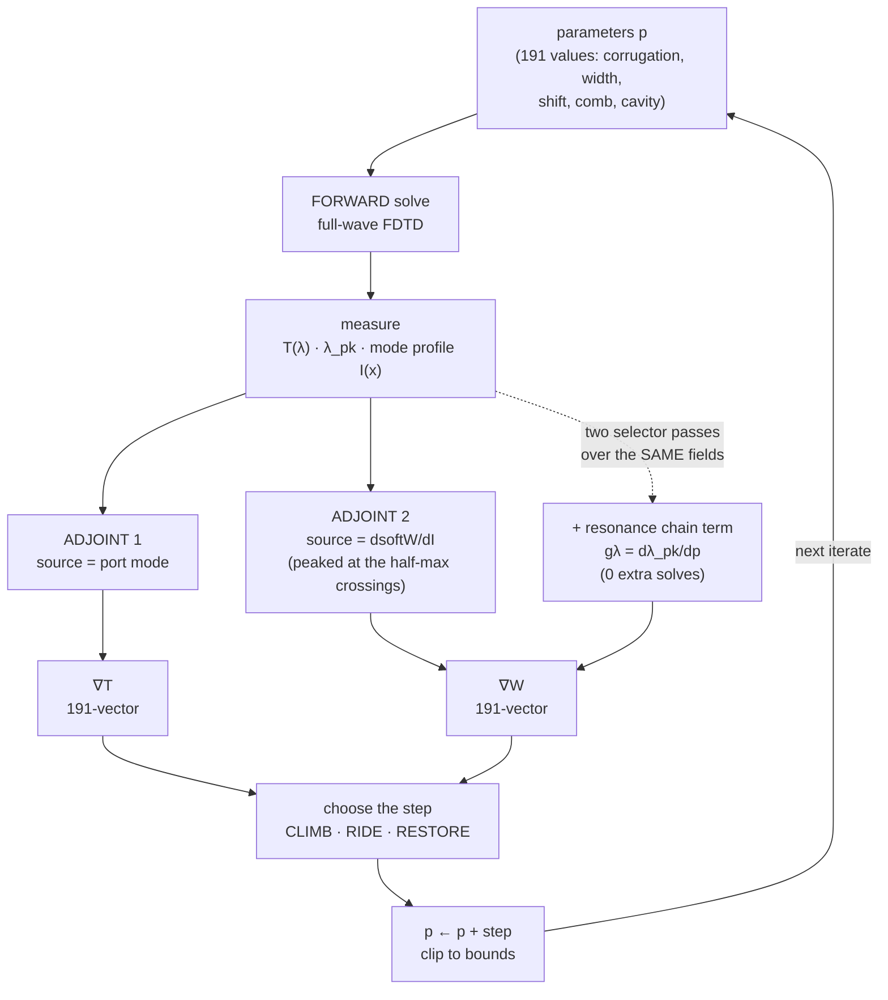

# THE DESIGN, AND THE METHOD — pi-shift Bragg grating, inverse design

> # ⭐ THIS IS THE ONE TO USE
> **If you are handing one file to Claude, hand this one.** It is completely
> self-contained: the method, the design's full 191-parameter vector, the real
> code, the raw data, the run record, and what to do next. It needs no
> filesystem, no cluster, and no other file.
>
> The other two documents in this folder are **not needed alongside it**:
> - `THEORY.md` — the method chapters only. **Entirely contained in this file**
>   (it is the source this file is generated from). Read it only if you are
>   editing the prose.
> - `HANDOFF.md` — the 3200-line operational log: every job ID, every incident,
>   the full trap history. For a **Claude Code session with cluster access**
>   that is about to run something. Not useful in a chat window.


**What this file is.** The handoff for the inverse-design programme. `HANDOFF.md` is *state* — jobs, numbers, what to run
next. This is the *explanation*: the device we have built, why we are doing
inverse design at all, why a single cost function provably cannot do this job,
and what our algorithm actually does instead.

Diagrams: §7 specifies what to draw and how. Every number is **MEASURED** (from a named file),
**DERIVED**, or flagged as **THEORY**.

---

## 1. Two tracks, and where each one stands

The programme runs on two legs, and they answer different questions.

### Track A — the design we actually have  ✅ *this is the asset*
A **parametric device**: the geometry is described by tables of per-tooth
values (corrugation, mean width, longitudinal shift) plus a comb of flanking
posts and a cavity width. It was brought to its current performance by
**successive hand-guided adjustment** — reading the mode width `σ` and the
transmission after each change, adjusting the tables, re-measuring. Not a
black-box optimizer run; a physicist steering a parametric model.

**It works.** MEASURED, and currently being validated further (see §7).

### Track B — the inverse design  🔧 *this is the method under construction*
Adjoint-based optimization over all 191 parameters at once. The goal is to do
in a machine loop, and better, what Track A did by hand — and, crucially, to
do it **while holding the mode width on spec**, which is the part that has
made this hard.

★**Track A is the deliverable. Track B is the multiplier.** Nothing in Track B
is required for the device to exist; it is required for the device to get
substantially better without spending months of hand-tuning per iteration.

---

## 2. The device we have

**Physics.** A pi-shift Bragg grating in SiN (`n_core = 1.97`,
`n_clad = 1.444`), core height 350 nm, pitch 516.83 nm, TM polarization. The
corrugation opens a photonic bandgap; a half-period defect at the centre puts
one resonant mode inside that gap. Resonant light tunnels through; the rest of
the stopband reflects.

**What we optimize for.**
- **Transmission `T` at resonance.** `1 − T` is cavity loss — resonant energy
  radiated out of the guide instead of transmitted.
- **Spatial mode width `W`** — FWHM of the resonant field envelope along `x`,
  in µm. This is the **sensing aperture** for the acousto-optic application.

★**The width is a HARD, TWO-SIDED SPEC.** The detector must overlap an
acoustic field of a given extent, so a *narrower* mode is off-spec, not a
bonus. This one fact is what makes the problem non-trivial — remove it and you
simply lengthen the cavity until radiation vanishes.

### The best design we hold — `BEST_T9636`
Full 191-parameter vector stored in `best_designs.py` (never re-pasted;
import it). Origin: v2 campaign, Athena job 136465, eval 12, **converged**
(evals 10–12 identical to 5 decimals; the optimizer took a zero step).

| quantity | PVA mesh (design numerics) | conformal mesh (spec numerics) |
|---|---|---|
| **Transmission T** | **0.96361** | **0.97805** |
| resonance λ | 1566.444 nm | 1560.907 nm |
| mode width (FWHM) | 18.353 µm | 19.008 µm |
| loaded Q | 2021.6 | 1714.2 |
| intrinsic Q | — | **155 358** |

Geometry at that point: mean corrugation 357.95 nm, cavity width 961.1 nm,
cavity elongation `2·Σshift` = 132.6 nm, winner comb.

**Cavity loss `1−T` fell from 0.0717 at the uniform origin to 0.0220** — a
**−69%** reduction — while the mode width was *kept* (−0.88% vs origin, i.e.
slightly narrower, comfortably in band).

★**The two mesher columns are not interchangeable.** PVA and conformal are
different discretizations; the same device reads λ +5.3 nm and FWHM −8% apart
between them. Never compare a number across meshers. What *does* transfer is
the **ranking** — origin < see-saw < best holds under both — and that was
verified before any conformal number was quoted.

---

## 3. Why we are doing inverse design

Hand-tuning worked, but it explores a 191-dimensional space one or two
coordinates at a time, guided by intuition about which knob does what. The
adjoint method gives the derivative with respect to **all 191 parameters for
the cost of two simulations**, not 191. That is the whole promise: full-space
descent at fixed simulation budget.

The obstacle is not getting a gradient of `T`. That part has worked for a
while. The obstacle is the **constraint**.

---

## 4. ★ The cost functions we tried, and why each one failed

This section is the heart of the document. Three figures of merit were tried in
sequence; each failed for a *different structural reason*, and understanding
those reasons is what produced the current method.

### 4a. Attempt 1 — σ, the second-moment width  ❌ *the constraint could not see the violation*

The first width measure was **σ**, the RMS width of the intensity profile:

```
σ = sqrt( ∫ (x−µ)² I(x) dx  /  ∫ I(x) dx )        (sigma_of_line, :1720)
```

It is the obvious choice: one line of code, smooth, differentiable, no
peak-finding. **It does not work, and the way it fails is instructive.**

σ is a *second moment*, so it is dominated by the profile's **tails and bulk**.
The spec quantity — FWHM — is set by where the envelope crosses half its peak.
Apodization, which is exactly what the optimizer does to suppress radiation,
reshapes the envelope *near the half-max* while leaving the far tails much as
they were. So the optimizer could reshape the mode substantially and σ would
barely register it.

**MEASURED:** against the true `fwhm_env`, σ is **24 percentage points** off,
and a peak-ratio measure is 21 pp off, where the later soft-level-set measure
tracks it to **≤2 pp**. That is not a calibration error — it is a different
quantity.

**Consequence, and it is the worst kind:** the optimizer bought transmission
*with width*, and **σ hid it.** Both design lineages went width-buying while
the constraint reported healthy. The recorded best had grown **+14.9%** in
true width — a flat spec violation — while the FOM was satisfied throughout.

**A second, compounding failure.** To make σ cheap inside the loop it was
replaced by a *fitted linear surrogate*:

```
σ̂  =  17.49  +  0.0051·(2Σshift)  +  0.109·(w_cav − 800)      [µm; nm inputs]
```

Fitted at one operating point, used everywhere. It **overstated corrugation's
width authority by ~30%**, so it labelled trade rows "width-neutral" that were
actually spending a third of the remaining band — and it **falsely rejected a
genuinely in-band design at T 0.9591.**

★**The rule that came out of this, now enforced in code**
(`check_sigma_surrogate`, `:887`): *if a surrogate can be checked against a
real measurement on the very same evaluation, check it there, every time, and
make the disagreement loud.* Both numbers are already in hand, so it costs
nothing — and it converts a silent modelling error into a visible one. This is
why the current method logs `wg_resid_um` on every single evaluation.

### 4b. Attempt 2 — a single combined cost function  ❌ *the mode kept expanding*

Next: keep the honest width measure, and fold it into one scalar objective with
a penalty on violating the band:

```
J  =  J_T  −  μ · penalty(W)
```

then tune `μ`. **This is the attempt whose failure is most worth explaining,
because the symptom was unmistakable: run after run, transmission rose and the
mode widened — monotonically, not erratically — until the device left the band
and the campaign was worthless.** Two full campaigns ended that way.

It is tempting to read that as "μ was mistuned". It is not. There are three
structural reasons, and no value of μ fixes any of them.

**Reason 1 — a scalar fixes the exchange rate before you know the landscape.**
Collapsing two goals into one number means committing, in advance, to how much
width a unit of transmission is worth. Every subsequent step trades at that
rate. Too small and the width runs away; too large and the optimizer stalls
against the penalty and stops finding transmission. There is no correct value,
because the true marginal trade *varies across the space* — and the shadow
price we now log confirms it varies by more than an order of magnitude.

**Reason 2 — a deadband penalty prices nothing inside the band. ★This is the
direct cause of the observed expansion.**
The spec is two-sided with a ±2% deadband. Inside that band the penalty is
*identically zero*, so the width is **completely unpriced**. Meanwhile widening
almost always buys transmission. So the gradient of `J` inside the band is
simply the gradient of `T` — and it points, reliably, toward a wider mode. The
optimizer drifts to the edge because nothing opposes it, crosses, gets shoved
back by the now-active penalty, and thrashes at the boundary.

**Monotone widening is not a bug in the tuning; it is the exact behaviour this
formulation specifies.**

**Reason 3 — a scalar penalty can be blind to entire directions.**
A penalty acts through whatever quantity it is written on. The tooth-level wall
was found (audit, 2026-08-24) to be **rank-deficient**: it priced only the
*mean* corrugation, leaving the **see-saw** direction — alternating corrugation
up and down at fixed mean — completely unpriced. The optimizer walked freely
along the one direction the constraint could not see. A scalar sees a scalar;
the constraint is a 191-dimensional object.

### 4c. What the two failures have in common

Attempt 1 failed because the constraint **could not measure** the violation.
Attempt 2 failed because the constraint **could not price** it in the region
where it mattered. Both are failures of *compressing the constraint into one
number* — first into a bad scalar, then into a good scalar that is still a
scalar.

★**Conclusion: transmission and width must remain SEPARATE objectives with
SEPARATE gradients.** That is what the current method does, and §5 is why
that buys something a scalar never can.

## 5. ★ What separate objectives buy — and why it costs a second adjoint

This is the finding that reorganized the whole programme, and it came from
watching the earlier inverse-design runs fail in a *consistent* way.

**The observation.** Run after run, the optimizer raised transmission and
**the mode kept widening.** Not erratically — monotonically, every campaign,
until the device left the width band and the run was worthless. Two full
campaigns ended out of band that way.

The natural first response is to add a penalty: optimize

```
J  =  J_T  −  μ · penalty(W)
```

and tune `μ`. We did that. It does not fix the problem, and it is worth being
precise about *why*, because the reasons are structural rather than a matter of
tuning harder.

**Reason 1 — a scalar objective fixes the exchange rate in advance.**
Collapsing two goals into one number means committing, before you know the
landscape, to how much width a unit of transmission is worth. Every step then
trades at that rate. Too small a `μ` and the width runs away; too large and the
optimizer stalls against the penalty and stops finding transmission. There is
no correct value, because the true marginal trade varies across the space.

**Reason 2 — a deadband penalty prices nothing inside the band.**
Our constraint is two-sided with a ±2% deadband. Inside the band, the penalty
is identically zero — so the width is **completely unpriced**, and the
optimizer is free to drift toward the edge because widening usually *does* buy
transmission. Then it crosses the edge, gets shoved back, and thrashes. The
observed monotone widening is exactly what an unpriced-until-violated
constraint produces.

**Reason 3 — a scalar penalty can be blind to whole directions.**
A penalty acts through whatever surrogate quantity it is written on. An earlier
width wall was found to price only the **mean** corrugation, which left the
*see-saw* direction — alternating corrugation up and down at fixed mean —
completely unpriced. The optimizer walked freely along the direction the
constraint could not see. A scalar sees a scalar; the constraint is a
191-dimensional object.

★**The conclusion: transmission and width must stay SEPARATE objectives with
SEPARATE gradients.** Not blended into one number.

---


Keep `∇T` and `∇W` as two distinct 191-vectors. Now you can do something a
scalar objective can never do: **construct a step that provably does not
change the width to first order.**

```
step  =  α · ( D∇T  −  coef · D∇W ),      coef chosen so that   ∇W · step = 0
```

That is an orthogonal projection of the transmission gradient into the
**null space of the width gradient**. Follow it and, to first order, the width
does not move *at all* — while transmission climbs. No exchange rate is chosen,
because nothing is being traded: we move only in directions the constraint is
indifferent to.

**This is what "we need something that holds the width constant while finding
the gradient" means concretely.** It is not a heuristic — `∇W · step = 0` is
exact, and is verified numerically to 8.3×10⁻¹⁷ in
`gates/gate_projection_local.py`.

**And this is why we need more than one adjoint.** The adjoint source is
`dJ/dfield` — it is *built from the objective*. Transmission and width are
different functionals of the same fields, so:

```
dT/dfield   ≠   dW/dfield        ⇒   different adjoint source   ⇒   a second solve
```

You cannot extract `∇W` from the transmission adjoint by any post-processing;
the information is not in there. Hence **two adjoint solves per iterate** — one
driven by the port mode, one driven by a weighted field-region source.

★A pleasing physical detail: the width adjoint's source profile is literally
`dsoftW/dI`, which is sharply peaked **at the two half-max crossings of the
envelope**. The width gradient is asking *"how do I move the half-max
points?"*, and its source sits exactly there.

★**The trade this makes explicit:** the ratio `λ = (∇T·D∇W)/(|D∇W||∇W|)` — the
*shadow price* — is logged every iterate. It is the marginal transmission
available per unit width spent. With a scalar penalty this quantity is buried;
here it is a readout, and it tells you when the constraint has genuinely
stopped being affordable.

---

## 6. What the algorithm actually does

### 6a. The parameters (191)
All in nm. `N_FREE = 25` free periods per side, `N_COMB = 57` posts.

| slice | n | meaning |
|---|---|---|
| `SL_CORR` 0:25 | 25 | corrugation depth per tooth — sets local coupling κ; apodization lives here |
| `SL_AVG` 25:50 | 25 | mean tooth width — sets local effective index / detuning |
| `SL_SHIFT` 50:75 | 25 | per-tooth longitudinal shift; the cavity absorbs `2·Σshift` |
| `SL_R` 75:132 | 57 | comb post radii |
| `SL_X` 132:189 | 57 | comb post positions |
| `I_DCOMB` 189 | 1 | comb transverse offset |
| `I_CAV` 190 | 1 | cavity width — the most width-efficient lever measured |

Only the innermost 25 periods are free; the outer ones are pure mirror and the
surrogate `N` is chosen so the mirror is already effectively infinite
(`2κL ≳ 3.5`).

### 6b. The transmission objective
A **windowed power-mean** over the recorded spectrum:

```
J_T = ( mean_{i ∈ window} |T_i|^12 )^(1/12),   window = |λ_i − λ_pk| ≤ 2.5·FWHM
```

*Soft-max, not `max`*: a hard maximum has zero gradient at every non-maximal
sample and its argmax jumps between grid points as the resonance drifts — the
optimizer would see a staircase. *Windowed*: the global maximum of `T(λ)` sits
in the passband, not at the defect resonance, so an unwindowed objective
optimizes the wrong feature entirely.

### 6c. The width: one observable, one differentiable carrier
- **`fwhm_env`** — the spec quantity, built by fitting a cubic envelope through
  the standing-wave peaks. Identical by construction to the programme's stored
  `fwhm_m`. **Not differentiable** (peak-picking, interpolation).
- **`softW`** — a smooth surrogate: smooth the profile, take a soft-max peak
  and an edge-window floor, form a sigmoid indicator of "above half-max", and
  integrate it. Differentiable end to end, so it can drive an adjoint.

They are tied by a **delta anchor** measured at one reference point, and the
residual between prediction and measurement is logged **every evaluation** with
a loud warning if it drifts. Carry the surrogate, but keep the real observable
beside it.

★All branch decisions are made on the **MEASURED** `fwhm_env`, never on the
surrogate. The surrogate only ever supplies a *direction*.

### 6d. One iterate, start to finish
```
1. forward solve at p                    → T(λ), field profile I(x)
2. measure λ_pk, FWHM, fwhm_env          → the observables
3. adjoint solve × 2                     → port-driven and width-driven fields
4. assembly pass 1  → ∇T
   assembly pass 2  → ∇W                 (same fields, zero extra solves)
5. choose the branch on MEASURED width:
      W below target − margin/2  → CLIMB   step = α·D·∇T, clipped so it lands
                                            exactly on the ceiling, never over
      W within the margin        → RIDE    the null-space step: ∇W·step = 0
      W above target + margin/2  → RESTORE step straight back along ∇W
6. clip to the bounds box; cap the step
7. accept or reject on a filter over (transmission, distance-to-target);
   on reject, re-step from the last accepted point at half the step length
   using its STORED gradients — no re-solve
8. log everything; persist for resume
```

**The strategy is deliberately ceiling-riding**: sit just under the maximum
allowed width and spend the whole allowance on transmission, rather than
hugging the seed width and leaving performance unclaimed.

### 6e. Two engineering results that made this affordable
- **The width adjoint runs on GPU via source tiling.** The full-width source
  was rejected by a per-source CUDA launch bound; splitting it into 4 narrow
  sources enabled in **one** solve is *exact* (sources superpose linearly, the
  gradient is linear in the adjoint field). MEASURED: **~1.8 h/gradient on GPU
  vs 8.7–12.1 h on CPU.**
- **`∇T` and `∇W` come from the same solved fields at zero extra cost**,
  because the gradient assembly is linear in the objective's Jacobian — re-run
  the assembly with a different objective selector and you get a different
  component out of the same physics.

---

## 7. Diagrams — what to draw, and how

Two pictures carry this whole method. They are the analogue of the standard
neural-network training diagram, and they answer two different questions.

### 7a. The optimization loop  *(the "training loop" picture)*

Same role as a forward/backward-pass diagram in a network: it shows what is
computed, in what order, and where the gradient comes from. The point to make
visually is that **one iterate = three solves and two gradients**, and that the
resonance-chain term rides along for free.



**What a reader should take from it:** the two adjoints are *parallel and
independent* — that is the visual argument for why one cost function cannot
work. If T and W were combined into a scalar, there would be only one adjoint
box, and no way to construct a width-preserving direction downstream.

### 7b. The projection geometry  *(the picture that actually explains the method)*

This is the money diagram. Draw it in the 2-D plane spanned by `∇T` and `∇W` —
a slice through the 191-dimensional space:

```
            ↑ ∇W  (direction that widens the mode fastest)
            │
  W = W_hi  ├╌╌╌╌╌╌╌╌╌╌╌╌╌╌╌╌╌╌╌╌╌╌╌╌╌╌╌╌╌╌╌╌  ← the CEILING (hard spec)
            │
            │        ∇T ↗            ← raw transmission gradient:
            │       ↗                   climbing it walks INTO the ceiling
            │      ↗
  W = W_tgt ├╌╌╌╌╌●━━━━━━━━━▶ d      ← the PROJECTED step: the component of
            │     ┊         ↖           ∇T with all of its ∇W content removed.
            │     ┊          ╲          ∇W · d = 0  EXACTLY.
            │     ┊           ╲      ← what was subtracted: (∇T·û)û
            │     ┊
            │   contours of constant T ──────
            └──────────────────────────────────────────→
                                          (all other directions)
```

**How to draw it, concretely:**
1. Horizontal axis = "everything else"; vertical axis = `∇W`, the width
   direction. Any 2-D slice is a lie in 191-D, but *this* slice is the honest
   one, because the projection only ever acts in the plane of `∇T` and `∇W`.
2. Draw two horizontal dashed lines: the **target** width and the **ceiling**
   (target + margin). Shade above the ceiling as forbidden.
3. Draw `∇T` as an arrow with a clear upward component — that is the whole
   problem in one stroke: *the direction that most improves transmission also
   widens the mode.*
4. Draw the projected step `d` as strictly horizontal. Draw the removed
   component as a faint vertical arrow, labelled `(∇T·û)û`.
5. Optionally add faint contours of constant `T` so the reader sees `d` still
   climbing them, just more slowly than `∇T` would.

**The one sentence the diagram must land:** *we give up some transmission per
step in exchange for spending exactly zero width.*

### 7c. A third panel worth having — the failure being fixed

To show the resonance-chain defect visually, draw the **same** geometry twice
side by side:

- **left, "what the optimizer believed":** `∇W` drawn at fixed wavelength, and
  `d` correctly perpendicular to it.
- **right, "what was true":** the *real* width gradient rotated away from the
  drawn one by the unpriced `(dW/dλ)(dλ_pk/dp)` term — so the same `d`, which
  looks perpendicular on the left, has a visible upward component on the right.

That single rotation is the entire defect, and it explains why the width crept
up by a small amount every iterate while the projection reported `∇W·d = 0`.

### 7d. Data figures worth plotting (from stored logs, no new simulation)
- **W against λ_pk**, both baselines, with fit lines — the coupling finding.
  Data and slopes come straight from `gates/derive_dwdlam.py`.
- **Mode envelope `I(x)`**, uniform origin vs `BEST_T9636`, overlaid, with the
  FWHM marked on each — shows the width was *kept* while loss fell 69%.
- **T(λ)** for the same pair — shows the resonance sharpening.
- **Width trajectory per iterate**, uncorrected control vs corrected run — the
  before/after of the fix, once a corrected run exists.

---

## 8. Where each track stands right now

**Track A — validating, and running as of this writing.** The design is being
confirmed under the spec mesher and pushed along an `N`-ladder toward the
production device. Two jobs were RUNNING on IGUM at the time of writing
(`63540_3`, `63595_4`). The conformal re-measure already gave **T 0.97805 at
N=100** with the mode width kept, and the mesher ranking-transfer question that
gated quoting conformal numbers has been settled.

**Track B — the constrained optimizer is not yet delivering.** Honest status:
the projected method runs, the GPU width gradient works, but the loop has not
yet produced a width-controlled improvement we would stand behind. The most
recent understanding — that a large part of the observed widening was the
**resonance drifting**, and that the width gradient was being evaluated at a
frozen wavelength and so could not see it — has a correction implemented and
gated offline, but it **has not completed an iterate on hardware**. Treat it as
unproven.

★**This does not weaken Track A.** The device stands on its own measurements.

---

## 9. What is genuinely open

- **Can a machine-driven run reach a `BEST_T9636`-class design on its own?**
  If yes, the earlier stalls were mispriced constraints, not a rugged
  landscape.
- **Is there a *family* of equally good designs, or is this a needle?** Its
  corrugation profile drops abruptly at the edge of the free region — physical,
  or an artifact of where we froze the parameters?
- **Can transmission rise at genuinely fixed resonance?** ★Not answerable from
  the runs we have: transmission and resonance wavelength are 0.996-correlated
  in them, so the two cannot be separated. The corrected optimizer is precisely
  the experiment that decides it — **and a negative answer is a real result**,
  telling us the two are physically locked for this device.
- **Will `BEST_T9636` survive the production device** at the full period count
  and the fine mesh, outside the optimizer's own builder?

---

## 10. ★ The route we have NOT taken yet — a proper augmented Lagrangian

§4b rejected a *fixed-μ penalty*. An **augmented Lagrangian** is not that, and
it is the strongest alternative to the projection method. It deserves a fair
statement, because parts of it are already built.

### 10a. What it is, and why it escapes §4b's Reason 1
Instead of guessing an exchange rate, AL **learns the correct one**. It carries
explicit multipliers `λ_hi`, `λ_lo` alongside a quadratic term:

```
J = J_T − [ λ_hi·max(0, g_hi) + ½μ·max(0, g_hi)²
          + λ_lo·max(0, g_lo) + ½μ·max(0, g_lo)² ]

  g_hi = fhat − 1.02·f0        (over the band)
  g_lo = 0.98·f0 − fhat        (under the band)
```

After each inner solve the multipliers are updated on the **measured**
violation:

```
λ_hi ← max(0, λ_hi + μ·g_hi)          (and likewise λ_lo)
```

That update is the whole point. At convergence `λ` equals the true shadow price
of the constraint — the exchange rate is *discovered*, not assumed. Reason 1 of
§4b dissolves. And unlike a plain penalty, AL does not need `μ → ∞` to enforce
the constraint exactly, so it stays well-conditioned.

### 10b. What is already implemented
`width_band_penalty` (`:1811`) and the multiplier update (`:2472`) exist, and
the knobs are on `CampaignSpec`: `wg_mu = 8.0` (per µm²: 0.05 µm over-band ⇒
0.01 FOM), `wg_lam_hi = wg_lam_lo = 0.0` initially. So the *ingredients* are
there; what is missing is the outer loop that makes it an AL method rather than
a penalty with an unused multiplier.

### 10c. ★ What would need to be done — concretely
1. **Fix defect #19 first.** ★AL uses `∇W` exactly as the projection does, so
   it inherits the *same* frozen-wavelength error. An AL run on the uncorrected
   gradient would chase a constraint it is mis-measuring, and would fail in the
   same direction. **This is a prerequisite, not a detail.**
2. **Build the outer loop.** Inner solve to loose tolerance → update `λ` on the
   measured violation → tighten. Currently the update fires per restart, which
   is incidental rather than a schedule.
3. **Escalate μ only on stall.** Standard rule: if the violation did not fall
   by ~25% over an outer iteration, `μ ← 2μ`; otherwise leave it. Escalating
   every round destroys conditioning.
4. **Decide inner tolerance.** AL is only cheap if the inner problem is solved
   loosely early on. With ~2.4 h per iterate, the natural budget is 3–5 inner
   iterates per outer round.
5. **Keep the honest readout.** Multipliers must be updated on **measured**
   `fwhm_env`, never the surrogate — that is precisely how the σ̂ wall went
   wrong (§4a).
6. **Reason 3 still applies.** AL fixes the *exchange rate* problem, not the
   *rank-deficiency* problem. If the penalty is written on a quantity blind to
   a direction (the see-saw case), AL will be blind to it too. Write the
   constraint on the honest width, not a reduced surrogate.

### 10d. How to choose between AL and the projection
They are not really rivals; they answer different questions.

| | projection (current) | augmented Lagrangian |
|---|---|---|
| width held | exactly, to first order, every step | approximately, converging |
| exchange rate | never needed | discovered via `λ` |
| cost | 2 adjoints/iterate | **1 adjoint/iterate** — a combined scalar |
| best when | the spec is hard and you want to ride the ceiling | you want the true trade-off curve |

★**The one-adjoint saving is real and is AL's strongest argument** (~−33% per
iterate). But note it is a *consequence* of recombining into a scalar — and
therefore it is **incompatible with the projection**, which needs `∇T` and `∇W`
separately to build the null space. Choose the formulation; you cannot have
both the null-space guarantee and the single-adjoint cost.

**Recommendation for whoever picks this up:** validate the corrected gradient
on the projection first (it is instrumented, gated, and one short run from an
answer). If the projected `‖∇T‖` collapses — i.e. transmission and width really
are locked — then the trade-off *curve* is the interesting object, and AL is
the right tool to map it.

---

## 11. ★ What happens next

Read this together with §8 (where each track stands) and §9 (the open
questions). This section is the *plan*, ordered, with **who can actually do
each step** — that matters, because not every reader of this document has the
same powers.

### 11a. Who can do what

| capability | Claude in a chat window | Claude Code session | must be a human |
|---|---|---|---|
| reason over the data in the appendix | ✅ | ✅ | |
| design the next experiment | ✅ | ✅ | |
| read repo files / run the gates | ❌ | ✅ | |
| ssh to Athena or IGUM, dispatch, fetch | ❌ | ✅ | |
| commit, deploy | ❌ | ✅ | |
| approve a §2 numerics change | ❌ | ❌ | ✅ |
| decide the formulation (projection vs AL) | ❌ | ❌ | ✅ |

★**If you are reading this in a chat window, you cannot run anything.** That is
fine — most of the valuable work left is *analysis and design*, and the
appendix was built precisely so you can do it without tools. See §11d.

### 11b. The ordered sequence — for whoever has cluster access

**1. Fetch the IGUM results first.** ⚠️ *Before anything else.*
The conformal / q3db ladder was still running at the pause (jobs 63423, 63438,
63540, 63595). Those results exist **nowhere else** — a cluster holding the only
copy of anything is the one situation this programme treats as an emergency.
They belong to Track A, the deliverable.

**2. Resolve the `bragg_device.py` mesh question.** ⚠️ *Blocking for Track B.*
A parallel session changed the fine-mesh y-span to size from
`max(width_wide_per_tooth_m)` rather than the scalar width. It is a genuine bug
fix — the old behaviour ate 448 nm of PML standoff and inflated T above 1 — but
it is a **§2 named-numerics change** on a shared file, and the stored control
(job 137075) ran *before* it. For the current seed both widths agree (0.9625 µm)
so the domain is unchanged there; divergence appears only once a tooth is drawn
wider than the scalar, which is exactly what a per-tooth optimizer does.
**Needs: a scene-snapshot diff against the committed references, and a decision
on whether the control must be re-measured.**

**3. Run the offline gates.** Six of them, all local, all seconds, zero GPU.
They must all pass before any dispatch. Expected outputs are stated in
`HANDOFF.md`.

**4. Dispatch the 3-iterate validation toy.** ~9 h, one task.
★**This is a prerequisite, not the first item in a queue.** The production
campaign is configured and ready at 30 iterates — roughly 81 GPU-hours — on a
gradient that has **never completed a single iterate**. Do not skip to it.

**What the toy decides**, in order of what to look at:
- Does the resonance-chain term *execute*? Look for `gLam_n` present in the
  proj log with **no** `λ-CHAIN SKIPPED` line. If it skipped, nothing else in
  the run means anything.
- Does predicted `gλ·dp` match the measured `Δλ_pk`? The control drifted about
  **+0.04 nm per iterate**; a correct chain term should predict that.
- Does `ΔW` per iterate fall below the control's **+0.0110 / +0.0122 µm**?
- ★**The falsification test:** does the projected `‖∇T‖` collapse toward zero?
  If it does, transmission and width are **genuinely locked** for this device.
  That is a real physical result, not a failure — and it arrives in ~5 GPU-hours
  instead of a wasted multi-day campaign.

**5. Only then, the production campaign** — and only if step 4's verdict
supports it.

### 11c. Decisions that need a human

- **Projection or augmented Lagrangian?** (§10) They are not interchangeable:
  the projection guarantees zero first-order width change and costs two
  adjoints; AL discovers the true exchange rate and costs one. You cannot have
  both. Recommendation in §10d: validate the projection first, because it is
  one short run from an answer — and if that answer is "locked", the trade-off
  *curve* becomes the interesting object and AL is the right tool to map it.
- **Is Track A's device final?** If the answer is yes, Track B's remaining
  value is scientific rather than practical, and the priority order changes.
- **How much more GPU time is this worth?** Track B has consumed a great deal
  and has not yet produced a width-controlled improvement.

### 11d. What a chat session can do right now, with no tools at all

The appendix contains the real data, so these are all genuinely available:

1. **Re-read the earlier results through the λ-detrend lens.** Every past
   conclusion about "this change widened the mode" was drawn before we knew
   that width tracks resonance at ~0.37 µm/nm. Some of those conclusions are
   probably wrong. The tables in A4 are enough to re-examine them.
2. **Interrogate the design vector in A1.** The corrugation profile, the shift
   distribution, the comb spacing — is the freeze-boundary discontinuity at
   tooth 26 costing anything? Is the shift profile doing what a taper should?
3. **Design the next experiment on paper.** What is the smallest run that
   distinguishes "T and W are locked" from "the optimizer has not found the
   right direction"? Specify it precisely enough that a Claude Code session can
   dispatch it without re-deriving anything.
4. **Sanity-check the method itself.** The derivations in §5, §6 and §10 are
   all written out; a careful reader may well find something wrong. This
   programme has repeatedly been saved by someone checking the algebra rather
   than the code.
5. **Write.** The physics story here — a constraint that turned out to be
   mostly a proxy for something else — is a genuinely interesting result and is
   not yet written up anywhere except these documents.

★**What a chat session should NOT do:** invent numbers, assume a run happened,
or claim the λ-chain fix works. It has never completed an iterate on hardware.
Everything about it in this document is *implemented and gated offline*, which
is not the same as *validated*.

---

---

# APPENDIX - everything a chat session cannot fetch for itself

**Read this first if you are Claude in a chat window.** You have no filesystem,
no cluster access, and no git. Everything below was extracted from the
repository and the clusters at the moment of the pause so that it is available
to you directly. Nothing here needs a tool to verify - it IS the source.

## A1. The design: BEST_T9636, all 191 parameters

Units: **nm** throughout. Layout is
`25 corrugation | 25 mean-width | 25 shift | 57 comb-r | 57 comb-x | d_comb | cavity`.
This is the device. If everything else were lost, this vector plus the geometry
constants in A2 reproduces it.

**Corrugation depth per tooth** (index 1 = innermost, next to the defect):
```
   324.6090,  331.1434,  345.5537,  353.6754,  355.1619,  358.4371,  360.7775,  361.6638
   360.7377,  362.1005,  364.2621,  363.6839,  361.7549,  363.9784,  364.1430,  361.7676
   363.6096,  363.6683,  361.0867,  362.0848,  362.2658,  360.0331,  360.6076,  361.5173
   360.5136
```
**Mean tooth width per period:**
```
   802.0524,  800.7672,  801.1708,  801.2449,  800.9001,  800.6027,  800.4475,  800.2979
   800.0848,  799.9858,  800.0853,  800.1164,  800.0157,  800.1087,  800.2400,  800.1739
   800.2427,  800.3829,  800.3200,  800.3372,  800.4547,  800.4059,  800.3798,  800.4843
   800.4759
```
**Longitudinal shift per tooth** (the cavity absorbs 2*sum(shift)):
```
     3.1648,    2.8142,    4.1996,    5.3510,    5.8762,    6.4260,    6.1177,    5.3444
     4.8927,    3.9847,    3.0441,    2.3053,    1.4661,    0.9110,    0.8981,    0.8905
     0.8902,    0.8972,    0.9087,    0.9250,    0.9467,    0.9688,    0.9954,    1.0262
     1.0551
```
**Comb post radii (57):**
```
    80.1386,   80.0414,   79.9927,   80.0094,   79.9555,   79.8956,   79.9764,   79.9940
    79.8916,   79.9385,   80.0171,   79.9775,   80.0695,   80.2230,   80.2140,   80.2174
    80.3136,   80.2606,   80.0600,   79.8647,   79.6718,   79.5177,   79.5704,   79.9910
    80.3358,   80.3781,   79.8793,   79.9624,   79.8236,   80.1171,   80.5040,   80.2245
    79.7639,   79.5052,   79.5525,   79.7771,   79.9608,   80.1592,   80.3115,   80.3003
    80.2097,   80.2537,   80.1959,   80.0089,   80.0231,   80.0090,   79.8906,   79.9502
    80.0251,   79.9691,   79.9797,   80.0336,   80.0066,   80.0144,   80.1024,   80.0693
    80.1189
```
**Comb post x-positions (57):**
```
  -14466.8801, -13935.9118, -13404.9294, -12873.9369, -12342.9464, -11811.9656, -11280.9779, -10749.9702
  -10218.9796, -9688.0030, -9157.0101, -8626.0154, -8095.0408, -7564.0577, -7033.0287, -6502.0370
  -5971.0439, -5439.9831, -4908.9245, -4377.8500, -3846.7888, -3315.7355, -2784.7886, -2253.9653
  -1723.4231, -1192.5526, -660.8861, -129.7193,  400.5411,  932.1049, 1463.6639, 1994.2420
  2524.8572, 3055.7440, 3586.7747, 4117.8391, 4648.8792, 5179.9316, 5711.0225, 6242.0319
  6773.0300, 7304.0480, 7835.0496, 8366.0289, 8897.0155, 9428.0128, 9958.9935, 10489.9750
  11020.9720, 11551.9734, 12082.9646, 12613.9540, 13144.9542, 13675.9462, 14206.9209, 14737.9290
  15268.9024
```
**Comb transverse offset d_comb:** 1897.3711 nm
**Cavity width:** 961.0659 nm

**Note the shape of the corrugation profile** - it answers a standing question.
It runs **324.61 at the innermost tooth, rises to ~364 mid-array, and is 360.51
at tooth 25** - then **jumps down to the frozen 325.0** for every tooth from 26
outward. So the "abrupt drop to 325" is the **freeze boundary**, not a feature
the optimizer chose: teeth 26+ were never free. Whether that discontinuity
costs anything is genuinely open - it is a candidate explanation for residual
radiation, and freeing a few more teeth is a cheap test.


## A2. Geometry and numerics constants

| constant | value | meaning |
|---|---|---|
| n_core | 1.97 | SiN |
| n_clad | 1.444 | SiO2 |
| core height | 350 nm | |
| PITCH_NM | 516.83 | grating period |
| CORR_NM | 325.0 | FROZEN corrugation of the outer (non-free) teeth |
| N_FREE | 25 | free periods per side |
| N_COMB | 57 | comb posts (COMB_N_HALF = 28) |
| N_PARAMS | 191 | total design variables |
| P_SOFTMAX | 12.0 | soft-max exponent in the T objective |
| WIN_FWHM_MULT | 2.5 | objective window = +/-2.5 x measured FWHM |
| DEAD_T_FLOOR | 0.02 | dead-device guard (a dead device reads ~0.0008) |
| TWO_KL_FLOOR | 3.5 | mirror-strength floor 2*kappa*L |
| RHO_UP / RHO_DN | 1.02 / 0.98 | symmetric +/-2% width deadband |
| WG_EPS | 0.05 | sigmoid temperature, fraction of (peak-floor) |
| WG_BETA_PK | 60.0 | soft-max peak sharpness |
| wg_dwdlam | 0.3655 um/nm | resonance->width coupling (FITTED, not universal) |
| FWHM0_UM | 18.3460 | anchor width |
| SOFTW0_UM | 18.476441 | anchor softW at the same eval |
| W_HI / W_TARGET | 18.7129 / 18.6129 um | ceiling and ride target |
| MARGIN_UM | 0.10 | restore/ride band half-width |
| domain y-span | 6.800 um | fixed by override |
| domain z-span | 6.8275 um | 350 nm core + 4.14*lambda pad |
| port -> PML | 5.0 lambda ~ 7.82 um | |
| production spectrum | 501 pts over 10 nm = 20 pm | = 40 pts per ~810 pm linewidth |

The spectrum resolution is **exactly** at the minimum the resonance-chain term
needs (~40 points per linewidth). Widening the scan window without adding
points silently degrades the chain term.


## A3. The code that defines the method

These are the actual definitions, not paraphrases.

**The transmission objective (make_fct):**
```python
def make_fct(wl_nm):
    """FOM fct for lumopt2: T(λ) → windowed soft-max (autograd-differentiable).

    Window indices are picked on the DETACHED spectrum (stop-gradient), so
    the gradient flows only through the T values inside the window.
    """
    wl_nm = np.asarray(wl_nm, dtype=float)

    def fct(T):
        Tp = np.abs(_plain(T))
        lam_pk, t_pk, fwhm = measure_peak(wl_nm, Tp)
        if t_pk < DEAD_T_FLOOR:
            raise RuntimeError(f"dead device: peak T {t_pk:.4g} < {DEAD_T_FLOOR}")
        if fwhm is None:
            # Peak clipped at the band edge (measured: line-search probes jump
            # λ by up to +2.6 nm — jobs 54309/133016/54421 all died here when
            # this raised RecenterNeeded for MID-SEARCH probes). Degraded
            # fallback instead: soft-max over the FULL recorded band. A
            # clipped peak's visible maximum understates the true peak, so
            # the probe scores WORSE and L-BFGS-B backtracks naturally.
            # Recentering is handled by the log callback, and only when the
            # BEST design migrates (in-window evals are bit-identical).
            return anp.mean(anp.abs(T) ** P_SOFTMAX) ** (1.0 / P_SOFTMAX)
        idx = np.where(np.abs(wl_nm - lam_pk) <= WIN_FWHM_MULT * fwhm)[0]
        return anp.mean(anp.abs(T)[idx] ** P_SOFTMAX) ** (1.0 / P_SOFTMAX)

    return fct
```

**The width observable** - the spec quantity, NOT differentiable:
```python
def fwhm_env_of_line(x, I):
    """SPATIAL FWHM (µm) — THE width observable, and the only one.

    Cubic envelope through the standing-wave peaks, half-max RELATIVE TO THE
    PROFILE FLOOR, via the sim_helpers functions themselves (not a copy), so
    this is identical to post_processing's fwhm_m by construction. Comparable
    to every stored fwhm_m (nladder corr-325 N=100 bare: 19.24 µm) and to the
    ~20 µm acoustic spec.
    ★USER RULE 2026-08-18: this convention ONLY. The raw-line variant I had
    written is deleted and must not come back."""
    try:
        env = extract_envelope_peaks(x, I)
        v = calculate_fwhm_relative(x, env)
        return float(v) if v else None
    except Exception:                 # <4 peaks breaks the cubic interp
        return None
```

**The differentiable width carrier (soft_width_of_line)** - this is what the
second adjoint is built from:
```python
def soft_width_of_line(x, I):
    """softW (µm) of a y-integrated profile line — autograd-differentiable in I."""
    x = np.asarray(x, dtype=float)
    Is = anp.dot(_wsmooth_matrix(len(x), float(np.mean(np.diff(x)))), I)
    # scale stays IN the autograd graph: detaching it puts a 2e-3 relative
    # error in the gradient (measured, gate W0.3) because the softmax weights
    # depend on it — a "safe constant" that silently isn't.
    scale = anp.max(Is) - anp.min(Is)
    w = anp.exp(WG_BETA_PK * (Is / scale))
    P = anp.sum(w * Is) / anp.sum(w)                    # softmax peak
    m = max(3, int(0.05 * len(x)))                      # fixed edge windows
    F = 0.5 * (anp.mean(Is[:m]) + anp.mean(Is[-m:]))    # floor
    h = F + 0.5 * (P - F)
    z = anp.clip((Is - h) / (WG_EPS * (P - F)), -60.0, 60.0)
    sig = 1.0 / (1.0 + anp.exp(-z))
    return anp.sum(0.5 * (sig[1:] + sig[:-1]) * (x[1:] - x[:-1]))
```

**The band penalty** (the augmented-Lagrangian term of section 10):
```python
def width_band_penalty(spec, softw):
    """Augmented-Lagrangian band penalty on the anchor-mapped FWHM prediction
    (autograd in softw). Band = the standing +2%/−5% deadband on fwhm0_um."""
    anc, f0 = spec.wg_anchor, spec.fwhm0_um
    fhat = anc["fwhm"] + (softw - anc["softw"])         # µm, delta-anchored
    g_hi = fhat - RHO_UP * f0
    g_lo = RHO_DN * f0 - fhat
    return (spec.wg_lam_hi * anp.maximum(0.0, g_hi)
            + 0.5 * spec.wg_mu * anp.maximum(0.0, g_hi) ** 2
            + spec.wg_lam_lo * anp.maximum(0.0, g_lo)
            + 0.5 * spec.wg_mu * anp.maximum(0.0, g_lo) ** 2)
```

**The projected step** - climb / ride / restore, the core of the method:
```python
def _proj_step(gT, gW, D, W, W_tgt, marg, alpha, step_max_nm):
    """Pure step math for the ceiling-riding projection (HANDOFF 2026-08-24
    23:00) — tested by gate_projection_local.py (P0/clip/restore, zero GPU).
    û lives in the D^{1/2}-scaled space: the only reading of "D = per-block
    trust scales squared" whose null-space step gives ∇W·d = 0 exactly (the
    literal û = D∇W/|D∇W| does not, since D² ≠ D — P0 arbitrates)."""
    gT, gW, D = (np.asarray(v, dtype=float) for v in (gT, gW, D))
    DgW = D * gW
    nu, nW = np.linalg.norm(DgW), np.linalg.norm(gW)
    lam = float(gT @ DgW) / (nu * nW) if nu > 0 and nW > 0 else 0.0
    if W - W_tgt > marg / 2.0:                    # restoration on MEASURED W
        step = -(W - W_tgt) * gW / max(float(gW @ gW), 1e-300)
        phase = "restore"
    elif W < W_tgt - marg / 2.0:                  # PHASE A: climb + clip
        step = alpha * D * gT
        dw = float(gW @ step)                     # predicted ΔW — free
        if dw > 0.0 and W + dw > W_tgt:
            step = step * ((W_tgt - W) / dw)      # land exactly on the ceiling
        phase = "climb"
    else:                                         # PHASE B: null-space ride
        gd = float(gW @ DgW)                      # = |D^{1/2}∇W|²
        coef = float(gT @ DgW) / gd if gd > 0 else 0.0
        step = alpha * (D * gT - coef * DgW)      # ∇W·step = 0 exactly
        phase = "ride"
    m = float(np.max(np.abs(step)))
    if m > step_max_nm:                           # scalar cap keeps ∇W·d = 0
        step = step * (step_max_nm / m)
    return step, phase, lam
```


## A4. The raw data behind every claim in this document

### A4a. Uniform baseline (lumopt2_v2_uniform_s5) - the run that produced dW/dlambda
| # | lam_pk_nm | fwhm_env_um | t_pk | fom | q_i |
|---|---|---|---|---|---|
| 0 | 1564.61402 | 18.34515 | 0.90120 | 0.66722 | 38071.06563 |
| 1 | 1568.22238 | 32.26789 | 0.95577 | -1.55417 | 73475.56666 |
| 2 | 1564.61402 | 18.34515 | 0.90120 | 0.66722 | 38071.06563 |
| 3 | 1564.75404 | 18.38947 | 0.90679 | 0.67159 | 40573.76732 |
| 4 | 1567.61983 | 25.13451 | 0.92575 | -1.32917 | 46374.31222 |
| 5 | 1564.81405 | 18.40917 | 0.90896 | 0.67323 | 41621.22266 |
| 6 | 1566.49631 | 20.37380 | 0.95912 | -0.88372 | 93527.86313 |
| 7 | 1564.81402 | 18.40883 | 0.90924 | 0.67339 | 41751.26152 |
| 8 | 1564.81402 | 18.40883 | 0.90924 | 0.67339 | 41751.26152 |
| 9 | 1564.97404 | 18.45590 | 0.91381 | 0.67703 | 44146.98285 |
| 10 | 1565.15410 | 18.50764 | 0.91858 | 0.68060 | 46904.54285 |
| 11 | 1565.83470 | 18.82672 | 0.93604 | 0.69110 | 60102.39607 |
| 12 | 1565.15410 | 18.50764 | 0.91858 | 0.68060 | 46904.54285 |
| 13 | 1565.15410 | 18.50764 | 0.91858 | 0.68060 | 46904.54285 |
| 14 | 1565.33420 | 18.56424 | 0.92260 | 0.68399 | 49437.26162 |
| 15 | 1565.53437 | 18.62841 | 0.92689 | 0.68729 | 52424.41390 |
| 16 | 1566.25537 | 19.53215 | 0.94644 | 0.19427 | 71503.13074 |

### A4b. See-saw baseline (lumopt2_v2_seesaw)
| # | lam_pk_nm | fwhm_env_um | t_pk | fom | q_i |
|---|---|---|---|---|---|
| 0 | 1564.56402 | 18.33179 | 0.93790 | 0.69590 | 65713.62010 |
| 1 | 1568.55423 | 36.17639 | 0.95808 | -1.52657 | 73291.80996 |
| 2 | 1564.56402 | 18.33179 | 0.93790 | 0.69590 | 65713.62010 |
| 3 | 1564.70404 | 18.34099 | 0.93879 | 0.69679 | 66767.82648 |
| 4 | 1564.88409 | 18.35664 | 0.94033 | 0.69769 | 68628.75997 |
| 5 | 1565.52463 | 18.45968 | 0.94493 | 0.70128 | 74352.01889 |
| 6 | 1565.54403 | 18.45847 | 0.94532 | 0.70111 | 74945.69502 |
| 7 | 1565.54403 | 18.45847 | 0.94532 | 0.70111 | 74945.69502 |
| 8 | 1565.74407 | 18.50358 | 0.94646 | 0.70226 | 76329.06777 |
| 9 | 1565.96416 | 18.62591 | 0.94777 | 0.70296 | 77998.90655 |
| 10 | 1566.66488 | 20.06145 | 0.95732 | 0.24884 | 92898.24396 |
| 11 | 1566.02420 | 18.71486 | 0.94852 | 0.70365 | 79001.81575 |
| 12 | 1565.96416 | 18.62591 | 0.94777 | 0.70296 | 77998.90655 |
| 13 | 1565.96416 | 18.62591 | 0.94777 | 0.70296 | 77998.90655 |
| 14 | 1566.18432 | 18.96297 | 0.95078 | 0.70485 | 82319.38447 |

### A4c. The projected toy - the CONTROL, uncorrected gradient (job 137075_41)
| # | lam_pk_nm | fwhm_env_um | t_pk | fom | q_i |
|---|---|---|---|---|---|
| 0 | 1564.61402 | 18.34515 | 0.90120 | 0.66722 | 38071.06563 |
| 1 | 1564.65402 | 18.35618 | 0.90242 | 0.66829 | 38585.70523 |
| 2 | 1564.69403 | 18.36840 | 0.90430 | 0.66978 | 39419.84587 |
| 3 | 1564.75404 | 18.38451 | 0.90553 | 0.67108 | 39980.78415 |
| 4 | 1564.75402 | 18.38431 | 0.90577 | 0.67117 | 40089.43374 |
| 5 | 1564.75402 | 18.38431 | 0.90577 | 0.67117 | 40089.43374 |

**The coupling fit.** Take rows with `fom > 0.5*max(fom)`, deduplicate identical
(lambda, W) pairs - lumopt2 re-logs the accepted point at each restart, so some
appear 2-3 times - and regress fwhm_env_um on lam_pk_nm:

| baseline | slope | r | n | lambda explains |
|---|---|---|---|---|
| uniform_s5 | **+0.3654 um/nm** | 0.984 | 9 | 93% of its raw width growth |
| see-saw | +0.3000 um/nm | 0.867 | 9 | 77% of its raw width growth |

Both filter clauses are load-bearing. Keeping duplicates, or admitting the one
out-of-band probe (fom 0.194 at W 19.53), moves the slope to ~0.59 - a 61%
error. Do not pool the two baselines (different intercepts => 0.288, wrong).


## A5. Run record

| job | cluster | role | start -> end | ran for | outcome |
|---|---|---|---|---|---|
| 136465 | Athena | v2 projection campaign | - | - | **CONVERGED -> BEST_T9636** |
| 137075_41 | Athena | uncorrected control | 08-25 13:11:06 -> 21:53:33 | 8:42:27 | 3 iterates, kept as control |
| 137267_41 | Athena | lambda-chain, 1st attempt | 08-25 21:56:17 -> 23:59:35 | 2:03:18 | FAILED - selector indexing bug |
| 137296_41 | Athena | lambda-chain, refixed | 08-26 00:06:57 -> 00:56:58 | 0:50:01 | cancelled for the pause |
| 63195_3 | IGUM | conformal re-measure | - | - | T 0.97805 at N=100 |
| 63423 / 63438 / 63540 / 63595 | IGUM | conformal + q3db ladder | - | - | RUNNING at the pause |

**The control's three iterates** - the yardstick any corrected run is judged against:
```
it 0   fom 0.667217   W 18.3452 um   lam_pk 1564.61 nm   |gT| 0.002989   |gW| 0.125902
it 1   fom 0.668293   W 18.3562 um   lam_pk 1564.65 nm   dW +0.0110
it 2   fom 0.669780   W 18.3684 um                       dW +0.0122
```

## A6. State at the pause (2026-08-26)

- **Athena: queue EMPTY.** Nothing of this programme is running. Disk 199G/300G
  (84.6 GB was freed by deleting dead-study .h5 scratch).
- **IGUM: RUNNING** - the separate conformal/q3db ladder. Its results exist
  nowhere else, so fetching them is the first action on resume.
- **The lambda-chain fix is implemented, gated offline, and NEVER validated on
  hardware.** Treat it as unproven.
- **Open, needs a human:** an uncommitted bragg_device.py mesh change from a
  parallel session widens the fine-mesh y-span for per-tooth-width devices. The
  control ran before it. For the current seed the scalar and per-tooth widths
  agree (both 0.9625 um), so the domain is unchanged there - divergence appears
  only once a tooth is drawn wider than the scalar.
- **Not installed:** the fixed h5 cron cleaner on Athena.

## A7. Traps that cost real GPU hours - do not re-learn them

1. **The objective's x is FLAT** - `[T(lam_0)...T(lam_n), softW]`, not a list of
   FOM entries. That is why the width selector is `x[-1]`. Writing `x[0][i]`
   cost 2 GPU-hours.
2. **A math gate is not a plumbing gate.** The formula gate passed at 0.0034%
   while the call path was broken. Drive new derivative code through the real
   framework - and assert the known-bad form still raises, or the gate has no
   teeth.
3. **Count live field sets before adding an assembly pass.** Four instead of two
   doubles peak RAM in a pipeline already OOM-killed at 501 wavelengths.
4. **An automated resume can silently continue the wrong run.** Reusing a study
   label makes the cold-start resume restart from the previous run's endpoint.
5. **State the filter before quoting a fit** (see A4).
6. **Never compare numbers across meshers.** PVA vs conformal, same device:
   lambda +5.3 nm, FWHM -8%.
7. **Absolute T is numerics-sensitive** - the transverse box alone moves it ~3
   points for strongly-radiating variants. Every sweep carries its own control
   at identical numerics.
8. **FDTD here is deterministic** - repeated identical evaluations return
   bit-identical values. "Noise" is almost never the right explanation for a
   discrepancy.

